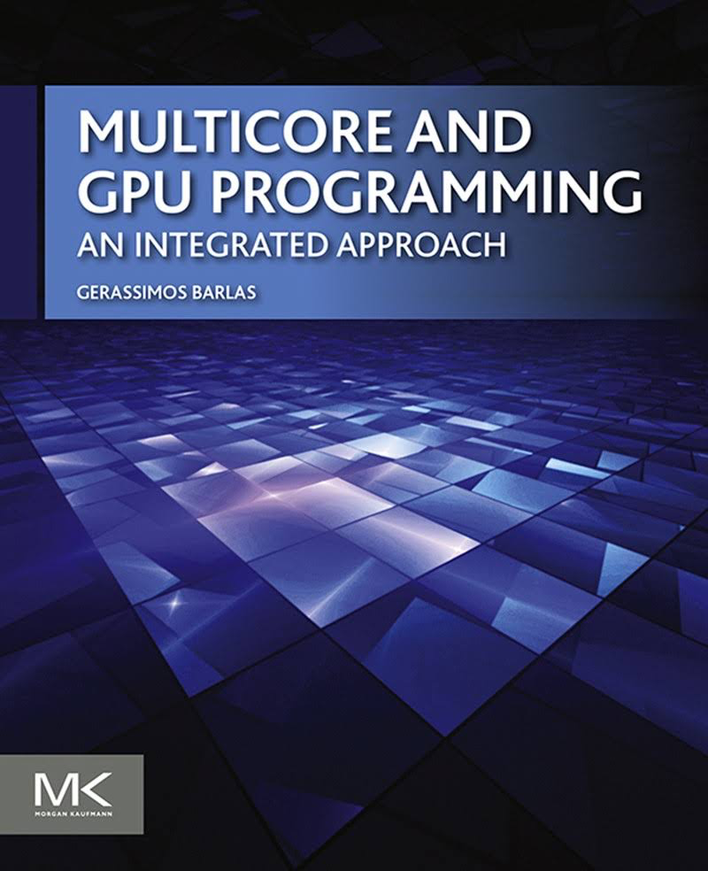

# Multicore and GPU programming 
Jon Macey

jmacey@bournemouth.ac.uk

---

## Text books

---

## Introduction

- The speed that computers can process information has been increasing exponentially.
- [Moore's Law](https://en.wikipedia.org/wiki/Moore%27s_law) is the observation that the number of transistors in a dense integrated circuit doubles approximately every two years.

--

## Effect of Moore's Law

- From the 80's to early 00's we had approx 50% speedup
- More recently we have had less (~20%)
- Clock frequency improves so can skew law (but also hits [limits](https://en.wikipedia.org/wiki/Frequency_scaling))
- Physical (i.e. thermal etc) limits being hit.

--

## Why Parallel Computing?
- Simply adding processors will not magically improve performance.
  - so far most of the programs we have written have been serial
  - even when using frameworks like Qt, we only have two processes (Our App and the GUI)
- Most of the time we have many cores in our CPU doing nothing!

---

## A Taxonomy of Parallel Machines

- Earliest parallel machines were developed in the 60's
- In 1966 [Michael Flynn](https://en.wikipedia.org/wiki/Flynn%27s_taxonomy) introduced a taxonomy of computer architectures where by machines are classified based on how many data items they can process concurrently.

--

## Single Instruction, Single Data (SISD)
- A simple sequential machine that executes one instruction at a time.
- Most modern CPU's don't work in this way
  - it is now more common that even micro-controllers have multiple cores.
- Each individual core is still a SISD system. 

--

## Single Instruction, Multiple Data (SIMD)
- A machine in which each instruction is applied on a collection of items (data).
- [Vector processors](https://en.wikipedia.org/wiki/Vector_processor) were the very first machines that followed this paradigm.
- GPU's also follow this design at the level of the [streaming multi-processor](https://en.wikipedia.org/wiki/Stream_processing). 
- nVidia and AMD both use these but with different names (SM vs SIMD)

--

## Multiple Instructions, Single Data (MISD)
- This configuration seems like an oddity.
- How can multiple instructions be applied to the same data item?
- If fault tolerance is required (i.e. military, industrial processing etc.) data is processed and pooled to gain a consensus (majority principle).

--

## Multiple Instructions, Multiple Data (MIMD)
- This is the most versatile machine category.
- Multi-core machines including GPU's follow this paradigm.
- GPU's are made from a collection of SM/SIMD units, whereby each can execute its own program.
- Collectively they act as MIDM machines.

--

## Modern refinements
<image src="images/flyn.png" width=60%>
- The taxonomy has been refined of the years with added sub categories.
- In particular MIMD can be defined with either Shared or Distributed memory

--

## Shared Memory MIMD
- has universally accessible shared memory space.
- This simplifies transactions that need to take place between CPUs with minimum overhead, but is a bottleneck to scalability.
- Some systems partition memory so each CPU has it's own memory and (slower) access to the non-local memory of other CPUs.
- This is know as Non-Uniform Memory Access ([NUMA](https://en.wikipedia.org/wiki/Non-uniform_memory_access))

--

## Distributed Memory MIMD
- sometime know as "shared nothing MIMD" 
- are machines that communicate by exchanging messages.
- such machines scale well but have a high communication cost.

--

## Current Trends
- Increase the on-chip core count.
  - Addition of new SIMD instruction sets ([SSE](https://en.wikipedia.org/wiki/Streaming_SIMD_Extensions), [MMX](https://en.wikipedia.org/wiki/MMX_(instruction_set), [AVE](https://en.wikipedia.org/wiki/Advanced_Vector_Extensions) [AESNI](https://en.wikipedia.org/wiki/AES_instruction_set))
  - Larger caches.
- Combine heterogeneous cores in the same package, typically CPU and GPU ones.
  - optimized for a different type of task. 
  - AMD's APU ([Accelerated Processing Unit](https://en.wikipedia.org/wiki/AMD_Accelerated_Processing_Unit)) chips. 
  - Intel is also offering OpenCL-based computing on its line of CPUs with integrated graphics chips.

---

## How do we measure performance?
- Simple answer :-
  - it's all about time to complete the task!
- Counting steps or calculating the asymptotic complexity has little to no benefit.
- At the very least, a parallel program should be able to beat in terms of execution time its sequential counterpart (not always certain).
- The improvement in execution time is typically expressed as the speedup.

--

## Speedup

$$speedup=\frac{t\_{ser}}{t\_{par}}$$ 

- Where $ t\_{ser} $ is the execution time of the sequential program
- and $ t\_{par} $ is the execution of the parallel program. 
- Both these times are ["wall clock"](https://en.wikipedia.org/wiki/Elapsed_real_time) times and are not particularly "objective" measurements.

--

## Speedup (2)

- Factors influencing measurements   
  - The skill of the programmer
  - The choice of compiler
  - compiler optimisations (-O2/3 etc)
  - The operating system
  - Filesystem
  - external factors (network speed etc.)

--

## Speedup (3)
- We need a good test environment.
- Bother sequential and parallel programs should be tested on the same system (with similar conditions)
- The sequential program should be the fastest know solution to the problem.

--

## Fastest know solution?
- A crucial factor in measurement.
- Parallel algorithms are very different from sequential ones. 
- In some cases sequential algorithms may have no parallel derivative.
- May be infeasible to create ( [P-complete](https://en.wikipedia.org/wiki/P-complete))

--

## Benefits?
- Parallel solutions can be expensive to develop ( programmer time / hardware).
- It is only justifiable if it generates tangible benefits.
- Can also be based on input data (small amounts may not show a benefit)
- Usually speedup will be reported as the average speedup using a number of input data sources and conditions.

---

## Efficiency
- speedup is only part of the story, It can tell us if it is feasible to accelerate the solution to a problem ( $ speedup>1 $ )
- The second metric employed for this purpose is efficiency, defined as:

$$
efficiency = \frac{speedup}{N} = \frac{t\_{ser} } {N \cdot  t\_{par} }
$$

- where $ N $ is the number of CPUs/cores employed for the execution of the parallel program.

--

## Efficiency

- this is interpreted as the efficiency as the average percent of time, that a node is utilized during the parallel execution.
- When $ speedup = N $ , then the corresponding parallel program exhibits what is called as linear speedup.

--

## Efficiency
- If efficiency == 100% this means that the speedup is $ N $ and the workload is equally divided between the $ N $ Processors.
- Unfortunately this is an idea scenario, we need to co-ordinate the processors (usually via messaging or semaphores) or handling shared resource.
- The activity related to coordination robs the CPU time and reduces the speedup to below $ N $

--

## Summary

- *Speedup* covers the efficacy of the parallel solution 
  - "is it beneficial or not"?
- *Efficiency* is a measure of resource utilization 
  - "how much of the potential afforded by the computing resources we commit is actually used"?
  - A low efficiency indicates a poor design, or at least one that should be further improved.

---

## Does it scale?
- to make sure it is worth implementing a parallel algorithm we need to ask
  >How does the parallel algorithm behave with increased computational resources and / or problem size.

- in general scalability is the ability of a (software or hardware) system to handle a growing ammount of work efficiently.

--

## Scalability in parallel algorithms
- scalability translates to the ability to

  a) solve bigger problems and/or

  b) to incorporate more computing resources. 

- there are two metrics used to quantify scalability 
  1. strong scaling efficiency (related to b)
  2. weak scaling efficiency (related to a)

--

## [strong scaling efficiency](https://en.wikipedia.org/wiki/Scalability)
- strong scaling efficiency is defined by the same equation as generic efficiency

$$
strongScalingEfficiency(N) =  \frac{t\_{ser}}{N \cdot  t_{par} }
$$

- it is a function of $ N $ the number of processors employed to solve the same problem as a single processor.

--

## Weak scaling efficiency 
- is again a function of $ N $ the number of processors employed defined as

$$
weakScalingEfficiency(N)=\frac{t\_{ser} }{t\_{par}^\prime}
$$

- where $ t\_{par}^\prime $ is the time to solve a problem that is $ N $ times bigger than the one the single machine is solving in time $ t\_{ser} $

--

## What about the GPU?
- This becomes more complex, what value of N should be used?
- GPUs typically have 100 - 1000's of cores
- if $ t\_{ser} $ is used for a single CPU time should the number of GPU cores be set for $ N $ when calculating efficiency?
- GPUs are hosted devices, there will be overhead and latency (especially data transfer from CPU to GPU memory)

---

## Prediction and Measurement
- Building Parallel applications is more complex and time consuming than a sequential equivalent.
- How do we know if an application will benefit from becoming parallel.
- We need a baseline, this is almost always a sequential version that we need to measure against.
  - this also allows us to test correctness of parallel solution.

--

## Measurement is key
- *Which are the most time consuming parts of the program*?
  - These should be prime candidates for parallel execution.
- Once these are identified and assuming the can be parallelized
  - *how much performance gain can be expected*?

--

## [Profiling](https://tinyurl.com/lpyzutm)

- There are many tools we can use to [profile code](https://en.wikipedia.org/wiki/List_of_performance_analysis_tools#C_and_C.2B.2B) we will concentrate on using [Valgring (callgrind)](https://en.wikipedia.org/wiki/Valgrind) under linux (via [Qt Creator](http://doc.qt.io/qtcreator/creator-cache-profiler.html))
- I will use [Instruments](https://developer.apple.com/library/content/documentation/DeveloperTools/Conceptual/InstrumentsUserGuide/index.html) on mac.
- We will also investigate [microbenchmarking](http://www.bfilipek.com/2016/01/micro-benchmarking-libraries-for-c.html) tools
- Can even do it online for quick tests 
[http://quick-bench.com/](http://quick-bench.com/)

--

## Profiling
- The most common profiling techniques are
- **Instrumentation** : which modifies the code of the program being profiled so that the information can be collected.
  - very accurate but also adds to the program execution time and needs re-compilation.
- **Sampling** : the executed program is interrupted periodically to query which function is being executed.
  - This is not a accurate but does make the executable quicker to run and doesn't need re-compilation of source.
- Usually we will use release builds of the code when profiling.

---

## [Amdahl's Law](http://www-inst.eecs.berkeley.edu/~n252/paper/Amdahl.pdf)
- in 1967 Gene Amdahl formulated a simple thought experiment for deriving the performance benefits expected from a parallel program.
- It assumes :-
  - We have a sequential application that requires $ T $ time to execute on a single CPU.
  - The application consists of a $ 0 \leq \alpha \leq 1 $ part that can be parallelized, the remaining $ 1-\alpha $ has to be done sequentially.

--

## Amdahl's Law (continued)
- Parallel execution incurs no communication overhead, and the parrallel  part can be divided evenly among any chosen number of CPUs
- This suits multi-core architecture where the memory is shared.
- assuming this speedup obtained by $ N $ nodes should be the upper bound of

$$ speedup = \frac{t\_{seq}}{t\_{par}} = \frac{T}{(1-\alpha)T+\frac{\alpha \cdot T}{N}} = \frac{1}{1-\alpha+\frac{\alpha}{N}} $$

--

## Amdahl's Law (continued)

- obtaining the limit for $ N \rightarrow \infty : $

$$ {\lim}\_{N \rightarrow \infty}(speedup) = \frac{1}{1-\alpha} $$

--

## Amdahl's Law vs Efficiency

--

## [Gustafson-Barsis's rebuttal](https://en.wikipedia.org/wiki/Gustafson%27s_law)

- Amdahl's law is fundamentally flawed as parallel programs routinely exceed the predicted speedup limits. 
- A parallel platform does more than just speed up execution of sequential programs.
- It can accommodate bigger problem instances (larger data sets)
> "So, instead of examining what a parallel program could do relative to a sequential one, we should examine how a sequential machine would perform if it were required to solve the same problem that a parallel one can solve".

--

## [Gustafson-Barsis's rebuttal](https://en.wikipedia.org/wiki/Gustafson%27s_law)

- Assuming that we have :
  - A parallel application that requires $ T $ time to execute on $ N $ CPUs
  - The application spends $ 0 \leq \alpha \leq 1 $ percent of the total time running on all machines. The remaining has to be done sequentially.
- a sequential machine would require a total time of

$
t\_{seq}=(1-\alpha)T + N \cdot \alpha \cdot T 
$

--

## [Gustafson-Barsis's rebuttal](https://en.wikipedia.org/wiki/Gustafson%27s_law)

- The speedup would then be:

$
speedup=\frac{t\_{seq}}{t\_{par}}=\frac{(1-\alpha)T+N \cdot \alpha \cdot T}{T} = (1-\alpha)+N\cdot\alpha
$

- And the corresponding efficiency

$
efficiency=\frac{speedup}{N} = \frac{1-\alpha}{N} + \alpha
$

- The efficiency has a lower bound of $ \alpha $ , as $ N $ goes to infinity.

--

## Gustafson­ Barsis Predictions

--

## Gustafson­ Barsis Predictions

--

## Analysis
- Neither law is correct
- The assumption of zero communication overhead is too optimistic, even with shared-memory platforms.
- Parallel solutions may decrease computation time
  - We can use the laws to help predict if there will be a speedup
  - It will still be more complex to write the code for a parallel solution
  - libraries can help ([TBB](https://www.threadingbuildingblocks.org/), [C++ 17 STL parallel containers](http://en.cppreference.com/w/cpp/experimental/parallelism), [Boost MPI](http://www.boost.org/doc/libs/1_64_0/doc/html/mpi.html), [OpenMP](https://www.open-mpi.org/), [CUDA](https://developer.nvidia.com/cuda-zone), [OpenCL](https://www.khronos.org/opencl/))

---

## References
- Gerassimos Barlas. 2014. Multicore and GPU Programming: An Integrated Approach. Morgan Kaufmann Publishers Inc., San Francisco, CA, USA.

- Peter Pacheco. 2011. An Introduction to Parallel Programming (1st ed.). Morgan Kaufmann Publishers Inc., San Francisco, CA, USA.
