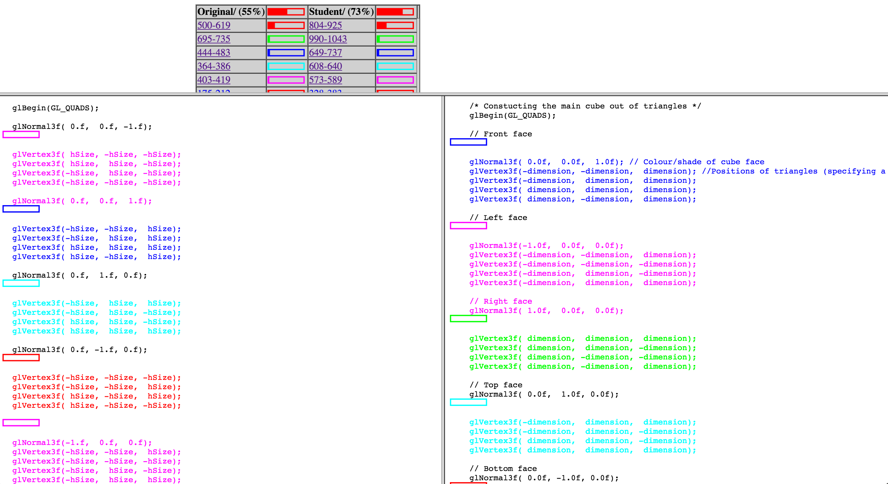
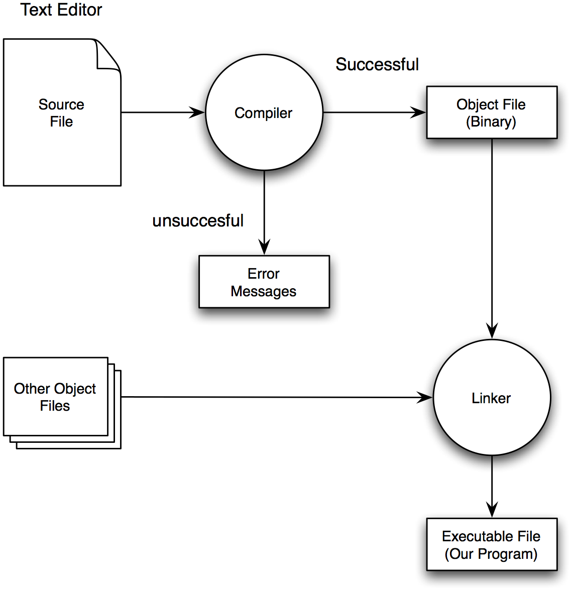
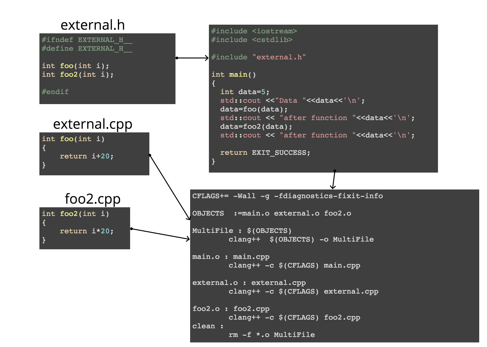

# Lecture 1 Basic C++
Jon Macey

jmacey@bournemouth.ac.uk

---

## <small>Animation Software Engineering</small>
- Using C++ to develop Graphics application
- Develop 2D / 3D Applications and Tools
- Use OpenGL for Real-time applications
- Develop Algorithms for graphics simulations
- Output files to Renderman for High Quality production level graphics
- Write tools to help with the Graphics Production Pipeline

---

## What we will use
- C++ using the [clang++](http://clang.llvm.org/) compiler (and also [g++](https://gcc.gnu.org/)) and other tools
- [Doxygen](http://www.stack.nl/~dimitri/doxygen/) for documenting our code
- [OpenGL](https://www.opengl.org/)
- [QtCreator](https://www.qt.io/) IDE and Qt for GUI applications
- Loads of external libraries ( OpenGL, Qt, [Boost](http://www.boost.org/),  [Bullet](http://bulletphysics.org/wordpress/))
- [git](https://guides.github.com/activities/hello-world/) and [git-hub](https://github.com/) for versions control and code submission

---


#[<small>NCCA Graphics Library](https://nccastaff.bournemouth.ac.uk/jmacey/GraphicsLib/index.html) (ngl::)</small>
- As part of the course we will be using the NCCA Graphics Library (ngl::)
- This contains many C++ classes to aid the development of 3D applications
- Basic Maths elements such as Vectors and Matrix
- Image (for textures) Vertex Array Objects for loading data to OpenGL
- Shader Loading and communication 
- This will be used in all code and may be extended for other needs, changes to the lib are then fed back

--

#ngl

<iframe width="1024" height="768" src="https://nccastaff.bournemouth.ac.uk/jmacey/WebGL/JQuery1/frame.html" ></iframe>

---

#<small/>Citing code in your work

```c++
#include <iostream>
#include <vector>
#include <cstdlib>
#include <algorithm>
/// @brief a simple C++ example
/// Modified from :-
/// Bjarne Stroustrup (October 4, 2009). C Style and Techniques FAQ [online].
/// [Accessed 2016]. Avaliable from : <http://www.stroustrup.com/bs_faq2.html>

int main(int argc, char **argv)
{
  std::vector<double> v;

  double d;
  while(std::cin>>d) 
  {
    v.push_back(d);	// read elements
  }
  if (!std::cin.eof()) 
  {		// check if input failed
    std::cin.clear();		// clear error state
    std::string s;
    std::cin >> s;		// look for terminator string
    if (s != "end") 
    {
      std::cerr << "format error\n";
      return EXIT_FAILURE;	// error return
    }
  }

  std::cout << "read " << v.size() << " elements\n";

  std::reverse(std::begin(v),std::end(v));
  std::cout << "elements in reverse order:\n";
  std::for_each(std::begin(v),std::end(v),[](double i){std::cout<<i<<'\n';});

  return EXIT_SUCCESS; // success return
}
```

--

##Citing Code
- The previous example was taken and modified from a website
- We need to cite this source in the code to avoid any notion of plagiarism. 
- To do this we use the standard Harvard referencing format
<section>
  <pre><code data-trim data-noescape>
<mark>
/// @brief a simple C++ example 
/// Modified from :-
/// Bjarne Stroustrup (October 4, 2009). C Style and Techniques FAQ [online].
/// [Accessed 2016]. Avaliable from : <http://www.stroustrup.com/bs_faq2.html>
</mark> 
int main(int argc, char **argv)
{
  std::vector<double> v;

  double d;
  while(std::cin>>d) 
  {
    v.push_back(d);	// read elements
  }
  if (!std::cin.eof()) 
  {		// check if input failed
    std::cin.clear();		// clear error state
    std::string s;
    std::cin >> s;		// look for terminator string
    if (s != "end") 
    {
      std::cerr << "format error\n";
      return EXIT_FAILURE;	// error return
    }
  }

  std::cout << "read " << v.size() << " elements\n";

  std::reverse(std::begin(v),std::end(v));
  std::cout << "elements in reverse order:\n";
  std::for_each(std::begin(v),std::end(v),[](double i){std::cout<<i<<'\n';});

  return EXIT_SUCCESS; // success return
}</code></pre>
</section>


--

#<small>Citing a small section of code</small>
- If you use a small section of code do the following
- Cite at the beginning of the code section
- at the end of the section mark as end of citation

```
/// The following section is from :-
/// Dan Sunday (2006) Intersections of Rays, Segments Planes and Triangles in 3D [online]
/// Accessed [2010] 
/// Avaliable from // see http://softsurfer.com/Archive/algorithm_0105/algorithm_0105.htm#intersect_RayTriangle()
ngl::Vec3 n=ngl::calcNormal(m_v0,m_v1,m_v2);
float a = -n.dot(tvec);
float b = n.dot(dir);
float r=a/b;
/// End Citation
```

--

##Say hello to [moss](http://theory.stanford.edu/~aiken/moss/)


--

##[NCCA Coding Standard](https://nccastaff.bournemouth.ac.uk/jmacey/NCCACodingStandard/index.html)
- The coding standard includes more details on how to cite code as well as other rules
- This helps us integrate code with existing projects
- Helps staff to understand code quicker when debugging and fixing problems
- Is good practice for the future (most companies use standards)
- We can also use tools to help with this.

--

##[CPP Core Guidelines](http://isocpp.github.io/CppCoreGuidelines/CppCoreGuidelines)

- The C++ Core Guidelines are a set of tried-and-true guidelines, rules, and best practices about coding in C++
- I will relate to these when talking about code.
- A very useful set of rules to follow

---

##The inevitable helloWorld.cpp

```
#include <iostream>
using namespace std;
int main()
{
  cout<<"Hello World"<<endl;
  return 0;
}
```

--

##That version is bad!
- Usually the normal version everyone is taught
- many problems and doesn't follow the core guidelines
  - [avoid endl](http://isocpp.github.io/CppCoreGuidelines/CppCoreGuidelines#a-namerio-endlasl50-avoid-endl)
  - ```using namespace std;``` imports all of std 
  - what does return 0 mean? 
  - always better to be explicit in code [see the Zen of python](https://www.python.org/dev/peps/pep-0020/#the-zen-of-python)

--

## This is better

```
#include <iostream>
#include <cstdlib>
int main()
{
  std::cout<<"Hello World\n";
  return EXIT_SUCCESS;
}
```

---

##The compilation process


--

##Compile

```bash
clang++ -g -Wall -std=c++1z HelloWorld.cpp -o HelloWorld
```

```bash
g++ -g -Wall -std=c++1z HelloWorld.cpp -o HelloWorld
```
- flags control the compiler function
  - -g turn on debug information
  - -Wall enable all warnings
  - -std=c++1z turn on c++ 17 (use c++11 or c++14 for other versions) 
  - -o output name (default if not used a.out)

--

##clang++ vs g++
- clang++ is a modern C++ compiler based on the llvm architecture.
- It has the best error reporting and diagnostics of the two compilers
- both now fully support c++ 14 and some of C++ 17
- some ABI elements are compatible however mixing both compilers is usually problematic 
- However this is also true of different version of the same compiler.
  - On mac clang is default, however some support is missing (such as OpenMP)

---

##C++ Programming “In the Large”
- Typically at undergraduate level you have written small programs individually.
- This is not a true reflection of the real world software engineering process (but the best way to initially learn programming).
- As complexity of outputs grow we need to work in a different way.
- This presents us with a set of new issued to be solved.

--

##Program Libraries
- Large programs - developed by teams
- Program = set of modules (files)
- Function interfaces - defined using library files.
- Libraries give us code reuse across programs (good thing!)
- However we need to have available
  - Header Files & Implementation files
  - Compiled Library Files.

--

## Single File Inclusion
- header files define interfaces for functions, structures, unions and classes
- They may also define variables, however if this header file is then included in more than one module the linker will complain as the same variable is defined twice.
- To overcome this problem we can use Single File Inclusion

--

## Single File Inclusion

- The traditional way of doing this is as follows
  - Use the name of the Header file as an identifier for the pre-processor and create a unique ```#define``` name
  - place a ```#include``` directive in the code to define the module name 
  - If the ```#define``` does not exist then it will be included if it does there is no need to include it again.

--

## Single File Inclusion

```
#ifndef WINDOWPARAMS_H_
#define WINDOWPARAMS_H_

  struct WinParams
  {
  int spinXFace=0;
  int spinYFace=0;
  int origX=0;
  int origY=0;
  int origXPos=0;
  int origYPos=0;
  int width=1024;
  int height=720;
  bool rotate=false;
  bool translate=false;
  };

  constexpr float INCREMENT=0.01f;
  constexpr float ZOOM=0.1f;

#endif
```

--

## #pragma once
- \#pragma is a compiler directive
- \#pragma once can be used at the top of an include file instead of the include guard
- whilst it is supported by both clang++ and g++ it is usually best to avoid
- [good discussion here](https://en.wikipedia.org/wiki/Pragma_once)

--

##Code as Modules
- In C and C++ it is easier to manage large programs by splitting them into source modules 
- With C++ we create classes which contain all the functionality required of the thing we are going to represent.
- Teams can then work on different modules and combine them to produce a final program
- This may be done at the level of a single program with many modules or a small program with external libraries 
- C++ 20 will have full module support and some compilers already have this in experimental systems [ts](http://www.open-std.org/jtc1/sc22/wg21/docs/papers/2015/n4465.pdf)

--

##Separate Compilation
<blockquote cite="(Kernighan & Ritchie)">
"A [C] program may reside in one or more source files. Source Files may be compiled separately and loaded together, along with previously compiled functions from libraries"
</blockquote>
(Kernighan & Ritchie The C programming Language)


--

##Separate Compilation




--

##The Build process
```bash
clang++ -c -Wall -g -std=c++11 main.cpp
clang++ -c -Wall -g -std=c++11 external.cpp
clang++ -c -Wall -g -std=c++11 foo2.cpp
clang++  main.o external.o foo2.o -o MultiFile
```

--


##Automating the Build process
- As you can see the build process is fairly simple but would require a lot of typing once we have more than a few source files.
- If we are using external libraries and other .h files more flags need to be added to the compilation line
- This means the process can become very involved after a while
- Luckily their are a number of standard build tools we can use to automate the process.

--

#Makefiles
- As you can see the build process is fairly simple but would require a lot of typing once we have more than a few source files.
- If we are using external libraries and other .h files more flags need to be added to the compilation line
- This means the process can become very involved after a while
- Luckily their are a number of standard build tools we can use to automate the process.


--

#Makefile
```
CFLAGS+= -Wall -g -std=c++11

OBJECTS  :=main.o external.o foo2.o

MultiFile : $(OBJECTS)
  clang++  $(OBJECTS) -o MultiFile

main.o : main.cpp
  clang++ -c $(CFLAGS) main.cpp

external.o : external.cpp
  clang++ -c $(CFLAGS) external.cpp

foo2.o : foo2.cpp
  clang++ -c $(CFLAGS) foo2.cpp
clean :
  rm -f *.o MultiFile
```

```bash
make -f Makefile.linux
```


--

## Make
- By default make will look in the current directory for a file called Makefile
- We can use a different name for the file and use the -f command line argument to specify it.
- In this case the demo uses Makefile.linux as cmake and qmake which we shall see next will generate a Makefile and overwrite this one


--


## Makefiles
- Makefiles can be complicated to generate especially for large projects
- The syntax and whitespace rules can be problematic
- Best to use a meta language / tool to generate the Makefiles
- We will use two
  - qmake (part of Qt)
  - cmake (which is very common in VFX development) 


--

#qmake

- Is a system which allows the automatic generation of Makefiles from within the Qt development environment
- It reads a file called a .pro file (Qt Project) and will then generate the Makefile for us
- This .pro file is also used by the QtCreator IDE as the main project development system 

--

#qmake
```
# We are not using Qt for this project so remove the depends
CONFIG-=qt
# We want a simple console app so remove bundles form mac
macx:CONFIG-=app_bundle
#TARGET is the name of the exe
TARGET=Multifile
SOURCES+= external.cpp foo2.cpp main.cpp
HEADERS+= external.h
```

```bash
qmake
make
```

--

##cmake

<blockquote>“CMake is an extensible, open-source system that manages the build process in an operating system and a compiler-independent manner”</blockquote>
- It also uses a meta language to generate a makefile
- Many open source projects use this (especially some of big animation packages such as OSL, OpenEXR etc etc)
- Uses a file called CMakeLists.txt to generate a makefile

--

#cmake

```
cmake_minimum_required(VERSION 2.8.11)
# Name of the project
set(PROJECT_NAME MultiFile)
project(${PROJECT_NAME})

set(SOURCES external.cpp foo2.cpp main.cpp external.h )
add_executable(${PROJECT_NAME} ${SOURCES})
```

```bash
cmake CMakeLists.txt
make
```

---

##references
- Budd, T 2002 “An introduction to Object Oriented programming” 3rd Edition.  Addison Wesley
- Parsons, David. “Object Oriented Programming with C++” Thomson Learning; 2nd edition 8 Nov 2000
- Priess B. “Data Structures and Algorithms with Object-Oriented Design Patterns in C++”  Wiley 1998
- Eckel B.  “Thinking in C++, 2nd ed. Volume 1”  Prentice Hall 2000

