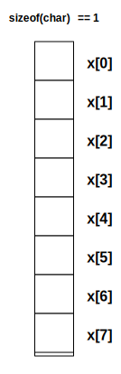
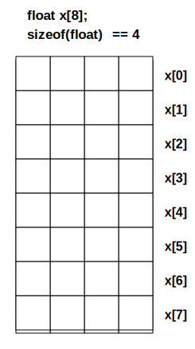
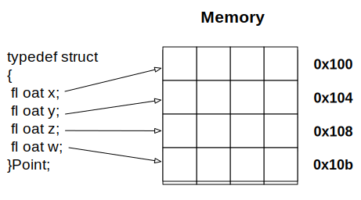
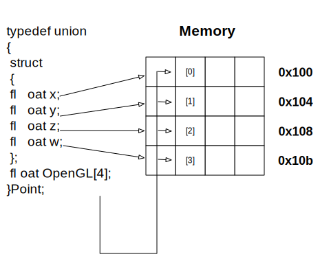

# Basic C++ 11 / 14 / 17
Jon Macey

jmacey@bournemouth.ac.uk

---

# C++ 11 (-std=c++11)
- was approved by ISO on 12 August 2011
- Not all compilers support all features
- clang++ 5.0 seems to do a good job as well as g++ 4.8, 
- a good list of features / support [here](https://isocpp.org/wiki/faq/cpp11)
- is now quite common in production

--

# C++ 14 (-std=c++14)

- Is becoming quite common in most modern compilers
- becoming more common (but mainly seen as a bug fix for c++ 11)
- a good list of features / support [here](https://isocpp.org/wiki/faq/cpp14-language)

--

# C++ 17 (-std=c++1z)

- not as common in production but being used more now. 
- some good new features especially in the standard library (```std::string_view std::optional std::any```) 
- NGL uses some of these features

--

# C++ 14

- this year we will mainly use C++ 14 (but can use 17 if needed)
- core teaching will focus on C++ 11/14 features and style
- NGL library is C++ 14
- Most of my demos are C++ 14
- Will occasionally use cool C++ 17 features as illustrations

--

# C++ standard  flags

- to use C++ 11 we need to use compiler flags (some compilers now default to c++ 11 but not all)

``` 
clang++ -std=c++11 
g++ -std=c++11  
```

- to use C++ 14 we can use the -std=c++14
- if supported we can use -std=c++1z for C++ 17 features!

---

# namespaces

- namespaces allow us to separate program elements into different named logical units
- By using namespaces we can declare functions, classes and other code that is only visible within the namespace
- The following code shows this in action

--

#  [namespace1.cpp](https://github.com/NCCA/ASELectureCode/blob/master/Lecture2/namespace1.cpp)

```
#include <iostream>
#include <cstdlib>

namespace foo1
{
	void foo()
	{
		std::cout<<"foo1::foo\n";
	}

}

namespace foo2
{
	void foo()
	{
		std::cout<<"foo2::foo\n";
	}

}

namespace foo1
{
  void bar()
  {
    std::cout<<"bar\n";
  }
}


int  main()
{
  foo1::foo();
  foo2::foo();
  foo1::bar();
}
```

--

# [namespace2.cpp](https://github.com/NCCA/ASELectureCode/blob/master/Lecture2/namespace2.cpp)

```
#include <iostream>
#include <cstdlib>

namespace foo1
{
	void foo()
	{
		std::cout<<"foo1::foo\n";
	}

};

namespace foo2
{
	void foo()
	{
		std::cout<<"foo2::foo\n";
	}

};

using namespace foo1;
using namespace foo2;


int  main()
{
  foo();
  foo();
}
```

```
clang11 namespace2.cpp
namespace2.cpp:29:3: error: call to 'foo' is ambiguous
  foo();
  ^~~
namespace2.cpp:6:7: note: candidate function
        void foo()
             ^
namespace2.cpp:15:7: note: candidate function
        void foo()
             ^
namespace2.cpp:30:2: error: call to 'foo' is ambiguous
        foo();
        ^~~
namespace2.cpp:6:7: note: candidate function
        void foo()
             ^
namespace2.cpp:15:7: note: candidate function
        void foo()
             ^
2 errors generated.
```

--

# [namespace3.cpp](https://github.com/NCCA/ASELectureCode/blob/master/Lecture2/namespace3.cpp)


```
#include <iostream>
#include <cstdlib>


void foo()
{
	using std::cout;
	using std::endl;	
	cout<<"foo "<<endl;
}

void bar()
{
	using namespace std;
	cout<<"bar"<<endl;
}

int main()
{
  cout<<"in main\n";
  foo();
  bar();
}
```

```
namespace3.cpp:21:2: error: use of undeclared identifier 'cout'; did you mean
      'std::cout'?
        cout<<"in main\n";
        ^~~~
        std::cout
```

--

# [namespace4.cpp](https://github.com/NCCA/ASELectureCode/blob/master/Lecture2/namespace4.cpp)

```
#include <iostream>
#include <cstdlib>

namespace AReallyLongNamespaceThatIdontWantToType
{

	void foo()
	{
		using std::cout;
		using std::endl;

		cout<<"foo "<<endl;
	}
}

int main()
{
  namespace foo=AReallyLongNamespaceThatIdontWantToType;
  foo::foo();
}
```

--

# namespaces
- It’s good to use namespaces
- makes code more modular
- can embed namespaces within namespaces
- try to use short easy names
- can shorten by re-naming them 
- [or use macro for more complex internal ones](https://github.com/OpenImageIO/oiio/blob/master/src/include/OpenImageIO/oiioversion.h.in)

---

## [sizeof()](https://en.wikipedia.org/wiki/Sizeof)
- In C/C++ sizeof is a unary operator that must be implemented by the developer of the compiler
- it appears as a C/C++ function when we use it but will return the size in bytes of the data type passed to it.
- The following program demonstrates sizeof

--


## [sizeof.c](https://github.com/NCCA/PPPLectureCode/blob/master/Lecture2/sizeof.c)
```c
#include <stdio.h>
#include <stdlib.h>

int main()
{
  printf("sizeof(char)= %ld \n",sizeof(char));
  printf("sizeof(short int)= %ld \n",sizeof(short int));
  printf("sizeof(int)= %ld \n",sizeof(int));
  printf("sizeof(long int)= %ld \n",sizeof(long int));
  printf("sizeof(float)= %ld \n",sizeof(float));
  printf("sizeof(double)= %ld \n",sizeof(double));

  printf("unsigned versions\n");

  printf("sizeof(unsigned char)= %ld \n",sizeof(unsigned char));
  printf("sizeof(unsigned short int)= %ld \n",sizeof(unsigned short int));
  printf("sizeof(unsigned int)= %ld \n",sizeof(unsigned int));
  printf("sizeof(unsigned long int)= %ld \n",sizeof(unsigned long int));

  return EXIT_SUCCESS;
}
```

--

## output 

```
$ clang -Wall -g sizeof.c -o sizeof
$./sizeof
sizeof(char)= 1
sizeof(short int)= 2
sizeof(int)= 4
sizeof(long int)= 8
sizeof(float)= 4
sizeof(double)= 8
unsigned versions
sizeof(unsigned char)= 1
sizeof(unsigned short int)= 2
sizeof(unsigned int)= 4
sizeof(unsigned long int)= 8
```

--

## Why should I worry about size?

- as we shall see many graphics API's work by passing around chunks of raw memory.
- knowing how big our data is will become important when using lower level languages and API's
  - this is true for OpenGL [Buffer Objects](https://www.opengl.org/wiki/Buffer_Object)
  - Cuda [Cuda Memory models](http://www.3dgep.com/cuda-memory-model/)
- and many more.

---


# Arrays

- A Simple data types use a single memory cell block to store a variable.
- It is sometimes more efficient to group data items together in main memory than to allocate an individual memory cell block for each variable.
- A simple way to create different fixed amounts of the of the same data type is by the use of an array.
- An array is a collection of two or more adjacent cells called array elements associated with a specific symbolic name.

--

# Array declaration
```c++
char x[8];
```

- The command above instructs the compiler to allocate 8 memory cells of type char.
- These cells will be contiguous (next to each other in a continuous block)
- This mean accessing them can be done in a sequential manner
- To access the cells we use an index into the cells starting a 0 for the first index. 

--

# Array Access

<div id="mySlideLeft">
<ul>
<li/> To access elements of the array we use the subscript operator [ ]
<li/> This can be used to get or set the array index value.
</ul>
</div>

<div id="mySlideRight">

</div>

--

# float array 

- total allocated memory 8*sizeof(float)=32 Bytes



--


# [Array Initialisation](https://github.com/NCCA/ASELectureCode/blob/master/Lecture2/array.cpp)
- We can initialise an array in a similar way to a normal variable.

```
#include <iostream>
#include <cstdlib>

int main()
{
	// array of vowels
	char vowels[5]={'a','e','i','o','u'};
	// the compiler will fill in how many values (25)
	int primesLT100[]={2,3,5,7,11,13,17,19,23,29,31,
                    37,41,43,47,53,59,61,67,71,73,
                    79,83,89,97};
	// index to our array
	int i;
	// loop and print out the values
	for(i=0; i<5; ++i)
	{
		std::cout<<vowels[i]<<" ";
	}
	// newline
	std::cout<<"\n";

	// as we don't know how big the primes array is we need
	// to figure it out, sizeof will return how big the allocated
	// space is, however it is in bytes and an int takes up
	// sizeof(int) (usually 4) bytes so we need to div by this
	std::cout<<sizeof(primesLT100);
	int sizeOfArray=sizeof(primesLT100)/sizeof(int);
	std::cout<<" size of array "<<sizeOfArray<<"\n";
	// loop and print
	for(i=0; i<sizeOfArray; ++i)
	{
		std::cout<<primesLT100[i]<<" ";
	}
	std::cout<<"\n";
	return EXIT_SUCCESS;
}
```

--

# Problems with Arrays

- one of the main issues with using arrays is we don't know the ammount of elements
- the previous code showed how we can determine the array elements by using

```
int sizeOfArray=sizeof(primesLT100)/sizeof(int);
```
- however this can cause issues with pointers etc [see here](http://stackoverflow.com/questions/4108313/how-do-i-find-the-length-of-an-array)
- to overcome this C++ 11 has std::array

--

# [std::array<T,int size>](http://en.cppreference.com/w/cpp/container/array)

- C++ 11 introduces the std::array this is a c++ version of a normal array
- It allows static allocation of array data, with a set size (on the stack)
- It has the same performance as a normal array but the added advantage that it works like other stl containers (more in a later lecture)

--

# [stdarray.cpp](https://github.com/NCCA/ASELectureCode/blob/master/Lecture2/stdarray.cpp)

```
#include <iostream>
#include <cstdlib>
#include <array>

int main()
{
	std::array<char,5> vowels={'a','e','i','o','u'};
	for(int i=0; i<vowels.size(); ++i)
	{
		std::cout<<vowels[i]<<' ';
	}
	std::cout<<'\n';
	// note use of reference here to mutate
	for( auto &v : vowels)
	{
		v=toupper(v);
	}
	for( auto v : vowels)
	{
		std::cout<<v<<' ';
	}	
	std::cout<<'\n';

}
```

---

#[Type Aliasing](http://en.cppreference.com/w/cpp/language/typedef)

- In C++ (and C for typedef only) we can alias a typename to use a different identifier.
- In C++, any valid type can be aliased so that it can be referred to with a different identifier.

```
typedef [existing type] [new type];
typedef char Byte;
typedef unsigned int WORD;
typedef float Real;
```

--

# [typedef.cpp](https://github.com/NCCA/ASELectureCode/blob/master/Lecture2/typedef.cpp)

```
#include <iostream>
#include <cstdlib>

typedef  char Byte;
typedef  unsigned int Word;
typedef  float Real;

int main()
{
  Byte a='c';
  Word i=10;
  Real x=2.6;
  std::cout<<a<<' '<<i<<' '<<x<<'\n';
  return EXIT_SUCCESS;
}
```

--

# [type aliasing](http://en.cppreference.com/w/cpp/language/type_alias)

- typedef is a C/C++ construct 
- a second syntax to define type aliases was introduced in the C++ 11 language spec

```
#include <iostream>
#include <cstdlib>

using Byte=char;
using Word=unsigned int;
using Real=float;

int main()
{

	Byte a='c';
	Word i=10;
	Real x=2.6;
	std::cout<<a<<' '<<i<<' '<<x<<'\n';
	return EXIT_SUCCESS;
}
```

--

# type aliasing

- internally NGL uses the following ["ngl/Types.h"](https://github.com/NCCA/NGL/blob/master/include/ngl/Types.h)
```
using PRECISION=GLfloat;
using Real=PRECISION;
```
- this allows one line of code in the header to be changed to allow Real to become something else (GLdouble) 

---

# Structures
- The C/C++ struct keyword allows us to create a group of one or more variables, possibly of different types, grouped together under a single name
- We can embed structures within other structures
- and with the use of pointers (more in another lecture) we can make self referential structures.

--

# [struct1.cpp](https://github.com/NCCA/ASELectureCode/blob/master/Lecture2/struct1.cpp)

```
#include <iostream>
#include <cstdlib>

int main()
{
	struct vertex 
	{
	 float x;
	 float y;
	 float z;
	} ;
	struct vertex p1 = { 1.0f, 2.5f, -1.5f};
	struct vertex p2 = p1;
	p2.z=3.0f;
	std::cout<<"Point1 "<<p1.x<<' '<<p1.y<<' '<<p1.z<<'\n';
	std::cout<<"Point2 "<<p2.x<<' '<<p2.y<<' '<<p2.z<<'\n';
	return EXIT_SUCCESS;
}
```


--


# [typedef struct](https://github.com/NCCA/ASELectureCode/blob/master/Lecture2/struct2.cpp)

- We can combine typedef and structs to declare new types.

```
#include <iostream>
#include <cstdlib>

typedef struct
{
  int x;
  int y;
}Point2i;


typedef struct
{
  int r;
  int g;
  int b;
  int a;
}Colour4i;

typedef struct
{
  Point2i p;
  Colour4i c;
}ColourVert;

void debug(const ColourVert &p)
{
  std::cout<<'['<<p.p.x<<','<<p.p.y<< "] ";
  std::cout<<'('<<p.c.r<<','<<p.c.g<<','<<p.c.b<<','<<p.c.a<<")\n";
}


int main()
{
	ColourVert c={{23,10},{255,0,0,0}};
	debug(c);
}
```

--

#[struct3.cpp](https://github.com/NCCA/ASELectureCode/blob/master/Lecture2/struct3.cpp)

- structs can also contain functions, this is the first steps of thinking along the lines of OO and classes

```
#include <iostream>
#include <cstdlib>

  typedef struct
  {
    int x;
    int y;
  }Point2i;


  typedef struct
  {
    int r;
    int g;
    int b;
    int a;
  }Colour4i;

  typedef struct
  {
    Point2i p;
    Colour4i c;
    void debug()
    {
      std::cout<<'['<<p.x<<','<<p.y<< "] ";
      std::cout<<'('<<c.r<<','<<c.g<<','<<c.b<<','<<c.a<<")\n";
    }
  }ColourVert;


int main()
{
  ColourVert c={{23,10},{255,0,0,0}};
  ColourVert d={{99,12},{255,0,255,0}};

  c.debug();
  d.debug();
  return EXIT_SUCCESS;
}
```

---

# [unions](http://en.cppreference.com/w/cpp/language/union) 

- In a structure, the members are allocated in separate consecutive chunks of storage. 



--

# [unions](http://en.cppreference.com/w/cpp/language/union) 

- In a union, every member is allocated the same piece of storage



--

#Why use Unions?

- In the previous example we have declared the individual elements of a vector as x y z & w
- This is good to read and easier than using the array syntax [0]=10 etc
- However as we will see later OpenGL let us use either syntax and there are some advantages (speed) to using the array type syntax.
- Therefore if we define a union of both we have the advantage of both syntax types.

---

#Data structure padding
- Typically the compiler will align data on byte boundaries, however sometimes in structures we will have data with different size requirements
- To maintain proper alignment the translator normally inserts additional unnamed data members so that each member is properly aligned.
- This can cause issues as shown by the following example

--

# example

- given 
```
sizeof(char) == 1 
sizeof(short)==2
``` 
- how big is the following structure?

```
typedef struct
{
	char  identifier;          
	char  colourMapType;      
	char  imageType;         
	short cms;    
	short cml;    
	char  cmb;     
} notPacked;
```

--

# Data Structure Padding

- In the previous example sizeof(notPacked) will return 10 bytes even though the actual size is 8 bytes. 
- This is because the compiler is padding by two bytes to align to a boundary. 
- In most cases this may not be a problem, however if we are writing to disk a set size of data this would cause issues. The same may also be true when writing data to the GPU.
- To overcome this problem in g++ we can use a compiler #pragma as shown in the next slide

--

# [pack.cpp](https://github.com/NCCA/ASELectureCode/blob/master/Lecture2/pack.cpp)

```
#include <iostream>

#pragma pack(push, 1)

typedef struct
{
	char  identifier;         
	char  colourMapType;      
	char  imageType;          
	short cms;     
	short cml;   
	char  cmb;      
} packed;

#pragma pack(pop)

typedef struct
{
	char  identifier;          
	char  colourMapType;      
	char  imageType;         
	short cms;    
	short cml;    
	char  cmb;      
} notPacked;

int main()
{
	std::cout<<"size of char "<<sizeof(char)<<'\n';
	std::cout<<"size of short "<<sizeof(short)<<'\n';
	std::cout<<sizeof(packed)<<'\n';
	std::cout<<sizeof(notPacked)<<'\n';

}
```

- for more details see [here](http://en.wikipedia.org/wiki/Data_structure_alignment)

---

# enums
- In C and old C++ enums essentially convert to integers
- This means we can compare all enums with each other as they are all of int type
- This can lead to errors in code as the compiler doesn’t check these
- C++ 11 introduces strongly typed enums

--

# [enum1.cpp](https://github.com/NCCA/CPP11Demos/blob/master/enum1.cpp) 

```
enum Mesh {SPHERE,BOX,TORUS};
enum Shapes {CUBE,CYLINDER,SPHERE}

int main()
{

}

```

```
enum1.cpp:4:28: error: redefinition of enumerator 'SPHERE'
enum Shapes {CUBE,CYLINDER,SPHERE};
                           ^
note : previous defenition is here
enum Mesh {SPHERE,BOX,TORUS};
           ^

```

--

# [enum2.cpp](https://github.com/NCCA/CPP11Demos/blob/master/enum2.cpp)

```
#include <iostream>

enum class Mesh {SPHERE,BOX,TORUS};
enum class Shapes {CUBE,CYLINDER,SPHERE};

int main()
{
	Shapes shape=Shapes::CUBE;
	if( shape == Shapes::CUBE)
	{
		std::cout<<"cube\n";
	}
}
```

--

# enum class size
- By default these values will still be integers
- We can however change the storage size of the enum to be whatever we want to reduce size etc

--

# [enum3.cpp](https://github.com/NCCA/CPP11Demos/blob/master/enum3.cpp)

- as enum classes are no longer integers we can't use them like C style enums.

```
#include <iostream>

enum class DIRECTION {UP,DOWN,LEFT,RIGHT};


int main()
{
	int data[4]={0,1,2,3};
	std::cout<<data[static_cast<int>(DIRECTION::UP)]<<"\n";
}
```

---

# [cstdint](http://en.cppreference.com/w/cpp/header/cstdint)

- One issue with C and C++ has been the lack of standard size for data types
- This changes for different OS bit size dependant upon architecture

--

# [cstdint.cpp](https://github.com/NCCA/CPP11Demos/blob/master/cstdint.cpp)

```
#include <cstdint>
#include <iostream>
#include <cstdlib>

int main()
{
std::int8_t int8;
std::int16_t int16;
std::int32_t int32;
std::int64_t int64;
std::uint8_t uint8;

std::cout <<"std::int8_t = " <<sizeof(int8)<<"\n";
std::cout <<"std::int16_t = " <<sizeof(int16)<<"\n";
std::cout <<"std::int32_t = " <<sizeof(int32)<<"\n";
std::cout <<"std::int64_t = " <<sizeof(int64)<<"\n";
std::cout <<"std::uint8_t = " <<sizeof(uint8)<<"\n";

}
```

```
std::int8_t = 1
std::int16_t = 2
std::int32_t = 4
std::int64_t = 8
std::uint8_t = 1
```

--

#[nullptr](http://en.cppreference.com/w/cpp/language/nullptr)

- We usually use NULL in our programs to indicate something is not set
- In C++ NULL is #defined to 0 and is not even a pointer type
- This can lead to weird bugs
- C++ 11 introduces the nullptr type. It should replace NULL and you should just use it wherever you used to use NULL

--

# [auto](http://en.cppreference.com/w/cpp/language/auto)

- Once the type of the initialiser has been determined, the compiler determines the type that will replace the keyword auto as if using the rules for template argument deduction from a function call.
- The keyword auto may be accompanied by modifiers, such as const or &, which will participate in the type deduction.
- In a function declaration, the keyword auto does not perform automatic type detection. It only serves as a part of the trailing return type syntax.

--

# [auto](http://en.cppreference.com/w/cpp/language/auto)

```
int a=5;
// can now be
auto a=5;
```

- This is not the intended use, more at home with iterators

```
vector <int> vec;
// instead of vector<int>::iterator itr;
auto itr=std::begin(vec);
```

--

# Triple A style

- Almost always auto
- [Herb Sutter has a good article](https://herbsutter.com/2013/08/12/gotw-94-solution-aaa-style-almost-always-auto/)
- However
	- [AAA](https://steveire.wordpress.com/2016/03/19/aaargh-aaa-right-good-and-hygenic/)
	- [r/cpp](https://www.reddit.com/r/cpp/comments/2a4tv0/dont_use_auto_unless_you_mean_it_a_unified/)

--


# [for.cpp](https://github.com/NCCA/CPP11Demos/blob/master/for.cpp)

```
#include <iostream>
#include <vector>

int main()
{
	std::vector <float> v;
	for(auto i=0.1; i<1.0; i+=0.1)
		v.push_back(i);
	for(auto i: v)
		std::cout<<i<<"\n";

}
```

--

#[range based for](http://en.cppreference.com/w/cpp/language/range-for)
- You will notice in the last example I used the new for syntax
- This is a for each loop similar to an iterator
- By default we get a const iterator
- Works the same as BOOST_FOREACH 
- more on this when we start looking at STL

--

# [constexpr](http://en.cppreference.com/w/cpp/language/constexpr)
- constexpr allows for computation to now take place at compile time rather than runtime
- This means that code using this will not need to do the computation at runtime (for example evaluating a cos or sine function on a know value)
- This could be done with a constant however this can reduce the flexibility of the code 

--

## [constexpr1.cpp](https://github.com/NCCA/CPP11Demos/blob/master/constexpr1.cpp)

```
#include <iostream>
#include <cstdlib>

constexpr int multiply (int x, int y)
{
    return x * y;
}

int main()
{
	const int val = multiply( 10, 10 );
	std::cout<<val<<"\n";
	return EXIT_SUCCESS;
}
```

--

#[demo](https://gcc.godbolt.org/)

<div class="stretch">
<iframe width="800px" height="400px" src="https://godbolt.org/e#g:!((g:!((g:!((h:codeEditor,i:(j:1,lang:c%2B%2B,source:'%23include+%3Ciostream%3E%0A%23include+%3Ccstdlib%3E%0A%0Aconstexpr+unsigned+long+int+factorial+(int+n)%0A%7B%0A++++return+n+%3E+0+%3F+n+*+factorial(+n+-+1+)+:+1%3B%0A%7D%0A%0A%0Aint+main()%0A%7B%0A+++//+factorial+6+%3D+720+%0A++++auto+value%3Dfactorial(6)%3B%0A++++//std::cout%3C%3C%22value+is+%22%3C%3Cvalue%3C%3C!'%5Cn!'%3B%0A%0Areturn+value%3B%0A%7D'),l:'5',n:'0',o:'C%2B%2B+source+%231',t:'0')),k:50,l:'4',n:'0',o:'',s:0,t:'0'),(g:!((h:compiler,i:(compiler:clang500,filters:(b:'0',binary:'1',commentOnly:'0',demangle:'1',directives:'0',execute:'1',intel:'0',trim:'0',undefined:'1'),lang:c%2B%2B,libs:!(),options:'-std%3Dc%2B%2B17+-O3',source:1),l:'5',n:'0',o:'x86-64+clang+5.0.0+(Editor+%231,+Compiler+%231)+C%2B%2B',t:'0')),k:50,l:'4',n:'0',o:'',s:0,t:'0')),l:'2',n:'0',o:'',t:'0')),version:4"></iframe>
</div>

--

#constexpr

- A constexpr function is limited as follows
  - It must consist of single return statement (with a few exceptions)
  - It can call only other constexpr functions
  - It can reference only constexpr global variables

--

# constexpr
- We can also use constexpr instead of macros
- This can make our code more readable and also has the benefits that we can use the constexpr as a normal function at runtime as well


--

# recursion

- recursion is allowed in a constexpr
- However as we can only have a single return statement in a constexpr we need to use the ternary operator (arithmetic if) 
- ? [true] : [false]
- This is show in the following example

--

# [constexpfactorial.cpp](https://github.com/NCCA/CPP11Demos/blob/master/constexpfactorial.cpp)

```
#include <iostream>
#include <cstdlib>

constexpr unsigned long int factorial (int n)
{
    return n > 0 ? n * factorial( n - 1 ) : 1;
}


int main()
{
	const unsigned long int big=factorial(25);
	int a;
	std::cout<<"enter a value>";
	std::cin >>a;
	std::cout<<"big is "<<big<<" a! is "<<factorial(a)<<"\n";

return EXIT_SUCCESS;
}
```

--

#[demo](https://gcc.godbolt.org/)

<div class="stretch">
<iframe src="https://gcc.godbolt.org/#compilers:!((compiler:g6,options:'-std%3Dc%2B%2B11+-O3',source:'%23include+%3Ciostream%3E%0A%23include+%3Ccstdlib%3E%0A%0Aconstexpr+unsigned+long+int+factorial+(int+n)%0A%7B%0A++++return+n+%3E+0+%3F+n+*+factorial(+n+-+1+)+:+1%3B%0A%7D%0A%0A%0Aint+main()%0A%7B%0A%09const+unsigned+long+int+big%3Dfactorial(25)%3B%0A%09int+a%3B%0A%09std::cout%3C%3C%22enter+a+value%3E%22%3B%0A%09std::cin+%3E%3Ea%3B%0A%09std::cout%3C%3C%22big+is+%22%3C%3Cbig%3C%3C%22+a!!+is+%22%3C%3Cfactorial(a)%3C%3C%22%5Cn%22%3B%0A%0Areturn+EXIT_SUCCESS%3B%0A%7D')),filterAsm:(colouriseAsm:!t,directives:!t,intel:!t,labels:!t),version:3" style="border:0px #FFFFFF solid;" name="code" scrolling="yes" frameborder="1" marginheight="0px" marginwidth="0px" height="100%" width="100%"></iframe>
</div>

--

# [String literals](http://en.cppreference.com/w/cpp/language/string_literal)
- Normal C/C++ allows us to represent strings in the by using the quotes
- Any special characters including the quotes must be escaped using the backslash
- C++ 11 introduces the Raw string literal, this is especially good if you want to include shader source in your code

--

# [literal.cpp](https://github.com/NCCA/CPP11Demos/blob/master/literal.cpp)

```
#include <iostream>

static const std::string shader =

R"DELIM(
#version 400 core
// first attribute the vertex values from our VAO
layout (location = 0) in vec3 inVert;
// second attribute the UV values from our VAO
layout (location = 1) in vec2 inUV;
// we use this to pass the UV values to the frag shader
out vec2 vertUV;
void main()
{
	// calculate the vertex position
	gl_Position = vec4(inVert, 1.0);
	// pass the UV values to the frag shader
	vertUV=inUV.st;
}
)DELIM";

int main()
{
  std::cout<<shader<<"\n";
}
```

---

#[Lambda Functions](http://en.cppreference.com/w/cpp/language/lambda)
- Lambda functions are like normal functions but can be inlined in your code
- They can also be passed to some algorithms
- Lambdas start with the [] followed by an argument list () 
- The body of the lambda is then contained in the { }
- must be ended with a ;

--

# [lambda1.cpp](https://github.com/NCCA/CPP11Demos/blob/master/lambda1.cpp)

```
#include <iostream>
#include <cstdlib>


int main()
{
 auto lambda =[](const char *_s) { std::cout<<"lambda :-"<<_s<<"\n";};
 
 lambda("this is a lambda");
 lambda("seems to ");
 lambda("work ok");
 
	return EXIT_SUCCESS;
}
```

--

# lambda
- In the previous example we use auto for the type 
- This makes this a very simple callable function
- don’t have to bother about function pointer return type and syntax
- Not really the usual way of using lambdas but can be quite handy if we need some debug prints etc

--

# watch this 

<div class="stretch">
<iframe width="560" height="315" src="https://www.youtube.com/embed/rcgRY7sOA58" frameborder="0" allowfullscreen></iframe>
</div>

--

# capture output

- The output of a lambda function can be captured in the [ ] list
- The variables have to be pre-declared and then passed by reference
- Comma separated lists can be used for multiple variables as shown in the next example 

--

#[lambda.cpp](https://github.com/NCCA/CPP11Demos/blob/master/lambda.cpp)

```
#include <algorithm>
#include <iostream>
#include <vector>
#include <numeric>

int main()
{
	// Create a vector object that contains 10 elements.
	std::vector<int> v(10);
	// use iota to fill 
	std::iota(std::begin(v), std::end(v),0);

  int evenCount = 0;
  int total=0;

  auto countEvenOdd=[&evenCount,&total] (int n)
  {
    std::cout << n;

    if (n % 2 == 0)
    {
      std::cout << " is even \n";
      evenCount++;
    }
    else
    {
      std::cout << " is odd\n" ;
    }
    ++total;
  };


  for_each(std::begin(v), std::end(v),countEvenOdd );

  std::cout << "There are " << evenCount
  << " even numbers in the vector out of "<<total<<" elements\n";

  }
```

---

#References
- http://en.cppreference.com/w/cpp/language/auto
- http://www.cprogramming.com/c++11/c++11-auto-decltype-return-value-after-function.html
- http://www.cprogramming.com/c++11/c++11-compile-time-processing-with-constexpr.html
- http://www.cprogramming.com/c++11/c++11-lambda-closures.html

