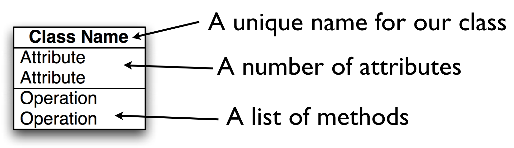
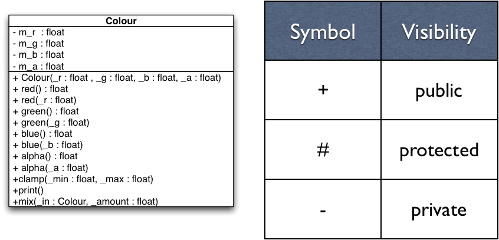
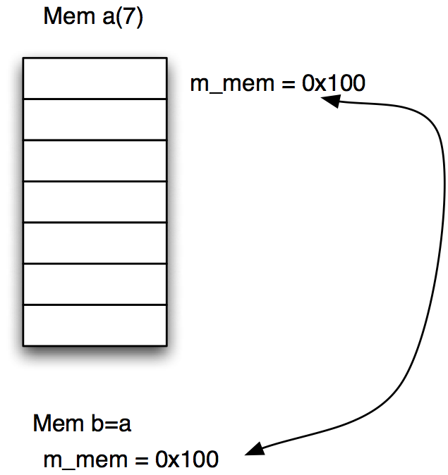
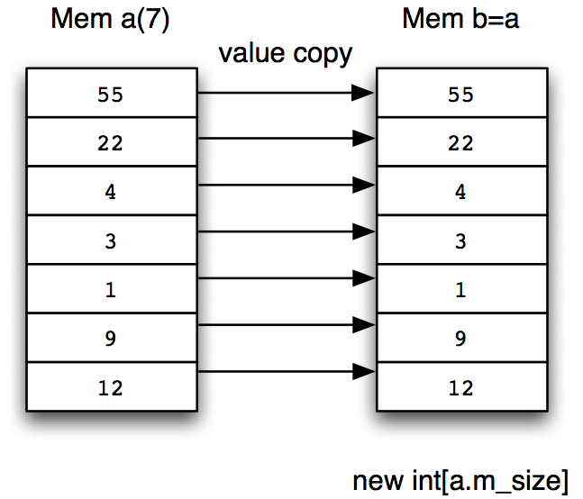

# Classes in C++
Jon Macey

jmacey@bournemouth.ac.uk

---

## Procedural Programming
- In procedural programming we use
	- data structures to store information
	- function (passing in the structures) to process the information
- This can lead to complex / large function prototypes passing in and out large amounts of data.

--

## Object Oriented Programming
- In OO Programming we tend to combine both the data and the functions that act on them into a single unit.
- We then place an “interface” to this data know as methods which are allowed to act upon the data in a prescribed way.
- The traditional model of OO is to model “real world” objects, however as we shall discuss this is not really the case.

--

## [Inherently Harful?](http://harmful.cat-v.org/software/OO_programming/) 

<div class="stretch">
<iframe src="http://harmful.cat-v.org/software/OO_programming/" style="border:0px #FFFFFF solid;" name="code" scrolling="yes" frameborder="1" marginheight="0px" marginwidth="0px" height="100%" width="100%"></iframe>
</div>

--

## Agents and Communities
- The common "model" of teaching OO is :-
	- An Object Oriented program is structured as a community of interacting agents called objects.
	- Each object has a role to play.
	- Each object provides a service or performs an action that is used by other members of the community

--

## Patterns
- As we will see when building and designing these communities patterns will appear.
- These “design patterns” can be seen as “a general reusable solution to a commonly occurring problem”
- In OO design patterns typically show relationships and interactions between classes or objects, without specifying the final application classes or objects that are involved.

---

## Messages and Methods
- Actions are initiated in OO programming by the transmission of a message to an agent (an object) responsible for the action.
- The message encodes the request for an action and is accompanied by any additional information (arguments) needed to carry out that request.
- The receiver is the object to whom the message is sent
- If the receiver accepts the message, it also accepts the responsibility to carry out the indicated action.
- In response to a message, the receiver will perform some method to satisfy the request

--

## Messages vs Procedure calls

```
#include <iostream>
#include <cstdlib>
/// @brief function to square a value 
/// @brief [in] _a the value to square 
/// @returns _a*_a the square
int sqr(int _a )
{
  return _a*_a; 
}

int main() 
{
  int value=10;
  std::cout<<value<<" squared = "<<sqr(value)<<'\n';
  return EXIT_SUCCESS; 
}
```

--

## Messages vs Procedure calls

<div class="stretch">
<iframe src="proc.html" style="border:0px #FFFFFF solid;" name="code" scrolling="yes" frameborder="1" marginheight="0px" marginwidth="0px" height="100%" width="100%"></iframe>
</div>

--

## Advantages
- Now we have a class we can have many instances of the same same class (each know as an object)

```
#include "IntValue.h"

int main()
{
  IntValue a(10); 
  IntValue b(22); 
  IntValue c(33); 
  IntValue d(112); 
  IntValue e(34923); 
  a.square();
  a.print();
}
```

--

# Responsibilities
- In message passing there is a designated receiver. 
- This may not be known until runtime (know as runtime polymorphism)
- This is a form of late binding, this happens at runtime and not compile time like a procedural program.

> Ask not what you can do to your data structures.
Ask what your data structures can do for you. 

[Budd (2002)](http://web.engr.oregonstate.edu/~budd/Books/oopintro3e/info/ReadMe.html)

---

## Object Oriented Concepts [(Kay 1993)](http://gagne.homedns.org/~tgagne/contrib/EarlyHistoryST.html)
- Everything is an Object.
- Computation is performed by objects communicating with each other (via messaging)
- Each Object has it’s own Memory 
- Every object is an instance of a class.
- The class is a repository for behaviour associated with an object.
- Classes are organised into a singly rooted tree structure called the inheritance hierarchy. 

--

## Classes
- The structure data type can be used in both C and C++
- It is usually used to store only data, [however can also contain functions](https://github.com/NCCA/ASELectureCode/blob/master/Lecture2/struct3.cpp).
- In C++ we store the data and the operation that can be performed on that data together in the same entity.
- This entity is know as a class

--

## The Anatomy of a class
- A Class has two parts
	- a private (hidden) part
	- a public interface 
- The public part defines the behaviour of the object (methods)
- The private part contains the data (attributes)
- It is normal practice to put attributes in the private part of the class where they can only be accessed by methods

---

# Class Diagrams

<div class="stretch">
<iframe src="/jmacey/DesignPatterns/lecture1/Inheritance1.html" style="border:0px #FFFFFF solid;" name="code" scrolling="yes" frameborder="1" marginheight="0px" marginwidth="0px" height="100%" width="100%"></iframe>
</div>

--

#Associations
- Represents the relation from one class to another
- Most association will be 
  - Has
  - Owns
  - Uses
- In C++ it often translates to a member
- Try to be more explicit
  - Renders to
  - Reflects
  - Supports

--

# Associations
- The numbers
  - How many X can Y have
  - How many Y can X have
- Syntax
  - 0..1 May have ONE, or NONE
  - 0..* May have SEVERAL, including NONE
  - 1 Has ONE and only ONE
  - 1..* Has at least ONE, but can have SEVERAL

--


# Composition

<div class="stretch" >
<iframe src="/jmacey/DesignPatterns/lecture1/composition.html" style="border:0px #FFFFFF solid;" name="code" scrolling="yes" frameborder="1" marginheight="0px" marginwidth="0px" height="100%" width="100%"></iframe>
</div>

- Use a filled diamond it always gives a multiplicity of 1 or 0..1
- This implies ownership and when the car is destroyed so is the Engine

--

# Aggregation

<div class="stretch" >
<iframe src="/jmacey/DesignPatterns/lecture1/aggregation.html" style="border:0px #FFFFFF solid;" name="code" scrolling="yes" frameborder="1" marginheight="0px" marginwidth="0px" height="100%" width="100%"></iframe>
</div>

- Aggregation differs from composition as it doesn’t necessarily imply ownership.
- This is usually implemented by containing a reference to another object where the lifetime is determined elsewhere
- This implies a pointer (or smart pointer) of some kind

--

# Generalisation
- In C++ this translates to inheritance
- Sometimes we have classes so general they can’t be created (Abstract classes)
- The hierarchy goes from Generalisation to specialisation
- Use a lot in things like Qt [QOBJECT](http://doc.qt.io/qt-5/qobject.html)


---

#[S.O.L.I.D. ](https://en.wikipedia.org/wiki/SOLID_(object-oriented_design)
- A mnemonic to remember the first five principles of Object Oriented design
- Single responsibility, Open-closed, Liskov substitution, Interface segregation and Dependency inversion
- The principles when applied together intend to make it more likely that a programmer will create a system that is easy to maintain and extend over time

--

# [Single Responsibility](http://www.oodesign.com/single-responsibility-principle.html) 
- A class should do only one thing
- This should be entirely encapsulated in the class
- All services (methods) should be narrowly aligned to this responsibility

--

# [Open / Closed](http://www.oodesign.com/open-close-principle.html)
- “software entities (classes, modules, functions, etc.) should be open for extension, but closed for modification”
- This means we shouldn’t modify the source but extend the code using inheritance
- This is sometimes know as “implementation inheritance” 
- This can be done using Abstract base classes

--

## [Liskov substitution principle](http://www.oodesign.com/liskov-s-substitution-principle.html)
- “objects in a program should be replaceable with instances of their subtypes without altering the correctness of that program”
- For a mutable objects  “if S is a subtype of T, then objects of type T in a program may be replaced with objects of type S without altering any of the desirable properties of that program”

--

## [Interface segregation principle](http://www.oodesign.com/interface-segregation-principle.html)
- no client should be forced to depend on methods it does not use.
- ISP splits interfaces which are very large into smaller and more specific ones so that clients will only have to know about the methods that are of interest to them
- Sometimes called “role interfaces”
- This means we make classes “thin” not fat general purpose ones (which sometimes lead to software bloat)

--

## [Dependency inversion principle](http://www.oodesign.com/dependency-inversion-principle.html)
- “One should Depend upon Abstractions. Do not depend upon concretions”
  - High level modules should not depend on low level modules. Both should depend on abstractions.
  - Abstractions should not depend upon details. Details should depend upon abstractions.

---

## methods
- Methods are functions which operate upon the data in the class
- There are two special methods which allow us to create and destroy any data in the object
	- Constructor (used to set the default attribute values of the object)
 	- Destructor (used to clear any memory allocated in the constructor)

--

## Class Access Scope
- Classes allow different levels of access to various elements of the class
- Unlike structure where every element is visible.
- There are 3 areas of access
	- public : visible to all
	- private : hidden and only accessible to the class itself
	- protected : only visible to descendants of the main class (used in Inheritance we shall see this later in the lecture series)

--

## mutable vs immutable
- A mutable object is one where the data may be modified after creation.
- An immutable object once created may not be modified
- We can further add to this distinction by mixing elements of both in a class
- Methods may also be tagged to say if they modify the internal state of the class or not. 
- This is a form of C++ etiquette know as “[const correctness](https://isocpp.org/wiki/faq/const-correctness)” whilst not mandated by the language it should be considered as part of the design of our classes and methods.
- Adding const correctness at a later date is usually very painful 

---

## Unified Modelling Language (UML) 

- Unified Modelling Language (UML) is a standardised general-purpose modelling language
- UML has a number of graphical element which allows us to describe various components of a software system in a standardised way
- We shall use the UML notation for class diagram when designing our classes as well as other elements from the UML 2.x standard

--

# UML Classes



--

## Specifying Attributes
- attributes are specified in the following way
- ```[visibility] name : [data type] ```
- data type is any class type or built in data type


--

## Specifying Methods
- Methods are defined as follows
- ```[visibility] Name( [param] ) : [return type]```
- ```param := [name] : [data type]```
- can have param,param ... 


--

## Accessors and Mutators
- In the previous example we had the methods below
- These methods are know as 
	- Accessors (or get methods) the one returning the value
	- Mutators (or set methods ) which is used to set the class attribute value
- You will notice the get method has a const at the end of the definition as it doesn’t mutate the class

```
float red() const {return m_r;}
void  red(float _r){m_r=_r;}
```

--

## Accessors [(Priess 1998)](http://www.brpreiss.com/books/opus5/html/book.html)
- An accessor is a method that accesses (returns) an attribute of an object but doesn’t modify the object
- In the simplest case, an accessor just returns the value of one of the attributes. 
- In general, an accessor performs some computation using the attributes as long as that computation does not modify any of the attributes.

--

## Mutators [(Priess 1998)](http://www.brpreiss.com/books/opus5/html/book.html)
- A mutator is a method that can modify an object. 
- In the simplest case, a mutator just assigns a new value to one of the attributes. 
- In general, a mutator performs some computation and modifies any number of attributes.

---

## Classes	
- It is standard practice to split the class into two separate files.
- A .h (.H) Header file is used to define the class and prototype the methods and data for this class.
- A .cpp (.C) file is used to contain the actual class code and algorithmic elements.
- To link these two elements together we need to tell the compiler which class the methods in the .cpp file belong to.

--

## A Simple class

```
class Point
{
  int x,y;
};
```
- Is this a valid class? If so explain what we get with it?

--

## [Loads of free stuff](https://www.youtube.com/watch?v=4AfRAVcThyA&t=2428s)

```
class Point
{
  private :
    int x,y;
  public :
    Point()=default;
    ~Point() noexcept = default;
    Point(const Point &)=default;
    Point & operator=(const Point &)=default;
    Point(Point &&)=default;
    Point & operator=(Point &&)=default;
    
};
```
- But always try to be explicit in your code! 

--

## Point

<div class="stretch">

<iframe width="1200px" height="800px" src="https://godbolt.org/e#z:OYLghAFBqd5QCxAYwPYBMCmBRdBLAF1QCcAaPECAKxAEZSBnVAV2OUxAHIBSAJgGY8AO2QAbZlgDU3fgGFmBPKMIBPGdm4AGAIJ9BI8VJmyAtphMk1/DTrEBDBg0kAFVMIJbdAdgBCnyZIADsR4AG52BJiSIP4Bku6SAB6kVj7SOgGBzABGysjRsQGu7hAAlDIAIlgAZnbMoh78fhlxAH7FQgRlkkKomInsgQTS/BWSNXUNMs3acS5unRBoQgzDHcN8AGzloxP1jTNz69K8m5KogZjEESSVS6grawsbpztVmLX704XzJcdbWzeeymTR%2B/1O50u1yIxDu4M2gMqwIOP083C8FW%2BOk8CRMdmEZTRvjBzyCWNmcWOgV4lUC5KOpMC/Ag1J2hziq3QIBAzCEeAAjsxMAB9IawuTrdRBOmjTncvEAaxFvIFQuMkushNB2JaASJFU4pVIoi4AFZOKQhFxNBbUFxZHw/Lw0kxWOwTvxaBaCNbDUaFSBTZpjVwACwWq2cG2kO2cC0MEDBn1Rw2kOCwJBoEyBJRXciULM50RXFCiOxCYBB4PVJSRYgJiDZX2kbLCOzEFRcL2kLNmToAeSEok7KdIWDxFeLzfwxEwyEUoUwCdH/TnCg4nG77kwJtHBBCJl9RuU2QTkCNF0UD2XAFpOZVkI7HbRQ5J4yw2BxaMezRHm7HEgADk2G9NlfewK0kU0ADpNFgyQIFwQgSA9ehJFkVBs1zYhUNKb0j39QNg13cNLX/Lh40TUhkxtUof04Xg/1HWN8JTOjSEXes8AeEBQyAA%3D"></iframe>

</div>

--

## C++ Scope Resolution Operator [::](https://msdn.microsoft.com/en-us/library/b451xz31.aspx)
- The :: (scope resolution) operator is used to qualify hidden names so that you can still use them. 
- This is how C++ allows us to have different classes with the same member function names (polymorphism)
- We use the :: to imply membership to a particular class and differentiate the different methods / class relationships


--

## [C++ class syntax](http://en.cppreference.com/w/cpp/language/class)

```
#ifndef COLOUR_H_
#define COLOUR_H_
#include <string>
class Colour
{
	public :

		/// \brief constructor passing in r g b components
		/// @param[in]  _r red component
		/// @param[in]  _g green component
		/// @param[in]  _b blue component
		/// @param[in]  _a the alpha component

    inline Colour(  const float _r=0.0, const float _g=0.0, const float _b=0.0, const float _a=1.0  ) :
                     m_r(_r),
                     m_g(_g),
                     m_b(_b),
                     m_a(_a){;}
		/// accesors
		/// @brief get the red component
		/// @returns the red component
		inline float red() const {return m_r;}
		/// @brief get the green component
		/// @returns the green component
		inline float green() const {return m_g;}
		/// @brief get the blue component
		/// @returns the blue component
		inline float blue() const {return m_b;}
		/// @brief get the alpha component
		/// @returns the alpha component
		inline float alpha() const {return m_a;}


		/// mutators
		/// @brief set the red component
		/// @param[in] the red component
		inline void red(	float _r	 ){m_r=_r;}

		/// @brief set the green component
		/// @param[in] the green component
		inline void green( float _g ){m_g=_g;}

		/// @brief set the blue component
		/// @param[i] the blue component
		inline void blue(float _b) {m_b=_b;}

		/// @brief get the alpha component
		/// @param[in] the alpha component
		inline void alpha(float _a ){m_a=_a;}

    /// @brief method to clamp the colour values
    /// between a min and max range
    /// @param [in] _min the minimum intensity value to clamp to
    /// @param [in] _max the max intensisty value to clamp to
    void clamp(float _min,	float _max	);
    /// @brief mix the current colour with the colour passed in
    /// by _in ammount
    /// @param[in] _in the colour to mix
    /// @param[in] _amount the amount to mix this value ranges from 0
    /// don't mix to 1 full _in
    void mix(const Colour &_in,float _amount);
    /// @brief print out the contents of the colour class
    void print() const;

    /// @brief destructor
    ~Colour();
    inline void setName(std::string _n){ m_name=_n; }
    inline std::string getName() const { return m_name;}


		private :
			/// @brief the red colour component
      float m_r;
			/// @brief the green colour component
      float m_g;
			/// @brief the blue colour component
      float m_b;
			/// @brief the alpha colour component
      float m_a;
      /// @brief the name of the class
      std::string m_name;


};

#endif
```

--


## [C++ class syntax](http://en.cppreference.com/w/cpp/language/class)
- we use the ``` class ``` keyword to define a class
- ``` class [name] { }; ```
- ``` { }; ``` scope defines members of the class
	- ``` public : ``` defines publicly visible area
	- ``` private : ```  defines hidden area
- classes are usually defined in a .h file

--

## [inline methods](http://en.cppreference.com/w/cpp/language/inline)
- In the previous example the inline pre-fix is used to tell the compiler that the Colour constructor methods are part of the header file
- This is actually pertinent to older compilers however modern compilers will tend to do their own thing.
- Usually we only use this when we want to define the code in the header. 
- This may also be a factor when defining templates.

--

## [inline methods](http://en.cppreference.com/w/cpp/language/inline)
- Let the compiler do the work ([it can optimise better than us](https://msdn.microsoft.com/en-gb/magazine/dn904673.aspx))
- At -O2 optimisation level the inlining is done when the compiler thinks it is worth doing (a heuristic is used) and if it will not increase the size of the code. 
- At -O3 it is done whenever the compiler thinks it is worth doing, regardless of whether it will increase the size of the code. 
- Additionally, at all levels of optimisation (enabled optimisation that is), static functions that are called only once are inlined.

---

## [Constructors (ctor)](http://www.modernescpp.com/index.php/c-core-guidelines-constructors)
- When an object is created there are certain processes which must take place
- Instantiation always involves the allocation of memory for the objects state data.
- The methods do not require and memory as these are consistent for all objects of the class and are handled in the class itself.
- The special method which allocates the memory for an object is know as the 'constructor'
	- There are three basic types of constructor
	- The default constructor
	- User defined Constructor
	- The Copy Constructor

--

## [The default constructor](http://en.cppreference.com/w/cpp/language/default_constructor)
- The default constructor takes no parameters and has no return type
- It performs no processing on the object data just memory allocation
- It will always be called by the compiler if no user defined constructor is provided
- The default constructor is not referred to by the programmer in the class definition

--

## [User Defined Constructors](https://msdn.microsoft.com/en-GB/library/s16xw1a8.aspx)
- These constructors may be used to pass parameter values to the object
- These may be used to set default object values
- It is possible to have more than one constructor in a class passing different parameters
- This is known as “overloading” and gives more flexibility to the way the object can be instantiated

--

## default constructors

```
Colour(  const float _r=0.0, const float _g=0.0, const float _b=0.0, const float _a=1.0  ) :
                     m_r(_r),
                     m_g(_g),
                     m_b(_b),
                     m_a(_a){;}
```

- set each of the attributes to a default value by calling  it’s own ctor
-  yes float has a constructor as do all C++ data types 

```
int a=int(2);
float b=float(4.5f);
```

--

## [C++ 11 in class initialisation](http://en.cppreference.com/w/cpp/language/initializer_list)
- C++ 11 allows you to set attribure values directly in the class
- this is not widely used yet but has many advantages

```
private :
	float m_r=0.0f;
	float m_g=0.0f;
	float m_b=0.0f;
	float m_a=1.0f;
	std::string m_name;

```

--

## [C++ 11 in class initialisation](http://en.cppreference.com/w/cpp/language/initializer_list)
- This saves a bit of typing, but the real benefits come in classes with multiple constructors. Often, all constructors use a common initializer for a member:
- for full explaination see [stroustrup](http://www.stroustrup.com/C++11FAQ.html) section :- In-class member initializers
- [C++ core guidelines has much more depth](http://isocpp.github.io/CppCoreGuidelines/CppCoreGuidelines#S-ctor) 

--

## [copy ctor](http://en.cppreference.com/w/cpp/language/copy_constructor)
- The copy constructor creates a new class as a copy of an existing class
- As the classes are of the same type they both know about each others internal state (private attributes)
- To stop mutation of the class being copied we must make it read only
- To do this we use the const prefix on the ctor parameter being passed in.

--

## [copy ctor](http://en.cppreference.com/w/cpp/language/copy_constructor)

```
Colour(const Colour &_c) : 
							m_r(_c.m_r),
							m_g(_c.m_g),
							m_b(_c.m_b),
							m_a(_c.m_a){}
```
- use const to make the class passed in read only
- use . to access the class attributes
- ```m_r(_c.m_r)``` is basically saying set the current class member ```m_r``` to the value of the parameter passed in ```_c.m_r```

---

## [The Orthodox Canonical class form ( rule of 3)](http://en.cppreference.com/w/cpp/language/rule_of_three)
- As a general rule (and rules are made to be broken) all classes should define four important functions
	- A default constructor :- This is used internally to initialise objects and data members when no other value is avaliable
	- A copy constructor :- This is used , among other places, in the implementation of call-by-value parameters
	- An assignment operator. This is used to assign one value to another.
	- A destructor. This is invoked when an object is deleted. (more of this soon)

--

## Rule of 5 
- C++ 11 gives some new methods of object creation an ownership and gives us a new rule
	- destructor
	- copy constructor
	- move constructor
	- copy assignment operator
	- move assignment operator
- More in a later lecture.

---

## [accessors (get Methods)](http://stackoverflow.com/questions/3647438/conventions-for-accessor-methods-getters-and-setters-in-c)
- in our colour class these are the accessors 
```
float red() const {return m_r;}
float green() const {return m_g;}
float blue() const {return m_b;}
float alpha() const {return m_a;}
```
- what is wrong with this re the coding standard?
- what is wrong with this re speed and usage of the class?

--

## mutators (set Methods)
```
void red( float _r ){m_r=_r;}
void green( float _g ){m_g=_g;}
void blue(float _b) {m_b=_b;}
void alpha(float _a ){m_a=_a;}
```
- the mutators modify the class and hence can’t be const

--

## print method
```
// in .h 
void print() const;
// in .cpp
void Colour::print() const
{
	std::cout<<"["<<m_r<<","<<m_g<<" "<<m_b<<" "<<m_a<<"]\n";
}
```
- :: is know as the scope resolution operator
- it is used to link members of the class together
- in this case Colour::print() says that this method print belongs to the class Colour

--

# clamp
- Again the :: Scope resolution operator is used to say that the method clamp belongs to the class Colour
```
// in .h
void clamp(float _min,	float _max	);
// in .cpp
void Colour::clamp(float _min,	float _max)
{
	m_r<_min ? m_r = _min : m_r;
	m_r>_max ? m_r = _max : m_r;

	m_g<_min ? m_g = _min : m_g;
	m_g>_max ? m_g = _max : m_g;

	m_b<_min ? m_b = _min : m_b;
	m_b>_max ? m_b = _max : m_b;

	m_a<_min ? m_a = _min : m_a;
	m_a>_max ? m_a = _max : m_a;
}
```
- note C++ 17 now has a std::clamp

--

## ?: what?
- The ?: construct is called an “arithmetic if”  or a “conditional expression” (Stroustrup 2009)
- It works by doing a test (bool expression) ? [true] : [false]
- This saves us writing long expressions or functions
- For example 
```
(a>=b) ? a:b;
int max(int _a, int _b)
{
	int m;
	if (a>=b)
		m=a; 
	else
		m=b; 
	return m;
}
```

--

## Linear Interpolation
- We can use linear interpolation to blend between two values using a real scalar value which ranges from 0.0 - 1.0
- The basic formula given two values a and b and the real scalar t we get 
$$ p=a+(b-a)\times t $$

--

## mix
- This function is doing basic linear interpolation of each of the colour components (leaving the alpha as the original)

```
void Colour::mix(const Colour &_in,float _amount)
{
  assert(_amount >=0 && _amount <=1);
	m_r=m_r+(_in.m_r-m_r)*_amount;
	m_g=m_g+(_in.m_g-m_g)*_amount;
	m_b=m_b+(_in.m_b-m_b)*_amount;

}
```

--

## [assert](http://en.cppreference.com/w/cpp/error/assert)
- The assert function is a C++ macro which test the statement and if it evaluates to false will abort the program
- The assert macro is used for developing programs and testing for programmers
- We can disable it by defining the NDEBUG flag as part of our compile options (more of this in the lab session)
- Add DEFINES+= NDEBUG to the Qt Project

```
white.Mix(red,2.2);
Assertion failed: (_amount >=0 && _amount <=1), function Mix, file src/Colour.cpp, line 30.
```

--

# Using the Class	

-  No we have defined the class we can use it to create different objects for us to use.
- Each of the objects must have some way of being referred to to we can differentiate it from the others
- The simplest way of doing this is by using a simple name as show in the next example

--

```
#include <iostream>
#include <cstdlib>

#include "Colour.h"

int main()
{

Colour red(1.0,0.0,0.0);
red.setName("red");
Colour green(0.0f,1.0,0.0f);
green.setName("green");

for(int i=0; i<10; ++i)
{
  Colour white(1.0f,1.0f,1.0f);
  Colour e(1,2,2,2);
  e.setName("e");
  e.print();
  white.setName("white");
  white.print();
}
red.print();


green.print();
red.mix(green,0.5);
red.print();
red.blue(1.0);
red.clamp(0.6,0.8);
red.print();
}
```

--

# Objects

- Each of these Colour Objects are completely different instances of the class Colour
- Each one has it’s own name and it’s own memory space
- They are however each identical in the respect that they contain the same attributes (i.e. m_r etc) and each have the same methods which may be invoked.
- Each one of these objects has it’s own lifetime which is constrained within the { } of the main program
- These are called automatic objects (created on the stack)

--

# [The destructor](http://en.cppreference.com/w/cpp/language/destructor)
- The destructor is called when an object is destroyed
- The responsibility of the destructor is to cleanup after the object and de-allocate any memory that the object has created
- In this case the object doesn’t create any memory so the following example is illustrative rather than functional
- [As a general rule is you allocate anything dynamically in the class you need a dtor](http://www.modernescpp.com/index.php/c-core-guidelines-destructor-rules). 
- Even better use a smart pointer!

--

## Automatic Objects
```
#include <iostream>
#include <cstdlib>
#include "Colour.h"
int main()
{
Colour red(1.0f,0.0f,0.0f);
{
  Colour green(0.0f,1.0f,0.0f);
  green.Print();
  {
     Colour white(1.0f,1.0f,1.0f);
     white.Print();
  }
 red.Print();
}
}
```
- In this case the automatic objects will fall out of scope when they meet the end brace where they are defined

--

## Automatic Objects

- This will then automatically call the destructor (dtor)
 - In this case green is first  
 - followed by white
 - finally red
```
[0,1 0 1]
[1,1 1 1]
dtor called 
[1,0 0 1]
dtor called 
dtor called 
```

--

## Dynamic Objects
- In a lot of cases dynamic objects will be fine, however we may need to dynamically create our objects and control their lifetimes within the program
- To do this we need to have a way to create and destroy our objects on the fly and re-allocate them at will
- This involves the use of pointers as show in the next example

--

## Dynamic Objects

```
#include <iostream>
#include <cstdlib>

#include "Colour.h"

int main()
{

Colour *current;
current = new Colour(1,0,0);
current->setName("red");
current->print();

delete current;


current = new Colour(1,1,1);
current->setName("white");
current->print();

delete current;

}

```

---

## Why use a destructor?
- In the previous example the dtor just printed out that it had been called
- The following example will show the real reason for the dtor
- The class allocates a block of dynamic memory when it is created
- When it is destroyed we need to free this memory so the destructor does this
- We also implement a “deep copy” constructor

--

## Mem.h

```
#ifndef MEM_H_
#define MEM_H_

/// @brief a class to allocate dynamic integers
/// demonstrates the use of the destructor
class Mem
{
	public :
		/// @brief ctor passing in the size of the memory
    /// @param[in] _size the size of the array to alloc
    Mem(int _size );
    /// @brief copy ctor explicitly copies the data
		/// @param [in] _m the Mem object to copy
		Mem( const Mem &_m );
    /// @brief dtor will deallocate m_mem if allocated
		~Mem();
    /// @param method to print out the memory
    void print();
    /// @param method to set the data value in the array
    /// @param[in] _offset the index into the memory array
    /// this is validated with an assert
    /// @param[in] _value the value to set m_mem[_offset] too
    void set(int _offset,int _value);

  private :
    /// @brief a pointer to the memory
    int *m_mem;
    /// @brief the size of the memory array
    int m_size;
};

#endif
```

--

## Mem.cpp

```
#include "Mem.h"
#include <iostream>
#include <cassert>

Mem::Mem( int _size )
{
  std::cout<<"ctor called\n";
  // allocate a new block of memory
  m_mem = new int[_size];
  // retain the size of the allocated block
  m_size=_size;
}

Mem::Mem( const Mem &_m  )
{
  std::cout<<"Copy ctor Called\n";
  m_size=_m.m_size;
  // allocate new memory
  m_mem = new int[m_size];
  // now copy the data from the original
  // using a loop here but could use memcpy or std::copy is using an stl container
  for(int i=0; i<m_size; ++i)
  {
    m_mem[i]=_m.m_mem[i];
  }
//  m_size=_m.m_size;
//  m_mem=_m.m_mem;
}

Mem::~Mem()
{
  std::cout<<"dtor called\n";
  if(m_mem !=0)
  {
    delete [] m_mem;
  }
}


void Mem::print()
{
  for(int i=0; i<m_size; ++i)
  {
    std::cout<<m_mem[i]<<std::endl;
  }
}
void Mem::set( int _offset,  int _value )
{
  assert(_offset<m_size);
  m_mem[_offset]=_value;
}

```

--


## Shallow Copy
- In a shallow copy we just copy the memory address of the first class to that of the second class
- This means that the second class shares the data with the first
- If the first is destroyed then this memory is no longer valid
- In most cases this is not desirable

--


## Shallow Copy


--

## Deep Copy
- With a deep copy the object allocates the same amount of space for the memory
- Then each element is copied from the original to the new one

--

## Deep Copy



---

# References
- Budd, T 2002 “An introduction to Object Oriented programming” 3rd Edition.  Addison Wesley
- Parsons, David. “Object Oriented Programming with C++” Thomson Learning; 2nd edition 8 Nov 2000
- Priess B. “Data Structures and Algorithms with Object-Oriented Design Patterns in C++”  Wiley 1998
- Eckel B.  “Thinking in C++, 2nd ed. Volume 1”  Prentice Hall 2000

--

# Further Reading
- http://en.wikipedia.org/wiki/Mutable_object
- http://www.parashift.com/c++-faq-lite/const-correctness.html
- http://en.wikipedia.org/wiki/Unified_Modeling_Language
- http://en.wikipedia.org/wiki/Class_diagram
- http://www.ibm.com/developerworks/rational/library/content/RationalEdge/sep04/bell/
- http://www.parashift.com/c++-faq-lite/inline-functions.html


