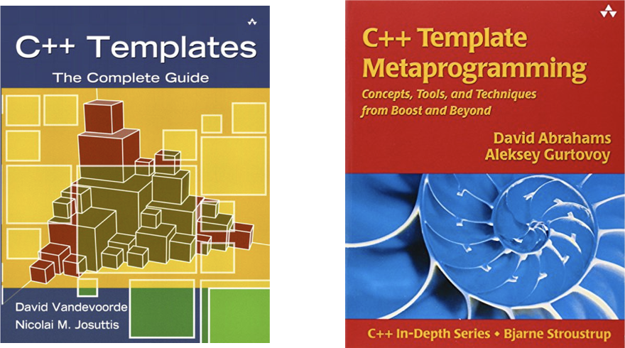
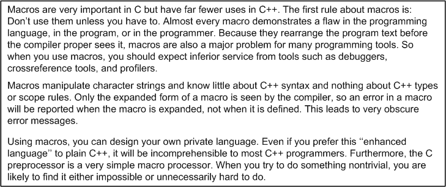
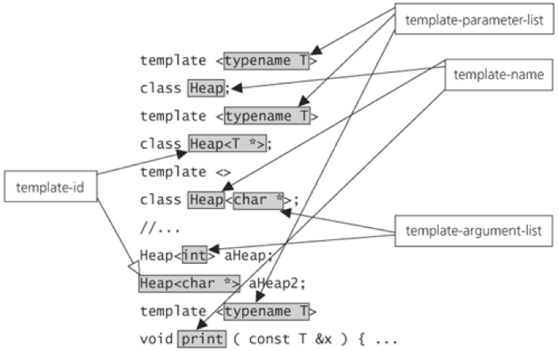

# Template meta-programming in C++
Jon Macey

jmacey@bournemouth.ac.uk

---

## Textbooks



--

## Introduction
- “Code-generating programs are sometimes called metaprograms; writing such programs is called metaprogramming”.
- There are many different forms of meta programs depending upon the language being used.
- In General this can be approached either by having a program generate new code at runtime
- Or by using some form of pre-processor.

--

## Macros in C/C++
- The C/C++ pre-processor is responsible for macro expansion.
- This happens before the code is compiled
- Usually we limit the use of Macros to the C programming language, and try to use them sparingly
- In C++ we will avoid and use templates
- However Qt uses them extensively in the moc.

--

## C Macros
- The advantage of a macro is that it can be type neutral
- it's inlined directly into the code, so there isn't any function call overhead. 
- They are defined as follows

```
#define MACRO_NAME(arg1, arg2, ...) [code to expand to]
```

--

## [macro1.c](https://github.com/NCCA/Templates/blob/master/macros/macro1.c)

```
#include <stdio.h>
#include <stdlib.h>

#define min(X, Y)  ((X) < (Y) ? (X) : (Y))

int main()
{
	int a=5;
	int b=6;
	printf("min(a,b)=%d \n",min(a,b));
	printf("min(a,b)=%d \n",min(2,3));
	printf("min(a,b)=%d \n",min('c','d'));

	return EXIT_SUCCESS;
}
```

--

## [sideeffects.c](https://github.com/NCCA/Templates/blob/master/macros/sideeffect1.c)

```
#include <stdio.h>
#include <stdlib.h>

#define MULT(x, y) x * y
#define MULTB(x, y) (x) * (y)

int main()
{
	int z = MULT(3 + 2, 4 + 2);
	int x = MULTB(3 + 2, 4 + 2);
	printf("z=%d\n",z);
	printf("x=%d\n",x);

	return EXIT_SUCCESS;
}
```

--

## [X Macros](https://en.wikipedia.org/wiki/X_Macro)
- x macros are a technique to generate compile time code structures
- They consist of two parts, 
	- a list 
	- an execution of a list
- Can be useful for generating types and lookup tables for error checking etc.
- Also allows for easy expansion / maintenance of enums and code

--

## [xmacro.c](https://github.com/NCCA/Templates/blob/master/macros/xmacro.c)

```
#include <stdio.h>
#include <stdlib.h>

#define COLOR_TABLE \
X(red, "red")       \
X(green, "green")   \
X(blue, "blue")  \
X(blue1, "blue1")  \
X(blue2, "blue2")  \
X(blue3, "blue3")  \
X(white,"white")

#define X(a, b) a,
enum COLOR 
{
  COLOR_TABLE
};
#undef X

#define X(a, b) b,
char *color_name[] = 
{
  COLOR_TABLE
};
#undef X

int main() 
{
  enum COLOR c = red;
  printf("c=%s\n", color_name[c]);
  return EXIT_SUCCESS;
}
```

--

## [xmacro2.c](https://github.com/NCCA/Templates/blob/master/macros/xmacro2.c)

```
#include <stdio.h>
#include <stdlib.h>

#define COLOR_TABLE \
X(green, , "green") \
X(red, =3, "red")   \
X(blue, , "blue")

#define X(a, b, c) a b,
enum COLOR 
{
  COLOR_TABLE
};
#undef X

#define X(a, b, c) [a]=c,
char *color_name[] = 
{
  COLOR_TABLE
};
#undef X

int main() 
{
  enum COLOR c = red;
  printf("c=%s\n", color_name[c]);
  return EXIT_SUCCESS;
}
```

--

## macros
- In general we will try not to use macros
- They are difficult to debug (however clang -E will give us the output of the pre-process as an aid)
- Can sometimes cause weird side effects and substitution issues
- Some debuggers will also have issues with the expanded code vs the source code.

--

## macros


- image Buldoder's Blog 
(ttps://bulldozer00.com/2017/04/11/sloppy-coding-ii)


---

## Options for generic programming
- Implement the the same behaviour again and again for each type that needs it (OpenGL ?)
- Write generic code using void * and force the programmer to use coercion (pthreads ?)
- Use a special pre-processor (or 3rd party tools to generate your code such as Qt’s moc)
- This usually leads to mistakes and can cause problems of maintenance and re-use.

--

## templates
- C++ requires us to declare variables, function and most other entities using specific types.
- When we write code it usually looks the same for many different functions.
- This is very obvious if we write an algorithm to sort a list of data, depending upon the data type we would need a different implementation of essentially the same thing.
- This becomes more problematic if the language your are using doesn’t support generics.

--

## [templates in C++](http://en.cppreference.com/w/cpp/language/templates)
- A template is a C++ entity that defines one of the following:
	- a family of classes (class template), which may be nested classes
	- a family of functions (function template), which may be member functions
	- an alias to a family of types (alias template) (since C++11)
	- a family of variables (variable template) (since C++14)
	- a concept (constraints and concepts) (since C++20)

```
template <class identifier> function_declaration; 
template <typename identifier> function_declaration;
```

--

## template terminology


- image from [C++ Common Knowledge](http://stevedewhurst.com/commonknowledge/index.html)

--

## template terminology
- precise terminology is important, especially when discussing templates.
- In the previous diagram we show the different names for the elements.
- The most important distinction is between the template parameter used in the definition of the template and the template argument which is used in the specialisation of the template.

--

## template terminology

```
// T is the template parameter
template <typename T> class Heap{.....};

// double is the template argument
Heap<double> dHeap;

```

--

## template terminology
- template name :
	- the simple identifier for the template 
- template id 
	- the template name with an appended template argument list. <T ….>

---

## Function Templates
- Function templates provide a functional behaviour that can be called on for different types.
- This can be though of as a family of functions.
- We basically declare a function but unlike a normal function our parameters and / or return types are abstracted so they have no initial type
- Then the compiler will replace the types with the concrete types at compile time.

--

## [max.h](https://github.com/NCCA/Templates/blob/master/templates1/max.h)

```
#ifndef MAX_H_
#define MAX_H_

template <typename T> 
T const &max(T const & a, T const & b)
{
	std::cout << __PRETTY_FUNCTION__ << '\n';
	// if a<b then use b else use a
	return a < b ? b : a;
}

#endif
```

--

## [maxtest.cpp](https://github.com/NCCA/Templates/blob/master/templates1/maxtest.cpp)
```
#include <iostream>
#include <string>
#include <cstdlib>
#include "max.h"

int main()
{
	std::cout<< ::max(2,5)<<'\n';
	std::cout<< ::max(0.1,0.02)<<'\n';
	std::cout<< ::max('a','c')<<'\n';
	std::cout<< ::max("hello","world")<<'\n';

	return EXIT_SUCCESS;
}
```
```
const T &max(const T &, const T &) [T = int]
5
const T &max(const T &, const T &) [T = double]
0.1
const T &max(const T &, const T &) [T = char]
c
const T &max(const T &, const T &) [T = char [6]]
world
```

--

## Compiler Explorer

<iframe width="1000px" height="500px" src="https://godbolt.org/embed-ro#g:!((g:!((g:!((h:codeEditor,i:(j:2,lang:c%2B%2B,source:'%23include+%3Ciostream%3E%0A%23include+%3Cstring%3E%0A%23include+%3Ccstdlib%3E%0A%0Atemplate+%3Ctypename+T%3E+%0AT+const+%26max(T+const+%26+a,+T+const+%26+b)%0A%7B%0A++++//+if+a%3Cb+then+use+b+else+use+a%0A++++return+a+%3C+b+%3F+b+:+a%3B%0A%7D%0A%0A%0Aint+main()%0A%7B%0A++++auto+a%3D::max(2,5)%3B%0A++++auto+b%3D::max(0.1,0.02)%3B%0A++++auto+c%3D::max(!'a!',!'c!')%3B%0A++++auto+d%3D::max(%22hello%22,%22world%22)%3B%0A%0A++++return+EXIT_SUCCESS%3B%0A%7D'),l:'5',n:'0',o:'C%2B%2B+source+%232',t:'0')),header:(),k:57.42148995997847,l:'4',m:100,n:'0',o:'',s:0,t:'0'),(g:!((h:compiler,i:(compiler:g72,filters:(b:'0',binary:'1',commentOnly:'0',demangle:'0',directives:'0',execute:'1',intel:'0',trim:'0'),lang:c%2B%2B,libs:!(),options:'',source:2),l:'5',n:'0',o:'x86-64+gcc+7.2+(Editor+%232,+Compiler+%231)+C%2B%2B',t:'0')),header:(),k:42.578510040021534,l:'4',n:'0',o:'',s:0,t:'0')),l:'2',n:'0',o:'',t:'0')),version:4"></iframe>

--

## global namespace
- In the previous example the max template was prefixed with :: to indicate it was in the global namespace
- This is due to potential issues with std::max
- If one argument type is in the std name space (string) according to the lookup rules both the local and std::max will be found as per the next example

--

## [ambmax.cpp](https://github.com/NCCA/Templates/blob/master/templates1/ambmax1.cpp)

```
#include <iostream>
#include <string>
#include <cstdlib>
#include "max.h"

int main()
{
	std::string a("hello");
	std::string b("templates");
	std::cout<< max(a,b)<<'\n';
	return EXIT_SUCCESS;
}

```

```
clang11 ambmax1.cpp
ambmax1.cpp:10:14: error: call to 'max' is ambiguous
        std::cout<< max(a,b)<<'\n';
                    ^~~
/Applications/Xcode.app/Contents/Developer/Toolchains/XcodeDefault.xctoolchain/usr/bin/../include/c++/v1/algorithm:2654:1: note:
      candidate function [with _Tp = std::__1::basic_string<char>]
max(const _Tp& __a, const _Tp& __b)
^
./max.h:5:10: note: candidate function [with T = std::__1::basic_string<char>]
T const &max(T const & a, T const & b)
         ^
1 error generated.
```

--

## [nomax.cpp](https://github.com/NCCA/Templates/blob/master/templates1/nomax.cpp)
- The template must be able to expand for the type and any operators

```
#include <iostream>
#include <complex>
#include <cstdlib>
#include "max.h"

int main()
{
	std::complex<float> c1,c2;
	std::cout<< ::max(c1,c2)<<'\n';

	return EXIT_SUCCESS;
}

```

```

In file included from nomax.cpp:4:
./max.h:9:11: error: invalid operands to binary expression ('const
      std::__1::complex<float>' and 'const std::__1::complex<float>')
        return a < b ? b : a;
               ~ ^ ~
1 error generated.

```

---

## template compilation
- templates are effectively compiled twice
	- Without instantiation they are checked for syntax ( e.g ; missing etc)
	- At the time of instantiation (i.e. where it is used) it is checked to see if all calls are valid.
- For ease of use and to avoid this for simple templates we can use a header and an inline function

--

## [Argument deduction](http://en.cppreference.com/w/cpp/language/template_argument_deduction)
- When we call a template function for some arguments, the template parameters determined by the arguments we pass.
- If we pass to ints to the parameter types T const & the C++ compiler must conclude that T must be an int.
- No automatic type conversion is allowed. Each T must match exactly.


--

## [argdeduct.cpp](https://github.com/NCCA/Templates/blob/master/templates1/argdeduct.cpp)

```
#include <iostream>
#include <string>
#include <cstdlib>
#include "max.h"

int main()
{
	std::cout<< ::max(4,7)<<'\n';
	std::cout<< ::max(4,4.2)<<'\n';
	
	return EXIT_SUCCESS;
}
```

```
clang11 argdeduct.cpp
argdeduct.cpp:9:14: error: no matching function for call to 'max'
        std::cout<< ::max(4,4.2)<<'\n';
                    ^~~~~
max.h : 5 : 10 : note : candidate template ignored : deduced conflicting types for
      parameter 'T' ('int' vs. 'double')
T const &max(T const & a, T const & b)
         ^
1 error generated.
```

--

## Overloading function templates
- Like ordinary functions, function templates can also be overloaded.
- The compiler must then decide which ones to use
- The rules of these decisions and how the compiler does this can get very complicated and lead to issues.
- The rules are similar to normal functions (for an in-depth discussion see Appendix B of “C++ templates the complete guide”

--

## [max2.cpp](https://github.com/NCCA/Templates/blob/master/templates1/max2.cpp)

```
/* The following code example is taken from the book
 * "C++ Templates - The Complete Guide"
 * by David Vandevoorde and Nicolai M. Josuttis, Addison-Wesley, 2002
 *
 * (C) Copyright David Vandevoorde and Nicolai M. Josuttis 2002.
 * Permission to copy, use, modify, sell and distribute this software
 * is granted provided this copyright notice appears in all copies.
 * This software is provided "as is" without express or implied
 * warranty, and with no claim as to its suitability for any purpose.
 */
// maximum of two int values
inline int const& max (int const& a, int const& b) 
{
    return  a < b ? b : a;
}

// maximum of two values of any type
template <typename T>
inline T const& max (T const& a, T const& b)
{
    return  a < b ? b : a;
}

// maximum of three values of any type
template <typename T>
inline T const& max (T const& a, T const& b, T const& c)
{
    return ::max (::max(a,b), c);
}

int main()
{
    ::max(7, 42, 68);     // calls the template for three arguments
    ::max(7.0, 42.0);     // calls max<double> (by argument deduction)
    ::max('a', 'b');      // calls max<char> (by argument deduction)
    ::max(7, 42);         // calls the nontemplate for two ints
    ::max<>(7, 42);       // calls max<int> (by argument deduction)
    ::max<double>(7, 42); // calls max<double> (no argument deduction)
    ::max('a',24);     // calls the nontemplate for two ints
}

```

--

## Compiler Explorer

<iframe width="1000px" height="400px" src="https://godbolt.org/embed-ro#g:!((g:!((g:!((h:codeEditor,i:(j:2,lang:c%2B%2B,source:'inline+int+const%26+max+(int+const%26+a,+int+const%26+b)+%0A%7B%0A++++return++a+%3C+b+%3F+b+:+a%3B%0A%7D%0A%0A//+maximum+of+two+values+of+any+type%0Atemplate+%3Ctypename+T%3E%0Ainline+T+const%26+max+(T+const%26+a,+T+const%26+b)%0A%7B%0A++++return++a+%3C+b+%3F+b+:+a%3B%0A%7D%0A%0A//+maximum+of+three+values+of+any+type%0Atemplate+%3Ctypename+T%3E%0Ainline+T+const%26+max+(T+const%26+a,+T+const%26+b,+T+const%26+c)%0A%7B%0A++++return+::max+(::max(a,b),+c)%3B%0A%7D%0A%0Aint+main()%0A%7B%0A++++::max(7,+42,+68)%3B+++++//+calls+the+template+for+three+arguments%0A++++::max(7.0,+42.0)%3B+++++//+calls+max%3Cdouble%3E+(by+argument+deduction)%0A++++::max(!'a!',+!'b!')%3B++++++//+calls+max%3Cchar%3E+(by+argument+deduction)%0A++++::max(7,+42)%3B+++++++++//+calls+the+nontemplate+for+two+ints%0A++++::max%3C%3E(7,+42)%3B+++++++//+calls+max%3Cint%3E+(by+argument+deduction)%0A++++::max%3Cdouble%3E(7,+42)%3B+//+calls+max%3Cdouble%3E+(no+argument+deduction)%0A++++::max(!'a!',24)%3B+++++//+calls+the+nontemplate+for+two+ints%0A%7D'),l:'5',n:'0',o:'C%2B%2B+source+%232',t:'0')),header:(),k:57.42148995997847,l:'4',m:100,n:'0',o:'',s:0,t:'0'),(g:!((h:compiler,i:(compiler:g72,filters:(b:'0',binary:'1',commentOnly:'0',demangle:'0',directives:'0',execute:'1',intel:'0',trim:'0'),lang:c%2B%2B,libs:!(),options:'',source:2),l:'5',n:'0',o:'x86-64+gcc+7.2+(Editor+%232,+Compiler+%231)+C%2B%2B',t:'0')),header:(),k:42.578510040021534,l:'4',n:'0',o:'',s:0,t:'0')),l:'2',n:'0',o:'',t:'0')),version:4"></iframe>


--

## function template summary
- Define a family of functions for different arguments
- When arguments are passed templates are instantiated for those arguments
- You can overload function templates
- When overloading limit changes by explicitly specifying parameters ( <int,int> )
- Make sure all overloaded versions are visible before being called 

---

## Class templates
- Like functions classes may also be parameterised with one or more types.
- This is how STL works for most containers.
- This allows the type of the element being contained to be left open
- The following example shows a simple stack template.


--

## class template declaration
- Declaring class templates is similar to declaring functions.
- Before the declaration a statement declares an identifier as the type parameter(s) 
- Usually T is used for a single simple parameter.

```
template <typename T> class NAME 
{
	..... 
};
```

--

## [Stack.h](https://github.com/NCCA/Templates/blob/master/templates1/Stack1/Stack.h)

```
#ifndef STACK_H_
#define STACK_H_

#include <vector>
#include <stdexcept>

template <typename T>
class Stack
{
	private :
		std::vector <T> m_elements;

	public :
		void push(T const &);
		void pop();
		T top() const;
		bool empty() const { return m_elements.empty();}

};

template <typename T>
void Stack<T>::push(T const & _e)
{
	m_elements.push_back(_e);
}

template <typename T>
void Stack<T>::pop()
{
	if(m_elements.empty())
	{
		throw std::out_of_range("Stack<>::pop() : empty stack ");
	}
	m_elements.pop_back();
}


template <typename T>
T Stack<T>::top() const
{
	if(m_elements.empty())
	{
		throw std::out_of_range("Stack<>::top() : empty stack ");
	}
	return m_elements.back();
}

#endif

```

--

## Stack<T>
- The type of the class is Stack<T> with T being the template parameter
- Thus you have to use Stack<T> whenever you use the class definition.
- This can be important for copy and assignment operators

```
template <typename T> class Stack 
{
	public :
	// copy ctor
	Stack(Stack<T> const&);
	// assignment operator
	Stack<T> & operator= (Stack<T> const &);
};

```

--

## member functions
- To define a member function of a class template you have to specify that it is a function template.
- You also have to use the full template qualification as shown in the previous example.

--

## [stacktest1.cpp](https://github.com/NCCA/Templates/blob/master/templates1/Stack1/stacktest1.cpp)

```
#include <iostream>
#include <string>
#include <cstdlib>
#include "Stack.h"

int main()
{
	try
	{
		Stack <int> intStack;
		Stack <std::string> stringStack;

		intStack.push(7);
		std::cout<< intStack.top() << std::endl;

		stringStack.push("hello");
		std::cout<< stringStack.top() << std::endl;
		stringStack.pop();
		stringStack.pop();

	}	
	catch(std::exception const &ex)
	{
		std::cerr<<"Exception : "<< ex.what()<<'\n';
		exit (EXIT_FAILURE);
	}

	return EXIT_SUCCESS;
}
```

--

## Compiler Explorer

<iframe width="1000px" height="400px" src="https://godbolt.org/embed-ro#z:OYLghAFBqd5QCxAYwPYBMCmBRdBLAF1QCcAaPECAKxACZSAbAQwDtRkBSWgIS%2B9IDOqAK7FkmEAHIuAZjwtkDYVgDUHGQGEAbpmRFi67BwAMAQVnzFyzGs0CCWAB7iADgUMnztOQqWr1Gnio9sSYTAC2HmYWvta2GiHywFFePlb%2Bmsj26Ax4AEYpngSY4S7MxfEEAJ4umCwRNgAqKYpMAgIqAMoETMgA1p4cAOy80cYAnC7EeFpMFSCDEybj2SAgOnok8c0y2CrhAPqYDCV1BALqo%2BZjk8J5ucgqCzfLWqh46CouwgIIEI0qNAsexqWgANgAlJdFuNXu9Pi5UC4IFCZFdlssAURkRDAahge40TDlnlUKgGCoSm4qii8QS1CMVKECKIWPsjidwmcBAA6KnVFHQoYAEUW5hF0LGpmKpXKNgC1Vq9S5Kh2RjMbw%2BXR6/QCarW31%2B/zpIK4YJURyh0RGMMOx1OLHOPMNCAOeV6fQglsl4tFUplZTm8s0irqDVVKU1n26Hr1hgNSMF1vREzwADMIHbOdy%2BaUBRCrddYTaXhMCAhiKgAO4qVYgEQEA6oNMHYisYCYCBcWgx3WaeMgRE4p6UvNVWs6vqg2iolPFv1FrMOp1Dt0ewVE60LsUBuWVGphlVqzwA3sDTT6kDY2lA%2ByDEtF9OZjnL3n8mkF4kPjFlivVifoGsDZNi2bZsJ23ZngEA7XriICjtSE4etOs5ftuEzMqy7L2lyjq8u6/QbuiEpSp48gEPsTDyEm4pzgQxBVF%2Bc7LGe8TkYYKjkVBm5Fixk7xHWiRsBxQnANxKa8amjpns6Px/EMqGlisDhrGgwiEhoAScdJk48rB8RaWA0gAKwaCwRk%2BsSEyiTJLpdrQtAIMcDCoN2imScpgEoA20GaBO0xsDJ%2Bm%2BRoKgWaZ5nSDxP7KQFYm6UORFWbFSS2Ym7loT%2BRbIHMyB/HWmDOJgbhBGyt4UWahWFhi35LNZKkoJgxAGP2/YOdgRUlfiI7diFlKODyVYIHMG6aZo4VmRZ0V1eMhWECoEDYAAGgAko0BwAGKmCtAAyACqABK2AZUsJHXEWmHEGyy1rQcnR7RoGjYJ0nSWWdYpipIEKMFIxmSKQLBSMY/2oFImk8HwtYiGI8reLQ/0EEDX3fU5TBYMQlDfX0IDGUMPIACy0AAjPjAAc4zjMZFNDKT%2BNDD9kj4/94QgETxjGADSOkKDkj/QIIAc4jkjA99cCwEgaClHgJxkBQECSy40tNSAwBDPQabS8UxD8xAeRc3k8hMAxUhE/9ku4QQADyLAMFUXNYOE7YnPbeChHoMyYPzwv/YVujqRIkim%2BQjrHFz9F4Cz3vfcwbAoHwfCMPk/OQN9SIEKVXt89D4h0NHv3/YD3vc1Ijik2CAC0YL4yowDII8eO0AtuCEFssj0CoGioFLMugjIRO4uDvA8AjSMFqQqPo5jpDY4TPK46Txls8Y%2BPs8TxkyPjDNM5zRc83zAukELIt55I8M78Dxe84fo/fTo2ulSA%2BNAA%3D%3D"></iframe>

--


## Using the Stack<T>
- In the previous example we use ```Stack<int>``` and ```Stack<std::string>``` to instantiate two different versions (specialisation) of the Stack
- Code is only created (instantiated) for the methods that are called on the stack for that type.
- As pop is only used on the ```std::string``` stack it will only be created for that version.

--

## types
- An instantiated class template can be used as a type. 
- The following examples show this

```
void foo(Stack<int> const &_s)
{
	Stack<int> istack[10]; // array of int stacks
	....
}

typedef Stack<int> IntStack;
IntStack a;
typedef Stack<float *> floatPtrStack;
typedef Stack<int> IntStack;
Stack <Stack<int> > intStackStack;
// error
Stack <Stack<float>> floatStackStack;	

```

--

## template specialisation
- Class templates can be specialised for certain arguments.
- This is similar to normal function overloading, however could result in a complete new class implementation.
- The following example overloads the Stack for the std::string

--

## [stack.h](https://github.com/NCCA/Templates/blob/master/templates1/Stack2/Stack.h)

```
#ifndef STACK_H_
#define STACK_H_

#include <vector>
#include <string>
#include <stdexcept>

template <typename T>
class Stack
{
	private :
		std::vector <T> m_elements;

	public :
		void push(T const &);
		void pop();
		T top() const;
		bool empty() const { return m_elements.empty();}

};

template <typename T>
void Stack<T>::push(T const & _e)
{
	m_elements.push_back(_e);
}

template <typename T>
void Stack<T>::pop()
{
	if(m_elements.empty())
	{
		throw std::out_of_range("Stack<>::pop() : empty stack ");
	}
	m_elements.pop_back();
}


template <typename T>
T Stack<T>::top() const
{
	if(m_elements.empty())
	{
		throw std::out_of_range("Stack<>::top() : empty stack ");
	}
	return m_elements.back();
}

#include <deque>
template <>
class Stack<std::string>
{
	private :
		std::deque <std::string> m_elements;

	public :
		void push(std::string const &);
		void pop();
		std::string top() const;
		bool empty() const { return m_elements.empty();}

};

void Stack<std::string>::push(std::string const & _e)
{
	m_elements.push_back(_e);
}

void Stack<std::string>::pop()
{
	if(m_elements.empty())
	{
		throw std::out_of_range("Stack<std::string>::pop() : empty stack ");
	}
	m_elements.pop_back();
}


std::string Stack<std::string>::top() const
{
	if(m_elements.empty())
	{
		throw std::out_of_range("Stack<std::string>::top() : empty stack ");
	}
	return m_elements.back();
}


#endif
```

--

## partial specialisation
- Class templates can be partially specialised
- You can specify special implementations for particular circumstances, however some template parameters must still be defined by the user
- given the following class template

```
template <typename T1, typename T2> class MyClass
{
	..... 
};
```

--

## partial specialisation

```
// both have the same type
template <typename T> class MyClass<T,T>
{
	..... 
};

// second type is int
template <typename T> class MyClass<T,int> 
{
	..... 
};

// both are pointer types
template <typename T1, typename T2> class MyClass<T1*,T2*>
{
	..... 
};
```

--

## deduction for specialisation

```
MyClass<int,float> mif; // uses MyClass<T1,T2> 
MyClass<float,float> mff; // uses MyClass<T,T>
MyClass<float,int> mfi; // uses MyClass<T,int> 
MyClass<int*,float*> mp; // uses MyClass<T1*,T2*>
// these are ambiguous and cause Errors
MyClass<int,int> m; // matches MyClass<T,T> and MyClass<T,int> 
MyClass<int *, int *> m; //matches MyClass<T,T> and MyClass<T1*,T2*>
```

```
// the last error can be removed by doing this partial specialisation
template <typename T> class MyClass<T*,T*> 
{
	..... 
};
```

--

## Compiler Explorer

<iframe width="1000px" height="500px" src="https://godbolt.org/e#z:OYLghAFBqd5QCxAYwPYBMCmBRdBLAF1QCcAaPECAKxACZSAbAQwDtRkBSWgIS%2B9IDOqAK7FkmEAHICmALYAHZjIDUHAMwBhAgE95mFk1mZlAFQCMpZTr0Gjp2uuzLkzAQOUBZbRtcCOABgBBDgB2XiDlZXlhACMGPGRlEADAyMivHyY3CHNlJksTWmUYgEok5VkAfSYIJhLSKpiIUtDeEIARdXDUtNyqpi6UtPsKypjBoNDOtW6UgHo54tQCBGUEJgA3YxXjAUNt3UwUmQUlY3UtQ9tjE0dnX09vXwuTUlu1bBTWoajY%2BMTkhE0hlfDk8gVimUQKManUGmNmiVvh0Jj1IiYYajhhjGqipniggtlAJMGgWOgrIdlHh3HgWARjnJFEwVBdrPp9qY7i4su4QbyXuR6XcvmEftE4gkkj90k9eWD8tT6ZDyv1avVGojkdNutjMTMZUqCKNxgbJiizcFCYsYstVkxiMZ5Kg6TJiJS9H4gidmazNOzrqYLB6OXZCtyHvy3C8zAAqN60WOOUW636SgGGqMCHJmZSxxWFPOlVXVdXwpotMUW1Po3Ox/pY3pFetjPHVr5BV0VJh0iBI801x6ZaOaV2kABmDFQLLusjw44gFn8ADoAKzjpEzZRE4QkvlykcacwJkVA2XDvyaSfTggTqczj4VccLlfr0ivjddbeLXeYfcXwV3k%2BM8h2eK971vV1Z3HPBF2Xfxx1IMxN24b9lF/f8wKPIUGUfQ0uwGNR2jMfxG0ia8WWKdR2g/MjQIFUd6XjCiCCTR8FAgLgADZ8m4lotx3Pd6MPcx40KNjgMCIkdhJPJHTyWQYjwYBhBEdxWApZAmF/ZRsGIYgSC9KTFizC4xyg9ivyJWQWWQBA/2Ey9sKAvJyUcwULKceYTIPJyu3jI081nKy5hsgg7Ic0zNFeFyNPc6K4wTCSO2CDpJHqBgpFXSRSBYKR/By1ApA0Pg%2BGJEQxHOWg1FoHKCHy9L6nspgsGISh6gAaxAVcQmXAAWWgzD6gAOABOUbV3GkJhr6kJGCkPqctkEASP8XKGtIIrJBygQQDW%2BrJAK%2Bo4FgJA0AUPAGEwMgKAgc75Eu66QGAEJ6Bghg3V25oNqUgxiG0KQzBy86jHpAB5FgGABw6cqwGy2Cujb8EdZACDwLZdph0hMAAD1JYQZEBnLXUwTKsYIYg8GWmGMtYdhSp4Rg8BiXbIHqVB5DR1AWExnaKvEOgMqynK8qxraceGriAFouL65RgGQRJeqKCBcEIEhVGq%2BhlA0VALqu90uDUZCdYZ7g6oakomswFqnr7UguoGtdptXVa%2Bv8fxBtXNQ%2BvmyRFvWsWpB2vbSAOo6hckWrA4Kzbg7Dy36i2YgBDwbmQD6oA%3D"></iframe>


---

## Default Template Arguments
- In the previous example we created a specialisation for std::string
- We can modify our class template to pass in a container type (which is also a template)
- By setting this to default to std::vector we can for most times use this but specialise if we wish.

--

## [stack.h](https://github.com/NCCA/Templates/blob/master/templates1/Stack3/Stack.h)

```
#ifndef STACK_H_
#define STACK_H_

#include <vector>
#include <string>
#include <stdexcept>

template <typename T, typename CONTAINER=std::vector<T> >
class Stack
{
	private :
		CONTAINER m_elements;

	public :
		void push(T const &);
		void pop();
		T top() const;
		bool empty() const { return m_elements.empty();}

};

template <typename T, typename CONTAINER>
void Stack<T,CONTAINER>::push(T const & _e)
{
	m_elements.push_back(_e);
}

template <typename T,typename CONTAINER>
void Stack<T,CONTAINER>::pop()
{
	if(m_elements.empty())
	{
		throw std::out_of_range("Stack<>::pop() : empty stack ");
	}
	m_elements.pop_back();
}

template <typename T,typename CONTAINER>
T Stack<T,CONTAINER>::top() const
{
	if(m_elements.empty())
	{
		throw std::out_of_range("Stack<>::top() : empty stack ");
	}
	return m_elements.back();
}

#endif
```

--

## [specialization.cpp](https://github.com/NCCA/Templates/blob/master/templates1/Stack3/specialization.cpp)

```
#include <iostream>
#include <string>
#include <cstdlib>
#include <deque>
#include "Stack.h"

int main()
{
	try
	{
		Stack <int> intStack;
		Stack <std::string,std::deque<std::string> > stringStack;

		intStack.push(7);
		std::cout<< intStack.top() << '\n';

		stringStack.push("hello");
		std::cout<< stringStack.top() << '\n';
		stringStack.pop();
		stringStack.pop();

	}	
	catch(std::exception const &ex)
	{
		std::cerr<<"Exception : "<< ex.what()<<'\n';
		exit (EXIT_FAILURE);
	}

	return EXIT_SUCCESS;
}
```

--

## Nontype parameters
- template parameters don’t have to be types
- The can also be ordinary values.
- The value will need to be declared explicitly.
- The following example show this in action to create a simple Array class (which is now in C++ 11)

--

## [Array.h](https://github.com/NCCA/Templates/blob/master/templates1/Array/Array.h)

```
#ifndef ARRAY_H_
#define ARRAY_H_
#include <stdexcept>

template <typename T, size_t SIZE=0>
class Array
{
	private :
		// our array data
		T m_data[SIZE];
		// function to check for a valid array range.
		void rangeCheck(std::size_t idx);

	public :
		// ctor will set the data to zero type
		Array();
		// this is constant so can be static
		static size_t size()  {return SIZE;}
		// access data elements
		T& at(std::size_t idx);
		// subscript operators 
		T& operator[](std::size_t idx); 
		const T& operator[](std::size_t idx) const ;

    // read only data access
    const T* data() const { return m_data; }
    T* data() { return m_data; }

    Array<T,SIZE>& operator= (const Array<T,SIZE>& rhs); 

		// types for iterators (boost style definitions)
		typedef T*  iterator;
		typedef const T*  const_iterator;
    // begin iterators
    iterator        begin()        { return m_data; }
    const_iterator  begin()  const { return m_data; }
    const_iterator  cbegin() const { return m_data; }
    // end iterators
    iterator        end()        { return m_data+SIZE; }
    const_iterator  end()  const { return m_data+SIZE; }
    const_iterator  cend() const { return m_data+SIZE; }
    
};


template <typename T, size_t SIZE>
Array<T,SIZE>& Array< T,SIZE>::operator= (const Array<T,SIZE>& rhs)
{
    std::copy(rhs.begin(),rhs.end(), begin());
    return *this;
}


template <typename T, size_t SIZE>
Array< T,SIZE>::Array() 
{
	// set to the default ctor value of T 
	for(size_t i=0; i<SIZE; ++i)
		m_data[i]=T();
}


template <typename T, size_t SIZE>
void Array<T,SIZE>::rangeCheck(std::size_t idx)
{
	if( idx>SIZE)
		throw std::out_of_range("index out of range in Array<T>::at");
}


template <typename T, size_t SIZE>
T& Array< T,SIZE>::operator[](std::size_t idx)
{
	rangeCheck(idx);
	return m_data[idx];
}

template <typename T, size_t SIZE>
T& Array< T,SIZE>::at(std::size_t idx)
{
	rangeCheck(idx);
  return m_data[idx];
}


template <typename T, size_t SIZE>
const T& Array< T,SIZE>::operator[](std::size_t idx) const 
{
	rangeCheck(idx);
  return const_cast<T&>(m_data[idx]);
}


#endif
```

--

## [arraytest.cpp](https://github.com/NCCA/Templates/blob/master/templates1/Array/arraytest.cpp)

```
#include <iostream>
#include <cstdlib>
#include <string>
#include "Array.h"

int main()
{
	Array<int,10> intArray;

	for(int i=0; i<intArray.size(); ++i)
	{
		intArray[i]=i;
	}
	// copy array
	Array<int,10> array2=intArray;

	Array<int>::const_iterator begin=array2.begin();
	Array<int>::const_iterator end=array2.end();

	while(begin !=end)
	{
		std::cout<<*(begin++)<<" ";
	}
	std::cout<<'\n';
	try
	{

		std::cout<<"try to access element at -1 \n"<<intArray.at(-1)<<'\n';
	}
	catch(std::exception const &ex)
	{
		std::cerr<<"Exception "<<ex.what()<<std::endl;
	}
	try
	{
		std::cout<<intArray.at(6)<<'\n';
	}
	catch(std::exception const &ex)
	{
		std::cerr<<"Exception "<<ex.what()<<'\n';
	}
	try
	{

		std::cout<<"try to access element at 99 \n"<<array2.at(99)<<'\n';
	}
	catch(std::exception const &ex)
	{
		std::cerr<<"Exception "<<ex.what()<<'\n';
	}

}
```

--

## Compiler Explorer

<iframe width="1000px" height="500px" src="https://godbolt.org/e#z:OYLghAFBqd5QCxAYwPYBMCmBRdBLAF1QCcAaPECAKxACZSAbAQwDtRkBSWgIS%2B9IDOqAK7FkmEAHIuAZjwtkDYVgDUHGQGEBBLAA9xABwLrsHAAwBBcxYKYAtgea21mggE8DmFkzuYVAFVIVATwAL0wAfQIVAGUASQAtUxkAETMTa0UmAQEVC2JiJjdrDgB2XktzAE4DYjwANyZnEBKzKuqAeg6VEWIVJgKilXQmplb2tv8VOwiRgjGAVm54pI4FlPUKqzbO7oAzYQUCPFQWFSIVZARMZABrFT2SfpVGhjx0fsG3FUK2TAA6cbVeqod4/VjATAaa53CDadAgEAhcJRFTvXQASk2rW2NWEACM3sgVC1Kjs2l1LkQ%2BgB3PAMBjBTDRAjXYajc6oFThYhc9yeIFtfKFNwQLEyLbVXbnBB4XJyy6nbSsaJCS6sFT4vzK46cMkTKo6vDE5GRVVhTBilRqcrEZmiM4rZK8UobfXSpjIcQ5dnzFSYBj2LwEASCqr%2BLgANn6BDhOkRptR6PFkvJVUpAgJAmQdSMPU8hWpuTDEdo0dQBaaJDWvHWcYRSItSfQmM2andbTQLG0ASj%2BcwherSzWKXrCab0WTiu70WxZIs1utlLtTA%2BpwY3zmTH6XswOWsi%2BnPf8ACpfUwrV2e2VuD97cQzjMt22ym6F4vT%2BerTe7wQHdNZlGF9XRxQ9hSKdQNECJ0MjLftB2IdQUhUCAr2icDik0aDEmSUw4OIBABBTdttlxaV%2BT3B4nkIAcq2IXIIHxVBUB7bQ3EDYZMD2eRCBObssQ7KoKKwPYAjPNFbAQucyLaYSuKPaJPwUiIaKkiUD0XSktWAeQJNoosNOtVS6MPQ9tPkK1TOtH87T/B8AOfCUbTfQ80JUySTM1TAdJYSy0JtW9bP/J8gKc19DOU4zqWtZBzN8jEFIC39gsA%2BZgJczTui8D4opIUNLEPXK%2Bis/0WHQSyrJs%2B9H1SsYeBgsKQIKxc3KK61sr8pVZ3KZL7JCtL6pw9KItajzosuDqEv8qq7Jq59BtWRqMusyoQPU%2BdrFsBwnD8SCKO8XwAiCRNoga0xLAwyDsMWvDo0uzQjrOxEK306tUhQ/z7qg0gzr7AiiJKcoIvhRE0AMUV/v%2BOKxVISHJqCaGMRTCKgvsk9WTlaTwo2ywtscJpdtcDwvB8PxAmCCdYiGmRzosL7Hup7BEQw79VtTdNugEZlORlPwRKYYQGGiZBoteYQ/FQUSpnGR5iDhSm8CQ9InMVzQGtvPg%2BDwASZKqfrFm4RX1iQ/wxSxprSM2%2Bx8ecPbiYOsnjsp37LBBMEvuu3DEV%2BSFoRuW4x0bFFJxbHWb3GPA9ggNEWxMJ0w7TVleRpYJ4xAEQCAiSWIh9y0uFoeQ9B6YRokl8E/jRM4PZMREmnz5HVrfHE8Z2lwNH20mjop4OqZu6xSzur5IIZm7nsrakaxHQOTpj1s2fGXO/dhZMsbaVG5qApZ0RHc2m9x63W7tzwHa7meXYsAe8iHh7PZrkAmmnhXQ8B9nF5hAOV/W9914czfDdj42X9saW3nC3AmbcO6HXJmfRmmQuq9jgvTW%2BNMx6vUQsOOsIMg5mlnlNeBL8F4QihO/CAn8tjWh/m5ZA2RjBYSjCYCA%2Bsazb3WA3KwFscSyHkIoZQhMNAnG0CuOwGRKi0DkAoJQqhILIHhG8fEIirBiO4ZIvhgj5DAAUVwiRvC24sGEL4OonAaYlCUdoqRmgmAMGACQQgCBhHGPnPIaIdgmAWTDkDZq1ovpONIAARmVtgSuBB7rkMXLLCAAsLiqzSG2VW/CWDBK%2BP8U0Zswo8C1jrEqQTLpbx3qkVWoSlzdDBt8AYIoIreISX4gJnwRS0CQk4kJoFFyVNoUzFAXV3JoK8j5JCZSii0Cht5Nx0kwLX3iW00GnS2rZT6V8QZk1d6SAxIwKQCxJCkBYFIMwGzUBSA0JrHgwRejiDUGI2gGyCDbOWSs64q4ByUBWbcEACxSj/AACy0F8e8gAHFUKoCx/mlB%2Be80oqzJDvI2XYEA/izCbOuaQPZkgNkCBAHCq5kgdkrLgLAJAaAHD0gHOQSg%2BKDCEuICAYApR6DcSFgOVFjEEX4nkAMNwUhfEbPxb4BJAB5FgG4EVYBcWwQMgq8B2hFg0PcCLMC6BuCXCQkgOXkASQGBFBA6jQsxcsxgEIUCHP4HI1FkAVkVmOEqKQKKTkSFoCshgayNlbO1YiqQugfmRgALSRneSoYAXoVBvNoChXAhAniyHoCoDQqACWBj6LIXxCUDnpJ4Jc65SNSB3KwBSmGzzPn/FeT8hYsL3lmDMF8hYMh3ngshfC51SKUVotIBirFdqpAXNrTsl1yKm1ppWfUelfEQDvKAA%3D%3D"></iframe>


---

## [typename](http://en.cppreference.com/w/cpp/keyword/typename)
- The keyword typename was introduced during the C++ 11 standardisation process
- It helps to clarify that an identifier within a template is a type.
- It should be used instead of class (which could be used in the previous versions of C++) 

```
template <typename T> class MyClass
{
  typename T::SubType *ptr;
};
```

--

## [typename](http://en.cppreference.com/w/cpp/keyword/typename)
- In the previous example typename is used to clarify that SubType is a type defined within class T.
- Thus ptr is a pointer to the type T::SubType
- Without typename SubType would be considered a static member.
- A typical application of this would be to give access to iterators within STL containers

--

## [printcontainer.cpp](https://github.com/NCCA/Templates/blob/master/templates2/printcontainer.cpp)

```
#include <iostream>
#include <vector>
#include <list>

template <typename T>
void print(T const &_c)
{
	typename T::const_iterator pos;
	typename T::const_iterator end(_c.end());
	for(pos=_c.begin(); pos!=end; ++pos)
	{
		std::cout<< *pos <<' ';
	}
	std::cout<<'\n';
}

int main()
{
	// note c++11 init lists
	std::vector <int> v1={1,2,3,4,5};
	std::list <float> l1={0.1,0.2,0.5,0.3};
	print(v1);
	print(l1);

}
```

--

## typename
- In this function the parameter is an STL container of type T
- To iterate over the elements we need to access the iterators.
- We need to qualify it with the leading typename as internally it would be specified thus

```
class stlcontainer 
{
  ....
  typedef ... iterator;
  typedef ... const_iterator;
  ....
};
```

--

## the .template construct
- A simple problem was discovered after the introduction of typename.

```
#include <iostream>
#include <string>
#include <cstdlib>
#include <bitset>

template <size_t N>
void printBitset(std::bitset<N> const &b)
{
	//                                ^^^ is this a less than or template?
 	std::cout << b.template to_string < char, std::char_traits<char>, 
																		std::allocator <char> >()
																		<<'\n';
}

int main()
{
	std::bitset<8>b(std::string("10101010"));
	printBitset(b);
	return EXIT_SUCCESS;
}
```

- This only happens if the construct before the period depends upon the template argument.

---

## Member Templates
- Class Members can also be templates.
- This is possible for both nested classes and member functions.
- The following example show this in action with an a templated assignment operator.
- This will allow us to assign and implicitly convert types that allow this (such as int to float)

--

## [Stack.h](https://github.com/NCCA/Templates/blob/master/templates2/MemberStack/Stack.h)

```
#ifndef STACK_H_
#define STACK_H_

#include <deque>
#include <stdexcept>

template <typename T>
class Stack
{
	private :
		std::deque <T> m_elements;

	public :
		void push(T const &);
		void pop();
		T top() const;
		bool empty() const { return m_elements.empty();}
		template <typename T2>
		Stack<T> & operator=(Stack<T2> const &);
};

template <typename T>
void Stack<T>::push(T const & _e)
{
	m_elements.push_back(_e);
}

template <typename T>
void Stack<T>::pop()
{
	if(m_elements.empty())
	{
		throw std::out_of_range("Stack<>::pop() : empty stack ");
	}
	m_elements.pop_back();
}


template <typename T>
T Stack<T>::top() const
{
	if(m_elements.empty())
	{
		throw std::out_of_range("Stack<>::top() : empty stack ");
	}
	return m_elements.back();
}

template <typename T>
template <typename T2>
Stack<T> & Stack<T>::operator=(Stack<T2> const &_rhs)
{
	// self assignment?
	if((void *)this == (void *)&_rhs)
	{
		return *this;
	}
	// copy stack with type 2
	Stack<T2> tmp(_rhs);
	// remove existing data
	m_elements.clear();
	while(!tmp.empty())
	{
		m_elements.push_front(tmp.top());
		tmp.pop();
	}
	return *this;
}


#endif
```

--

## [membertemplate.cpp](https://github.com/NCCA/Templates/blob/master/templates2/MemberStack/membertemplate.cpp)

```
#include <iostream>
#include <string>
#include <cstdlib>
#include "Stack.h"

int main()
{
	Stack <int> intStack;
	for(int i=0; i<5; ++i)
	{
		intStack.push(i);
	}
	Stack <float> fStack;
	fStack=intStack;
	while(!fStack.empty())
	{
		std::cout<<fStack.top()<<'\n';
		fStack.pop();
	}

	// Stack <std::string> sStack;
	// sStack=fStack;

}
```

--

## Stack<T>::operator =
- In this example an inner template parameter T2 is defined.
- The member function has to make a temporary copy of the parameter passed in.
- This is due to them being different types and thus only being able to use the public interface of the 2nd type to access the data.
- We now use a std::deque as we need to access the data via top() which necessitates the pushing of the data to the front of the stack.

--

## non conversion

```
// Stack <std::string> sStack;
// sStack=fStack;
```

- In this case the conversion is not possible, however the error message from the compiler will appear where the conversion takes place

```
In file included from membertemplate.cpp:4:
./Stack.h : 64 : 14 : error : no matching member function for call to 'push_front'
                m_elements.push_front(tmp.top());
                ~~~~~~~~~~~^~~~~~~~~~
membertemplate.cpp : 22 : 8 : note : in instantiation of function template
      specialization 'Stack<std::__1::basic_string<char> >::operator=<float>'
      requested here
        sStack=fStack;
```

---

## Template Template Parmeters
- It is also possible to allow a template parameter itself to be a class template
- For example if we wished to use different internal containers for the stack, we would have to specify the internal container and it’s type.
- This means we can specify the container without the type of  the elements.

```
Stack<int,std::vector<int> > // declare int twice 
Stack<int,std::vector> // just use same type
```

--

## Argument matching

```
template < class T, class Alloc = allocator<T> > class deque;
```
- In the following example we are going to use the std::deque as the default template
- The deque has the template parameters as shown above and we will need to match these when we create our template template class.
- To do this we use the std::allocator template

--

## Allocators
- Encapsulates a memory allocation and deallocation strategy
- Allocators are classes that define memory models to be used by some parts of the Standard Library, and most specifically, by STL containers.
- Usually we use the default std::allocators however by providing this template still allows us to define our own if we wish.
- This allows us to create our own memory pools, shared memory allocations etc for stl containers if we wish.


--

## [Stack.h](https://github.com/NCCA/Templates/blob/master/templates2/TemplateTemplate/Stack.h)

```

#ifndef STACK_H_
#define STACK_H_

#include <deque>
#include <stdexcept>
#include <memory>

template <typename T,
          template <typename CELEM, 
                    typename = std::allocator<CELEM>>
                    class CONTAINER = std::deque>
class Stack 
{
private:
	CONTAINER<T> m_elements;  

public:
	void push(T const&);  
	void pop();           
	T top() const;         
	bool empty() const { return m_elements.empty(); }

	template<typename T2, template<typename CELEM2, 
			 typename = std::allocator<CELEM2>>class CONTAINER2>
	Stack<T,CONTAINER>& operator= (Stack<T2,CONTAINER2> const&);
};

template <typename T, template <typename,typename> class CONTAINER>
void Stack<T,CONTAINER>::push (T const& CELEM)
{
    m_elements.push_back(CELEM);   
}

template<typename T, template <typename,typename> class CONTAINER>
void Stack<T,CONTAINER>::pop ()
{
	if (m_elements.empty()) 
	{
		throw std::out_of_range("Stack<>::pop(): empty stack");
	}
	m_elements.pop_back();        
}

template <typename T, template <typename,typename> class CONTAINER>
T Stack<T,CONTAINER>::top () const
{
	if (m_elements.empty()) 
	{
		throw std::out_of_range("Stack<>::top(): empty stack");
	}
	return m_elements.back();     
}

template <typename T, template <typename,typename> class CONTAINER>
template <typename T2, template <typename,typename> class CONTAINER2>
Stack<T,CONTAINER>&
Stack<T,CONTAINER>::operator= (Stack<T2,CONTAINER2> const& _rhs)
{
	if ((void*)this == (void*)&_rhs) 
	{    
		return *this;
	}

	Stack<T2,CONTAINER2> tmp(_rhs);       
	m_elements.clear();                  
	while (!tmp.empty()) 
	{        
		m_elements.push_front(tmp.top());
		tmp.pop();
	}
	return *this;
}
#endif

```

--

## [stacktest.cpp](https://github.com/NCCA/Templates/blob/master/templates2/TemplateTemplate/stacktest.cpp)

```
#include <iostream>
#include <string>
#include <cstdlib>
#include <vector>
#include "Stack.h"

int main()
{

	Stack <int> intStack;
	for(int i=0; i<5; ++i)
	{
		intStack.push(i);
	}
	Stack <float> fStack;
	fStack=intStack;
	while(!fStack.empty())
	{
		std::cout<<fStack.top()<<'\n';
		fStack.pop();
	}
	std::cout<<"using Vector stack\n";
	// stack for ints using a vector as an internal container
	Stack<int,std::vector> vStack;
	vStack.push(42);
	vStack.push(7);
	std::cout << vStack.top() << '\n';
	vStack.pop();
}

```

---

##  using string literals
- String literals can throw up interesting problems with template parameters
- Consider the following template

```
template <typename T>
inline T const &max(T const &a, T const &b)
{
	return a<b ? b : a; 
}
```

--

## [using string literals](https://github.com/NCCA/Templates/blob/master/templates2/stringliteralarg.cpp)

```
// from C++ templates the complete guide
#include <iostream>
#include <cstdlib>
#include <string>

template <typename T>
inline T const &max(T const &a, T const &b)
{
	return a<b ? b : a;
}

int main()
{
	std::string s;
	::max("apple","peach");
	::max("apple","tomato");
	::max("apple",s);
	return EXIT_SUCCESS;
}
```

- The first compare will work as the size of the strings is the same.
- The other will fail as they are effectively const char data of different sizes. 

---


##Templates in practice
- Normal code is usually placed in the following formats
	- Classes and other types in header files.
	- For global variables and (non-inline) functions only the declaration is put in the .h header file.
	- The definition is put in the .c(pp) file
- This works well and helps the linker.

--

## [Problem1](https://github.com/NCCA/Templates/tree/master/templates2/SeprateFiles)

```
#ifndef TYPE_H_
#define TYPE_H_

	template <typename T>
	void printType(T const &); 
#endif
```

```
#include "Type.h"

#include <iostream>
#include <typeinfo>

template<typename T>
void printType(T const &_t)
{
	std::cout<<"Type is :"<< typeid(_t).name()<<'\n';
}
```

--

## [Problem1](https://github.com/NCCA/Templates/tree/master/templates2/SeprateFiles)

```
#include <iostream>
#include <cstdlib>
#include "Type.h"

int main()
{
	float f=0.1f;
	printType(f);
	return EXIT_SUCCESS;
}
```
- Linker has problems as printType has not been instantiated.

```
clang11 *.cpp
Undefined symbols for architecture x86_64:
  "void printType<float>(float const&)", referenced from:
      _main in main-822501.o
ld: symbol(s) not found for architecture x86_64
```

--

## Problem 1
- The compiler is happy and will compile both modules.
- In order for the template to be instantiated, the compiler must know which definition should be instantiated and for which template arguments.
- In the previous example these two pieces of information are in different files and the compiler assumes it will be resolved by the linker.
- However it is the compilers job to do the instantiation.

--

## The inclusion model
- Typical practice is to place the template definition and declaration in the same header file
- This does have some issues
- Increased cost of compilation due to having to include other headers <iostream>
- This can significantly increase the compilation time
- Still the best method for most simple cases

--

## explicit instantiation

```
template void printType<double>(double const &);
template void printType<float>(float const &);
```

- The C++ standard allows us to manually instantiate a template.
- This is advantageous as we can generate all the types we may need in advance
	- can cause problems with maintenance etc when using libraries.
	- can be tuned to speed compilation in some case.

---

## [parameter pack](http://en.cppreference.com/w/cpp/language/parameter_pack)
- A function parameter pack is a function parameter that accepts zero or more function arguments 
- A template parameter pack is a template parameter that accepts zero or more template arguments
- A template with at least one parameter pack is called a variadic template
- ```typename... Args``` is called a template parameter pack
- ```Args.. args``` is called a function parameter pack (Args is by convention only)

--

## [variadic templates](https://msdn.microsoft.com/en-gb/library/dn439779.aspx)

```
template<typename... Params>
```

- These were introduced into the C++ 11 standard
- Prior to this all templates could only have a set number of arguments, set at declaration time
- When the ellipsis (…) operator appears to the left of a name it declares a parameter pack.
- When the ellipsis operator occurs to the right of a template or function call argument, it unpacks the parameter packs into separate arguments

--

## recursion
- As it is difficult to expand the (comma) separated parameter packs we usually use recursion
- Typically a simple non templated function will be generated for the 0-1 argument version
- Then a templated parameter pack version will be generated which will expand and call the simple version.
- The following example shows a simple printf style function that uses the % as a place holder for arguments (Qt Style)

--

## [variadicprint.cpp](https://github.com/NCCA/Templates/blob/master/templates2/variadicprint.cpp)

```
#include <iostream>
#include <cstdlib>
// base function
void print(const char* format) 
{
    std::cout << format;
}

// recursive variadic function
template<typename T, typename... Targs>
void print(const char* format, T value, Targs... Fargs) 
{
    for ( ; *format != '\0'; format++ ) 
    {
      // if we have a place holder expand 
      if ( *format == '%' ) 
      {
        std::cout << value;
        // recursive call
        print(format+1, Fargs...); 
        return;
      }
    std::cout << *format;
    }
}
 
int main()
{
  int a=10;
  float b=0.2f;
  std::string c="data";
  print("Values int % float % string % \n",a,b,c);
  return EXIT_SUCCESS;
}
```

--

## Compiler Explorer

<iframe width="1000px" height="500px" src="https://godbolt.org/e#g:!((g:!((g:!((h:codeEditor,i:(j:2,lang:c%2B%2B,source:'%23include+%3Ciostream%3E%0A%23include+%3Ccstdlib%3E%0A//+base+function%0Avoid+print(const+char*+format)+%0A%7B%0A++++std::cout+%3C%3C+format%3B%0A%7D%0A%0A//+recursive+variadic+function%0Atemplate%3Ctypename+T,+typename...+Targs%3E%0Avoid+print(const+char*+format,+T+value,+Targs...+Fargs)+%0A%7B%0A++++for+(+%3B+*format+!!%3D+!'%5C0!'%3B+format%2B%2B+)+%0A++++%7B%0A++++++//+if+we+have+a+place+holder+expand+%0A++++++if+(+*format+%3D%3D+!'%25!'+)+%0A++++++%7B%0A++++++++std::cout+%3C%3C+value%3B%0A++++++++//+recursive+call%0A++++++++print(format%2B1,+Fargs...)%3B+%0A++++++++return%3B%0A++++++%7D%0A++++std::cout+%3C%3C+*format%3B%0A++++%7D%0A%7D%0A+%0Aint+main()%0A%7B%0A++int+a%3D10%3B%0A++float+b%3D0.2f%3B%0A++std::string+c%3D%22data%22%3B%0A++print(%22Values+int+%25+float+%25+string+%25+%5Cn%22,a,b,c)%3B%0A++return+EXIT_SUCCESS%3B%0A%7D'),l:'5',n:'0',o:'C%2B%2B+source+%232',t:'0')),header:(),k:57.42148995997847,l:'4',m:100,n:'0',o:'',s:0,t:'0'),(g:!((h:compiler,i:(compiler:g72,filters:(b:'0',binary:'1',commentOnly:'0',demangle:'0',directives:'0',execute:'1',intel:'0',trim:'0'),lang:c%2B%2B,libs:!(),options:'',source:2),l:'5',n:'0',o:'x86-64+gcc+7.2+(Editor+%232,+Compiler+%231)+C%2B%2B',t:'0')),header:(),k:42.578510040021534,l:'4',n:'0',o:'',s:0,t:'0')),l:'2',n:'0',o:'',t:'0')),version:4"></iframe>


--

## recursion in depth
- When the template expands it needs to write versions for the different function call signatures
- We can easily debug this to see what is happening in the expansion process using the 
- __PRETTY_FUNCTION__ g++ and clang extension
- This is shown in the following example

--

## [variadicAdd.cpp](https://github.com/NCCA/Templates/blob/master/templates2/variadicAdd.cpp)

```
#include <iostream>

template<typename T>
T adder(T v) 
{
  std::cout << __PRETTY_FUNCTION__ << '\n';
  return v;
}

template<typename T, typename... Args>
T adder(T first, Args... args) 
{
	std::cout << __PRETTY_FUNCTION__ << '\n';
  return first + adder(args...);
}

int main()
{
long sum = adder(2, 2, 3, 8, 7);

std::string s1 = "x", s2 = "aa", s3 = "bb", s4 = "yy";
std::string ssum = adder(s1, s2, s3, s4);
}
```

```
T adder(T, Args...) [T = int, Args = <int, int, int, int>]
T adder(T, Args...) [T = int, Args = <int, int, int>]
T adder(T, Args...) [T = int, Args = <int, int>]
T adder(T, Args...) [T = int, Args = <int>]
T adder(T) [T = int]
```

--

## Compiler Explorer

<iframe width="1000px" height="500px" src="https://godbolt.org/e#g:!((g:!((g:!((h:codeEditor,i:(j:2,lang:c%2B%2B,source:'%23include+%3Ciostream%3E%0A%0Atemplate%3Ctypename+T%3E%0AT+adder(T+v)+%0A%7B%0A++return+v%3B%0A%7D%0A%0Atemplate%3Ctypename+T,+typename...+Args%3E%0AT+adder(T+first,+Args...+args)+%0A%7B%0A++return+first+%2B+adder(args...)%3B%0A%7D%0A%0Aint+main()%0A%7B%0A++++long+sum+%3D+adder(2,+2,+3,+8,+7)%3B%0A%7D'),l:'5',n:'0',o:'C%2B%2B+source+%232',t:'0')),header:(),k:57.42148995997847,l:'4',m:100,n:'0',o:'',s:0,t:'0'),(g:!((h:compiler,i:(compiler:g72,filters:(b:'0',binary:'1',commentOnly:'0',demangle:'0',directives:'0',execute:'1',intel:'0',trim:'0'),lang:c%2B%2B,libs:!(),options:'',source:2),l:'5',n:'0',o:'x86-64+gcc+7.2+(Editor+%232,+Compiler+%231)+C%2B%2B',t:'0')),header:(),k:42.578510040021534,l:'4',n:'0',o:'',s:0,t:'0')),l:'2',n:'0',o:'',t:'0')),version:4"></iframe>

---

##  [std::initializer_list](http://en.cppreference.com/w/cpp/utility/initializer_list)
- This is a new C++ 11 feature that allows us to pass variable initialiser lists to functions and templates.
- According to the spec it is “is a lightweight proxy object that provides access to an array of objects of type const T.”
- A std::initializer_list object is automatically constructed when:
	- a braced-init-list is used in list initialisation, including function-call list initialisation and assignment expressions
	- a braced-init-list is bound to auto, including in a ranged for loop

--

## [initlist.cpp](https://github.com/NCCA/Templates/blob/master/templates2/initlist.cpp)

```
#include <iostream>
#include <cstdlib>
#include <initializer_list>

template <typename T>
void print(std::initializer_list<T> data)
{
	for(auto s : data)
		std::cout<<s<<' ';
	std::cout<<'\n';
}

int main()
{
	print({"this","and","that"});
	print({1,2,3,4,5});
	print({1.0f,2.0f,0.2f,9.1f});
	print({'a','b','c'});
	auto a={1,2,3,4,5,6};
	print(a);
	return EXIT_SUCCESS;
}
```

--

## Compiler Explorer

<iframe width="1000px" height="500px" src="https://godbolt.org/e#g:!((g:!((g:!((h:codeEditor,i:(j:2,lang:c%2B%2B,source:'%23include+%3Ciostream%3E%0A%23include+%3Ccstdlib%3E%0A%23include+%3Cinitializer_list%3E%0A%0Atemplate+%3Ctypename+T%3E%0Avoid+print(std::initializer_list%3CT%3E+data)%0A%7B%0A++++for(auto+s+:+data)%0A++++++++std::cout%3C%3Cs%3C%3C!'+!'%3B%0A++++std::cout%3C%3C!'%5Cn!'%3B%0A%7D%0A%0Aint+main()%0A%7B%0A++++print(%7B%22this%22,%22and%22,%22that%22%7D)%3B%0A++++print(%7B1,2,3,4,5%7D)%3B%0A++++print(%7B1.0f,2.0f,0.2f,9.1f%7D)%3B%0A++++print(%7B!'a!',!'b!',!'c!'%7D)%3B%0A++++auto+a%3D%7B1,2,3,4,5,6%7D%3B%0A++++print(a)%3B%0A++++return+EXIT_SUCCESS%3B%0A%7D'),l:'5',n:'0',o:'C%2B%2B+source+%232',t:'0')),header:(),k:57.42148995997847,l:'4',m:100,n:'0',o:'',s:0,t:'0'),(g:!((h:compiler,i:(compiler:g72,filters:(b:'0',binary:'1',commentOnly:'0',demangle:'0',directives:'0',execute:'1',intel:'0',trim:'0'),lang:c%2B%2B,libs:!(),options:'',source:2),l:'5',n:'0',o:'x86-64+gcc+7.2+(Editor+%232,+Compiler+%231)+C%2B%2B',t:'0')),header:(),k:42.578510040021534,l:'4',n:'0',o:'',s:0,t:'0')),l:'2',n:'0',o:'',t:'0')),version:4"></iframe>

---

## [Curiously recurring template pattern](https://www.fluentcpp.com/2017/05/12/curiously-recurring-template-pattern/)

- This is a C++ idiom related to templates.
- The basic format is 
	- inheriting from a template class
	- use the derived class itself as a template parameter of the base class.

```c++
template <typename Derived>
class CuriousBase
{
    ...
};
 
class Curious : public CuriousBase<Curious>
{
    ...
};
```

--

## CRTP

- This is also know as "F bounded quantification" or "recursively bounded quantification" See paper [here](https://www.cs.cmu.edu/~aldrich/courses/819/f-bounded.pdf)
- The previous example shows a non dependent base class :
- The class Curious is not a template and is therefore immune to some of the name visibility issues of dependent base classes
- This is not an intrinsic characteristic of CRTP as the classes could be expanded as follows.

--

## CRTP

- A simple application of CRTP consists of keeping track of how many objects of a certain class type were created.
- This is easily achieved by implementing an integral state in the class using a static counter.
- However this can be tedious for many classes so we can use CRTP

--

# [counter.h](https://github.com/NCCA/Templates/blob/master/CRTP/counter/counter.h)

``` c++
#ifndef COUNTER_H_
#define COUNTER_H_
#include <cstddef>
template <typename T>
class counter
{
private :
  static size_t m_created;
  static size_t m_alive;
protected :
  counter()
  {
    ++m_created;
    ++m_alive;
  }
    
  counter(const counter&)
  {
    ++m_created;
    ++m_alive;
  }
    ~counter() // objects should never be removed through pointers of this type
    {
      --m_alive;
    }
public :
    static size_t alive()  {return m_alive;}
    static size_t created()  {return m_created;}

};

template <typename T> size_t counter<T>::m_created(0);
template <typename T> size_t counter<T>::m_alive(0);

class X : public counter<X>
{
  public :
    X()=default;
};

class Y : public counter<Y>
{
  public :
    Y()=default;
   
};


#endif
```

--

## [main.cpp](https://github.com/NCCA/Templates/blob/master/CRTP/counter/main.cpp)

```c++
#include "counter.h"
#include <iostream>
int main()
{
  X a;
  X b;
  Y ya,yb;
  std::cout<<"X created "<<X::created()<<" Alive "<<X::alive()<<'\n';
  {
    X c,d,e,f;
    Y yc,yd,ye,yf;
    std::cout<<"X created "<<X::created()<<" Alive "<<X::alive()<<'\n';
    std::cout<<"Y created "<<Y::created()<<" Alive "<<Y::alive()<<'\n';

  }

    std::cout<<"X created "<<X::created()<<" Alive "<<X::alive()<<'\n';
    std::cout<<"Y created "<<Y::created()<<" Alive "<<Y::alive()<<'\n';

}
```

--

## Compiler Explorer

<iframe width="1000px" height="400px" src="https://godbolt.org/e#z:OYLghAFBqd5QCxAYwPYBMCmBRdBLAF1QCcAaPECAKxACZSAbAQwDtRkBSWgIS%2B9IDOqAK7FkmEAHIuAZjwtkDYVgDUHGQGFkAguiwAzddg4AGAIIFMAWwAOzS2s0EAnjcwsmVzCoAqR02aKTAICKmjCLJbEARwA7LzmNsR4AG5MDiABKio66XjIOXgAXpgA%2BgQqVqXIxJjpmOjqCWbZuQT5hSXllaVMDKmYTQFJqJbIlugqmebZ4ZGYxBAAlFlq8avZfHxVNXUTQzPZajzbvf0pgzLNm7EAIhtqh3NREGgsOmEi89G0AGwrhzi1yOWx4O1q9UaVweoO4VT6AwOLTW90O2QAfs8FssVAB6XEqVAAIyomHGoQECBEDEmLEwF2IKiJ3lqVlQF0mBAQxBEwAQKhsqHkUVCqH0Ki5eFCLjcMPWaKOAFpFfDzpdgTdUWYbMIif0CtNka0CHkCgJimUKgiLji1txagRRCwetb1XEtUccib2maLd1dpDbUCHU6egH9tC7jFzO6kQFLLZ7N51BoZe5PN4/DJsJ1LZ8IlEU1nsCAQOC9g0ICYVtDzAm7PVHKnXOmvL4jLn/V9C5pi6XVQMqzXmgEgiEVAANKYC3X6/PfFMT/wx%2BXInV6jqGz0T5bqW4GJjCBgEONR2tmUfMccATWn67nWOimmvy4vq%2By983D2vu5k%2B8w%2BiHseSIgiu9znjEtByAoSiqCmeCoDoEJWK%2BATCpUTDyLuK7AlOTAgZOTIEbezhMKQzhEgROjoKW4QnpoKZcLQU7hg0xy0IxmgTrREITL%2BGiMbQtAqGYarsZxGjcSArr8SmYDSAArBoLDyQRQIPCxpDoKQmCkIY56eiRyDkdpzi6c4%2Bkal6NEoCI9ECQxQksbxbFMRJUmsegsmOcJokDOJDFcaWMk1g5GiqUpKnSAZRzUbRdkSUxt6eQFYXXjxFZeaFgm%2BWJbmBRo6XSWq3nhYpymqRBgJRjGCpxbZwj2TlzmZali4ZYG2U%2BSJeVCe5wUlV1ZUcJFlVWfVdGJUJyUuZM%2BVpR1fFDUxPX%2BfNKZFSFEkRRV0UjmBkhLIwUgKZIpAsFIJhnagUgCScPA5CIYjJlBtBnQQl2HUdCB1FgxCUEdADWIAKbEAB0AAstAAIwQwAHAAnAjClI7EcMQ7Ex2SBDZ1WCA0MmCY52faQN2SGdAggETH2SFdR1wLASBoLYeAMAs5CUMzNiswsIDALE9D6KzIqUESJNEvITDEM4UjQ2dzNeJEADyLAMDLtNnVgVisMAbMk/gtTjAMlMazpAAeZKNRIkhy%2BQ8wMCTBDJHjGtHcwbAoLCjB4ESlOQEdqA2O0qDvFIFNPeIdBuydZ0XabZNm3DvyKr8EMqMAyAFODwkQLghAkMcMj0CoGioCzbOMrI0NLCXsLvZ9Szfb9vPLKQwNQ2DoNwwpBMmBDhMwwpMgQ1jOPE/HYeCFTpA03T0eSG949XaTk%2Bz19pAMuaIcgBDQA"></iframe>

--

## [Parameterized Virtuality](http://www.drdobbs.com/implicit-virtual/184401933)

- In C++ it is possible to parameterize directly 3 types of entity through templates
	- types, constants ("nontypes"), and templates.
- However indirectly it allows us to parameterize other attributes such as the "virtuality" of a member function.

--

## [Demo](https://github.com/NCCA/Templates/blob/master/CRTP/Virtuality/main.cpp)
``` c++
// inherit/virtual.cpp  from c++ Templates the complete guide.
 
 #include <iostream> 
 
 class NotVirtual 
 { 
 }; 
 
 class Virtual 
 { 
  public: 
   virtual void foo() {} 
 }; 
 
 template <typename VBase> 
 class Base : private VBase 
 { 
  public: 
   // the virtuality of foo() depends on its declaration 
   // (if any) in the base class VBase 
   void foo() 
   { 
     std::cout << "Base::foo()" << '\n'; 
   } 
 }; 
 
 template <typename V> 
 class Derived : public Base<V> 
 { 
  public: 
   void foo() 
   { 
    std::cout << "Derived::foo()" << '\n'; 
   } 
 }; 
 
 int main() 
 { 
   Base<NotVirtual>* p1 = new Derived<NotVirtual>; 
   p1->foo(); // calls Base::foo() 
 
   Base<Virtual>* p2 = new Derived<Virtual>; 
   p2->foo(); // calls Derived::foo() 
 } 

```

--

## Compiler Explorer

<iframe width="1000px" height="400px" src="https://godbolt.org/e#z:OYLghAFBqd5QCxAYwPYBMCmBRdBLAF1QCcAaPECAKxACZSAbAQwDtRkBSWgIS%2B9IDOqAK7FkmEAHIA9NIDUeFgkzFC0gG55iBYUwYA6ZAAcjcuQDNiqALZzOPPnIAqma0eYFMAuQWV2b7piecsDCeFj6HAAMAIJy0XFcAMyKyAzCWPFJAMJ4qAIExJhM1hxJ2PGxlXFpTALeAHKoBABqWjp61fEA7NxdHN0AImV9CV219XJt2roM/b1dckbCAEYMeMggi3KaM53qqOEWqKgQAJQ9vEPzw0mjVWOebh6YWdkEAJ5GmCwlry3cOqYMoVMYTbyAgSvLZGVTqJjBAFA%2Bb3OJLVbrTbbWQ%2BPy7DrrT5yVDmY6nC5Yb4sdDeVAsBQEbxYWrEBF5eljMw4iB4UmsD4XRS414rZHgqaQ16cnaHdBk87bAaoswqgroEAoEQEN5lbLxWg8IEa8wnc5cWg6nJyMCSDgAVmyLBtI0V1zGA1uyserncCKlOU%2BVL%2BUxB42Yk0GKjw6kwcphGI2cklupaofdC05yzWGy20oORxN5NdytVBHVmuE2t1uv1tEjcNjxtNZ3Nlr1zodTttd1dgxuLvdVUU2usTEUCvTJaTQN1TVa7VmIIAVEsAIxZPssTAAdzk9ejsdnzWmBJBA6qZiMq4AtCDC2aezjkHoGBCjSB7xdB2jp1CUwu9GXJYLTKTcdz3KMY3Qf89gYM8e2lIxaFvcpPxdJ8X28fcoKbIt0z7SQzkYKQ7UkUgWCkKIyNQKRsj4RwhFEcR9SSWgyIISjCKI5QmCwYhKCIgBrEA7W6fQABZaFXcSAA4AE45LtBTuhk8TumIyRxLI6wQFXKIonIzjSBoyQyIEEADI4yQqKIuBYCQNA3DwBgVHIShHKMZyVBAYBunocxnM8YhzIgFYjJWRQmGID4pFXMjHOsH4CAAeRYBgYussisFHNgXKM/AimQAgD3MzLSEwAAPTBkErCRJDi8gWE8BgjMKPAdMyojmDYFB6J4Rg8BWczICI1AjGKulSrMkQxAkWgupIsiKLKkyKpkgA2a91vEkJkGQOQxItCBcEIEgWPoORsgCLziBY1cLjohweHYzizm44o%2BIE0hhMk/RRJku09KicT9Kku0knEjStMMlapDMizSCsmyFskNiYao4y4cR16iJjYL2RAcSgA%3D%3D%3D"></iframe>

---

### Substitution failure is not an error (SFINAE)
- When we mix function overloading and templates in C++ we can get interesting side effects.
- Consider the code below what would be called?

```c++
#include <iostream>

void foo(unsigned i) 
{
  std::cout << "unsigned " << i << '\n';
}

template <typename T>
void foo(const T& t) 
{
  std::cout << "template " << t << '\n';
}

int main()
{
  foo(42); 
}

```

--

## SFINAE

<iframe width="1000px" height="400px" src="https://godbolt.org/e#g:!((g:!((g:!((h:codeEditor,i:(j:2,lang:c%2B%2B,source:'%23include+%3Ciostream%3E%0A%0Avoid+foo(unsigned+i)+%0A%7B%0A%7D%0A%0Atemplate+%3Ctypename+T%3E%0Avoid+foo(const+T%26+t)+%0A%7B%0A%7D%0A%0Aint+main()%0A%7B%0A++foo(42)%3B+//+signed+by+default%0A++foo(42u)%3B%0A%0A%7D'),l:'5',n:'0',o:'C%2B%2B+source+%232',t:'0')),header:(),k:57.42148995997847,l:'4',m:100,n:'0',o:'',s:0,t:'0'),(g:!((h:compiler,i:(compiler:g72,filters:(b:'0',binary:'1',commentOnly:'0',demangle:'0',directives:'0',execute:'1',intel:'0',trim:'0'),lang:c%2B%2B,libs:!(),options:'',source:2),l:'5',n:'0',o:'x86-64+gcc+7.2+(Editor+%232,+Compiler+%231)+C%2B%2B',t:'0')),header:(),k:42.578510040021534,l:'4',n:'0',o:'',s:0,t:'0')),l:'2',n:'0',o:'',t:'0')),version:4"></iframe>

--

## SFINAE

- Consider this code

<iframe width="1000px" height="400px" src="https://godbolt.org/e#g:!((g:!((g:!((h:codeEditor,i:(j:2,lang:c%2B%2B,source:'struct+Test+%7B%0A++++typedef+int+foo%3B%0A%7D%3B%0A%0Atemplate+%3Ctypename+T%3E+%0Avoid+f(typename+T::foo)+%7B%7D+//+Definition+%231%0A%0Atemplate+%3Ctypename+T%3E+%0Avoid+f(T)+%7B%7D+++++++++++++++//+Definition+%232%0A%0Aint+main()+%7B%0A++++f%3CTest%3E(10)%3B+//+Call+%231.%0A++++f%3Cint%3E(10)%3B++//+Call+%232.+Without+error+(even+though+there+is+no+int::foo)+thanks+to+SFINAE.%0A%7D'),l:'5',n:'0',o:'C%2B%2B+source+%232',t:'0')),header:(),k:57.42148995997847,l:'4',m:100,n:'0',o:'',s:0,t:'0'),(g:!((h:compiler,i:(compiler:g72,filters:(b:'0',binary:'1',commentOnly:'0',demangle:'0',directives:'0',execute:'1',intel:'0',trim:'0'),lang:c%2B%2B,libs:!(),options:'',source:2),l:'5',n:'0',o:'x86-64+gcc+7.2+(Editor+%232,+Compiler+%231)+C%2B%2B',t:'0')),header:(),k:42.578510040021534,l:'4',n:'0',o:'',s:0,t:'0')),l:'2',n:'0',o:'',t:'0')),version:4"></iframe>

--

## SFINAE

- When the compiler parses the code for template deduction it will 
	- attempt to use a non-class type in a qualified name (T::foo) and result in a deduction failure for f<int> because int has no nested type named foo
	-  but the program is well-formed because a valid function remains in the set of candidate functions so it is not an error.

--

## SFINAE

- it is quite common that libraries will use this to allow for different implementations of template functions dependent upon type
- Originally this side effect was just used, however it has now been formalized into the language specification.

```c++
#include <iostream>
#include <string>

template <bool, typename T = void>
struct enable_if
{};

template <typename T>
struct enable_if<true, T> {
  typedef T type;
};

template <typename T>
void foo(typename enable_if<std::is_integral<T>::value, T>::type t) {
  std::cout<<"integral type\n";
}

template <typename T>
void foo(typename enable_if<std::is_class<T>::value, T>::type t) {
  std::cout<<"Class type\n";
}

int main()
{
  foo<int>(10);
  foo<char>('c');
  foo<std::string>(std::string("hello"));
}
``` 

--

## enable if

<iframe width="1000px" height="400px" src="https://godbolt.org/e#g:!((g:!((g:!((h:codeEditor,i:(j:2,lang:c%2B%2B,source:'%23include+%3Ctype_traits%3E%0A%0Atemplate+%3Cbool,+typename+T+%3D+void%3E%0Astruct+enable_if%0A%7B%7D%3B%0A%0Atemplate+%3Ctypename+T%3E%0Astruct+enable_if%3Ctrue,+T%3E+%7B%0A++typedef+T+type%3B%0A%7D%3B%0A%0Atemplate+%3Ctypename+T%3E%0Avoid+foo(typename+enable_if%3Cstd::is_integral%3CT%3E::value,+T%3E::type+t)+%0A%7B%0A%7D%0A%0Atemplate+%3Ctypename+T%3E%0Avoid+foo(typename+enable_if%3Cstd::is_class%3CT%3E::value,+T%3E::type+t)+%0A%7B%0A%7D%0A%0Astruct+bar%0A%7B%0A%7D%3B%0A%0Aint+main()%0A%7B%0A++foo%3Cint%3E(10)%3B%0A++foo%3Cchar%3E(!'c!')%3B%0A++foo%3Cbar%3E(bar())%3B%0A%7D'),l:'5',n:'0',o:'C%2B%2B+source+%232',t:'0')),header:(),k:57.42148995997847,l:'4',m:100,n:'0',o:'',s:0,t:'0'),(g:!((h:compiler,i:(compiler:g72,filters:(b:'0',binary:'1',commentOnly:'0',demangle:'0',directives:'0',execute:'1',intel:'0',trim:'0'),lang:c%2B%2B,libs:!(),options:'',source:2),l:'5',n:'0',o:'x86-64+gcc+7.2+(Editor+%232,+Compiler+%231)+C%2B%2B',t:'0')),header:(),k:42.578510040021534,l:'4',n:'0',o:'',s:0,t:'0')),l:'2',n:'0',o:'',t:'0')),version:4"></iframe>

--

## [std::enable_if](http://en.cppreference.com/w/cpp/types/enable_if)

- c++ 11 introduces std::enable_if

```c++
#include <iostream>
#include <string>


template <typename T>
void foo(typename std::enable_if<std::is_integral<T>::value, T>::type t) 
{
  std::cout<<"integral type\n";
}

template <typename T>
void foo(typename std::enable_if<std::is_class<T>::value, T>::type t) 
{
  std::cout<<"Class type\n";
}

int main()
{
  foo<int>(10);
  foo<char>('c');
  foo<std::string>(std::string("hello"));
}
```

--

<iframe width="1000px" height="400px" src="https://godbolt.org/e#g:!((g:!((g:!((h:codeEditor,i:(j:2,lang:c%2B%2B,source:'%23include+%3Ciostream%3E%0A%23include+%3Cstring%3E%0A%0A%0Atemplate+%3Ctypename+T%3E%0Avoid+foo(typename+std::enable_if%3Cstd::is_integral%3CT%3E::value,+T%3E::type+t)+%0A%7B%0A++std::cout%3C%3C%22integral+type%5Cn%22%3B%0A%7D%0A%0Atemplate+%3Ctypename+T%3E%0Avoid+foo(typename+std::enable_if%3Cstd::is_class%3CT%3E::value,+T%3E::type+t)+%0A%7B%0A++std::cout%3C%3C%22Class+type%5Cn%22%3B%0A%7D%0A%0Aint+main()%0A%7B%0A++foo%3Cint%3E(10)%3B%0A++foo%3Cchar%3E(!'c!')%3B%0A++foo%3Cstd::string%3E(std::string(%22hello%22))%3B%0A%7D'),l:'5',n:'0',o:'C%2B%2B+source+%232',t:'0')),header:(),k:57.42148995997847,l:'4',m:100,n:'0',o:'',s:0,t:'0'),(g:!((h:compiler,i:(compiler:g72,filters:(b:'0',binary:'1',commentOnly:'0',demangle:'0',directives:'0',execute:'1',intel:'0',trim:'0'),lang:c%2B%2B,libs:!(),options:'',source:2),l:'5',n:'0',o:'x86-64+gcc+7.2+(Editor+%232,+Compiler+%231)+C%2B%2B',t:'0')),header:(),k:42.578510040021534,l:'4',n:'0',o:'',s:0,t:'0')),l:'2',n:'0',o:'',t:'0')),version:4"></iframe>

---

## References
- http://www.ibm.com/developerworks/library/l-metaprog1/
- http://www.drdobbs.com/the-new-c-x-macros/184401387
- C++ templates the complete Guide, David Vandevoorde, Nicolai M. Josuttis. Addison Wesley 2003
- http://josuttis.com/tmplbook/index.html
- Stephen C. Dewhurst. 2005. C++ Common Knowledge: Essential Intermediate Programming. Addison-Wesley Professional.


