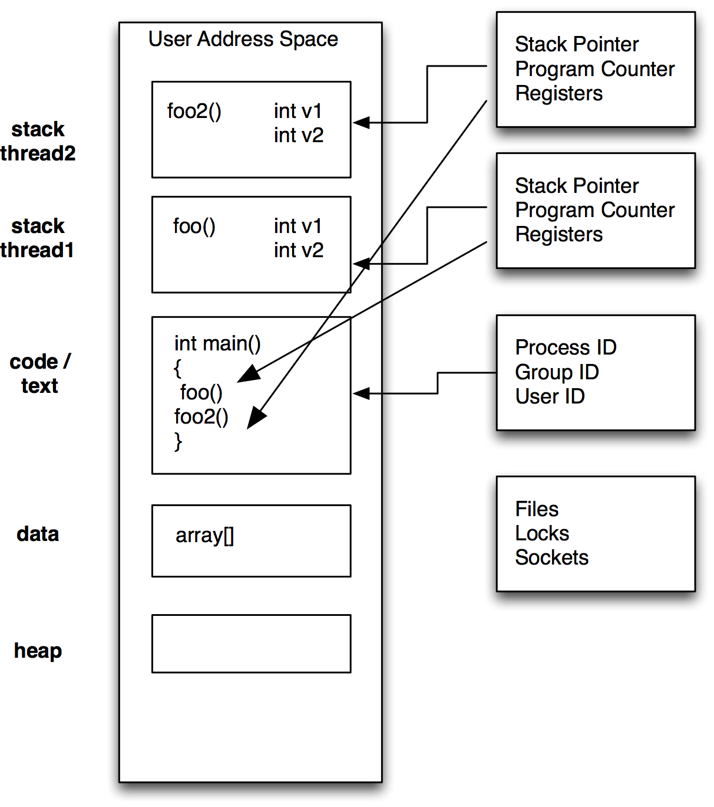

# Introduction to Threading
Jon Macey

jmacey@bournemouth.ac.uk

---

## Introduction

- Concurrent execution of multiple programs has been around since 1960's [CTSS](https://en.wikipedia.org/wiki/Compatible_Time-Sharing_System)
- This was done by interrupting execution of one program and giving the CPU to another.
- This is triggered by
	- Regular Hardware interrupts generated by the clock
	- Irregular interrupts (e.g. hardware needing attention)
	- A call to the OS (e.g. a request to perform I/O)

--

## Time Sharing
- Time sharing allows for efficient use of computational resources but it cannot speed things up for each individual process.
- Time sharing can actually slow down a program as it limits the CPU time the program can use (OS dispatcher dictates this)

--

## What is a thread?
- A thread is an independent stream of instructions scheduled by the operating system to be executed
- It may be easier to think of this as a procedure that run independently from the main program
- This is tied in closely to the Unix process model and in most operating systems this is fairly similar

--

## What is a thread?
- A more precise definition is
> "that it is an execution path, a sequence of instructions, that is managed separately by the operating system scheduler as a unit. 

- There can be multiple threads per unit.

--

## What are Threads good for?

- **Improved performance** breaks up load, places them on multiple cores.
- **Background tasks** Interactive tasks can use threads to allow things to process whilst main task is being executed (GUI / Qt)
- **Asynchronous processing** Sending a request to a server over a network produces latency, threads can be used to wait thus freeing CPU for other tasks.
- **Improving program structure** Games are a good example, we have different tasks that require different times. AI, Render Update Sound etc.

--

## Unix Processes
- A process is created by the operating system and copies a large amount of the environment when it is created
- It will be allocated ID’s as well as it’s own registers heap etc
- We can create a simple version of this using the C ```fork()``` routine

--


---

##  [fork](http://man7.org/linux/man-pages/man2/fork.2.html)
- The ```fork()``` function shall create a new process. 
- The new process (child process) shall be an exact copy of the calling process (parent process) except
  - It will have it’s own id’s and environment
  - it’s own copy of any file descriptors
  - locks are not inherited
- more information can be found in the man pages 

--

## [fork.cpp](https://github.com/NCCA/Threads/blob/master/fork/fork.cpp)

<pre><code data-sample='code/lecturecode.cpp#fork1'></code></pre>


--

##  [fork](http://man7.org/linux/man-pages/man2/fork.2.html)
- The typical usage for fork is writing [unix daemons](http://tinyurl.com/8r9t7ru), these are programs that start and detach from the parent console (becomes a background process)
- After the fork we create an infinite loop which will do the daemon processing
- It is important that the [sleep](https://www.gnu.org/software/libc/manual/html_node/Sleeping.html) command is called else we may thrash the OS

--

## [deamon.cpp](https://github.com/NCCA/Threads/blob/master/fork/daemon.cpp)

<pre><code data-sample='code/lecturecode.cpp#deamon'></code></pre>


---

## Threads

- Threads live in the same process resources as the normal unix model
- However they are scheduled by the operating system to run in their own space as they have their own
  - Stack pointer
  - Registers
  - Scheduling properties 
  - Set of pending and blocked signals
  - Thread specific data.

--



--

## Terminology
- Resource : usually memory (variables etc) but anything the program can access
- [Critical Section](https://en.wikipedia.org/wiki/Critical_section) : code that accesses a shared resource
- [Semaphore](http://tinyurl.com/ckvbupf) : controls access to a shared resource
- Condition : a construct used to synthesise access to a resource 
- [Mutex](https://en.wikipedia.org/wiki/Mutual_exclusion) : Mutual Exclusion (semaphores and Conditions are both examples of these)

--

## Mutex
- Short for Mutual Exclusion
- Only one thread can lock (own) a mutex at one time.
- This means critical sections can be locked so only one thread can access at any one time
- This is good for accessing data that is critical to the processing of the thread

--

## Mutex
- Typical process is :
  - create a mutex
  - many threads may try to access
  - only one succeeds and then performs an action
  - once done thread unlocks so others may access
  - repeat (with different threads)
- Two approaches, either thread not accessing blocks until free or can try and not block

--

## Condition Variables
- Used to wait on a condition (for example a thread to finish)
- We use a condition variable in conjunction with a mutex and a predicate (bool) to see if we can access the resource
- We then wait on the condition variable until it is set then access the resource.
- It is a signalling type approach to accessing the data.

---

## [pthreads](https://en.wikipedia.org/wiki/POSIX_Threads)
- Short for “POSIX” threads, the standard unix library for multi-threading under unix style operating systems
- A C library with wrappers to other languages
- Is a standard IEEE POSIX 1003.1c standard (1995).
- Most OS have an implementation of PThreads (can be a wrapper around own code)
- Many higher level API’s also use pthreads below a managed layer

--

## pthread functions
- Can be split into three main areas
  - creating, joining and destroying threads
  - mutexes (locking and un-locking access)
  - conditional variables

--

## [pthread1.cpp](https://github.com/NCCA/Threads/blob/master/pthread/pthread1.cpp)
<pre><code data-sample='code/lecturecode.cpp#pthread1'></code></pre>

- need to use the -lpthread flag when compiling on some systems

--

## [pthread_create](http://man7.org/linux/man-pages/man3/pthread_create.3.html)

```
#include <pthread.h>

       int pthread_create(pthread_t *thread, 
                          const pthread_attr_t *attr,
                          void *(*start_routine) (void *), 
                          void *arg);

```

- ```thread``` is the id of the thread created
- ```attr``` is a list of attributes (0 = default)
- ```start_routine``` : the function to run
- ```arg``` the arguments to the function

--

## attributes
- To set attributes for the thread the ```pthread_attr_init``` function is called 
- This allows you to set the way the thread may be joined
- The initial state such as stack size etc
- For most cases the default version can be used

--

## thread function
- The thread function is in the form

```
void *foo(void *)
```

- We can pass arguments to the function using a structure and re-cast it within the thread function (examples later)

--

## pthread_join
- The ```pthread_join()``` function suspends execution of the calling thread until the target thread terminates.
- If successful, the ```pthread_join()``` function returns zero
- otherwise error values are returned.


--

## ```std::cout```
- ```std::cout``` is not thread safe (as we will see in the next example)
- ```printf``` behaves better but is also not guaranteed to be safe.
- We may need to use other thread safe logging libs to make it work properly
- I will use ```printf``` for now as it makes it clearer what is happening in the examples

--

## [pthread2.cpp](https://github.com/NCCA/Threads/blob/master/pthread/pthread2.cpp)
<pre><code data-sample='code/lecturecode.cpp#pthread2'></code></pre>


--

## [pthread3.cpp](https://github.com/NCCA/Threads/blob/master/pthread/pthread3.cpp)
<pre><code data-sample='code/lecturecode.cpp#pthread3'></code></pre>


--

## [pthread4.cpp](https://github.com/NCCA/Threads/blob/master/pthread/pthread4.cpp)
<pre><code data-sample='code/lecturecode.cpp#pthread4'></code></pre>


---

## [Race Conditions](https://en.wikipedia.org/wiki/Race_condition)
- Race conditions or Race Hazards are when two threads are tying to access the same resource at the same time
- The following example has a single shared memory block with three threads trying to access the same data
- This produces a race hazard

--

## [racehazard.cpp](https://github.com/NCCA/Threads/blob/master/pthread/racehazard.cpp)
<pre><code data-sample='code/lecturecode.cpp#racehazard1'></code></pre>

--

## pthread_mutex_t
- mutex are created using the data type ```pthread_mutex_t```
- To create a mutex we use ```pthread_mutex_init``` passing in the mutex and any attributes needed for the creation
- We then use the lock and unlock functions to use the mutex in the code.
- The following example show this (but is still flawed)

--

## [mutex1.cpp](https://github.com/NCCA/Threads/blob/master/pthread/mutex1.cpp)

<pre><code data-sample='code/lecturecode.cpp#mutex1'></code></pre>

--


## Problems
- As you can see whilst the data is now being filled in one go the program still has problems
- The threads do not wait for each other and the sequence is out of order
- We need to use conditional waits to make this work correctly.

--

## ```pthread_cond_t```

- This type is used for the conditional wait signals. 
- It works in a similar way to the mutex values, first we initialise the variable then call
- ```pthread_cond_wait``` with the conditional variable as well as a locked mutex
- The thread will then wait until the condition is met, we must also signal to say we are done.

--

## [conwait.cpp](https://github.com/NCCA/Threads/blob/master/pthread/conwait.cpp)

<pre><code data-sample='code/lecturecode.cpp#conwait'></code></pre>


--

## Problems
- As you can see there are still problems with this, whilst the program locks and fills correctly we still have some synchronisation issues.
- The way to overcome this is using two signals
- They will all be blocked by default then we will unblock one to allow the system to start
- Then filler and consumer will show when they are ready

--

## [conwait2.cpp](https://github.com/NCCA/Threads/blob/master/pthread/conwait2.cpp)

<pre><code data-sample='code/lecturecode.cpp#conwait2'></code></pre>


---

## Threading in Qt
- Qt threads wrap up the native API into a consistent threading model
- Under Linux Operating systems it will use pthreads
- Under windows it will use the native win32 threads
- Other OS will vary depending upon native thread model.
- Signals and slots are used for interprocess communication in this model so all inherit from QOBJECT

--

## [QThread](http://doc.qt.io/qt-5/qthread.html)
- We inherit from the ```QThread``` class and must implement the run method
- Then, create an instance of the thread object and call ```QThread::start()```. 
- Note that you must create the ```QApplication``` (or ```QCoreApplication```) object before you can create a ```QThread```.
- The function will return immediately and the main thread will continue. 
- The code that appears in the ```run()``` reimplementation will then be executed in a separate thread.

--

## [QThread](https://github.com/NCCA/Threads/tree/master/QtThread)

<pre><code data-sample='code/lecturecode.cpp#qthread1'></code></pre>

--

## [QThread](https://github.com/NCCA/Threads/tree/master/QtThread)

<pre><code data-sample='code/lecturecode.cpp#qthread2'></code></pre>


--

## [QThread](https://github.com/NCCA/Threads/tree/master/QtThread)

<pre><code data-sample='code/lecturecode.cpp#qthread3'></code></pre>


--

## Synchronising Threads
- Qt provides the following synch methods
- [QMutex](http://doc.qt.io/qt-5/qmutex.html), [QReadWriteLock](http://doc.qt.io/qt-5/qreadwritelock.html), [QSemaphore](http://doc.qt.io/qt-5/qsemaphore.html), and [QWaitCondition](http://doc.qt.io/qt-5/qwaitcondition.html) 
- Each class has a subtly different approach to synchronisation

--

## [QMutex](http://doc.qt.io/qt-5/qmutex.html)
- QMutex provides a mutually exclusive lock, or mutex. 
- At most one thread can hold the mutex at any time. 
- If a thread tries to acquire the mutex while the mutex is already locked, the thread will be put to sleep until the thread that currently holds the mutex unlocks it.

--

## [QReadWriteLock](http://doc.qt.io/qt-5/qreadwritelock.html)
- QReadWriteLock is similar to QMutex, except that it distinguishes between "read" and "write" access to shared data and allows multiple readers to access the data simultaneously. 
- Using QReadWriteLock instead of QMutex when it is possible can make multithreaded programs more concurrent.

--

## [QSemaphore](http://doc.qt.io/qt-5/qsemaphore.html)
- QSemaphore is a generalisation of QMutex that protects a certain number of identical resources. 
- In contrast, a mutex protects exactly one resource. 

--

## [QWaitCondition](http://doc.qt.io/qt-5/qwaitcondition.html) 
- QWaitCondition allows a thread to wake up other threads when some condition has been met. 
- One or many threads can block waiting for a QWaitCondition to set a condition with wakeOne() or wakeAll(). 
- Use wakeOne() to wake one randomly selected event or wakeAll() to wake them all. 

---

## c++ 11 threads
- C++ 11  has native, cross platform  threading support 
- No longer need to use pthreads (but still valid and used)
- Not fully supported in all compilers
- Huge new area but here are some simple examples to get started

--

## [thread1.cpp](https://github.com/NCCA/Threads/blob/master/c%2B%2B11Threading/thread1.cpp)

<pre><code data-sample='code/lecturecode.cpp#cpp11thread1'></code></pre>


--

## Thread id’s
- Each thread has an id so we can tell them apart
- We can call the std::this_thread::get_id() to get the id
- As with most C++ 11 we can also use auto for ease as shown in the following example

--

## [multithread.cpp](https://github.com/NCCA/Threads/blob/master/c%2B%2B11Threading/multithread.cpp)

<pre><code data-sample='code/lecturecode.cpp#cpp11thread2'></code></pre>

--

## [Still get race hazards](https://github.com/NCCA/Threads/blob/master/c%2B%2B11Threading/race.cpp)

<pre><code data-sample='code/lecturecode.cpp#race'></code></pre>

--

## Lockguard

<pre><code data-sample='code/lecturecode.cpp#lockguard'></code></pre>


---

## [NCCA Logger Lib](https://github.com/NCCA/Threads/tree/master/ParallelLecture/LoggerC%2B%2B11)

- I have created a simple Logger system for both C++ and C++ 11 that allows logging to both file and console at the same time
- This uses  std::lock_guard<std::mutex>  to lock our thread a bit like the previous  example
- It also allows for console colour output and writing to log files.

--

## [NCCA Logger Lib](https://github.com/NCCA/Threads/tree/master/ParallelLecture/LoggerC%2B%2B11)
- Simple [singleton](http://cppisland.com/?p=501) interface using [PIMPL idiom](http://en.cppreference.com/w/cpp/language/pimpl) for clean API

<pre><code data-sample='code/lecturecode.cpp#logger1'></code></pre>


--

## [example](https://github.com/NCCA/Threads/blob/master/ParallelLecture/c%2B%2B11Threading/multithreadLog.cpp)

<pre><code data-sample='code/lecturecode.cpp#logexample'></code></pre>

--

## building

<pre><code data-sample='code/lecturecode.cpp#build'></code></pre>


--

## [Threading Functions](https://github.com/NCCA/Threads/blob/master/ParallelLecture/c%2B%2B11Threading/functions.cpp)
- We can use [std::bind](http://en.cppreference.com/w/cpp/utility/functional/bind) to bind functions to threads
- Note the use of [std::mem_fun](http://en.cppreference.com/w/cpp/utility/functional/mem_fn) to bind the join method.

<pre><code data-sample='code/lecturecode.cpp#functional'></code></pre>

--

## [Threading Class Methods](https://github.com/NCCA/Threads/blob/master/ParallelLecture/c%2B%2B11Threading/methods.cpp)

<pre><code data-sample='code/lecturecode.cpp#method'></code></pre>

--

## [Using std::ref](https://github.com/NCCA/Threads/blob/master/ParallelLecture/c%2B%2B11Threading/reference.cpp)
- this example binds a reference to obtain a return value using [std::ref](http://en.cppreference.com/w/cpp/utility/functional/ref)

<pre><code data-sample='code/lecturecode.cpp#reference'></code></pre>

--

## Threading classes
- We can also overload the function call operator and use this as the thread function
- This is sometimes easier to implement if we need a simple call for a class
- This is more difficult if we need arguments and the previous bind method is easier to implement.

--

## [example](https://github.com/NCCA/Threads/blob/master/ParallelLecture/c%2B%2B11Threading/thread2.cpp)

<pre><code data-sample='code/lecturecode.cpp#classoverload'></code></pre>


---

## [std::future](http://en.cppreference.com/w/cpp/thread/future) [std::promise](http://en.cppreference.com/w/cpp/thread/promise)
- The class template std::future provides a mechanism to access the result of asynchronous operations
- An asynchronous operation (created via std::async, std::packaged_task, or std::promise) can provide a std::future object to the creator of that asynchronous operation.

--

## [future1.cpp](https://github.com/NCCA/Threads/blob/master/ParallelLecture/c%2B%2B11Threading/future1.cpp)


<pre><code data-sample='code/lecturecode.cpp#future1'></code></pre>

--

## [std::async](http://en.cppreference.com/w/cpp/thread/async)
- will be deprecated in C++17

<pre><code data-sample='code/lecturecode.cpp#async'></code></pre>

--

## [std::atomic](http://en.cppreference.com/w/cpp/atomic/atomic)
- Each instantiation and full specialisation of the std::atomic template defines an atomic type. 
- Objects of atomic types are the only C++ objects that are free from data races; that is, if one thread writes to an atomic object while another thread reads from it, the behaviour is well-defined.

--

## [std::atomic](https://github.com/NCCA/Threads/blob/master/ParallelLecture/c%2B%2B11Threading/atomic.cpp)

<pre><code data-sample='code/lecturecode.cpp#atomic'></code></pre>

--

## [thread_local ](http://en.cppreference.com/w/cpp/language/storage_duration)

- The thread_local keyword is only allowed for objects declared at namespace scope, objects declared at block scope, and static data members. 
- It indicates that the object has thread storage duration.
- The object is allocated when the thread begins and deallocated when the thread ends.
- Each thread has its own instance of the object.

--

## [threadLocal1.cpp](https://github.com/NCCA/Threads/blob/master/ParallelLecture/c%2B%2B11Threading/threadLocal1.cpp)

<pre><code data-sample='code/lecturecode.cpp#threadLocal1'></code></pre>

--

## [threadLocal2.cpp](https://github.com/NCCA/Threads/blob/master/ParallelLecture/c%2B%2B11Threading/threadLocal2.cpp)

<pre><code data-sample='code/lecturecode.cpp#threadLocal2'></code></pre>


---

## Watch this

<iframe src="https://channel9.msdn.com/Shows/Going+Deep/C-and-Beyond-2012-Herb-Sutter-Concurrency-and-Parallelism/player" width="960" height="540" allowFullScreen frameBorder="0"></iframe>

---

## References
- Gerassimos Barlas. 2014. Multicore and GPU Programming: An Integrated Approach. Morgan Kaufmann Publishers Inc., San Francisco, CA, USA.

- Peter Pacheco. 2011. An Introduction to Parallel Programming (1st ed.). Morgan Kaufmann Publishers Inc., San Francisco, CA, USA.
