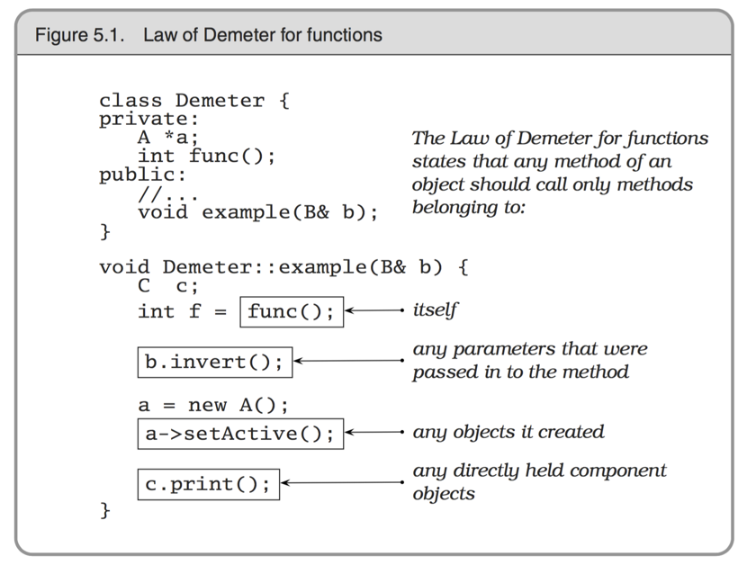
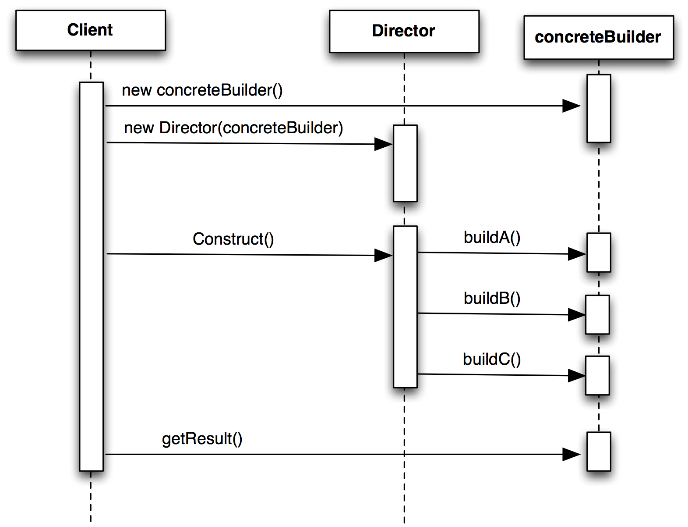
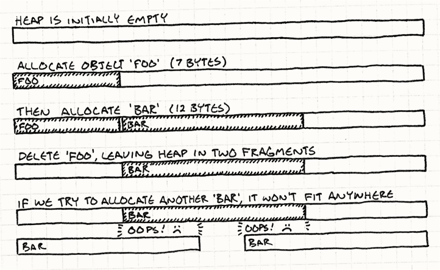

# Design Patterns
Jon Macey

jmacey@bournemouth.ac.uk

---

## Object Oriented Programming
- In OO Programming we tend to combine both the data and the functions that act on them into a single unit.
- We then place an “interface” to this data know as methods which are allowed to act upon the data in a prescribed way.
- The traditional model of OO is to model “real world” objects, however as we shall discuss this is not really the case.

--

### [Object Oriented Programming is Inherently Harmful](http://harmful.cat-v.org/software/OO_programming/)

- “Object-oriented programming is an exceptionally bad idea which could only have originated in California.” – Edsger Dijkstra
- “object-oriented design is the roman numerals of computing.” – Rob Pike
- “The phrase "object-oriented” means a lot of things. Half are obvious, and the other half are mistakes.“ – Paul Graham

--

### [Object Oriented Programming is Inherently Harmful](http://harmful.cat-v.org/software/OO_programming/)

- “Implementation inheritance causes the same intertwining and brittleness that have been observed when goto statements are overused. As a result, OO systems often suffer from complexity and lack of reuse.” – John Ousterhout Scripting, IEEE Computer, March 1998
- “90% of the shit that is popular right now wants to rub its object-oriented nutsack all over my code” – kfx
- “Sometimes, the elegant implementation is just a function. Not a method. Not a class. Not a framework. Just a function.” – John Carmack

--

### [Object Oriented Programming is Inherently Harmful](http://harmful.cat-v.org/software/OO_programming/)


- “The problem with object-oriented languages is they’ve got all this implicit environment that they carry around with them. You wanted a banana but what you got was a gorilla holding the banana and the entire jungle.” – Joe Armstrong
- “I used to be enamored of object-oriented programming. I’m now finding myself leaning toward believing that it is a plot designed to destroy joy.” – Eric Allman

--

### [Object Oriented Programming is Inherently Harmful](http://harmful.cat-v.org/software/OO_programming/)


- OO is the “structured programming” snake oil of the 90' Useful at times, but hardly the “end all” programing paradigm some like to make out of it.
- And, at least in it’s most popular forms, it’s can be extremely harmful and dramatically increase complexity.
- Inheritance is more trouble than it’s worth. Under the doubtful disguise of the holy “code reuse” an insane amount of gratuitous complexity is added to our environment, which makes necessary industrial quantities of syntactical sugar to make the ensuing mess minimally manageable.


---

# Class Diagrams

<div class="stretch">
<iframe src="Inheritance1.html" style="border:0px #FFFFFF solid;" name="code" scrolling="yes" frameborder="1" marginheight="0px" marginwidth="0px" height="100%" width="100%"></iframe>
</div>

--

#Associations
- Represents the relation from one class to another
- Most association will be 
  - Has
  - Owns
  - Uses
- In C++ it often translates to a member
- Try to be more explicit
  - Renders to
  - Reflects
  - Supports

--

# Associations
- The numbers
  - How many X can Y have
  - How many Y can X have
- Syntax
  - 0..1 May have ONE, or NONE
  - 0..* May have SEVERAL, including NONE
  - 1 Has ONE and only ONE
  - 1..* Has at least ONE, but can have SEVERAL

--


# Composition

<div class="stretch" >
<iframe src="composition.html" style="border:0px #FFFFFF solid;" name="code" scrolling="yes" frameborder="1" marginheight="0px" marginwidth="0px" height="100%" width="100%"></iframe>
</div>

- Use a filled diamond it always gives a multiplicity of 1 or 0..1
- This implies ownership and when the car is destroyed so is the Engine

--

# Aggregation

<div class="stretch" >
<iframe src="aggregation.html" style="border:0px #FFFFFF solid;" name="code" scrolling="yes" frameborder="1" marginheight="0px" marginwidth="0px" height="100%" width="100%"></iframe>
</div>

- Aggregation differs from composition as it doesn’t necessarily imply ownership.
- This is usually implemented by containing a reference to another object where the lifetime is determined elsewhere
- This implies a pointer (or smart pointer) of some kind

--

# Generalisation
- In C++ this translates to inheritance
- Sometimes we have classes so general they can’t be created (Abstract classes)
- The hierarchy goes from Generalisation to specialisation
- Use a lot in things like Qt [QOBJECT](http://doc.qt.io/qt-5/qobject.html)


---

# [Gang of Four](https://en.wikipedia.org/wiki/Design_Patterns)

- GOF: "Gang of Four", ie Gamma, Helm, Johnson, Vlissides, authors of "Design Patterns: Elements of Reusable Object-Oriented Software”
- Classic text on OO Design
- Two main considerations 
  - Program to an 'interface', not an 'implementation'.
  - Favour  ‘object composition’ over ‘class inheritance’
 

--


#[S.O.L.I.D. ](https://en.wikipedia.org/wiki/SOLID_(object-oriented_design)
- A mnemonic to remember the first five principles of Object Oriented design
- Single responsibility, Open-closed, Liskov substitution, Interface segregation and Dependency inversion
- The principles when applied together intend to make it more likely that a programmer will create a system that is easy to maintain and extend over time

--

# [Single Responsibility](http://www.oodesign.com/single-responsibility-principle.html) 
- A class should do only one thing
- This should be entirely encapsulated in the class
- All services (methods) should be narrowly aligned to this responsibility

--

# [Open / Closed](http://www.oodesign.com/open-close-principle.html)
- “software entities (classes, modules, functions, etc.) should be open for extension, but closed for modification”
- This means we shouldn’t modify the source but extend the code using inheritance
- This is sometimes know as “implementation inheritance” 
- This can be done using Abstract base classes

--

## [Liskov substitution principle](http://www.oodesign.com/liskov-s-substitution-principle.html)
- “objects in a program should be replaceable with instances of their subtypes without altering the correctness of that program”
- For a mutable objects  “if S is a subtype of T, then objects of type T in a program may be replaced with objects of type S without altering any of the desirable properties of that program”

--

## [Interface segregation principle](http://www.oodesign.com/interface-segregation-principle.html)
- no client should be forced to depend on methods it does not use.
- ISP splits interfaces which are very large into smaller and more specific ones so that clients will only have to know about the methods that are of interest to them
- Sometimes called “role interfaces”
- This means we make classes “thin” not fat general purpose ones (which sometimes lead to software bloat)

--

## [Dependency inversion principle](http://www.oodesign.com/dependency-inversion-principle.html)
- “One should Depend upon Abstractions. Do not depend upon concretions”
  - High level modules should not depend on low level modules. Both should depend on abstractions.
  - Abstractions should not depend upon details. Details should depend upon abstractions.

---

# Design Patterns
- Patterns are highly dependent on the language
- C++ is very limited – forcing us to use those
- Some API’s are designed around patterns ( C# and Objective C use them a lot )
- We can break patterns into the following taxonomy

--

# Critique
> The “Design Patterns” book is one of the worst programming books ever. Yes, really. I’m 100% dead serious when I say that I think it has set (and will continue to set) the progress of software development back by decades 

[http://realtimecollisiondetection.net/blog/?p=44](http://realtimecollisiondetection.net/blog/?p=44)

--

# Critique
> “Design patterns are spoon-fed material for brainless programmers incapable of independent thought, who will be resolved to producing code as mediocre as the design patterns they use to create it.
Design patterns really are from hell!” 

[realtimecollisiondetection.net/blog/?p=81](http://realtimecollisiondetection.net/blog/?p=81)

--

# Pattern Types

- <a href="#/creational">Creational</a>
- <a href="#/Structural">Structural</a> 
- <a href="#/Behavioural">Behavioural</a>  
- <a href="#/Concurrency">Concurrency pattern (for threading)</a>  

--

<!-- .slide: id="creational" -->
# Creational
- <a href="#/singleton">Singleton</a>
- <a href="#/monostate">Monostate</a>
- <a href="#/factoryMethod">Factory Method</a>
- <a href="#/extensibleFactory">Extensible Factory</a>
- <a href="#/Lazyinitialisation">Lazy initialisation</a>
- <a href="#/Prototype">Prototype</a>
- <a href="#/Builder">Builder</a>

--

<!-- .slide: id="Structural" -->
# Structural
-  test

--

<!-- .slide: id="Behavioural" -->
# Behavioural
-  test

--

<!-- .slide: id="Concurrency" -->
# Concurrency
-  test


---


<!-- .slide: id="singleton" -->

## [The singleton "pattern"](http://gameprogrammingpatterns.com/singleton.html)
- The singleton pattern defines an object that can only exist once
- This is done by implementing the code in a particular way with the object knowing if it has been created.
- If it has not it will create an instance of itself
- If it has been created it will return the instance.
- This is sometimes thought of an an [“anti-pattern”](http://c2.com/cgi/wiki?ClassicOoAntiPatterns) should be used with care.

--

## [The singleton "pattern"](http://www.oodesign.com/singleton-pattern.html)
- Deletion can be difficult
- Modern C++ gives answers to all of this through a [complex template framework](http://loki-lib.cvs.sourceforge.net/loki-lib/loki/include/loki/Singleton.h?view=markup)
- In doubt, [use a static member](http://gameprogrammingpatterns.com/singleton.html#what's-left-for-singleton)
- Problematic with multi-threading, must use the ["double check lock paradigm"](http://preshing.com/20130930/double-checked-locking-is-fixed-in-cpp11/)

--

### [extern "C++" int atexit( void (*func)());](http://en.cppreference.com/w/cpp/utility/program/atexit)
- Another way to handle singleton deletion is to use the std::atexit() signal handler
- Registers the function pointed to by func to be called on normal program termination (via [std::exit()](http://en.cppreference.com/w/cpp/utility/program/exit) or returning from the cpp/language/main function)
- Can use this to clear singleton resources (see [ngl/Singleton.h](https://github.com/NCCA/NGL/blob/master/include/ngl/Singleton.h) template for example)


---

<!-- .slide: id="monostate" -->
# [monostate pattern](http://c2.com/cgi/wiki?MonostatePattern)
- A monostate is a "conceptual singleton" is uses [static data members](http://en.cppreference.com/w/cpp/language/static) and functions
- This means that all instances of the class are accessing the same [static data](http://en.cppreference.com/w/cpp/language/storage_duration)
- The following example reads a config file and stores the values in static class attributes

--

# [Config.h](https://github.com/NCCA/DesignPatterns/blob/master/DesignCode1/monostate/Config.h)

```
#ifndef CONFIG_H__
#define CONFIG_H__
#include <string>

class Config
{
  public :
    Config();
    int getPointSize() const {return m_pointSize;}
    std::string getColour() const {return m_colour;}
    std::string getDrawMode() const {return m_drawMode;}
  private :
    static bool m_configRead;
    static int m_pointSize;
    static std::string m_colour;
    static std::string m_drawMode;
};


#endif
```

--

# [Config.cpp](https://github.com/NCCA/DesignPatterns/blob/master/DesignCode1/monostate/Config.cpp)

```
#include "Config.h"
#include <fstream>

bool Config::m_configRead=false;
std::string Config::m_colour="";
std::string Config::m_drawMode="";
int Config::m_pointSize=1;


Config::Config()
{
  if(m_configRead ==false)
  {
    m_configRead=true;
    std::fstream fileIn;
    fileIn.open("config.txt",std::ios::in);
    if (!fileIn.is_open())
    {
      exit(EXIT_FAILURE);
    }
    fileIn>>m_colour;
    fileIn>>m_pointSize;
    fileIn>>m_drawMode;
    fileIn.close();
  }
}
```

--

# [main.cpp](https://github.com/NCCA/DesignPatterns/blob/master/DesignCode1/monostate/main.cpp)

```
#include "Config.h"
#include <iostream>

void draw()
{
  Config m;
  std::cout<<"in draw "<<m.getPointSize()<<"\n";
  std::cout<<"in draw "<<m.getColour()<<"\n";
}

int main()
{
  Config m;
  std::cout<<"in main "<<m.getColour()<<"\n";
  draw();
  std::cout<<"draw mode"<<m.getDrawMode()<<"\n";
}
```

--

# monostate reading
- http://www.apibook.com/Chapter_3.pdf
- https://www.informit.com/guides/content.aspx?g=cplusplus&seqNum=147
- http://stackoverflow.com/questions/887317/monostate-vs-singleton
- https://blogs.msdn.microsoft.com/willy-peter_schaub/2010/10/12/unisa-chatter-design-patterns-in-c-part-11-patterns-singleton-versus-monostate/

---

<!-- .slide: id="factoryMethod" -->

# [Factory Methods](https://sourcemaking.com/design_patterns/factory_method)
- A factory method is a creational design pattern that allows you to create an object without having to specify the specific C++ type of the object
- It can be thought of as a generalisation of a constructor
  - This helps to overcome some of the issues with C++ constructors

--

# The problem with ctors

- ctors have no return type, it makes it difficult to signal an error by returning a nullptr type
- we have [constrained naming](https://msdn.microsoft.com/en-GB/library/s16xw1a8.aspx). It always has the same name as the class, and we can only have one set of parameter lists (i.e. can’t have two ctors with single int param lists that do different things
- No dynamic runtime binding of ctors, i.e. we must know the concrete class at compile time.
- [No virtual constructors](http://www.stroustrup.com/bs_faq2.html#virtual-ctor). 

--

# Factory methods

- At the basic level a factory method is a normal method that can return an instance of a class
- However if we use it in conjunction with inheritance we can override the default class behaviour and return related class types.
- This is usually done in conjunction with abstract base classes.

--

# Factory methods

<div class="stretch" >
<iframe src="factoryMethod1.html" style="border:0px #FFFFFF solid;" name="code" scrolling="yes" frameborder="1" marginheight="0px" marginwidth="0px" height="100%" width="100%"></iframe>
</div>

--


#  [Abstract Base Class](https://isocpp.org/wiki/faq/abcs)
- An ABC is a class that contains one or more [“pure virtual”](https://en.wikibooks.org/wiki/C%2B%2B_Programming/Classes/Abstract_Classes) member functions.
- This is not a “concrete” class and means that it can’t be instantiated using the new operator
- Instead it is a base class where derived classes provide the implementation of the pure virtual methods
- The following examples are from API Design for C++ by Martin Reddy and show a simple renderer interface.

--

# [Simple Factory](https://github.com/NCCA/DesignPatterns/tree/master/DesignCode1/SimpleFactory)

<div class="stretch" >
<iframe src="renderFactory1.html" style="border:0px #FFFFFF solid;" name="code" scrolling="yes" frameborder="1" marginheight="0px" marginwidth="0px" height="100%" width="100%"></iframe>
</div>


---

<!-- .slide: id="extensibleFactory" -->

# Extensible Factories
- This further decouples the concrete classes from the methods
- We need to maintain a map of registered creation methods within the creator
- This now means that the extensible factory holds state data
- Usually this means they are created using a singleton so only one can ever exist
  - or use a static member!

--

# [Extensible Factory](https://github.com/NCCA/DesignPatterns/tree/master/DesignCode1/ExtensibleFactory)

<div class="stretch" >
<iframe src="extensibleFactory.html" style="border:0px #FFFFFF solid;" name="code" scrolling="yes" frameborder="1" marginheight="0px" marginwidth="0px" height="100%" width="100%"></iframe>
</div>


---

<!-- .slide: id="Lazyinitialisation" -->

# [Lazy initialisation](https://en.wikipedia.org/wiki/Lazy_initialization)
- Saves memory
- Delay object creation until needed 
  - Textures
  - Geometries
- Can be combined with a Factory to create “Lazy Factories”
- Can be implemented as the “Multiton pattern” 
<div class="stretch" >
<iframe src="multiton.html" style="border:0px #FFFFFF solid;" name="code" scrolling="yes" frameborder="1" marginheight="0px" marginwidth="0px" height="100%" width="100%"></iframe>
</div>

--

# [Texture](https://github.com/NCCA/DesignPatterns/tree/master/DesignCode1/Texture) 
- In this case we will use static attributes to contain a map of std::string to Texture * objects
- If the name key exists the instance will be returned.
- If not a new object will be created and stored in the map (unordered_map)

--

# [Texture](https://github.com/NCCA/DesignPatterns/tree/master/DesignCode1/Texture) 

<div class="stretch" >
<iframe src="texture.html" style="border:0px #FFFFFF solid;" name="code" scrolling="yes" frameborder="1" marginheight="0px" marginwidth="0px" height="100%" width="100%"></iframe>
</div>

---

<!-- .slide: id="Prototype" -->
# The prototype pattern
- This pattern uses a prototypical instance to clone new instances of an object
 - This helps to 
  - avoid subclasses of an object creator in the client application, like the abstract factory pattern does.
  - avoid the inherent cost of creating a new object in the standard way (e.g., using the 'new' keyword) when it is prohibitively expensive for a given application.

--

# [The prototype pattern](https://github.com/NCCA/DesignPatterns/tree/master/DesignCode1/Prototype)

<div class="stretch" >
<iframe src="prototype.html" style="border:0px #FFFFFF solid;" name="code" scrolling="yes" frameborder="1" marginheight="0px" marginwidth="0px" height="70%" width="100%"></iframe>
<ul>
<li>Prototypes of new products are often built prior to full production, but in this example, the prototype is passive and does not participate in copying itself
</ul>
</div>

---

#Dependancy Injection
- Dependancy injection is a technique where an object is passed into a class (injected) instead of having a class create and store the object itself.
- This means the class containing the object doesn’t need to know how to create the object.
- This is know as “inversion of control”
  - Makes it easier to implement “unit testing” as we can inject test cases into our classes
  - Decouples “concrete” from “concrete”

--

# Types of injection
- Type 1 or interface injection, in which the exported module provides an interface that its users must implement in order to get the dependencies at runtime
- Type 2 or setter injection, in which the dependent module exposes a setter method that the framework uses to inject the dependency.
- Type 3 or constructor injection, in which the dependencies are provided through the class constructor.

--

# The Law of Demeter
- The Law of Demeter for functions (methods)  attempts to minimise coupling between modules in any given program. 
- It tries to prevent you from reaching into an object to gain access to a third object’s methods. 
- By writing “shy” code that honours the Law of Demeter as much as possible, we can achieve the goal of minimising coupling between modules.

--

# The Law of Demeter
- The pragmatic programmer” Ch. 5 has a good discussion of this



---


<!-- .slide: id="Builder" -->
# The Builder Pattern
- The Builder Creational Pattern is used to separate the construction of a complex object from its representation so that the same construction process can create different objects representations.
- Helps to eliminate “telescoping constructors”

```
Pizza(int size) { ... }
Pizza(int size, boolean cheese) { ... }
Pizza(int size, boolean pepperoni) { ... }
Pizza(int size, boolean cheese, boolean pepperoni, boolean bacon, int price, int) { ... }
```

--

# The Builder Pattern

- Helps to eliminate the use of setters and getters after object construction

```
Pizza pizza = new Pizza(12);
pizza.setCheese(true);
pizza.setPepperoni(true);
pizza.setBacon(true);
```

--

# Builder Pattern

- Define an intermediate object whose member functions define the desired object part by part.
- Build Pattern lets us defer the construction of the object until all the options for creation have been specified.

--

# Builder Pattern


<div class="stretch">
<iframe src="builder1.html" style="border:0px #FFFFFF solid;" name="code" scrolling="yes" frameborder="1" marginheight="0px" marginwidth="0px" height="100%" width="100%"></iframe>
</div>

--



--

# Pizza Example
- This is a classic Builder pattern example
- It is used to illustrate the key concepts in the Builder pattern
- We start with a basic Pizza class

--

# [Pizza Example](https://github.com/NCCA/DesignPatterns/tree/master/DesignCode1/PizzaBuilder)
<div class="stretch">
<iframe src="pizzabuilder.html" style="border:0px #FFFFFF solid;" name="code" scrolling="yes" frameborder="1" marginheight="0px" marginwidth="0px" height="100%" width="100%"></iframe>
</div>

---

# [Object Pools](http://gameprogrammingpatterns.com/object-pool.html)
- This is a creation / optimisation pattern
- Intent
  - Improve performance and memory use by reusing objects from a fixed pool instead of allocating and freeing them individually.
  - Allows use to use contiguous memory on the heap and reduce allocations which may be expensive.
  - Reduces memory fragmentation

--

# Fragmentation
- Fragmentation means the free space in our heap is broken into smaller pieces of memory instead of one large open block

<a href="http://gameprogrammingpatterns.com/object-pool.html" target="_blank">  </a>

--

# Object Pool
- Define a pool of re-usable objects that you need to frequently create and destroy
- Objects are similar in size.
- Allocating objects on the heap is slow or could lead to memory fragmentation.
- Each object encapsulates a resource such as a database or network connection that is expensive to acquire and could be reused.
- For creating threads (we will cover thread pools next year)

--

# Object Pool

- The pool may waste memory on unneeded objects
- We can only have a fixed amount of objects at any one time
- Memory size for objects is fixed (however with pointers we can do other tricks but will defeat the object of the pool)
- Reused objects are not cleared and will remain in memory.

--

# [Particle Pool](https://github.com/NCCA/DesignPatterns/tree/master/ObjectPool) 

<div class="stretch" >
<iframe src="pool.html" style="border:0px #FFFFFF solid;" name="code" scrolling="yes" frameborder="1" marginheight="0px" marginwidth="0px" height="100%" width="100%"></iframe>
</div>


---

# References

- Gamma, Erich; Helm, Richard; Johnson, Ralph; Vlissides, John 1994. Design Patterns: Elements of Reusable Object-Oriented Software. Addison-Wesley.
- Steve McConnell. 2004. Code Complete, Second Edition. Microsoft Press, Redmond, WA, USA.
- Martin Reddy, 2011. API Design for C++ Morgan Kaufmann.
- Andrei Alexandrescu  2001. Modern C++ Design, Addison-Wesley.

--

# References

- http://en.wikipedia.org/wiki/Software_design_pattern
- http://en.wikipedia.org/wiki/SOLID
- http://en.wikipedia.org/wiki/Abstract_factory_pattern
- http://en.wikipedia.org/wiki/Builder_pattern
- http://en.wikipedia.org/wiki/Factory_method_pattern

--

# References

- http://en.wikipedia.org/wiki/Lazy_initialization
- http://en.wikipedia.org/wiki/Multiton_pattern
- http://en.wikipedia.org/wiki/Prototype_pattern
- http://en.wikipedia.org/wiki/Liskov_substitution_principle
- “The Pragmatic Programmer”  Andrew Hunt  , David Thomas
- http://citeseerx.ist.psu.edu/viewdoc/download?doi=10.1.1.50.3681&rep=rep1&type=pdf

--

# References 

- http://www.cplusplus.com/reference/memory/auto_ptr/
- http://ootips.org/yonat/4dev/smart-pointers.html
- http://sourcemaking.com/
- http://sourcemaking.com/design_patterns/observer/cpp/3
- http://www.c2.com/cgi-bin/wiki?ModelViewController

--

# References

- http://en.wikipedia.org/wiki/Model%E2%80%93view%E2%80%93controller
- http://sourcemaking.com/design_patterns/memento
- http://advancedcppwithexamples.blogspot.co.uk/2010/09/c-example-for-composite-design-pattern.html