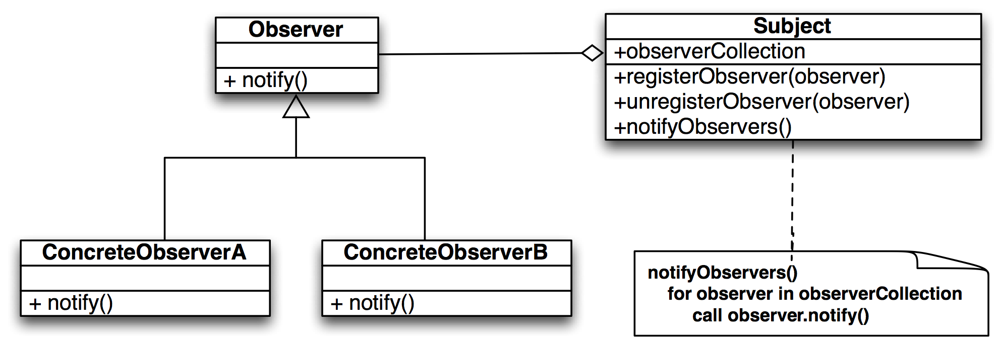

# Design Patterns 2
Jon Macey

jmacey@bournemouth.ac.uk

---

# [The PIMPL Idiom](http://wiki.c2.com/?PimplIdiom)
- Introduced by Jeff Sumner as shorthand for “Pointer to Implementation”
- It is used to avoid exposing private details in an API header
- Whilst it is not a design pattern may be considered a special case of the “Bridge pattern”
- Main reason for use is to overcome C++ limitations

--

## [PIMPL](http://wiki.c2.com/?PimplIdiom)


- In C++ we can forward declare a pointer to a type 
- i.e. we declare a name but not the details
- This is sometimes referred to as an “opaque pointer” as you can’t see the detail

--

## Example [“Autotimer”](https://github.com/NCCA/DesignPatterns/tree/master/DesignCode2/PIMPLBad)
- This example is from C++ API Design (Reddy 2011)
- This first example shows a design where implementation detail is visible in the headers
  - It has OS specific defines and includes
  - All of the code is in the header
  - Is hard to maintain and read

--

## Example [“Autotimer”](https://github.com/NCCA/DesignPatterns/tree/master/DesignCode2/PIMPLBad)

```
/// modified from Marting Reddy example
/// See http://APIBook.com/ for the latest version.

#ifndef AUTOTIMER_H
#define AUTOTIMER_H

#include <string>
// Bad: only need iostream because of implementation code
#include <iostream>

// Bad: exposes platform specifics in your header file
#ifdef WIN32
#include <windows.h>
#else
#include <sys/time.h>
#endif

class AutoTimer
{
public:
	// Bad: exposes (and inlines) implementation details
	explicit AutoTimer(const std::string &name) :
		mName(name)
	{
    #ifdef _WIN32
        mStartTime = GetTickCount();
    #else
        gettimeofday(&mStartTime, NULL);
    #endif
	}

	~AutoTimer()
	{
		std::cout << mName << ": took " << GetElapsed()
				  << " secs\n" ;
	}

	// Bad: no need to expose this function publicly
	double GetElapsed() const
	{
    #ifdef _WIN32
        return (GetTickCount() - mStartTime) / 1e3;
    #else
        struct timeval end_time;
        gettimeofday(&end_time, NULL);
        double t1 = mStartTime.tv_usec / 1e6 + mStartTime.tv_sec;
        double t2 = end_time.tv_usec / 1e6 + end_time.tv_sec;
        return t2 - t1;
    #endif
	}

	// Bad: data members should always be private
	std::string mName;
#ifdef _WIN32
	DWORD mStartTime;
#else
	struct timeval mStartTime;
#endif
};

#endif

```

--

## main.cpp

```
/// modifed from Martin Reddy book
/// See http://APIBook.com/ for the latest version.

#include "autotimer.h"
#include <iostream>
#include <cstdlib>


int main(int, char **)
{
  AutoTimer timer("MyTimer");

  for (int i = 0; i < 1000; ++i)
  {
    std::cout << ".";
  }
  std::cout << '\n';

  return EXIT_SUCCESS;
}
```

--

## PIMPL Version
- In this version we pre-declare a class called Impl which we will declare in the header
- There will be no detail of this just the declaration
- We also create a pointer to the Impl class and use this

--

## [AutoTimer.h](https://github.com/NCCA/DesignPatterns/blob/master/DesignCode2/PIMPLGood/autotimer.h)

```
/// modified from the martin Reddy book
/// See http://APIBook.com/ for the latest version.
///

#ifndef AUTOTIMER_H
#define AUTOTIMER_H

#include <string>

/// An object that reports how long it was alive for when it
/// is destroyed.
///
class AutoTimer
{
public:
  /// Create a new timer object with a human-readable name
  explicit AutoTimer(const std::string &name);
  /// On destruction, the timer reports how long it was alive
  ~AutoTimer();

private:
  // Make this object be noncopyable because it holds a pointer
  AutoTimer(const AutoTimer &);
  const AutoTimer &operator =(const AutoTimer &);

  class Impl;
  Impl *m_impl;
};
#endif

```

--

## [Autotime.cpp](https://github.com/NCCA/DesignPatterns/blob/master/DesignCode2/PIMPLGood/autotimer.cpp)

```
/// -*- tab-width: 4; c-basic-offset: 4; indent-tabs-mode: t -*-
///
/// \file   autotimer.cpp
/// \author Martin Reddy
/// \brief  An example of an API using the Pimpl idiom.
///
/// Copyright (c) 2010, Martin Reddy. All rights reserved.
/// Distributed under the X11/MIT License. See LICENSE.txt.
/// See http://APIBook.com/ for the latest version.
///

#include "autotimer.h"

#include <iostream>

#ifdef _WIN32
#include <windows.h>
#else
#include <sys/time.h>
#endif


class AutoTimer::Impl
{
public:
	/// Return how long the object has been alive
	double GetElapsed() const
	{
#ifdef _WIN32
		return (GetTickCount() - mStartTime) / 1e3;
#else
		struct timeval end_time;
		gettimeofday(&end_time, NULL);
		double t1 = mStartTime.tv_usec / 1e6 + mStartTime.tv_sec;
		double t2 = end_time.tv_usec / 1e6 + end_time.tv_sec;
		return t2 - t1;
#endif
	}

	std::string mName;
#ifdef _WIN32
	DWORD mStartTime;
#else
	struct timeval mStartTime;
#endif
};

AutoTimer::AutoTimer(const std::string &name) :
  m_impl(new AutoTimer::Impl())
{
  m_impl->mName = name;
#ifdef _WIN32
  m_impl->mStartTime = GetTickCount();
#else
  gettimeofday(&m_impl->mStartTime, NULL);
#endif
}

AutoTimer::~AutoTimer()
{
  std::cout << m_impl->mName << ": took " << m_impl->GetElapsed()
			  << " secs\n" ;
  delete m_impl;
}
```

--

## [PIMPL](http://wiki.c2.com/?PimplIdiom)
- Now the API is cleaner, but the C++ code is more complex
- The ctor must allocate an Impl object and destroy it in the dtor
- Impl is declared as a private nested class,  so it doesn’t add to global namespace and visibility
- This means it must be accessed by member functions of Impl, however could be moved to public to allow easier access


--


## [Copy Semantics](http://www.cprogramming.com/c++11/rvalue-references-and-move-semantics-in-c++11.html)
- By default the compiler will create a copy ctor and assignment operator
- As we have a pointer in the class we must ensure that a deep copy is done.
- If the class is non-copyable ensure that the copy and assignment operators are private
- c++ 11 allows us to mark them =delete 

--

## [smart pointers](https://msdn.microsoft.com/en-us/library/hh279674.aspx)
- As the PIMPL idiom uses a pointer there can be trouble due to the allocation and de-allocation of the pointer
- One way to overcome this problem is to use a smart pointer.
- There are a number of smart pointers available in the new C++ 11 specification.

--

## Smart Pointers
- Smart pointers manage the life of a pointer and attempt to ensure proper de-allocation of resources
- C++ has std::auto_ptr good basic smart pointer but deprecated under C++ 11
- C++ 11 introduced a number of smart pointers
- Fall into two main areas, single pointer or shared pointer

--

## [std::unique_ptr vesion](https://github.com/NCCA/DesignPatterns/blob/master/DesignCode2/PIMPLSmartptr/autotimer.h)

```
/// based on Martin Reddy book
/// See http://APIBook.com/ for the latest version.
///

#ifndef AUTOTIMER_H
#define AUTOTIMER_H

//#include <boost/scoped_ptr.hpp>
#include <string>
#include <memory>
/// An object that reports how long it was alive for when it
/// is destroyed.
///
class AutoTimer
{
public:
	/// Create a new timer object with a human-readable name
	explicit AutoTimer(const std::string &name);
	/// On destruction, the timer reports how long it was alive
	~AutoTimer();

private:
	class Impl;
	std::unique_ptr<Impl> m_impl;
};

#endif

```

--

## [std::unique_ptr vesion](https://github.com/NCCA/DesignPatterns/blob/master/DesignCode2/PIMPLSmartptr/autotimer.cpp)

```
/// See http://APIBook.com/ for the latest version.

#include "autotimer.h"

#include <iostream>

#ifdef _WIN32
#include <windows.h>
#else
#include <sys/time.h>
#endif

class AutoTimer::Impl
{
public:

	/// Return how long the object has been alive
	double GetElapsed() const
	{
#ifdef _WIN32
		return (GetTickCount() - mStartTime) / 1e3;
#else
		struct timeval end_time;
		gettimeofday(&end_time, NULL);
    double t1 = m_startTime.tv_usec / 1e6 + m_startTime.tv_sec;
		double t2 = end_time.tv_usec / 1e6 + end_time.tv_sec;
		return t2 - t1;
#endif
	}

  std::string m_name;
#ifdef _WIN32
	DWORD mStartTime;
#else
  struct timeval m_startTime;
#endif
};

AutoTimer::AutoTimer(const std::string &name) :
  m_impl(new AutoTimer::Impl())
{
  m_impl->m_name = name;

#ifdef _WIN32
  m_impl->m_startTime = GetTickCount();
#else
  gettimeofday(&m_impl->m_startTime, NULL);
#endif
}

AutoTimer::~AutoTimer()
{
  std::cout << m_impl->m_name << ": took " << m_impl->GetElapsed()
        << " secs\n";
}
```

--

## [RAII](http://en.cppreference.com/w/cpp/language/raii)
- The smart is a form of “resource acquisition is initialisation”
- In C++  the only code that can be guaranteed to be executed after an exception is thrown are the dtors of objects residing on the stack.
- Resources are acquired during initialisation as there is no chance of them being used before they are available
- They are released during the destruction of the object

---

## API Wrapping
- A number of design patterns are used to aid wrapping of existing code or legacy API’s
- This is also good for wrapping C api’s to C++ or visa versa
- There are several patterns that allow this using different approaches
- In most cases there will be a performance issue as we are passing data from one class to another

--

## [The proxy pattern](https://en.wikipedia.org/wiki/Proxy_pattern)

- This pattern provides a one to one forwarding interface to another class
- Calling a method in the forwarding class will call a method in the original class
- This means both classes have the same interface, however care must be taken to ensure the interface is maintained between the two classes

--

## [example Original.h](https://github.com/NCCA/DesignPatterns/tree/master/DesignCode2/Proxy)

```
/// modified from Martin Reddy book
/// See http://APIBook.com/ for the latest version.

#ifndef ORIGINAL_H
#define ORIGINAL_H

class Original
{
public:
  bool doSomething(int value);
};

#endif
```

--

## [example proxy.h](https://github.com/NCCA/DesignPatterns/tree/master/DesignCode2/Proxy)


```

#ifndef PROXY_H
#define PROXY_H

class Original;

///
/// A Proxy class that wraps access to an Original class.
///
class Proxy
{
public:
	Proxy();
	~Proxy();

	/// Call through to the Original::DoSomething() function
  bool doSomething(int value);

private:
	// prevent copying of this class because we had a pointer data member
	Proxy(const Proxy &);
	const Proxy &operator =(const Proxy &);

  Original *m_orig;
};

#endif

```

--

## [example proxy.cpp](https://github.com/NCCA/DesignPatterns/tree/master/DesignCode2/Proxy)

```
/// modified from Martin Reddy book
/// See http://APIBook.com/ for the latest version.


#include "proxy.h"
#include "original.h"
#include <iostream>


Proxy::Proxy()
	: m_orig(new Original)
{
  std::cout << "Allocated new Original object inside Proxy\n";
}

Proxy::~Proxy()
{
	delete m_orig;
  std::cout << "Destroyed Original object inside Proxy\n";
}

bool Proxy::doSomething(int value)
{
  std::cout << "About to call Original::doSomething from Proxy\n";
	return m_orig->doSomething(value);
}
```

--

## [example main.cpp](https://github.com/NCCA/DesignPatterns/tree/master/DesignCode2/Proxy)

```
/// modified from Martin Reddy book
/// See http://APIBook.com/ for the latest version.


#include "proxy.h"

int main(int, char **)
{
	Proxy proxy;
	proxy.doSomething(42);

	return 0;
}

```

---

## [Adaptor Pattern](https://en.wikipedia.org/wiki/Adapter_pattern)

- Useful to modify the behaviour of the Original class while still preserving the interface
- Especially good for 3rd party library wrapping
- Good for protecting own API against changes in Original

--

## [The Adapter Pattern](https://en.wikipedia.org/wiki/Adapter_pattern)

- The adapter design pattern translates one interface into a compatible but different interface
- It is similar to the proxy pattern but is not a one to one mapping
- This is useful for translating from one API to another

--

## [example original ](https://github.com/NCCA/DesignPatterns/tree/master/DesignCode2/Adaptor)
``` 
/// See http://APIBook.com/ for the latest version.

#ifndef ORIGINAL_H
#define ORIGINAL_H

///
/// An Original class that is wrapped by Adapter.
///
class Original
{
public:
	/// A function that does something!
  void doOperation(int value, bool extra_arg);
};

#endif
``` 

``` 
#include "original.h"
#include <iostream>


void Original::doOperation(int value, bool extra_arg)
{
  std::cout << "In Original::DoSomething with value " << value;
  std::cout << " and flag " << extra_arg << '\n';
}
```

--

## [example Adaptor ](https://github.com/NCCA/DesignPatterns/tree/master/DesignCode2/Adaptor)

```
/// See http://APIBook.com/ for the latest version.
///

#ifndef ADAPTER_H
#define ADAPTER_H

// forward declaration for the object wrapped by Adapter
class Original;

///
/// An Adapter that wraps access to an Original object.
///
class Adapter
{
public:
	Adapter();
	~Adapter();

	/// Call through to Original::DoSomething()
  bool doSomething(int value);

private:
	// prevent copying of this class because we had a pointer data member
	Adapter(const Adapter &);
	const Adapter &operator =(const Adapter &);

  Original *m_orig;
};

#endif
```

--

## [example Adaptor ](https://github.com/NCCA/DesignPatterns/tree/master/DesignCode2/Adaptor)

```
/// See http://APIBook.com/ for the latest version.

#include "adapter.h"
#include "original.h"
#include <iostream>

Adapter::Adapter()
	: m_orig(new Original)
{
  std::cout << "Allocated new Original object inside Adapter\n";
}

Adapter::~Adapter()
{
	delete m_orig;
  std::cout << "Destroyed Original object inside Adapter\n";
}

bool Adapter::doSomething(int value)
{
  std::cout << "About to call Original::doOperation from Adapter::doSomething\n";
	m_orig->doOperation(value, true);
	return true;
}


```

--

## [example main ](https://github.com/NCCA/DesignPatterns/tree/master/DesignCode2/Adaptor)

```
/// See http://APIBook.com/ for the latest version.

#include "adapter.h"
#include <cstdlib>
int main(int, char **)
{
	// create an adapter object and call one of its functions
	Adapter adapter;
	adapter.doSomething(42);

  return EXIT_SUCCESS;
}


```

--

## The Adapter Pattern
- Adaptors can be implemented using either composition or inheritance
- These are know as know as Object adapters and class adapters respectively
- Use the Adaptor pattern to :-
  - Enforce consistency of an API
  - Wrap dependent API’s
  - Transform data types

---

## [The Façade Pattern](https://en.wikipedia.org/wiki/Facade_pattern)


--

## Design Considerations
- Most of these wrapping patterns have pointers so the usual issues will arise
- Make use of smart pointers where possible
- Ensure that correct copy semantics are implemented
- Make sure API is consistent with local API being wrapped / modified

---

## [The Observer Pattern](https://en.wikipedia.org/wiki/Observer_pattern)
- In this pattern an object called the subject maintains a list of dependent classes called observers
- This is used to allow communication between classes without adding compile time dependancies
- It is used in various guises in most large software systems (for example Qt uses a version of this in signals and slots)

--

## [The Observer Pattern](https://en.wikipedia.org/wiki/Observer_pattern)


--

## [example Subject.cpp](https://github.com/NCCA/DesignPatterns/tree/master/DesignCode2/Observer)

```
#ifndef OBSERVER_H_
#define OBSERVER_H_

#include "Subject.h"
#include <memory>
class Observer
{
  private :
    std::shared_ptr<Subject> m_subject;
    int m_denom;
  public:
    Observer(std::shared_ptr<Subject> _mod, int _div)
    {
        m_subject = _mod;
        m_denom = _div;
        m_subject->attach(this);
    }
    virtual void update() = 0;
    virtual ~Observer() {}
  protected:
    std::shared_ptr<Subject> getSubject() { return m_subject;}
    int getDivisor() const { return m_denom; }
};

#endif
```

--

## [Subject.h](https://github.com/NCCA/DesignPatterns/blob/master/DesignCode2/Observer/Subject.h)

```
#ifndef SUBJECT_H_
#define SUBJECT_H_
#include <vector>
#include <memory>
class Observer;
class Subject
{
  private :
    std::vector <  std::unique_ptr<Observer>> m_views;
    int m_value;
  public:
    void attach(Observer *_obs)
    {
      // note as using smart pointer we emplace
       m_views.emplace_back(_obs);
    }
    void setVal(int _val)
    {
        m_value = _val;
        notify();
    }
    int getVal() const { return m_value; }
    void notify();

};

#include "Observer.h"

void Subject::notify()
{
  for(auto &n : m_views )
    n->update();
}

#endif
```

--

## Concrete classes

```
class DivObserver: public Observer
{
  public:
    DivObserver(std::shared_ptr<Subject> _mod, int _div): Observer(_mod, _div){}
    virtual ~DivObserver() {}
    void update()
    {
        int v = getSubject()->getVal(), d = getDivisor();
        std::cout << v << " div " << d << " is " << v / d << '\n';
    }
};

class ModObserver: public Observer
{
  public:
    ModObserver(std::shared_ptr<Subject> _mod, int _div): Observer(_mod, _div){}
    void update()
    {
        int v = getSubject()->getVal(), d = getDivisor();
        std::cout << v << " mod " << d << " is " << v % d << '\n';
    }
};


```

--

## Using the class
- Every time the subject changes the values will be updated in the observing classes

```
#include "DivObserver.h"
#include "ModObserver.h"
#include <memory>
int main()
{
  std::shared_ptr<Subject>subj(new Subject);
  DivObserver divObs1(subj, 4);
  DivObserver divObs2(subj, 3);
  ModObserver modObs3(subj, 3);
  ModObserver modObs4(subj, 3);
  ModObserver modObs5(subj, 13);
  ModObserver modObs6(subj, 23);
  ModObserver modObs7(subj, 33);
  ModObserver modObs8(subj, 43);
  subj->setVal(14);
  std::cout<<"now set the value again\n";
  for(int i=1; i<200; ++i)
  {
      std::cout<<"Notify\n";
      subj->setVal(i);
  }
}

```

---

# [MVC Pattern](https://en.wikipedia.org/wiki/Model%E2%80%93view%E2%80%93controller)

- The Model View Controller pattern is an extension of the Observer pattern
- The model consists of application data and rules
- The controller mediates input converting it to commands for the model or view

--

# [MVC Pattern](https://en.wikipedia.org/wiki/Model%E2%80%93view%E2%80%93controller)
- Many Graphical API’s use the MVC model to enable the separation of UI elements from the data
- As we split the Model and the View it makes it possible to implement several UI’s based on the same data model
  - Reduces duplication
  - A more modular approach to API development. Different developers can work on different elements

--

# [MVP Pattern](https://en.wikipedia.org/wiki/Model%E2%80%93view%E2%80%93presenter)

- Model View Presenter usually used in UI API’s
- The model is an interface defining the data to be displayed or modified by the user
- The view is a passive interface that displays the model and routes user events to the presenter to act upon that data.
- The presenter acts upon the model and the view. It retrieves data from the model, and formats it for display in the view.

---

## [The Visitor Pattern](https://en.wikipedia.org/wiki/Visitor_pattern)
- Visitor lets you define a new operation without changing the classes of the elements on which it operates.
- Visitor implements “[double dispatch](https://en.wikipedia.org/wiki/Double_dispatch)”
- In “double dispatch”, the operation executed depends on: 
  - the name of the request, and the type of two receivers 
  - i.e. the type of the Visitor and the type of the element it visits.

--

## [The Visitor Pattern](http://butunclebob.com/ArticleS.UncleBob.IuseVisitor)


--

## [example](https://github.com/NCCA/DesignPatterns/tree/master/DesignCode2/Visitor)

```
#include <iostream>
#include <string>


class Visitor;

class Element
{
  public:
    virtual void accept(class Visitor &v) = 0;
};

class A: public Element
{
  public:
     void accept(Visitor &v);
    std::string a()
    {
        return "class A";
    }
};

class B: public Element
{
  public:
    void accept(Visitor &v);
    std::string b()
    {
        return "class B";
    }
};

class C: public Element
{
  public:
    void accept(Visitor &v);
    std::string c()
    {
        return "class C";
    }
};


class Visitor
{
  public:
    virtual void visit(A *e) = 0;
    virtual void visit(B *e) = 0;
    virtual void visit(C *e) = 0;
};


void A::accept(Visitor &v)
{
 v.visit(this);
}

void B::accept(Visitor &v)
{
 v.visit(this);
}

void C::accept(Visitor &v)
{
 v.visit(this);
}

class SomeOperation: public Visitor
{
    void visit(A *e)
    {
        std::cout << "someOperation on " + e->a() << '\n';
    }
    void visit(B *e)
    {
        std::cout << "someOperation on " + e->b() << '\n';
    }
    void visit(C *e)
    {
        std::cout << "someOperation on " + e->c() << '\n';
    }
};


class SomeOtherOp: public Visitor
{
    void visit(A *e)
    {
        std::cout << "SomeOtherOp on " + e->a() << '\n';
    }
    void visit(B *e)
    {
        std::cout << "SomeOtherOp on " + e->b() << '\n';
    }
    void visit(C *e)
    {
        std::cout << "SomeOtherOp on " + e->c() << '\n';
    }
};

```

--

## [example](https://github.com/NCCA/DesignPatterns/tree/master/DesignCode2/Visitor)


```
#include "Visitors.h"
#include <memory>
#include <array>
int main()
{

  std::array<std::unique_ptr<Element>,3>list =
  {
    {
    std::unique_ptr<Element>(new A),
    std::unique_ptr<Element>(new B),
    std::unique_ptr<Element>(new C)
    }
  };

  SomeOperation op;
  SomeOtherOp other;

  for (auto &l  : list)
    l->accept(op);
  for (auto &l : list)
    l->accept(other);

}
```

---

## [Command Pattern](http://gameprogrammingpatterns.com/command.html)
- This basically allows us to wrap a method call into a new object
- Useful for abstracting / translating method calls into smaller and simpler code segments
- Can hide implementation detail as well as allowing user configuration

```
void ProcessInput(enum Key)
{
if(key == key::jump) jump();
else if(key == key::walk) walk(); ......
else if(key == key::run) run();
}
```

--

## [Command Pattern](https://github.com/NCCA/DesignPatterns/tree/master/CommandPattern)

- First we will define a base class that represents a triggerable command.

```
class Agent;

class Command
{
public:
 Command(){}
 virtual ~Command() {}
 virtual void execute(Agent& _agent) = 0;
};

```

--

## [Command Pattern](https://github.com/NCCA/DesignPatterns/tree/master/CommandPattern)
- next we create sub classes for each of the triggerable actions.

```
class RunCommand :public Command
{
  public:
  virtual void execute(Agent& _agent);
};

class WalkCommand :public Command
{
  public:
  virtual void execute(Agent& _agent);
};

void RunCommand::execute(Agent& _agent)
{
  _agent.run();
}

void WalkCommand::execute(Agent &_agent)
{
  _agent.walk();
}


```

--

## [Command Pattern](https://github.com/NCCA/DesignPatterns/tree/master/CommandPattern)
- The input processor is going to define a pointer for each command we are going to use.
- In this case I’m going to use a smart pointer to store the different commands so we don’t need to worry about the dtor.
- Now when this is being used we have added a level of indirection to the method call

--

## [Command Pattern](https://github.com/NCCA/DesignPatterns/tree/master/CommandPattern)

```
// based on discussions here
// http://gameprogrammingpatterns.com/command.html
#ifndef INPUTPROCESSOR_H__
#define INPUTPROCESSOR_H__
#include "Command.h"
#include <memory>
// a simple enum for our agent modes
enum class Moves{RUN,WALK,UP,DOWN,LEFT,RIGHT};

class InputProcessor
{
public:
  InputProcessor() :
    m_walk(new WalkCommand),
    m_run(new RunCommand),
    m_left(new LeftCommand),
    m_right(new RightCommand),
    m_up(new UpCommand),
    m_down(new DownCommand){}

  Command* handleInput(Moves _m);
private:
  // as these are pointers use a smart pointer to store
  std::unique_ptr<Command> m_walk;
  std::unique_ptr<Command> m_run;
  std::unique_ptr<Command> m_left;
  std::unique_ptr<Command> m_right;
  std::unique_ptr<Command> m_up;
  std::unique_ptr<Command> m_down;
};

#endif
```

--

## [Command Pattern](https://github.com/NCCA/DesignPatterns/tree/master/CommandPattern)

```
#include "InputProcessor.h"


Command* InputProcessor::handleInput(Moves _m)
{
  Command *ret;
  // return the concrete type for the move
  switch(_m)
  {
    case Moves::WALK : ret=m_walk.get(); break;
    case Moves::RUN : ret=m_run.get(); break;
    case Moves::LEFT : ret=m_left.get(); break;
    case Moves::UP : ret=m_up.get(); break;
    case Moves::DOWN : ret=m_down.get(); break;
    case Moves::RIGHT : ret=m_right.get(); break;
    default: ret=nullptr; break;
  }

  return ret;
}

```

--

## [Command Pattern](https://github.com/NCCA/DesignPatterns/tree/master/CommandPattern)

```
#include <iostream>
#include <cstdlib>
#include <array>
#include <vector>
#include "Command.h"
#include "InputProcessor.h"
#include "Agent.h"

int main()
{
 // create an array of moves to demonstrate
 // this could actually be an interactive key loop,
 // moves generated from an AI or playback from a file

 std::array<Moves,10> input{{Moves::WALK,Moves::RIGHT,
                            Moves::RUN,Moves::UP,
                            Moves::RIGHT,Moves::DOWN,
                            Moves::WALK,Moves::DOWN,
                            Moves::LEFT,Moves::LEFT
                      }};

 // create an agent
 std::vector<Agent>agents;
 agents.push_back(Agent(Point2{0.0f,0.0f},"agent 1"));
 agents.push_back(Agent(Point2{0.0f,2.0f},"agent 2"));
 agents.push_back(Agent(Point2{3.0f,0.0f},"agent 3"));


 // create an input processor
 InputProcessor processor;
 // process data
 for(auto move : input)
 {
  Command* command=processor.handleInput(move);
  if (command !=nullptr)
  {
   for(auto a : agents)
   {
     command->execute(a);
     a.debug();
    }
  }
 }
 return EXIT_SUCCESS;
}

```

--

## Command Pattern

- In the previous example I used an array of data to playback moves.
- This could be user input, file serialisation or even network data used to drive the movement of the agent.
- It is also possible to add state to the concrete commands and implement undo redo in a very simple way.
- Sometimes this may be better than using the memento pattern as it requires less memory.

---

## [The Flyweight Pattern](http://gameprogrammingpatterns.com/flyweight.html)
- As the name implies this pattern is a light weight pattern
- It is designed to reduce the duplication of similar data and methods from similar classes
- The following example demonstrates this

--

## [The Flyweight Pattern](https://github.com/NCCA/DesignPatterns/tree/master/Flyweight)

- In this case each instance of the tree would have a copy of both Mesh and two textures
- This (especially in Games) will be the same mesh and texture for each instance of the tree
- I we are creating a Forest of 1000’s of trees there is a large duplication of data
- We can use the flyweight to gain a smaller memory footprint.

--

## [The Flyweight Pattern](https://github.com/NCCA/DesignPatterns/tree/master/Flyweight)

- Now we have moved the “intrinsic state” or “context free” data to the Model class
- This will be created once (or perhaps via inheritance to individual Tree types via a factory method)
- The actual Tree now has only it’s specific state (extrinsic) 

--

## [example](https://github.com/NCCA/DesignPatterns/tree/master/Flyweight)

- In the following example we use a simple flyweight terrain class to hold different instances of terrain with unique state data
- We can then hold an array of pointers to this in our world (3 types in this case)
- Whilst the lookup may incur some cost it still has a smaller memory footprint
- Some of this could be done by storing an enum however this is fairly easy to extend.

--

## [example](https://github.com/NCCA/DesignPatterns/tree/master/Flyweight)

```
#ifndef TERRAIN_H_
#define TERRAIN_H_
// based on discussion here
// http://gameprogrammingpatterns.com/flyweight.html

enum class TextureID{GRASS,HILL,RIVER};

class Terrain
{
  public :
    Terrain(int _moveCost, bool _isWater,TextureID _tex) :
      m_moveCost(_moveCost),
      m_isWater(_isWater),
      m_tex(_tex){}

    int getMoveCost() const {return m_moveCost;}
    bool isWater() const {return m_isWater;}
    const TextureID & getTexture() const
    {
      return m_tex;
    }

  private :
    int m_moveCost;
    bool m_isWater;
    TextureID m_tex;

};

#endif
```

--

## [example](https://github.com/NCCA/DesignPatterns/tree/master/Flyweight)

```
#ifndef WORLD_H_
#define WORLD_H_
// based on discussion here
// http://gameprogrammingpatterns.com/flyweight.html
#include <cassert>
#include <random>
#include "Terrain.h"
constexpr int WIDTH=80;
constexpr int HEIGHT=20;

class World
{
  public :
    World() :
      m_grassTerrain(1,false,TextureID::GRASS),
      m_hillTerrain(3,false,TextureID::HILL),
      m_riverTerrain(2,true,TextureID::RIVER){}

    void generateTerrain();
    const Terrain & getTile(int _x, int _y) const
    {
      assert(_x<WIDTH);
      assert(_y<HEIGHT);
      return *m_tiles[_x][_y];
    }
  private :
    Terrain m_grassTerrain;
    Terrain m_hillTerrain;
    Terrain m_riverTerrain;
    // simple 2d array for now but could use
    // other container
    Terrain *m_tiles[WIDTH][HEIGHT];

};

void World::generateTerrain()
{
  // Seed with a real random value, if available
  std::random_device rd;
  //create a mersenne twister generator
  std::mt19937 gen(rd());
  // create an int distribution
  std::uniform_int_distribution<> dis(0, 10);

  for(int x=0; x<WIDTH; ++x)
  {
    for(int y=0; y<HEIGHT; ++y)
    {
      if(dis(gen) ==0)
      {
        m_tiles[x][y]=&m_hillTerrain;
      }
      else
        m_tiles[x][y]=&m_grassTerrain;
    }
  }
  std::uniform_int_distribution<> dis2(0, WIDTH);

  int x=dis2(gen);
  for(int y=0; y<HEIGHT; ++y)
    m_tiles[x][y]=&m_riverTerrain;
}

#endif

```

--

## [example](https://github.com/NCCA/DesignPatterns/tree/master/Flyweight)


```
 #include <iostream>
#include <cstdlib>
#include "World.h"

int main()
{
World world;
world.generateTerrain();
for(int y=0; y<HEIGHT; ++y)
{
  for(int x=0; x<WIDTH; ++x)
  {
    std::cout<<world.getTile(x,y).getMoveCost();
  }
  std::cout<<'\n';
}


}
```

---

# References

- Gamma, Erich; Helm, Richard; Johnson, Ralph; Vlissides, John 1994. Design Patterns: Elements of Reusable Object-Oriented Software. Addison-Wesley.
- Steve McConnell. 2004. Code Complete, Second Edition. Microsoft Press, Redmond, WA, USA.
- Martin Reddy, 2011. API Design for C++ Morgan Kaufmann.
- Andrei Alexandrescu  2001. Modern C++ Design, Addison-Wesley.

--

# References

- http://en.wikipedia.org/wiki/Software_design_pattern
- http://en.wikipedia.org/wiki/SOLID
- http://en.wikipedia.org/wiki/Abstract_factory_pattern
- http://en.wikipedia.org/wiki/Builder_pattern
- http://en.wikipedia.org/wiki/Factory_method_pattern

--

# References

- http://en.wikipedia.org/wiki/Lazy_initialization
- http://en.wikipedia.org/wiki/Multiton_pattern
- http://en.wikipedia.org/wiki/Prototype_pattern
- http://en.wikipedia.org/wiki/Liskov_substitution_principle
- “The Pragmatic Programmer”  Andrew Hunt  , David Thomas
- http://citeseerx.ist.psu.edu/viewdoc/download?doi=10.1.1.50.3681&rep=rep1&type=pdf

--

# References 

- http://www.cplusplus.com/reference/memory/auto_ptr/
- http://ootips.org/yonat/4dev/smart-pointers.html
- http://sourcemaking.com/
- http://sourcemaking.com/design_patterns/observer/cpp/3
- http://www.c2.com/cgi-bin/wiki?ModelViewController

--

# References

- http://en.wikipedia.org/wiki/Model%E2%80%93view%E2%80%93controller
- http://sourcemaking.com/design_patterns/memento
- http://advancedcppwithexamples.blogspot.co.uk/2010/09/c-example-for-composite-design-pattern.html
