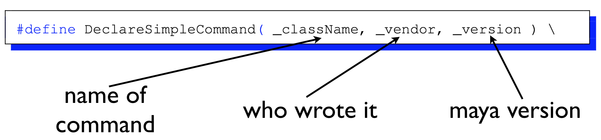
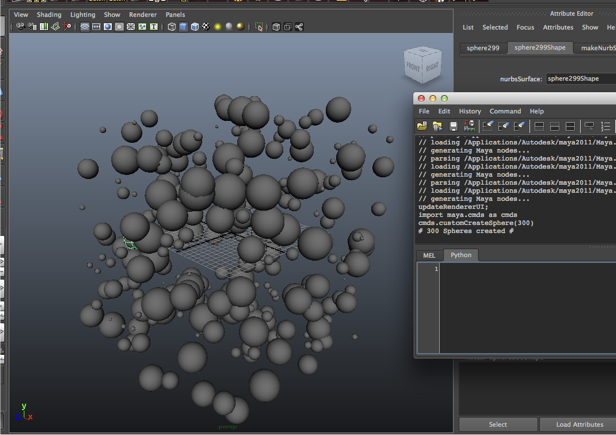
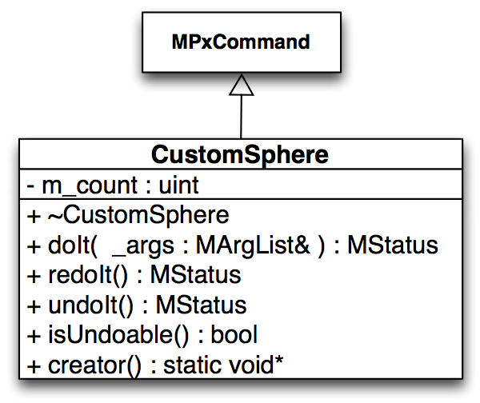

# Introduction to the MayaC++ API

Jon Macey

---

## API Basics
- Maya has both a python and a C++ API
- In most cases either can be used to accomplish tasks
- For this lecture we will look at the C++ API
- There are a series of headers and libraries shipped with maya which allow us to write plugins
- These come in many forms and will be discussed today

--

## C++ API
- The maya api uses inheritance to extend the basic functionality of maya. 
- There are a number of different class types we can work with and these will change depending upon the context

---

## MFn function Sets
- “Set of functions” for creating, querying, and operating on a type of object
  - ```MFnCamera``` 
  - ```MFnLight``` 
  - ```MFnFluid``` 
  - ```MFnPlugin``` 
  - ```MFnNurbsSurface``` 
  - ```MFnDagNode``` (DagNode has visible component in UI) 
  - ```MFnDependencyNode``` (dependency node has no visible component in UI) 

--

## MFn function Sets
- An object can be compatible with more than one type of function set . . . 
- Example: a NURBS object is compatible with/can be operated on by MFnNurbsSurface, MFnDagNode, MFnDependencyNode etc.

--

## Proxy MPx

- Base classes inherited to define new types of Maya objects 
  - Examples:
  - ```MPxCommand``` – define new commands 
  - ```MPxNode``` – define new (generic) nodes 
  - ```MPxDeformerNode``` – define deformer type 
  - ```MPxIkSolver``` – define new IK solver 
  - ```MPxFileTranslator``` – define file exporter 
- Proxies understand Maya’s internals; developer implement the new/unique features.

--

## Iterators MIt
- Used to traverse a category of objects 
- Examples:
  - ```MItKeyframe``` – iterate over keyframes of anim curve 
  - ```MItSurfaceCV``` 
  - ```MItCurveCV``` 
  - ```MItDependencyGraph``` – iterate over all nodes (in)directly connected to a given node 
  - ```MItDependencyNodes``` – traverse all the nodes in Maya’s Dependency Graph 

--

## Utility Classes

- MGlobal – a static class. Members perform mostly UI-related tasks 
- MStatus – passes return status codes (always check) 
- MString 
- MVector 
- MDagPath 

--

## MObject

- Is a handle/reference to a Maya internal object 
- Valid use: determine object type and compatible function sets 
- Maya controls the deletion of MObjects 
- NEVER store an MObject – use immediately 
- MDagPaths can be stored 

---

## Getting Started
- Maya plugins are built as platform specific shared libraries, (.so, .mll , .bundle) 
- Under mac/linux we must use the same version of the compiler as used to build maya to avoid linker problems with the standard libraries
- Linux: stdout is directed to shell (where goMaya was called in the case of the studio)
- Windows: stdout is directed to an output window 
- General: stdout may not appear unless flushed

--

## mayald
- mayald is a shell script shipped with maya to simplify the building of maya plugins / projects
- It contains commands / paths to use when building maya plugins
- It also links against all of the libraries required for every type of maya application we may wish to build
- It is found in /usr/autodesk/maya/bin in the current lab build

--

## Qt Project
- To help aid with development I have created a basic qt .pro file which will allow for maya plugin development
- At present it works for both mac and linux and will select the correct versions of the compiler etc bases on the platform
- This gives the advantage of using the Qt IDE for our development.

--

## [Qt Project](https://github.com/NCCA/MayaAPICode/blob/master/Lecture1/Hello/HelloMaya.pro)

```
####################################################################################
# This file is split into Three sections
# The first configures Qt and the source files for all platforms
# The second is the linux build
# The third the mac build
# (if your using windows you will need to add a fourth one!)
# first lets remove Qt core and gui not going to need it
####################################################################################
QT -= core gui
####################################################################################
# This is the name of the plugin / final lib file
####################################################################################
TARGET = HelloMaya
####################################################################################
# for for mac we need a bundle so change the name
####################################################################################
macx:TARGET=HelloMaya.bundle
####################################################################################
# here we add the source files (and headers if required)
####################################################################################
SOURCES+=HelloMaya.cpp
# these are defines required by Maya to re-define some C++
# stuff, we will add some more later to tell what platform
# we are on as well
DEFINES+=REQUIRE_IOSTREAM \
         _BOOL
####################################################################################
# These are the maya libs we need to link to, this will change depending
# upon which maya framework we use, just add them to the end of
# this list as required and they will be added to the build
####################################################################################
MAYALIBS=-lOpenMaya \
         -lFoundation
####################################################################################
# these are all the libs usually included by mayald in case you need
# them just add them to the list above and make sure you escape
####################################################################################
#-lOpenMayalib \
#-lOpenMaya \
#-lAnimSlice \
#-lDeformSlice \
#-lModifiers \
#-lDynSlice \
#-lKinSlice \
#-lModelSlice \
#-lNurbsSlice \
#-lPolySlice \
#-lProjectSlice \
#-lImage \
#-lShared \
#-lTranslators \
#-lDataModel \
#-lRenderModel \
#-lNurbsEngine \
#-lDependEngine \
#-lCommandEngine \
#-lFoundation \
#-lIMFbase \
#-lm -ldl
####################################################################################
# now tell linux we need to build a lib
####################################################################################
linux-*:TEMPLATE = lib
####################################################################################
# this tells qmake where maya is
####################################################################################
linux-*:MAYALOCATION=/opt/autodesk/maya/
# and now the devkit is not part of maya where to find it
# in the Uni I have it in /public/devel/mayaDevkit
linux-*:DEVKITLOCATION=/public/devel/mayaDevkit
####################################################################################
# under linux we need to use the version of g++ used to build maya
# in this case g++412
####################################################################################
#linux-g++-64:QMAKE_CXX = g++412
####################################################################################
# set the include path for linux
####################################################################################
linux-*:INCLUDEPATH += $$DEVKITLOCATION/include \
												/usr/X11R6/include
####################################################################################
# set which libs we need to include
####################################################################################
linux-*:LIBS += -L$$MAYALOCATION/lib \
									 $$MAYALIBS
####################################################################################
# tell maya we're building for linux
####################################################################################
linux:DEFINES+=linux

####################################################################################
# tell maya we're building for Mac
####################################################################################
macx:DEFINES+=OSMac_
macx:MAYALOCATION=/Applications/Autodesk/maya2016
macx:CONFIG -= app_bundle
macx:INCLUDEPATH+=$$MAYALOCATION/devkit/include
####################################################################################
# under mac we need to build a bundle, to do this use
# the -bundle flag but we also need to not use -dynamic lib so
# remove this
####################################################################################
macx:LIBS +=-bundle
mac:LIBS -=-dynamiclib
####################################################################################

####################################################################################
macx:LIBS += -L$$MAYALOCATION/Maya.app/Contents/MacOS \
						 $$MAYALIBS
####################################################################################
CONFIG+=c++11

```

---

## A Simple Maya Command
- The following example will create and register a simple maya command
- We are going to use a macro supplied with the maya API which will create the correct class / code we require
- This is the simplest possible way and is good for quick command development

--

## [A Simple Maya Command](https://github.com/NCCA/MayaAPICode/blob/master/Lecture1/Hello/HelloMaya.cpp)

```
#include <maya/MSimple.h>
#include <maya/MIOStream.h>
#include <maya/MGlobal.h>
// This is a macro to create a simple command
// the compiler expands it to a bunch of code

DeclareSimpleCommand( HelloMaya , "NCCA", "Maya 2016");

MStatus HelloMaya::doIt( const MArgList& )
{
  std::cout<<"This should come from the shell\n";
  MGlobal::displayInfo("Hello Maya in the maya command shell");
  MGlobal::displayWarning("This should be a warning");
  MGlobal::displayError("This should be an error");

  return MS::kSuccess;
}
```



--

## Loading plugins
<video controls loop  autoplay="autoplay">
    <source data-src="images/maya1.mov" type="video/mp4" />
</video>

--

## running the command
<!-- .slide: style="text-align: left;"> -->  

- Python

```
import maya.cmds as cmds
cmds.HelloMaya()
```

- Mel

```
HelloMaya
```

---

<!-- .slide: style="text-align: center;"> -->  

## customCreateSphere
- This command will generate a number of random spheres based on a user argument


--

## customCreateSphere


--

## customCreateSphere
- We will implement the following virtual methods from the MPxCommand class
- the main code for executing the command will be placed in the redoIt and called from the doIt method when constructed
- As we have no dynamic memory we don’t actually use the dtor.


--


## Utility macros

- This macro makes it easy to check for errors and will be replaced by the compiler every time we use it.

```

#define CHECK_STATUS_AND_RETURN_IF_FAIL( status , message )				\
  if( !status )									\
  {										\
    MString errorString = status.errorString() +  MString( message);	\
    MGlobal::displayError( errorString );					\
    return MStatus::kFailure;						\
  }										\

```

--

## Basic Methods

- Note the creator method is called by maya and we use it to call our ctor 

```
bool CustomSphere::isUndoable() const
{
	return true;
}


void* CustomSphere::creator()
{
  return new CustomSphere();
}
```

--

## doIt method
- the doIt method will be passed any arguments passed when the command is invoked.
- It is the responsibility of the doIt command to parse these and store in the class any values which may be required for do / undo.
- Arguments are processed by the MArgList class as shown in the following example

--

```
MStatus CustomSphere::doIt( const MArgList& _args )
{
	MStatus	status;

	// Verify argument count
  if ( _args.length() != 1 )
	{
		MGlobal::displayError( "Command requires one argument" );
		return MStatus::kFailure;
	}

	// Check aurgument type
  m_count = _args.asInt( 0, &status );
	if( !status )
	{
		MGlobal::displayError( "argument is not an integer" );
		return MStatus::kFailure;
	}

	// Check argument range
	if( m_count <= 0 )
	{
		MGlobal::displayError( "argument must be greater than zero" );
		return MStatus::kFailure;
	}
  // now call the redoIt method which actually does the work
	return redoIt();
}

```

--

## redoIt method

- In this case the redoIt method will do the creation of the spheres
- This will loop for the number of times specified on the command line, and execute a maya command to create a sphere with a random radius
- Next a move command will be executed to move the sphere to a random position


--

## redoIt method

```

MStatus CustomSphere::redoIt()
{
  // loop for the number of arguments passed in and create some random spheres
  for(  int i = 0; i < m_count; ++i )
	{
    // fist I'm going to create a maya command as follows
    // sphere -name "sphere[n]" where n is the value of i
    std::string cmd;
    float rad=randFloat(0.8,4.5);
    cmd=boost::str(boost::format("sphere -name \"sphere%d\" -r %f") %i %rad)  ;
    // now execute the command
    MStatus status = MGlobal::executeCommand( cmd.c_str() );
    // and check that is was succesfull
    CHECK_STATUS_AND_RETURN_IF_FAIL(status,"Unable to execute sphere command");

    // now move to a random position first grab some positions
    float x=randFloat(-20,20);
    float y=randFloat(-20,20);
    float z=randFloat(-20,20);
    // build the command string
    // move x y z "sphere[n]"
    cmd=boost::str(boost::format("move %f %f %f \"sphere%d\"") %x %y %z %i)  ;
    // execute
    status=MGlobal::executeCommand(cmd.c_str());
    CHECK_STATUS_AND_RETURN_IF_FAIL(status,"unable to move object");

	}
  std::string mesg=boost::str(boost::format("%d Spheres created") %m_count)  ;
  MGlobal::displayInfo( mesg.c_str() );
	return MStatus::kSuccess;
}

```

--

## undoIt method

```

MStatus CustomSphere::undoIt()
{
  // here we undo what was done in the re-do method,
  // this will be called when maya calles the undo method
  for(  int i = 0; i < m_count; ++i )
  {
    std::string cmd;
    // delete the objects as created previously
    cmd=boost::str(boost::format("delete  \"sphere%d\"") %i)  ;
    MStatus status=MGlobal::executeCommand(cmd.c_str());
    // check that is was ok
    CHECK_STATUS_AND_RETURN_IF_FAIL(status,"unable to delete objects in undo");

  }
	return MStatus::kSuccess;
}

```

--

## plugin code

- to register our command we need to add some plugin code to allow the register / deregister of the plugin
- This is as follows

```

#include "CustomSphere.h"
#include <maya/MFnPlugin.h>


MStatus initializePlugin( MObject obj )
{ 
	MStatus   status;
	MFnPlugin plugin( obj, "", "NCCA" , "Any" );

  status = plugin.registerCommand( "customCreateSphere", CustomSphere::creator );
	if ( !status )
	{
    status.perror( "Unable to register command \"customCreateSphere\"" );
		return status;
	}

	return status;
}


MStatus uninitializePlugin( MObject obj )
{
	MStatus   status;
	MFnPlugin plugin( obj );

  status = plugin.deregisterCommand( "customCreateSphere" );
	if ( !status )
	{
    status.perror( "Unable to register command \"customCreateSphere\"" );
		return status;
	}

	return status;
}

```

---

## Exercise

- Using the maya api documentation for MArgList modify the customCreateSphere plugin to take the following arguments
  - -mr [double] the minimum radius must be >0
  - -mm [double] the max radius
  - -x [double] the  ±x extents
  - -y [double] the  ±y extents
  - -z [double] the  ±z extents
  - -n [int] the number of spheres to create

--

## Hint

- You will need to add class attributes for each of the new parameters, there is quite a lot of sample code in the MArgList class you can use.
- If you want a more advanced solution follow this tutorial http://nccastaff.bournemouth.ac.uk/jmacey/RobTheBloke/www/maya/MSyntax.html
- Solution next week (mine is based on the above)

