# Maya C++ API MPxNodes

Jon Macey

---

## Nodes
- Unlike command plugins, nodes directly effect the maya Dependency Graph (DG)
- The DG has a data flow structure that supports animation, construction history, and constraints
- The Maya APIs provide the necessary methods to both add new nodes and examine nodes that already exist.


--

## Dependency Graph
- There are two levels of access to the DG
  - The scene graph provides you with a high level view where you need to know little about the DG but can still affect it.
  - A lower level view of Maya is provided by API function sets. Function sets let you view the DG so that you can see a node, the attributes of the node, the node connections, and the data and messages coming in and going out of the node.

--

## Nodes
- Can be thought of as a “black box” derived from MPxNode
- Has Attributes (usually seen on maya panel)
  - input and output
- can be static or dynamic
  - Each node instance has data MDataBlock
  - Has plugs and connections to other nodes

--

## Nodes

<div id="mySlideLeft">
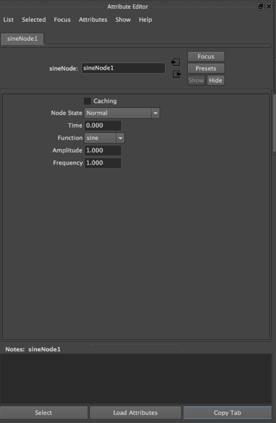
</div>
<div id="mySlideRight">
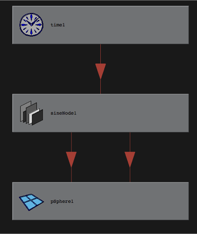
</div>

---

## Mfn*Attributes
- Used for the Attribute Definition (MObject)
- static members of the Node class
  - declared once for all instances of the node
  - Does not hold the real data just the definition

--

## Mfn*Attributes
- MFnAttribute
  - MFnGenericAttribute
  - MFnEnumAttribute
  - MFnTypedAttribute
  - MFnNumericAttribute
  - MFnUnitAttribute (MAngle, MDistance, MTime)
  - MFnCompoundAttribute
  - MFnMessageAttribute
  - MFnMatrixAttribute
  - MFnLightDataAttribute

--

## Mfn*Attributes
- An attribute of a dependency node describes a piece of data that belongs to nodes of that type.
- A node's attributes describe connections sites on the node that can be used in the dependency graph
- Attributes typically belong to a class of nodes, rather than to an individual node. 
  - For example, all sphere nodes have a radius. 
- Even though a single attribute may be shared by all nodes of a given type, each node will have its own value for the attribute.

---

## MDataBlock / MDataBlockArray
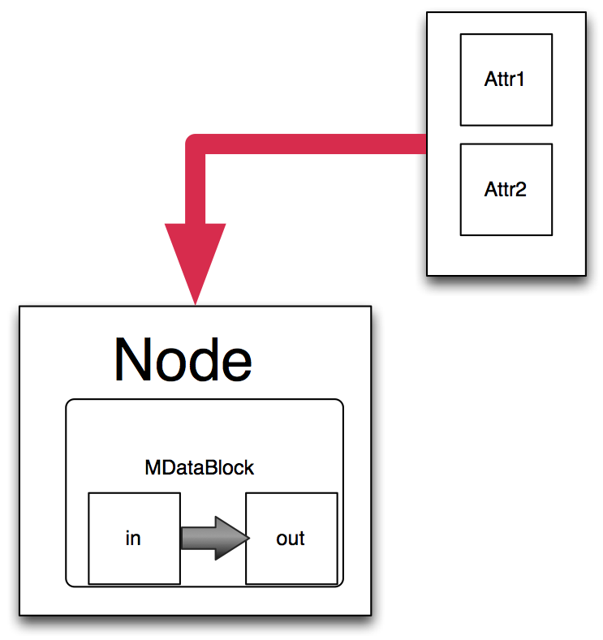
- As nodes don’t contain data, it must be passed to the specific instance of the node
- A node may have more than one DataBlock (one for each context time / MDGContext)

--

## MDataBlock / MDataBlockArray

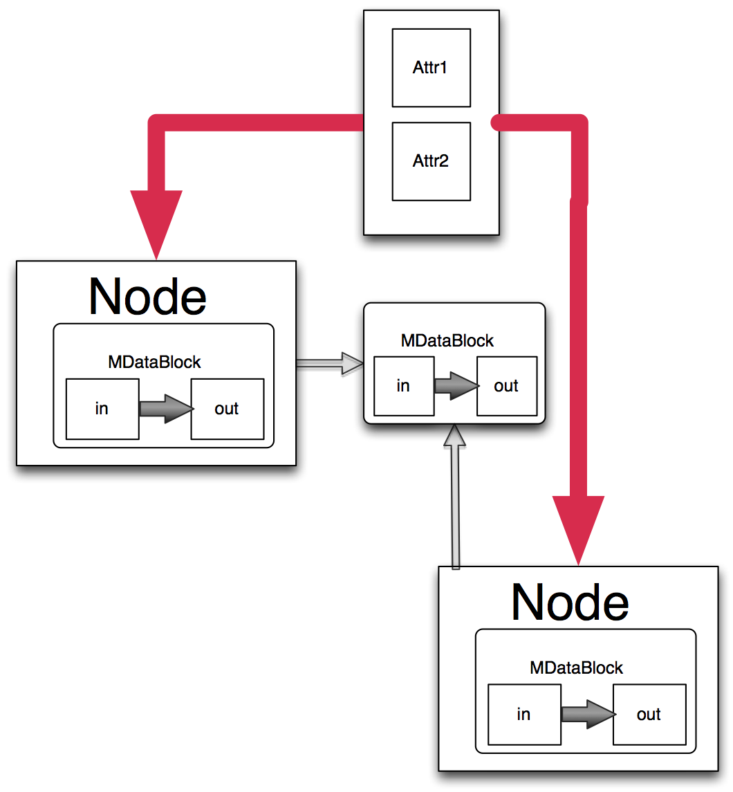
- Data blocks can be shared or cached
- Maya will decide on best performance / memory for usage

---

## MPlug
- A Plug links the attribute data of a specific node
- Node connections are established from plugs

```
MDGModifier::connect()
```
- Can be found using the ```MFnDependencyNode::findPlug()``` method
- Changing an attribute value via a plug will set the dirty flag
- Querying an attribute value via a plug forces the re-evaluation of the attribute if dirty flag is set.

--

```
MStatus MPxNode*::compute( const MPlug &_plug , MDataBlock &_data );
```
- The nodes compute method is passed both a plug and a data block
- We access the node’s data from this method (call is dependent upon maya and is done in an efficient way when needed)
- We can then access Attributes and modify them / outputs
- Must set flag to indicate change (dirty / clean)

--

## Connections
<div id="mySlideLeft">
<ul>
<li class=”fragment”> Nodes connected by attributes (seen in Hypergraph connections) 
<li class=”fragment”> Data flow always one way </p>
<li class=”fragment”> Only attributes of same type can be connected (some casting can happen) 
</ul>
</div>
<div id="mySlideRight">
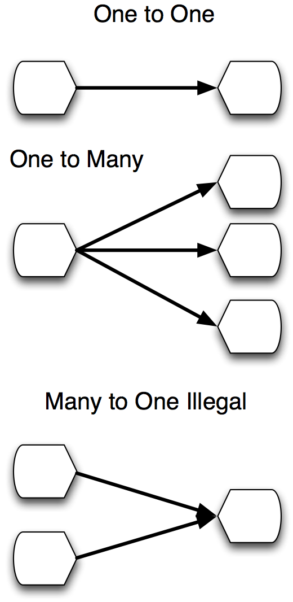
</div>

--

## Connections

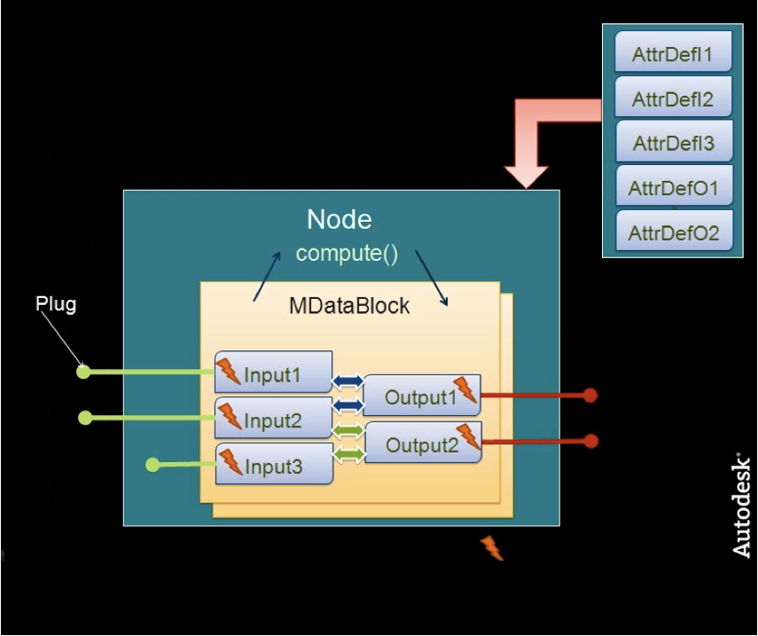

---

## Creating Nodes

```
class myNode : public MpxNode 
{
  public :
    static MTypeId m_id;
    static MObject m_Attr;
......
  public :
  static void *creator();
  static MStatus initialize();
  virtual MStatus compute(const MPlug &, MDataBlock &);
};
```
- Node from 0x00000 to 0x0007ffff reserved for testing
- used internally for load / unload
- If production nodes for sharing they can be requested from Autodesk

--

## MPxNode::initialize
- Used to create static attribute definitions
  - create attributes
  - set flags for attributes
  - add attributes to the node
  - define attribute relationships (attribute linking)

--

## MPxNode::compute
- Does actual computation when dirty output is set
- Query and set data and update the dirty flag
- If plug is unknown return ```kUnknownParameter``` so maya can handle
- Don’t look at data outside the node ( will tend to get cyclic errors)
- Don’t send dirty messages

--

## MPxNode

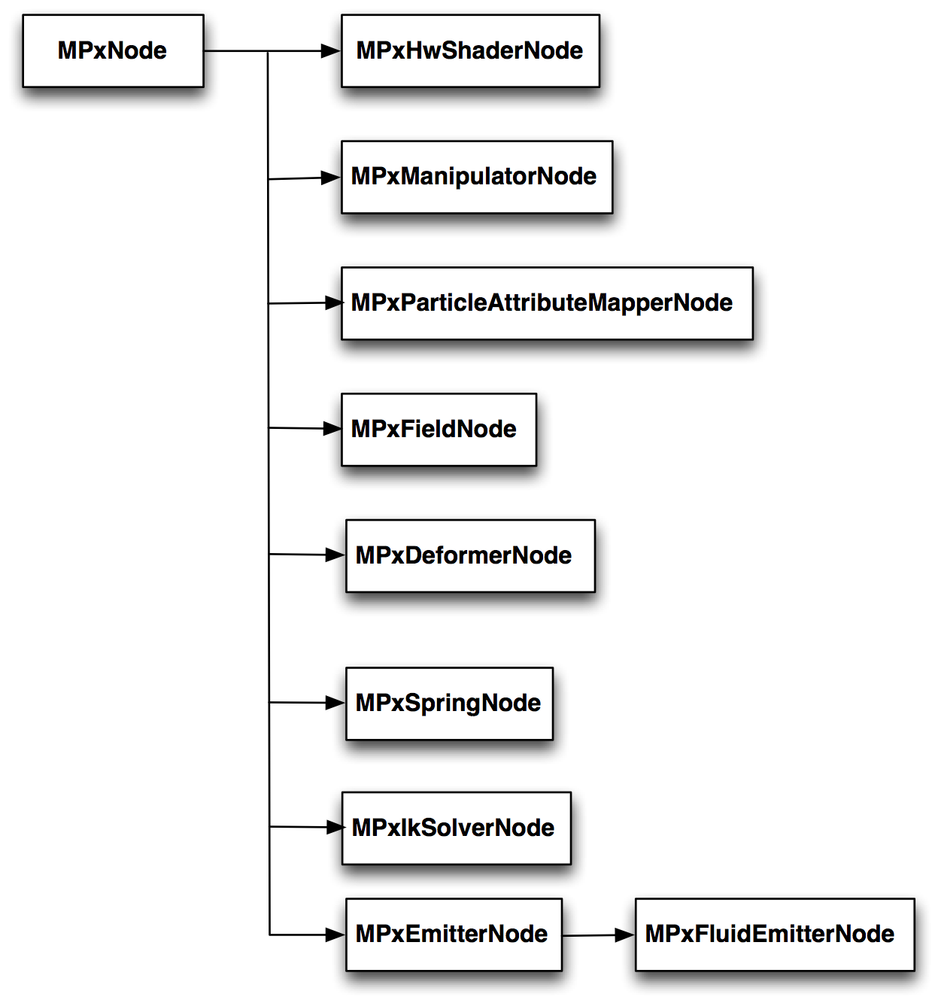

---

## MPxLocatorNode
- Base class for user defined locators.
- A locator is a DAG shape that is drawn on the screen, but that is not rendered. 
- Locators are full dependency nodes and can have attributes and a compute method.
- The draw method can be overridden to draw custom geometry using standard OpenGL calls.
  - Note Viewport 2 needs different calls to Legacy Viewport 

--

## example [cubeLocator](https://github.com/NCCA/MayaAPICode/tree/master/Lecture2/Locator)
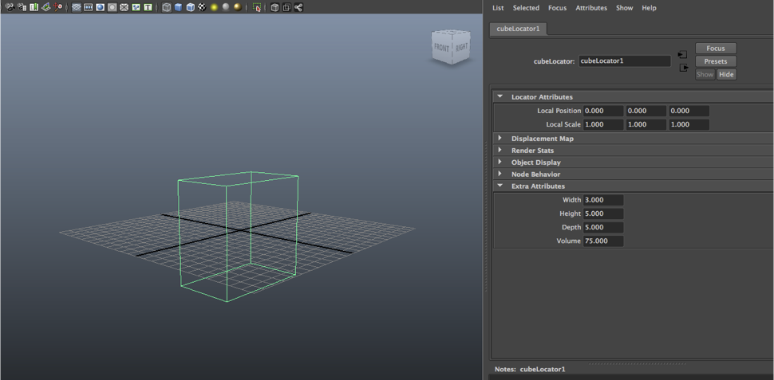

--

## example [cubeLocator](https://github.com/NCCA/MayaAPICode/tree/master/Lecture2/Locator)

- this node has 4 attributes (width height depth and volume)
- volume is calculated when w/h/d are changed
- It also uses immediate mode OpenGL to draw the locator
- This node is based on the MPxLocator node and inherits from it.
- The basic class diagram is as follows

--

## example [cubeLocator](https://github.com/NCCA/MayaAPICode/tree/master/Lecture2/Locator)
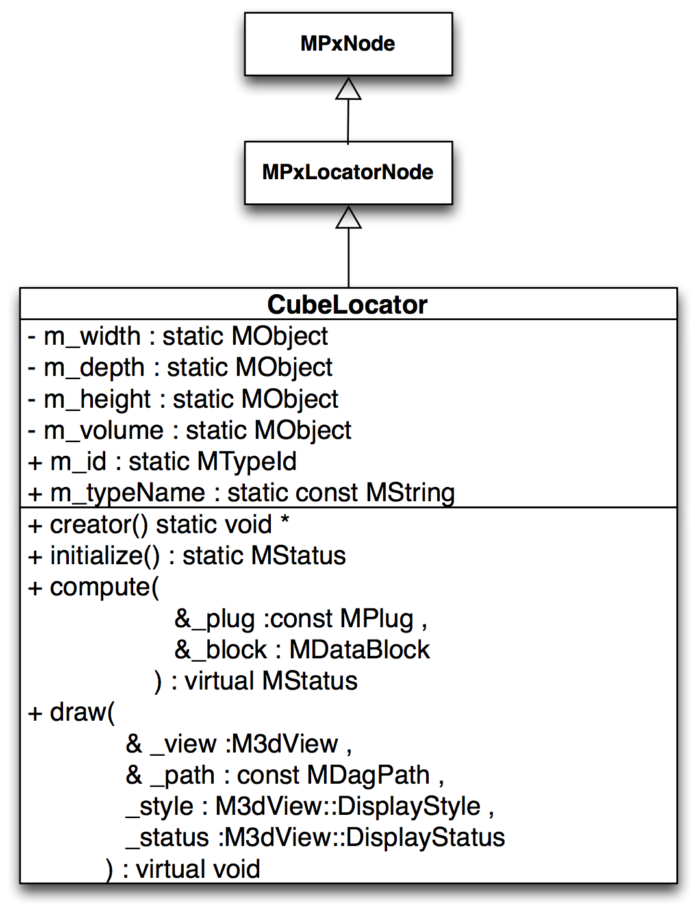

--

```
#ifndef CUBE_NODE_H_
#define CUBE_NODE_H_

#define LINUX

#include <maya/MTypeId.h>
#include <maya/MStatus.h>
#include <maya/M3dView.h>
#include <maya/MGlobal.h>
#include <maya/MPxLocatorNode.h>
#include <maya/MFnDependencyNode.h>
#include <maya/MFnNumericAttribute.h>


//----------------------------------------------------------------------------------------------------------------------
/// @brief a simple maya locator node using OpenGL to draw a cube with width / height / depth
/// paramaters. Also the volume of the cube is created each time an attribute is changed
//----------------------------------------------------------------------------------------------------------------------

class CubeLocatorNode : public MPxLocatorNode
{

public:
  //----------------------------------------------------------------------------------------------------------------------
  /// @brief the creator node is called when the plugin is created
  //----------------------------------------------------------------------------------------------------------------------
  static void		*creator();
  //----------------------------------------------------------------------------------------------------------------------
  /// @brief initialize called when plug is created
  //----------------------------------------------------------------------------------------------------------------------
  static MStatus		initialize();
  //----------------------------------------------------------------------------------------------------------------------
  /// @brief compute is called every time the attributes of the class change
  /// @param [in] 	_plug 	plug representing the attribute that needs to be recomputed
  /// @param [in] 	_block 	data block containing storage for the node's attributes
  //----------------------------------------------------------------------------------------------------------------------
  virtual MStatus		compute(
                             const MPlug &_plug ,
                              MDataBlock &_block
                            );
  //----------------------------------------------------------------------------------------------------------------------
  /// @brief this method is called when the display is updated
  /// @param [in] 	_view 	3D view that is being drawn into
  /// @param [in] 	_path 	to this locator in the DAG
  /// @param [in] 	_style 	style to draw object in
  /// @param [in] 	_status 	selection status of object
  //----------------------------------------------------------------------------------------------------------------------
  virtual void 		draw(
                        M3dView & _view ,
                        const MDagPath & _path ,
                        M3dView::DisplayStyle _style,
                        M3dView::DisplayStatus _status
                        );


  //----------------------------------------------------------------------------------------------------------------------
  /// @brief the id of this plugin must be public so we can set outside of class
  //----------------------------------------------------------------------------------------------------------------------
  static MTypeId 		m_id;
  //----------------------------------------------------------------------------------------------------------------------
  /// @brief the unique type name of our custom node. Mainly for mel purposes.
  /// must be public so maya can access
  //----------------------------------------------------------------------------------------------------------------------
  static const MString m_typeName;

private :

  //----------------------------------------------------------------------------------------------------------------------
  /// @brief the width of our locator cube this can be changed by the user
  //----------------------------------------------------------------------------------------------------------------------
  static MObject m_width;
  //----------------------------------------------------------------------------------------------------------------------
  /// @brief the height of our locator cube this can be changed by the user
  //----------------------------------------------------------------------------------------------------------------------
  static MObject m_height;
  //----------------------------------------------------------------------------------------------------------------------
  /// @brief the depth of our locator cube this can be changed by the user
  //----------------------------------------------------------------------------------------------------------------------
  static MObject m_depth;
  //----------------------------------------------------------------------------------------------------------------------
  /// @brief the volume of our locator cube this is calculated each time the attributes
  /// above are changed
  //----------------------------------------------------------------------------------------------------------------------
  static MObject m_volume;

};
#endif
//----------------------------------------------------------------------------------------------------------------------

```

--

## [static initializers](http://www.learncpp.com/cpp-tutorial/811-static-member-variables/)

```
MObject CubeLocatorNode::m_width;
MObject CubeLocatorNode::m_height;
MObject CubeLocatorNode::m_depth;
MObject CubeLocatorNode::m_volume;
// as these are static initialisers we need to set them here.
MTypeId CubeLocatorNode::m_id( 0x70000 );		// numeric Id of node
const MString CubeLocatorNode::m_typeName( "CubeLocatorNode" );
```
- Because static member variables are not part of the individual class objects (they get initialized when the program starts), you must explicitly define the static member outside of the class, in the global scope.
- We set the typename and ID as this is the same for all
- The MObject ones will be set at initialisation

--

## accessing attributes

- Each attribute needs to be set here the following code shows one of the attributes
- You are setting up a shared description of the attributes for a given node type
- In this case each one is a numeric attribute
- I use the macro from the previous lecture to error check

```
// Create a width attribute this will be placed in the maya panel as an "Extra Attribute"
m_width = numAttr.create( "width", "w", MFnNumericData::kDouble, 1.0, &status );
CHECK_STATUS_AND_RETURN_MSTATUS_IF_FAIL( status , "Unable to create \"width\" attribute" );
numAttr.setChannelBox( true );			// length attribute appears in channel box

// Add width attribute to node
status = addAttribute( m_width );
CHECK_STATUS_AND_RETURN_MSTATUS_IF_FAIL( status , "Unable to add \"width\" attribute to CubeLocatorNode" );
```

--

## attribute linking
- Once the attributes are created we need to link them so the compute method is called

```
// Setup "attribute affects" relationship this will call the compute method for the 2nd attribute
// parameters are const MObject & whenChanges, const MObject & isAffected
// in this case when any of the w/h/d params are changed we re-calculate the volume.
attributeAffects( m_width , m_volume );
attributeAffects( m_height , m_volume );
attributeAffects( m_depth , m_volume );
```

--

## compute
- The compute method, checks to see what plug has been passed 
- If it is the m_volume plug we grab the other attributes and calculate the volume
- Once this is done we set volume to the new value
- finally we indicate the plug is clean be setting the node state

--

## compute

```

MStatus CubeLocatorNode::compute( const MPlug &_plug , MDataBlock &_data )
{
  MStatus status;
  double volume;
  // if the w/h/d params are changed we will get the plug m_volume passed to us
  if( _plug == m_volume)
	{
		// get data handle for length
    MDataHandle dataHandle = _data.inputValue( m_width , &status );
    CHECK_STATUS_AND_RETURN_MSTATUS_IF_FAIL( status , "Unable to get data handle for width plug" );
    // now get the value for the data handle as a double
    volume= dataHandle.asDouble();
    dataHandle = _data.inputValue( m_height , &status );
    CHECK_STATUS_AND_RETURN_MSTATUS_IF_FAIL( status , "Unable to get data handle for height plug" );
    volume*=dataHandle.asDouble();
    dataHandle = _data.inputValue( m_depth , &status );
    CHECK_STATUS_AND_RETURN_MSTATUS_IF_FAIL( status , "Unable to get data handle for depth plug" );
    volume*=dataHandle.asDouble();
    // now set
    // get data handle for the volume (note this is now an output value)
    MDataHandle volumeDataHandle = _data.outputValue( _plug , &status );
    CHECK_STATUS_AND_RETURN_MSTATUS_IF_FAIL( status , "Unable to get data handle for volume plug" );
    // set the value
    volumeDataHandle.setDouble( volume );

    // clean the output plug, ie unset it from dirty so that maya does not re-evaluate it
    _data.setClean( _plug );
    return MStatus::kSuccess;
	}

  return MStatus::kUnknownParameter;
}
```

--

## compute 
- More often than not, you'll typically find that Maya will be forced to compute: output1 on a set of nodes, followed by output2 on a set of nodes, etc. 
- It's highly unusual to find Maya computing node1.output1, node1.output2, node1.output3, etc (although YMWV). 
- Splitting the compute into sub-functions helps improve instruction cache usage, and frees up a little bit more of the CPU cache (important because the Maya API is memory bandwidth limited). 

--

## draw

- The draw method initially gets the DG by using MFnDependencyNode
- It then finds the correct plug by name and we use this to get the attribute values
- Next these values are used to draw a cube using the OpenGL commands

--

## getting the plug values

```
 // these values will be used to obtain the plug parameters
  double width;
  double height;
  double depth;
  // error status checking
	MStatus status;
  // first grab the dependency node so we can query the plugs
	MFnDependencyNode dependencyFn( thisMObject() , &status );
	CHECK_STATUS_AND_RETURN_IF_FAIL( status , "Unable to initialize dependency node" );
  // grab the width plug
  MPlug sizePlug = dependencyFn.findPlug( m_width , true , &status );
  CHECK_STATUS_AND_RETURN_IF_FAIL( status , "Unable get width plug" );
  // now grab the value and place in our variable
  status = sizePlug.getValue( width );
  CHECK_STATUS_AND_RETURN_IF_FAIL( status , "Unable get value from width plug" );
  // repeat for the rest
  sizePlug = dependencyFn.findPlug( m_depth , true , &status );
  CHECK_STATUS_AND_RETURN_IF_FAIL( status , "Unable get depth plug" );

  status = sizePlug.getValue( depth );
  CHECK_STATUS_AND_RETURN_IF_FAIL( status , "Unable get depth from width plug" );

  sizePlug = dependencyFn.findPlug( m_height , true , &status );
  CHECK_STATUS_AND_RETURN_IF_FAIL( status , "Unable get depth plug" );

  status = sizePlug.getValue( height );
  CHECK_STATUS_AND_RETURN_IF_FAIL( status , "Unable get  value from depth plug" );

```

--

## drawing

```
 _view.beginGL();
    // we are going to draw our cube by two squares for top and bottom then lines for the
   // side edges
		// Top face
		glBegin( GL_LINE_LOOP );
      glVertex3d(  width , height ,  depth );
      glVertex3d( -width , height ,  depth );
      glVertex3d( -width , height , -depth );
      glVertex3d(  width , height , -depth );
		glEnd();

		// Bottom face
		glBegin( GL_LINE_LOOP );
      glVertex3d(  width , -height ,  depth );
      glVertex3d( -width , -height ,  depth );
      glVertex3d( -width , -height , -depth );
      glVertex3d(  width , -height , -depth );
		glEnd();

		// Sides
		glBegin( GL_LINES );
      glVertex3d(  width ,  height ,  depth );
      glVertex3d(  width , -height ,  depth );

      glVertex3d( -width ,  height ,  depth );
      glVertex3d( -width , -height ,  depth );

      glVertex3d( -width ,  height , -depth );
      glVertex3d( -width , -height , -depth );

      glVertex3d(  width ,  height , -depth );
      glVertex3d(  width , -height , -depth );
		glEnd();

  _view.endGL();
```

---

## [sineNode example](https://github.com/NCCA/MayaAPICode/tree/master/Lecture2/SineNode)
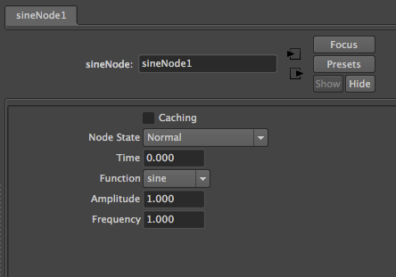
- The sineNode takes one input and creates an output that is a function of the input
- It has three attributes used to calculate the output
- An enum attribute is used to select either sine, cos or a complex waveform

--

## Sine Node class
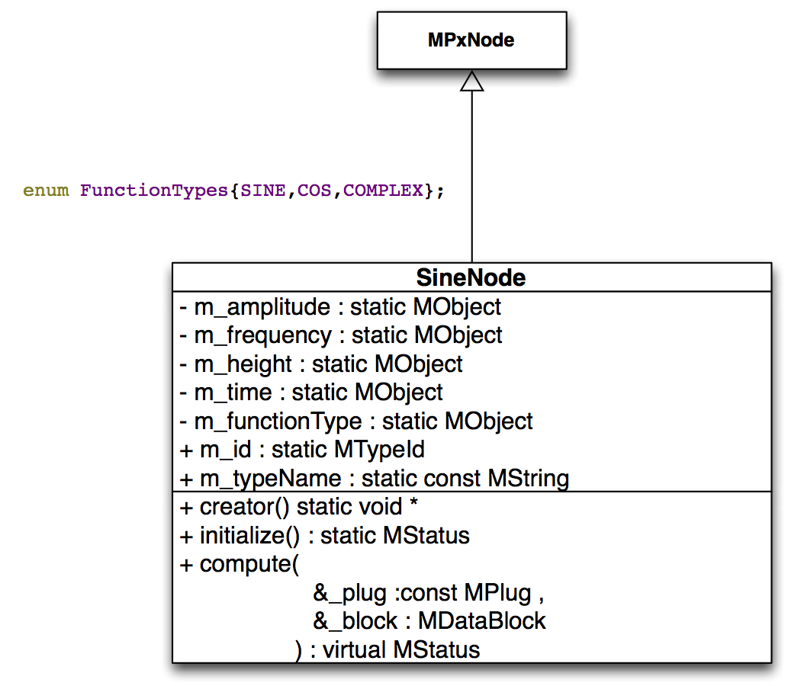
- Most of the class is similar to the last example so I will concentrate on the differences

--

## Unit Attributes
- Any attribute types that are measured in changeable units should be created using the	MFnUnitAttribute function set.
- In this example we are using time

```
//	Any attribute types that are measured in changeable units, ie distance(cm, mm, miles, feet),
//	angles( degrees, radians ), time( secs, mins, frames ) etc should be created using the
//	MFnUnitAttribute function set.
//
MFnUnitAttribute uAttr;
m_time =  uAttr.create( "time", "t", MFnUnitAttribute::kTime );
// since the input attribute will be connected to the time value, there is little point
// in storing this attribute within the maya binary file. There is also no point in
// making the attribute keyable.
uAttr.setStorable(false);
uAttr.setKeyable(false);
status = addAttribute( m_time );
CHECK_STATUS_AND_RETURN_MSTATUS_IF_FAIL( status , "Unable to add \"time\" attribute to SineNode" );

```

--

## enum Attributes
- enum attributes have key / index pairs, they are similar to combo boxes in Qt
- The following code shows how to create one

```
MFnEnumAttribute    enumAttr;
// note that f is used later as the shortcut for frequency so we use ft
m_functionType = enumAttr.create( "function", "ft", 0, &status );
CHECK_STATUS_AND_RETURN_MSTATUS_IF_FAIL( status , "Unable to create \"function\" attribute" );

enumAttr.addField( "sine", SINE );
enumAttr.addField( "cos", COS );
enumAttr.addField( "complex", COMPLEX );
enumAttr.setHidden( false );
enumAttr.setKeyable( true );
status = addAttribute( m_functionType );
CHECK_STATUS_AND_RETURN_MSTATUS_IF_FAIL( status , "Unable to add \"function type\" attribute to SineNode" );
```

--

## time data
- the following code get the data as a time value

```
// get data handle for length
MDataHandle timeData = _data.inputValue( m_time , &status );
CHECK_STATUS_AND_RETURN_MSTATUS_IF_FAIL( status , "Unable to get data handle for time plug" );

// get data handle for function
MDataHandle funcData = _data.inputValue( m_functionType , &status );
CHECK_STATUS_AND_RETURN_MSTATUS_IF_FAIL( status , "Unable to get data handle for function plug" );

MDataHandle outputData = _data.outputValue(m_output);
CHECK_STATUS_AND_RETURN_MSTATUS_IF_FAIL( status , "Unable to get data handle for output plug" );

// get the input value as a time value
MTime Time = timeData.asTime();

```

--

##  enum data
- In this code we get the enum data and switch on it
- Also note the time conversion of the time object

```
// get data handle for length
MDataHandle dataHandle = _data.inputValue( m_frequency , &status );
CHECK_STATUS_AND_RETURN_MSTATUS_IF_FAIL( status , "Unable to get data handle for freq plug" );
// now get the value for the data handle as a double
double freq = dataHandle.asDouble();
dataHandle = _data.inputValue( m_amplitude , &status );
CHECK_STATUS_AND_RETURN_MSTATUS_IF_FAIL( status , "Unable to get data handle for amplitude plug" );
// now get the value for the data handle as a double
double amp = dataHandle.asDouble();
double out;
switch(funcData.asInt())
{
  case SINE :  out=amp*sin(freq*M_PI*Time.as(MTime::kSeconds)); break;
  case COS :   out=amp*cos(freq*M_PI*Time.as(MTime::kSeconds)); break;
  case COMPLEX :
            out=amp*cos(freq*M_PI*Time.as(MTime::kSeconds)) +
                amp*sin(2*freq*M_PI*Time.as(MTime::kSeconds));
  break;
}

```

--

## using the sineNode

<video controls loop  autoplay="autoplay">
    <source data-src="images/sinedemo.mov" type="video/mp4" />
</video>

---

## [example noiseNode](https://github.com/NCCA/MayaAPICode/tree/master/Lecture2/Noise)
<div id="mySlideLeft">
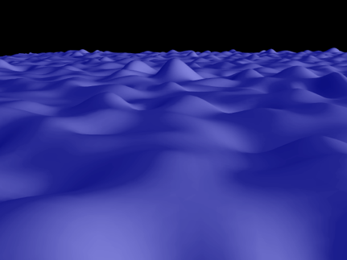
</div>

<div id="mySlideRight">
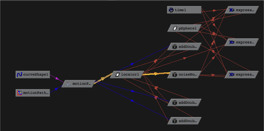
</div>

- the noise node implements different Perlin noise function based on an MPoint input
- It can be used to deform a grid (above) or to add jitter to an animation (graph)

--

## [example noiseNode](https://github.com/NCCA/MayaAPICode/tree/master/Lecture2/Noise)

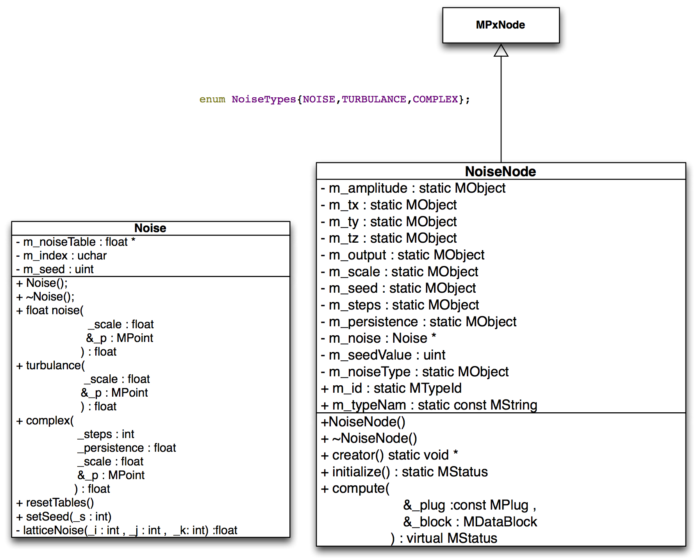

--

## Noise Class
- The noise class is a stand alone class similar to the one used in the OpenGL texture lecture
- It uses the std::random template for the random number generator
- It has a number of methods to generate different noise values
- The tables can be re-set by setting a different seed and calling resetTables()

--

## Noise Class

```
//----------------------------------------------------------------------------------------------------------------------
/// @brief
/// simple Perlin noise class cobbled together from Computer Graphics OpenGL by F,S Hill
/// and Texturing and Modeling Ebert et-al
/// also thanks to Ian Stephenson for help and debuging tips
/// more work needs to be done to add interpolated noise functions and improve the
/// aliasing of the textures but it is ok for basic use
//----------------------------------------------------------------------------------------------------------------------


#ifndef NOISE_H_
#define NOISE_H_

#include <maya/MPoint.h>
#include <array>
//----------------------------------------------------------------------------------------------------------------------
/// @class Noise a simple Perlin noise class
/// @author Jon Macey
/// @version 1.0
/// @date 19/4/12
//----------------------------------------------------------------------------------------------------------------------

class Noise
{
public :
  //----------------------------------------------------------------------------------------------------------------------
  /// @brief a ctor dynamically allocates two tables
  //----------------------------------------------------------------------------------------------------------------------
  Noise();
  //----------------------------------------------------------------------------------------------------------------------
  /// @brief dtor will remove tables allocated by dtor
  //----------------------------------------------------------------------------------------------------------------------
  ~Noise();
  //----------------------------------------------------------------------------------------------------------------------
  /// @brief a noise function to return a float based on input point and scale
  /// @param [in] _scale the scale to process the noise with
  /// @param [in] _p the point to sample noise from
  /// @brief returns a noise value
  //----------------------------------------------------------------------------------------------------------------------
  float noise( float _scale,const MPoint &_p);
  //----------------------------------------------------------------------------------------------------------------------
  /// @brief turbulance function creates higher frequency versions of noise as harmonics
  /// @param [in] _scale the scale to process the noise with
  /// @param [in] _p the point to sample noise from
  /// @brief returns a noise value
  //----------------------------------------------------------------------------------------------------------------------
  float turbulance(float _scale, const MPoint &_p );
  float complex(int _steps, float _persistence, float _scale, const MPoint &_p );
  //----------------------------------------------------------------------------------------------------------------------
  /// @brief reset the noise tables will also re-set the seed so must be called after setSeed is
  /// called
  //----------------------------------------------------------------------------------------------------------------------
  void resetTables();
  //----------------------------------------------------------------------------------------------------------------------
  /// @brief set the seed of the random number generator
  //----------------------------------------------------------------------------------------------------------------------
  inline void setSeed(int _s){m_seed=_s;}


private :

  //----------------------------------------------------------------------------------------------------------------------
  /// @brief noise table used for the noise generation
  //----------------------------------------------------------------------------------------------------------------------
  std::array <float,256> m_noiseTable;
  //----------------------------------------------------------------------------------------------------------------------
  /// @brief index into the noise table
  //----------------------------------------------------------------------------------------------------------------------
  std::array <unsigned char,256> m_index;
  //----------------------------------------------------------------------------------------------------------------------
  /// @brief random number generator seed (default to 1)
  //----------------------------------------------------------------------------------------------------------------------
  unsigned int m_seed=1.0;

  //----------------------------------------------------------------------------------------------------------------------
  /// @brief function to generate latticeNoise (from Ian Stephenson)
  /// @param [in] _i index into table
  /// @param [in] _j index into table
  /// @param [in] _k index into table
  //----------------------------------------------------------------------------------------------------------------------
  float latticeNoise(int _i, int _j, int _k);


};


#endif

```

--

## Noise Class

```
#include "Noise.h"
#include <cstdlib>
#include <ctime>
#include <cmath>
#include <algorithm>
#include <random>


//----------------------------------------------------------------------------------------------------------------------
void Noise :: resetTables()
{
  // create an instance of the Mersenne Twister random number generator
  std::mt19937 gen(m_seed);
  // and create a RandFloat function
  std::uniform_real_distribution<float> randPosFloat(0.0f, 1.0f);
  // shuffle the index table randomly
  std::shuffle(std::begin(m_index), std::end(m_index), gen);

  for(auto &t : m_noiseTable)
  {
    t=randPosFloat(gen);
  }
}
//----------------------------------------------------------------------------------------------------------------------
Noise :: Noise()
{
  int i=0;
  std::generate(std::begin(m_index), std::end(m_index), [&i]{ return i++; });
  resetTables();
}
//----------------------------------------------------------------------------------------------------------------------
Noise::~Noise()
{
}


//----------------------------------------------------------------------------------------------------------------------

float Noise::latticeNoise(int _i, int _j, int _k)
{

#define PERM(x) m_index[(x)&255]
#define INDEX(ix,iy,iz) PERM( (ix) + PERM((iy)+PERM(iz)))
// m_noiseTable[m_index[((_i) + m_index[((_j)+m_index[(_k)&255])&255])&255]];
return m_noiseTable[INDEX(_i,_j,_k)];


}

template <typename T> T lerp(T _a, T _b, float _t)
{
  T p;
  p=_a+(_b-_a)*_t;
  return p;
}


float Noise::noise(float _scale, const MPoint &_p)
{

  float d[2][2][2];
  MPoint pp;
  pp.x=_p.x * _scale ;
  pp.y=_p.y * _scale ;
  pp.z=_p.z * _scale ;

  long ix = (long) pp.x;
  long iy = (long) pp.y;
  long iz = (long) pp.z;
  float tx,ty,tz,x0,x1,x2,x3,y0,y1;
  tx=pp.x-ix; ty=pp.y-iy; tz=pp.z-iz;


  for(int k=0; k<=1; ++k)
  {
    for(int j=0; j<=1; ++j)
    {
      for(int i=0; i<=1; ++i)
      {
        d[k][j][i]=latticeNoise(ix+i,iy+j,iz+k);
      }
    }
  }

  x0=lerp(d[0][0][0],d[0][0][1],tx);
  x1=lerp(d[0][1][0],d[0][1][1],tx);
  x2=lerp(d[1][0][0],d[1][0][1],tx);
  x3=lerp(d[1][1][0],d[1][1][1],tx);
  y0=lerp(x0,x1,ty);
  y1=lerp(x2,x3,ty);
  return lerp(y0,y1,tz);
}


//----------------------------------------------------------------------------------------------------------------------
float Noise :: turbulance(float _scale, const MPoint &_p  )
{
  float val= (noise(_scale,_p)/2.0) +
             (noise(2.0*_scale,_p)/4.0) +
             (noise(4.0*_scale,_p)/8.0) +
             (noise(8.0*_scale,_p)/16.0);
  return val;
}

//----------------------------------------------------------------------------------------------------------------------
// values for this are based on http://freespace.virgin.net/hugo.elias/models/m_perlin.htm
//----------------------------------------------------------------------------------------------------------------------

float Noise::complex( int _steps,float _persistence,float _scale, const MPoint &_p )
{
  float val=0.0;

  for(int i=1; i<=_steps; ++i)
  {
    val+=(noise(i*_scale,_p)/std::pow(_persistence,i));
  }
  return val;

}
//----------------------------------------------------------------------------------------------------------------------

```

--

## Noise Node
- The noise node class is similar to the previous node examples
- This time there is user defined constructor as we need to create an instance of the noise class
- We can use C++ 11 so use std::unique_ptr<Noise> 

```
NoiseNode::NoiseNode()
{
  MGlobal::displayInfo("constructing new noise");
  m_noise.reset(new  Noise());
  m_seedValue=1;
}
```

--

## callbacks
- Whilst it is possible to attach a callback to different plugs / attributes using the maya API these must be static methods
- In such a case this means that we can’t access non static members of the class
- To overcome this problem in the following example I use a static variable in the method and compare it to the attribute value
- If there is a change we update the noise attribute

--

```
MStatus NoiseNode::compute( const MPlug &_plug , MDataBlock &_data )
{
  MStatus status;
  // as this is static we can't call non static methods, in this case we only want to re-set the seed
  // but this is expensive (re-builds the tables in the noise node) so we only do this when the seed
  // value changes. To do this, set the s_seeValue variable to the default seed value 1. here
  // then if this is different from the m_seed value from the form we update the tables and re-set this
  // as this is static value is retained between calls (an elegant hack ;0)

  static uint s_seedValue=1;

  // see if we get the output plug
  if( _plug == m_output)
	{

    MDataHandle outputData = _data.outputValue(m_output);
    CHECK_STATUS_AND_RETURN_MSTATUS_IF_FAIL( status , "Unable to get data handle for output plug" );

    // get data handle for values
    MDataHandle dataHandle = _data.inputValue( m_tx , &status );
    CHECK_STATUS_AND_RETURN_MSTATUS_IF_FAIL( status , "Unable to get data handle for tx plug" );
    // now get the value for the data handle as a double
    double tx = dataHandle.asDouble();

    dataHandle = _data.inputValue( m_ty , &status );
    CHECK_STATUS_AND_RETURN_MSTATUS_IF_FAIL( status , "Unable to get data handle for ty plug" );
    // now get the value for the data handle as a double
    double ty = dataHandle.asDouble();

    dataHandle = _data.inputValue( m_tz , &status );
    CHECK_STATUS_AND_RETURN_MSTATUS_IF_FAIL( status , "Unable to get data handle for tz plug" );
    // now get the value for the data handle as a double
    double tz = dataHandle.asDouble();


    dataHandle = _data.inputValue( m_amplitude , &status );
    CHECK_STATUS_AND_RETURN_MSTATUS_IF_FAIL( status , "Unable to get data handle for amplitude plug" );
    // now get the value for the data handle as a double
    double amp = dataHandle.asDouble();

    dataHandle = _data.inputValue( m_scale , &status );
    CHECK_STATUS_AND_RETURN_MSTATUS_IF_FAIL( status , "Unable to get data handle for scale plug" );
    // now get the value for the data handle as a double
    double scale = dataHandle.asDouble();

    dataHandle = _data.inputValue( m_steps , &status );
    CHECK_STATUS_AND_RETURN_MSTATUS_IF_FAIL( status , "Unable to get data handle for step plug" );
    // now get the value for the data handle as a double
    int steps = dataHandle.asInt();

    dataHandle = _data.inputValue( m_persistence , &status );
    CHECK_STATUS_AND_RETURN_MSTATUS_IF_FAIL( status , "Unable to get data handle for persistence plug" );
    // now get the value for the data handle as a double
    double persistence = dataHandle.asDouble();


    dataHandle = _data.inputValue( m_seed , &status );
    CHECK_STATUS_AND_RETURN_MSTATUS_IF_FAIL( status , "Unable to get data handle for scale plug" );
    // now get the value for the data handle as a double
    unsigned int seed = dataHandle.asInt();
    // see if the seed has changed and re-set the table (see note at top)
    if(seed !=s_seedValue)
    {
      MGlobal::displayInfo("re-setting to new seed");
      s_seedValue=seed;
      m_noise->setSeed(seed);
      m_noise->resetTables();
    }

    // get data handle for type and set the output value
    MDataHandle noiseType = _data.inputValue( m_noiseType , &status );
    CHECK_STATUS_AND_RETURN_MSTATUS_IF_FAIL( status , "Unable to get data handle for function plug" );
    double out;

    switch(noiseType.asShort())
    {
      case NOISE :
          out=m_noise->noise(scale,MPoint(tx,ty,tz))/amp;
      break;

      case TURBULANCE :
        out=m_noise->turbulance(scale,MPoint(tx,ty,tz))/amp;
      break;

    case COMPLEX :
      out=m_noise->complex(steps,persistence,scale,MPoint(tx,ty,tz))/amp;

    break;
    }


     outputData.set(out);
    // clean the output plug, ie unset it from dirty so that maya does not re-evaluate it
    _data.setClean( _plug );

    return MStatus::kSuccess;
	}


  return MStatus::kUnknownParameter;
}

```

--

## Using the node
<video controls loop  autoplay="autoplay">
    <source data-src="images/noise.mov" type="video/mp4" />
</video>

--

## Exercise

- Modify the noise class so the user can set the upper and lower ranges of the noise random number generator
- These values should be exposed as attributes and set in the GUI panel
- ensure that the Complex waveform is clamped to the correct range to avoid the large meshes

---

## references

- Autodesk Maya API | White Paper (online pdf )
- DevTV: Introduction to Maya Dependency Graph Programming (online)