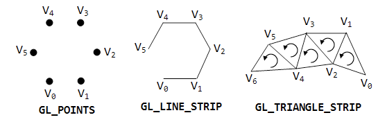
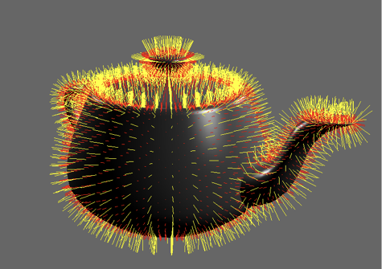
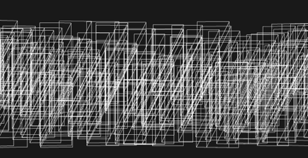
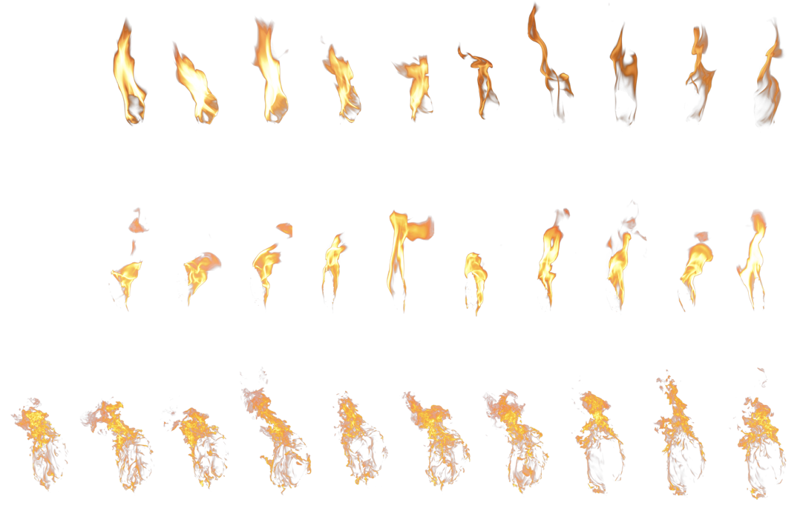
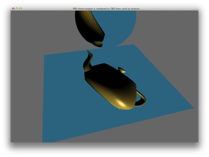
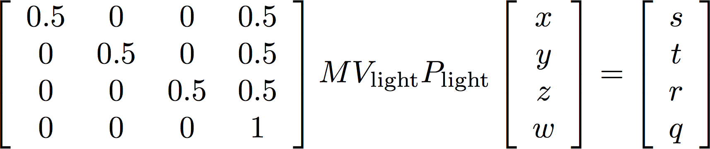
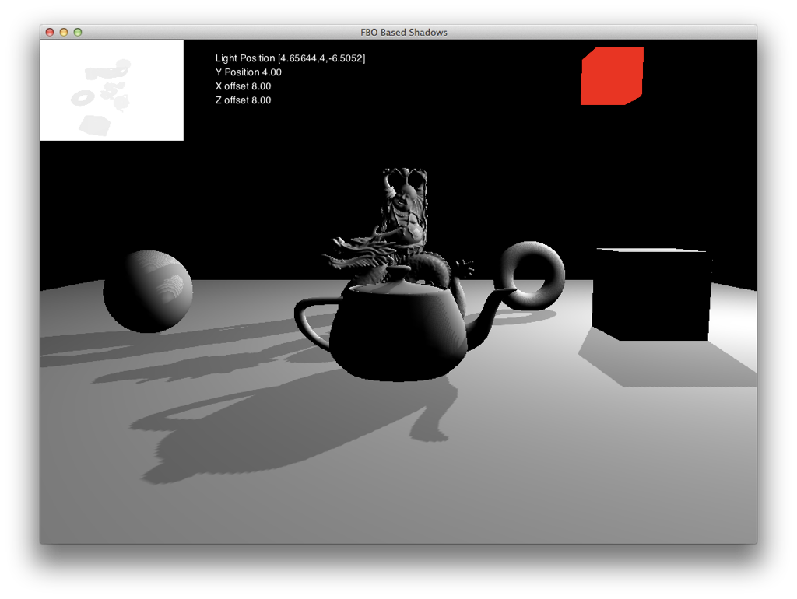
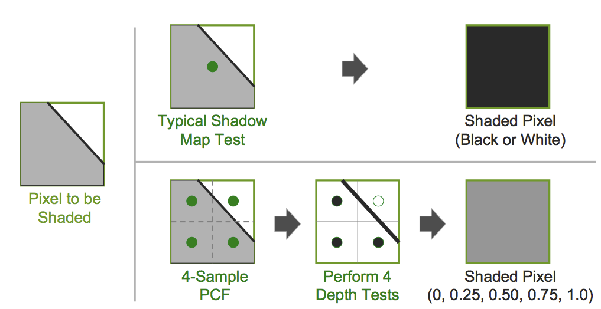
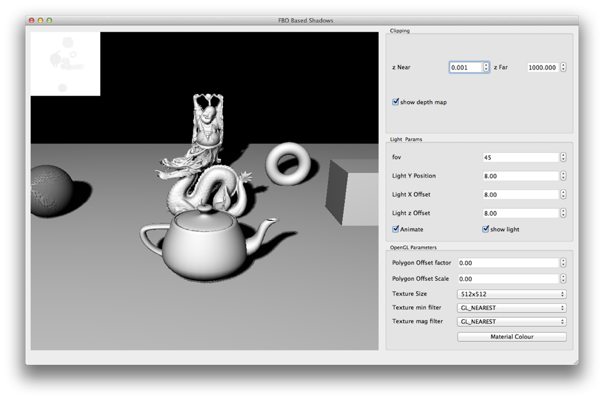

# Advanced OpenGL
Jon Macey

jmacey@bournemouth.ac.uk

---

## Geometry Shaders
- “The geometry processor is a programmable unit that operates on data for incoming vertices for a primitive assembled after vertex processing and outputs a sequence of vertices forming output primitives.”
- A single invocation of the geometry shader executable on the geometry processor will operate on a declared input primitive with a fixed number of vertices. 
- This single invocation can emit a variable number of vertices that are assembled into primitives of a declared output primitive type and passed to subsequent pipeline stages.

--

## Geometry shaders
- Unlike Vertex and Fragment shaders, Geo shaders have access to the whole primitive (triangle, line or point) at once 
- The geo shader can change the amount of data in the OpenGL pipeline
- This is in contrast with the vertex shader which works in a one in / one out form
- or the fragment shader which can only discard a fragment if it doesn’t want to process it.

--

## Basic pass through 

```
#version 150
layout (triangles) in; 
layout (triangle_strip) out; 
layout (max_vertices=3) out;

void main()
{
  for(int i=0; i<gl_in.length(); ++i) 
  {
    gl_Position=gl_in[i].glPosition;
    EmitVertex();
  }
  EndPrimitive();
}
```

--

## pass through
- This shader just sends the input to the output and doesn’t generate any new geometry
- The first elements of the shader are know as “layout qualifiers”
- These inform the shader what the input will be, the output format of the geometry and the max number of vertices that may be generated
- This have the following type

--

## in layout qualifiers

|Shader Input	 | Draw Modes |
|--------------|------------|
| ```points```|	```GL_POINTS``` |
| ```lines```	| ```GL_LINES```, ```GL_LINE_LOOP``` |
| | ```GL_LINE_STRIP``` |
| ```triangles```	 | ```GL_TRIANGLES```,```GL_TRIANGLE_FAN```, |
| | ```GL_TRIANGLE_STRIP``` |
| ```lines_adjacency```	| ```GL_LINES_ADJACENCY``` |
| ```triangles_adjacency```	| ```GL_TRIANGLES_ADJACENCY``` |

--

## output qualifiers

- The geometry shader can only output the following primitive types
  - points
  - line_strip
  - triangle_strip

--

## output qualifiers

- The max_vertices value is used to indicate the max size that may be output, this should be kept to a minimum as OpenGL may allocate buffer space for this and will reduce performance

--

## Geometry Shaders
- Geo shaders uses a the following structures to receive and emit vertices 

```
in gl_PerVertex 
{
  vec4 gl_Position;
  float gl_PointSize; 
  float gl_ClipDistance[];
} gl_in[];
in int gl_PrimitiveIDIn;

out gl_PerVertex 
{
  vec4  gl_Position;
  float gl_PointSize;
  float gl_ClipDistance[];
};
```

--

## Size of input array
| Input primitive	| Size of array |
|-----------------|---------------|
| ```points```	 | 1 |
| ```lines```	 | 2 |
| ```triangles```	| 3 |
| ```lines_adjacency```	| 4 |
| ```triangles_adjacency```	| 6 |

--

## ``` EmitVertex() ```
- ```EmitVertex()``` tells the geometry shader that all the information for the current vertex has been filled in
- Any other variables set at this stage will be passed to the fragment shader (for example colour)
- Other attributes active at this stage will also be passed onto the fragment shader
- ```EmitVertex()``` can be called as many times as you like as long as it doesn’t reach the max_vertices value 

--

## ```EmitPrimitive()```
- ```EmitPrimitive()``` indicates that we have finished emitting vertices.
- It is important that enough vertices have been created for the primitive type specified in the layout qualifier

---

## Visualising Normals

- The following geometry shader is used to draw both face and vertex normals
- The shader is split into 3 parts and loaded using ngl::ShaderLib

--

## Vertex Shader

```
#version 330 core
/// @brief the vertex passed in
layout (location =0) in vec3 inVert;
/// @brief the normal passed in
layout (location =2) in vec3 inNormal;
/// @brief the in uv
layout (location =1) in vec2 inUV;
uniform mat4 MVP;

uniform float normalSize;
uniform vec4 vertNormalColour;
uniform vec4 faceNormalColour;

out vec4 normal;

uniform bool drawFaceNormals;
uniform bool drawVertexNormals;

void main()
{
  gl_Position = MVP*vec4(inVert,1);
  normal=MVP*vec4(inNormal,0);
}
```

--

## Fragment Shader

```
#version 330 core

/// @brief our output fragment colour
layout (location =0 )out vec4 fragColour;
in vec4 perNormalColour;

void main ()
{
  fragColour = perNormalColour;
}
```

--

## Geometry Shader

```
#version 330 core
layout(triangles) in;
layout(line_strip, max_vertices = 8) out;

in vec4 normal[];

uniform  float normalSize;
uniform  vec4 vertNormalColour;
uniform  vec4 faceNormalColour;
uniform bool drawFaceNormals;
uniform bool drawVertexNormals;
out vec4 perNormalColour;

void main()
{
  if (drawVertexNormals == true)
  {

  for(int i = 0; i<gl_in.length(); ++i)
  {
    gl_Position = gl_in[i].gl_Position;
    perNormalColour=vec4(1,0,0,1);
    EmitVertex();
    gl_Position = gl_in[i].gl_Position+ normal[i] * abs(normalSize);
    perNormalColour=vec4(1,1,1,1);
    EmitVertex();
    EndPrimitive();
  }
 }
    if (drawFaceNormals == true)
    {
    perNormalColour=faceNormalColour;

    vec4 cent = (gl_in[0].gl_Position + gl_in[1].gl_Position + gl_in[2].gl_Position) / 3.0;
    vec3 face_normal = normalize(cross(gl_in[2].gl_Position.xyz - gl_in[0].gl_Position.xyz,
                                       gl_in[1].gl_Position.xyz - gl_in[0].gl_Position.xyz));

    gl_Position =  cent;
    EmitVertex();
    gl_Position =  (cent + vec4(face_normal * abs(normalSize), 0.0));
    EmitVertex();
    EndPrimitive();

    perNormalColour=vec4(0,1,0,1);
    }
}
```

--

## loading shader

- Adding a geometry shader is the same as any other ngl::shader we just set the type to ngl::GEOMETRY as shown

```
constexpr auto normalVertex="normalVertex";
constexpr auto normalFragment="normalFragment";
constexpr auto normalGeo="normalGeo";

shader->createShaderProgram(normalShader);

shader->attachShader(normalVertex,ngl::ShaderType::VERTEX);
shader->attachShader(normalFragment,ngl::ShaderType::FRAGMENT);
shader->loadShaderSource(normalVertex,"shaders/normalVertex.glsl");
shader->loadShaderSource(normalFragment,"shaders/normalFragment.glsl");

shader->compileShader(normalVertex);
shader->compileShader(normalFragment);
shader->attachShaderToProgram(normalShader,normalVertex);
shader->attachShaderToProgram(normalShader,normalFragment);

shader->attachShader(normalGeo,ngl::ShaderType::GEOMETRY);
shader->loadShaderSource(normalGeo,"shaders/normalGeo.glsl");
shader->compileShader(normalGeo);
shader->attachShaderToProgram(normalShader,normalGeo);
shader->linkProgramObject(normalShader);
shader->use(normalShader);
// now pass the modelView and projection values to the shader
shader->setUniform("normalSize",0.1f);
shader->setUniform("vertNormalColour",1.0f,1.0f,0.0f,1.0f);
shader->setUniform("faceNormalColour",1.0f,0.0f,0.0f,1.0f);

shader->setShaderParam1i("drawFaceNormals",true);
shader->setShaderParam1i("drawVertexNormals",true);
```

---

## Billboarding

- Billboarding is the process of creating a quad that always faces the camera
- A texture is then applied to this quad to give the impression of a solid object
- Various techniques can then be applied to produce different effects

--

## Animated Fire Demo
- This demo will use several sprite sheets of textures for each frame of animation
- The position of the billboard is passed in as a point in space
- A geometry shader will be used to generate the correct billboard and texture co-ordinates
- The texture co-ordinates are updated based on a time parameter passed to the shader

--

## Animated Fire Demo


--

## Data Structure

```
typedef struct data
{
  ngl::Vec4 p;
  float offset;
};
```
- The data structure above is used to pass in the information about the billboard
- p.x/y/z is the position of the centre of the billboard
- p.w is used to indicate which of the 3 textures to use when drawing
- offset is used to indicate the frame offset for the texture

--

## Generate Data Points

```
// create a voa of points to draw
m_vao.reset( ngl::VAOFactory::createVAO(ngl::simpleVAO,GL_POINTS));
m_vao->bind();

ngl::Random *rng=ngl::Random::instance();

data p;
std::vector <data> points;
rng->setSeed();

for(int i=0; i<20000; ++i)
{
  float radius=8+rng->randomPositiveNumber(1);
  float x=radius*cosf( ngl::radians(i));
  float z=radius*sinf( ngl::radians(i));

  p.p.m_x=x;
  p.p.m_y=-rng->randomPositiveNumber(1);
  p.p.m_z=z;

  p.p.m_w=static_cast<int>(rng->randomPositiveNumber(3));
  // time offset we have 10 frames for each texture
  p.offset=static_cast<int>(rng->randomPositiveNumber(10));
  points.push_back(p);
}
std::sort(points.begin(),points.end(),NGLScene::depthSort);
m_vao->setData(ngl::AbstractVAO::VertexData(points.size()*sizeof(data),points[0].p.m_x));

m_vao->setVertexAttributePointer(0,4,GL_FLOAT,sizeof(data),0);
m_vao->setVertexAttributePointer(1,1,GL_FLOAT,sizeof(data),4);

m_vao->setNumIndices(points.size());
m_vao->unbind();

```

--

## Loading Textures
- In this case we are going to use multi-texturing to allow more than one texture to be accessed at a time.
- This is done using the glActiveTexture function passing in the texture we wish to be active when binding the data
- NGL::Texture has the same features as shown in the following code
- Note that we also need to associate the samplers with the correct texture ID

--

## Loading Textures

```
ngl::Texture t;

t.loadImage("textures/map1.png");
t.setMultiTexture(0);
m_maps[0]=t.setTextureGL();
glGenerateMipmap(GL_TEXTURE_2D);

t.loadImage("textures/map2.png");
t.setMultiTexture(1);
m_maps[1]=t.setTextureGL();
glGenerateMipmap(GL_TEXTURE_2D);

t.loadImage("textures/map3.png");
t.setMultiTexture(2);
m_maps[2]=t.setTextureGL();
glGenerateMipmap(GL_TEXTURE_2D);

shader->setUniform("tex1",0);
shader->setUniform("tex2",1);
shader->setUniform("tex3",2);

```

--

## Texture Index 

- The value of a sampler uniform in a program is not a texture object, but a texture image unit index. 
- So you set the texture unit index for each sampler in a program. 
- Then you bind the textures and sampler objects you wish to use to those texture units. 
- To set the value of a sampler, use glUniform1i  or glUniform1iv  for an array of samplers.

--

## Vertex Shader
- as both whichTexture and frameOffset are used as flags we don’t want interpolated values, the “flat” keyword stops this.

```
#version 330 core

layout (location = 0) in vec4 inVert;
layout (location =1) in float timeOffset;
flat out float whichTexture;
flat out float frameOffset;
void main()
{
  frameOffset=timeOffset;
  whichTexture=inVert.w;
  gl_Position = vec4(inVert.xyz, 1.0);
}
```

--

## Geometry Shader

```
#version 330 core

layout(points) in;
layout(triangle_strip) out;
layout(max_vertices = 4) out;
uniform mat4 VP;
uniform vec3 camerapos;
uniform int time;

out vec2 vertUV;
flat out float texID;
flat in float whichTexture[];
flat in float frameOffset[];
void main()
{
  float bbWidth=0.5;
  float bbHeight=1.0;
  float ctime=time+frameOffset[0];
  texID=whichTexture[0];
  float spriteOffset=0.1;
  vec3 pos = gl_in[0].gl_Position.xyz;
  vec3 toCamera = normalize(camerapos - pos);
  vec3 up = vec3(0.0, 1.0, 0.0);
  vec3 right = cross(toCamera, up);
  right*=bbWidth;
  up *= bbHeight;
  pos -= (right * 0.5);
  pos.z=gl_in[0].gl_Position.z;
  gl_Position = VP * vec4(pos, 1.0);
  vertUV = vec2(ctime*spriteOffset, 0.0);
  EmitVertex();

  pos.y += 1.0;
  gl_Position = VP * vec4(pos, 1.0);
  vertUV = vec2(ctime*spriteOffset, 1.0);
  EmitVertex();

  pos.y -= 1.0;
  pos += right;
  gl_Position = VP * vec4(pos, 1.0);
  vertUV = vec2((ctime+1)*spriteOffset, 0.0);
  EmitVertex();

  pos.y += 1.0;
  gl_Position = VP * vec4(pos, 1.0);
  vertUV = vec2((ctime+1)*spriteOffset, 1.0);
  EmitVertex();

  EndPrimitive();
}
```

--

## Fragment Shader

```
#version 330 core
/// @brief our output fragment colour
layout (location =0) out vec4 fragColour;

// this is a pointer to the current 2D texture object
uniform sampler2D tex1;
uniform sampler2D tex2;
uniform sampler2D tex3;
// the vertex UV
in vec2 vertUV;
flat in float texID;

void main ()
{
  // set the fragment colour to the current texture
  if(texID==0)
  {
    fragColour = texture(tex1,vertUV);
  }
  else if(texID==1)
  {
    fragColour = texture(tex2,vertUV);
  }
  else
  {
    fragColour = texture(tex3,vertUV);
  }

  if (fragColour.r == 0 && fragColour.g == 0 && fragColour.b == 0)
  {
   discard;
  }
}
```

---

## Frame Buffer Objects
- FBO’s are an extension to OpenGL that defines an interface for drawing to rendering destinations other than the buffer provided by the windows system
- Usually when we draw, it gets passed to the currently active OpenGL context (logical framebuffer).
- This will have a colour buffer, a depth buffer or a stencil buffer and in gl terms are know as the logical buffers.

--

## Frame Buffer Objects
- When creating an FBO we can re-direct the usual OpenGL rendering to a new buffer
- This buffer can be thought of as a simple texture object which other shaders can access
- But can be either the colour, depth or stencil buffers

--

## FBO Creation
- A FBO is created in a similar way to other OpenGL buffers

```
void glGenFramebuffersEXT(GLsizei n, GLuint* ids);
void glDeleteFramebuffersEXT(GLsizei n, const GLuint* ids);
```

- In this function n is the number of buffers we wish to create
- ids is the area we wish to store the buffer objects

--

## [Binding Framebuffers](https://www.opengl.org/sdk/docs/man/html/glBindFramebuffer.xhtml)

```
void glBindFramebuffer(GLenum target,GLuint framebuffer);
```

- target can be 

```
GL_FRAMEBUFFER
GL_READ_FRAMEBUFFER
GL_DRAW_FRAMEBUFFER
```
- framebuffer is the id of the FBO create with the gen function

--

## FBO targets
- ```GL_READ_FRAMEBUFFER```, or ```GL_DRAW_FRAMEBUFFER``` can be set to use either ```glReadPixels```, ```glCopyPixels``` for access to the FBO
- ```GL_FRAMEBUFFER``` sets both of the above
- Once a FBO is created we can attach what the gl spec refers to as an “image” to the FBO
- An image is defined as “a single 2D array of pixels” 

--

## FBO “images”
- The default framebuffer has buffers such as
```
GL_FRONT 
GL_BACK
GL_AUXi
GL_ACCUM
```
- In contrast a FBO has “attachment points” these are locations in the FBO where an image is attached
- These are shown next

--

##  GL_COLOR_ATTACHMENTi
- Each implementation has GL_MAX_COLOR_ATTACHMENTS number of colour attachments
- These are used to render colour data to the FBO and are usually used to render colour data to the FBO
- They can also be used to store multiple colour values in one FBO (such as cube maps)

--

## GL_DEPTH_ATTACHMENT
- These are used to store depth values
- Usually this can be used to store the z depth for shadow mapping and other effects
- ```GL_STENCIL_ATTACHMENT``` is used to store stencil values
- ```GL_DEPTH_STENCIL_ATTACHMENT``` is used for combining both values

--

## Attaching images
- The process of attaching an image is to create a texture object of the correct size
- This is then attached to the FBO for the correct target.
- The following code creates a texture object

--

## Create a Texture Objects

```
const static int TEXTURE_WIDTH=1024;
const static int TEXTURE_HEIGHT=1024;

void NGLScene::createTextureObject()
{
  // create a texture object
  glGenTextures(1, &m_textureID);
  // bind it to make it active
  glActiveTexture(GL_TEXTURE0);
  glBindTexture(GL_TEXTURE_2D, m_textureID);
  // set params
  glTexParameterf(GL_TEXTURE_2D, GL_TEXTURE_MAG_FILTER, GL_LINEAR);
  glTexParameterf(GL_TEXTURE_2D, GL_TEXTURE_MIN_FILTER, GL_LINEAR);
  //glGenerateMipmapEXT(GL_TEXTURE_2D);  // set the data size but just set the buffer to 0 as we will fill it with the FBO
  glTexImage2D(GL_TEXTURE_2D, 0, GL_RGBA8, TEXTURE_WIDTH, TEXTURE_HEIGHT, 0, GL_RGBA, GL_UNSIGNED_BYTE, 0);
  // now turn the texture off for now
  glBindTexture(GL_TEXTURE_2D, 0);
}

```

--

## FBO Creation
- The following code will create our FBO
- It will then create a depth buffer and a colour buffer
- The depth buffer is attached along with the render buffer

--

##  FBO Creation

```
void NGLScene::createFramebufferObject()
{
  // create a framebuffer object this is deleted in the dtor
  glGenFramebuffers(1, &m_fboID);
  glBindFramebuffer(GL_FRAMEBUFFER, m_fboID);
  GLuint rboID;
  // create a renderbuffer object to store depth info
  glGenRenderbuffers(1, &rboID);
  glBindRenderbuffer(GL_RENDERBUFFER, rboID);

  glRenderbufferStorage(GL_RENDERBUFFER, GL_DEPTH_COMPONENT, TEXTURE_WIDTH, TEXTURE_HEIGHT);
  // bind
  glBindRenderbuffer(GL_RENDERBUFFER, 0);

  // attatch the texture we created earlier to the FBO
  glFramebufferTexture2D(GL_FRAMEBUFFER, GL_COLOR_ATTACHMENT0, GL_TEXTURE_2D, m_textureID, 0);

  // now attach a renderbuffer to depth attachment point
  glFramebufferRenderbuffer(GL_FRAMEBUFFER, GL_DEPTH_ATTACHMENT, GL_RENDERBUFFER, rboID);
  // now got back to the default render context
  glBindFramebuffer(GL_FRAMEBUFFER, 0);
  // were finished as we have an attached RB so delete it
  glDeleteRenderbuffers(1,&rboID);
}
```

--

## [SimpleFBO](https://github.com/NCCA/FBODemos/tree/master/SimpleFBO)


- In this example the scene of a teapot is rendered using a phong shader
- Next the scene of the sphere and the plane is rendered using a texture shader
- The FBO is read as the texture in this shader and used to texture the scene.
- This could for example be used in a game for a simple HUD

--

## Renderpasses

```
void NGLScene::paintGL()
{
  //----------------------------------------------------------------------------------------------------------------------
  // draw to our FBO first
  //----------------------------------------------------------------------------------------------------------------------
  // grab an instance of the shader manager
  ngl::ShaderLib *shader=ngl::ShaderLib::instance();
  (*shader)["Phong"]->use();

  // Rotation based on the mouse position for our global transform
  ngl::Mat4 rotX;
  ngl::Mat4 rotY;
  // create the rotation matrices
  rotX.rotateX(m_win.spinXFace);
  rotY.rotateY(m_win.spinYFace);
  // multiply the rotations
  m_mouseGlobalTX=rotY*rotX;
  // add the translations
  m_mouseGlobalTX.m_m[3][0] = m_modelPos.m_x;
  m_mouseGlobalTX.m_m[3][1] = m_modelPos.m_y;
  m_mouseGlobalTX.m_m[3][2] = m_modelPos.m_z;


  static float rot=0.0;
   // get the VBO instance and draw the built in teapot
  ngl::VAOPrimitives *prim=ngl::VAOPrimitives::instance();
  // we are now going to draw to our FBO
  // set the rendering destination to FBO
  glBindFramebuffer(GL_FRAMEBUFFER, m_fboID);
  // set the background colour (using blue to show it up)
  glClearColor(0,0.4f,0.5f,1);
  glClear(GL_COLOR_BUFFER_BIT | GL_DEPTH_BUFFER_BIT);
  // set our viewport to the size of the texture
  // if we want a different camera we wouldset this here
  glViewport(0, 0, TEXTURE_WIDTH, TEXTURE_HEIGHT);
  // rotate the teapot
  m_transform.reset();

  m_transform.setRotation(rot,rot,rot);
  loadMatricesToShader();
  prim->draw("teapot");
  rot+=0.5;

  //----------------------------------------------------------------------------------------------------------------------
  // now we are going to draw to the normal GL buffer and use the texture created
  // in the previous render to draw to our objects
  //----------------------------------------------------------------------------------------------------------------------
  // first bind the normal render buffer
  glBindFramebuffer(GL_FRAMEBUFFER, defaultFramebufferObject());
  // now enable the texture we just rendered to
  glBindTexture(GL_TEXTURE_2D, m_textureID);
  // do any mipmap generation
  glGenerateMipmap(GL_TEXTURE_2D);
  // set the screen for a different clear colour
  glClearColor(0.4f, 0.4f, 0.4f, 1.0f);			   // Grey Background
  // clear this screen
  glClear(GL_COLOR_BUFFER_BIT | GL_DEPTH_BUFFER_BIT);
  // get the new shader and set the new viewport size
  shader->use("TextureShader");
  // this takes into account retina displays etc
  glViewport(0, 0, width() * devicePixelRatio(), height() * devicePixelRatio());
  ngl::Mat4 MVP;
  m_transform.reset();
  MVP= m_mouseGlobalTX*m_cam.getVPMatrix();
  shader->setShaderParamFromMat4("MVP",MVP);
  prim->draw("plane");

  m_transform.setPosition(0,1,0);
  MVP= m_transform.getMatrix()*m_mouseGlobalTX*m_cam.getVPMatrix();
  shader->setShaderParamFromMat4("MVP",MVP);
  prim->draw("sphere");
  //----------------------------------------------------------------------------------------------------------------------
 }
```

---

## Shadows
- There are a number of methods available to create shadows in OpenGL and a huge amount of literature on how this may be achieved for different effects
- The following example is going to use depth mapped shadows to create our shadow map
- It is a two pass process :
  1. render from the light POV to an FBO
  2. Use the FBO depth texture to shadow map

--

## Projective Texture
- When rendering the 2nd pass the application must create a matrix that transforms incoming vertex positions into projective texture coordinates for each light source.
- The matrix is formed as follows



--

## Projective Texture

- The modelling matrix (M) that transforms modelling coordinates into world coordinates 
- A view matrix (Vlight) that rotates and translates world coordinates into a coordinate system that has the light source at the origin and is looking at the point (0, 0, 0) in world coordinates 
- A projection matrix (Plight) that defines the frustum for the view from the light source (field of view, aspect ratio, near and far clipping planes) 

--

## Projective Texture

- A scale and bias matrix that takes the clip space coordinates (i.e., values in the range [–1,1]) from the previous step into values in the range [0,1] so that they can be used directly as the index for accessing the shadow map. 

--

## [textureProj](https://www.opengl.org/sdk/docs/man4/html/textureProj.xhtml)
- Modern versions of glsl (>=130) have a built in sampler / lookup function called textureProj
- This does some of the elements of the previous matrix for us so it makes it easier to do the shadow mapping
- In the following example we use the sampler2DShadow along with the textureProj to create a simple shadowed scene

--

## A quick C++ diversion
- In the example that follows I decided to create a generic scene function that allows the user to pass in a class method as a function
- This allows the drawScene function to contain all the drawing elements but a different loadMatricesToShader to be called each time
- We can use [```std::function```](http://en.cppreference.com/w/cpp/utility/functional/function)

--

## pointer to member function
- The first thing to do is to create a pointer to a member function.
- In this case it will have the signature for the method

```
void drawScene(std::function<void()> _shaderFunc);
```

--

## calling function

- calling the function is quite simple we just use [```std::bind```](http://en.cppreference.com/w/cpp/utility/functional/bind)
- This is shown below

```
drawScene(std::bind(&NGLScene::loadMatricesToShadowShader,this));
```

--

## Simple Shadows
- This demo creates a simple light model by using an ngl::Vec4 to store the light position
- Two cameras are created, one for the scene and one to be placed at the POV of the light pointing to the origin
- The first pass will render to the FBO a depth texture pass which is then used in the shadow shader to create the shadows

--

## [Simple Shadows](https://github.com/NCCA/FBODemos/tree/master/Shadows)



--

## [Percentage closer filtering](https://github.com/NCCA/FBODemos/tree/master/PCFShadows)


--

## [Percentage closer filtering](https://github.com/NCCA/FBODemos/tree/master/PCFShadows)


---

## References

- Rost, R, Licea-Kane B (2009). OpenGL Shading Language. 3rd. ed. New York: Addison Wesley.
- OpenGL Architecture Review Board, OpenGL Reference Manual, Fourth Edition: The Official Reference to OpenGL, Version 1.4, Editor: Dave Shreiner, Addison-Wesley, Reading, Massachusetts, 2004.
- Segal, Mark, and Kurt Akeley, The OpenGL Graphics System: A Specification (Version 3.1), Editor (v1.1): Chris Frazier, (v1.2–3.1): Jon Leech, (v2.0): Jon Leech and Pat Brown, March 2008. - - www.opengl.org/documentation/spec.html

--

## References
- http://oss.sgi.com/projects/ogl-sample/registry/EXT/framebuffer_object.txt
- http://www.songho.ca/opengl/gl_fbo.html
- http://www.opengl.org/wiki/Renderbuffer_Object
- http://www.parashift.com/c++-faq-lite/pointers-to-members.html
- Percentage closer soft shadows Randy Fernando Nvidia 
- http://www.opengl.org/wiki/Sampler_(GLSL)

--

## References

- http://www.opengl.org/registry/specs/EXT/transform_feedback.txt
- http://www.opengl.org/registry/specs/ARB/transform_feedback2.txt
- http://www.opengl.org/wiki/GLAPI/glBeginTransformFeedback