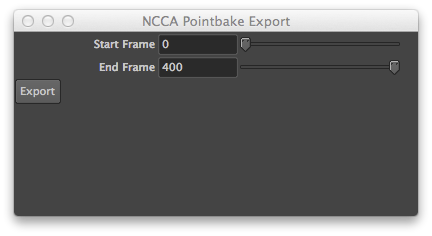
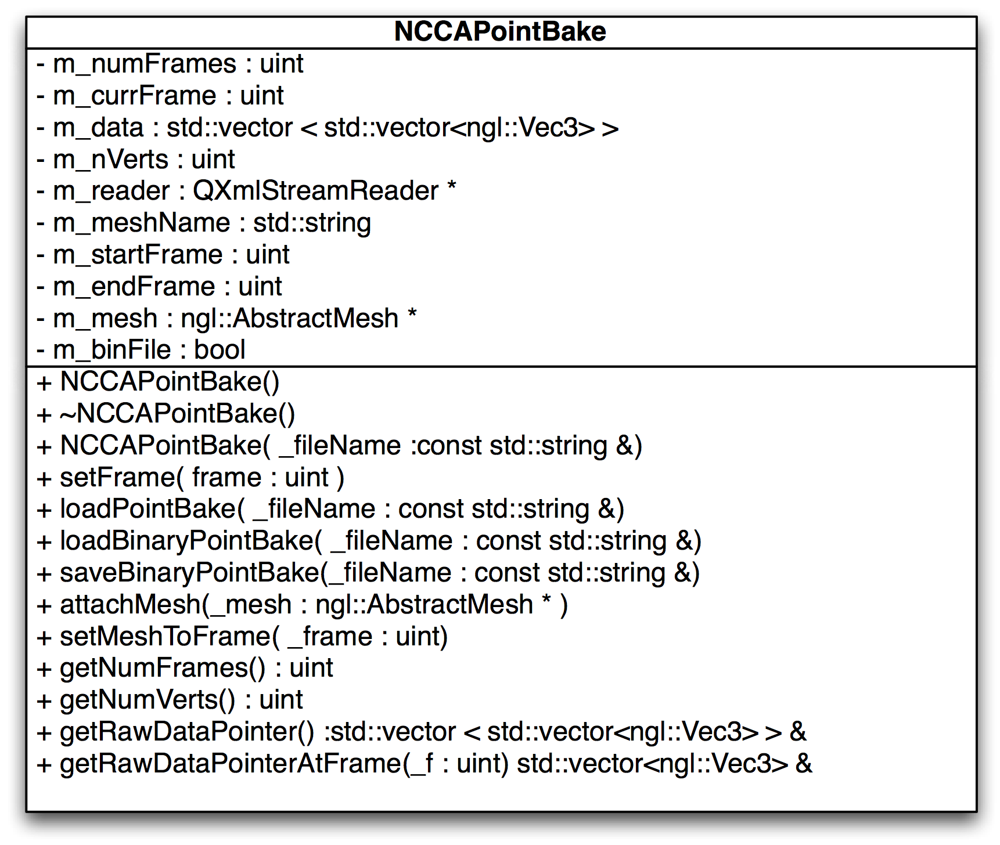
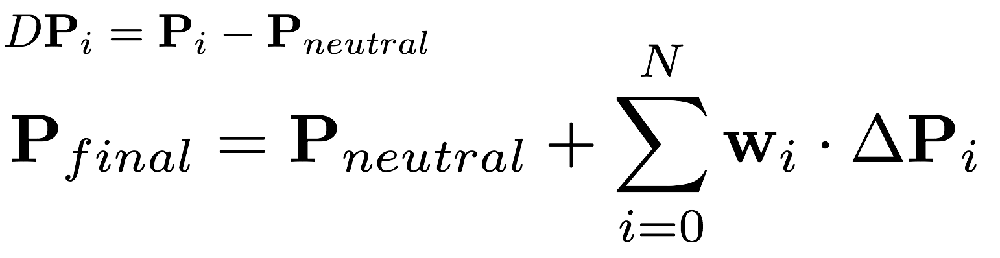
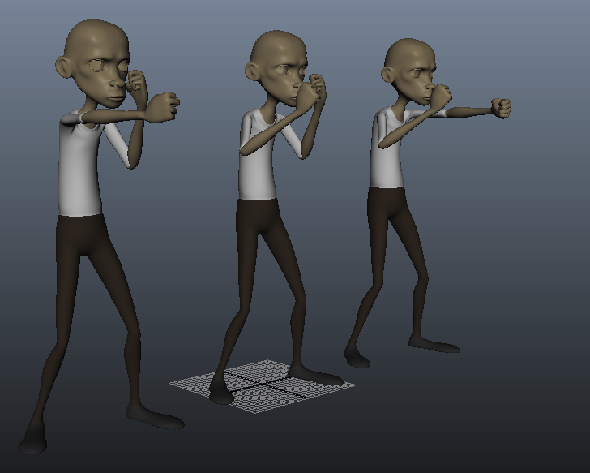
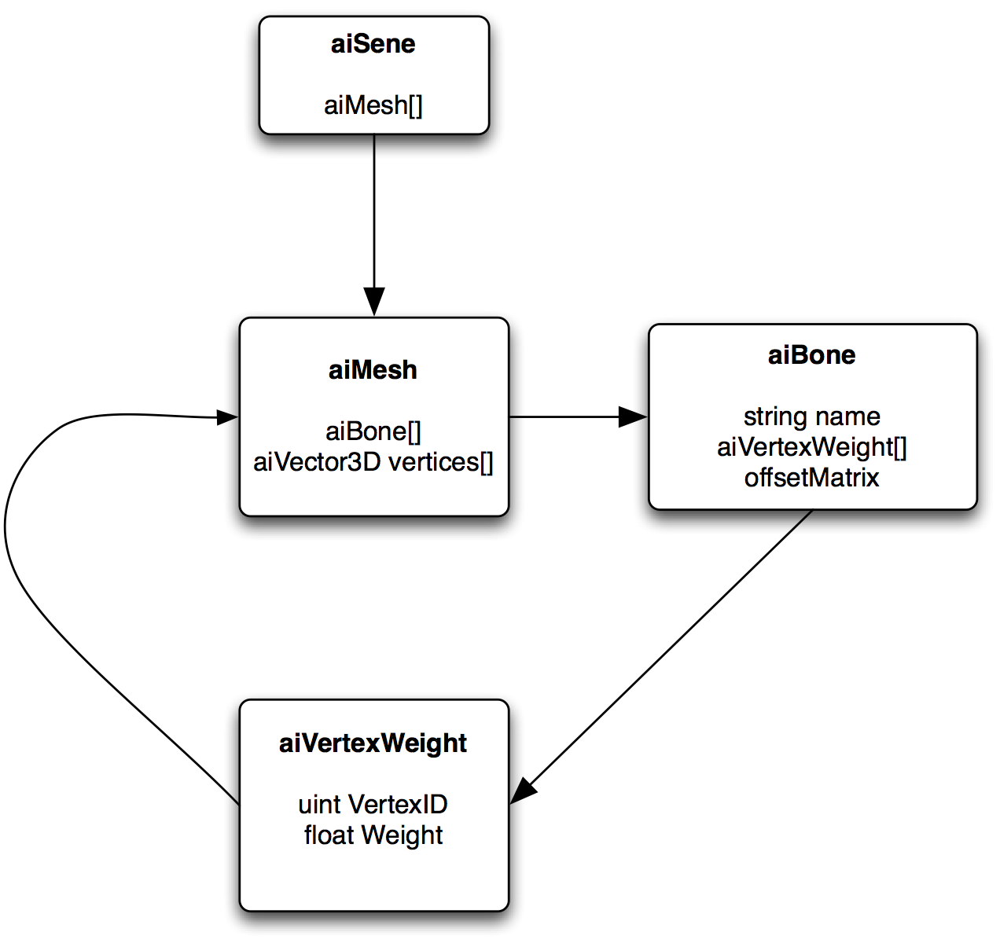
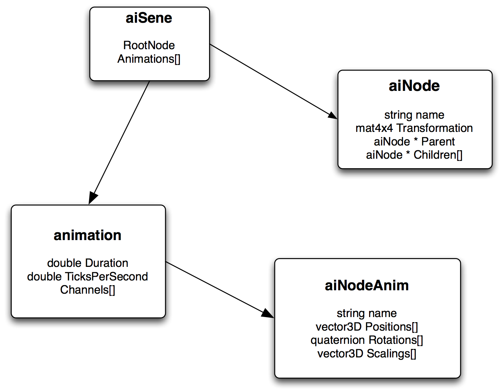

# Approaches to Animation in C++ and OpenGL
Jon Macey

jmacey@bournemouth.ac.uk

---

## Animation interchange
- There are many ways to export animation between different packages
  - FBX, Collada, Alembic 
- Some of there are more successful than others, and sometimes there are still problems with the formats once changed.
- Sometime all we need is point information for each vertex per frame as this is being used to drive other simulations etc.

--

## Point bake Overview
- Export mesh as an obj as this has initial mesh positions, face information etc etc
- For each frame output the offset of point positions to a file format
- Per frame set this “offset” to the current vertex position

--

## File Formats
- There are a number of different ways to save this data
- It could be save using a binary format
- Or using text and our own system to parse it. 
- In the end it was decided to use xml as there are a number of xml parsers available for both python (xml.sax) and Qt (QXmlStreamReader)
- There is also a work in progress json format

--

## [XML](http://www.w3schools.com/xml/)
- Extensible Markup Language (XML) is a set of rules for encoding documents in machine-readable form.
- Whilst XML was initially designed for document, it has become quite common to use XML to store arbitrary data structures.
 - XML Does Not DO Anything
 - With XML You Invent Your Own Tags

--

 ## XML Tree
 - XML forms a tree structure using <> tags to enclose the different elements

 ```
<?xml version="1.0" encoding="UTF-8"?>
<NCCAModelViewer>
  <keyLight>
    <position>-2 1 1 </position>
    <active>1</active>
    <colourSlider>153</colourSlider>
    <colour>153 153 153</colour>
    <specSlider>153</specSlider>
    <specColour>76 76 76</specColour>
  </keyLight>
</NCCAModelViewer>
```

--

## Escaping
- XML provides escape facilities for including characters which are problematic to include directly.
```
&lt; represents <
&gt; represents >
&amp; represents &
&apos; represents '
&quot; represents "
```

--

## Designing data formats
- Writing XML files is largely up to the developer 
- We specify the format we need and which data tags are required
- These can then be written to the file using normal file writing processes

--

## Point Bake Format

```
<?xml version="1.0" encoding="UTF-8" ?>
<NCCAPointBake>
  <MeshName> polySurface1 </MeshName>
  <NumVerts> 912 </NumVerts>
  <StartFrame> 0 </StartFrame>
  <EndFrame> 151 </EndFrame>
  <NumFrames> 151 </NumFrames>
  <TranslateMode> absolute </TranslateMode>
  <Frame number="0">
  </Frame>
</NCCAPointBake>
```

--

## Per Vertex Data

```
<Vertex number="0" attrib="translate"> -0.103412 15.294069 3.914999 </Vertex>
<Vertex number="1" attrib="translate"> -0.114753 15.167216 3.920175 </Vertex>
<Vertex number="2" attrib="translate"> -0.073407 15.167994 3.865294 </Vertex>
<Vertex number="3" attrib="translate"> -0.075351 15.262026 3.872085 </Vertex>
```
- The per vertex values are written out as shown above
- The attribute is used to indicate what the data is
- Then the actual point data is written

--

## Maya Exporter

- The maya exported will export the data on a per frame basis based on the currently selected mesh.
- As NGL only supports triangulated meshes you will need to triangulate the mesh first

--

## [MayaPointBakeExport.py](https://github.com/NCCA/PointBake/blob/master/ImportExportScripts/NCCAPointBakeMayaExport.py)

```
import maya.OpenMaya as OM
import maya.OpenMayaAnim as OMA
import maya.OpenMayaMPx as OMX
import maya.cmds as cmds
import sys, math


########################################################################################################################
##  @brief simple function to write data out with tabs for a well formatted xml file
##	@param[in] _file the file pointer to write data too
##  @param[in] _nTabs number of tabs to write before the data
##  @param[in] _data the actual data to write out to the file
########################################################################################################################

def WriteData(_file,_nTabs,_data) :
	for i in range(0,_nTabs) :
		_file.write("\t")
	_file.write(_data)
	_file.write("\n")


########################################################################################################################
##  @brief function to extract and write out the xml data to a file, we don't use any XML
##  lib so there is no real check for correct formatting of the data, be carful!
##	@param[in] _fileName the file name to open
##  @param[in] _name name of the mesh selected
##  @param[in] _startFrame  the start frame for the export
##  @param[in] _endFrame  the end frame for the export
########################################################################################################################

def NCCAPointBake(_fileName,_name,_startFrame,_endFrame) :

	# grab the selected object
	selected = OM.MSelectionList()
	obj=OM.MObject( )
	selected.add(_name)
	selected.getDependNode(0,obj)
	# get the parent transform
	fn = OM.MFnTransform(obj)
	Mesh=""
	oChild = fn.child(0)
	# check to see if what we have is a mesh
	if(oChild.apiTypeStr()=="kMesh") :
		print "got Mesh"
		# get our mesh
		Mesh=OM.MFnMesh(oChild)
	else :
		print "Didn't get mesh ", oChild.apiType()
		return

	# now we try and open the file for writing
	try :
		file=open(str(_fileName[0]),'w')
	# if this fails catch the error and exit
	except IOError :
		print "Error opening file",str(_fileName)
		return

	# set the frame to start
	print "PB get anim control"
	currFrame=OM.MTime()
	anim=OMA.MAnimControl()
	# as these can take time to process we have an interupter to allow for the process to be
	# stopped
	interupter=OM.MComputation()
	# set the start of the heavy computation
	interupter.beginComputation()
	# now we set the tab level to 0 for the initial write to the file
	tabIndent=0

	# now we get the mesh number of points
	numPoints = cmds.polyEvaluate( _name, v=True)
	# write the xml headers
	file.write("<?xml version=\"1.0\" encoding=\"UTF-8\" ?>\n")
	file.write("<NCCAPointBake>\n")
	# up the tab level
	tabIndent=tabIndent+1
	# write the initial header data
	WriteData(file,tabIndent,"<MeshName> %s </MeshName>" %(_name))
	WriteData(file,tabIndent,"<NumVerts> %d </NumVerts>" %(numPoints))
	WriteData(file,tabIndent,"<StartFrame> %s </StartFrame>" %(_startFrame))
	WriteData(file,tabIndent,"<EndFrame> %s </EndFrame>" %(_endFrame))
	WriteData(file,tabIndent,"<NumFrames> %s </NumFrames>" %(_endFrame-_startFrame))
	WriteData(file,tabIndent,"<TranslateMode> %s </TranslateMode>" %("absolute"))

	# now for every frame write out the vertex data
	for frame in range(_startFrame,_endFrame) :
		print "Doing frame %04d" %(frame)
		# move to the correct frame
		currFrame.setValue (frame)
		anim.setCurrentTime(currFrame)
		# write out the frame tag
		WriteData(file,tabIndent,"<Frame number=\"%d\">" %(frame))
		tabIndent=tabIndent+1
		for vertex in range(0,numPoints) :
			# now the actual vertex data for the current mesh index value
			data = cmds.xform( (_name+ ".vtx["+str(vertex)+"]"), q=True, ws=True, t=True )
			WriteData(file,tabIndent,"<Vertex number=\"%d\" attrib=\"translate\"> %f %f %f </Vertex>" %(vertex,data[0],data[1],data[2]))
		# now un-indent as we have ended the frame
		tabIndent=tabIndent-1
		WriteData(file,tabIndent,"</Frame>")
		# if we have interupted exit and finish
		if interupter.isInterruptRequested()  :
			file.write("</NCCAPointBake>\n")
			file.close()
			print "File export interrupted ";
			return
	# now finish
	file.write("</NCCAPointBake>\n")
	# and close the file
	file.close()

########################################################################################################################
##  @brief actual function call used to do the import
########################################################################################################################

class PointBakeExport() :
	########################################################################################################################
	# @brief ctor
	########################################################################################################################

	def __init__(self) :
		# get the currently selected objects and make sure we have only one object
		selected = OM.MSelectionList()
		OM.MGlobal.getActiveSelectionList(selected)
		self.selectedObjects = []
		selected.getSelectionStrings(self.selectedObjects)
		if len(self.selectedObjects) == 0 :
			cmds.confirmDialog( title='No objects Selected', message='Select a Mesh Object', button=['Ok'], defaultButton='Ok', cancelButton='Ok', dismissString='Ok' )
		elif len(self.selectedObjects) > 1 :
			cmds.confirmDialog( title='Select One Object', message='Only One Mesh may be exported at a time', button=['Ok'], defaultButton='Ok', cancelButton='Ok', dismissString='Ok' )
		# now we have the correct criteria we can proceed with the export
		else :
			# get the start and end values for our UI sliders
			anim=OMA.MAnimControl()
			minTime=anim.minTime()
			maxTime=anim.maxTime()
			self.m_start=int(minTime.value())
			self.m_end=int(maxTime.value())
			# now we create a window ready to populate the components
			self.m_window = cmds.window( title='NCCA Pointbake Export' )
			# create a layout
			cmds.columnLayout()
			# create two sliders for start and end we also attach methods to be called when the slider
			# changes
			self.m_startSlider=cmds.intSliderGrp( changeCommand=self.startChanged,field=True, label='Start Frame', minValue=self.m_start, maxValue=self.m_end, fieldMinValue=self.m_start, fieldMaxValue=self.m_end, value=self.m_start )
			self.m_endSlider=cmds.intSliderGrp( changeCommand=self.endChanged ,field=True, label='End Frame', minValue=self.m_start, maxValue=self.m_end, fieldMinValue=self.m_end, fieldMaxValue=self.m_end, value=self.m_end )
			# create a button and add the method called when pressed
			cmds.button( label='Export', command=self.export )
			# finally show the window
			cmds.showWindow( self.m_window )

	########################################################################################################################
	# @brief export method attached ot the button, this will be executed once every time
	# the button is pressed
	# @param *args the arguments passed from the button
	########################################################################################################################

	def export(self,*args) :
		# get the file name to save too
		basicFilter = "*.xml"
		file=cmds.fileDialog2(caption="Please select file to save",fileFilter=basicFilter, dialogStyle=2)
		# check we get a filename and then save
		if file !="" :
			if self.m_start >= self.m_end :
				cmds.confirmDialog( title='Range Error', message='start >= end', button=['Ok'], defaultButton='Ok', cancelButton='Ok', dismissString='Ok' )
			else :
				NCCAPointBake(file,self.selectedObjects[0],self.m_start,self.m_end)
				# finally remove the export window
				cmds.deleteUI( self.m_window, window=True )

	########################################################################################################################
	# @brief this is called every time the slider is changed (i.e. a new value)
	# @param *args the arguments passed from the button [0] is the numeric value
	########################################################################################################################

	def startChanged(self, *args) :
		self.m_start=args[0]

	########################################################################################################################
	# @brief this is called every time the slider is changed (i.e. a new value)
	# @param *args the arguments passed from the button [0] is the numeric value
	########################################################################################################################

	def endChanged(self, *args) :
		self.m_end=args[0]
```

--

## Attaching Commands
- When creating a UI in Maya Python we must attach the commands executed to the buttons / sliders
- The commands are passed a structure *args which can be queried to get the command data
- This is shown in the following code

--

## Data Export
- First we check to see if we have a mesh to export the data from
- Next we grab an instance of the MAnimControl which gives us access to the frame bar. 
- We then change for each frame and iterate through the mesh vertices and export them to the xml file

--

## [MComputation](http://download.autodesk.com/us/maya/2011help/api/class_m_computation.html)
- The MComputation class allows use to interrupt processing within a maya script.
- It gives us access to the ESC key quite from processing
- The basic process is we create a MComputation object before the loop
- Then at some stage in the loop we check for interruption

---

## NCCPointBake


--


## Data Storage
- We need to store the per vertex / per frame data for the mesh.
- To do this we use 

```
std::vector < std::vector<Vec3> > m_data;
```
- This is effectively a dynamic 2D array of data
- As we have already loaded in the size of verts and number of frames we can re-size this for speed

--

## Reading the File
- Whilst Qt provides some really good XML parsing tools, to reduce coupling with Qt NGL uses [rapid xml](http://rapidxml.sourceforge.net/manual.html)
- The document is loaded as an array of chars and processed as follows


```
bool NCCAPointBake::loadPointBake(const std::string &_fileName) noexcept
{
	m_numFrames=0;
	m_currFrame=0;
	m_nVerts=0;
	m_startFrame=0;
	m_endFrame=0;
	m_mesh=0;
	m_binFile=false;
	rapidxml::xml_node<> * rootNode;
	// Read the xml file into a vector
	std::ifstream xmlFile (_fileName.c_str() );
	if(!xmlFile.is_open())
	{
		std::cerr<<"Could not open file\n";
		return false;
	}
	std::vector<char> buffer((std::istreambuf_iterator<char>(xmlFile)), std::istreambuf_iterator<char>());
	buffer.push_back('\0');
	rapidxml::xml_document<> doc;

	doc.parse<rapidxml::parse_trim_whitespace>(&buffer[0]);
	rootNode=doc.first_node();
	if(rootNode->name() !=std::string("NCCAPointBake"))
	{
		std::cerr<<"this is not a pointbake file \n";
		return false;
	}

  rapidxml::xml_node<> * child=rootNode->first_node("MeshName");
  m_meshName=child->value();
  std::cerr<<"found mesh "<<m_meshName<<"\n";


  child=rootNode->first_node("NumVerts");
  m_nVerts=boost::lexical_cast<unsigned int>(child->value());
  std::cerr<<"NumVerts "<<m_nVerts<<"\n";
  child=rootNode->first_node("StartFrame");
  m_startFrame=boost::lexical_cast<unsigned int>(child->value());
  std::cerr<<"StartFrame"<<m_startFrame<<"\n";
  child=rootNode->first_node("EndFrame");
  m_endFrame=boost::lexical_cast<unsigned int>(child->value());
  std::cerr<<"EndFrame"<<m_endFrame<<"\n";
  child=rootNode->first_node("NumFrames");
  m_numFrames=boost::lexical_cast< unsigned int>(child->value());
  std::cerr<<"EndFrame  "<<m_numFrames<<"\n";
  //first allocate base pointer [vertex]
  m_data.resize(m_numFrames);
  //cout <<"Size is now"<<m_data.size()<<endl;
  //now for each of these we need to allocate more space
  // NOTE the use of a reference here as we are changing the size
  for(auto &data : m_data)
  {
    data.resize(m_nVerts);
  }
  unsigned int CurrentFrame=0;
  // this is the line we wish to parse
  std::string lineBuffer;
  // say which separators should be used in this
  // case Spaces, Tabs and return \ new line
  boost::char_separator<char> sep(" \t\r\n");
  // now traverse each frame and grab the data
  for(child=rootNode->first_node("Frame"); child; child=child->next_sibling())
  {
    std::cerr<<"doing frame "<<child->first_attribute("number")->value()<<"\n";
    CurrentFrame=boost::lexical_cast<unsigned int>(child->first_attribute("number")->value());
    CurrentFrame-=m_startFrame;
    std::flush(std::cerr);

    for(rapidxml::xml_node<> * vertex=child->first_node("Vertex"); vertex; vertex=vertex->next_sibling())
    {
      unsigned int index=boost::lexical_cast<unsigned int>(vertex->first_attribute("number")->value());
      lineBuffer=vertex->value();
      tokenizer tokens(lineBuffer, sep);
      tokenizer::iterator  firstWord = tokens.begin();
      Real x=boost::lexical_cast<Real>(*firstWord++);
      Real y=boost::lexical_cast<Real>(*firstWord++);
      Real z=boost::lexical_cast<Real>(*firstWord++);
      m_data[CurrentFrame][index].set(x,y,z);

    }

  }
  return true;
}
```

--

## Changing VBO data
```
struct VertData
{
  GLfloat u; // tex cords
  GLfloat v; // tex cords
  GLfloat nx; // normal from obj mesh
  GLfloat ny;
  GLfloat nz;
  GLfloat x; // position from obj
  GLfloat y;
  GLfloat z;
};
```
- To animate our attached mesh we need to update the VBO data stored within the GPU memory
- When we create our data set for the ngl::AbstractMesh it uses the format above packed in a contiguous block for each triangle face

--

#### [```glMapBuffer(GLenum target, GLenum access);```](https://www.opengl.org/sdk/docs/man2/xhtml/glMapBuffer.xml)
- maps to the client's address space the entire data store of the buffer object currently bound to target.
- Target must be constant must be one of the following 

```
GL_ARRAY_BUFFER
GL_ELEMENT_ARRAY_BUFFER
GL_PIXEL_PACK_BUFFER
GL_PIXEL_UNPACK_BUFFER
```

--

#### [```glMapBuffer(GLenum target, GLenum access);```](https://www.opengl.org/sdk/docs/man2/xhtml/glMapBuffer.xml)
- Access may be either

```
GL_READ_ONLY,
GL_WRITE_ONLY
GL_READ_WRITE
```

- If a mapped data store is accessed in a way inconsistent with the specified access policy, no error is generated, but performance may be negatively impacted and system errors, including program termination, may result.

--

## Mapping Vertices

```
//----------------------------------------------------------------------------------------------------------------------
Real * AbstractMesh::mapVAOVerts() noexcept
{
  Real* ptr=nullptr;
	// bind our VBO data
  m_vaoMesh->bind();
  //NGLCheckGLError("Abstract Mesh",__LINE__);
  glBindBuffer(GL_ARRAY_BUFFER, m_vaoMesh->getBufferID(0));
  ptr = static_cast<Real *>(glMapBuffer(GL_ARRAY_BUFFER, GL_READ_WRITE));
  m_vboMapped=true;
  return ptr;
}
```

- First we need to bind the vertices / buffer
- Once this has been done we can access a pointer to the data using glMapBuffer

--

## Modifying data

```
void NCCAPointBake::setMeshToFrame(  const unsigned int _frame) noexcept
{
    // map the m_obj's vbo dat
    Real *ptr=m_mesh->mapVAOVerts();
    std::vector <Face> faces=m_mesh->getFaceList();
    //unsigned int nFaces=faces.size();
    // loop for each of the faces
    unsigned int step=0;
    for(auto face : faces)
    {
      // now for each triangle in the face (remember we ensured tri when loading)
      // loop for all the verts and set the new vert value
      // the data is packed uv, nx,ny,nz then x,y,z
      // as we only want to change x,y,z, we need to skip over
      // stuff

      for(unsigned int j=0;j<3;++j)
      {
        ptr[step+5]=m_data[_frame][face.m_vert[j]].m_x;
        ptr[step+6]=m_data[_frame][face.m_vert[j]].m_y;
        ptr[step+7]=m_data[_frame][face.m_vert[j]].m_z;
        step+=8;
      }

    }

    // unmap the vbo as we have finished updating
    m_mesh->unMapVAO();
    m_currFrame=_frame;
 }
```

--

## Problems
- Whilst this system works for vertices at present, the normals are not calculated correctly
- We either need to calculate the vertices on the GPU (time expensive) on a per vertex basis
- Store the per frame normals and set the values each frame (Memory expensive) 

---

## Maya Import
- The point bake maya import works in the same way as the as the export
- It will prompt first for an obj file to load
- Then for the xml file to attach the animation to.
- Unlike ngl it is not limited to triangulated vertices

--

## [Maya Import](https://github.com/NCCA/PointBake/blob/master/ImportExportScripts/NCCAPointBakeMayaImport.py)


```
import maya.OpenMaya as OM
import maya.OpenMayaAnim as OMA
import maya.OpenMayaMPx as OMX
import xml.sax
import maya.cmds as cmds
import sys, math


"""@package docstring
This module will allow the selection of an obj file and a xml based NCCA Point bake file and
load in point baked animation to a maya scene. The user is prompted for a base node name
which is pre-pended to all elements create in the loading process,

@author Jonathan Macey
@version 1.0
@date Last Revision 10/01/11 fixed bug in xml parse
 previous updates :
 Updated to NCCA Coding standard

"""

########################################################################################################################
## @class ParseHandler
## @brief a class to wrap the processing of the xml.sax parser, all of the methods are called
## from this class however the class data is specific to the parsing process. In this case it is a
## parser for the NCCA PointBake file format
########################################################################################################################


class ParseHandler(xml.sax.ContentHandler):

	## @brief ctor for the class passing in the houdini channel we wish to load the
	## PB data into
	## @param[in] _selectedText the mesh the data is to be loaded too
	def __init__(self,_selectedText):
		## @brief the object selected to load the data too.
		self.m_selectedObject=_selectedText
		## @brief the Character Data stored as part of parsing
		self.m_charData=""
		## @brief the m_meshName extracted from the PointBake file
		self.m_meshName=""
		## @brief number of vertices in the mesh, we will check this against the number of points in
		## the mesh / obj loaded as a basic compatibility check
		self.m_numVerts=0
		## @brief the Start frame for the data loaded
		self.m_startFrame=0
		## @brief m_endFrame of the data loaded
		self.m_endFrame=0
		## @brief number of frames stored in file not used in this example
		self.m_numFrames=0
		## @brief the Offset into the vertex list for the current data to be set too
		self.m_offset=None
		## @brief the Current frame to be stored / keyed
		self.m_currentFrame=0
		# the maya time control
		self.m_anim=OMA.MAnimControl()
		# a point array structure, we will load each frame's worth of data into this then
		# load it to the mesh point data each frame, once this is done we need to clear this data for
		# the next frame
		self.m_vertData=OM.MFloatPointArray()
		# grab the object ready to set the point data
		selected = OM.MSelectionList()
		obj=OM.MObject( )
		selected.add(self.m_selectedObject)
		selected.getDependNode(0,obj)

		fn = OM.MFnTransform(obj)
		self.m_mesh=""
		oChild = fn.child(0)

		if(oChild.apiTypeStr()=="kMesh") :
			print "got Mesh"
			# get our mesh
			self.m_mesh=OM.MFnMesh(oChild)
		# set the frame to start


	def __del__(self) :
		print "done"
	## @brief here we trigger events for the start elements In this case we grab the Offset and Frame
	## @param[in] _name the name of the tag to process
	## @param[in] _attrs the attribute associated with the current tag
	def startElement(self, _name, _attrs):
		# this is important the characters method may be called many times so we
		# clear the char data each start element then append each time we read it
		self.m_charData=""
		# if we have a vertex start tag process and extract the offset
		if _name == "Vertex" :
			self.m_offset=int(_attrs.get("number"))
		# if we have the Frame we grab the number attribute
		elif _name == "Frame" :
			# set the frame here
			self.m_currentFrame=int(_attrs.get("number"))
			self.m_anim.setCurrentTime(OM.MTime(self.m_currentFrame))
			# we have a new frame so re-set the vertexPoint data ready to be filled
			# with the new dara
			self.m_vertData.clear()

	## @brief trigger method if we have data between the <> </> tags, copy it to the class m_charData so
	## we can re-use it later
	## @param[in] _content the character string passed from the parser.
	def characters(self,_content):
		# here we append the content data passed into the method, we need to append
		# as this function may be called more than once if we have a long string
		self.m_charData += _content

	## @brief most of the hard processing is done here. Once an end tag is encountered we
	## process the current char data and add it to the channel created. This does
	## rely on the order of the data but this is always machine generated so we should
	## be safe if it does go wrong it will be this data ordering
	## @brief[in] _name the name of the end element tag
	def endElement(self, _name):
		# extract the m_meshName and save it
		if _name == "MeshName":
			self.m_meshName=self.m_charData
		# get the number of vertices and set this to the channel
		elif _name == "NumVerts" :
			# store value
			self.m_numVerts=int(self.m_charData)

		# parse and sel the m_startFrame
		elif _name == "StartFrame" :
			self.m_startFrame=int(self.m_charData)
			# set the time control to this value
			self.m_anim.setMinTime(OM.MTime(self.m_startFrame))
		## found an end frame value
		elif _name == "EndFrame" :
			self.m_endFrame=int(self.m_charData)
			# set the end animation time

		## found the number of frames
		elif _name == "NumFrames" :
			self.m_numFrames=int(self.m_charData)
		## found the vertex
		elif _name =="Vertex" :
			self.m_charData=self.m_charData.strip()
			data=self.m_charData.split(" ")
			## now we check to see if there are enough values to parse
			if len(data) == 3 :
				# append the vertex data to the array for later loading into the mesh
				self.m_vertData.append(float(data[0]),float(data[1]),float(data[2]))
		elif _name=="Frame" :
			# now we have the end of the frame we should have all the vertex data in the array
			# so we can set this point position for our mesh
			self.m_mesh.setPoints(self.m_vertData)
			# once we have done this we can set this as a keyframe
			cmds.setKeyframe(breakdown=0, hierarchy="none",controlPoints=0 ,shape=0,attribute="vtx[*]")
			# now we clear the point data ready for the next frame to load hte data in
			self.m_vertData.clear()


########################################################################################################################
## @class PointBakeImport
## @brief this is the main function we call for the import of the mesh
## it will create a simple ui and once things are setup the data will be loaded
########################################################################################################################


class PointBakeImport() :
	# ctor
	def __init__(self) :

		# create a promptDialog for the base group name of our mesh this will help to
		# avoid name conflicts, may be good to modify this at some stage to check if mesh
		# exists and prompt to replace data / key
		result = cmds.promptDialog(
															title='Name',
															message='Enter Name for import',
															button=['OK', 'Cancel'],
															defaultButton='OK',
															cancelButton='Cancel',
															dismissString='Cancel')

		# if ok was pressed lets process the data
		if result == 'OK':
			# first we get the text entered by the user
			self.m_text = cmds.promptDialog(query=True, text=True)
			# now get the obj file to import
			self.m_objFileName=cmds.fileDialog2(caption="Please select obj file to import",fileFilter="*.obj", fm=1)

			cmds.file(self.m_objFileName,i=True,type="OBJ",ns=self.m_text)
			# now the xml file
			basicFilter = "*.xml"
			self.m_pointBakeFile=cmds.fileDialog2(caption="Please select xml file to import",fileFilter=basicFilter, fm=1)
			# select the object imported
			print self.m_pointBakeFile
			cmds.select("%s:Mesh"%(self.m_text))
			# and pass control back to the parser
			parser = xml.sax.make_parser()
			parser.setContentHandler(ParseHandler("%s:Mesh"%(self.m_text)))
			parser.parse(open(str(self.m_pointBakeFile[0]),"r"))

```

--

## xml.sax
- The xml.sax package provides a number of modules which implement the Simple API for XML (SAX) interface for Python.
  - ```xml.sax.make_parser([parser_list])```
- Create and return a SAX XMLReader object. 
- The first parser found will be used.
- ```XMLReader.setContentHandler(handler)```
- Set the current ContentHandler. If no ContentHandler is set, content events will be discarded.

--

## sax.xml	
- In this system we need to create our own parser handling routines
- In this case we create a class to store the parsed values and set routines to handle xml tags when found.
- The contentHandler is the main callback interface in SAX, and the one most important to applications. 
- The order of events in this interface mirrors the order of the information in the document.

--

## xml.sax.handler.ContentHandler
- startElement is implemented and will trigger when an open tag is found in the stream
- endElement signals the end of the tag started with a startElement
- characters grabs the actual char data :-
- “The Parser will call this method to report each chunk of character data. SAX parsers may return all contiguous character data in a single chunk, or they may split it into several chunks; however, all of the characters in any single event must come from the same external entity so that the Locator provides useful information.!

---

## [Houdini Import](https://github.com/NCCA/PointBake/blob/master/ImportExportScripts/NCCAPointBakeHouImport.py)


```
import hou
import xml.sax
import os
import shutil
import sys

"""@package docstring
This module will allow the selection of an obj file and a xml based NCCA Point bake file and
load in point baked animation to a houdini scene. The user is prompted for a base node name
which is pre-pended to all elements create in the loading process, It is recommended that the
data is exported as a clip file once loaded as this will be more efficient.

@author Jonathan Macey
@version 1.0
@date Last Revision 10/01/11 fixed bug in xml parse

 previous updates :

 Updated to NCCA Coding standard

"""


########################################################################################################################
##  @brief a basic function to return a file name / absolute path stripping off $HIP etc
##	@param[in] _title the title to be displayed in the file box
##  @param[in] _wildCard the file selection wildcard i.e. *.obj etc
##  @param[in] _fileType the houdini file type option e.g. hou.fileType.Any
##  @returns a fully qualified file path or None
########################################################################################################################

def GetAbsoluteFileName(_title,_wildCard,_fileType) :
	# launch a file select and get the data
	file=hou.ui.selectFile(None,_title,False,_fileType,_wildCard)
	# if it was empty bomb out and return none
	if file =="" :
		return None
	else :
		# so we got some data we need to split it as we could have $JOB $HIP or $HOME prepended
		# to it  if we partition based on the / we get a tuple with "", "/","/....." where the
		# first element is going to be an environment var etc.
		file=file.partition("/")
		# we have $HOME so extract the full $HOME path and use it
		if file[0]=="$HOME" :
			prefix=str(hou.getenv("HOME"))
		elif file[0] == "$HIP" :
		#we have $HIP so extract the full $HIP path
			prefix=str(hou.getenv("HIP"))
		# we have a $JOB so extract the full $JOB path
		elif file[0] == "$JOB" :
			prefix=str(hou.getenv("JOB"))
		# nothing so just blank the string
		else :
			prefix=str("")
	#now construct our new file name from the elements we've found
	return "%s/%s" %(prefix,file[2])

## \class ParseHandler
## @brief a class to wrap the processing of the xml.sax parser, all of the methods are called
## from this class however the class data is specific to the parsing process. In this case it is a
## parser for the NCCA PointBake file format


class ParseHandler(xml.sax.ContentHandler):

	## @brief ctor for the class passing in the houdini channel we wish to load the
	## PB data into
	## @param[in] _chan the channel that the parsed xml data should be loaded too
	def __init__(self,_chan):
		## @brief the Character Data stored as part of parsing
		self.m_charData=""
		## @brief the m_meshName extracted from the PointBake file
		self.m_meshName=""
		## @brief number of vertices in the mesh, we will check this against the number of points in
		## the mesh / obj loaded as a basic compatibility check
		self.m_numVerts=0
		## @brief the Start frame for the data loaded
		self.m_startFrame=0
		## @brief m_endFrame of the data loaded
		self.m_endFrame=0
		## @brief number of frames stored in file not used in this example
		self.m_numFrames=0
		## @brief the Channel used for assigning the data from the xml file passed to the parser
		## when constructed
		self.m_channel=_chan
		## @brief the Offset into the vertex list for the current data to be set too
		self.m_offset=None
		## @brief the Current frame to be stored / keyed
		self.m_currentFrame=0


	def __del__(self) :
		hou.ui.setStatusMessage("Finished Import",hou.severityType.Message)
	## @brief here we trigger events for the start elements In this case we grab the Offset and Frame
	## @param[in] _name the name of the tag to process
	## @param[in] _attrs the attribute associated with the current tag
	def startElement(self, _name, _attrs):
		# this is important the characters method may be called many times so we
		# clear the char data each start element then append each time we read it
		self.m_charData=""
		# if we have a vertex start tag process and extract the offset
		if _name == "Vertex" :
			self.m_offset=int(_attrs.get("number"))
		# if we have the Frame we grab the number attribute
		elif _name == "Frame" :
			hou.setFrame(int(_attrs.get("number")))
			self.m_currentFrame=int(_attrs.get("number"))

	## @brief trigger method if we have data between the <> </> tags, copy it to the class m_charData so
	## we can re-use it later
	## \param[in] _content the character string passed from the parser.
	def characters(self,_content):
		# here we append the content data passed into the method, we need to append
		# as this function may be called more than once if we have a long string
		self.m_charData += _content

	## @brief most of the hard processing is done here. Once an end tag is encountered we
	## process the current char data and add it to the channel created. This does
	## rely on the order of the data but this is always machine generated so we should
	## be safe if it does go wrong it will be this data ordering
	## @brief[in] _name the name of the end element tag
	def endElement(self, _name):
		# extract the m_meshName and save it
		if _name == "MeshName":
			self.m_meshName=self.m_charData
		# get the number of vertices and set this to the channel
		elif _name == "NumVerts" :
			# store value
			self.m_numVerts=int(self.m_charData)

			# now set the Channel to have this number of channels (may be large)
			self.m_channel.parm("numchannels").set(self.m_numVerts)
			# now we traverse all the elements and re-size to 3 and rename the data to a translate
			# we need to change this later for other attribute types (rot etc etc)
			for i in range(0,self.m_numVerts) :
				channel.parm("size%d" %(i)).set(3)
				channel.parm("name%d" %(i)).set("t")
		# parse and sel the m_startFrame
		elif _name == "StartFrame" :
			self.m_startFrame=int(self.m_charData)
			self.m_channel.parm("start").set(self.m_startFrame)
		## found an end frame value
		elif _name == "EndFrame" :
			self.m_endFrame=int(self.m_charData)
			self.m_channel.parm("end").set(self.m_endFrame)
		## found the number of frames
		elif _name == "NumFrames" :
			self.m_numFrames=int(self.m_charData)
		## found the vertex
		elif _name =="Vertex" :
			hou.ui.setStatusMessage("Processing Frame %d channel %d" %(self.m_currentFrame,self.m_offset),hou.severityType.Message)
			self.m_charData=self.m_charData.strip()
			data=self.m_charData.split(" ")
			## now we check to see if there are enough values to parse
			if len(data) == 3 :
				hou_parm_tuple = self.m_channel.parmTuple("value%d" %(self.m_offset))
				hou_keyframe = hou.Keyframe()
				hou_keyframe.setExpression(str(data[0]), hou.exprLanguage.Hscript)
				hou_parm_tuple[0].setKeyframe(hou_keyframe)
				hou_keyframe.setExpression(str(data[1]), hou.exprLanguage.Hscript)
				hou_parm_tuple[1].setKeyframe(hou_keyframe)
				hou_keyframe.setExpression(str(data[2]), hou.exprLanguage.Hscript)
				hou_parm_tuple[2].setKeyframe(hou_keyframe)


objectFile=GetAbsoluteFileName("Select Object File","*.obj",hou.fileType.Geometry)
if(objectFile==None) :
    sys.exit()
bakeFile=GetAbsoluteFileName("Select Bake File","*.xml",hou.fileType.Any)
if(bakeFile==None) :
    sys.exit()

## @brief baseName is used to store the prefix name used for all created nodes
baseName=hou.ui.readInput("Enter Base Node Name")
## @brief we now copy this to a new string
baseName=baseName[1]

## @brief scene is used to store a reference to the scene when we change to the scene level
scene=hou.cd("/scene")
## @brief create our geo node and then attache the correct file to it.
geo=hou.node("/obj").createNode("geo")
geo.setName("%sObjectImport" %(baseName))
## @brief grab our file node so we can set the correct file name
file=hou.node('/obj/%sObjectImport/file1' %(baseName))
file.parm("file").set(objectFile)
## @brief  now create a chopnet for this geo and attach the channel
chopnet=geo.createNode("chopnet")
chopnet.setName("%sBakeChannel" %(baseName))
## @brief now we create our channel in the chop net this will be modified by the parser
channel=chopnet.createNode("channel")
## @brief due to the way the data is created we need to have a re-name node to change the format
rename=chopnet.createNode("rename")
rename.parm("renamefrom").set("?[xyz]")
rename.parm("renameto").set("t[xyz]0")
rename.setName("%sRename" %(baseName))
rename.setFirstInput(channel)
channel.setName("%sImportData" %(baseName))
## @brief the geoChan node is used to link the channel in the chopnet to the geo
geoChan=geo.createNode("channel");
geoChan.parm("choppath").set("/obj/%sObjectImport/%sBakeChannel/%sRename" %(baseName,baseName,baseName))
geoChan.parm("chanscope").set("t[xyz]")
geoChan.parm("method").set(1)
# now connect the channel to the file node
geoChan.setFirstInput(file)
geoChan.setDisplayFlag(True)

parser = xml.sax.make_parser()
parser.setContentHandler(ParseHandler(channel))
parser.parse(open(bakeFile,"r"))
```

---

## Blend Shape Animation
- Blend shape animation is a fairly simple process and tends to scale quite well.
- It does require the storage of quite a few large data elements
- However the computation required to compute the final mesh is quite simple
- Some speedups can be applied to make this more efficient
- Sometimes called morph target animation

--

## Blend Shapes
-  A blend shape is simply the per-vertex difference between a reference, or neutral, pose and the intended pose. 
- This set of per vertex differences can be thought of as a mesh of vectors.
- This should also be extended for all the per vertex attributes for example normals, uv etc etc

--

## Blend Shapes

- If P is a vertex in the mesh, then the following equation demonstrates how to compute the blend shape vector for the i th pose of P
- Where w is the pose blend weight $ 0.0 \leq w \leq 1.0 $


--

## Example


--

## Process
- Export each pose as an Obj (all at the same position)
- Load each blend shape mesh and subtract form neutral pose mesh
- Must ensure each mesh has the same face / vertex order or things will break
- Store pre-subtracted mesh (difference mesh) per blend shape

--

## [Demo 1](https://github.com/NCCA/MorphObj)
- Pass to shader each vertex position and normal for each blend shape per frame

```
struct vertData
{
  ngl::Vec3 p1; // Bind Pose Vert and normal
  ngl::Vec3 n1;
  ngl::Vec3 p2; // Pose 1 Vert and Normal
  ngl::Vec3 n2;
  ngl::Vec3 p3; // Pose 2 Vert and Normal
  ngl::Vec3 n3;
};
```

--

## Mesh Loading and Processing

```
void NGLScene::createMorphMesh()
{

  // base pose is mesh 1 stored in m_meshes[0]
  // get the obj data so we can process it locally
  std::vector <ngl::Vec3> verts1=m_meshes[0]->getVertexList();
  // should really check to see if the poses match if we were doing this properly
  std::vector <ngl::Vec3> verts2=m_meshes[1]->getVertexList();
  std::vector <ngl::Vec3> verts3=m_meshes[2]->getVertexList();
  // faces will be the same for each mesh so only need one
  std::vector <ngl::Face> faces=m_meshes[0]->getFaceList();
  // now get the normals
  std::vector <ngl::Vec3> normals1=m_meshes[0]->getNormalList();
  std::vector <ngl::Vec3> normals2=m_meshes[1]->getNormalList();
  std::vector <ngl::Vec3> normals3=m_meshes[2]->getNormalList();

  // now we are going to process and pack the mesh into an ngl::VertexArrayObject
  std::vector <vertData> vboMesh;
  vertData d;
  auto nFaces=faces.size();
  // loop for each of the faces
  for(unsigned int i=0;i<nFaces;++i)
  {
    // now for each triangle in the face (remember we ensured tri above)
    for(unsigned int j=0;j<3;++j)
    {
      // pack in the vertex data first

      d.p1=verts1[faces[i].m_vert[j]];
      // the blend meshes are just the differences so we subtract the base mesh
      // from the current one (could do this on GPU but this saves processing time)
      d.p2=verts2[faces[i].m_vert[j]]-d.p1;
      d.p3=verts3[faces[i].m_vert[j]]-d.p1;

      // now do the normals
      d.n1=normals1[faces[i].m_norm[j]];
      // again we only need the differences so subtract base mesh value from pose values
      d.n2=normals2[faces[i].m_norm[j]]-d.n1;
      d.n3=normals3[faces[i].m_norm[j]]-d.n1;

    // finally add it to our mesh VAO structure
    vboMesh.push_back(d);
    }
  }
  // first we grab an instance of our VOA class as a TRIANGLE_STRIP
  m_vaoMesh.reset(ngl::VAOFactory::createVAO("simpleVAO",GL_TRIANGLES));
  // next we bind it so it's active for setting data
  m_vaoMesh->bind();
  auto meshSize=vboMesh.size();
  // now we have our data add it to the VAO, we need to tell the VAO the following
  // how much (in bytes) data we are copying
  // a pointer to the first element of data (in this case the address of the first element of the
  // std::vector
  m_vaoMesh->setData(ngl::AbstractVAO::VertexData (meshSize*sizeof(vertData),vboMesh[0].p1.m_x));

  // so data is Vert / Normal for each mesh
  m_vaoMesh->setVertexAttributePointer(0,3,GL_FLOAT,sizeof(vertData),0);
  m_vaoMesh->setVertexAttributePointer(1,3,GL_FLOAT,sizeof(vertData),3);

  m_vaoMesh->setVertexAttributePointer(2,3,GL_FLOAT,sizeof(vertData),6);
  m_vaoMesh->setVertexAttributePointer(3,3,GL_FLOAT,sizeof(vertData),9);

  m_vaoMesh->setVertexAttributePointer(4,3,GL_FLOAT,sizeof(vertData),12);
  m_vaoMesh->setVertexAttributePointer(5,3,GL_FLOAT,sizeof(vertData),15);


  m_vaoMesh->setNumIndices(meshSize);
  // finally we have finished for now so time to unbind the VAO
  m_vaoMesh->unbind();
}
```

--

## Weights
- Each blend shape has a weight clamped between 0 and 1
- This is passed to the shader as a uniform

```
void NGLScene::changeWeight(Weights _w,Direction _d )
{

  switch(_w)
   {
    case Weights::POSE1 :
      if(_d == Direction::UP)
        m_weight1+=0.1;
      else
        m_weight1-=0.1;
    break;

    case Weights::POSE2 :
      if(_d == Direction::UP)
        m_weight2+=0.1;
      else
        m_weight2-=0.1;
    break;
   }
  // clamp to 0.0 -> 1.0 range
  m_weight1=std::min(1.0f, std::max(0.0f, m_weight1));
  m_weight2=std::min(1.0f, std::max(0.0f, m_weight2));
}
```

--

## Vertex Shader
- All of the calculations are done on the vertex shader
- This is quite an efficient way of processing the data as we can use the power of the GPU
- There is a small bottleneck as we are passing quite a lot of data to the GPU as attributes (which will be addressed in the next version)

--

## Vertex Shader

```
#version 330 core
// this is base on http://http.developer.nvidia.com/GPUGems3/gpugems3_ch03.html
layout (location =0) in vec3 baseVert;
layout (location =1) in vec3 baseNormal;
layout (location =2) in vec3 poseVert1;
layout (location =3) in vec3 poseNormal1;
layout (location =4) in vec3 poseVert2;
layout (location =5) in vec3 poseNormal2;

// transform matrix values
uniform mat4 MVP;
uniform mat3 normalMatrix;
uniform mat4 MV;
uniform float weight1;
uniform float weight2;
out vec3 position;
out vec3 normal;

void main()
{
	// first we computer the weighted normal
	vec3  finalN=baseNormal+(weight1*poseNormal1)+(weight2*poseNormal2);
	// then normalize and mult by normal matrix for shading
	normal = normalize( normalMatrix * finalN);
	// now calculate the eye cord position for the frag stage
	// now calculated the weighted vertices and add to the base mesh
	vec3  finalP=baseVert+(weight1*poseVert1)+(weight2*poseVert2);
	position = vec3(MV * vec4(finalP,1.0));
	// Convert position to clip coordinates and pass along
	gl_Position = MVP*vec4(finalP,1.0);
}
```

---

## [Using Texture Buffer Objects](https://github.com/NCCA/MorphObjTBO)
- In the previous example much of the data passed is static (uniform ?)
- Passing this in an attribute stream is a bit wasteful as the data is never going to change
- It makes more sense to put the unchanging data into a buffer object ( texture)
- We need to know which vertex we are dealing with so we use the gl_VertexID for the index 
- We must again ensure that the data is stored in a contiguous way.

--

## Process
- This time we calculate the same morph targets by getting the difference from the main mesh.
- However now the morph targets are placed into a single ```std::vector <ngl::Vec4>```
- The data is packed Vertex Vertex Normal Normal
- We need to use a Vec4 as OpenGL 4.0 only allows texture buffer access on Vec4 types, later versions work with all types.

--

## Generating Mesh and TBO

```
void NGLScene::createMorphMesh()
{
  // texture buffers have to be vec4 unless using GL 4.x so mac is out for now
  // just use Vec4 and waste data see http://www.opengl.org/wiki/Buffer_Texture
  std::vector <ngl::Vec3> targets;
  // base pose is mesh 1 stored in m_meshes[0]
  // get the obj data so we can process it locally
  std::vector <ngl::Vec3> verts1=m_meshes[0]->getVertexList();
  // should really check to see if the poses match if we were doing this properly
  std::vector <ngl::Vec3> verts2=m_meshes[1]->getVertexList();
  std::vector <ngl::Vec3> verts3=m_meshes[2]->getVertexList();

  // faces will be the same for each mesh so only need one
  std::vector <ngl::Face> faces=m_meshes[0]->getFaceList();
  // now get the normals
  std::vector <ngl::Vec3> normals1=m_meshes[0]->getNormalList();
  std::vector <ngl::Vec3> normals2=m_meshes[1]->getNormalList();
  std::vector <ngl::Vec3> normals3=m_meshes[2]->getNormalList();

  // now we are going to process and pack the mesh into an ngl::VertexArrayObject
  std::vector <vertData> vboMesh;
  vertData d;
  auto nFaces=faces.size();
  //unsigned int nNorm=normals1.size();
  //unsigned int nTex=tex.size();
  // loop for each of the faces
  for(size_t i=0;i<nFaces;++i)
  {
    // now for each triangle in the face (remember we ensured tri above)
    for(size_t j=0;j<3;++j)
    {
      // pack in the vertex data first

      d.p1=verts1[faces[i].m_vert[j]];
      // the blend meshes are just the differences so we subtract the base mesh
      // from the current one (could do this on GPU but this saves processing time)
      ngl::Vec3 c;
      c=verts2[faces[i].m_vert[j]]-d.p1;
      targets.push_back(c);
      c=verts3[faces[i].m_vert[j]]-d.p1;
      targets.push_back(c);

      // now do the normals
      d.n1=normals1[faces[i].m_norm[j]];
      // again we only need the differences so subtract base mesh value from pose values
      c=normals2[faces[i].m_norm[j]]-d.n1;
      targets.push_back(c);
      c=normals3[faces[i].m_norm[j]]-d.n1;
      targets.push_back(c);

    // finally add it to our mesh VAO structure
      vboMesh.push_back(d);
    }
  }

  // generate and bind our matrix buffer this is going to be fed to the feedback shader to
  // generate our model position data for later, if we Direction::UPdate how many instances we use
  // this will need to be re-generated (done in the draw routine)

  GLuint morphTarget;
  glGenBuffers(1,&morphTarget);

  glBindBuffer(GL_TEXTURE_BUFFER, morphTarget);
  //ngl::NGLCheckGLError("bind texture",__LINE__);
  glBufferData(GL_TEXTURE_BUFFER, targets.size()*sizeof(ngl::Vec3), &targets[0].m_x, GL_STATIC_DRAW);

  glGenTextures(1, &m_tboID);
  glActiveTexture( GL_TEXTURE0 );
  glBindTexture(GL_TEXTURE_BUFFER,m_tboID);

  glTexBuffer(GL_TEXTURE_BUFFER, GL_RGB32F, morphTarget);

  // first we grab an instance of our VOA class as a TRIANGLE_STRIP
  m_vaoMesh.reset( ngl::VAOFactory::createVAO("simpleVAO",GL_TRIANGLES));
  // next we bind it so it's active for setting data
  m_vaoMesh->bind();
  auto meshSize=vboMesh.size();
  // now we have our data add it to the VAO, we need to tell the VAO the following
  // how much (in bytes) data we are copying
  // a pointer to the first element of data (in this case the address of the first element of the
  // std::vector
  m_vaoMesh->setData(ngl::AbstractVAO::VertexData( meshSize*sizeof(vertData),vboMesh[0].p1.m_x));

  // so data is Vert / Normal for each mesh
  m_vaoMesh->setVertexAttributePointer(0,3,GL_FLOAT,sizeof(vertData),0);
  m_vaoMesh->setVertexAttributePointer(1,3,GL_FLOAT,sizeof(vertData),3);
  // now we have set the vertex attributes we tell the VAO class how many indices to draw when
  // glDrawArrays is called, in this case we use buffSize (but if we wished less of the sphere to be drawn we could
  // specify less (in steps of 3))
  m_vaoMesh->setNumIndices(meshSize);
  // finally we have finished for now so time to unbind the VAO
  m_vaoMesh->unbind();
}
```

--

## Vertex Shader

```
#version 330 core
// this is base on http://http.developer.nvidia.com/GPUGems3/gpugems3_ch03.html
layout (location =0) in vec3 baseVert;
layout (location =1) in vec3 baseNormal;

// transform matrix values
uniform mat4 MVP;
uniform mat3 normalMatrix;
uniform mat4 MV;
uniform float weight1;
uniform float weight2;
out vec3 position;
out vec3 normal;
uniform samplerBuffer TBO;
void main()
{
	// so the data is passed in a packed array, we have vec4's with
	// vert1 vert2 normal1 normal2 so we offset vertex Id by 4 and then index in
	// to get our correct value
  vec3 poseVert1=texelFetch(TBO,int(4 *gl_VertexID)).xyz;
  vec3 poseVert2=texelFetch(TBO,int(4*gl_VertexID+1)).xyz;
  vec3 poseNormal1=texelFetch(TBO,int(4*gl_VertexID+2)).xyz;
  vec3 poseNormal2=texelFetch(TBO,int(4*gl_VertexID+3)).xyz;

	vec3  finalN=baseNormal+(weight1*poseNormal1)+(weight2*poseNormal2);
	// then normalize and mult by normal matrix for shading
	normal = normalize( normalMatrix * finalN);
	// now calculate the eye cord position for the frag stage
	position = vec3(MV * vec4(baseVert,1.0));
	// now calculated the weighted vertices and add to the base mesh
	vec3  finalP=baseVert+(weight1*poseVert1)+(weight2*poseVert2);
	// Convert position to clip coordinates and pass along
	gl_Position = MVP*vec4(finalP,1.0);
}
```

---

## Mesh File Types
- There are hundred’s of different mesh file types all having different formats and capabilities
- ngl:: Only really supports OBJ and writing parsers for other formats is a big task
- Usually it is best to use 3rd party libraries to load meshes / animation data and access it in your own applications
- For these demos I’ve decided to use [Assimp](http://www.assimp.org/) (the Open Asset Import Library)

--

## [Assimp](http://www.assimp.org/)

- Assimp supports a huge number of file formats

```
Collada ( .dae ) Blender 3D ( .blend ) 3ds Max 3DS ( .3ds )
3ds Max ASE ( .ase ) Wavefront Object ( .obj )
Industry Foundation Classes (IFC/Step) ( .ifc )
XGL ( .xgl,.zgl ) Stanford Polygon Library ( .ply )
*AutoCAD DXF ( .dxf ) LightWave ( .lwo )
LightWave Scene ( .lws ) Modo ( .lxo )
Stereolithography ( .stl ) DirectX X ( .x )
AC3D ( .ac ) Milkshape 3D ( .ms3d )
* TrueSpace ( .cob,.scn ) Biovision BVH ( .bvh )
* CharacterStudio Motion ( .csm ) Ogre XML ( .xml )
Irrlicht Mesh ( .irrmesh ) * Irrlicht Scene ( .irr )
Quake I ( .mdl )Quake II ( .md2 )Quake III Mesh ( .md3 )
Quake III Map/BSP ( .pk3 )
* Return to Castle Wolfenstein ( .mdc )*Valve Model ( .smd,.vta )
*Starcraft II M3 ( .m3 )*Unreal ( .3d )
BlitzBasic 3D ( .b3d )Quick3D ( .q3d,.q3s )
Neutral File Format ( .nff )Sense8 WorldToolKit ( .nff )
Object File Format ( .off )PovRAY Raw ( .raw )
Terragen Terrain ( .ter )3D GameStudio (3DGS) ( .mdl )
3D GameStudio (3DGS) Terrain ( .hmp )
Izware Nendo ( .ndo )

```

--

## [Assimp](http://www.assimp.org/)
- Is written in C++,
- There is a C API as well as bindings to various other languages, including Python
- Assimp loads models into a straightforward data structure for further processing.
- This feature set is augmented by various post processing steps 
	- these can do things like triangulation, tangent calculations etc etc

--

## Assimp PostProcess
- These flags are useful when loading in the mesh to do processing / removal of data etc
- There are some helper ones that combine a number of different flags 

```
#define aiProcessPreset_TargetRealtime_MaxQuality (\
aiProcessPreset_TargetRealtime_Quality
aiProcess_FindInstances
aiProcess_ValidateDataStructure
aiProcess_OptimizeMeshes
aiProcess_Debone             |  \
0)
```

--

## AIUtil
- Is a series of helper functions developed to link from Assimp to NGL

```
#include <assimp/scene.h>
#include <assimp/cimport.h>
namespace ngl
{
  class Mat4;
  class Mat4;
  class Vec2;
  class Vec3;
  class Vec4;
  class Quaternion;
}


namespace AIU
{
  extern ngl::Mat4 aiMatrix4x4ToNGLMat4(const aiMatrix4x4 &_m);
  extern ngl::Mat4 aiMatrix4x4ToNGLMat4Transpose(const aiMatrix4x4 &_m);
  extern ngl::Vec3 aiVector3DToNGLVec3(const aiVector3D &_v);
  extern ngl::Vec4 aiVector3DToNGLVec4(const aiVector3D &_v);
  extern ngl::Vec2 aiVector2DToNGLVec2(const aiVector2D &_v);
  extern ngl::Quaternion aiQuatToNGLQuat(const aiQuaternion &_v);
  extern void getSceneBoundingBox(const aiScene * scene,ngl::Vec3 &o_min, ngl::Vec3 &o_max);
}

```

--

## AIUtil

```
  ngl::Mat4 aiMatrix4x4ToNGLMat4(const aiMatrix4x4 &_m)
  {
    return ngl::Mat4(
                     _m.a1,_m.a2,_m.a3,_m.a4,
                     _m.b1,_m.b2,_m.b3,_m.b4,
                     _m.c1,_m.c2,_m.c3,_m.c4,
                     _m.d1,_m.d2,_m.d3,_m.d4
                     );
  }


  ngl::Mat4 aiMatrix4x4ToNGLMat4Transpose(const aiMatrix4x4 &_m)
  {
    return ngl::Mat4(
                     _m.a1,_m.b1,_m.c1,_m.d1,
                     _m.a2,_m.b2,_m.c2,_m.d2,
                     _m.a3,_m.b3,_m.c3,_m.d3,
                     _m.a4,_m.b4,_m.c4,_m.d4
                     );
  }


  ngl::Vec3 aiVector3DToNGLVec3(const aiVector3D &_v)
  {
    return ngl::Vec3(_v.x,_v.y,_v.z);
  }

  ngl::Vec4 aiVector3DToNGLVec4(const aiVector3D &_v)
  {
    return ngl::Vec4(_v.x,_v.y,_v.z,1.0);
  }


  ngl::Quaternion aiQuatToNGLQuat(const aiQuaternion &_v)
  {
    return ngl::Quaternion(_v.w,_v.x,_v.y,_v.z);
  }

  ngl::Vec2 aiVector2DToNGLVec2(const aiVector2D &_v)
  {
    return ngl::Vec2(_v.x,_v.y);
  }


  void getBBoxForNode (
                        const aiScene *scene,
                        const  aiNode* nd,
                        aiVector3D *min,
                        aiVector3D *max,
                        aiMatrix4x4 *trafo
                      )
  {
    aiMatrix4x4 prev;
    unsigned int n = 0, t;

    prev = *trafo;
    aiMultiplyMatrix4(trafo,&nd->mTransformation);

    for (; n < nd->mNumMeshes; ++n)
    {
      const aiMesh* mesh = scene->mMeshes[nd->mMeshes[n]];
      for (t = 0; t < mesh->mNumVertices; ++t)
      {

        aiVector3D tmp = mesh->mVertices[t];
        aiTransformVecByMatrix4(&tmp,trafo);

        min->x = std::min(min->x,tmp.x);
        min->y = std::min(min->y,tmp.y);
        min->z = std::min(min->z,tmp.z);

        max->x = std::max(max->x,tmp.x);
        max->y = std::max(max->y,tmp.y);
        max->z = std::max(max->z,tmp.z);
      }
    }

    for (n = 0; n < nd->mNumChildren; ++n)
    {
      getBBoxForNode(scene,nd->mChildren[n],min,max,trafo);
    }
    *trafo = prev;
  }

  void getSceneBoundingBox( const aiScene * scene,ngl::Vec3 &o_min, ngl::Vec3 &o_max)
  {
    aiMatrix4x4 trafo;
    aiIdentityMatrix4(&trafo);
    aiVector3D min,max;

    min.x = min.y = min.z =  1e10f;
    max.x = max.y = max.z = -1e10f;
    getBBoxForNode(scene,scene->mRootNode,&min,&max,&trafo);
    o_min=aiVector3DToNGLVec3(min);
    o_max=aiVector3DToNGLVec3(max);

  }

```

--

## aiScene
- The root structure of the imported data.
- Everything that was imported from the given file can be accessed from here. 
- Objects of this class are generally maintained and owned by Assimp, not by the caller.
 - You shouldn't want to instance it
- deletion should be managed by assimp as well.

--

## aiScene
- We load a scene using the import method
- We can then query things like number of meshes, lights cameras etc etc

```
// the following code is modified from this
// http://assimp.svn.sourceforge.net/viewvc/assimp/trunk/samples/SimpleOpenGL/
// we are taking one of the postprocessing presets to avoid
// spelling out 20+ single postprocessing flags here.

m_scene = aiImportFile(_fname.c_str(),
									aiProcessPreset_TargetRealtime_MaxQuality |
									aiProcess_Triangulate |
									aiProcess_PreTransformVertices |
									aiProcess_FixInfacingNormals
												);
if(m_scene == 0)
{
		std::cout<<"error opening file "<<_fname<<"\n";
		exit(EXIT_FAILURE);
}
```

--

## aiMesh
- The scene may contain a number of aiMesh structures.
- These will be held in a hierarchy 
- A mesh represents a geometry or model with a single material.
 - In addition there might be a series of bones, each of them addressing a number of vertices with a certain weight. 
- Vertex data is presented in channels with each channel containing a single per-vertex information such as UV’s and normals.

--

## Mesh
- To Convert the Mesh to ngl I will create one AbstractVAO and add all the vertices to it
- We may have to traverse the scene for each mesh element
- As we have forced triangulation with the load we don’t have to check 

```
/// @brief our mesh with local transform and VAO
struct meshItem
{
	ngl::Mat4 tx;
	std::shared_ptr< ngl::AbstractVAO> vao;
};

std::vector<meshItem > m_meshes;
```

--

## recursing the scene

```
void NGLScene::buildVAOFromScene()
{

recurseScene(m_scene,m_scene->mRootNode,ngl::Mat4(1.0));

}

// a simple structure to hold our vertex data
struct vertData
{
  GLfloat u;
  GLfloat v;
  GLfloat nx;
  GLfloat ny;
  GLfloat nz;
  GLfloat x;
  GLfloat y;
  GLfloat z;
};

void NGLScene::recurseScene(const aiScene *sc, const aiNode *nd,const ngl::Mat4 &_parentTx)
{
  ngl::Mat4 m=AIU::aiMatrix4x4ToNGLMat4Transpose(nd->mTransformation);

  unsigned int n = 0, t;
  std::vector <vertData> verts;
  vertData v;
  meshItem thisMesh;
  // the transform is relative to the parent node so we accumulate
  thisMesh.tx=m*_parentTx;

  for (; n < nd->mNumMeshes; ++n)
  {
    verts.clear();
    const aiMesh* mesh = m_scene->mMeshes[nd->mMeshes[n]];

    thisMesh.vao.reset(ngl::VAOFactory::createVAO(ngl::simpleVAO,GL_TRIANGLES));
    for (t = 0; t < mesh->mNumFaces; ++t)
    {
      const aiFace* face = &mesh->mFaces[t];
      // only deal with triangles for ease
      if(face->mNumIndices !=3){std::cout<<"mesh size not tri"<<face->mNumIndices<<"\n"; break;}
      for(unsigned int i = 0; i < face->mNumIndices; i++)
      {
        unsigned int index = face->mIndices[i];


        if(mesh->mNormals != NULL)
        {
          v.nx= mesh->mNormals[index].x;
          v.ny= mesh->mNormals[index].y;
          v.nz= mesh->mNormals[index].z;
        }
        if(mesh->HasTextureCoords(0))
        {
          v.u=mesh->mTextureCoords[0]->x;
          v.v=mesh->mTextureCoords[0]->y;

        }
        v.x=mesh->mVertices[index].x;
        v.y=mesh->mVertices[index].y;
        v.z=mesh->mVertices[index].z;
        verts.push_back(v);
      }

    }
    thisMesh.vao->bind();
    // now we have our data add it to the VAO, we need to tell the VAO the following
    // how much (in bytes) data we are copying
    // a pointer to the first element of data (in this case the address of the first element of the
    // std::vector
    thisMesh.vao->setData(ngl::AbstractVAO::VertexData(verts.size()*sizeof(vertData),verts[0].u));
    // in this case we have packed our data in interleaved format as follows
    // u,v,nx,ny,nz,x,y,z
    // If you look at the shader we have the following attributes being used
    // attribute vec3 inVert; attribute 0
    // attribute vec2 inUV; attribute 1
    // attribute vec3 inNormal; attribure 2
    // so we need to set the vertexAttributePointer so the correct size and type as follows
    // vertex is attribute 0 with x,y,z(3) parts of type GL_FLOAT, our complete packed data is
    // sizeof(vertData) and the offset into the data structure for the first x component is 5 (u,v,nx,ny,nz)..x
    thisMesh.vao->setVertexAttributePointer(0,3,GL_FLOAT,sizeof(vertData),5);
    // uv same as above but starts at 0 and is attrib 1 and only u,v so 2
    thisMesh.vao->setVertexAttributePointer(1,2,GL_FLOAT,sizeof(vertData),0);
    // normal same as vertex only starts at position 2 (u,v)-> nx
    thisMesh.vao->setVertexAttributePointer(2,3,GL_FLOAT,sizeof(vertData),2);
    // now we have set the vertex attributes we tell the VAO class how many indices to draw when
    // glDrawArrays is called, in this case we use buffSize (but if we wished less of the sphere to be drawn we could
    // specify less (in steps of 3))
    thisMesh.vao->setNumIndices(verts.size());
    // finally we have finished for now so time to unbind the VAO
    thisMesh.vao->unbind();
    m_meshes.push_back(thisMesh);
  }

  // draw all children
  for (n = 0; n < nd->mNumChildren; ++n)
  {
    recurseScene(sc, nd->mChildren[n],thisMesh.tx);
  }

}
```

--

## Drawing
- For this example we draw each mesh in our structure, setting the transform matrix directly

```
// set this in the TX stack
for(auto &m :m_meshes)
{
	ngl::Transformation t;
	t.setMatrix(m.tx);
	loadMatricesToShader();
	m.vao->bind();
	m.vao->draw();
	m.vao->unbind();
}
```

---

## Animated Meshes
- Assimp supports a number of animation formats but for ease I will use collada
- This can be exported from maya very easily using the default DAE_Fbx export option
- Due to a strange bug in the export make sure that the start and end frames are set to the loop points of the export as the timeline in the export fails
- I usually also triangulate the mesh and bake the animation for ease.

--

## Bones
- In the animated mesh there are a series of bones (the skeleton rig)
- Each bone has a weight that influences the vertex
- For each vertex we calculate this and change the vertex position
- As the structure is hierarchical we need to traverse this structure and add the transforms.

--

## Internal Structure
<a href="http://ogldev.atspace.co.uk/www/tutorial38/tutorial38.html"> </a>

--

## Animation Data
<a href="http://ogldev.atspace.co.uk/www/tutorial38/tutorial38.html"> </a>

--

## Data Structures

```
struct BoneInfo
{
	ngl::Mat4 boneOffset;
	ngl::Mat4 finalTransformation;
};
```

```
struct VertexBoneData
{
	std::array<unsigned int,s_bonesPerVertex> ids;
	std::array<float,s_bonesPerVertex> weights;
	void addBoneData(uint BoneID, float Weight);
};

```

--


## Loading the Scene

```
bool Mesh::load(const aiScene *_scene)
{
  bool success=false;
  m_scene=_scene;
  // we have already forced the load to be trinagles so no need to check
  m_vao.reset(ngl::VertexArrayObject::createVOA(GL_TRIANGLES));
  // if we have a valid scene load and init
  if (m_scene)
  {
    // grab the inverse global transform
    m_globalInverseTransform = AIU::aiMatrix4x4ToNGLMat4(m_scene->mRootNode->mTransformation);
    m_globalInverseTransform.inverse();
    // now load the bones etc
    initFromScene(m_scene);
    success=true;
  }
  else
  {
    std::cerr<<"Error parsing "<<_scene<<"\n";
  }
  return success;
}
```

--

## Init From Scene

```
void Mesh::initFromScene(const aiScene* _scene)
{
  std::cout<<"init from scene\n";
  m_entries.resize(_scene->mNumMeshes);

  std::vector<ngl::Vec3> positions;
  std::vector<ngl::Vec3> normals;
  std::vector<ngl::Vec2> texCords;
  std::vector<VertexBoneData> bones;
  std::vector<GLuint > indices;

  unsigned int NumVertices = 0;
  unsigned int NumIndices = 0;

  // Count the number of vertices and indices
  unsigned int size=m_entries.size();
  for (unsigned int i = 0 ; i < size; ++i)
  {
    m_entries[i].NumIndices    = _scene->mMeshes[i]->mNumFaces * 3;
    m_entries[i].BaseVertex    = NumVertices;
    m_entries[i].BaseIndex     = NumIndices;

    NumVertices += _scene->mMeshes[i]->mNumVertices;
    NumIndices  += m_entries[i].NumIndices;
  }

  // Reserve space in the vectors for the vertex attributes and indices
  positions.reserve(NumVertices);
  normals.reserve(NumVertices);
  texCords.reserve(NumVertices);
  bones.resize(NumVertices);
  indices.reserve(NumIndices);

  // Initialize the meshes in the scene one by one
  for (unsigned int i = 0 ; i < size ; ++i)
  {
    const aiMesh* paiMesh = _scene->mMeshes[i];
    initMesh(i, paiMesh, positions, normals, texCords, bones, indices);
  }

  m_vao->bind();
  m_vao->setData(MultiBufferIndexVAO::VertexData(positions.size()*sizeof(ngl::Vec3),positions[0].m_x));//,indices.size(),&indices[0],GL_UNSIGNED_INT,GL_STATIC_DRAW);
  m_vao->setVertexAttributePointer(0,3,GL_FLOAT,0,0);
  m_vao->setData(MultiBufferIndexVAO::VertexData(texCords.size()*sizeof(ngl::Vec2),texCords[0].m_x));//,indices.size(),&indices[0],GL_UNSIGNED_INT,GL_STATIC_DRAW);
  m_vao->setVertexAttributePointer(1,2,GL_FLOAT,0,0);

  m_vao->setData(MultiBufferIndexVAO::VertexData(normals.size()*sizeof(ngl::Vec3),normals[0].m_x));//,indices.size(),&indices[0],GL_UNSIGNED_INT,GL_STATIC_DRAW);
  m_vao->setVertexAttributePointer(2,3,GL_FLOAT,0,0);

  // as we are storing the abstract we need to get the concrete here to call setIndices, do a quick cast

  dynamic_cast<MultiBufferIndexVAO *>( m_vao.get())->setIndices(indices.size(),&indices[0], GL_UNSIGNED_INT);


  dynamic_cast<MultiBufferIndexVAO *>( m_vao.get())->setData(sizeof(VertexBoneData) * bones.size(),&bones[0],GL_STATIC_DRAW);

  dynamic_cast<MultiBufferIndexVAO *>( m_vao.get())->setVertexAttributePointer(3,4,GL_INT,sizeof(VertexBoneData),0);
  m_vao->setVertexAttributePointer(4,4,GL_FLOAT,sizeof(VertexBoneData),4);
  m_vao->setNumIndices(indices.size());
  m_vao->unbind();
}
```

--

## VAO Data
- In this case we are passing a mixture of different attribute types to the shader (float and int)
- To do this extra set data methods need to be implemented and a new VAO class is registered with the VAO factory

```
void MultiBufferIndexVAO::setData(size_t _size, const GLvoid *_data, GLenum _mode)
{
  if(m_bound == false)
  {
  std::cerr<<"trying to set VOA data when unbound\n";
  }
  GLuint vboID;
  glGenBuffers(1, &vboID);
  // now we will bind an array buffer to the first one and load the data for the verts
  glBindBuffer(GL_ARRAY_BUFFER, vboID);
  glBufferData(GL_ARRAY_BUFFER, static_cast<GLsizeiptr>(_size), _data, _mode);

}

void MultiBufferIndexVAO::setVertexAttributePointer( GLuint _id,  GLint _size, GLenum _type, GLsizei _stride, unsigned int _dataOffset )
{
  if(m_bound !=true)
  {
    std::cerr<<"Warning trying to set attribute on Unbound VOA\n";
  }

  glVertexAttribIPointer(_id,_size,_type,_stride,static_cast<ngl::Real *>(NULL) +_dataOffset) ;//((Real *)NULL + (_dataOffset)));
  glEnableVertexAttribArray(_id);
}
```

--

## Loading Data
- As part of the init method all of the bone data shown in the previous diagrams are stored
- These will then be used when setting the current bone values per frame.
- Next we set the transform as shown

--

## Recursing Nodes

```
void Mesh::recurseNodeHeirarchy(float _animationTime, const aiNode* _node, const ngl::Mat4& _parentTransform)
{
  std::string name(_node->mName.data);

  const aiAnimation* animation = m_scene->mAnimations[0];

  ngl::Mat4 nodeTransform=AIU::aiMatrix4x4ToNGLMat4(_node->mTransformation);

  const aiNodeAnim* nodeAnim = findNodeAnim(animation, name);

  if (nodeAnim)
  {
    // Interpolate scaling and generate scaling transformation matrix
    ngl::Vec3 scale=calcInterpolatedScaling(_animationTime, nodeAnim);
    ngl::Mat4 scaleMatrix;
    scaleMatrix.scale(scale.m_x, scale.m_y, scale.m_z);
    // Interpolate rotation and generate rotation transformation matrix
    ngl::Quaternion rotation=calcInterpolatedRotation( _animationTime, nodeAnim);
    ngl::Mat4 rotationMatrix = rotation.toMat4();

    // Interpolate translation and generate translation transformation matrix
    ngl::Vec3 translation=calcInterpolatedPosition(_animationTime, nodeAnim);
    // Combine the above transformations
    nodeTransform = rotationMatrix*scaleMatrix;
    nodeTransform.m_30=translation.m_x;
    nodeTransform.m_31=translation.m_y;
    nodeTransform.m_32=translation.m_z;
    nodeTransform.transpose();

  }


  ngl::Mat4 globalTransform = _parentTransform * nodeTransform;

  if (m_boneMapping.find(name) != m_boneMapping.end())
  {
    unsigned int boneIndex = m_boneMapping[name];
    m_boneInfo[boneIndex].finalTransformation = m_globalInverseTransform * globalTransform * m_boneInfo[boneIndex].boneOffset;
  }

  for (unsigned int i = 0 ; i < _node->mNumChildren ; ++i)
  {
    recurseNodeHeirarchy(_animationTime, _node->mChildren[i], globalTransform);
  }
}
```

--

## Interpolated Data

- For the scale and position we find the current animation value and interpolate to the next. 
- This is done with linear interpolation as shown

```
ngl::Vec3 Mesh::calcInterpolatedPosition(float _animationTime, const aiNodeAnim* _nodeAnim)
{
  if (_nodeAnim->mNumPositionKeys == 1)
  {
    return AIU::aiVector3DToNGLVec3(_nodeAnim->mPositionKeys[0].mValue);
  }

  unsigned int positionIndex =0;
  for (unsigned int i = 0 ; i < _nodeAnim->mNumPositionKeys - 1 ; ++i)
  {
    if (_animationTime < (float)_nodeAnim->mPositionKeys[i + 1].mTime)
    {
      // if we find the key assign and exit search
      positionIndex=i;
      break;
    }
  }
  unsigned int nextPositionIndex = (positionIndex + 1);
  assert(nextPositionIndex < _nodeAnim->mNumPositionKeys);
  float deltaTime = _nodeAnim->mPositionKeys[nextPositionIndex].mTime - _nodeAnim->mPositionKeys[positionIndex].mTime;
  float factor = (_animationTime - (float)_nodeAnim->mPositionKeys[positionIndex].mTime) / deltaTime;
  ngl::Vec3 start = AIU::aiVector3DToNGLVec3(_nodeAnim->mPositionKeys[positionIndex].mValue);
  ngl::Vec3 end = AIU::aiVector3DToNGLVec3(_nodeAnim->mPositionKeys[nextPositionIndex].mValue);

  return ngl::lerp(start,end,factor);
}
```

--

## Rotations
- Rotations are stored as quaternions so we use Spherical interpolation (SLERP)

```
ngl::Quaternion Mesh::calcInterpolatedRotation( float _animationTime, const aiNodeAnim* _nodeAnim)
{
  // we need at least two values to interpolate...
  if (_nodeAnim->mNumRotationKeys == 1)
  {
     return AIU::aiQuatToNGLQuat(_nodeAnim->mRotationKeys[0].mValue);
  }

  unsigned int rotationIndex =0;

  for (unsigned int i = 0 ; i < _nodeAnim->mNumRotationKeys - 1 ; ++i)
  {
    if (_animationTime < (float)_nodeAnim->mRotationKeys[i + 1].mTime)
    {
      // search for index and break out of loop
      rotationIndex=i;
      break;
    }
  }

  unsigned int nextRotationIndex = (rotationIndex + 1);
  float deltaTime = _nodeAnim->mRotationKeys[nextRotationIndex].mTime - _nodeAnim->mRotationKeys[rotationIndex].mTime;
  float factor = (_animationTime - (float)_nodeAnim->mRotationKeys[rotationIndex].mTime) / deltaTime;
  ngl::Quaternion startRotation = AIU::aiQuatToNGLQuat(_nodeAnim->mRotationKeys[rotationIndex].mValue);
  ngl::Quaternion endRotation   = AIU::aiQuatToNGLQuat(_nodeAnim->mRotationKeys[nextRotationIndex].mValue);
  ngl::Quaternion out=ngl::Quaternion::slerp(startRotation,endRotation,factor);
  out.normalise();
  return out;
}
```

--

## Rendering

```
void Mesh::render() const
{
  m_vao->bind();
  ///unsigned int size=m_entries.size();
  //for (unsigned int i = 0 ; i < size; ++i)
  for(auto entry : m_entries)
  {
  // whist we have the data stored in our VAO structure we only need to bind to re-activate the
  // attribute data, then we draw using ElemetsBaseVertex. This is similar to how the
  // sponza demo works, really if you were dealing with different model textures etc this would
  // also be switched here for each of the different mesh entries.
  glDrawElementsBaseVertex(GL_TRIANGLES,
                           entry.NumIndices,
                           GL_UNSIGNED_INT,
                           (void*)(sizeof(unsigned int) * entry.BaseIndex),
                           entry.BaseVertex
                           );

  // seems that BaseVertex isn't under linux (not sure why) this works as well but doesn't
  // cope with embedded meshes so well
//  glDrawElements(GL_TRIANGLES,
//                           m_entries[i].NumIndices,
//                           GL_UNSIGNED_INT,
//                           (void*)(sizeof(unsigned int) * m_entries[i].BaseIndex)
//                           );

  }
  m_vao->unbind();
}
```

--

## Vertex Shader

```
#version 330 core
/// @brief the vertex passed in
layout (location = 0) in vec3 inVert;
/// @brief the in uv
layout (location = 1) in vec2 inUV;
/// @brief the normal passed in
layout (location = 2) in vec3 inNormal;
// Bone data
layout (location=3) in ivec4 BoneIDs;
layout (location=4) in vec4  Weights;

const int MAX_BONES = 100;
//#define MAX_BONES 100
uniform mat4 MVP;
uniform mat4 M;
uniform mat4 MV;

uniform mat4 gBones[MAX_BONES];
out vec2 texCoord;
out vec3 outNormal;
out vec3 worldPosition;
// the eye position of the camera
uniform vec3 viewerPos;
/// @brief the current fragment normal for the vert being processed
out vec3 fragmentNormal;
struct Materials
{
	vec4 ambient;
	vec4 diffuse;
	vec4 specular;
	float shininess;
};


struct Lights
{
	vec4 position;
	vec4 ambient;
	vec4 diffuse;
	vec4 specular;
	float constantAttenuation;
	float spotCosCutoff;
	float quadraticAttenuation;
	float linearAttenuation;
};
// our material
uniform Materials material;
// array of lights
uniform Lights light;
// direction of the lights used for shading
out vec3 lightDir;
// out the blinn half vector
out vec3 halfVector;
out vec3 eyeDirection;
out vec3 vPosition;

void main()
{
	 mat4 BoneTransform = gBones[BoneIDs[0]] * Weights[0];
   BoneTransform     += gBones[BoneIDs[1]] * Weights[1];
   BoneTransform     += gBones[BoneIDs[2]] * Weights[2];
   BoneTransform     += gBones[BoneIDs[3]] * Weights[3];
   vec4 pos   = BoneTransform*vec4(inVert, 1.0);
	 gl_Position    = MVP * pos;

	 texCoord = inUV;
	 vec4 Normal   = BoneTransform * vec4(inNormal, 0.0);
	 fragmentNormal   = normalize((M * Normal).xyz);


	 vec4 worldPosition = M * vec4(inVert, 1.0);
	 eyeDirection = normalize(viewerPos - worldPosition.xyz);
	 // Get vertex position in eye coordinates
	 // Transform the vertex to eye co-ordinates for frag shader
	 /// @brief the vertex in eye co-ordinates  homogeneous
	 vec4 eyeCord=MV*pos;

	 vPosition = eyeCord.xyz / eyeCord.w;

	 float dist;

	 lightDir=vec3(light.position.xyz-eyeCord.xyz);
	 dist = length(lightDir);
	 lightDir/= dist;
	 halfVector = normalize(eyeDirection + lightDir);
}

```

---

## references
- http://en.wikipedia.org/wiki/XML
- http://www.w3.org/XML/
- http://www.w3schools.com/xml/xml_whatis.asp
- http://http.developer.nvidia.com/GPUGems3/gpugems3_ch03.html
- http://ogldev.atspace.co.uk/www/tutorial38/tutorial38.html
- http://gamedev.stackexchange.com/questions/26382/i-cant-figure-out-how-to-animate-my-loaded-model-with-assimp