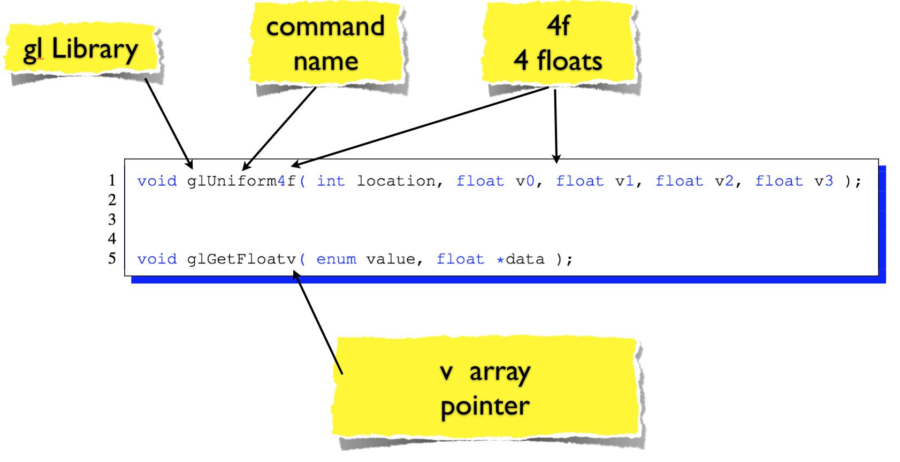
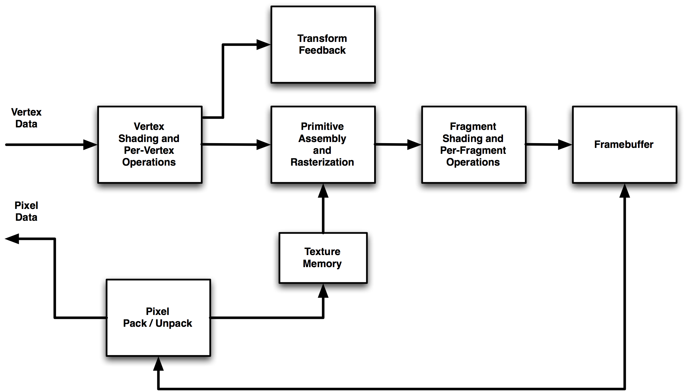
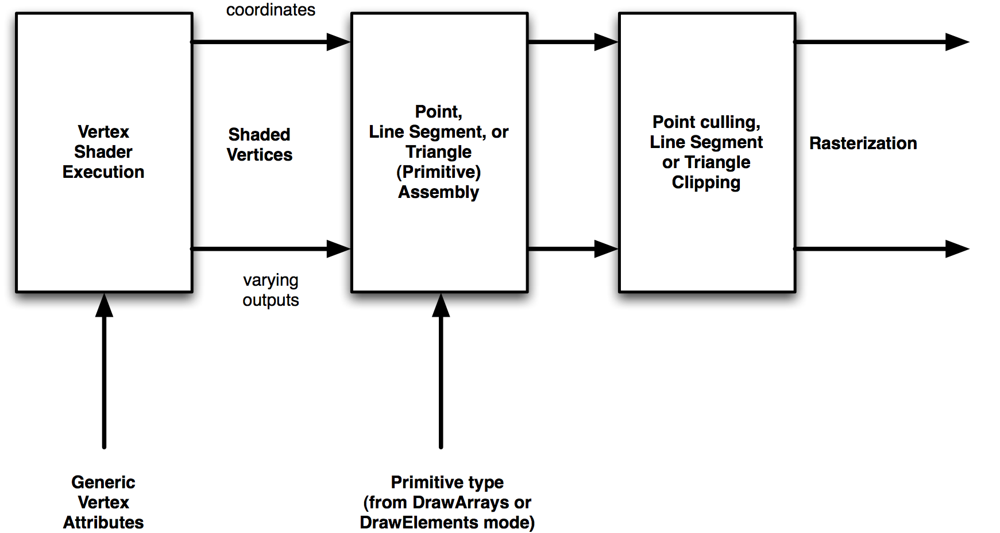
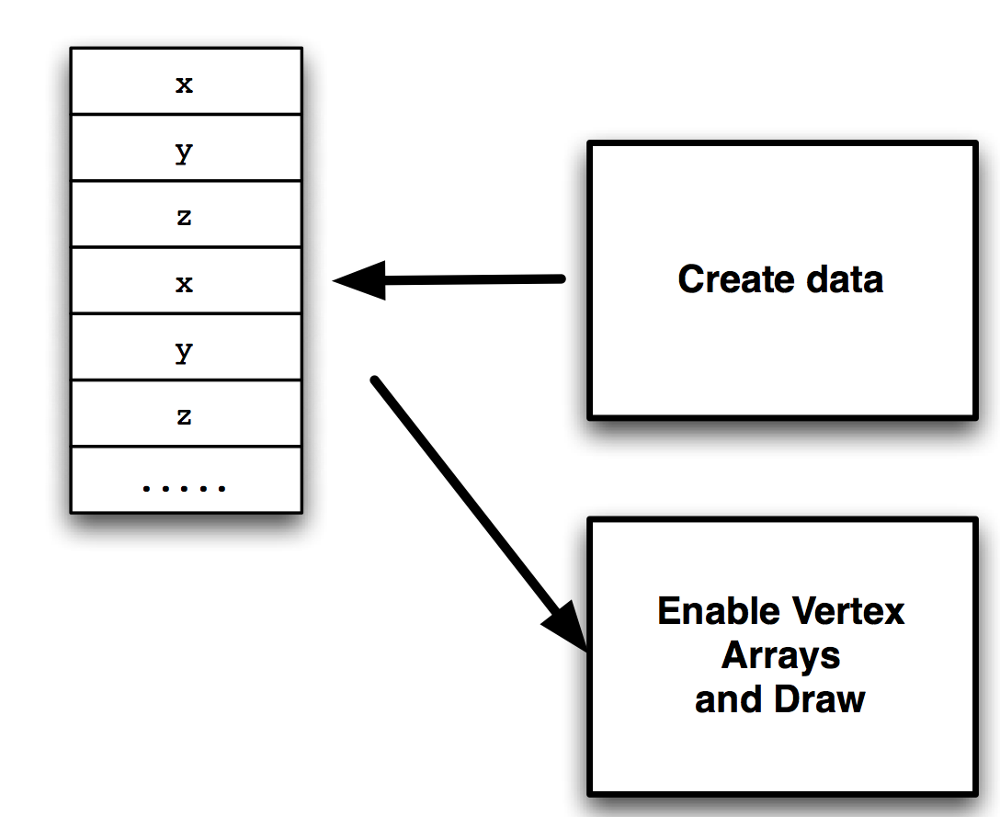

# Introduction to Modern OpenGL
## OpenGL Commands
Jon Macey

jmacey@bournemouth.ac.uk

---

## GL Command Syntax
- GL commands are functions or procedures. 
- Various groups of commands perform the same operation but differ in how arguments are supplied to them. 
- To specify the type of parameter GL uses a specific syntax
- GL commands are formed from a name which may be followed, depending on the particular command, by a sequence of characters describing a parameter to the command. 
- If present, a digit indicates the required length (number of values) of the indicated type. 
- Next, a string of characters making up one of the type descriptors 

--

## GL Command Syntax

| Type descriptor | Corresponding GL Type |
|-----------------|-----------------------|
| b | byte |
| s | short |
| i | int     |
| f | float   |
| d | double  |
| ub | ubyte  |
| us | ushort |
| ui | uint   |

--

# GL Command Syntax
- There are also some 64bit versions but I have never seen them in use.
-  A final v character, if present, indicates that the command takes a pointer to an array (a vector) of values rather than a series of individual arguments. 

--

## GL Command Syntax



--

## Block Diagram of OpenGL



--

## Block Diagram of OpenGL
- To aid learning we will concentrate on each of the elements in turn
- Ignoring the others and assuming they just work out of the box without setup
- Finally we shall put the whole system together

--

## Block Diagram of OpenGL

- Commands enter the GL on the left. Some commands specify geometric objects to be drawn while others control how the objects are handled by the various stages. Commands are effectively sent through a processing pipeline.
- The first stage operates on geometric primitives described by vertices: points, line segments, and polygons.
- In this stage vertices may be transformed and lit, followed by assembly into geometric primitives, which may optionally be used by the next stage, geometry shading, to generate new primitives.

--

## Block Diagram of OpenGL

- The final resulting primitives are clipped to a viewing volume in preparation for the next stage, rasterization.
- The rasterizer produces a series of framebuffer addresses and values using a two-dimensional description of a point, line segment, or polygon.
- Each fragment produced is fed to the next stage that performs operations on individual fragments before they finally alter the framebuffer.
- Finally, values may also be read back from the framebuffer or copied from one portion of the framebuffer to another.

--

## Primitives and Vertices


- In the OpenGL, most geometric objects are drawn by specifying a series of generic attribute sets using DrawArrays or one of the other drawing commands.
- Points, lines, polygons, and a variety of related geometric objects can be drawn in this way.

--

## Primitives and Vertices
- Each vertex is specified with one or more generic vertex attributes. 
- Each attribute is specified with one, two, three, or four scalar values.	
- Generic vertex attributes can be accessed from within vertex shaders and used to compute values for consumption by later processing stages.
- For example we may set vertex colour, vertex normals, texture co-ordinates or generic vertex attributes used by the processing shader

--

## Primitive types
- OpenGL has a number of primitive types that can be specified to DrawArrays and other primitive drawing commands
- These are
  - Points, Line Strips, Line Loops, Separate Lines,Triangle Strips, Triangle Fans, Separate Triangles, Lines with adjacency, Line Strips with Adjacency, Triangles with Adjacency, Triangle Strips with Adjacency, Separate Patches
- We will investigate these elements later for now we will concentrate on drawing some points

---

## [Vertex Arrays](https://www.opengl.org/wiki/Vertex_Specification)
- Vertex data is placed into arrays that are stored in the server’s address space (GPU). 
- Blocks of data in these arrays may then be used to specify multiple geometric primitives through the execution of a single OpenGL command. 
- The client may specify up to the value of [MAX_VERTEX_ATTRIBS](https://www.opengl.org/sdk/docs/tutorials/ClockworkCoders/attributes.php) arrays to store one or more generic vertex attributes.

--

## [Vertex Arrays](https://www.opengl.org/wiki/Vertex_Specification)
- Vertex arrays are a simple way of storing data for models so that Vertices, normals and other information may be shared.
- This allows a more compact representation of data and reduces the number of calls OpenGL needs to make and the reduction of data stored.
- We can create the data in a series of arrays either procedurally or by loading it from some model format
- The data may then be stored either by downloading it to the GPU or storing it on the client side and telling the GPU to bind to it.

--

## [Example drawing points](https://github.com/NCCA/OpenGLCode)

- The following example will draw a series of points to the OpenGL context
- The data is stored on the client side (our program)
- We need to create the data (3xGLfloat values) in an array
- Then tell OpenGL where this data is and draw it

--

## Creating the data
- we can use a smart pointer to store our data

```
constexpr size_t s_numPoints=10000;

// now to use the new C++ 11 rng functions
std::random_device rd;
//create a mersenne twister generator
std::mt19937 gen(rd());
// create real distribution functions for colour and points
std::uniform_real_distribution<> point(-1.0,1.0);


std::unique_ptr<GLfloat []>points(new GLfloat[2*s_numPoints]);
for( size_t i=0; i<2*s_numPoints; ++i)
{
  points[i]=point(gen);
}

```

--

## Drawing the Data
```
// now clear screen and render
glClear(GL_COLOR_BUFFER_BIT);
// draw a triangle
// swap the buffers
glClear(GL_COLOR_BUFFER_BIT| GL_DEPTH_BUFFER_BIT);
glEnableClientState(GL_VERTEX_ARRAY);

glVertexPointer(2, GL_FLOAT, 0, points.get());
glDrawArrays(GL_POINTS,0,s_numPoints);
glDisableClientState(GL_VERTEX_ARRAY);
```

--

## [glVertexPointer](https://www.opengl.org/sdk/docs/man2/xhtml/glVertexPointer.xml)
```
void glVertexPointer(GLint size,GLenum type,GLsizei stride,const GLvoid * pointer);

```
- size :- the number of coordinates per vertex. Must be 2, 3, or 4. The initial value is 4.
- type :- the data type of each coordinate in the array. Symbolic constants ```GL_SHORT```, ```GL_INT```, ```GL_FLOAT```, or ```GL_DOUBLE``` are accepted.  default : ```GL_FLOAT```.
- stride :- the byte offset between consecutive vertices. If stride is 0, the vertices are understood to be tightly packed in the array.  default : 0
- pointer :- a pointer to the first coordinate of the first vertex in the array. default : 0.

--

## [glVertexPointer](https://www.opengl.org/sdk/docs/man2/xhtml/glVertexPointer.xml)
- glVertexPointer has been marked for deprecation
- At present it works but the new method of drawing is a lot more complex and requires different shaders to be developed.
- We usually do not use client side data anyway so this is just serving as an example before we add to the overall GL construction required for GL 3.x functionality
- We will expand on the new functions later

--


## [glDrawArrays](https://www.opengl.org/sdk/docs/man/html/glDrawArrays.xhtml)

```
void glDrawArrays(GLenum mode,GLint first,GLsizei count);
```
- mode :- what kind of primitives to render. 
- Symbolic constants ```GL_POINTS```, ```GL_LINE_STRIP```, ```GL_LINE_LOOP```, ```GL_LINES```, ```GL_TRIANGLE_STRIP```, ```GL_TRIANGLE_FAN```, ```GL_TRIANGLES```, ```GL_QUAD_STRIP```, ```GL_QUADS```, and ```GL_POLYGON``` are accepted.
- first :- the starting index in the enabled arrays.
- count :- the number of indices to be rendered.

---

## ARB and [GLEW](http://glew.sourceforge.net/)
- ARB stands for Architecture review board and are extensions authorised by the OpenGL standards group
- Most of these extensions are part of the OpenGL driver for the GPU installed and we need to make link between the driver binary library and the OpenGL code we are writing
- This process is quite complex and to make it easier we can use GLEW (not required on Mac OSX)
- The [ngl::Init](https://github.com/NCCA/NGL/blob/master/src/NGLInit.cpp) class contains the following code to do this

--

## ngl::NGLInit 

```
NGLInit::NGLInit()
{
#ifndef USINGIOS_
  // set this first so that new driver features are included.
  glewExperimental = true;
  // now init glew
  GLenum err = glewInit();
  // error check
  if (GLEW_OK != err)
  {
    std::cerr<<"Error: "<<glewGetErrorString(err)<<"\n";
  }
  // now see if NGL can run in this environment
  std::cout<<"Using GLEW "<<glewGetString(GLEW_VERSION)<<"\n";
  if(!glewIsSupported("GL_VERSION_3_2") )
  {
    std::cerr<<"To run these demos you need a modern OpenGL Version\n";
    std::cerr<<"The lowest level OpenGL we support is 3.2\n";
    std::cerr<<"It could be you don't have the correct drivers installed\n";
    std::cerr<<"Or if linux on a laptop it could be using the intel driver and not the GPU\n";
    std::cerr<<"for more info contact Jon\n";

	}
	int majorVersion,minorVersion;
	glGetIntegerv(GL_MAJOR_VERSION, &majorVersion);
	glGetIntegerv(GL_MINOR_VERSION, &minorVersion);
	#ifdef NGL_DEBUG
		std::cerr <<"ngl:: configured with GL version "<<majorVersion<<"."<<minorVersion<<"\n";
	#endif
  VAOFactory::registerVAOCreator("simpleVAO",SimpleVAO::create);
  VAOFactory::registerVAOCreator("multiBufferVAO",MultiBufferVAO::create);
  VAOFactory::registerVAOCreator("simpleIndexVAO",SimpleIndexVAO::create);
#endif
}
```

--

## Adding Extensions

```
#define glMultiDrawArrays GLEW_GET_FUN(__glewMultiDrawArrays)

PFNGLMULTIDRAWARRAYSPROC __glewMultiDrawArrays = NULL;

```

- For every function we need to access we have to write some code similar to the lines above
- This is quite tedious so GLEW does it for us


---

## adding colour
- The process of adding Colour is similar to that of setting the vertices
- We create a single array of per-vertex RGB values

```
std::unique_ptr<GLfloat []> m_colours;
#include <random>
constexpr int s_numPoints=1000000;

OpenGLWindow::OpenGLWindow()
{
  setTitle("Qt5 compat profile OpenGL 3.2");
  // first we generate random point x,y,z values
  // using a smart pointer so the reset method creates a new array
  m_points.reset( new GLfloat[2*s_numPoints]);
  m_colours.reset (new GLfloat[3*s_numPoints]);
  // now to use the new C++ 11 rng functions
  std::random_device rd;
  //create a mersenne twister generator
  std::mt19937 gen(rd());
  // create real distribution functions for colour and points
  std::uniform_real_distribution<> colour(0.2f,1.0f);
  std::uniform_real_distribution<> point(-1.0f,1.0f);

  for( int i=0; i<2*s_numPoints; ++i)
  {
    m_points[i]= point(gen);
  }
    for( int i=0; i<3*s_numPoints; ++i)
  {
    m_colours[i]= colour(gen);
  }
    startTimer(90);
}
```

--

## rendering colours
- We then create a pointer to this and draw using the same draw command

```
void OpenGLWindow::paintGL()
{
  glViewport(0,0,m_width,m_height);
  // clear the screen and depth buffer
  glClear(GL_COLOR_BUFFER_BIT | GL_DEPTH_BUFFER_BIT);
  glEnableClientState(GL_VERTEX_ARRAY);
  glEnableClientState(GL_COLOR_ARRAY);
  glVertexPointer(2, GL_FLOAT, 0, m_points.get());
  glColorPointer(3,GL_FLOAT,0,m_colours.get());
  glDrawArrays(GL_POINTS, 0, s_numPoints);
  glDisableClientState(GL_VERTEX_ARRAY);
  glDisableClientState(GL_COLOR_ARRAY);
}
```

--

## Problems
- Although this method works, it is still slow (for modern GPU's)
- Each frame the client (our program) has to send the data to the server (GPU)
- If we increase the s_numPoints constant the program slows to a halt
- To increase the speed we need to use modern OpenGL and store data server side.


---

## References
- Segal M, Akeley K The OpenGL	Graphics System: A Specification (Version 4.0 (Core Profile) - March 11, 2010)
- F S. Hill  Computer Graphics Using Open GL (3rd Edition) 
- Shreiner Et Al OpenGL Programming Guide: The Official Guide to Learning OpenGL
- Foley & van Dam Computer Graphics: Principles and Practice in C (2nd Edition) 

