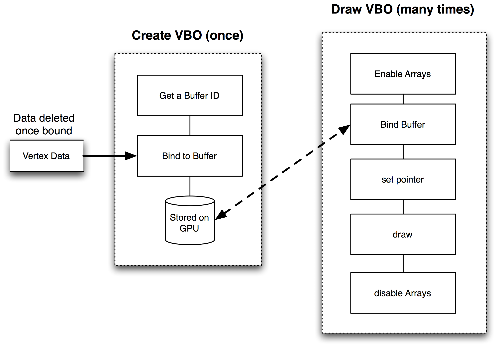
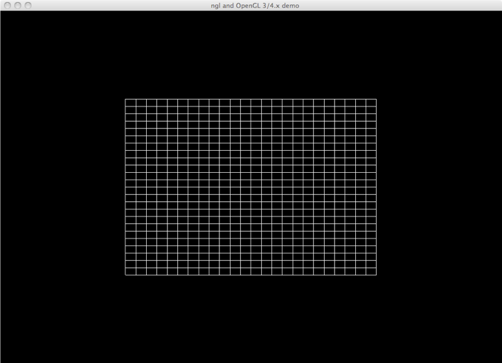
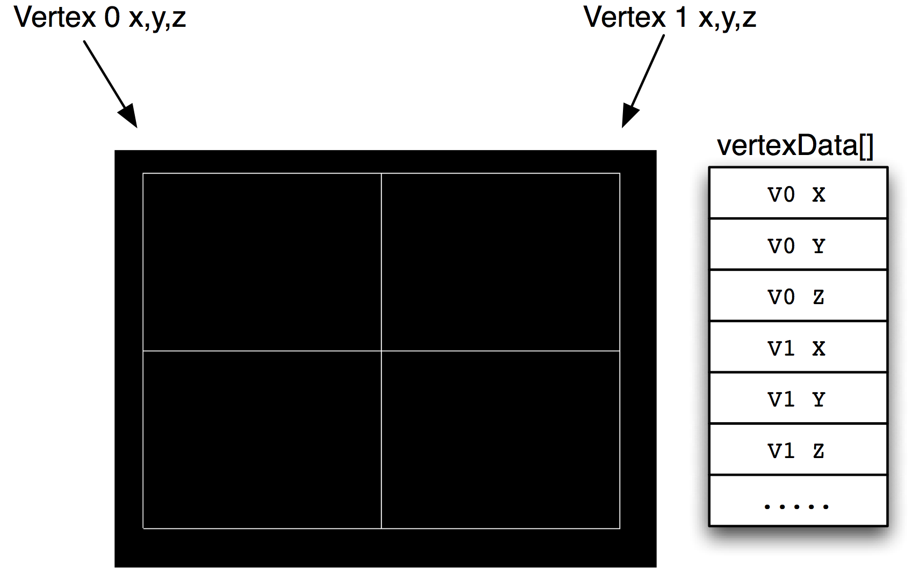
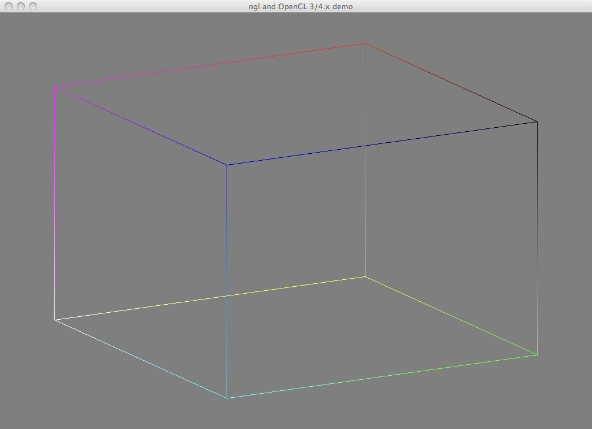
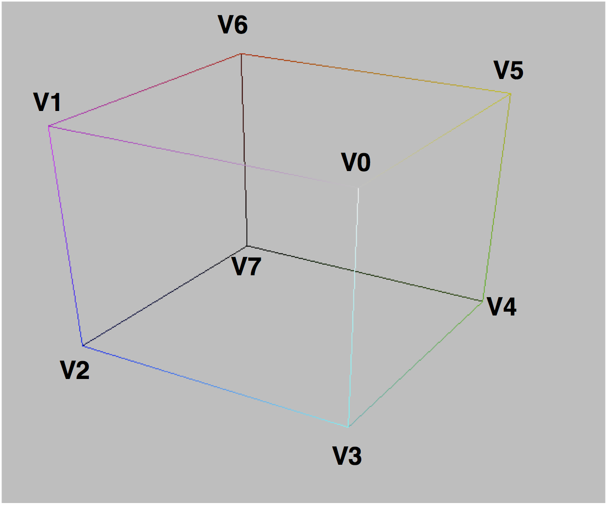
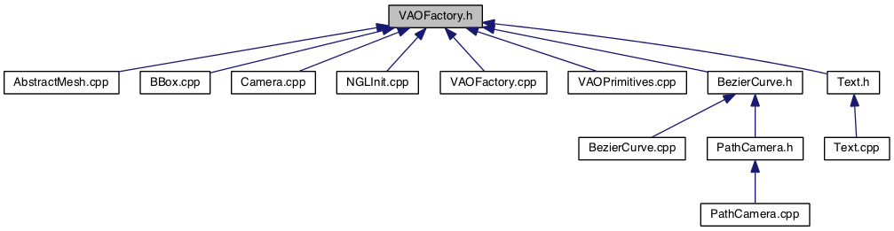
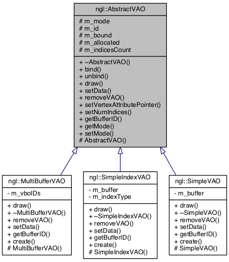
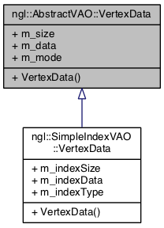

# Introduction to Modern OpenGL
## Vertex Buffers and Arrays
Jon Macey

jmacey@bournemouth.ac.uk

---

## [Vertex Buffer Objects](https://www.opengl.org/wiki/Buffer_Object)
- The idea behind VBOs is to provide regions of memory (buffers) accessible through identifiers. 
A buffer is made active through binding, following the same pattern as other OpenGL entities such as display lists or textures. 
- Data is effectively stored on the GPU for execution and this greatly increases the speed of drawing.

--

## VBO Allocation and process


--

## [Vertex Specification](https://www.opengl.org/wiki/Vertex_Specification)
- We can pack the data in a number of ways for passing to the VBO
- The two simplest schemes are
  - All Vertex Data - All Normal Data - All Texture Data etc etc
- Alternatively we can pack the data by interleaving the data.
- For the following examples we will use the 1st format.

--

## [Vertex Specification](https://www.opengl.org/wiki/Vertex_Specification)
 

```
struct StructOfArrays
{
  GLfloat positions[VERTEX_COUNT * 3];
  GLfloat normals[VERTEX_COUNT * 3];
  GLubyte colors[VERTEX_COUNT * 4];
};

StructOfArrays structOfArrays;

struct Vertex
{
  GLfloat position[3];
  GLfloat normal[3];
  Glubyte color[4];
};

Vertex vertices[VERTEX_COUNT];
```

---


## [Grid example](https://github.com/NCCA/OpenGLCode/tree/master/Grid)


```
void  makeGrid(GLfloat _size, size_t _steps);
/// @brief a pointer to our VBO data
GLuint m_vboPointer=0;
/// @brief store the size of the vbo data
GLint m_vboSize=0;

```

--

## [Grid example](https://github.com/NCCA/OpenGLCode/tree/master/Grid)


--


## [Grid example](https://github.com/NCCA/OpenGLCode/tree/master/Grid)

```
void  OpenGLWindow::makeGrid( GLfloat _size, size_t _steps )
{
	// allocate enough space for our verts
	// as we are doing lines it will be 2 verts per line
	// and we need to add 1 to each of them for the <= loop
	// and finally muliply by 12 as we have 12 values per line pair
  m_vboSize= (_steps+2)*12;
  std::unique_ptr<float []>vertexData( new float[m_vboSize]);
	// k is the index into our data set
  int k=-1;
	// claculate the step size for each grid value
	float step=_size/(float)_steps;
	// pre-calc the offset for speed
	float s2=_size/2.0f;
	// assign v as our value to change each vertex pair
	float v=-s2;
	// loop for our grid values
  for(size_t i=0; i<=_steps; ++i)
	{
		// vertex 1 x,y,z
		vertexData[++k]=-s2; // x
		vertexData[++k]=v; // y
		vertexData[++k]=0.0; // z

		// vertex 2 x,y,z
		vertexData[++k]=s2; // x
		vertexData[++k]=v; // y
		vertexData[++k]=0.0; // z

		// vertex 3 x,y,z
		vertexData[++k]=v;
		vertexData[++k]=s2;
		vertexData[++k]=0.0;

		// vertex 4 x,y,z
		vertexData[++k]=v;
		vertexData[++k]=-s2;
		vertexData[++k]=0.0;
		// now change our step value
		v+=step;
  }
	// now we will create our VBO first we need to ask GL for an Object ID
  glGenBuffers(1, &m_vboPointer);
	// now we bind this ID to an Array buffer
  glBindBuffer(GL_ARRAY_BUFFER, m_vboPointer);
	// finally we stuff our data into the array object
	// First we tell GL it's an array buffer
	// then the number of bytes we are storing (need to tell it's a sizeof(FLOAT)
	// then the pointer to the actual data
	// Then how we are going to draw it (in this case Statically as the data will not change)
  glBufferData(GL_ARRAY_BUFFER, m_vboSize*sizeof(GL_FLOAT) , vertexData.get(), GL_STATIC_DRAW);
}
```

--

## binding the data
- Once we have bound the data it will be copied to the GPU and we can delete it on the client (in this case it falls out of scope with the smart pointer)
- Now we bind the data onto the GPU and once this is done we can delete the client side data as it’s not needed

--

## Building the Grid
- We must have a valid GL context before we can call this function, and if required we must initialise GLEW
- In Qt this is done in the initializeGL method

```
void OpenGLWindow::initializeGL()
{
  glClearColor(0.0f, 0.0f, 0.0f, 1.0f);	
  makeGrid(gridSize,steps);
}
```

--

## Drawing the buffer
- To draw we need to use the identifier stored when the VBO was created

```
void OpenGLWindow::paintGL()
{
  // set the viewport
  glViewport(0,0,m_width,m_height);
  // clear the colour and depth buffers ready to draw.
  glClear(GL_COLOR_BUFFER_BIT | GL_DEPTH_BUFFER_BIT);
  // enable  vertex array drawing
  glEnableClientState(GL_VERTEX_ARRAY);
  // bind our VBO data to be the currently active one
  glBindBuffer(GL_ARRAY_BUFFER, m_vboPointer);
  // tell GL how this data is formated in this case 3 floats tightly packed starting at the begining
  // of the data (0 = stride, 0 = offset)
  glVertexPointer(3,GL_FLOAT,0,0);
  // draw the VBO as a series of GL_LINES starting at 0 in the buffer and _vboSize*GLfloat
  glDrawArrays( GL_LINES, 0, m_vboSize);
  // now turn off the VBO client state as we have finished with it
  glDisableClientState(GL_VERTEX_ARRAY);
}
```

---

## Vertex arrays
- To enable the use of vertex arrays we need very few steps as shown below
  - Invoke the function glEnableClientState(GL_VERTEX_ARRAY); to activate the vertex-array feature of OpenGL
  - Use the function glVertexPointer to specify the location and data format for the vertex co-ordinates
  - Display the scene using a routine such as glDrawArrays

--

## [example cube](https://github.com/NCCA/OpenGLCode/tree/master/Cube)

- This cube has vertex colours and vertex normals
- The data is stored contiguously in one buffer
  - Vertex, Normal, Colour

--

## Cube Vertices



```
// vertex coords array
// The array  stores the vertices for a unit cube in face order of quads
std::array<GLfloat,12*6> vertices = {{
                        1, 1, 1, -1, 1, 1, -1,-1, 1,  1,-1, 1,  // v0-v1-v2-v3
                        1, 1, 1,  1,-1, 1,  1,-1,-1,  1, 1,-1,  // v0-v3-v4-v5
                        1, 1, 1,  1, 1,-1, -1, 1,-1, -1, 1, 1,  // v0-v5-v6-v1
                      -1, 1, 1, -1, 1,-1, -1,-1,-1, -1,-1, 1,  // v1-v6-v7-v2
                      -1,-1,-1,  1,-1,-1,  1,-1, 1, -1,-1, 1,  // v7-v4-v3-v2
                        1,-1,-1, -1,-1,-1, -1, 1,-1,  1, 1,-1   // v4-v7-v6-v5
                      }};
```

--

# Vertex Normals

```
// normal array
std::array<GLfloat,12*6> normals = {{
                      0, 0, 1,   0, 0, 1,  0, 0, 1,  0, 0, 1,     // v0-v1-v2-v3
                      1, 0, 0,   1, 0, 0,  1, 0, 0,  1, 0, 0,     // v0-v3-v4-v5
                      0, 1, 0,   0, 1, 0,  0, 1, 0,  0, 1, 0,     // v0-v5-v6-v1
                      -1, 0, 0,  -1, 0, 0, -1, 0, 0, -1, 0, 0,     // v1-v6-v7-v2
                      0,-1, 0,   0,-1, 0,  0,-1, 0,  0,-1, 0,     // v7-v4-v3-v2
                      0, 0,-1,   0, 0, -1, 0, 0,-1,  0, 0,-1      // v4-v7-v6-v5
                    }};
```

--

## Colours
- Array of colour values for each vertex these will be interpolated across the faces
```
// color array
std::array<GLfloat,12*6> colours =
                    {{
                      1,1,1,  1,1,0,  1,0,0,  1,0,1,  // v0-v1-v2-v3
                      1,1,1,  1,0,1,  0,0,1,  0,1,1,  // v0-v3-v4-v5
                      1,1,1,  0,1,1,  0,1,0,  1,1,0,  // v0-v5-v6-v1
                      1,1,0,  0,1,0,  0,0,0,  1,0,0,  // v1-v6-v7-v2
                      0,0,0,  0,0,1,  1,0,1,  1,0,0,  // v7-v4-v3-v2
                      0,0,1,  0,0,0,  0,1,0,  0,1,1		// v4-v7-v6-v5
                    }};
```

--

## Assigning the data
- In this case we have 3 different arrays which we are going to combine into one VBO buffer.
- The data will be packed in the format
  - Vertices -> Normal -> Colour
- First we have to allocate enough space for all 3 arrays

--

## Assigning the data

```
 // first we scale our vertices to _scale
  for(int i=0; i<24*3; ++i)
  {
    vertices[i]*=_scale;
  }
  // now create the VBO
  glGenBuffers(1, &m_vboPointer);
  // now we bind this ID to an Array buffer
  glBindBuffer(GL_ARRAY_BUFFER, m_vboPointer);

  // this time our buffer is going to contain verts followed by normals
  // so allocate enough space for all of them
  unsigned long totalBuffSize=vertices.size()+normals.size()+colours.size();
  std::cout<<"total buffer size= "<<totalBuffSize<<'\n';
  std::cout<<"total buffer size bytes = "<<totalBuffSize*sizeof(GLfloat)<<'\n';

  glBufferData(GL_ARRAY_BUFFER, totalBuffSize*sizeof(GLfloat) , 0, GL_STATIC_DRAW);
  // now we copy the data for the verts into our buffer first
  std::cout<<"vertices buffer size= "<<vertices.size()<<'\n';
  std::cout<<"vertices buffer size bytes = "<<vertices.size()*sizeof(GLfloat)<<'\n';

  glBufferSubData(GL_ARRAY_BUFFER,0,vertices.size()*sizeof(GLfloat),&vertices[0]);

  // now we need to tag the normals onto the end of the verts
  glBufferSubData(GL_ARRAY_BUFFER,vertices.size()*sizeof(GLfloat),
                  normals.size()*sizeof(GLfloat),&normals[0]);

  // now we need to tag the colours onto the end of the normals
  glBufferSubData(GL_ARRAY_BUFFER,(vertices.size()+normals.size())*sizeof(GL_FLOAT),
                  colours.size()*sizeof(GLfloat),&colours[0]);

```

--

## using std::array<>
- The advantage of using std::array (or std::vector<>) is we can query the size
- we still need to find the size of the data in bytes as this is all OpenGL uses
- In the previous example we have

```
total buffer size= 216
total buffer size bytes = 864
vertices buffer size= 72
vertices buffer size bytes = 288
```

--

## Drawing (Indexed Data)
- In this case we are going to draw using Index data (however the data is in order)
- We need to pass an array of indices which in this case will be 0,1,2,3,4,5 etc

```
void OpenGLWindow::paintGL()
{
  glViewport(0,0,m_width,m_height);
  //GLubyte indices[] = {0,1,2,3,4,5,6,7,8,9,10,11,12,13,14,15,16,17,18,19,20,21,22,23};
  std::vector<GLubyte> indices(24);
  std::iota(std::begin(indices),std::end(indices),0);
  // this macro is used to define the offset into the VBO data for our normals etc
  // it needs to be a void pointer offset from 0
  #define BUFFER_OFFSET(i) ((float *)nullptr + (i))

  glClear(GL_COLOR_BUFFER_BIT | GL_DEPTH_BUFFER_BIT);
  glPushMatrix();
    static int xrot=0;
    static int yrot=0;
    glRotatef(xrot++,1,0,0);
    glRotatef(yrot++,0,1,0);
    // enable  vertex array drawing
    glEnableClientState(GL_VERTEX_ARRAY);
    // enable Normal array
    glEnableClientState(GL_NORMAL_ARRAY);
    // enable the colour array
    glEnableClientState(GL_COLOR_ARRAY);

    // bind our VBO data to be the currently active one
    glBindBuffer(GL_ARRAY_BUFFER, m_vboPointer);
    // we need to tell GL where the verts start
    glVertexPointer(3,GL_FLOAT,0,0);
    // now we tell it where the nornals are (thes are basically at the end of the verts
    glNormalPointer(GL_FLOAT, 0,BUFFER_OFFSET(24*3));
    // now we tell it where the colours are (thes are basically at the end of the normals
    glColorPointer(3,GL_FLOAT, 0,BUFFER_OFFSET(48*3));
    glDrawElements(GL_QUADS,24,GL_UNSIGNED_BYTE,&indices[0]);
    // now turn off the VBO client state as we have finished with it
    glDisableClientState(GL_VERTEX_ARRAY);
    glDisableClientState(GL_NORMAL_ARRAY);
    glDisableClientState(GL_COLOR_ARRAY);
  glPopMatrix();  // finally swap the buffers to make visible
}
```

---

## [Vertex Array Objects](https://www.opengl.org/wiki/Vertex_Specification#Vertex_Array_Object)
- Modern OpenGL use generic vertex attributes as the input to the vertex shader stage (more in a later lecture)
- This replaces the specific glVertex,glColour,glNormal pointers
- This gives us a more flexible approach to shader writing
- We need to bind these before we can use them and tell the shader which input does what

--

## [Vertex Array Objects](https://www.opengl.org/wiki/Vertex_Specification#Vertex_Array_Object)

- Vertex Array objects are way of storing this state information and recalling it when required.
- All modern OpenGL use these.
- The OpenGL spec defines a VAO as

" This extension introduces named vertex array objects which encapsulate vertex array state on the client side.  These objects allow applications to rapidly switch between large sets of array state.  In addition, layered libraries can return to the default array state by simply creating and binding a new vertex array object."

--

## [Vertex Array Objects](https://www.opengl.org/wiki/Vertex_Specification#Vertex_Array_Object)

- VAOs are a collection of state, like all OpenGL Objects. 
- Unlike texture objects or Buffer Objects, VAOs are pure state objects; they do not contain any large blocks of data or anything.

```
struct VertexAttribute
{
  bool bIsEnabled = GL_FALSE;
  //This is the number of elements in this attribute, 1-4. int iSize = 4;
  unsigned int iStride = 0;
  VertexAttribType eType = GL_FLOAT;
  bool bIsNormalized = GL_FALSE;
  bool bIsIntegral = GL_FALSE;
  void * pBufferObjectOffset = 0;
  BufferObject * pBufferObj = 0;
};
struct VertexArrayObject
{
  BufferObject *pElementArrayBufferObject = NULL;
  VertexAttribute attributes[GL_MAX_VERTEX_ATTRIB];
}
```

--

## [Vertex Array Objects](https://www.opengl.org/wiki/Vertex_Specification#Vertex_Array_Object)
 
- VAO basically store the state and attribute information for other buffers
- Once allocated we can use less commands to re-activate the state and draw (usually 3)

--

## Generate VAO
- [glGenVertexArrays](https://www.opengl.org/sdk/docs/man4/html/glGenVertexArrays.xhtml) generates n empty vertex array objects
- Once bound subsequent operations are applied to the currently bound object

```
GLuint m_vaoID[2];
// Two VAOs allocation
glGenVertexArrays(2, &m_vaoID[0]);
// First VAO setup
glBindVertexArray(m_vaoID[0]);
```

--

##  Data allocation

```
GLuint vboID;
glGenBuffers(1, &vboID);
glBindBuffer(GL_ARRAY_BUFFER, m_vboID);
glBufferData(GL_ARRAY_BUFFER, 9*sizeof(GLfloat), vert2, GL_STATIC_DRAW); 
glVertexAttribPointer((GLuint)0, 3, GL_FLOAT, GL_FALSE, 0, 0);
glEnableVertexAttribArray(0);
glBindVertexArray(0);
```
- Normal VBO operations are done now the VAO is bound, all state allocated in this operations is retained in the VAO

--

## Drawing
- Fist we bind the VAO which will set the stored attribute state into the current state
- Then draw as usual

```
// select first VAO
glBindVertexArray(m_vaoID[0]);
// draw first object 
glDrawArrays(GL_TRIANGLES, 0, 3);
```

---

## ngl:: VAO Usage

- Internally ngl:: uses Vertex Array Objects (VAOs) to store and draw all of the graphical elements
- Originally a class called ngl::VertexArrayObject was used to encapsulates all the functionality for creating these objects and then binding and drawing them
- This class is still present in ngl:: but has been deprecated and replaced with a far more flexibile factory
  - it is always best to use the factory methods

--

## ngl:: Built in VAO's

```
VAOFactory::registerVAOCreator("simpleVAO",SimpleVAO::create);
VAOFactory::registerVAOCreator("multiBufferVAO",MultiBufferVAO::create);
VAOFactory::registerVAOCreator("simpleIndexVAO",SimpleIndexVAO::create);
```

--

## AbstractVAO.h

```
class NGL_DLLEXPORT AbstractVAO
{
  public :
    class VertexData
    {
        public :
          VertexData(size_t _size,const GLfloat &_data, GLenum _mode=GL_STATIC_DRAW ) :
           m_size(_size), m_data(_data), m_mode(_mode){}

        size_t m_size;
        const GLfloat &m_data;
        GLenum m_mode=GL_STATIC_DRAW;
    };

    //----------------------------------------------------------------------------------------------------------------------
    /// @brief dtor usually this will not be called
    //----------------------------------------------------------------------------------------------------------------------
    virtual ~AbstractVAO()=default;
    //----------------------------------------------------------------------------------------------------------------------
    /// @brief bind the VAO so it can be used.
    //----------------------------------------------------------------------------------------------------------------------
    void bind();
    //----------------------------------------------------------------------------------------------------------------------
    /// @brief unbind the VAO by binding default 0
    //----------------------------------------------------------------------------------------------------------------------
    void unbind();
    //----------------------------------------------------------------------------------------------------------------------
    /// @brief this is the draw method for the VAO the user must implement this per VAO data, usually this
    /// will be a call to glDrawArrays type function, VAO must be bound before calling this
    //----------------------------------------------------------------------------------------------------------------------
    virtual void draw()const =0;
    //----------------------------------------------------------------------------------------------------------------------
    /// @brief this method is used to set the data in the VAO, we have a base data type of
    /// VertexData above, but the user can extend this to create custom data types
    //----------------------------------------------------------------------------------------------------------------------
    virtual void setData(const VertexData &_data)=0;
    //----------------------------------------------------------------------------------------------------------------------
    /// @brief this will clean up the VAO and associated data, it is the users responsibility to do this
    /// usually this will be a call to the various delete buffers gl routines
    //----------------------------------------------------------------------------------------------------------------------
    virtual void removeVAO()=0;
    //----------------------------------------------------------------------------------------------------------------------
    /// @brief set the generic vertex attribute pointer data usually this method will do however the user
    /// may occasionally need to override this method.
    /// @param _size the size of the raw data passed (not counting sizeof(GL_FLOAT))
    /// @param _type the data type of the Pointer (eg GL_FLOAT)
    /// @param _stride the step between data values (need *sizeof _type) e.g. 10*sizeof(GLfloat) 0 means tightly packed / contiguous
    /// @param _dataOffset Specifies a pointer to the first component of the first generic vertex attribute in the array.
    /// The initial value is 0. and is calculated as static_cast<Real *>(NULL)  + _dataOffset
    /// @param _normalise specifies whether fixed-point data values should be normalized (GL_TRUE) or converted directly as
    /// fixed-point values (GL_FALSE) when they are accessed.
    //----------------------------------------------------------------------------------------------------------------------
    void setVertexAttributePointer(GLuint _id, GLint _size, GLenum _type, GLsizei _stride, unsigned int _dataOffset, bool _normalise=false );
    //----------------------------------------------------------------------------------------------------------------------
    /// @brief the number of indices to draw in the array. It may be that the draw routine can overide this at another time.
    /// @param _s the number of indices to draw (from 0)
    //----------------------------------------------------------------------------------------------------------------------
    void setNumIndices(size_t _s){m_indicesCount=_s;}
    //----------------------------------------------------------------------------------------------------------------------
    /// @brief return the id of the buffer, if there is only 1 buffer just return this
    /// if we have the more than one buffer the sub class manages the id's
    /// @param _buffer index (default to 0 for single buffer VAO's)
    //----------------------------------------------------------------------------------------------------------------------
    virtual GLuint getBufferID(unsigned int _id=0)=0;
    //----------------------------------------------------------------------------------------------------------------------
    /// @brief get the draw mode
    //----------------------------------------------------------------------------------------------------------------------
    GLenum getMode() const;
    //----------------------------------------------------------------------------------------------------------------------
    /// @brief set the draw mode
    /// @param _mode (GL_TRIANGLES etc)
    //----------------------------------------------------------------------------------------------------------------------
    void setMode(const GLenum &_mode);

  protected :
    //----------------------------------------------------------------------------------------------------------------------
    /// ctor to build the VAO
    /// @param _mode the mode to draw with.
    //----------------------------------------------------------------------------------------------------------------------
    AbstractVAO(GLenum _mode=GL_TRIANGLES) ;
    //----------------------------------------------------------------------------------------------------------------------
    /// @brief the draw mode
    //----------------------------------------------------------------------------------------------------------------------
    GLenum m_mode=GL_TRIANGLES;
    //----------------------------------------------------------------------------------------------------------------------
    /// @brief the id of the VAO allocated from OpenGL
    //----------------------------------------------------------------------------------------------------------------------
    GLuint m_id=0;
    //----------------------------------------------------------------------------------------------------------------------
    /// @brief debug flag to indicate if the vao is bound.
    //----------------------------------------------------------------------------------------------------------------------
    bool m_bound=false;
    //----------------------------------------------------------------------------------------------------------------------
    /// @brief debug flag to indicate if data has been set for the VAO
    //----------------------------------------------------------------------------------------------------------------------
    bool m_allocated=false;
    //----------------------------------------------------------------------------------------------------------------------
    /// @brief the number of indices stored in the VAO.
    //----------------------------------------------------------------------------------------------------------------------
    size_t m_indicesCount=0;
};

```

--

## vertexData

- The ngl::AbstractVAO::VertexData class encapsulates the data passed to the VAO
- It can be overidden by the user and extended for new VOA classes

--


## AbstractVAO.cpp

```
#include "AbstractVAO.h"
#include <iostream>
namespace ngl
{
  AbstractVAO::AbstractVAO(GLenum _mode)
  {
    // first we create a vertex array Object
    glGenVertexArrays(1, &m_id);
    m_mode=_mode;
  }

  GLenum AbstractVAO::getMode() const
  {
    return m_mode;
  }

  void AbstractVAO::setMode(const GLenum &_mode)
  {
    m_mode = _mode;
  }

  //----------------------------------------------------------------------------------------------------------------------
  void AbstractVAO::bind()
  {
    glBindVertexArray(m_id);
    m_bound=true;
  }
  //----------------------------------------------------------------------------------------------------------------------
  void AbstractVAO::unbind()
  {
    glBindVertexArray(0);
    m_bound=false;
  }


  void AbstractVAO::setVertexAttributePointer(GLuint _id, GLint _size, GLenum _type, GLsizei _stride, unsigned int _dataOffset, bool _normalise )
  {
    if(m_bound !=true)
    {
      std::cerr<<"Warning trying to set attribute on Unbound VOA\n";
    }
    // set and enable the generic vertex attribute
    glVertexAttribPointer(_id,_size,_type,_normalise,_stride,static_cast<Real *>(NULL)  + _dataOffset);//   ((Real *)NULL + (_dataOffset)));
    glEnableVertexAttribArray(_id);
  }

}

```

--

## SimpleVAO 
```
std::unique_ptr<AbstractVAO> m_vao;
m_vao.reset(ngl::VAOFactory::createVAO("simpleVAO",GL_TRIANGLES) );
```
- the "simpleVAO" is a single buffer VAO
- calling setData will replace existing buffers
- good for simple data with no changes

--

## SimpleVAO.h

```
class NGL_DLLEXPORT SimpleVAO : public AbstractVAO
{
  public :
    //----------------------------------------------------------------------------------------------------------------------
    /// @brief creator method for the factory
    /// @param _mode the mode to draw with.
    /// @returns a new AbstractVAO * object
    //----------------------------------------------------------------------------------------------------------------------
    static AbstractVAO *create(GLenum _mode=GL_TRIANGLES) { return new SimpleVAO(_mode); }
    //----------------------------------------------------------------------------------------------------------------------
    /// @brief draw the VAO using glDrawArrays
    //----------------------------------------------------------------------------------------------------------------------
    virtual void draw() const;
    //----------------------------------------------------------------------------------------------------------------------
    /// @brief dtor clears the VAO data
    //----------------------------------------------------------------------------------------------------------------------
    virtual ~SimpleVAO();
    //----------------------------------------------------------------------------------------------------------------------
    /// @brief remove the VAO and buffers created
    //----------------------------------------------------------------------------------------------------------------------
    virtual void removeVAO();
    //----------------------------------------------------------------------------------------------------------------------
    /// @brief, this method sets the data for the VAO if data has already been set it will remove the existing data
    /// and then re-set with the new data.
    //----------------------------------------------------------------------------------------------------------------------
    virtual void setData(const VertexData &_data);
    //----------------------------------------------------------------------------------------------------------------------
    /// @brief return the id of the buffer, if there is only 1 buffer just return this
    /// if we have the more than one buffer the sub class manages the id's
    /// @param _buffer index (default to 0 for single buffer VAO's)
    //----------------------------------------------------------------------------------------------------------------------
     GLuint getBufferID(unsigned int ){return m_buffer;}

  protected :
    //----------------------------------------------------------------------------------------------------------------------
    /// @brief ctor calles parent ctor to allocate vao;
    //----------------------------------------------------------------------------------------------------------------------
    SimpleVAO(GLenum _mode)  : AbstractVAO(_mode)
    {

    }
  private :
    //----------------------------------------------------------------------------------------------------------------------
    /// @brief the id of the buffer for the VAO
    //----------------------------------------------------------------------------------------------------------------------
    GLuint m_buffer=0;
};
```

--

## SimpleVAO.cpp

```
  SimpleVAO::~SimpleVAO()
  {
    removeVAO();
  }

  void SimpleVAO::draw() const
  {
    if(m_allocated == false)
    {
      std::cerr<<"Warning trying to draw an unallocated VOA\n";
    }
    if(m_bound == false)
    {
      std::cerr<<"Warning trying to draw an unbound VOA\n";
    }
    glDrawArrays(m_mode, 0, static_cast<GLsizei>(m_indicesCount));
  }

  void SimpleVAO::removeVAO()
  {
    if(m_bound == true)
    {
      unbind();
    }
    if( m_allocated ==true)
    {
        glDeleteBuffers(1,&m_buffer);
    }
    glDeleteVertexArrays(1,&m_id);
    m_allocated=false;
    }

  void SimpleVAO::setData(const VertexData &_data)
  {
    if(m_bound == false)
    {
      std::cerr<<"trying to set VOA data when unbound\n";
    }
    if( m_allocated ==true)
    {
        glDeleteBuffers(1,&m_buffer);
    }

    glGenBuffers(1, &m_buffer);
    // now we will bind an array buffer to the first one and load the data for the verts
    glBindBuffer(GL_ARRAY_BUFFER, m_buffer);
    glBufferData(GL_ARRAY_BUFFER,static_cast<GLsizeiptr>( _data.m_size), &_data.m_data, _data.m_mode);
    m_allocated=true;

  }

```

--

## MultiBuffer VAO
```
std::unique_ptr<AbstractVAO> m_vao;
m_vao.reset(ngl::VAOFactory::createVAO("multiBufferVAO",GL_TRIANGLES) );
```
- the "multiBufferVAO" is a multiple buffer VAO
- calling setData will create a new VBO for the VAO
- each Buffer ID can be accessed via array index ``` getBufferID(int _index); ```
- good for multiple buffer data (Vertex, Normal UV etc)

--

## multiBufferVAO.h

```
class NGL_DLLEXPORT MultiBufferVAO : public AbstractVAO
{
  public :
    //----------------------------------------------------------------------------------------------------------------------
    /// @brief creator method for the factory
    /// @param _mode the mode to draw with.
    /// @returns a new AbstractVAO * object
    //----------------------------------------------------------------------------------------------------------------------
    static AbstractVAO *create(GLenum _mode=GL_TRIANGLES) { return new MultiBufferVAO(_mode); }
    //----------------------------------------------------------------------------------------------------------------------
    /// @brief draw the VAO using glDrawArrays
    //----------------------------------------------------------------------------------------------------------------------
    virtual void draw() const;
    //----------------------------------------------------------------------------------------------------------------------
    /// @brief dtor don't do anything as the remove clears things
    //----------------------------------------------------------------------------------------------------------------------
    virtual ~MultiBufferVAO();
    //----------------------------------------------------------------------------------------------------------------------
    /// @brief remove the VAO and buffers created
    //----------------------------------------------------------------------------------------------------------------------
    virtual void removeVAO();
    //----------------------------------------------------------------------------------------------------------------------
    /// @brief, this method sets the data for the VAO if data has already been set it will remove the existing data
    /// and then re-set with the new data.
    //----------------------------------------------------------------------------------------------------------------------
    virtual void setData(const VertexData &_data);
    //----------------------------------------------------------------------------------------------------------------------
    /// @brief return the id of the buffer, if there is only 1 buffer just return this
    /// if we have the more than one buffer the sub class manages the id's
    /// @param _buffer index (default to 0 for single buffer VAO's)
    //----------------------------------------------------------------------------------------------------------------------
    virtual GLuint getBufferID(unsigned int _id);
  protected :
    //----------------------------------------------------------------------------------------------------------------------
    /// @brief ctor calles parent ctor to allocate vao;
    //----------------------------------------------------------------------------------------------------------------------
    MultiBufferVAO(GLenum _mode)  : AbstractVAO(_mode)
    {

    }

  private :
    //----------------------------------------------------------------------------------------------------------------------
    /// @brief the id of the buffers for the VAO
    //----------------------------------------------------------------------------------------------------------------------
    std::vector <GLuint> m_vboIDs;
};
```

--

## MultiBufferVAO.cpp

```
  MultiBufferVAO::~MultiBufferVAO()
  {
    removeVAO();
  }

  void MultiBufferVAO::draw() const
  {
    if(m_allocated == false)
    {
      std::cerr<<"Warning trying to draw an unallocated VOA\n";
    }
    if(m_bound == false)
    {
      std::cerr<<"Warning trying to draw an unbound VOA\n";
    }
    glDrawArrays(m_mode, 0, static_cast<GLsizei>(m_indicesCount));
  }

  void MultiBufferVAO::removeVAO()
  {
    if(m_bound == true)
    {
      unbind();
    }
    if( m_allocated ==true)
    {
      for(auto b : m_vboIDs)
      {
        glDeleteBuffers(1,&b);
      }
      glDeleteVertexArrays(1,&m_id);
      m_allocated=false;
    }
  }
  void MultiBufferVAO::setData(const VertexData &_data)
  {
    if(m_bound == false)
    {
      std::cerr<<"trying to set VOA data when unbound\n";
    }

    GLuint vboID;
    glGenBuffers(1, &vboID);
    m_vboIDs.push_back(vboID);
    // now we will bind an array buffer to the first one and load the data for the verts
    glBindBuffer(GL_ARRAY_BUFFER, vboID);
    glBufferData(GL_ARRAY_BUFFER,static_cast<GLsizeiptr>(_data.m_size), &_data.m_data, _data.m_mode);
    m_allocated=true;

  }

  GLuint MultiBufferVAO::getBufferID(unsigned int _id )
  {
    NGL_ASSERT(_id<m_vboIDs.size());
    return m_vboIDs[_id];
  }
```

--

## simpleIndexVAO
```
std::unique_ptr<AbstractVAO> m_vao;
m_vao.reset(ngl::VAOFactory::createVAO("simpleIndexVAO",GL_TRIANGLES) );
```
- the "simpleIndexVAO" is an index VAO with methods to set the data and the index values
- calling setData will create a new VBO for the VAO
- good for simple buffer data with index values

--

## SimpleIndexVAO.h

```
class NGL_DLLEXPORT SimpleIndexVAO : public AbstractVAO
{
  public :

    class VertexData : public AbstractVAO::VertexData
    {
        public :
          VertexData(size_t _size,const GLfloat &_data, unsigned int _indexSize,const GLvoid *_indexData,GLenum _indexType, GLenum _mode=GL_STATIC_DRAW ) :
            AbstractVAO::VertexData(_size,_data,_mode),
            m_indexSize(_indexSize), m_indexData(_indexData), m_indexType(_indexType){}

        unsigned int m_indexSize;
        const GLvoid *m_indexData;
        GLenum m_indexType;

    };
    //----------------------------------------------------------------------------------------------------------------------
    /// @brief creator method for the factory
    /// @param _mode the mode to draw with.
    /// @returns a new AbstractVAO * object
    //----------------------------------------------------------------------------------------------------------------------
    static AbstractVAO *create(GLenum _mode=GL_TRIANGLES) { return new SimpleIndexVAO(_mode); }
    //----------------------------------------------------------------------------------------------------------------------
    /// @brief draw the VAO using glDrawArrays
    //----------------------------------------------------------------------------------------------------------------------
    virtual void draw() const;
    //----------------------------------------------------------------------------------------------------------------------
    /// @brief dtor don't do anything as the remove clears things
    //----------------------------------------------------------------------------------------------------------------------
    virtual ~SimpleIndexVAO();
    //----------------------------------------------------------------------------------------------------------------------
    /// @brief remove the VAO and buffers created
    //----------------------------------------------------------------------------------------------------------------------
    virtual void removeVAO();
    //----------------------------------------------------------------------------------------------------------------------
    /// @brief, this method sets the data for the VAO if data has already been set it will remove the existing data
    /// and then re-set with the new data.
    /// @param _size the size of the raw data passed
    /// @param _data the actual data to set for the VOA
    /// @param _indexSize the size of the index array passed
    /// @param _indexData the actual data to set for the VOA indexes (only GLubyte data at present need to write more methods
    /// but usually only use this
    /// @param _indexType the type of the values in the indices buffer. Must be one of GL_UNSIGNED_BYTE, GL_UNSIGNED_SHORT, or GL_UNSIGNED_INT.
    /// @param _mode the draw mode hint used by GL

    //----------------------------------------------------------------------------------------------------------------------
    //void setData(size_t _size,const GLfloat &_data,unsigned int _indexSize,const GLvoid *_indexData,GLenum _indexType,GLenum _mode=GL_STATIC_DRAW);
    virtual void setData(const AbstractVAO::VertexData &_data);
    //----------------------------------------------------------------------------------------------------------------------
    /// @brief return the id of the buffer, if there is only 1 buffer just return this
    /// if we have the more than one buffer the sub class manages the id's
    /// @param _buffer index (default to 0 for single buffer VAO's)
    //----------------------------------------------------------------------------------------------------------------------
     GLuint getBufferID(unsigned int ){return m_buffer;}

  protected :
    //----------------------------------------------------------------------------------------------------------------------
    /// @brief ctor calles parent ctor to allocate vao;
    //----------------------------------------------------------------------------------------------------------------------
    SimpleIndexVAO(GLenum _mode)  : AbstractVAO(_mode)
    {

    }

  private :
    //----------------------------------------------------------------------------------------------------------------------
    /// @brief the id of the buffer for the VAO
    //----------------------------------------------------------------------------------------------------------------------
    GLuint m_buffer=0;
    //----------------------------------------------------------------------------------------------------------------------
    /// @brief data type of the index data (e.g. GL_UNSIGNED_INT)
    //----------------------------------------------------------------------------------------------------------------------
    GLenum m_indexType;

};
```

--

## SimpleIndexVAO.cpp

```
  SimpleIndexVAO::~SimpleIndexVAO()
  {
    removeVAO();
  }

  void SimpleIndexVAO::draw() const
  {
    if(m_allocated == false)
    {
      std::cerr<<"Warning trying to draw an unallocated VOA\n";
    }
    if(m_bound == false)
    {
      std::cerr<<"Warning trying to draw an unbound VOA\n";
    }
    glDrawElements(m_mode,static_cast<GLsizei>(m_indicesCount),m_indexType,static_cast<GLvoid *>(nullptr));
  }

  void SimpleIndexVAO::removeVAO()
  {
    if(m_bound == true)
    {
      unbind();
    }
    if( m_allocated ==true)
    {
        glDeleteBuffers(1,&m_buffer);
    }
    glDeleteVertexArrays(1,&m_id);
    m_allocated=false;
    }


  //void SimpleIndexVAO::setData(size_t _size, const GLfloat &_data, unsigned int _indexSize, const GLvoid *_indexData, GLenum _indexType, GLenum _mode  )
  void SimpleIndexVAO::setData(const AbstractVAO::VertexData &_data)
  {
    const VertexData &data = static_cast<const VertexData &>(_data);
    if(m_bound == false)
    {
    std::cerr<<"trying to set VOA data when unbound\n";
    }
    GLuint vboID;
    glGenBuffers(1, &vboID);

    GLuint iboID;
    glGenBuffers(1, &iboID);

    // now we will bind an array buffer to the first one and load the data for the verts
    glBindBuffer(GL_ARRAY_BUFFER, vboID);
    glBufferData(GL_ARRAY_BUFFER, static_cast<GLsizeiptr>(data.m_size), &data.m_data, data.m_mode);
    // we need to determine the size of the data type before we set it
    // in default to a ushort
    int size=sizeof(GLushort);
    switch(data.m_indexType)
    {
      case GL_UNSIGNED_INT   : size=sizeof(GLuint);   break;
      case GL_UNSIGNED_SHORT : size=sizeof(GLushort); break;
      case GL_UNSIGNED_BYTE  : size=sizeof(GLubyte);  break;
      default : std::cerr<<"wrong data type send for index value\n"; break;
    }
    // now for the indices
    glBindBuffer(GL_ELEMENT_ARRAY_BUFFER, iboID);
    glBufferData(GL_ELEMENT_ARRAY_BUFFER, data.m_indexSize * static_cast<GLsizeiptr>(size), const_cast<GLvoid *>(data.m_indexData),data.m_mode);

    m_allocated=true;
    m_indexType=data.m_indexType;
  }

```

---

## [simpleVAO factory](https://github.com/NCCA/VertexArrayObject/tree/master/SimpleVAOFactory)
<iframe width="560" height="315" src="https://www.youtube.com/embed/3UJdveQloCY" frameborder="0" allowfullscreen></iframe>

---

## [multiBuffer factory](https://github.com/NCCA/VertexArrayObject/tree/master/MultiBufferVAOFactory)

<iframe width="560" height="315" src="https://www.youtube.com/embed/df5FKT5dvbk" frameborder="0" allowfullscreen></iframe>

---

## [simpleIndex factory](https://github.com/NCCA/VertexArrayObject/tree/master/SimpleIndexVAOFactory)

<iframe width="560" height="315" src="https://www.youtube.com/embed/IbEkDvstX04" frameborder="0" allowfullscreen></iframe>

---

## [Sphere using simpleVAO](https://github.com/NCCA/VertexArrayObject/tree/master/VAOSphere)

<iframe width="560" height="315" src="https://www.youtube.com/embed/ylW87pSJe_Y" frameborder="0" allowfullscreen></iframe>

---

## [per frame VAO update](https://github.com/NCCA/VertexArrayObject/tree/master/ChangingVAO)

<iframe width="560" height="315" src="https://www.youtube.com/embed/7JIsMbFctzc" frameborder="0" allowfullscreen></iframe>

---

## references
- Segal M, Akeley K The OpenGL	Graphics System: A Specification (Version 4.0 (Core Profile) - March 11, 2010)
- F S. Hill  Computer Graphics Using Open GL (3rd Edition) 
- Shreiner Et Al OpenGL Programming Guide: The Official Guide to Learning OpenGL
- Foley & van Dam Computer Graphics: Principles and Practice in C (2nd Edition) 

