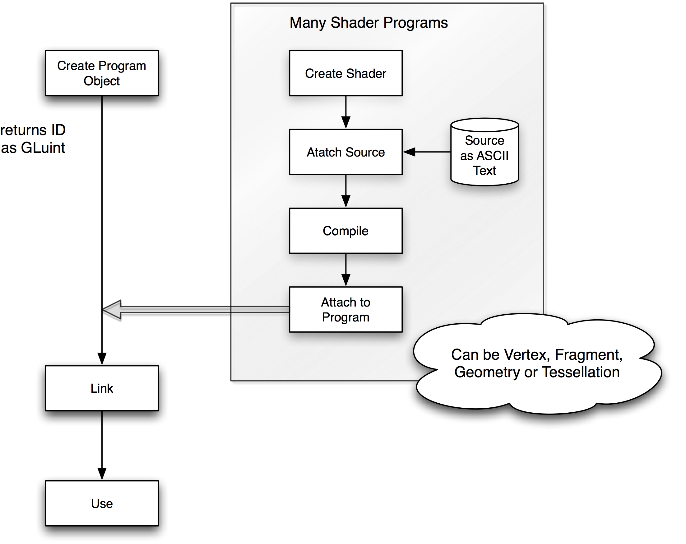
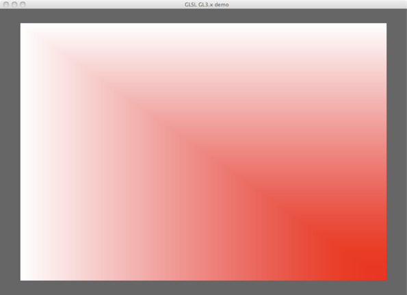
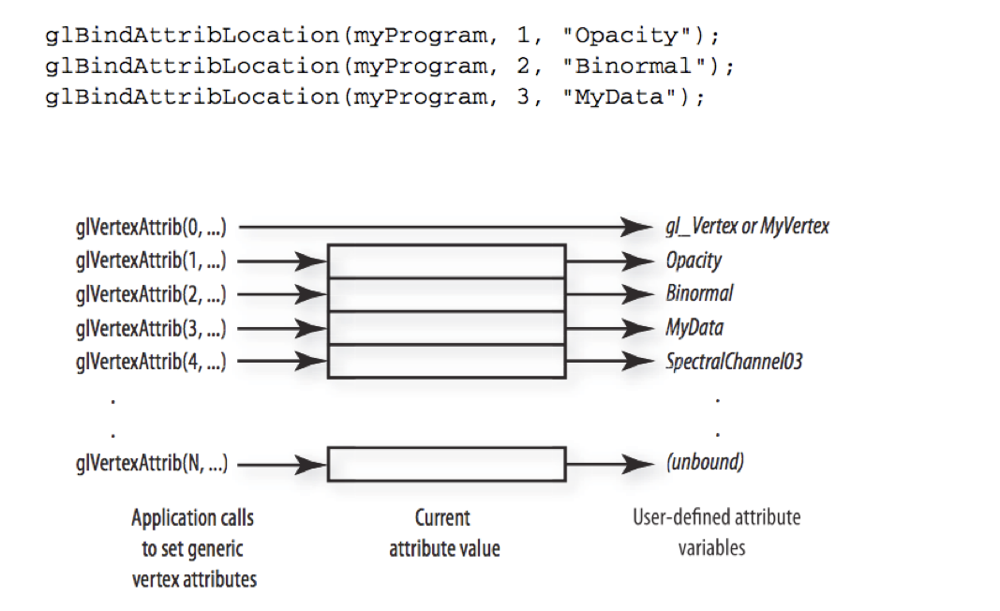

# OpenGL Shading Language API
Jon Macey

jmacey@bournemouth.ac.uk

---

## GLSL
- The OpenGL Shading language can be split into two sections,
- The actual programmable shading language we use to program the GPU and do Vertex, Fragment, Geometry (and in GLSL 4.0 tessellation shaders)
- We also have the OpenGL Shading Language API (this is the bit that allows our client side programs to download shaders to the GPU)
  - and once on the GPU communicate with them and control parameters.
- Initially we are going to concentrate on the creation and loading of a shader program
- Then we will investigate the language itself

--

## GLSL API
- The GLSL API is part of the OpenGL core specification and not the GLSL language
- At present the Core Spec contains about 40 commands to be used with GLSL, most of which are accessing data in the programmable units
- A few other commands are for the creation and loading of the shaders, as well as the management of them once created.
- The following flow chart shows the basic process of shader creation.

--

## GLSL API Process



--

## Overview (Rost 2009)
1. Create one or more (empty) shader objects with glCreateShader. 
2. Provide source code for these shaders with glShaderSource. 
3. Compile each of the shaders with glCompileShader. 
4. Create a program object with glCreateProgram. 
5. Attach all the shader objects to the program object with glAttachShader. 
6. Link the program object with glLinkProgram.
7. Install the executable program as part of OpenGL’s current state with glUseProgram.

--

## Shader Objects

> “The design of the OpenGL Shading Language API mimics the process of developing a C or C++ application. 
> The first step is to create the source code. 
> The source code must then be compiled, the various compiled modules must be linked, and finally the resulting code can be executed by the target processor”. (Rost 2009)

--

## [glCreateShader](https://www.opengl.org/sdk/docs/man4/html/glCreateShader.xhtml)

```
GLuint glCreateShader(GLenum shaderType);
type: {VERTEX, FRAGMENT, GEOMETRY}_SHADER,
    TESS_{EVALUATION, CONTROL}_SHADER
```

- Creates an empty shader object and returns a nonzero value by which it can be referenced. 
- A shader object maintains the source code strings that define a shader. 
- For now we will concentrate on VERTEX_SHADER and FRAGMENT_SHADER

--

## Shader Source
- The shader source is a simple array of strings (c style)
```
const GLchar **string
```
- We can define these any way we wish but usually are loaded in from a text file.
- GLSL 4.0 offers the ability to load binary source as well, however most companies will generate their own binaries (to prevent copying / inspection) then convert to text in program and load as strings etc.

--

## Shader Source
- vertex shader

```
#version 120
attribute vec3 inPosition;
attribute vec3 inColour;
varying vec3 vertColour;
void main() 
{
  gl_Position = vec4(inPosition, 1.0);
  vertColour = inColour;
}
```

- Fragment Shader

```
#version 120
varying vec3 vertColour;
void main() 
{
  gl_FragColor = vec4(vertColour,1.0);
}
```

--

##  Loading Shader Source from File

```
void Shader::load( std::string _name ) noexcept
{
  // see if we already have some source attached
  if(m_source.empty())
  {
    std::cerr<<"deleting existing source code\n";
    m_source.clear();
  }
  std::ifstream shaderSource(_name.c_str());
  if (!shaderSource.is_open())
  {
   std::cerr<<"File not found "<<_name.c_str()<<"\n";
   exit(EXIT_FAILURE);
  }
  // now read in the data
  m_source =  std::string((std::istreambuf_iterator<char>(shaderSource)), std::istreambuf_iterator<char>());
  shaderSource.close();
  // glShaderSource needs null terminated const char *
  m_source+='\0';
  const char* data=m_source.c_str();
  glShaderSource(m_shaderHandle , 1, &data,NULL);
  m_compiled=false;

  if (m_debugState == true)
  {
    printInfoLog(m_shaderHandle);
  }
}
```
- A function to load the shader source may look like the one above
- Note we load the file in one go using the istreambuf_iterator

--

## [glShaderSource](https://www.opengl.org/sdk/docs/man/html/glShaderSource.xhtml)
```
void glShaderSource(	GLuint shader,
                      GLsizei count,
                      const GLchar **string,
                      const GLint *length);
```
- shader is the id of the Shader created from the createShader function
- count indicates the number of shader source strings (if we set this to 1 we can assume only 1 string)
- string, an array of string containing source code
- length is the corresponding lengths of the strings above (NULL indicates that the strings are NULL terminated so we don’t need a length value)

--

## glShaderSource
- The flexibility of this function allows us to build complex source strings in our client side program and then load them in one go to the shader.
- GLSL has no #include but we could imitate this using the strings method.
- For example we could have a file shared with multiple shaders which we concatenate as a string to the strings loaded.
- This would then be loaded into the final shader source
- In the previous load function we only take 1 string and load that into the source value provided by the shaderID passed to the function.

--

## Shader Source
- The source code strings are not scanned or parsed when they are loaded to the shader, just copied to the shader
- An application can modify or free its copy of the source code strings immediately after the function returns.
- If we call glShaderSource on a Shader with existing source code attached the existing source code is replaced

--

## Compiling Shader Objects
- Once the source code is loaded we can compile the shader source and see if it passes.
- The compiled source will remain with the shader object until either the shader object is deleted or the shader is re-compiled
- Depending upon the type of shader being compiled we have different rules, and semantics. 
- This will be discussed in more detail once we look at the GLSL syntax.

--

## [glCompileShader](https://www.opengl.org/sdk/docs/man/html/glCompileShader.xhtml)
```
void glCompileShader(GLuint shader);
```
- Compiles the source code strings that have been stored in the shader object specified by shader.
- The compilation status is stored as part of the shader object’s state. This value is set to GL_TRUE if the shader was compiled without errors and is ready for use, and GL_FALSE otherwise. 
- It can be queried by calling glGetShader with arguments shader and GL_COMPILE_STATUS.
- A shader will fail to compile if it is lexically, grammatically, or semantically incorrect. 

--

## [ShaderInfoLog](https://www.khronos.org/opengles/sdk/docs/man/xhtml/glGetShaderInfoLog.xml)
- The shader info log is created for each compilation of the shader
- It gives the output of the compilation and can be used to determine shader compilation errors
- Or view warnings created from the compilation process.
- To access this log we use the following command
```
glGetShaderInfoLog
```
- The following code show a sample function to query the log and report back

--

```
void printInfoLog(const GLuint &_obj  )
{
  GLint infologLength = 0;
  GLint charsWritten  = 0;
  char *infoLog;

  glGetShaderiv(_obj, GL_INFO_LOG_LENGTH,&infologLength);
  std::cerr<<"info log length "<<infologLength<<"\n";
  if(infologLength > 0)
  {
    infoLog = new char[infologLength];
    glGetShaderInfoLog(_obj, infologLength, &charsWritten, infoLog);

    std::cerr<<infoLog<<std::endl;
    delete [] infoLog;
    glGetShaderiv(_obj, GL_COMPILE_STATUS,&infologLength);
    if( infologLength == GL_FALSE)
    {
      std::cerr<<"Shader compile failed or had warnings \n";
     // exit(EXIT_FAILURE);
    }
  }

}
```

---

## Linking and Using Shaders
> “Each shader object is compiled independently. To create a program,  applications need a mechanism for specifying a list of shader objects to be linked. You can specify the list of shaders objects to be linked by creating a program object and attaching to it all the shader objects needed to create the program”. (Rost 2009)

--

## [glCreateProgram](https://www.opengl.org/sdk/docs/man2/xhtml/glCreateProgram.xml)

- Creates an empty program object and returns a nonzero value by which it can be referenced. 
- A program object is an object to which shader objects can be attached.
- This provides a mechanism to specify the shader objects that will be linked to create a program. It also provides a means for checking the compatibility between shaders that will be used to create a program (for instance, checking the compatibility between a vertex shader and a fragment shader). 
- When no longer needed as part of a program object, shader objects can be detached.

--

## [glAttachShader](https://www.opengl.org/sdk/docs/man/html/glAttachShader.xhtml)
- Once a program object is created we can attach shader to the object.
- There is no rule about the sequence of operations, for example a shader with no source and not compiled may be attached to a program.
- There is no inherent limit to the amount of shader that may be attached to a Program Object.
- Also a Shader may be attached to many different Program Objects
- To attach a shader we use the following
```
void glAttachShader(	GLuint program,
 	                    GLuint shader);
```

--

## [glLinkProgram](https://www.opengl.org/sdk/docs/man/html/glLinkProgram.xhtml)
- To create a valid program, all the shader objects attached to a program object must be compiled, and the program object itself must be linked. 
- The link operation assigns locations for uniform variables, initialises user-defined uniform variables, resolves references between independently compiled shader objects, and checks to make sure the vertex and fragment shaders are compatible with one another. 
- To link a program object we use
```
void glLinkProgram(	GLuint program);
```

--

## Linking
- Linking will check to see if there is a valid VERTEX, FRAGMENT, GEOMETRY shader or combination of all
- If the link is successful the shader is capable of being enabled and used on the GPU
- To check the output of the link stage we use similar code to the checking of the compilation stage, but pass the keyword
- GL_LINK_STATUS to check to see if the link was successful.

--

## [glUseProgram](https://www.opengl.org/sdk/docs/man/html/glUseProgram.xhtml)
- Installs the program object specified by program as part of current rendering state.
- A program object contains an executable that will run on the vertex processor if it contains one or more shader objects of type GL_VERTEX_SHADER that have been successfully compiled and linked. 
- Similarly, a program object contains an executable that will run on the fragment processor if it contains one or more shader objects of subtype GL_FRAGMENT_SHADER that have been successfully compiled and linked.

--

## [glUseProgram](https://www.opengl.org/sdk/docs/man/html/glUseProgram.xhtml)
 
- If program contains shader objects of type GL_VERTEX_SHADER but it does not contain shader objects of type GL_FRAGMENT_SHADER, an executable is installed on the vertex processor but fixed functionality is used for fragment processing. 
- Similarly, if program contains shader objects of type GL_FRAGMENT_SHADER but it does not contain shader objects of type GL_VERTEX_SHADER, an executable is installed on the fragment processor but fixed functionality is used for vertex processing. 
- If program is 0, the programmable processors are disabled, and fixed functionality is used for both vertex and fragment processing.

--

## Cleaning Up
```
void glDeleteShader(GLuint shader);
void glDeleteProgram(GLuint program);
```
- Objects should be deleted when they are no longer needed, and deletion can be accomplished with the commands above.
- It is also possible to detach shaders and process program in a number of way to allow advance usage and flexibility, these are well documented in the OpenGL specification.
- To return to the OpenGL fixed functionality we can call the following command
```
glUseProgram(0);
```

---

## [Demo Program](https://github.com/NCCA/FirstShaderQt)


- This simple program attaches a vertex and fragment shader to a quad
- We will also introduce the use of VertexAttributes
- This is not a particularly good example but demonstrates some concepts of the GLSL API

--

## Vertex Shader

```
#version 400 core

layout (location = 0) in vec3  inPosition;
layout (location = 1) in vec3 inColour;
out vec3 vertColour;
void main()
{
    gl_Position = vec4(inPosition, 1.0);
    if (inPosition.x >0.0 && inPosition.y<0.5)
    vertColour = inColour;
    else vertColour=vec3(1,1,1);
}
```

--

## Fragment Shader
```
#version 400 core
in vec3 vertColour;
out vec4 fragColour;
void main()
{
  fragColour = vec4(vertColour,1.0);
}
```

--

## Loading the Shader from a string

```
void OpenGLWindow::createShader()
{
 // here we create a program
 m_shaderID=glCreateProgram();
 // some raw data for our vertex shader
 const std::string vertex =
 R"(
          #version 400 core

          layout (location = 0) in vec3  inPosition;
          layout (location = 1) in vec3 inColour;
          out vec3 vertColour;
          void main()
          {
             gl_Position = vec4(inPosition, 1.0);
             if (inPosition.x >0.0 && inPosition.y<0.5)
              vertColour = inColour;
             else vertColour=vec3(1,1,1);
          }
  )";
  // create a Vertex shader object
  GLuint vertexID=glCreateShader(GL_VERTEX_SHADER);
  // attatch the shader source we need to convert to GL format
  const char* source=vertex.c_str();
  glShaderSource(vertexID,1,&source,NULL);
  // now compile the shader
  glCompileShader(vertexID);
  std::cerr<<"compiling vertex shader\n";
  printInfoLog(vertexID);

  // some source for our fragment shader
  const std::string fragment =
  R"(
          #version 400 core
          in vec3 vertColour;
          out vec4 fragColour;
          void main()
          {
            fragColour = vec4(vertColour,1.0);
          }
  )";
// now create a fragment shader
  GLuint fragmentID=glCreateShader(GL_FRAGMENT_SHADER);
  // attatch the shader source
  source=fragment.c_str();
  glShaderSource(fragmentID,1,&source,NULL);
  // compile the shader
  std::cerr<<"compiling frag shader shader\n";
  glCompileShader(fragmentID);
  printInfoLog(fragmentID);
  // now attach to the program object
  glAttachShader(m_shaderID,vertexID);
  glAttachShader(m_shaderID,fragmentID);
//    glBindAttribLocation(m_shaderID,0,"inPosition");
//    glBindAttribLocation(m_shaderID,1,"inColour");

  // link the program
  glLinkProgram(m_shaderID);
  // and enable it for use
  glUseProgram(m_shaderID);
  // now tidy up the shaders as we don't need them
  glDeleteShader(vertexID);
  glDeleteShader(fragmentID);
}
```

--

## Create A quad

```
void OpenGLWindow::createQuad()
{
  // a simple quad object
  std::array<float,18> vert;
  const static float s=0.8f;
  vert[0] =-s; vert[1] =  s; vert[2] =-1.0;
  vert[3] = s; vert[4] =  s; vert[5] =-1.0;
  vert[6] = -s; vert[7] = -s; vert[8]= -1.0;

  vert[9] =-s; vert[10]= -s; vert[11]=-1.0;
  vert[12] =s; vert[13]= -s; vert[14]=-1.0;
  vert[15] =s; vert[16]= s; vert[17]=-1.0;
  // allocate a VertexArray
  glGenVertexArrays(1, &m_vaoID);
  // now bind a vertex array object for our verts
  glBindVertexArray(m_vaoID);
  // now we are going to bind this to our vbo
  GLuint vboID;
  glGenBuffers(1, &vboID);
  // now bind this to the VBO buffer
  glBindBuffer(GL_ARRAY_BUFFER, vboID);
  // allocate the buffer datra
  glBufferData(GL_ARRAY_BUFFER, 18*sizeof(GLfloat), &vert[0], GL_STATIC_DRAW);
  // now fix this to the attribute buffer 0
  glVertexAttribPointer(0, 3, GL_FLOAT, GL_FALSE, 0, 0);
  // enable and bind this attribute (will be inPosition in the shader)
  glEnableVertexAttribArray(0);
  glBindVertexArray(0);

}
```

--

## Vertex Attributes
- Last week we looked at glVertexPoint, glNormalPointer and glColorPointer.
- I pointed out that these functions were marked for deprecation and we would be using a different approach.
- OpenGL >=2.0 and glsl >=1.2 allow the specification of generic vertex attributes and we can bind them in our client side program
- The max number of vertex attributes can be determined by the following code (16 in the case of this Mac)
```
int n;
glGetIntegerv(GL_MAX_VERTEX_ATTRIBS, &n);
std::cout<<"MAX Vert Attribs"<<n<<"\n";
```

--

## Vertex Attributes
- OpenGL provides a small number of generic locations, sometimes called CURRENT VERTEX STATE, for passing in vertex attributes. 
- Each location is numbered and has room to store up to four floating-point components (i.e., it is a vec4). 
- An implementation that supports 16 attribute locations will have them numbered from 0 to 15.
- An application can pass a vertex attribute into any of the generic numbered slots by using one of the following functions:

```
void glVertexAttrib{1|2|3|4}{s|f|d}(GLuint index, TYPE v)
void glVertexAttrib{1|2|3}{s|f|d}v(GLuint index, const TYPE *v)
void glVertexAttrib4{b|s|i|f|d|ub|us|ui}v(GLuint index, const TYPE *v)
```

--

## [glVertexAttrib](https://www.opengl.org/sdk/docs/man/html/glVertexAttrib.xhtml)
```
glVertexAttrib3f(1,1,0,0); 
```
- If we bind the attribute index 1 to our colour, the code above would set the colour attribute to red
- This will be used for each vertex passing through the vertex processor
- This is fine for attributes which do not change however a more flexible approach is to pass an array of attributes and bind them 

--

## [Binding Attributes in Shader](https://tangentvector.wordpress.com/2013/02/25/location-bindings/)
- There are two methods of binding the attributes in a shader
- The first way is to let the linker assign the bindings automatically. 
- In this case, the application would need to query OpenGL after linking to determine the generic vertex indices that were assigned and then would use these indices when passing the attributes to OpenGL.

--

## [Binding Attributes in Shader](https://tangentvector.wordpress.com/2013/02/25/location-bindings/)

- The second way is for the application to choose the index value of the generic vertex attribute to be used and explicitly bind it to a specific attribute variable in the vertex shader by using the following function before linking occurs
- see [here](https://www.opengl.org/wiki/Vertex_Shader#Inputs)

--

## [glBindAttribLocation](https://www.khronos.org/opengles/sdk/docs/man/xhtml/glBindAttribLocation.xml)
- program is the shader program to bind
- index is the index to bind the name too
- name is a null terminated string to identify the attribute in the shader
- depending upon the glsl version we define as follows in the shader

```
#version 120
attribute vec3 inPosition;
attribute vec3 inColour;
#version 130 and above
in vec3 inPosition; 
in vec3 inColour;
```

```
#version 400
layout (location = 0) in vec3 inPosition; 
layout (location = 1) in vec3 inColour;
```

--

## Binding Attributes in Shader

- After a program has been linked it is still possible to access the attributes using glGetAttribLocation
- This will return a location id to be used in the bind

--

## Drawing
- Once the data is bound drawing is quite simple
- We bind and enable the vertex arrays and then call the appropriate DrawArrays command.
```
void OpenGLWindow::paintGL()
{
  glClear(GL_COLOR_BUFFER_BIT | GL_DEPTH_BUFFER_BIT);
  // set the first attrib (1) to 1,0,0 red
  glVertexAttrib3f(1,1,0,0);
  glViewport(0,0,m_width,m_height);
  glBindVertexArray(m_vaoID);		// select first bind the array
  glDrawArrays(GL_TRIANGLES, 0, 6);	// draw object
}
```

---

## [ngl::ShaderLib](https://nccastaff.bournemouth.ac.uk/jmacey/GraphicsLib/html/classngl_1_1_shader_lib.html)

- ngl::ShaderLib class is used to wrap up a lot of the functions needed for OpenGL Shader communication
- It can load shaders from text files, use JSON files for more complex shaders
- It can set Uniforms using overlaoded methods and text name lookups
- can access the raw OpenGL shader ID for more complex operations
- the following video show some of this in action.


---

## References
- Rost, R, Licea-Kane B (2009). OpenGL Shading Language. 3rd. ed. New York: Addison Wesley.
- OpenGL Architecture Review Board, OpenGL Reference Manual, Fourth Edition: The Official Reference to OpenGL, Version 1.4, Editor: Dave Shreiner, Addison-Wesley, Reading, Massachusetts, 2004.
- Segal, Mark, and Kurt Akeley, The OpenGL Graphics System: A Specification (Version 3.1), Editor (v1.1): Chris Frazier, (v1.2–3.1): Jon Leech, (v2.0): Jon Leech and Pat Brown, March 2008. www.opengl.org/documentation/spec.html
