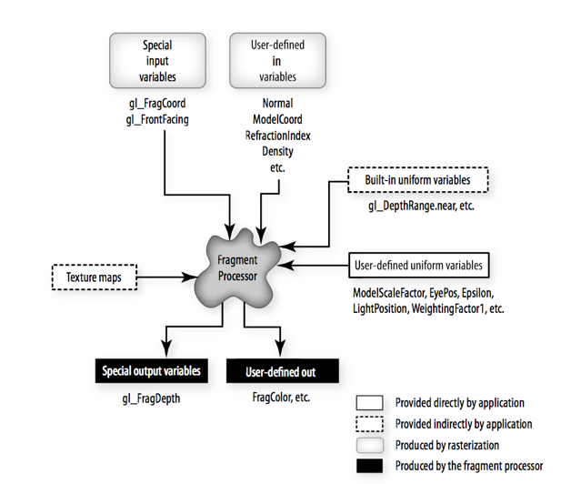

# The OpenGL Shading Language 
Jon Macey

jmacey@bournemouth.ac.uk

---

## GLSL
- In the previous lecture we looked at the process of loading shaders into the programmable hardware (GPU)
- The actual language syntax of GLSL and the principles behind it will be covered in this lecture
- First we will look at the different processors in the GPU

--

## OpenGL Shader Pipeline


--

## Vertex Processor
- The vertex processor is a programmable unit that operates on incoming vertices and their associated data. 
- Compilation units written in the OpenGL Shading Language to run on this processor are called vertex shaders.  
- The vertex processor operates on one vertex at a time. It does not replace graphics operations that require knowledge of several vertices at a time.

--

## Vertex processor(Rost 2009)


--

## Geometry Processor
- The geometry processor is a programmable unit that operates on data for incoming vertices for a primitive assembled after vertex processing and outputs a sequence of vertices forming output primitives.
- A single invocation of the geometry shader executable on the geometry processor will operate on a declared input primitive with a fixed number of vertices.  
- This single invocation can emit a variable  number of vertices that are assembled into primitives of a declared output primitive type and passed to subsequent pipeline stages.

--

## Fragment Processor
- The fragment processor is a programmable unit that operates on fragment values and their associated data
- A fragment shader cannot change a fragment's (x, y) position. 
- Access to neighbouring fragments is not allowed. 
- The values computed by the fragment shader are ultimately used to update framebuffer memory or texture memory, depending on the current OpenGL state and the OpenGL command that caused the fragments to be generated.

--

## What is a Fragment?
- A rasterized element (pre­ pixel)


--

## The Fragment Processor (Rost 2009)



--

## Vertex Processor Input
- Vertex shader is executed once each time a vertex position is specified
  - glDrawArrays or other vertex array calls
- Per-vertex input values are called “attributes”
  - colour, normal, position, arbitrary values
- Change every vertex
- Passed through normal OpenGL mechanisms (per-vertex API or vertex arrays)
- More persistent input values are called “uniforms”
  - lights, material properties, arbitrary values
  - Constant across at least one primitive, typically constant for many primitives
- Passed through new OpenGL API calls (glUniform ....)

--

## Vertex Processor Output
- Vertex shader uses input values to compute output values
  - Vertex shader must compute gl_Position
  - Mandatory, needed by the rasterizer
  - Usually this will be transformed by our own MVP matrix
- Vertex shader may compute:
  - gl_ClipVertex (if user clipping is to be performed)
  - gl_PointSize (if point parameters are to be used)

--

## Vertex Processor Output
- Other output values are called “varying” variables
  - E.g., colour, texture co-ordinates, arbitrary data
  - Will be interpolated in a perspective-correct fashion across the primitives
  - Defined by the vertex shader
  - Can be of type float, vec2, vec3, vec4, mat2, mat3, mat4, or arrays of these

--

## Vertex Processor Output
- Output of vertex processor feeds into OpenGL fixed functionality
  - If a fragment shader is active, output of vertex shader must match input of fragment shader
  - If no fragment shader is active, output of vertex shader must match the needs of fixed functionality fragment processing

--

## Fragment Processor Input
- At it’s simplest level the output of the Vertex Processor is the input to the fragment (if we ignore geo and tess shaders)
- Compatibility is checked when linking occurs
- Compatibility between the two is based on varying variables that are defined in both shaders and that match in type and name
- Fragment shader is executed for each fragment produced by rasterization
- For each fragment, fragment shader has access to the interpolated value for each varying variable
  - Colour, normal, texture coordinates, arbitrary values

--

## Fragment Processor Input

- Fragment shader may access:
- gl_FrontFacing – contains “facingness” of primitive that produced the fragment
- gl_FragCoord – contains computed window relative coordinates x, y, z, 1/w
- Uniform variables are also available

--

### Fragment Processor Output (deprecated)
- Output of the fragment processor goes on to the fixed function fragment operations and frame buffer operations using built-in variables
- gl_FragColor – computed R, G, B, A for the fragment
- gl_FragDepth – computed depth value for the fragment
- Both values are destined for writing into the frame buffer if back end tests all pass
- Clamping or format conversion to the target buffer is done automatically outside of the fragment shader

--

## Fragment Processor
- The fragment processor executes the fragment shader
- The fragment processor has knowledge of only the current fragment
- An implementation may have multiple fragment processors operating in parallel
- The fragment processor in glsl 150 and above use generic output attributes, by default the first attribute is the fragment colour, however we can bind different attributes using 

```
glBindFragDataLocation(Program, 0, "fragColor");
```

---

##  GLSL Language Syntax
- GLSL Language syntax is very similar to that of Renderman SL
- Most of the usual data types are present
- Other elements are available to fit into the GL pipeline

--

## Shader Basic Structure
- A shader is a sequence of declarations and function bodies
- Curly braces are used to group sequences of statements
- A shader must have a “main” function
- Statements end with a semi-colon

--

## pre-processor
- The GLSL compiler has a pre-processor just like a normal C compiler.
- It has the following keywords 

```
#define
#undef #if #ifdef
#ifndef #else
#elif #endif
#error #pragma
#extension
#version
#line
```

--

## ```#version```
- ```#version``` is used to determine what version of GLSL is the minimum required to compile the shader.
- The language version a shader is written to is specified by

```
#version number (optional) profile
```

- If the optional profile argument is provided, it must be the name of an OpenGL profile. 
- Currently, there are three choices:
  -  core
  -  compatibility
  -  es

--

## ```#pragma```
- Used to enable compiler options / features
- Common ones used are

```
#pragma optionNV(fastmath on)
#pragma optionNV(fastprecision on)
#pragma optionNV(ifcvt none)
#pragma optionNV(inline all)
#pragma optionNV(strict on)
#pragma optionNV(unroll all)
```

--

## Type Qualifiers
- There are many different type qualifiers in GLSL for a thorough examination of them see [here](http://tinyurl.com/zn8lzuh)
- Typical use for these qualifiers are to tell glsl what direction the data is coming from (in / out)
- How it changes as the shader is executed
- How and if interpolation should be used.
- Some versions of GLSL (ES for example) will need these specified by default. 

--

## Vertex shader attribute index
- Vertex shader inputs can specify the attribute index that the particular input uses. 
- This is done with this syntax:

```
layout(location = attribute index) in vec3 position;              
```

- This means that we don’t need to use  glBindAttribLocation 
- If you try to combine the two and they conflict, the layout qualifier always wins.

--

## Vertex shader attribute index
- Attributes that take up multiple attribute slots will be given a sequential block of that number of attributes in order starting with the given attribute. 
- For example:
```
layout(location = 2) in vec3 values[4];
```
- This will allocate the attribute indices 2, 3, 4, and 5.

---

## scalars
- The basic non-tuple data types in GLSL are
  - ```bool​``` : conditional type, values may be either true or false
  - ```int​``` : a signed, two's complement, 32-bit integer
  - ```uint​``` : an unsigned 32-bit integer
  - ```float​``` : a floating point number
  - ```double​``` : a double-precision floating-point number

--

## Vectors
- Each of the scalar types, including booleans, have 2, 3, and 4-component vector equivalents. 
- The n digit below can be 2, 3, or 4:
  - ```bvecn``` : a vector of booleans
  - ```ivecn``` : a vector of signed integers
  - ```uvecn``` : a vector of unsigned integers
  - ```vecn``` : a vector of single-precision floating-point numbers
  - ```dvecn``` : a vector of double-precision floating-point numbers

--

## [Swizzling](http://tinyurl.com/kwf845e)
- Vector component access can be achieved in a number of ways
- You can use x, y, z, or w, referring to the first, second, third, and fourth components, respectively.

```
vec4 someVec;
someVec.x + someVec.y;
vec2 someVec;
vec4 otherVec = someVec.xyxx;
vec3 thirdVec = otherVec.zyy;
vec4 someVec;
someVec.wzyx = vec4(1.0, 2.0, 3.0, 4.0);
someVec.zx = vec2(3.0, 5.0);
```

--

## Swizzling
- You cannot use the same swizzle component twice. So ```someVec.xx = vec2(4.0, 4.0);```  is not allowed.
- Additionally, there are 3 sets of swizzle masks. 
- You can use ```xyzw```, ```rgba``` (for colors), or ```stpq``` (for texture coordinates). 
- These three sets have no actual difference they're just syntactic sugar. (but try and use the correct one in context)
- You cannot combine names from different sets in a single swizzle operation. So ```.xrs``` is not a valid swizzle mask.

--

## Swizzling
- Vector components can be referred to using array syntax or a single letter:
```
[0], [1], [2], [3]
r, g, b, a
x, y, z, w
s, t, p, q
```
- This syntax can be used to extract, duplicate, or swizzle components
```
vec4 pos = vec4(1.0, 2.0, 3.0, 4.0);
vec4 swiz= pos.wzyx; // swiz = (4.0, 3.0, 2.0, 1.0) 
vec4 dup = pos.xxyy; // dup = (1.0, 1.0, 2.0, 2.0)
pos.xw = vec2(5.0, 6.0); // pos = (5.0, 2.0, 3.0, 6.0) 
pos.wx = vec2(7.0, 8.0); // pos = (8.0, 2.0, 3.0, 7.0) 
pos.xx = vec2(3.0, 4.0); // illegal - 'x' used twice
```

--

## Matrices
- All matrix types are floating-point, either single-precision or double-precision. 
- Matrix types are as follows, where n and m can be the numbers 2, 3, or 4:
  - matnxm : A matrix with n columns and m rows. 
  - OpenGL uses column-major matrices, which is standard for mathematics users. Example: mat3x4 .
  - matn : A matrix with n columns and n rows. Shorthand for matnxn

--

## Matrices
- Swizzling does not work with matrices. 
- Instead [] array access is used

```
mat3 m1;
m1[1] = vec3(1.0, 2.0, 0.0);
m1[2][0] = 16.0;

mat3 m1;
m1[1].yzx = vec3(3.0, 1.0, 2.0);
```

--

## Matrix Components
- Matrix components can be accessed using array subscripting syntax
- A single subscript selects a single column
- A second subscript selects a component within a column

```
mat4 m;
m[1] = vec4(2.0); // sets the second column to all 2.0 
m[0][0] = 1.0; // sets the upper left element to 1.0 
m[2][3] = 2.0; // sets the 4th element of the third
               // column to 2.0
```

--

## structs
```
struct surfaceMaterial
{
float ambient;
float diffuse;
float specular;
vec3  baseColor;
}surf;
surfMaterial surf1, surf2;
```
- User-defined types can be created using struct with previously defined types
- Creates a new type called “surfaceMaterial”
- Defines variables of this type called “surf”, “surf1”, and “surf2”
- Structures can include arrays
- Fields are selected using the period ( . )

--

## Structure Constructors
- Constructor for a structure is available once structure is defined
- Example:

```
struct light
{
    float intensity;
    vec3 position;
};
light newLight = light(3.0, vec3(1.0, 2.0, 3.0));
```

--

## Arrays
```
float ramp[10];
vec4 colors[4];
bool results[3];
```
- structures can be aggregated into arrays
- Only 1D arrays are supported (GLSL 4.3 has multi-dimensional arrays but not all gpu’s support this)
- Size of array can be expressed as an integral constant expression within square brackets ([ ])
- Arrays can be declared without a size, and then re-declared later with the same type and a size
- Using an index that goes beyond an array’s bounds results in undefined behaviour

--

## Arrays
- The length of an array variable can be computed with the .length()  function. 

```
uniform float myValues[12];
...
myValues.length(); //Returns 12
```

---

## Type Qualifiers
- ```const``` variable is a constant and can only be written during its declaration
- ```in``` per-vertex data values provided to the vertex shader
- ```out``` per-vertex data values passed from vertex to fragment shader
- ```uniform``` (relatively) constant data provided by the application or by OpenGL for use in the shader

--

## Type Qualifiers (Functions)

- ```in``` for function parameters copied into a function, but not copied out
- ```out``` for function parameters copied out of a function, but not copied in
- ```inout``` for function parameters copied into and out of a function


---

##  Function Examples
- Declaration

```
vec3 computeColor (in vec3 c1, in vec3 c2); 
float radians (float degrees);
```
- Definition

```
float myFunc (in float f1, // f1 is copied in
              inout float f2) // f2 is copied in and out
{
  float myResult;
  // do computations
  return myResult; 
}
```

---

## Vertex Shader Built-in Variables

- The following special variables are available in a vertex shader:

```
vec4 gl_Position; // must be written to 
float gl_PointSize; // may be written to 
vec4 gl_ClipVertex; // may be written to
```

- Every execution of a vertex shader must write the homogeneous vertex position into gl_Position
- Vertex shaders may write the size of points to be rasterized (measured in pixels) into the built-in variable gl_PointSize
- Vertex shaders may write the transformed coordinate to be used in conjunction with user clipping planes into gl_ClipVertex

--

## Vertex Shader Built-in Attributes
- The following are available from a vertex shader for accessing standard OpenGL vertex attributes, however they are deprecated in the latest standard.

```
attribute vec4  gl_Color;
attribute vec4  gl_SecondaryColor;
attribute vec3  gl_Normal;
attribute vec4  gl_Vertex;
attribute vec4  gl_MultiTexCoord0;
attribute vec4  gl_MultiTexCoord1;
attribute vec4  gl_MultiTexCoord2;
attribute vec4  gl_MultiTexCoord3;
attribute vec4  gl_MultiTexCoord4;
attribute vec4  gl_MultiTexCoord5;
attribute vec4  gl_MultiTexCoord6;
attribute vec4  gl_MultiTexCoord7;
attribute float gl_FogCoord;
```

---

## Built-in Functions
- **Trigonometry/angle**  radians, degrees, sin, cos, tan, asin, acos, atan
- **Exponential** pow, exp2, log2, sqrt, inversesqrt
- **Common** abs, sign, floor, ceil, fract, mod, min, max, clamp, mix, step, smoothstep
- **Geometric and matrix** length, distance, dot, cross, normalize, ftransform, faceforward, reflect, matrixCompMult

--

## Built-in Functions


- **Vector relational** lessThan, lessThanEqual, greaterThan, greaterThanEqual, equal, any, all
- **Texture lookup** texture1D/2D/3D, texture1D/2D/3DProj, textureCube, texture1D/2DShadow, texture1D/2DShadowProj
- **Fragment shader only** dFdx, dFdy, fwidth
- **Noise** noise1/2/3/4 **(Never seen this implemented!)**

---

## References
- Rost, R, Licea-Kane B (2009). OpenGL Shading Language. 3rd. ed. New York: Addison Wesley.
- OpenGL Architecture Review Board, OpenGL Reference Manual, Fourth Edition: The Official Reference to OpenGL, Version 1.4, Editor: Dave Shreiner, Addison-Wesley, Reading, Massachusetts, 2004.
- Segal, Mark, and Kurt Akeley, The OpenGL Graphics System: A Specification (Version 3.1), Editor (v1.1): Chris Frazier, (v1.2–3.1): Jon Leech, (v2.0): Jon Leech and Pat Brown, March 2008. www.opengl.org/documentation/spec.html
