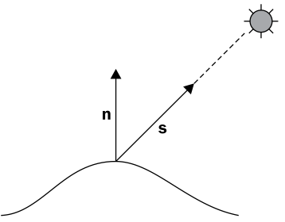

# OpenGL Shading Pipeline
## Colour, Material and Lights 
Jon Macey

jmacey@bournemouth.ac.uk

---

## Text Books


--

## Shading In OpenGL
- OpenGL 1.x - 2.x OpenGL and compatability profile has a fixed functionality shading pipeline that allows the specification of Materials and Lights using the following commands
  - ```glColor*```
  - ```glLight*```
  - ```glMaterial*```
- The fixed shading pipeline uses a basic blinn style shading model with up to 8 lights.

--

# GLSL Shading
- With the use of GLSL we can create any shading model we wish and pass to the shader information about lights and materials
- In OpenGL 3/4.x the gl calls mentioned in the previous slide are deprecated and the programmer has to develop their own method of passing data

---

## Shading Models
- Shading / Illumination model in CG are rough approximations of how the physics / lighting of real surfaces work
- We can generate quite complex models to achieve photo-realistic result however there will always be a time / quality tradeoff.
- For interactive CG we need speed / high frame rate so raytracing etc is not an option without specialist hardware.

--

## Lights and Materials
- Illumination models are used to generate the colour of an object’s surface at a given point on that surface.
- The factors that govern the illumination model determine the visual representation of that surface. 
- Due to the relationship defined in the model between the surface of the objects and the lights affecting it, illumination models are also called shading models or lighting models.
- We need to define both lights and materials for this to work

--

## Lights
- The physics of light is a complex subject.
- Shading models are approximations of these laws, in varying levels of realism/complexity. 
- This is based on the fact that surfaces, for the most part, are approximations. 
- Micro facet details defines the lighting characteristics of surface colour. 
- CG Object representation (usually) does not transcend to that level.

---

## Constant Shading

- The simplest shading model is a simple constant illumination.
- The model represents an unrealistic assumption in that the surface is self illuminating (the colour of this constant shading is defined by the user).
- We can define this as an equation 
$$ I=K_i $$
- Where I is the intensity and K is a constant colour value

--

## Simple GLSL Shader
- There are two methods of creating a GLSL shader for constant colour.
- We can pass a colour value to the shader using a Uniform attribute
- Or we can use the deprecated gl_Color shader attribute
- This will use the currently active colour from the glColor3x calls

--

## Colour in OpenGL
- OpenGL specifies Colour using either a 3 or 4 tuple value. to represent r,g,b or r,g,b,a values
- or Colour Index mode which uses a user defined palette to set the current colour.
- As RGBA is the most common this will be discussed in most depth.
- to set the current colour the command ```glColor[3/4][b,s,i,f,d,ub,us,ui](v)``` is used

--

## Colour in OpenGL

```
// set colour using direct values
glColor3f(1.0f,0.0f,0.0f);
// or using an array
GLfloat col[]={1.0,0.0,0.3,1.0}; 
glColor4fv(col);
```

--

## Colour state values

- The colour acts as a typical OpenGL state variable, so the colour value is retain until another call to glColor.
- depending upon the Shade model used the colour for each vertex will be calculated per vertex based on the current colour state.

--

## Colour state values


- If the GL_FLAT shade model is set each face in a model will have the same colour (i.e. the last colour called using glColor3f)
- if GL_SMOOTH is used the colour will be interpolated for each set vertex colour across the face


--

## Fragment Shaders
- compatability profile
```
// in client program
glColour3f(1.0f,0.0f,0.0f);
// fragment shader
void main () 
{
  gl_FragColor = gl_Color;
}
```
- core profile
```
// in client program set uniform
GLint colourLoc=glGetUniformLocation(fragShader,"colour"); 
glUniform3f(colourLoc,1.0f,0.0f,0.0f);
// fragment shader
layout (location =0) out vec4 fragColour;
uniform vec3 colour;
void main () 
{
  fragColor.rgb = colour;
}
```


---

## Constant Illumination

- This simple equation has no reference to light sources, and as such every point on the object has the same intensity. 
- This equation need only be calculated once per object.
- This model is good for simple wire frame or line drawing but not much use for anything else

--

## Shaders
- vertex shader

```
#version 330 core
uniform mat4 MVP;
/// @brief the vertex passed in
layout (location=0) in vec3 inVert;
void main()
{
  norm = inNormal;
  gl_Position = MVP*vec4(inVert,1);
}

```

- fragment shader

```
#version 330 core
uniform vec4 Colour;
/// @brief our output fragment colour
layout (location = 0) out vec4 fragColour;

void main ()
{
  fragColour = Colour;
}
```

--

## nglColourShader
- For ease of use ngl has a built in colour shader.
- It is loaded when the ShaderLib is constructed and can be activated with ```->use(“nglColourShader”)```
- It has one vec4 attribute called ```Colour``` which is used to set the colour component

---

## Diffuse Lighting Model

- Diffuse reflections consider point lights to generate shading properties that change in colour intensity across the surface of an object in relation to light sources.
- The simplest of these models is the Lambert Illumination Model (sometimes called cosine shading)
- In this model light is reflected with equal intensity in all directions (isotropic). 
- The distribution is a basic consideration towards surface detail

--

### [Lambert’s Law](https://en.wikipedia.org/wiki/Lambert's_cosine_law)

- states that the intensity of illumination on a diffuse surface is proportional to the cosine of the angle generated between the surface normal vector and the surface to the light source vector.
- The only data used in this equation is the surface normal and a light vector that uses the light source position(taken as a point light for simplicity). 
- The intensity is irrespective of the actual viewpoint, hence the illumination is the same when viewed from any direction.

--

## Lambert’s Model
- The equation for Lambert’s illumination model is:

$$ I=I_p k_d \cos(\theta) $$

- $ I_p $ is the intensity of the point light source
- $ K_d $ is the material diffuse reflection coefficient  the amount of diffuse light reflected.
- As we have two vectors (Normal and Light ) we can use the following 

$$
I = I_p K_d (\mathbf{N} \cdot \mathbf{L})
$$

--

## [Converting To GLSL](https://github.com/NCCA/ShadingModels/tree/master/PerVertexDiffuse)
- In the following example
  - ```vec3 lightPos``` used for the light position
  - ```vec3 Kd``` is the diffuse reflection co-efficient
  - ```vec3 Ld``` is the Light source intensity
- These will be set as uniforms in the client app and used in the following shader

--

## [Per Vertex Diffuse](https://github.com/NCCA/ShadingModels/blob/master/PerVertexDiffuse/shaders/PerVertDiffuseVert.glsl)

```
#version 330 core
// this shader is modified from the OpenGL Shading Language cookbook
/// @brief the vertex passed in
layout (location =0) in vec3 inVert;
/// @brief the normal passed in
layout (location =2) in vec3 inNormal;
/// @brief the in uv
layout( location=1)in vec2 inUV;

// transform matrix values
uniform mat4 MVP;
uniform mat3 normalMatrix;
uniform mat4 MV;
uniform vec3 lightPos; // Light position in eye coords.
uniform vec3 Kd;           // Diffuse reflectivity
uniform vec3 Ld;            // Light source intensity
// light output per vert
 out vec3 lightIntensity;

void main()
{
	// Convert normal and position to eye coords
  vec3 tnorm = normalize( normalMatrix * inNormal);
  vec4 eyeCoords = MV * vec4(inVert,1.0);
	vec3 s = normalize(vec3(lightPos - eyeCoords.xyz));
	// The diffuse shading equation
  lightIntensity = Ld * Kd * max( dot( s, tnorm ), 0.0 );
	// Convert position to clip coordinates and pass along
	gl_Position = MVP*vec4(inVert,1.0);
}
```

--

## How it works


- The diffuse reflection is computed in eye coordinates by first transforming the normal vector using the normal matrix.
- Note that the normalisation here may not be necessary if your normal vectors are already normalised and the normal matrix does not do any scaling.

--

## How it works

- The normalMatrix is calculated in the client program as follows
```
void NGLScene::loadMatricesToShader()
{
  ngl::ShaderLib *shader=ngl::ShaderLib::instance();

  ngl::Mat4 MV;
  ngl::Mat4 MVP;
  ngl::Mat3 normalMatrix;
  MV= m_mouseGlobalTX*m_cam.getViewMatrix();
  MVP=MV*m_cam.getProjectionMatrix() ;
  normalMatrix=MV;
  normalMatrix.inverse();
  normalMatrix.transpose();
  shader->setUniform("MVP",MVP);
  shader->setUniform("MV",MV);
  shader->setUniform("normalMatrix",normalMatrix);
  shader->setUniform("lightPos",m_lightPosition);
}
```

--

## [normal matrix](http://www.lighthouse3d.com/tutorials/glsl-tutorial/the-normal-matrix/)
- The normal matrix is typically the inverse transpose of the upper-left 3x3 portion of the model-view matrix.
- The overloaded = operator of the Mat3 = Mat4 in ngl copies the 3x3 portion
- We use the inverse transpose because normal vectors transform differently than the vertex position
- This then modifies the normals if the object is scaled etc
- see  [here](http://www.lighthouse3d.com/tutorials/glsl-tutorial/the-normal-matrix/) for more details

--

## How it works
- The next step converts the vertex position to eye (camera) coordinates by transforming it via the model-view matrix. 
- Then the direction towards the light source is calculated by subtracting the vertex position from the light position and storing the result in s.
- Finally the light intensity is calculated using the lambert model

--

## How it works
- The max function is used so that if the dot product is less than zero, then the angle between the normal vector and the light direction is greater than 90 degrees.
- This means that the incoming light is coming from inside the surface. 
- Since such a situation is not physically possible we use a value of 0.0. 
- However, you may decide that you want to properly light both sides of your surface, in which case the normal vector needs to be reversed for those situations where the light is striking the back side of the surface

--


## [Fragment Shader](https://github.com/NCCA/ShadingModels/blob/master/PerVertexDiffuse/shaders/PerVertDiffuseFrag.glsl)

- Since LightIntensity is an output variable from the vertex shader, its value is interpolated across the face and passed into the fragment shader. The fragment shader then simply assigns the value to the output fragment.

```
#version 330 core

 in vec3 lightIntensity;
/// @brief our output fragment colour
layout (location =0)out vec4 fragColour;

void main ()
{
  fragColour=vec4(lightIntensity,1.0);
}

```


--

## nglDiffuseShader
- ngl has a built in diffuse shader designed to be used with the built in primitives
- The following uniforms are used
  - ```mat4 MVP``` transform for vertex
  - ```mat3 normalMatrix``` transform for normals
  - ```vec4 Colour``` the diffuse surface colour
  - ```vec3 lightPos``` the light position in eye cords
  - ```vec3 lightDiffuse``` the light diffuse colour value

--

## Flat Shading


- The output of the shader is interpolated, by changing the qualifier of the lightIntensity variable to the following (in both shaders) we get flat shading

```
// vertex shader
flat out vec3 lightIntensity;
// frag shader
flat in vec3 lightIntensity;
```

---

## ADS Shading
- The Ambient, Diffuse Specular model of shading combines the two previous models (Constant and Diffuse)
- With a new Specular component, this component is viewer dependant so we also need to know the position of the eye
- This is a basic Blinn / Phong Reflectance model.

--

## Ambient Model
$$ I_a = L_a K_a $$

- This element is used to brighten dark areas and is an unrealistic model of Ambient Lighting
  - $ La $ the light ambient intensity
  - $ Ka $ the surface ambient reflectance

--

## Diffuse Component



$$ I_d = L_d K_d ( \mathbf{s} \cdot \mathbf{n}) $$

--

## Specular Component

- The specular component is used for modelling the shininess of a surface. 
- When a surface has a glossy shine to it, the light is reflected off of the surface in a mirror-like fashion. 

--

## Specular Component

- The reflected light is strongest in the direction of perfect (mirror-like) reflection. 

$$ r= -\mathbf{s} + 2(\mathbf{s} \cdot \mathbf{n}) \mathbf{n} $$

- typically shading languages have a function called ```reflect``` to calculate this.

--

## Specular Reflection

- To model specular reflection, we need to compute the following (normalised) vectors: 
  -  $ \mathbf{s} $ the direction towards the light source 
  -  $ \mathbf{r} $ the vector of perfect reflection 
  -  the vector towards the viewer $ \mathbf{v} $ and the surface normal $ \mathbf{n} $.

--

##  Specular Realism


- Most shiny surfaces are not perfect mirrors. 
- Shiny surfaces will reflect the largest intensity where the viewing angle is directly opposite the reflection angle. 
- They usually also reflect a diminishing gradient of highlight as well, enabling light to be seen from angles not directly opposed to the angle of reflection.	

--

## Specular Realism
- We would like the reflection to be maximal when the viewer is aligned with the vector r, and to fall off quickly as the viewer moves further away from alignment with r. 
- This can be modelled using the cosine of the angle between v and r raised to some power (f)

$$ I_s = L_s K_s (\mathbf{r} \cdot \mathbf{v})^f $$

--

## Final Shading Equation
- Combining the three elements we get this final shading equation

$$  I = I_a + I_d + I_s  $$

$$
I = L_a K_a +  L_d K_d ( \mathbf{s} \cdot \mathbf{n}) + L_s K_s (\mathbf{r} \cdot \mathbf{v})^f
$$

- These are combined in the following shader

--

## Light and Material

```
struct LightInfo
{
	// Light position in eye coords.
	vec3 position;
	// Ambient light intensity
	vec3 La;
	// Diffuse light intensity
	vec3 Ld;
	// Specular light intensity
	vec3 Ls;
};
uniform LightInfo light;

struct MaterialInfo
{
	// Ambient reflectivity
	vec3 Ka;
	// Diffuse reflectivity
	vec3 Kd;
	// Specular reflectivity
	vec3 Ks;
	// Specular shininess factor
	float shininess;
};

uniform MaterialInfo material;

```

--

## [PerVertexASD](https://github.com/NCCA/ShadingModels/blob/master/PerVertexASD/shaders/PerVertASDVert.glsl)

```
// light output per vert
out vec3 lightIntensity;

void main()
{
	// Convert normal and position to eye coords
	vec3 tnorm = normalize( normalMatrix * inNormal);
	vec4 eyeCoords = MV * vec4(inVert,1.0);
	vec3 s = normalize(vec3(light.position - eyeCoords.xyz));
	vec3 v = normalize(-eyeCoords.xyz);

	vec3 r = reflect( -s, tnorm );
	vec3 ambient = light.La * material.Ka;
	float sDotN = max( dot(s,tnorm), 0.0 );
	vec3 diffuse = light.Ld * material.Kd * sDotN;
	vec3 spec = vec3(0.0);
	if( sDotN > 0.0 )
	{
		spec = light.Ls * material.Ks * pow( max( dot(r,v), 0.0 ), material.shininess );
	}
	lightIntensity = ambient;// + diffuse + spec;

	// Convert position to clip coordinates and pass along
	gl_Position = MVP*vec4(inVert,1.0);
}
```

--


## Setting Shader Values
- We need to use the dot (.) operator to access structure components and use ngl::ShaderLib for ease

```
shader->setShaderParam3f("material.Ka",0.1,0.1,0.1);
// red diffuse
shader->setShaderParam3f("material.Kd",0.8,0.0,0.0);
// white spec
shader->setShaderParam3f("material.Ks",1.0,1.0,1.0);
shader->setShaderParam1f("material.shininess",40);
shader->setUniform("light.position",m_lightPosition);
shader->setShaderParam3f("light.La",0.1,0.1,0.1);
shader->setShaderParam3f("light.Ld",1.0,1.0,1.0);
shader->setShaderParam3f("light.Ls",0.9,0.9,0.9);
```

--

## [Using glsl Functions](https://github.com/NCCA/ShadingModels/blob/master/PerVertexASD/shaders/PerVertASDVertFunc.glsl)


```
void getEyeSpace(out vec3 norm, out vec4 position)
{
	norm = normalize(  normalMatrix * inNormal);
	position = MV * vec4(inVert,1.0);
}


vec3 phongModel( vec4 position, vec3 norm )
{
	vec3 s = normalize(vec3(light.position - position.xyz));
	vec3 v = normalize(-position.xyz);
	vec3 r = reflect( -s, norm );
	vec3 ambient = light.La * material.Ka;
	float sDotN = max( dot(s,norm), 0.0 );
	vec3 diffuse = light.Ld * material.Kd * sDotN;
	vec3 spec = vec3(0.0);
	if( sDotN > 0.0 )
	{
		spec = light.Ls * material.Ks * pow( max( dot(r,v), 0.0 ), material.shininess );
	}
	return ambient + diffuse + spec;
}

void main()
{
	vec3 eyeNorm;
	vec4 eyePosition;
	// Get the position and normal in eye space
	getEyeSpace(eyeNorm, eyePosition);
	// Evaluate the lighting equation.
	lightIntensity = phongModel( eyePosition, eyeNorm );
	// Convert position to clip coordinates and pass along
	gl_Position = MVP*vec4(inVert,1.0);
}
```


---

## [Two sided shading](https://github.com/NCCA/ShadingModels/tree/master/TwoSidedASD)


- The model on the left has one sided shading, the faces inside the mesh are not shaded as the normals are facing backwards
- To make this work correctly we use the following shader

--

## [Two sided shading](https://github.com/NCCA/ShadingModels/tree/master/TwoSidedASD)


```
// light output per vert
out vec3 frontColour;
out vec3 backColour;

void main()
{
	vec3 eyeNorm;
	vec4 eyePosition;
	// Get the position and normal in eye space
	getEyeSpace(eyeNorm, eyePosition);
	// Evaluate the lighting equation.
	frontColour = phongModel( eyePosition, eyeNorm );
	backColour = phongModel(eyePosition, -eyeNorm);
	// Convert position to clip coordinates and pass along
	gl_Position = MVP*vec4(inVert,1.0);
}
```

--

## [Two sided shading](https://github.com/NCCA/ShadingModels/tree/master/TwoSidedASD)


```
#version 330 core

in vec3 frontColour;
in vec3 backColour;

/// @brief our output fragment colour
layout (location =0)out vec4 fragColour;

void main ()
{
	if( gl_FrontFacing )
	{
		fragColour=vec4(frontColour,1.0);
	}
	else
	{
    fragColour=vec4(backColour,1.0)*0.8;
	}

}
```

---

## [Multiple Lights](https://github.com/NCCA/ShadingModels/tree/master/MultiplePointLights)
- The following example evaluates the shading equation but using multiple lights
- The position and colour of each of the lights is generated using the median cut algorithm as shown in the following images
- Forming a hemisphere light dome of 20 point lights
- This data is then stored in arrays and loaded into the shader at program start

--

## [Multiple Lights](https://github.com/NCCA/ShadingModels/tree/master/MultiplePointLights)


--


## [Multiple Lights](https://github.com/NCCA/ShadingModels/tree/master/MultiplePointLights)


```
  // this data was generated by my light dome tool
  GLfloat positions[]={
                        -4.279, 2.06819, 1.5533, 4.86468, 0.0153398, 1.15529,
                        -0.79594, 4.92105, 0.386964,0.859757, 4.34285, -2.32388,
                        2.34462, 3.39738 ,2.82145 , 1.71452 ,4.67046, 0.497201 ,
                        0.875125, 4.73547, 1.34516, 0.481648, 4.8963, -0.89121,
                        -1.22515, 3.38046, 3.4744,4.70511, 0.0153398, -1.69166,
                        4.49673, 0.00766949, -2.18618,-4.52646, 0.0153398, -2.12389,
                        1.27728 ,4.28864, 2.23072, 0.641939, 4.95855, 0.0266027,
                        0.994878, 4.81477, 0.910079 ,-0.434167, 4.94811, -0.572456,
                        -2.34066, 4.28074, 1.0939, 2.48517, 4.29258 ,0.630612 ,
                          0.0659806 ,4.82697, 1.3023 , -1.2889 ,3.38046, -3.45126
                      };

  GLfloat colours[]={
                      0.0294922, 0.0140869, 0.00583496 ,0.0105774, 0.0153564, 0.0223511 ,
                      0.0307617, 0.0132324, 0.00444031 ,0.00517273, 0.00758057, 0.0123474 ,
                      0.00786743, 0.0118896, 0.0183716 ,0.0609863, 0.0765137, 0.0846191 ,
                      0.0485596, 0.0646484, 0.0788574 ,0.0232666, 0.0159668, 0.0126709 ,
                      0.0133301, 0.00983276, 0.00909424 ,0.00621948, 0.00994873, 0.0161011 ,
                      0.00406799, 0.00239716, 0.0013855,0.0313721, 0.0149292, 0.0061554 ,
                      0.0305176, 0.0415771, 0.0527344 ,0.0296875, 0.0298828, 0.0276367 ,
                      0.067334, 0.0844238, 0.0954102 ,0.0060791, 0.0039917, 0.00276794 ,
                      0.0229614, 0.0107727, 0.00412598 ,0.035376, 0.04646, 0.0565918 ,
                      0.0148682, 0.0121704, 0.0106323 ,0.0171753, 0.00960693, 0.00534973
                    };
  int index=0;
  for(int i=0; i<20; ++i)
  {
    // char name[50];
    // sprintf(name,"light[%d]",i);
    std::string name=boost::str(boost::format("light[%d]") % i );
    shader->setShaderParam3f(name+".position",positions[index],positions[index+1],positions[index+2]);
    shader->setShaderParam3f(name+".Ld",colours[index],colours[index+1],colours[index+2]);
    shader->setShaderParam3f(name+".Ls",colours[index],colours[index+1],colours[index+2]);

    shader->setShaderParam3f(name+".La",0.0,0.0,0.0);

    index+=3;
  }

```

--

## Shader

```
#define numLights 20
struct LightInfo
{
	// Light position in eye coords.
	vec3 position;
	// Ambient light intensity
	vec3 La;
	// Diffuse light intensity
	vec3 Ld;
	// Specular light intensity
	vec3 Ls;
};
uniform LightInfo light[numLights];

vec3 phongModel( int lightNum,vec4 position, vec3 norm )
{
	vec3 s = normalize(vec3(light[lightNum].position - position.xyz));
	vec3 v = normalize(-position.xyz);
	vec3 r = reflect( -s, norm );
	vec3 ambient = light[lightNum].La * material.Ka;
	float sDotN = max( dot(s,norm), 0.0 );
	vec3 diffuse = light[lightNum].Ld * material.Kd * sDotN;
	vec3 spec = vec3(0.0);
	if( sDotN > 0.0 )
	{
		spec = light[lightNum].Ls * material.Ks * pow( max( dot(r,v), 0.0 ), material.shininess );
	}
	return ambient + diffuse + spec;
}

void main()
{
	vec3 eyeNorm;
	vec4 eyePosition;
	// Get the position and normal in eye space
	getEyeSpace(eyeNorm, eyePosition);
	// Evaluate the lighting equation.
	lightIntensity=vec3(0.0);
  for(int i=0; i<20; ++i)
	{
		lightIntensity += phongModel( i,eyePosition, eyeNorm );
	}
	// Convert position to clip coordinates and pass along
	gl_Position = MVP*vec4(inVert,1.0);
}
``` 

---

## Per Fragment Shading
- In the examples so far the colour and highlights have been generated in the Vertex Shader and  the output values interpolated in the fragment shader
- This is not the most accurate way to do things as depending upon fragment size the shader can miss highlights
- This can produce quite blocky specular highlights usually triangular in shape following the underlying mesh vertices.

--

## [Vertex Shader](https://github.com/NCCA/ShadingModels/blob/master/PerFragADS/shaders/PerFragASDVert.glsl)

```
#version 330 core
// this shader is modified from the OpenGL Shading Language cookbook
/// @brief the vertex passed in
layout (location =0) in vec3 inVert;
/// @brief the normal passed in
layout (location =2) in vec3 inNormal;
/// @brief the in uv
layout( location=1)in vec2 inUV;

// transform matrix values
uniform mat4 MVP;
uniform mat3 normalMatrix;
uniform mat4 MV;

out vec3 position;
out vec3 normal;

void main()
{
	// Convert normal and position to eye coords
	 normal = normalize( normalMatrix * inNormal);
	 position = vec3(MV * vec4(inVert,1.0));
	// Convert position to clip coordinates and pass along
	gl_Position = MVP*vec4(inVert,1.0);
}
```

--

## [Fragment Shader](https://github.com/NCCA/ShadingModels/blob/master/PerFragADS/shaders/PerFragASDFrag.glsl)

```
#version 330 core

struct LightInfo
{
	// Light position in eye coords.
	vec3 position;
	// Ambient light intensity
	vec3 La;
	// Diffuse light intensity
	vec3 Ld;
	// Specular light intensity
	vec3 Ls;
};
uniform LightInfo light;

struct MaterialInfo
{
	// Ambient reflectivity
	vec3 Ka;
	// Diffuse reflectivity
	vec3 Kd;
	// Specular reflectivity
	vec3 Ks;
	// Specular shininess factor
	float shininess;
};

uniform MaterialInfo material;


in vec3 position;
in vec3 normal;

/// @brief our output fragment colour
layout (location =0)out vec4 fragColour;


vec3 phongModel( )
{
	vec3 s = normalize(light.position - position);
	vec3 v = normalize(-position);
	vec3 r = reflect( -s, normal );
	vec3 ambient = light.La * material.Ka;
	float sDotN = max( dot(s,normal), 0.0 );
	vec3 diffuse = light.Ld * material.Kd * sDotN;
	vec3 spec = vec3(0.0);
	if( sDotN > 0.0 )
	{
		spec = light.Ls * material.Ks * pow( max( dot(r,v), 0.0 ), material.shininess );
	}
	return ambient + diffuse + spec;
}

vec3 phongModelHalfVector( )
{
	vec3 n = normalize(normal);
	vec3 s = normalize(light.position - position);
	vec3 v = normalize(-position);
	vec3 h = normalize( v + s );
	vec3 ambient = light.La * material.Ka;
	float sDotN = max( dot(s,normal), 0.0 );
	vec3 diffuse = light.Ld * material.Kd * sDotN;
	vec3 spec = vec3(0.0);
	if( sDotN > 0.0 )
	{
		spec = light.Ls * material.Ks * pow( max( dot(h,n), 0.0 ), material.shininess );
	}
	return ambient + diffuse + spec;
}

void main ()
{
  fragColour=vec4(phongModel(),1.0);
}
```

---

## [The halfway Vector](https://en.wikipedia.org/wiki/Blinn%E2%80%93Phong_shading_model)
$$ r= -\mathbf{s} + 2(\mathbf{s} \cdot \mathbf{n}) \mathbf{n} $$
- This equation is calculated with the glsl reflect function in the shader
- This requires many calculations and could be a bottleneck in the calculations
- This can be speeded up using the observation that
- When v is aligned with r, the normal vector (n) must be halfway between v and s.

--

## [The halfway Vector](https://en.wikipedia.org/wiki/Blinn%E2%80%93Phong_shading_model)


- The halfway vector (h) is defined as the vector that is halfway between v and s, where h is normalised after the addition.
$$ \mathbf{h}=\mathbf{v}+\mathbf{s} $$
- We can then replace the dot product in the  specular calculation with 

$$ I_s = L_s K_s (\mathbf{h} \cdot \mathbf{n})^f $$

--

## [The halfway Vector](https://en.wikipedia.org/wiki/Blinn%E2%80%93Phong_shading_model)

```
vec3 phongModelHalfVector( )
{
	vec3 n = normalize(normal);
	vec3 s = normalize(light.position - position);
	vec3 v = normalize(-position);
	vec3 h = normalize( v + s );
	vec3 ambient = light.La * material.Ka;
	float sDotN = max( dot(s,normal), 0.0 );
	vec3 diffuse = light.Ld * material.Kd * sDotN;
	vec3 spec = vec3(0.0);
	if( sDotN > 0.0 )
	{
		spec = light.Ls * material.Ks * pow( max( dot(h,n), 0.0 ), material.shininess );
	}
	return ambient + diffuse + spec;
}
``` 

---

## Directional Lighting
- For lights that are extremely far away, there is very little variation in this vector over the surface of an object. 
- In fact, for very distant light sources, the vector is essentially the same for all points on a surface. (Parallel)
- These light sources are usually called directional (or distant) light sources as they only have a direction but no position.
- Usually we can use a vec4 to differentiate between a point (positional) and directional (vector) source by using the w component.


--

## Directional Lighting
- If we are using a directional light source, the direction towards the source is the same for all points in the scene. 
- Therefore,  efficiency can be increased because we no longer need to recompute the direction towards the light source for each location on the surface as it will be the same for all points

--

## Directional / Point

```
vec3 phongModel( )
{
  vec3 s;
  if( light.position.w == 0.0 )
    s = normalize(vec3(light.position.xyz));
  else
    s = normalize(vec3(light.position.xyz - position));

  vec3 v = normalize(-position);
  vec3 r = reflect( -s, normal );
  vec3 ambient = light.La * material.Ka;
  float sDotN = max( dot(s,normal), 0.0 );
  vec3 diffuse = light.Ld * material.Kd * sDotN; vec3 spec = vec3(0.0);
  if( sDotN > 0.0 )
  {
    spec = light.Ls * material.Ks * pow( max( dot(r,v), 0.0 ), material.shininess );
  }
  return ambient + diffuse + spec; 
}

```