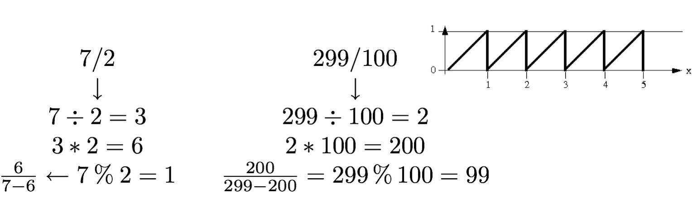
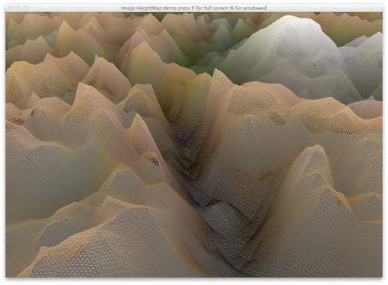

# Image I/O and OpenGL Textures
Jon Macey

jmacey@bournemouth.ac.uk

---

## Creating Images
- Using dynamic memory allocation we can create an array for an RGB image.
- The easiest way to do this is as follows
  - Create an array based on the Width, Height and Number of Pixels in the Image depth
  - Loop through these and fill in the pixels for each RGB Component
  - Write to some image file format
  - Free the array
- Most of the steps for this are simple but the saving of the image file relies on another library

--

## [ImageMagick / Magick++](https://www.imagemagick.org/script/index.php)
- Magick++ provides a simple C++ API to the ImageMagick image processing library which supports reading and writing a huge number of image formats as well as supporting a broad spectrum of traditional image processing operations. 
- Magick++ provides access to most of the features available from the C API but in a simple object-oriented and well-documented framework.
- The simplest operation with the Magick++ Library is the dumping of an array to an image file. 

--

## [Simple Image Write](https://github.com/NCCA/ImageIO/blob/master/SimpleImage/SimpleImageWrite.cpp)

```
#include <iostream>
#include <Magick++.h>
#include <iostream>
#include <cmath>
#include <memory>
#include <cstdlib>

// define widht and height of image
constexpr int WIDTH=720;
constexpr int  HEIGHT=576;

int main()
{
  // allocate and array of char for image
  // where data is packed in RGB format 0-255 where 0=no intensity
  // 255 = full intensity
  std::unique_ptr<unsigned char  []>image( new unsigned char [WIDTH*HEIGHT*3*sizeof(char)]);
  // index into our image array
  size_t index=0;
  // now loop for width and height of image and fill in
  for(size_t y=0; y<HEIGHT; ++y)
  {
    for(size_t x=0; x<WIDTH; ++x)
    {
      // set red channel to full
      image[index]=255;
      // G&B to off
      image[index+1]=0;
      image[index+2]=0;
      // now skip to next RGB block
      index+=3;
    } // end of width loop
  } // end of height loop
  // now create an image data block
  Magick::Image output(WIDTH,HEIGHT,"RGB",Magick::CharPixel,image.get());
  // set the output image depth to 16 bit
  output.depth(16);
  // write the file
  output.write("Test.tiff");
  
  return EXIT_SUCCESS;
}

```

--

## Building

- Like SDL image magick has a config script we can use in qmake

```
TEMPLATE = app
TARGET = SimpleImageWrite
CONFIG -= app_bundle
DEPENDPATH += .
INCLUDEPATH += .

QMAKE_CXXFLAGS+=$$system(Magick++-config --cppflags )
LIBS+=$$system(Magick++-config --ldflags --libs )

# Input
SOURCES += SimpleImageWrite.cpp
```

--


## Why not use char[][]?

- You will notice that the array used for the image data is a char []
- You may think it would be easier to use a two dimensional array for x,y co-ordinates
- However we will see in various examples this is not the case.
- It doesn’t take much code to allow use to set individual pixels in a single char [] array.

--

## The % (modulus) Operator
- The remainder operator (%) returns the integer remainder of the result of dividing the first operand with the second
- For example the value of 7 % 2 is 1


- The magnitude of m % n must always be lest than the division n

--

## Sphere 

- The following function is used to describe a sphere
``` 
// code modified from Computer Graphics with OpenGL F.S. Hill
// get the value on the sphere at co-ord s,t
float fakeSphere(float _s, float _t)
{
	float r=sqrt((_s-0.5)*(_s-0.5)+(_t-0.5)*(_t-0.5));
	if(r<0.5)
	{
		return 1-r/0.5;
	}
	else
	{
		return 1.0;
	}
}
```

- This function will work for any value of s and t in the range of 0 - 1.
- The values will then range from 1.0 outside the sphere to black edges and then to white in the centre as shown on the image above
- Using the template code add this function and draw a sphere.

--

## Repeating Patterns
- As the previous function works from 0-1 if we make the Sphere values range from 0 - 8 and only use the part after the decimal point we can create a pattern as shown above
- To do this we use the C++ function fmod
- The fmod() functions computes the floating-point remainder of x/ y.    
- Specifically, the functions return the value x-i*y, for some integer i such that, if y is non-zero, the result has the same sign as x and magnitude less than the magnitude of y. 
- So to make the value of T repeat 8 times we would use

```
float ss=fmod(S*8,1);
float tt=fmod(T*8,1);
```

---

# Reading Images
- The read method of the image will attempt to read the image and determine the format.
- We can then access the different elements of the image (size, pixels etc) via the different methods
- The following example loads an image and generates mipmaps

--

## Mipmapping 


- mipmapping is a technique where an image is reduce each time in size (as a power or 2)
- This is done by sampling the image and storing the average pixels in the new mipmap
- The algorithm used can vary using different filtering techniques.

--

## [mipmap.cpp](https://github.com/NCCA/ImageIO/tree/master/MipMap)

```
#include <iostream>
#include <Magick++.h>
#include <cstdio>
#include <cmath>
#include <memory>
// for more details see this site some greate stuff here (this code was modified from it)
// http://www.exploringbinary.com/ten-ways-to-check-if-an-integer-is-a-power-of-two-in-c/
bool isPowerOfTwo (size_t _x)
{
 while (((_x % 2) == 0) && _x > 1) /* While x is even and > 1 */
 {
     _x /= 2;
 }
  return (_x == 1);
}


void getRGB(
            const unsigned char *_data,
            int _x, int _y, unsigned char &o_r, unsigned char &o_g,
            unsigned char &o_b, int _width
            )
{
  o_r=_data[((_width*3)*_y)+(_x*3)];
  o_g=_data[((_width*3)*_y)+(_x*3)+1];
  o_b=_data[((_width*3)*_y)+(_x*3)+2];
}

int main(int argc, char **argv)
{

  if(argc <2 )
  {
    std::cerr <<"Usage MipMap [filename]\n";
    exit(EXIT_SUCCESS);
  }

  Magick::Image image;

  image.read(argv[1]);

  auto width=image.size().width();
  auto height=image.size().height();
  std::cout<<"Image size is "<<width<<" "<<height<<"\n";
  bool hasTransparency=image.matte();
  // check that the images are powers of two
  if(!isPowerOfTwo(width) && !isPowerOfTwo(height))
  {
    std::cout<<"Both width and height must be powers of 2 for this to work\n";
    exit(EXIT_FAILURE);
  }
  // only going to deal with RGB for now
  std::unique_ptr<unsigned char []> sourceImage(new unsigned char[width*height*3]);
  size_t i=-1;
  // this is slow and we could use the image.getPixels to acces the raw data, however this will mean
  // we have to manage bits per pixe and other type information the method below is easy to use
  // as the quantum will always be converted for us to the correct type (uchar)
  Magick::Color c;
  for(size_t h=0; h<height; ++h)
  {
    for(size_t w=0; w<width; ++w)
    {
      c=image.pixelColor(w,h);
      sourceImage[++i]= c.redQuantum();
      sourceImage[++i]= c.greenQuantum();
      sourceImage[++i]= c.blueQuantum();
    }
  }

  // loop until we run out of mip levels
  int mipLevel=2;

  for(int ml=width/2; ml>=2; ml/=2)
  {
    std::unique_ptr<unsigned char []> destImage(new unsigned char[(width/2*height/2)*3]);
    i=0;
    unsigned char r1,g1,b1;
    unsigned char r2,g2,b2;
    unsigned char r3,g3,b3;
    unsigned char r4,g4,b4;

    // now loop and average the source image data into the new one
    for(int h=0; h<height/mipLevel; ++h)
    {
      for(int w=0; w<width/mipLevel; ++w)
      {

        int dw=w*mipLevel;
        int dh=h*mipLevel;

        getRGB(sourceImage.get(),dw,dh,r1,g1,b1,width);
        getRGB(sourceImage.get(),dw+1,dh,r2,g2,b2,width);
        getRGB(sourceImage.get(),dw,dh+1,r3,g3,b3,width);
        getRGB(sourceImage.get(),dw+1,dh+1,r4,g4,b4,width);

        destImage[i]=sqrt ((r1*r1+r2*r2+r3*r3+r4*r4)/4);
        destImage[i+1]=sqrt ((g1*g1+g2*g2+g3*g3+g4*g4)/4);
        destImage[i+2]=sqrt ((b1*b1+b2*b2+b3*b3+b4*b4)/4);

        i+=3;
       }
    }

    // write out image and close
    Magick::Image output(width/mipLevel,height/mipLevel,"RGB",Magick::CharPixel,destImage.get());
    output.depth(16);
    char str[40];
    static int f=0;
    sprintf(str,"%02dmipmap%dx%d.png",f++, ml,ml);
    output.write(str);
    mipLevel*=2;
}// end of each mip

}
```

--

## [QImage](http://doc.qt.io/qt-5/qimage.html)

- Qt Has a built in image loading class called QImage
- It is built as a wrapper around other system image libraries a bit like ImageMagick
- It should load the same types of images as ImageMagick but not always.
- The following example loads in an image and uses the red channel to generate the height of the geometry.
- NGL uses this as default but can also use OpenimageIO or ImageMagick

--

## [Demo](https://github.com/NCCA/ImageHeightMap)

- In this example we get the width and height from the image and use this for the steps
- Then generate a series of points equally spaced in x,z but y is set to the value of the red channel.

--

## Loading Images with QImage

```
void NGLScene::genGridPoints(ngl::Real _width, ngl::Real _depth )
{
  // load our image and get size
  QImage image(m_imageName.c_str());
  int imageWidth=image.size().width()-1;
  int imageHeight=image.size().height()-1;
  std::cout<<"image size "<<imageWidth<<" "<<imageHeight<<"\n";

  // calculate the deltas for the x,z values of our point
  float wStep=static_cast<float>(_width)/imageWidth;
  float dStep=static_cast<float>(_depth)/imageHeight;
  // now we assume that the grid is centered at 0,0,0 so we make
  // it flow from -w/2 -d/2
  float xPos=-(_width/2.0);
  float zPos=-(_depth/2.0);
  // now loop from top left to bottom right and generate points
  std::vector <ngl::Vec3> gridPoints;

  for(int z=0; z<=imageHeight; ++z)
  {
    for(int x=0; x<=imageWidth; ++x)
    {
      // grab the colour and use for the Y (height) only use the red channel
      QColor c(image.pixel(x,z));
      gridPoints.push_back(ngl::Vec3(xPos,c.redF()*4,zPos));
      // now store the colour as well
      gridPoints.push_back(ngl::Vec3(c.redF(),c.greenF(),c.blueF()));
      // calculate the new position
      xPos+=wStep;
    }
    // now increment to next z row
    zPos+=dStep;
    // we need to re-set the xpos for new row
    xPos=-(_width/2.0);
  }

  std::vector <GLuint> indices;
  // some unique index value to indicate we have finished with a row and
  // want to draw a new one
  GLuint restartFlag=imageWidth*imageHeight+9999;


  for(int z=0; z<imageHeight; ++z)
  {
    for(int x=0; x<imageWidth; ++x)
    {
      // Vertex in actual row
      indices.push_back(z  * (imageWidth+1) + x);
      // Vertex row below
      indices.push_back((z + 1) * (imageWidth+1) + x);

    }
    // now we have a row of tri strips signal a re-start
    indices.push_back(restartFlag);
  }

  // we could use an ngl::VertexArrayObject but in this case this will show how to
  // create our own as a demo / reminder
  // so first create a vertex array
  glGenVertexArrays(1, &m_vaoID);
  glBindVertexArray(m_vaoID);

  // now a VBO for the grid point data
  GLuint vboID;
  glGenBuffers(1, &vboID);
  glBindBuffer(GL_ARRAY_BUFFER, vboID);
  glBufferData(GL_ARRAY_BUFFER,gridPoints.size()*sizeof(ngl::Vec3),&gridPoints[0].m_x,GL_STATIC_DRAW);

  // and one for the index values
  GLuint iboID;
  glGenBuffers(1, &iboID);
  glBindBuffer(GL_ELEMENT_ARRAY_BUFFER, iboID);
  glBufferData(GL_ELEMENT_ARRAY_BUFFER, indices.size()*sizeof(GLuint),&indices[0], GL_STATIC_DRAW);

  // setup our attribute pointers, we are using 0 for the verts (note the step is going to
  // be 2*Vec3
  glVertexAttribPointer(0,3,GL_FLOAT,GL_FALSE,sizeof(ngl::Vec3)*2,0);
  // this once is the colour pointer and we need to offset by 3 floats
  glVertexAttribPointer(1,3,GL_FLOAT,GL_FALSE,sizeof(ngl::Vec3)*2,((float *)NULL + (3)));
  // enable the pointers
  glEnableVertexAttribArray(0);
  glEnableVertexAttribArray(1);
  // now we tell gl to restart the primitives when restartFlag is encountered
  // don't forget we may need to disable this for other prims so may have to set the
  // state when required
  glEnable(GL_PRIMITIVE_RESTART);
  glPrimitiveRestartIndex(restartFlag);
  glBindVertexArray(0);
  // store the number of indices for re-drawing later
  m_vertSize=indices.size();
}
```

--

## Indices

- Next we create a series of indices for the triangle strip. 
- Once we have a complete row, we add a special index value that indicates that we are at the end of a row.
  - this will be used later by the OpenGL restart command.

--

## [GL_PRIMITIVE_RESTART](https://www.khronos.org/opengl/wiki/Vertex_Rendering#Primitive_Restart)

```
glEnable(GL_PRIMITIVE_RESTART);
glPrimitiveRestartIndex(restartFlag);
```
- We now tell OpenGL to enable the primitive re-start system
- An we tell it what index value should trigger a re-start.
- This is very similar to the old glBegin / glEnd type commands but works on indexed buffer data
- When draw elements encounters the restartFlag value it will re-start the draw.

---

## [Texturing](https://en.wikipedia.org/wiki/Texture_mapping) 
- Texture mapping originally referred to a method (now more accurately called diffuse mapping) that simply wrapped and mapped pixels from a texture to a 3D surface.
- The basic technique begins with some texture function, ```texture(s,t)``` in “texture space” which is traditionally marked off by parameters named s and t.
- The function ```texture(s,t)``` produces a colour or intensity value for each value of s and t between 0 and 1.
- The function ```texture``` can do either image lookups or run procedures to generate an intensity value.

--

## Bitmap Textures
- In this case Colour holds an RGB(A) triple.
- If for example  R=400 and C=600, then the texture(0.261,0.783) evaluates to texture[156][313]
- Note the variation in s from 0 to 1 encompasses 600 pixels whereas the same variation in t encompasses 400 pixels.
- To avoid distortion during rendering, this texture must be mapped onto a rectangle with aspect ration 6/4.

--

## Pasting Textures onto a Flat Surface
- Since texture space is flat, it is simplest to paste texture onto a flat surface.
- We must specify how to associate points on the texture with points on the face. 
- In OpenGL 2.x we use the function ```glTexCoord2f()``` to associate a point in texture space, ```P=(si,ti)``` with each vertex ``V`` of the face.
- The function ```glTexCoord2f(s,t)``` sets the “current texture coordinates” to (s,t) and they are attached to subsequently defined vertices.

--

## Pasting Textures onto a Flat Surface 
- Normally each call to glVertex3f is preceded by a call to glTexCoord2f so each vertex gets a new pair of texture coordinates.
- For example to define a quadrilateral face and to position a texture on it we send OpenGL four texture coordinates and four 3D points as follows

```
glBegin(GL_QUADS);
  glTexCoord2f(0.0,0.0); glVertex(1.0,2.5,1.5);
  glTexCoord2f(0.0,0.6); glVertex(1.0,3.7,1.5);
  glTexCoord2f(0.8,0.6); glVertex(2.0,3.7,1.5);
  glTexCoord2f(0.8,0.0); glVertex(2.0,2.5,1.5);
glEnd();
```

--

## Pasting Textures onto a Flat Surface 

- Attaching a Pi to each Vi is equivalent to prescribing a polygon P in texture space that has the same number of vertices as F.
- Usually P has the same shape as F so the mapping is linear and adds little distortion

--

## OpenGL 3.x
- In OpenGL 3.2 and above we just past in the texture co-ordinates using attributes in our call to ```glDrawArray...```
- We then access these values in shader to determine the s,t values.
- Depending upon how these are created we may also have to do other transformations on the co-ordinates.

--

## OpenGL Texture Mapping Steps
- To use texture mapping, you perform the following steps for each texture
  1. Create a texture object and specify a texture for that object
  2. Indicate how the texture is to be applied to each pixel.
  2. Enable texture mapping and bind correct texture
  3. Draw the scene, supplying both texture and geometric coordinates.

--

## [Creating a Texture Object](https://www.khronos.org/opengl/wiki/Texture)
- As with all OpenGL objects this is stored as a GLuint.
- OpenGL has no way of loading image data and this must be done by the user (usually using an image lib)

```
void glGenTextures(GLsizei n​, GLuint * textures​);
```

--

## glGentextures

- Textures in OpenGL are OpenGL Objects, and they follow the standard conventions of such. So they have the standard glGenTextures, glBindTexture, as you would expect.

- The target parameter of glBindTexture corresponds to the texture's type. So when you use a freshly generated texture name, the first bind helps define the type of the texture. It is not legal to bind an object to a different target than the one it was previously bound with. So if you generate a texture and bind it as GL_TEXTURE_1D, then you must continue to bind it as such.

--

## [glTexImage2D](https://www.khronos.org/registry/OpenGL-Refpages/gl4/html/glTexImage2D.xhtml)

```
void glBindTexture(GLenum target​, GLuint texture​);
void glTexImage2D(	GLenum target,
 	GLint level,
 	GLint internalFormat,
 	GLsizei width,
 	GLsizei height,
 	GLint border,
 	GLenum format,
 	GLenum type,
 	const GLvoid * data);
```

- The function glTexImage2D defines a 2D texture it takes several arguments as shown below
- The Target is set to either GL_TEXTURE_2D or GL_PROXY_TEXTURE_2D
- Level is used to specify the level of multiple images (mipmaps) if this is not used set to 0.

--

## [glTexImage2D](https://www.khronos.org/registry/OpenGL-Refpages/gl4/html/glTexImage2D.xhtml)

- The internalFormat specifies the format of the data there are 38 different constants but most common are GL_RGB and GL_RGBA
- width and height specify the extents of the image and values may have to be a power of 2 (128, 256, 512 etc)
- border value must be 0 (used to do something else but is deprecated)
- format and type specify the format of the data type of the texture image data.

--

## [glTexImage2D](https://www.khronos.org/registry/OpenGL-Refpages/gl4/html/glTexImage2D.xhtml)

- format is usually is GL_RGB GL_RGBA GL_LUMINANCE
- type tells how the data in the image is actually stored (i.e. unsigned int float char etc) and is set using GL_BYTE GL_INT GL_FLOAT GL_UNSIGNED_BYTE etc.
- Finally texels contains the texture image data.

--

## [glTexParameter](https://www.khronos.org/registry/OpenGL-Refpages/gl4/html/glTexParameter.xhtml)

- glTexParameter is used to specify how textures behave. It has many different parameters as follows
- The target parameter is GL_TEXTURE_[1D,2D,3D] depending on the texture type
- The pname and param types are shown in the following table

--


|<small>Parameter</small>	|<small>Values</small> |
|-----------|-------|
|<small>GL_TEXTURE_WRAP_S</small> |	<small>GL_CLAMP, GL_CLAMP_TO_EDGE, GL_REPEAT </small>|
|<small>GL_TEXTURE_WRAP_T</small> |	<small>GL_CLAMP, GL_CLAMP_TO_EDGE, GL_REPEAT </small>|
|<small>GL_TEXTURE_WRAP_R</small> |	<small>GL_CLAMP, GL_CLAMP_TO_EDGE, GL_REPEAT </small>|
|<small>GL_TEXTURE_MAG_FILTER</small> |	<small>GL_NEAREST, GL_LINEAR </small>|
|<small>GL_TEXTURE_MIN_FILTER</small> |	<small>GL_NEAREST, GL_LINEAR, GL_NEAREST_MIPMAP_NEAREST,GL_NEAREST_MIPMAP_LINEAR,GL_LINEAR_MIPMAP_NEAREST,GL_LINEAR_MIPMAP_LINEAR </small>|
|<small>GL_TEXTURE_BORDER_COLOR</small> |	<small>any four colour values in [0.0 1.0]</small> |
|<small>GL_TEXTURE_PRIORITY</small> |	<small>[0.0, 1.0] for the current texture object</small> |
|<small>GL_TEXTURE_MIN_LOD</small>	| <small>any floating point value</small> |
|<small>GL_TEXTURE_MAX_LOD</small>	 | <small>any floating point value</small> |
|<small>GL_TEXTURE_BASE_LEVEL</small> |	<small>any non-negative integer</small> |
|<small>GL_TEXTURE_MAX_LEVEL</small>	 | <small>any non-negative integer </small>|

--

## Creating a Texture Object with OpenGL

```
GLuint textureName;
float Data = some image data
glGenTextures(1,&textureName);
glBindTexture(GL_TEXTURE_2D,textureName);
glTexParameteri(GL_TEXTURE_2D,GL_TEXTURE_MAG_FILTER,GL_LINEAR);
glTexParameteri(GL_TEXTURE_2D,GL_TEXTURE_MIN_FILTER,GL_LINEAR);
glTexParameteri(GL_TEXTURE_2D,GL_TEXTURE_WRAP_S,GL_CLAMP);
glTexParameteri(GL_TEXTURE_2D,GL_TEXTURE_WRAP_T,GL_CLAMP);
glTexImage2D(GL_TEXTURE_2D,0,GL_RGB,SIZE,SIZE,0,GL_RGB,GL_FLOAT,Data);
glTexEnvf(GL_TEXTURE_ENV, GL_TEXTURE_ENV_MODE, GL_REPLACE);
```

- In the above example textureName is the id of the texture object
- Data is an array of the RGB tuple data created for the texture (either procedurally or loaded in from a file)

--

## [Samplers](https://www.khronos.org/opengl/wiki/Sampler_Object)
- A Sampler Object is an OpenGL Object that stores the sampling parameters for a Texture access inside of a shader.

--

## Texture image units
- Binding textures for use in OpenGL is a little weird. There are two reasons to bind a texture object to the context: to change the object (e.g. modify its storage or its parameters) or to render something with it.
- Changing the texture's stored state can be done with the above simple glBindTexture call. However, actually rendering with a texture is a bit more complicated.

--

## Texture image units

- A texture can be bound to one or more locations. These locations are called texture image units. OpenGL contexts have a maximum number of texture image units, queriable from the constant GL_MAX_COMBINED_TEXTURE_IMAGE_UNITS.
- What image unit a glBindTexture call binds the texture to depends on the current active texture image unit. This value is set by calling:

```
void glActiveTexture( GLenum texture​ );
```

--

## [Samplers GLSL](http://tinyurl.com/ldobvsv
)
- A sampler is used to access the texture unit in glsl

```
#version 400
// this is a pointer to the current 2D texture object uniform sampler2D tex;
// the vertex UV
smooth in vec2 vertUV;
// the final fragment colour
layout (location =0) out vec4 outColour;
void main ()
{
 // set the fragment colour to the current texture
 outColour = texture(tex,vertUV);
}
```

--

## ngl::Texture
- ngl has a very simple texture class which will load in an image file using QImage
- It will determine is the image is either RGB, or RGBA and allocate the correct texture data
- It will be default make the current active texture unit be texture 0
- However we can set other texture units be calling setMultiTexture before generating the textureID

