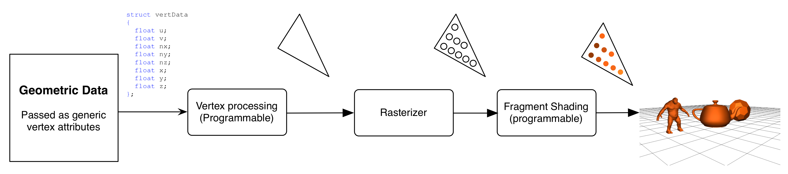
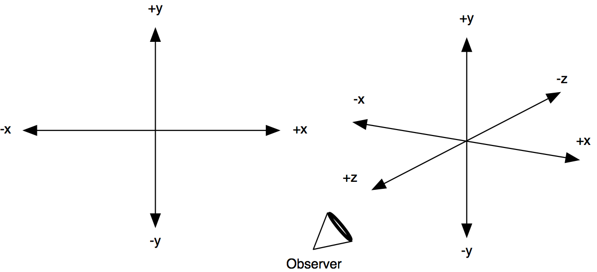
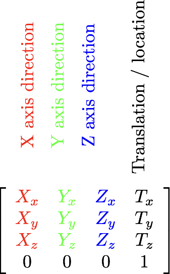
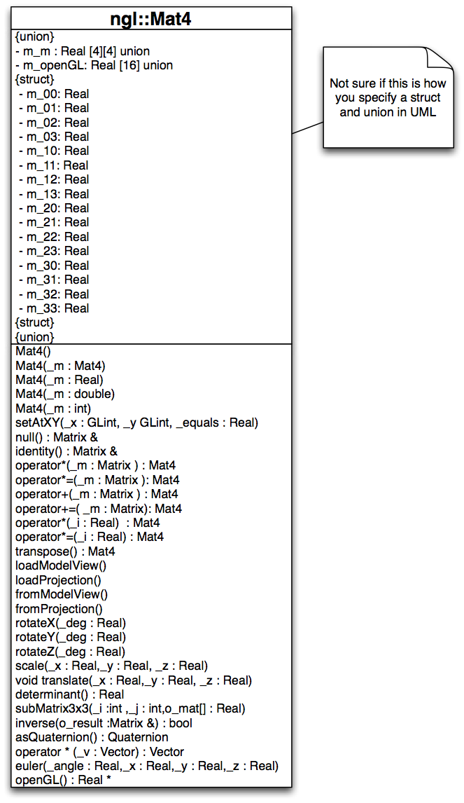
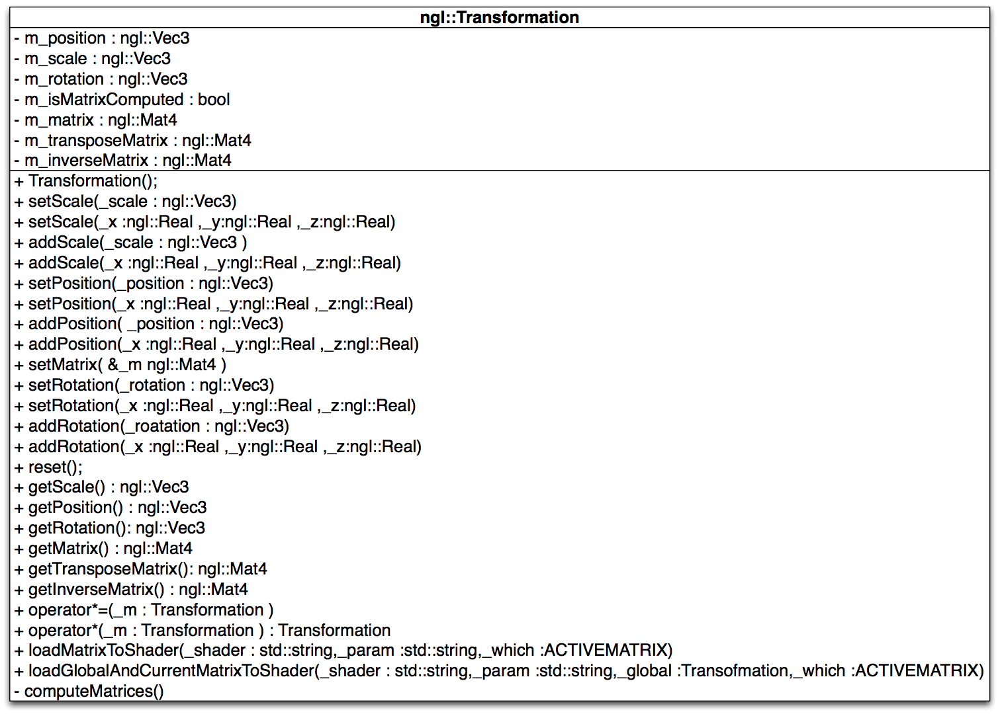
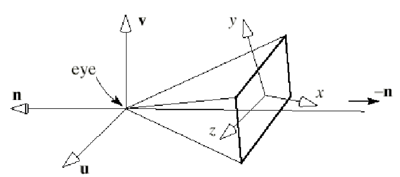
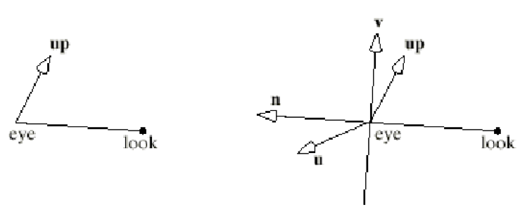
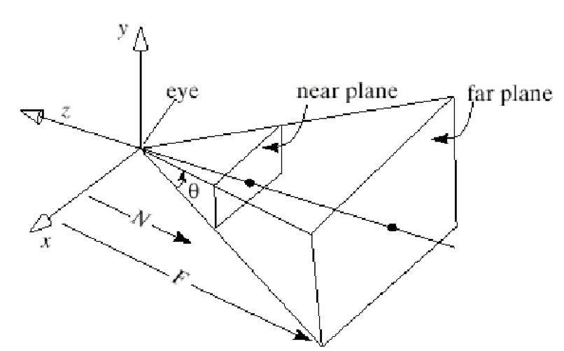

# OpenGL Transformation Pipeline 
Jon Macey

jmacey@bournemouth.ac.uk

---

## Transformation Pipeline


--

## Transformation Pipeline
- When doing 3D graphics, we are actually converting some form of “virtual” 3D representation into a 2D form
- This is know as a “projection” an we can do this in many different ways
- We can also change how we view and model our virtual scenes and these will also have different effects depending upon the context

--

## OpenGL Terminology
- OpenGL uses the following terminology (as do other 3D pipelines)

| Transformation | Use|
|---------------|---|
| Viewing	| Specifies the location of the viewer or camera |
| Modelling	| Moves Objects around the scene |
| ModelView	| A combined matrix of the above |
| Projection |	Sizes and reshapes the view volume |
| Viewport	| A pseudo-transformation that scales the final output to the window |

--

## Eye Coordinates

- Eye coordinates are from the viewpoint of the observer, regardless of transformations.
- It is usually easier to think of them as “absolute” screen coordinates in a fixed frame of reference.
- In OpenGL we use a standard Cartesian coordinate system as shown.

--

## Viewing Transformations
- These are the first to be applied to the scene.
- By default in OpenGL it is (0,0,0) and looking down the negative z axis (into the screen)
- By generating a viewing transformation we are effectively placing and pointing a camera in the scene
- As we shall see later this is actually done using the inverse transformation and we will only ever view from (0,0,0) along the z axis.

--

## Modelling Transforms
- Modelling transforms in OpenGL are usually the basic “affine” transforms
  - Translate
  - Scale
  - Rotate
- More complex transforms can be generated but we would have to create our own matrices

--

## Modelling Transforms
- The modelling transformations can be expressed using matrices
- The order of transformations can make a great difference to the outcome due to the non-commutative nature of matrix multiplication
- This is especially true when combining rotations and translations

--

## ModelView
- The viewing and the modelling transforms are actually the same in terms of internal effects
- The distinction is made to help the programmer
- For example there is no difference visually from moving an object backwards and moving the reference system forward.
- The viewing transform is actually a modelling transform applied to the whole scene (or a modelling transform applied to the observer)

--

## Projection Transforms
- Projection is applied after the ModelView transformations
- It is used to define the view volume of the scene as well as near and far clipping planes
- Typically we would use either an orthographic projection 
- Or a 3D  perspective projection that foreshortens with distance

--

## Viewport Transformations
- The viewport transformation maps the physical screen dimensions to our pre-transformed vertices
- These would have already been processed by the ModelViewProjection matrices
- Usually OpenGL will convert the data into Normalised Device Coordinates (NDC)
- We can the use ```glViewport``` to set this.
We can also have multiple viewports in the same window

---

## OpenGL Matrices
- OpenGL stores matrices using a single float array

```
float matrix[16];
```

- This is slightly counter intuitive as we usually represent a matrix as a 4x4 grid like this

```
float matrix[4][4];
```

--

## Matrix Order
- When using OpenGL style matrix order we traverse the data in what is know as “**Column Major**” order

```
{ 0 , 1 , 2 , 3 , 4 , 5 , 6 , 7 , 8 , 9 ,10 , 11, 12, 13,14 ,15}
{"a","b","c","d","e","f","g","h","i","j","k","l","m","n","o","p"}

[ 0, 4, 8,12 ] [ a,e,i,m ]
[ 1, 5, 9,13 ] [ b,f,j,n ]
[ 2, 6,10,14 ] [ c,g,k,o ]
[ 3, 7,11,15 ] [ d,h,l,p ]

```

--

## Matrix 



--

## 3D affine Transforms
- Any point can be expressed in the coordinate frame as

$$
P=\begin{pmatrix}
P_x \\\
P_y \\\
P_z \\\
P_w
\end{pmatrix}
$$ 


--


## 3D affine Transforms

- Now using T() as a function to transform the points P to Q we use the matrix M as follows

$$
M=\begin{pmatrix}
m\_{11} & m\_{12} & m\_{13} & m\_{14} \\\
m\_{21} & m\_{22} & m\_{23} & m\_{24} \\\
m\_{31} & m\_{32} & m\_{33} & m\_{34} \\\
m\_{41} & m\_{42} & m\_{43} & m\_{44} 
\end{pmatrix}
$$ 

--

## Affine Transform matrix

$$
\rightarrow \\\
\begin{pmatrix}
1 & 0 & 0 & 1 \\\
0 & 1 & 0 & 2 \\\
0 & 0 & 1 & 3 \\\
0 & 0 & 0 & 1 
\end{pmatrix}
\downarrow
\begin{pmatrix}
1 \\\
2 \\\
1 \\\
1
\end{pmatrix}
=
\begin{pmatrix}
2 \\\
4 \\\
4 \\\
1
\end{pmatrix}
$$ 

--

## Affine Transform matrix

$$
\begin{pmatrix} 1 & 2 & 1 & 1 \end{pmatrix}
\begin{pmatrix}
1 & 0 & 0 & 0 \\\
0 & 1 & 0 & 0 \\\
0 & 0 & 1 & 0 \\\
1 & 2 & 3 & 1 
\end{pmatrix}
=\begin{pmatrix} 2 & 4 & 4 & 1 \end{pmatrix}
$$ 

--

## [ngl::Mat4](https://nccastaff.bournemouth.ac.uk/jmacey/GraphicsLib/html/classngl_1_1_mat4.html)
- The ngl::Mat4 class is a simple 4x4 affine transform class that allows the storage of the 16 matrix entities in three different ways
- Data is assumed to be in the following format with the translation elements as shown

$$
\begin{pmatrix}
1 & 0 & 0 & t_x \\\
0 & 1 & 0 & t_y \\\
0 & 0 & 1 & t_z \\\
1 & 2 & 3 & 1 
\end{pmatrix}
$$ 

--

## [ngl::Mat4](https://nccastaff.bournemouth.ac.uk/jmacey/GraphicsLib/html/classngl_1_1_mat4.html)

```
#pragma pack(push,1)

  union
  {
    Real m_m[4][4];
    std::array<Real,16> m_openGL={{
                                    1.0f,0.0f,0.0f,0.0f,
                                    0.0f,1.0f,0.0f,0.0f,
                                    0.0f,0.0f,1.0f,0.0f,
                                    0.0f,0.0f,0.0f,1.0f
                                  }};
    struct
    {
        struct
        {
          Real m_00; //!< individual matrix element maps to m_m[0][0] or m_openGL[0]
          Real m_01; //!< individual matrix element maps to m_m[0][1] or m_openGL[1]
          Real m_02; //!< individual matrix element maps to m_m[0][2] or m_openGL[2]
          Real m_03; //!< individual matrix element maps to m_m[0][3] or m_openGL[3]
          Real m_10; //!< individual matrix element maps to m_m[1][0] or m_openGL[4]
          Real m_11; //!< individual matrix element maps to m_m[1][1] or m_openGL[5]
          Real m_12; //!< individual matrix element maps to m_m[1][2] or m_openGL[6]
          Real m_13; //!< individual matrix element maps to m_m[1][3] or m_openGL[7]
          Real m_20; //!< individual matrix element maps to m_m[2][0] or m_openGL[8]
          Real m_21; //!< individual matrix element maps to m_m[2][1] or m_openGL[9]
          Real m_22; //!< individual matrix element maps to m_m[2][2] or m_openGL[10]
          Real m_23; //!< individual matrix element maps to m_m[2][3] or m_openGL[11]
          Real m_30; //!< individual matrix element maps to m_m[3][0] or m_openGL[12]
          Real m_31; //!< individual matrix element maps to m_m[3][1] or m_openGL[13]
          Real m_32; //!< individual matrix element maps to m_m[3][2] or m_openGL[14]
          Real m_33; //!< individual matrix element maps to m_m[3][3] or m_openGL[15]
        };
    };
   };
#pragma pack(pop)
  }; // end of class

```


```
///  [y][x] i       [y][x] i       [y][x] i        [y][x]  i
/// [ (0,0) 0 m_00 | (0,1) 4 m_10 | (0,2) 8  m_20 | (0,3) 12 m_30]
/// [ (1,0) 1 m_01 | (1,1) 5 m_11 | (1,2) 9  m_21 | (1,3) 13 m_31]
/// [ (2,0) 2 m_02 | (2,1) 6 m_12 | (2,2) 10 m_22 | (2,3) 14 m_32]
/// [ (3,0) 3 m_03 | (3,1) 7 m_13 | (3,2) 11 m_23 | (3,3) 15 m_33]

```

--

## [ngl::Mat4](https://nccastaff.bournemouth.ac.uk/jmacey/GraphicsLib/html/classngl_1_1_mat4.html)


--

## [rotateX](https://nccastaff.bournemouth.ac.uk/jmacey/GraphicsLib/html/classngl_1_1_mat4.html)
$$
R_x(\beta)=\begin{pmatrix}
1 & 0 & 0 & 0 \\\
0 & \cos(\beta) & -\sin(\beta) & 0 \\\
0 & \sin(\beta) & \cos(\beta) & 0 \\\
0 & 0 & 0 & 1 
\end{pmatrix}
$$ 

```
void Mat4::rotateX( const Real _deg) noexcept
{
  Real beta=radians(_deg);
  Real sr = sinf( beta );
  Real cr = cosf( beta );
  m_11 =  cr;
  m_21 = -sr;
  m_12 =  sr;
  m_22 =  cr;
}
```

--

## [rotateY](https://nccastaff.bournemouth.ac.uk/jmacey/GraphicsLib/html/classngl_1_1_mat4.html)
$$
R_y(\beta)=\begin{pmatrix}
\cos(\beta) & 0 & \sin(\beta) & 0 \\\
0 & 1 & 0 & 0  \\\
-\sin(\beta) & 0 & \cos(\beta) & 0 \\\
0 & 0 & 0 & 1 
\end{pmatrix}
$$ 

```
void Mat4::rotateY( const Real _deg ) noexcept
{
  Real beta=radians(_deg);
  Real sr = sinf( beta );
  Real cr = cosf( beta );
  m_00 =  cr;
  m_20 =  sr;
  m_02 = -sr;
  m_22 =  cr;
}
```

--

## [rotateZ](https://nccastaff.bournemouth.ac.uk/jmacey/GraphicsLib/html/classngl_1_1_mat4.html)
$$
R_z(\beta)=\begin{pmatrix}
\cos(\beta) & -\sin(\beta) & 0 & 0 \\\
\sin(\beta) &  \cos(\beta) & 0 & 0 \\\
0 & 0 & 1 & 0 \\\
0 & 0 & 0 & 1 
\end{pmatrix}
$$ 

```
void Mat4::rotateZ(const Real _deg ) noexcept
{
  Real beta=radians(_deg);
  Real sr = sinf( beta );
  Real cr = cosf( beta );
  m_00 =  cr;
  m_10 = -sr;
  m_01 =  sr;
  m_11 =  cr;
}
```

--

[Euler Rotation](http://mathworld.wolfram.com/EulerAngles.html)

$$ \tiny
R=\begin{pmatrix}
\cos \theta + u_x^2(1-\cos \theta) & u_x u_y (1-\cos \theta) - u_z \sin \theta & u_x u_z (1- \cos \theta) + u_y \sin \theta \\\
u_y u_x (1-\cos \theta) + u_z \sin \theta & \cos \theta + u_y^2(1 - \cos \theta) & u_y u_z (1- \cos \theta)- u_x \sin \theta \\\
u_z u_x (1-\cos \theta)-u_y \sin \theta & u_z u_y (1-\cos \theta)+u_x \sin \theta & \cos \theta + u_z^2(1-\cos \theta)
\end{pmatrix}
$$ 

```
void Mat4::euler(const Real _angle, const Real _x, const Real _y, const Real _z) noexcept
{
  // Axis and Angle matrix rotation see
  // http://en.wikipedia.org/wiki/Rotation_matrix for more details
  Real beta=radians(-_angle);
  Real cosTheta = cosf((beta));
  Real sinTheta = sinf((beta));
  Real OneMinusCosTheta=1.0f-cosTheta;
  ngl::Vec3 norm(_x,_y,_z);
  norm.normalize();
  Real x=norm.m_x;
  Real y=norm.m_y;
  Real z=norm.m_z;


  m_m[0][0]=OneMinusCosTheta*(x*x)+cosTheta;
  m_m[0][1]=OneMinusCosTheta*(x*y)-(z*sinTheta);
  m_m[0][2]=OneMinusCosTheta*(x*z)+(y*sinTheta);

  m_m[1][0]=OneMinusCosTheta*(x*y)+(z*sinTheta);
  m_m[1][1]=OneMinusCosTheta*(y*y)+cosTheta;
  m_m[1][2]=OneMinusCosTheta*(y*z)-(x*sinTheta);

  m_m[2][0]=OneMinusCosTheta*(x*z)-(y*sinTheta);
  m_m[2][1]=OneMinusCosTheta*(y*z)+(x*sinTheta);
  m_m[2][2]=OneMinusCosTheta*(z*z)+cosTheta;
}

```

--

## translate and scale

```
void Mat4::translate( const Real _x,const Real _y,  const Real _z ) noexcept
{
  m_30 = _x;
  m_31 = _y;
  m_32 = _z;
}

void Mat4::scale(const Real _x, const Real _y,  const Real _z ) noexcept
{
  m_00 = _x;
  m_11 = _y;
  m_22 = _z;
}


```

---

### Some (deprecated) OpenGL tools 
- Three functions are used to set the modelling transformations and we use the following steps
1. we have to make the the modelview matrix the “current” matrix we do this by calling ```glMatrixMode(GL_MODELVIEW);```
2. To scale we use ```glScaled(sz,sy,sz);``` which Post-multiplies the current matrix by a matrix that performs a scaling by sx in the x sy in the y and sz in the z. Put the results back in the current matrix
3.  ```glTranslated(dx,dy,dz);``` Post-multiply the current matrix by a matrix that performs a translation of dx in the x dy in the y and dz in the z. Put the result back in the current matrix.
4. ```glRotated(angle,ux,uy,uz);``` Post-multiply the current matrix by a matrix that performs a rotation of angle degrees about the axis that passes through the origin and the point (ux,uy,uz). Put the result back in the current matrix.

--

## OpenGL  3.x and above
- All of the affine transform and matrix commands have been deprecated in the latest version of OpenGL
- Instead of using them we have to set the matrix values we wish to use directly in the shader
- We then multiply the gl_Position shader value or the current attribute set to be the vertex by a final transformation matrix in the vertex shader.
- We also have to transform any Normals, Lights etc etc depending upon the context of what we are doing
- There are many ways of doing this, and a simple transformation stack has been developed for NGL to allow replication of the basic GL commands

--

## [ngl::Transformation](https://nccastaff.bournemouth.ac.uk/jmacey/GraphicsLib/html/classngl_1_1_transformation.html)
- The basic ngl::Transformation class was developed by MSc student Vince Bonnet for his MSc project
- It has been modified and incorporated into the ngl:: library 
- This is not the most optimal solution but is very generic and works well in virtually all situations
- The transformation class combines scale, translate and rotations around the Cartesian axis in a set way to get predictable results. 

--

## [ngl::Transformation](https://nccastaff.bournemouth.ac.uk/jmacey/GraphicsLib/html/classngl_1_1_transformation.html)


--

## [ngl::Transformation](https://nccastaff.bournemouth.ac.uk/jmacey/GraphicsLib/html/classngl_1_1_transformation.html)
- As you can see all the tuple values for the transformations are stored using an ngl::Vector
- Rotations are rolls around the Cartesian axis in degrees

```
void Transformation::computeMatrices() noexcept
{
  if (!m_isMatrixComputed)       // need to recalculate
  {
    Mat4 scale;
    Mat4 rX;
    Mat4 rY;
    Mat4 rZ;
    Mat4 trans;

    // rotation/scale matrix
    Mat4 rotationScale;
    scale.scale(m_scale.m_x, m_scale.m_y, m_scale.m_z);

    rX.rotateX(m_rotation.m_x);
    rY.rotateY(m_rotation.m_y);
    rZ.rotateZ(m_rotation.m_z);
    rotationScale = scale * rX * rY * rZ;

    // transform matrix
    m_matrix = rotationScale;
    m_matrix.m_m[3][0] = m_position.m_x;
    m_matrix.m_m[3][1] = m_position.m_y;
    m_matrix.m_m[3][2] = m_position.m_z;
    m_matrix.m_m[3][3] = 1;


    // tranpose matrix
    m_transposeMatrix = rotationScale;
    m_transposeMatrix.transpose();
    m_transposeMatrix.m_m[0][3] = m_position.m_x;
    m_transposeMatrix.m_m[1][3] = m_position.m_y;
    m_transposeMatrix.m_m[2][3] = m_position.m_z;
    m_transposeMatrix.m_m[3][3] = 1;

    // inverse matrix
    trans.translate(-m_position.m_x, -m_position.m_y, -m_position.m_z);
    scale.scale(1.0f / m_scale.m_x, 1.0f / m_scale.m_y, 1.0f / m_scale.m_z);
    rX.rotateX(-m_rotation.m_x);
    rY.rotateY(-m_rotation.m_y);
    rZ.rotateZ(-m_rotation.m_z);
    m_inverseMatrix = trans * rZ * rY * rX * scale  ;

    m_isMatrixComputed = true;
  }
}

void Transformation::operator*= ( const Transformation &_m) noexcept
{
  m_isMatrixComputed=false;

  computeMatrices();
  m_matrix*=_m.m_matrix;

  /// transpose matrix transformation
  m_transposeMatrix*=_m.m_transposeMatrix;

  /// inverse matrix transformation
  m_inverseMatrix*=_m.m_inverseMatrix;
}
```

---

##### The General Camera with Arbitrary Orientation and Position

- It is useful to attach an explicit co-ordinate system to the camera as shown in the figure above.
- This co-ordinate system has its origin at the eye and has three axes, usually called the u-,v-, and n-axis which define the orientation of the camera

--

##### The General Camera with Arbitrary Orientation and Position


- The axes are pointed in directions given by the vectors u,v, and n 
- Because, by default, the camera looks down the negative z-axis, we say in general that the camera looks down the negative n-axis in the direction -n 
- The direction u points off “to the right of” the camera and the direction v points “upward”

--

## Camera Control
- The function gluLookAt is handy for setting up an initial camera as we usually have a good idea where to place eye and look
- However it is harder to visualise how to choose up to obtain a certain roll and it is quite difficult to make relative adjustments to the camera later using only gluLookAt 
- This is due to the fact that gluLookAt uses Cartesian coordinates whereas orientation deals with angles and rotations about axes.
- OpenGL doesn't give us direct access to the vectors u,v and n so we need to maintain them in code.

--

## [What gluLookAt does](https://www.opengl.org/sdk/docs/man2/xhtml/gluLookAt.xml)

- What are the directions of **u**,**v** and **n** when we execute ```gluLookAt()``` with given values for **eye**, **look** and **up**
- If given the locations of eye, look and up, we immediately know than **n** must be parallel to the vector **eye-look**, as shown above. so we can set **n=eye-look**

--

## [What gluLookAt does](https://www.opengl.org/sdk/docs/man2/xhtml/gluLookAt.xml)


- We now need to find a **u** and a **v** that are perpendicular to **n** and to each other.
- The **u** direction points *“off to the side”* of a camera, so it is natural to make it perpendicular to up which the user has said is the *“upward”* direction. 

--

## [What gluLookAt does](https://www.opengl.org/sdk/docs/man2/xhtml/gluLookAt.xml)
- An easy way to build a vector that is perpendicular to two given vector is to form their cross product, so we set **u=up x n** 
- The user should not choose an up direction that is parallel to **n**, because **u** then would have zero length.
- We choose **u=up x n** rather than **n x up** so that u will point *“to the right”* as we look along **-n**

--

## [What gluLookAt does](https://www.opengl.org/sdk/docs/man2/xhtml/gluLookAt.xml)
 
- With **u** and **n** formed it is easy to determine **v** as it must be perpendicular to both and is thus the cross product of **u** and **n** thus **v=n x u**
- Notice that **v** will usually not be aligned with up as **v** must be aimed perpendicular to **n** whereas the user provides up as a suggestion of *“upwardness”* and the only property of up that is used is its cross product with **n**

--

## [What gluLookAt does](https://www.opengl.org/sdk/docs/man2/xhtml/gluLookAt.xml)

- To summarise, given eye look and up, we form

$$
\mathbf{n} = \mathbf{eye} - \mathbf{look} \\\
\mathbf{u} = \mathbf{up} \times \mathbf{n} \\\
\mathbf{v} = \mathbf{n} \times \mathbf{u}
$$

- we then normalize to unit length

--

## Viewing matrix
 
-  The job of the View matrix is to convert world co-ordinates to camera co-ordinates it must transform the camera's coordinate system into the generic position for the camera 

$$
V=\begin{pmatrix}
v_y & v_y & v_z & d_x \\\
u_y & u_y & u_z & d_y \\\
n_y & n_y & n_z & d_z \\\
0 & 0 & 0 & 1 
\end{pmatrix}
$$

$$
(d_x,d_y,d_z)= ( -\mathbf{eye} \bullet \mathbf{u} , -\mathbf{eye} \bullet \mathbf{v} , -\mathbf{eye} \bullet \mathbf{n})
$$

--

## [ngl::LookAt](https://nccastaff.bournemouth.ac.uk/jmacey/GraphicsLib/html/namespacengl.html#aa989053cafdc5f7bf7fa9ab5548f800e)

```
NGL_DLLEXPORT Mat4 lookAt(const Vec3  & _eye,const Vec3  & _center,const Vec3  & _up) noexcept
{

    Vec3 n =   _center-_eye;
    Vec3 u = _up;
    Vec3 v = n.cross(u);
    u = v.cross(n);
    n.normalize();
    v.normalize();
    u.normalize();

    Mat4 result(1.0f);
    result.m_00= v.m_x;
    result.m_10= v.m_y;
    result.m_20= v.m_z;
    result.m_01= u.m_x;
    result.m_11= u.m_y;
    result.m_21= u.m_z;
    result.m_02=-n.m_x;
    result.m_12=-n.m_y;
    result.m_22=-n.m_z;
    result.m_30=-_eye.dot(v);
    result.m_31=-_eye.dot(u);
    result.m_32= _eye.dot(n);
    return result;
}
```

--

## [Orthographic Projection](https://en.wikipedia.org/wiki/Orthographic_projection)
- An orthographic projection is specified by setting “clip” planes
- We do this using
  - near - far
  - left - right
  - top - bottom
- We can then create a matrix to scale and set the view of our object

--

## Orthographic Projection

$$
V=\begin{pmatrix}
\frac{2.0}{r-l} & 0 & 0 & - \frac{r+l}{r-l} \\\
0 & \frac{2.0}{t-b} & 0 & -\frac{t+b}{t-b} \\\
0 & 0 & \frac{2.0}{f-n} & -\frac{f+n}{f-n} \\\
0 & 0 & 0 & 1 
\end{pmatrix}
$$

```
NGL_DLLEXPORT Mat4 ortho(Real _left, Real _right, Real _bottom, Real _top, Real _zNear, Real _zFar) noexcept
{
  Mat4 result(1.0f);
  result.m_00= 2.0f / (_right - _left);
  result.m_11= 2.0f / (_top - _bottom);
  result.m_22= - 2.0f / (_zFar - _zNear);
  result.m_30= - (_right + _left) / (_right - _left);
  result.m_31= - (_top + _bottom) / (_top - _bottom);
  result.m_32= - (_zFar + _zNear) / (_zFar - _zNear);
  return result;
}
```

--

## Setting the View Volume

- OpenGL 1.x provided a simple way to set the view volume in a program by setting the projection Matrix
- This was done using ```gluPerspective``` 
- This function is now deprecated and we will instead set these values directly using our own Projection matrix in a shader.

--

## [Perspective Projection](https://en.wikipedia.org/wiki/3D_projection)
- The parameter fov, shown as    in the figure is given in degrees and sets the angle between the top and bottom walls of the pyramid.
- The parameters w and h sets the aspect ratio of any window parallel to the xy-plane
- The value N is the distance from the eye to the near plane, and F is the distance from the eye to the far plane. N and F should be positive.

--

## [Perspective Projection](https://en.wikipedia.org/wiki/3D_projection)

$$
\begin{pmatrix}
\frac{f}{aspect} & 0 & 0 & 0 \\\
0 & f & 0 & 0 \\\
0 & 0 & \frac{f+n}{f-n} & \frac{2fn}{f-n} \\\
0 & 0 & -1 & 0 
\end{pmatrix} 
$$

$$
f = \cot( \frac{fovy}{2})
$$

--

## [Perspective Projection](https://en.wikipedia.org/wiki/3D_projection)


```
NGL_DLLEXPORT Mat4 perspective(Real _fovy,Real _aspect, Real _zNear, Real _zFar) noexcept
{
  Mat4 result;

  result.null();

  Real range = tanf(radians(_fovy / 2.0f)) * _zNear;
  Real left = -range * _aspect;
  Real right = range * _aspect;
  Real bottom = -range;
  Real top = range;
  result.m_00 = (2.0f * _zNear) / (right - left);
  result.m_11 = (2.0f * _zNear) / (top - bottom);
  result.m_22 = - (_zFar + _zNear) / (_zFar - _zNear);
  result.m_23 = - 1.0f;
  result.m_32 = - (2.0f* _zFar * _zNear) / (_zFar - _zNear);
  return result;
}

```

---

## lookat demos

<iframe width="560" height="315" src="https://www.youtube.com/embed/JlpvACyYVZQ" frameborder="0" allowfullscreen></iframe>

--

## ngl::Camera

<iframe width="560" height="315" src="https://www.youtube.com/embed/DqAAyfByaug" frameborder="0" allowfullscreen></iframe>

---

## References
- The OpenGL SuperBible Fifth Edition, Wright, Hemell et-al 2011 Pearson
- Computer Graphics With OpenGL, F.S. Hill jr, Prentice Hall 
- Basic Algebra and Geometry. Ann Hirst and David Singerman. Prentice Hall 2001
- "Essential Mathematics for Computer Graphics fast" John VinceSpringer-Verlag London
- "Geometry for Computer Graphics: Formulae, Examples and Proofs" John Vince Springer-Verlag London 2004