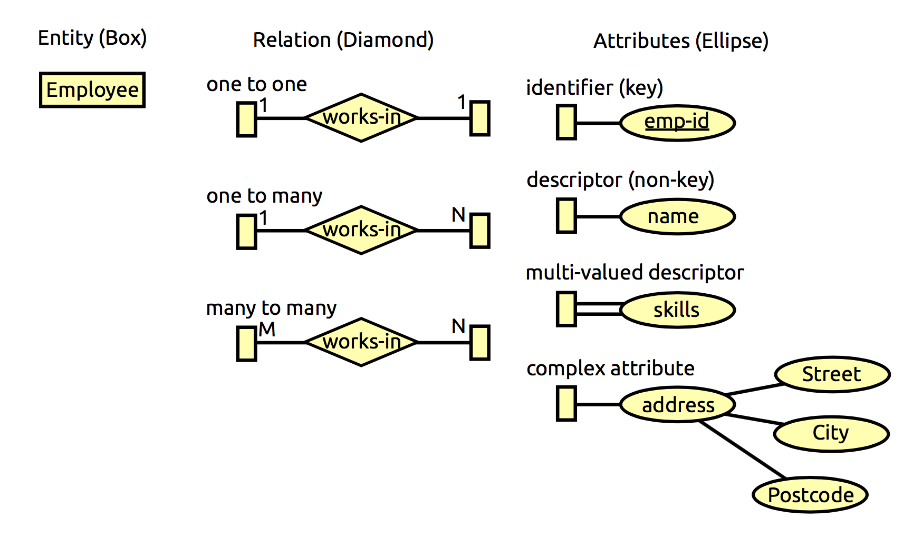
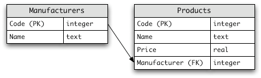

# Introduction to Databases and SQL
Jon Macey & Richard Southern 

jmacey@bournemouth.ac.uk

---


## [Relational Databases](https://en.wikipedia.org/wiki/Relational_database)
- A database is essentially "an ordered collection of data"
  - ubiquitous  
- Relational model the most common ([however other models exist](https://en.wikipedia.org/wiki/Database))
- Uses a collection of related "tables" to store records
- Data queried using a query language. 

--

## Database Management System (DBMS)
- The tools we use for Querying a database
  - **query** i.e. select all jobs from user a;
  - **arbitrary** calculations (how many of a in stock?)
  - **security**   need account to log in to change things
  - **backup / maintenance** manage the tables and users

--

## Why / When to use a database?
- Most of the previous can be implemented by a filesystem 
- Use a database when
  - multiple users
  - multiple items (think stock)
  - when you need to lock records (built into RDBS)
- Usually quicker than rolling your own code.
- For example I used mysql for writing a render farm system.

---

## [mysql](https://dev.mysql.com/)
- Owned by Oracle.
- Open Source version available (what I'm using also LAMP / MAMP uses it)
- Used for countless web applications, e.g. Facebook, Google, Wikipedia, Wordpress.
- Not fully compliant with SQL [standard](https://dev.mysql.com/doc/mysql-reslimits-excerpt/5.5/en/differences-from-ansi.html)! 
  - GUI [MySQL Workbench](https://www.mysql.com/products/workbench/)

--

## mysql
- not installed in the lab (too hard to administer for many users)
- if you **really** need it we can sort something out
  - however if it is for a stand alone application we can use [sqlite](http://www.sqlite.org/about.html) (more later)
  - for now we will look at principles
- for the lectures I will use mysql on my machine, and also sqlite3

---

## The relational model

- **Ubiquitous** : Still most common DB model by far. 
- **Simple** : Implemented as tables.
- **Flexible** : Suitable for many types of queries. 
- **Rigorous** : [based on first-order predicate logic](https://technology.amis.nl/wp-content/uploads/images/RJ599.pdf).


--

##  [First Order Predicate Logic](https://en.wikipedia.org/wiki/First-order_logic)
- A Relational Model describes data in terms of a collection of predicates over a finite set of variables.

- A predicate on ```X , P : X → {true, false}```, is ```true``` or ```false``` depending on ```X```

- These describe constraints on variables or groups of variables.
- Queries are also predicates.
- Relational Algebra and boolean logic describes these relations.

--

## Definitions
- **[Entity](https://en.wikipedia.org/wiki/Entity%E2%80%93relationship_model)** : A unique real-world concept / object (e.g. film, student, car)
- **Attribute** : A property of an entity (e.g. title, login id, make)
- **Key** : Unique identifier of an entity (to avoid duplication), can be composite (more than one attribute)
- **Foreign Key** : An attribute of an entity which is the key of another entity. Used to facilitate table joins.
- **Relation** : Association between two or more entities (e.g. director directs a film)

--

## Definitions
- **Entity Relational Model** : A modeling tool for defining relations between entities.
- **Schema** : A high level relation plan (e.g. film(fid, title, director, year))
- **Instance** : A table of data, created from a schema ([cardinality](https://en.wikipedia.org/wiki/Cardinality): number of rows, [arity](https://en.wikipedia.org/wiki/Arity) : number of col’s)
- **Index** : An optimized search key.

--

## [SQL Data Types](https://www.w3schools.com/sql/sql_datatypes.asp)
- Different DBMS systems have different data type support
- There are also optional attributes that can be applied to the data type
- In MySQL there are three main data types 
  - text
  - number
  - Date/Time

--

## [Text types](https://www.w3schools.com/sql/sql_datatypes.asp)

|<small/>Data Type|<small/>Description |
|---------|------------|
|<small/> ```CHAR(size)```|<small/> Holds a fixed length string (can contain letters, numbers, and special characters). The fixed size is specified in parenthesis. Can store up to   255 characters |
| <small/>```VARCHAR(size)``` | <small/>Holds a variable length string (can contain letters, numbers, and special characters). The maximum size is specified in parenthesis. Can   store up to 255 characters. **Note** : If you put a greater value than   255 it will be converted to a TEXT |
|<small/>```TINYTEXT```| <small/> Holds a string with a maximum length of 255 characters |
|<small/>```TEXT``` | <small/>Holds a string with a maximum length of 65,535 characters |
|<small/>```BLOB``` | <small/>For BLOBs (Binary Large OBjects). Holds up to 65,535 bytes of data |

--


## [Text types](https://www.w3schools.com/sql/sql_datatypes.asp)

|<small/>Data Type|<small/>Description |
|---------|------------|
| <small/>```MEDIUMTEXT``` | <small/> Holds a string with a maximum length of 16,777,215 characters |
| <small/>```LONGTEXT``` | <small/>Holds a string with a maximum length of 4,294,967,295 characters |
| <small/>```MEDIUMBLOB``` | <small/> For BLOBs (Binary Large OBjects). Holds up to 16,777,215 bytes of data |
| <small/>```LONGBLOB``` | <small/> For BLOBs (Binary Large OBjects). Holds up to 4,294,967,295 bytes of data |
| <small/>```ENUM(x,y,z,etc.)``` | <small/>Let you enter a list of possible values. You can list up to 65535 values in an ENUM list. If a value is inserted that is not in the list, a blank value will be inserted. |
| <small/>```SET``` | <small/>Similar to ENUM except that SET may contain up to 64 list items and can store more than one choice |

--

## Number types
|<small/>Data Type|<small/>Description |
|---------|------------|
|<small/>```TINYINT(size) ``` | <small/> -128 to 127 normal. 0 to 255 UNSIGNED*. The maximum number of digits may be specified in parenthesis  |
|<small/>```SMALLINT(size) ``` | <small/>-32768 to 32767 normal. 0 to 65535 UNSIGNED*. The maximum number of digits may be specified in parenthesis   |
|<small/>```MEDIUMINT(size) ``` | <small/>-8388608 to 8388607 normal. 0 to 16777215 UNSIGNED*. The maximum number of digits may be specified in parenthesis   |
|<small/>```INT(size) ``` | <small/>-2147483648 to 2147483647 normal. 0 to 4294967295 UNSIGNED*. The maximum number of digits may be specified in parenthesis   |
|<small/>```BIGINT(size) ``` | <small/> -9223372036854775808 to 9223372036854775807 normal. 0 to 18446744073709551615 UNSIGNED*. The maximum number of digits may be specified in parenthesis  |
|<small/>```FLOAT(size,d) ``` | <small/>A small number with a floating decimal point. The maximum number of digits may be specified in the size parameter. The maximum number of digits to the right of the decimal point is specified in the d parameter   |

--

## Number types

|<small/>Data Type|<small/>Description |
|---------|------------|
|<small/>```DOUBLE(size,d) ``` | <small/> A large number with a floating decimal point. The maximum number of digits may be specified in the size parameter. The maximum number of digits to the right of the decimal point is specified in the d parameter  |
|<small/>```DECIMAL(size,d) ``` | <small/>A DOUBLE stored as a string , allowing for a fixed decimal point. The maximum number of digits may be specified in the size parameter. The maximum number of digits to the right of the decimal point is specified in the d parameter   |

--

## Date types:

|<small/>Data Type|<small/>Description |
|---------|------------|
|<small/>```DATE() ``` | <small/> A date. Format: YYYY-MM-DD **Note**: The supported range is from '1000-01-01' to '9999-12-31'  |
|<small/>```DATETIME() ``` | <small/> A date and time combination. Format: YYYY-MM-DD HH:MI:SS **Note** : The supported range is from '1000-01-01 00:00:00' to '9999-12-31 23:59:59'  |
|<small/>```TIMESTAMP() ``` | <small/> A timestamp. TIMESTAMP values are stored as the number of seconds since the Unix epoch ('1970-01-01 00:00:00' UTC). Format: YYYY-MM-DD HH:MI:SS **Note** : The supported range is from '1970-01-01 00:00:01' UTC to '2038-01-09 03:14:07' UTC |
|<small/>```TIME() ``` | <small/> A time. Format: HH:MI:SS **Note** : The supported range is from '-838:59:59' to '838:59:59'  |
|<small/>```YEAR() ``` | <small/>  A year in two-digit or four-digit format. **Note** : Values allowed in four-digit format: 1901 to 2155. Values allowed in two-digit format: 70 to 69, representing years from 1970 to 2069 |

--

## [Numeric Column Attributes ](https://dev.mysql.com/doc/refman/5.7/en/numeric-type-attributes.html)
| Attribute | Description |
|---------|------------|
| <small/> ```UNSIGNED ``` | <small/> Integer columns; don't allow negative values |
| <small/> ```ZEROFILL ``` | <small/> All numeric column types; pad displayed values with zeros  |
| <small/> ```AUTO_INCREMENT ``` | <small/> Integer columns; increment value by 1 each time NULL is inserted |


---

## Database Design Decisions
- Database Design: What do you need to consider?
  - User requirements (e.g. rapid access to data based on invoice number),
  - Consistency (normalization)
  - Support for a wide variety of queries Implementation Issues

--

## The Entity Relational Model
- [An abstract conceptual model for representing data relationships](https://pdfs.semanticscholar.org/fdc8/b4381a3d9e81d308ac7c37a6cddde567383d.pdf)
- Similar to OO Design principles
- Entities (nouns) relate to other entities by means of a relationship (verb) (e.g. artist performs song).
- Entites have attributes (properties).
- Minimum set of attributes is the primary key.
- A database structure is defined by the Entity Relationships.

--

## [Entity Relationship Diagram](https://www.tutorialspoint.com/dbms/er_diagram_representation.htm) ERD


--

## Converting Diagram to Tables
- **Entity** becomes a table, associated attributes become columns
- **Many-to-many** binary relationship becomes a table, taking the 2 primary keys in the 2 entities associated with this relationship as foreign keys in the new table
- **One-to-many** binary relationship becomes a table with primary key on “one” side entity copied as a foreign key in the “many” side entity’s table
- **Ternary relationship** becomes a SQL table, taking the 3 primary keys of the 3 entities associated with this relationship as foreign keys in the new table

---

## [Database Normalization](https://en.wikipedia.org/wiki/Database_normalization)
- "is the process of organizing the columns (attributes) and tables (relations) of a relational database to reduce data redundancy and improve data integrity"
- When designing our database we start with a number of tables / structures
- we then use the normalization process to reduce our duplication of data.
- ["While database normalization is often a good idea, it's not an absolute requirement. In fact, there are some cases where deliberately violating the rules of normalization is a good practice"](https://www.thoughtco.com/should-i-normalize-my-database-1019730)

--

## Normalization Rules
1. First Normal Form
2. Second Normal Form
3. Third Normal Form
4. BCNF (Boyce and Codd Normal Form)

--

## Example Student database

| id	| Name	| Address	| Subject |
|-----|-------|---------|---------------|
|401|	Adam|	Noida	| Bio |
|402|	Alex|	Panipat	|Maths |
|403|	Stuart|	Jammu	|Maths |
|404|	Adam|	Noida	|Physics |

--

## Problem Without Normalization
- **[Update anomaly](http://databasemanagement.wikia.com/wiki/Category:Data_Anomalies)** : To update address of a student who occurs twice or more than twice in a table, we will have to update Address column in all the rows, else data will become inconsistent.
- **Insertion anomaly** : Suppose for a new admission, we have a Student id(id), name and address of a student but if student has not opted for any subjects yet then we have to insert NULL there, leading to Insertion anomaly.
- **Deletion anomaly** : If (id) 401 has only one subject and temporarily he drops it, when we delete that row, entire student record will be deleted along with it.

--

## First Normal Form [1NF](https://en.wikipedia.org/wiki/First_normal_form)
- Remove repeating groups
- Each table should be organized into rows, and each row should have a primary key that distinguishes it as unique.
- So now we will actually increase the amount of data in the table

--

### Example Student database (Un-normalized)

|Student	|Age|	Subject|
|---------|---|--------|
|Adam	|15	|Biology, Maths|
|Alex	|14	|Maths|
|Stuart|	17	|Maths|

--

## Example Student database (1 NF)

|Student	|Age|	Subject|
|---------|---|--------|
|Adam	|15	|Biology|
|Adam	|15	|Maths|
|Alex	|14	|Maths|
|Stuart|	17	|Maths|

--

##Second Normal Form [(2NF)](https://en.wikipedia.org/wiki/Second_normal_form)
- there must not be any partial dependency of any column on primary key.
- A database is in second normal form if it satisfies the following conditions:
  - It is in first normal form
  - All non-key attributes are fully functional dependent on the primary key

--

## Example Student database (2 NF)
- requires new tables Student Table

|<small/>Student |<small/>	Age |
|--------|------|
|<small/>Adam	|<small/>15|
|<small/>Alex|	<small/>14|
|<small/>Stuart	|<small/>17|

--


## Example Student database (2 NF)

- Subject Table

|<small/>Student|	<small/>Subject|
|--------|------|
|<small/>Adam	|<small/>Biology|
|<small/>Adam	|<small/>Maths|
|<small/>Alex	|<small/>Maths|
|<small/>Stuart|	<small/>Maths|


--

## Third Normal Form [(3NF)](https://en.wikipedia.org/wiki/Third_normal_form)
- The table must be in 2NF
- Third Normal form applies that every non-prime attribute of table must be dependent on a primary key.
- There should not be the case that a non-prime attribute is determined by another non-prime attribute. 
- Any [transitive dependency](https://en.wikipedia.org/wiki/Transitive_dependency) should be removed from the table.


--

## example
- consider the following table.

|<small/>Student_id	| <small/>Student_name	 |<small/>DOB|	<small/>Street	|<small/>city|<small/>county |	<small/>postcode |
|-----------|----------------|---|----------|----|-------|----|

- In this table ```Student_id``` is Primary key, but ```street```, ```city``` and ```county``` depends upon ```postcode```. 
- The dependency between ```postcode``` and other fields is called transitive dependency. 
- Hence to apply 3NF, we need to move the ```street``` , ```city``` and ```county``` to new table, with ```postcode``` as primary key.

--

## example 3NF


|<small/>Student_id|<small/>	Student_name|<small/>	DOB|<small/>|<small/>	postcode |
|------------------|----------------------|------------|--------|------------------|
| | | | | |

|<small/>postcode|<small/>	Street|<small/>	city|<small/>|<small/>	county |
|---------------|-----------------|--------------|-------|------------------|
| | | | | |

- The advantage of removing transitive dependency is
  - Amount of data duplication is reduced.
  - with better data  integrity

--

## Boyce and Codd Normal Form (BCNF)
- This form deals with certain type of anomaly that is not handled by 3NF. 
- A 3NF table which does not have multiple overlapping candidate keys is said to be in BCNF. - - For a table to be in BCNF, following conditions must be satisfied:
- R must be in 3rd Normal Form
- for each functional dependency ```( X -> Y ), X``` should be a super Key.

--

## Boyce and Codd Normal Form (BCNF)

- Using the relationships and dependencies below

``` 
R(A,B,C,D)
A->BCD
BC->AD
D->

```
- Break the relationships

```
R(A,B,C,D) ->
R1(A,D,C)
R2(D,B)

```

---

## Database Transactions
- [The ACID test](https://en.wikipedia.org/wiki/ACID)
  - **A**tomicity: all or nothing.
  - **C**onsistency: database valid before and after transaction. 
  - **I**solation: does not interfere with other transaction.
  - **D**urability: transaction results permanent. Possibility for rollback.

--

## [Structured Query Language (SQL)](https://en.wikipedia.org/wiki/SQL)
- A relational programming language.
- Sounds like English.
  - Several variants (Sybase, SQL Server, MySQL etc.).
  - Not case sensitive.
  - Each command terminated by “;”.
- Not strictly relational (allows duplicate tuples, value can be NULL)

```
select * from table;
```

--

## MySQL
- first login 
```
mysql -u jmacey -h localhost -p
```

```
mysql> show databases;
+--------------------+
| Database           |
+--------------------+
| information_schema |
| GameScores         |
| mysql              |
| performance_schema |
| sys                |
+--------------------+
5 rows in set (0.00 sec)

```

--

## MySQL

```
mysql> use GameScores;

Database changed
mysql> show tables;
+----------------------+
| Tables_in_gamescores |
+----------------------+
| Scores               |
+----------------------+
1 row in set (0.00 sec)


mysql> describe Scores;
+-----------+-------------+------+-----+---------+-------+
| Field     | Type        | Null | Key | Default | Extra |
+-----------+-------------+------+-----+---------+-------+
| highScore | int(11)     | YES  |     | 0       |       |
| FirstName | varchar(45) | NO   |     | NULL    |       |
| LastName  | varchar(45) | NO   |     | NULL    |       |
| UserID    | int(11)     | NO   | PRI | NULL    |       |
+-----------+-------------+------+-----+---------+-------+
4 rows in set (0.00 sec)

mysql>
```

--

## Creating Tables [The Computer Store](https://en.wikibooks.org/wiki/SQL_Exercises/The_computer_store)



```
mysql> create database computer_store;
Query OK, 1 row affected (0.00 sec)
mysql> use  computer_store;
Database changed
```

--

```

CREATE TABLE Manufacturers (
                            Code INTEGER PRIMARY KEY NOT NULL,
                            Name TEXT NOT NULL
                            );
CREATE TABLE Products ( Code INTEGER PRIMARY KEY NOT NULL,         
                        Name TEXT NOT NULL ,         
                        Price REAL NOT NULL ,         
                        Manufacturer INTEGER NOT NULL                
                        );

```

```
INSERT INTO Manufacturers(Code,Name) VALUES(1,'Sony');
INSERT INTO Manufacturers(Code,Name) VALUES(2,'Creative Labs');
INSERT INTO Manufacturers(Code,Name) VALUES(3,'Hewlett-Packard');
INSERT INTO Manufacturers(Code,Name) VALUES(4,'Iomega');
INSERT INTO Manufacturers(Code,Name) VALUES(5,'Fujitsu');
INSERT INTO Manufacturers(Code,Name) VALUES(6,'Winchester');

INSERT INTO Products(Code,Name,Price,Manufacturer) VALUES(1,'Hard drive',240,5);
INSERT INTO Products(Code,Name,Price,Manufacturer) VALUES(2,'Memory',120,6);
INSERT INTO Products(Code,Name,Price,Manufacturer) VALUES(3,'ZIP drive',150,4);
INSERT INTO Products(Code,Name,Price,Manufacturer) VALUES(4,'Floppy disk',5,6);
INSERT INTO Products(Code,Name,Price,Manufacturer) VALUES(5,'Monitor',240,1);
INSERT INTO Products(Code,Name,Price,Manufacturer) VALUES(6,'DVD drive',180,2);
INSERT INTO Products(Code,Name,Price,Manufacturer) VALUES(7,'CD drive',90,2);
INSERT INTO Products(Code,Name,Price,Manufacturer) VALUES(8,'Printer',270,3);
INSERT INTO Products(Code,Name,Price,Manufacturer) VALUES(9,'Toner cartridge',66,3);
INSERT INTO Products(Code,Name,Price,Manufacturer) VALUES(10,'DVD burner',180,2);

```

--

```
select * from Products;
+------+-----------------+-------+--------------+
| Code | Name            | Price | Manufacturer |
+------+-----------------+-------+--------------+
|    1 | Hard drive      |   240 |            5 |
|    2 | Memory          |   120 |            6 |
|    3 | ZIP drive       |   150 |            4 |
|    4 | Floppy disk     |     5 |            6 |
|    5 | Monitor         |   240 |            1 |
|    6 | DVD drive       |   180 |            2 |
|    7 | CD drive        |    90 |            2 |
|    8 | Printer         |   270 |            3 |
|    9 | Toner cartridge |    66 |            3 |
|   10 | DVD burner      |   180 |            2 |
+------+-----------------+-------+--------------+
10 rows in set (0.00 sec)

```

--

```
select * from Manufacturers;
+------+-----------------+
| Code | Name            |
+------+-----------------+
|    1 | Sony            |
|    2 | Creative Labs   |
|    3 | Hewlett-Packard |
|    4 | Iomega          |
|    5 | Fujitsu         |
|    6 | Winchester      |
+------+-----------------+
6 rows in set (0.00 sec)
```

--

## [loading from file](https://github.com/NCCA/Database/blob/master/TheComputerStore/createDatabase.txt)
- we can load schema from a text file using the source command
```
mysql > source createDatabase.txt
```

--

## Selecting Data (Examples)
```
SELECT Code,Name FROM Products ORDER BY Price DESC;
+------+-----------------+
| Code | Name            |
+------+-----------------+
|    8 | Printer         |
|    1 | Hard drive      |
|    5 | Monitor         |
|    6 | DVD drive       |
|   10 | DVD burner      |
|    3 | ZIP drive       |
|    2 | Memory          |
|    7 | CD drive        |
|    9 | Toner cartridge |
|    4 | Floppy disk     |
|    0 |                 |
+------+-----------------+
11 rows in set (0.00 sec)
```

--

## Counting

```
SELECT COUNT(*) from Products;
+----------+
| COUNT(*) |
+----------+
|       11 |
+----------+
1 row in set (0.00 sec)
```

```
SELECT AVG(Price) FROM Products;
+-------------------+
| AVG(Price)        |
+-------------------+
| 140.0909090909091 |
+-------------------+
1 row in set (0.00 sec)
```

--

##  Aggregate Functions
- ```AVG()```  Returns the average value 
- ```COUNT()```  Returns the number of rows 
- ```FIRST()```  Returns the first value 
- ```LAST()```  Returns the last value
- ```MAX()```  Returns the largest value 
- ```MIN()```  Returns the smallest value 
- ```SUM()```  Returns the sum

--

## Scalar Functions
- ```UCASE()``` - Converts a field to upper case
- ```LCASE()``` - Converts a field to lower case
- ```MID()``` - Extract characters from a text field
- ```LEN()``` - Returns the length of a text field
- ```ROUND()``` - Rounds a numeric field to the number of decimals specified
- ```NOW()``` - Returns the current system date and time FORMAT() - Formats how a field is to be displayed

--

##  Table Joins
- un-normalize the data sets (create new tables)
- specify join criteria with ON.
-  Select the name of each manufacturer along with the name and price of its most expensive product

```
SELECT A.Name, A.Price, F.Name
    ->    FROM Products A, Manufacturers F
    ->    WHERE A.Manufacturer = F.Code
    ->      AND A.Price =
    ->      (
    ->        SELECT MAX(A.Price)
    ->          FROM Products A
    ->          WHERE A.Manufacturer = F.Code
    ->      );
+------------+-------+-----------------+
| Name       | Price | Name            |
+------------+-------+-----------------+
| Hard drive |   240 | Fujitsu         |
| Memory     |   120 | Winchester      |
| ZIP drive  |   150 | Iomega          |
| Monitor    |   240 | Sony            |
| DVD drive  |   180 | Creative Labs   |
| Printer    |   270 | Hewlett-Packard |
| DVD burner |   180 | Creative Labs   |
+------------+-------+-----------------+
7 rows in set (0.00 sec)
```

--

```
SELECT A.Name, A.Price, F.Name
    ->    FROM Products A INNER JOIN Manufacturers F
    ->    ON A.Manufacturer = F.Code
    ->      AND A.Price =
    ->      (
    ->        SELECT MAX(A.Price)
    ->          FROM Products A
    ->          WHERE A.Manufacturer = F.Code
    ->      );
+------------+-------+-----------------+
| Name       | Price | Name            |
+------------+-------+-----------------+
| Hard drive |   240 | Fujitsu         |
| Memory     |   120 | Winchester      |
| ZIP drive  |   150 | Iomega          |
| Monitor    |   240 | Sony            |
| DVD drive  |   180 | Creative Labs   |
| Printer    |   270 | Hewlett-Packard |
| DVD burner |   180 | Creative Labs   |
+------------+-------+-----------------+
7 rows in set (0.00 sec)
```

--

## Types of Join

- **INNER JOIN**: only output rows which match criteria (same as JOIN).
- **LEFT/RIGHT JOIN** : output all matches from left (resp. right) table, even if there are no matches.
- **FULL JOIN** : output all rows if there is a match on any table.

--

## Updates

- Update the name of product 8 to "Laser Printer".
```
UPDATE Products
   SET Name = 'Laser Printer'
   WHERE Code = 8;
```

---

## [SQLite](https://www.sqlite.org/)
- SQLite is an embedded SQL database engine. 
- Unlike most other SQL databases, SQLite does not have a separate server process.
- SQLite reads and writes directly to ordinary disk files. A complete SQL database with multiple tables, indices, triggers, and views, is contained in a single disk file.
- The database file format is cross-platform - you can freely copy a database between 32-bit and 64-bit systems or between big-endian and little-endian architectures.


--

## [SQLite](https://www.sqlite.org/)
- [SQLite is likely used more than all other database engines combined](https://www.sqlite.org/mostdeployed.html)
- [Ideal for ](https://www.sqlite.org/whentouse.html)
  - Embedded devices and the internet of things
  - Application file format
  - Replacement for ad hoc disk files


--


## Getting Started
- as sqlite is based on a database file we start by invoking it with a file name.
  - this is either an existing database file
  - or a new file to be created

```
>sqlite3 scores.db

SQLite version 3.8.7.4 2014-12-09 01:34:36
Enter ".help" for usage hints.
sqlite> CREATE TABLE `Scores` (
   ...>   `highScore` INT NULL DEFAULT 0,
   ...>   `FirstName` VARCHAR(45) NOT NULL,
   ...>   `LastName` VARCHAR(45) NOT NULL,
   ...>   `UserID` INTEGER PRIMARY KEY);
sqlite> insert into Scores('highScore','FirstName','LastName') VALUES(200,"Jon","Macey");
sqlite> select * from Scores;
200|Jon|Macey|1
sqlite>
```

--

## Getting Started

```
sqlite> .tables
Scores
sqlite> .schema
CREATE TABLE `Scores` (
  `highScore` INT NULL DEFAULT 0,
  `FirstName` VARCHAR(45) NOT NULL,
  `LastName` VARCHAR(45) NOT NULL,
  `UserID` INTEGER PRIMARY KEY);
sqlite>
```

--

## [Python API](https://docs.python.org/2/library/sqlite3.html)

```
#!/usr/bin/python

import sqlite3

conn = sqlite3.connect('scores.db')
for row in conn.execute('SELECT * FROM Scores'):
        print row
```

```
(12312, u'Jon', u'Macey', 1)
(234, u'Jane', u'Doe', 2)
(324, u'anon', u'anon', 3)
```

--

## C API
- A C API is included in the source distribution

```
#include <iostream>
#include <cstdlib>
#include <sqlite3.h>

static int callback(void *NotUsed, int argc, char **argv, char **azColName)
{
  int i;
  for(i=0; i<argc; i++)
  {
    printf("%s = %s\n", azColName[i], argv[i] ? argv[i] : "NULL");
  }
  printf("\n");
  return 0;
}

int main(int argc, char **argv)
{
  sqlite3 *db;
  char *zErrMsg = 0;
  int rc;

  
  rc = sqlite3_open("scores.db", &db);
  if( rc )
  {
    std::cerr<< "Can't open database: " << sqlite3_errmsg(db) <<'\n';
    sqlite3_close(db);
    exit(EXIT_FAILURE);
  }
  auto query="Select * from Scores;";
  rc = sqlite3_exec(db, query, callback, 0, &zErrMsg);
  
  sqlite3_close(db);
  return 0;
}

```

--

## [Modern C++ API](https://github.com/aminroosta/sqlite_modern_cpp)

```
#include<iostream>
#include <sqlite_modern_cpp.h>

int main()
{
  try
  {

    sqlite::database db("Scores.db");
      db << "select highScore,FirstName,LastName,UserID from Scores  ;"
            
            >> [&](int highScore, std::string FirstName, std::string  LastName, int UserID) 
            {
            std::cout << UserID << ' ' << FirstName << ' ' << LastName<<' '<< highScore << '\n';
            };
  
  }

  catch (std::exception& e) 
  {
   std::cout << e.what() <<'\n';
  }

}
```

---

## References
- [An Introduction to Formal Logic](http://www.fecundity.com/codex/forallx.pdf)
- [Microsoft guide to Database design](http: //office.microsoft.com/en-us/access-help/ database-design-basics-HA001224247.aspx)
- [A Gentle Guide to SQL](http://sqlzoo.net/)
- [Practice your SQL](http://en.wikibooks.org/wiki/SQL_Exercises)