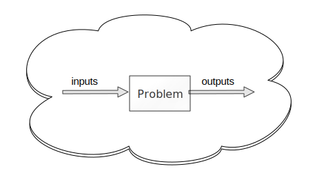
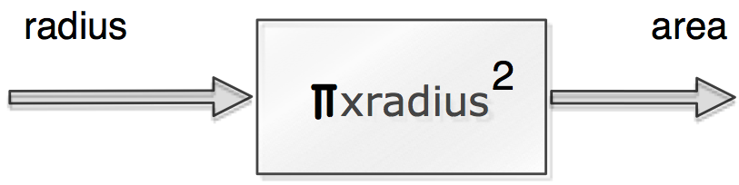
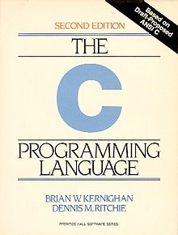
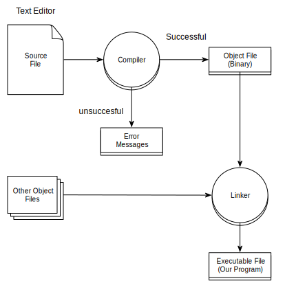

# <small/>Principles and Practice of Programming ($P^3$)

Teaching Team :
<p/><b>Xiaosong Yang</b> xyang@bournemouth.ac.uk (Unit Leader)
<p/><b>Jon Macey</b> jmacy@bournemouth.ac.uk
<p/><b>Richard Southern</b> rsouthern@bournemouth.ac.uk

---

## Unit Structure

- We have split the Unit into two main themes
- Semester 1
  - procedural programming in C
- Semester 2
  - Object Oriented programming in C++

--

## Semester 1
- Introduce the basic principles of programming using a combination of theory and practice to get you to solve simple problems using computer programs
- We have chosen the C programming language as it is a “middle level language” which works very well for teaching the principles of computer programming
- Most other languages share many common elements of the C language
- C is still widely used in a number of different areas

--

## Semester 2

- In Semester 2 we will begin to explore more complex paradigms such as Object Oriented programming
- To do this we have chosen C++ as it is an industry standard language for Film, Games and Effects
- The principles learnt in C will still be pertinent to C++ however  as you will see we can do much more

--

## Course Assessment

- The course is split into a 50-50 structure for assessment.
 - 50% Final written exam (2 hours)
 - 50 % practical assignments
- Assignment 1 in semester 1 worth 10% (of unit total)
- Assignment 2 in semester 2 worth 40% (of unit total)

--

## Intended Learning Outcomes (ILO's)
- Each unit has a series of ILO’s which outline what you will learn in the Unit for P3 these are as follow :-
  1. be able to implement basic CG algorithms using a suitable graphics API
  2. understand different programming paradigms applicable to their own praxis.
  3. demonstrate an ability to design and implement suitable  data structures for software development
  3. demonstrate an ability to select and use  suitable software engineering principles for the development of CGI tools and applications

--

## The bigger picture
- This unit is one of 4 specialist units you will be doing this year.
  - Discrete Mathematics
  - Mathematical Methods
  - Fundamentals of Computer Science
- All of these are connected and will support each other.
- here will be some overlap and cross-pollination between them all.

--

## Any Questions?
- please do not be afraid to ask questions.
- If you are still unsure please feel free to email as well.
- we also have demonstrators around to help with some of the more practical problems.

---

## What is Programming?
- Programming is one element of the discipline of Software Engineering. 
- It is typically the practical element that produces the output (a computer program / system)
- However this is only one part of the “bigger picture” of S.E. and computing in general.
- An number of the principles you will learn in this unit are applicable to the larger picture of Software Engineering and Development.

--

## What is Programming?
- For the purposes of this unit we will look at the following stages in the most depth
  - Design ( think about the problem / look at problem on paper)
  - Implementation (take the design and code it)
  - debugging / testing (make it actually work!)

--

<!-- .slide: id="method" -->

## <small>The Software Development method (Hanley & Koffman 1999)</small>
1. <a href="#/problem">Specify the problem requirements</a>
2. <a href="#/analysis">Analyse the problem </a>
3. <a href="#/design">Design the algorithm to solve the problem </a>
4. <a href="#/implement">Implement the algorithm </a>
5. <a href="#/test">Test and Verify the completed program / system</a>
6. <a href="#/maintain">Maintain and upgrade the program / system</a>

--

## 1. The Problem  <!-- .slide: id="problem" -->

- Specifying the problem forces you to state the problem clearly.
- We use a process of abstraction to remove unimportant aspects and zero in on the root problem.
- This can be an iterative process and may require interviews with the person stating the problem to dig deeper into what is required.
- There is a whole field of this area called “requirements engineering”

--


## 2. Analysis <!-- .slide: id="analysis" -->


- Analysing the problem involves identifying 
  - inputs : the data you have to work with
  - outputs : the desired result
  - We also have to consider any additional constraints on the solution.

--

## Check again
- If step one and two are not done properly we will be solving the wrong problem.
- Remember to read the problem statement carefully, first to get a clear understanding of the problem and secondly to help identify the input and outputs.

--

## <a href='#/method'>Example </a>

“Compute and display the area of a circle given the radius of the circle r”

--


## 3. Design     <!-- .slide: id="design" -->


- Designing the algorithm to solve the problems requires you to develop a list of steps called an **algorithm**.
- This can sometimes be the most difficult part of the problem solving process.
- It is usually best not to try and solve the problem all at once but to break things down into smaller steps.
- This is know as a top-down design approach

--

## Algorithm for Circle problem

<div id="mySlideLeft"   >

</div>    
<div id="mySlideRight">


  <p data-markdown> 1. Get the data </p>
  <p data-markdown> 2. Perform the calculation </p>
  <p data-markdown> 3. Display the result </p>
  
</div>

--

## 4. Implementation <!-- .slide: id="implement" -->
- This is where we actually write the program code.
- What we use and how we do this depend upon a number of factors.
- If we have done the previous steps correctly this should be a relatively simple step.

--

## 4. Testing <!-- .slide: id="test" -->

- Testing and verifying the program requires testing the completed program to verify that it works as desired.
- It is important that multiple test cases are run and out of bounds cases are also tested.
- There are many different testing strategies and we will look at many of these during the course (more in the 2nd year).

--

## 5. Maintenance <!-- .slide: id="maintain" -->
- Maintaining and updating the program involves modifying a program to remove any bugs or to add new features when requested.
- An important part of this process is to ensure that the code is properly documented so other programmers can help with the maintenance.
- At present you will be working individually so this may not seem important, however once you are in the industry you will be part of a team and this is an important part of programming etiquette.

--

## <!-- .slide:  data-background-image="images/dontpanic.gif" -->

--

## Don't Panic
- You have 3 years of programming ahead.
- It takes practice but will become easier.
- once the initial (steep) learning curve is over [tacit knowledge](https://en.wikipedia.org/wiki/Tacit_knowledge) will give you ideas and patterns to help solve problems more easily

---

<div id="mySlideLeft"   > <br/><br/><H1>Hello World</H1> </div>
<div id="mySlideRight">


</div>

- The original hello world program was presented in the Kernighan and Richie book “The C programming Language”
- It has now become a bit of a programming in-joke, where the hello world program is the first program written in any language to demonstrate the basic process.

--

##Python

<div class="stretch">
<iframe src="helloWorldPy.html" style="border:0px #FFFFFF solid;" name="code" scrolling="yes" frameborder="1" marginheight="0px" marginwidth="0px" height="100%" width="100%"></iframe>
</div>

--

##Javascript

<div class="stretch">
<iframe src="javascript.html" style="border:0px #FFFFFF solid;" name="code" scrolling="yes" frameborder="1" marginheight="0px" marginwidth="0px" height="100%" width="100%"></iframe>
</div>

--

## Java
```java
class HelloWorld 
{
  public static void main(String args[])
  {
    System.out.println("Hello World!");
  }
}
                          
```

--


## [interpretive vs compiled language](https://en.wikipedia.org/wiki/Interpreted_language)
- These first two languages are know as interpretive (scripting) languages
- they run in a form of "virtual" machine and are executed line by line
- this means I can embed them in a webpage and execute them
- Languages like Python, Java, JavaScript are interpreted

--

## [interpretive vs compiled language](https://en.wikipedia.org/wiki/Interpreted_language)
- Most of the languages we use will need to be compiled
- this means we need to use a tool to convert the source code into machine language
- The following examples of C/C++ need to be converted using a tool called a compiler

--

## C
``` C
#include <stdio.h>
#include <stdlib.h>

int main()
{
  printf("Hello World!\n");
  return EXIT_SUCCESS;
}
```

```bash
> clang helloWorld.c -Wall -g -o helloWorld
>./helloWorld
Hello World!
>
```

--

## C++
``` C++
#include <iostream>
#include <cstdlib>

int main()
{
  std::cout<<"Hello World!\n";
  return EXIT_SUCCESS;
}
```
```bash
> clang++ helloWorld.c -Wall -g -o helloWorld
>./helloWorld
Hello World!
>
```

--


##The Compilation process


--

## [clang]((http://clang.llvm.org/)
- clang is the c language compiler from the llvm (Low Level Virtual Machine) project
- The clang command is invoked on the command line and passed a series of command line options to determine how the compiler works
- If we have a single source file we can combine the compilation and linking stages in one go


--


##Compile

```bash
clang -g -Wall  HelloWorld.c -o HelloWorld
```

```bash
gcc -g -Wall  HelloWorld.c -o HelloWorld
```
- flags control the compiler function
  - -g turn on debug information
  - -Wall enable all warnings
  - -o output name (default if not used a.out)

--

##clang vs gcc
- clang is a modern C compiler based on the llvm architecture.
- It has the best error reporting and diagnostics of the two compilers
- some [ABI](https://en.wikipedia.org/wiki/Application_binary_interface) elements are compatible however mixing both compilers is usually problematic 
- However this is also true of different version of the same compiler.

---

#References

- Hanley J.R. Koffman E. B. 1999, Problem Solving and Program Design in C, 3rd, Addison Wesley, International Addition

---

# Self study
- [https://computationalthinkingcourse.withgoogle.com/unit](https://computationalthinkingcourse.withgoogle.com/unit)
- [Computational Thinking](http://blog.stephenwolfram.com/2015/03/frontiers-of-computational-thinking-a-sxsw-report/)
- [numpy](http://www.numpy.org/)
- [Teaching kids real math with computers](http://www.ted.com/talks/conrad_wolfram_teaching_kids_real_math_with_computers?language=en)

