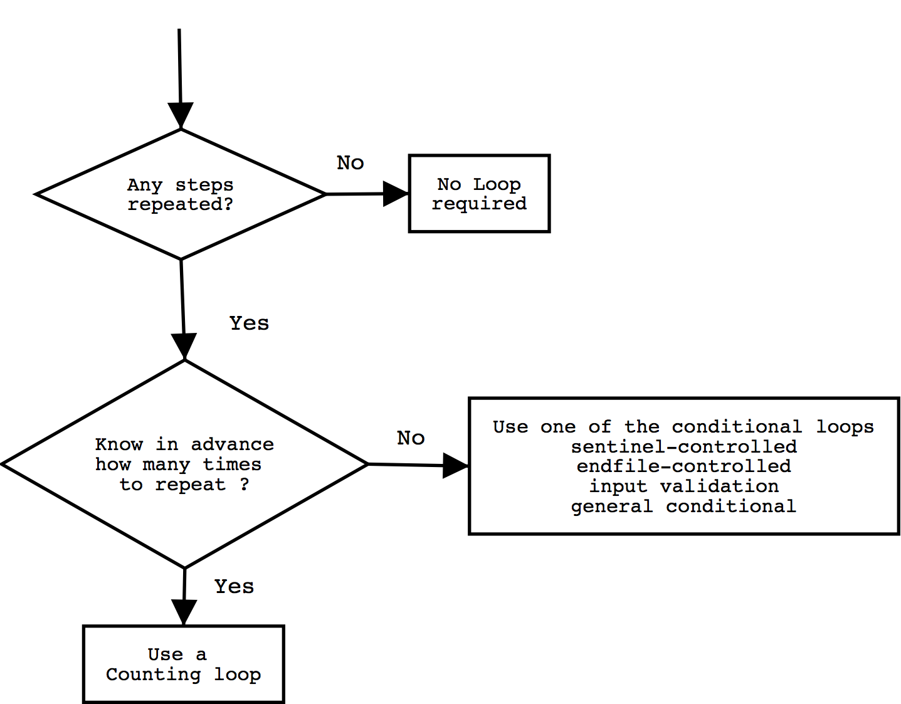
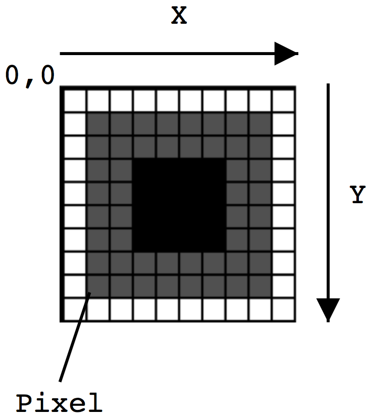

## Selection Structures
Jon Macey
jmacey@bournemouth.ac.uk

---

## Selection Structures
- So far all the programs we have written have executed statements in sequence as shown below
```c
int a=10;
int b=20;
int c=a*b;
printf("The product of %d*%d=%d \n",a,b,c);
```

--

## [Conditions](https://en.wikipedia.org/wiki/Conditional_(computer_programming)
- A program can choose between different sequences ( held between the { } ) by testing the value of a variable.
- This generally uses the ``` if() ``` programming construct 

--

## Relation and Equality operators
- Most conditions that we use to perform comparisons will have one of the forms :
```
variable relational-operator variable 
variable relational-operator constant 
variable equality-operator   variable 
variable equality-operator   constant 
```

--

##operators

|Operator       | Meaning                 |  Type         |
|---------------|-------------------------|---------------|
|   ```<```     | Less than               | relational    |
|   ```>```     | Greater than            | relational    |
|   ```<=```    | Less than or Equal      | relational    |
|   ```>=```    | Greater than or Equal   | relational    |
|   ```==```    | Equal to                | equality      |
|   ```!=```    | Not Equal to            | equality      |

--

## example
- given 

```c
int x=-5;
int power=1024;
#define MAXPOW 1024
int y=7;
double item=1.5;
#define MINITEM -999.0
char maleOrFemale='M';
int num=999;
#define SENTINAL 999
```

--

## example 

|<small/>Operator | <small/>Condition | <small/>English meaning  | <small/>Value |
|----------|-----------|------------------|-------|
| <small/>```<=``` | <small/>```x<=0``` | <small/>x less than or equal to 0 |<small/> 1 (true) |
| <small/>```<``` | `<small/>``power<MAXPOW``` | <small/>power less than MAXPOW |<small/> 0 (false) |
|<small/> ```>=``` | <small/>```x>=y``` | <small/>x greater than or equal to y | <small/>0 (false) |
|<small/> ```>``` | <small/>```item>MINITEM``` | <small/>item greater than MINITEM | <small/>1 (true) |
| <small/>```==``` | <small/>```MaleOrFemale == 'M'``` | <small/>MaleOrFemale equal to 'M' |<small/> 1 (true) |
| <small/>```!=``` | <small/>```num != SENTINEL``` | <small/>num not equal to SENTINEL | <small/>0 (false) |

--

##Logical Operators
- Most decisions involve more than one choice so we need to combine operators. 
- To do this we use the logical operators shown below

```
&&  the and operator
||  the or operator
!   the not operator
```

- Using these we can form more complex operators such as

```
salary < MINSALARY || dependents > 5
tempurature > 90.0f && humidity <0.90f
n>=0 && n<=100
0 <= n && n<=100
```
- The ! (not) operator has a single operand and yields the logical complement or negation of its operand

--

## The && (and) Operator

| operand a | operand b | ```a && b``` |
|-----------|-----------|--------------|
| nonzero (true) |nonzero (true) | 1 (true) |
| nonzero (true) |0 (false) | 0 (false) |
| nonzero (true) |0 (false) | 0 (false) |
| 0 (false) |nonzero (true) | 0 (false) |
| 0 (false) |0 (false) | 0 (false) |


--

## [and gates](https://en.wikipedia.org/wiki/AND_gate)

<div class="stretch">
<iframe src="and.html" style="border:0px #FFFFFF solid;" name="code" scrolling="yes" frameborder="1" marginheight="0px" marginwidth="0px" height="100%" width="100%"></iframe>
</div>

<p/><small/>simcirjs from https://kazuhikoarase.github.io/simcirjs/

--

## The || (or) Operator

| operand a | operand b | a :: b |
|-----------|-----------|--------------|
| nonzero (true) |nonzero (true) | 1 (true) |
| nonzero (true) |0 (false) | 1 (true) |
| nonzero (true) |0 (false) | 1 (true) |
| 0 (false) |nonzero (true) | 0 (false) |
| 0 (false) |0 (false) | 0 (false) |

--

## [or gates](https://en.wikipedia.org/wiki/OR_gate)

<div class="stretch">
<iframe src="or.html" style="border:0px #FFFFFF solid;" name="code" scrolling="yes" frameborder="1" marginheight="0px" marginwidth="0px" height="100%" width="100%"></iframe>
</div>

<p/><small/>simcirjs from https://kazuhikoarase.github.io/simcirjs/


--

#The !(not) Operator

| operand a | !operand a |
|-----------|------------|
| nonzero (true) | 0 (false) |
|  0 (false) | nonzero (true) | 

--

# [not gate (invertor)](https://en.wikipedia.org/wiki/Inverter_(logic_gate)

<div class="stretch">
<iframe src="not.html" style="border:0px #FFFFFF solid;" name="code" scrolling="yes" frameborder="1" marginheight="0px" marginwidth="0px" height="100%" width="100%"></iframe>
</div>
 
<p/><small/>simcirjs from https://kazuhikoarase.github.io/simcirjs/

--

## The if statement

- Now that we know how to ask a question in C syntax we next need to decide upon which course of action to follow once the question has been asked.
- To do this we use the if statement as follows

``` c
if (positionX <= 10)
{
  update();
}
else 
{
  reverse();
}
```

--

##If statements with one condition
- If statements do not always have and else as shown

```c
if(denom !=0)
  value = num/denom;
```

- If we wish to execute more than one statement we need to use { } as follows

```c
if(denom !=0)
{
  value = num/denom;
  printf("value %d\n",value);
}
else
  printf("division by zero!\n");
```

--

##coding standard
- To avoid ambiguity and possible errors in the if clause it is recommended by the coding standard to always use { } braces for statements after the if / else clauses as follows
```c
if(denom !=0)
{
  value = num/denom;
  printf("value %d\n",value);
}
else
{
  printf("division by zero!\n");
}
```

--

## [A note on style](https://en.wikipedia.org/wiki/Indent_style)
- there are many different styles of brace usage in programming
- there is no right or wrong way to do it and usually it is personal preference or company standard
- I prefer the [Allman style](https://en.wikipedia.org/wiki/Indent_style#Allman_style) 

``` c
if( a == b)
{
  doSomething();
}
else 
{
  doSomethingElse();
}
```

--

## [A note on style](https://en.wikipedia.org/wiki/Indent_style)

- Richard prefers the [K&R / Stroustrup style](https://en.wikipedia.org/wiki/Indent_style#Variant:_Stroustrup) 

``` c++
if( a == b){
  doSomething();
}
else {
  doSomethingElse();
}
```

- It doesn't really matter which you use just be consistent! 

--

## Multiple Alternative Decision
- Any number of else if statements can be placed after the initial if. 
- However most compilers limit the amount.
-  The final else statement may be omitted however it is a “catch all” at the end of the compound statement.

```
if( condition1 )
  statement1;
else if( condition2 )
  statement2;
  .
  .
  .
else if( conditionN)
  statementN;
else
  statementFallThrough;
```

--

## Compound If statements

- At first the following code seems complex but if proper indentation and comments are used it should be easy to follow

``` c
if( condition1 ) 
{
  statement1
  if( condition2 ) 
  {
    statement2 
  }
  else
  {
    statement3
    statement4
  }//end else
} // endif condition1

else if( condition5 ) 
{
  statement5 
}
else
{
  statement6
}

```

--

## Compound If statements
- Most modern text editors and IDE's allow for code folding and bracket matching
- this makes life a lot easier so it is recommended to use them.

--

## The switch statement
- The switch statement is used to select from a number of different cases based upon the value of a single variable.
- It can only be used with ordinal values. That is values which can be evaluated down to an integer.
- This means that switch case statements are used with either integer or char values.
- The general form of a switch / case statement is as follows

--

## The switch statement

- The general format of the switch / case statement is as shown.
- The coding standard recommends the use of { } to delimit cases, however this is not required by the C language.
- Also we recommend always having a default

```c
switch ( condition1  )
{
  case  [value1 ] :
     statement1
  break;  
  . 
  .
  case  [valuen ] :
     statementn
  break;
  default :
    statement 
  break;
} // end switch

```

--

## [example](https://github.com/NCCA/PPPLectureCode/blob/master/Lecture3/switch.c) 
```
#include <stdio.h>
#include <stdlib.h>

int main()
{
	printf("please enter y or n\n");
	char answer;
	scanf("%c",&answer);

  switch(answer)
  {
    case 'y' :
    case 'Y' :
    {
      int i=0;
      printf("you pressed y %d\n",i);   
    break;
    }
    case 'n' :
    case 'N' :
    {
      int i=10;
      printf("you pressed n %d\n",i);
    break;
    }
    default :
      printf("you pressed %c\n",answer);
    break;
  }

exit(EXIT_SUCCESS);


}
```

```
$clang -Wall -g switch.c -o switch
$./switch
please enter y or n
y
you pressed y 0
$./switch
please enter y or n
n
you pressed n 10
```

---

## [Increment Operator](https://en.wikipedia.org/wiki/Increment_and_decrement_operators)
- To increment the value of a variable we can do the following
``` 
conuter=counter+1;
// or
counter+=1;
```

- += is known as [augmented assignment](https://en.wikipedia.org/wiki/Augmented_assignment)
- Some languages including C/C++ also gives us a short cut to the above operation by use of the ++ operator

```
counter++;
```

--

## [Decrement Operator](https://en.wikipedia.org/wiki/Increment_and_decrement_operators)

- To decrement the value of a variable we can do the following
``` 
conuter=counter-1;
// or
counter-=1;
```

- C also gives us a short cut to the above operation by use of the -- operator
```
counter--;
```

--

##stepped increments / decrements
- It is also possible to add different values as shown in the following code snippets

```
int counter=0;
float x=0.0;
counter+=5;
counter-=10;
x+=0.5;
x-=0.5;
```

--

## Pre or Post Increment / Decrement

- The value of the expression in which the ++ operator us used depends on the the position of the operator.
- When the ++ is placed in-front of its operand (prefix increment), the value of the expression is the variables value after incrementing.
- When the ++ is placed after the operand (postfix increment), the expressions value is the value of the variable before incrementing.
- This is also true of the -- operator as shown in the following examples

--

# [example](https://github.com/NCCA/PPPLectureCode/blob/master/Lecture3/inc.c) 

```c 
#include <stdio.h>
#include <stdlib.h>

int main()
{
  int n=4;

  printf("%d ",++n);
  printf("%d\n",n);

  n=4;
  printf("%d ",n++);
  printf("%d\n",n);

  return EXIT_SUCCESS;
}
```

```
$clang -Wall -g inc.c -o inc
$./inc
5 5
4 5
```

--

## [example](https://github.com/NCCA/PPPLectureCode/blob/master/Lecture3/dec.c)

```c
#include <stdio.h>
#include <stdlib.h>
int main()
{
	int n=4;

	printf("%d ",--n);
	printf("%d\n",n);

	n=4;
	printf("%d ",n--);
	printf("%d\n",n);

	return EXIT_SUCCESS;
}
```

```
$clang -Wall -g dec.c -o dec
$./dec
3 3
4 3
```

--

## [example](https://github.com/NCCA/PPPLectureCode/blob/master/Lecture3/plusplus.c)

- What is the value of i?
```
#include <stdio.h>
#include <stdlib.h>
int main()
{
	int i = 0;
	i = i++ + ++i;
	printf("%d\n",i);
	return EXIT_SUCCESS;
}
```

```
clang -Wall -g plusplus.c -o plusplus
plusplus.c:9:7: warning: multiple unsequenced modifications to 'i'
      [-Wunsequenced]
        i = i++ + ++i;
             ^    ~~
```

- The Answer is 2  <!-- .element: class="fragment" data-fragment-index="2" -->


--


## [++i faster than i++](http://stackoverflow.com/questions/24901/is-there-a-performance-difference-between-i-and-i-in-c)

- In theory ++i should be faster than i++ as the i++ needs to make a temporary copy of the initial value of i to increment it with
- Most modern compilers should optimise this as a matter of course, however for speed purposes and to show intend, it is best to use the ++i version whenever possible and applicable.
- [See here for more discussions](http://stackoverflow.com/questions/24901/is-there-a-performance-difference-between-i-and-i-in-c)

---


## Repetition in Programs (Iteration)
- Using Selection we can decide which elements of a decision tree we wish to follow and execute statements dependent upon a decision.
- Using Iteration we can execute a group of statements numerous times.
- So how do we decide to use a loop when designing a program?


--

## Repetition in Programs (Iteration)
- The answer to the first question indicates whether the algorithm needs a loop, and what statements to include in the loop body.
- The answer to the other questions determine what type of loop to use.

--

## Repetition in Programs (Iteration)

1. Where there any steps I repeated as I solved the problem? If so which ones?
2. If the answer to question 1 is yes, did I know in advance how many times to repeat the steps?
3. If the answer to question 2 is no, how did I know how long to keep repeating the steps?

--

## Different types of loop



--

## Comparison of Loop Kinds

- Counting loop 
  - When we can determine before loop execution exactly how many loop repetitions will be needed to solve the problem
  - We use either the while or for loop structure
- Sentinel - control loop
  - Input of a list of data of any length ended by a special value
  - We use either the while or for loop structure

--

## Comparison of Loop Kinds

- Endfile Control loop
  - Input of a single list of data of any length from a data file
  - We use either the while or for loop structure
- Input validation loop
  - Repeated interactive input of a data value until a value within the valid range is entered
  - We use the do - while structure

--

## Comparison of Loop Kinds
- General conditional loop
  - Repeated processing of data until a desired condition is met
  - We use either the while or for loop structure  

--

## <small>Counting Loops using the while statement</small>
- The loop shown below using pseudo code is know as a counter-controlled loop because it's repetition is managed by a loop control variable.

```
Set loop control variable to 0.
while loop control variable < final value
    ...
    Increase loop control variable by 1.
```

--

## [example](https://github.com/NCCA/PPPLectureCode/blob/master/Lecture3/whileLoop.c)

```C
#include <stdio.h>
#include <stdlib.h>

int main()
{

	int countEmp=0;
	int hours;
	int rate;
	int totalPay=0;

	while(countEmp < 3)
	{
      printf("loop value %d\n",countEmp);
      printf("Hours> ");
      scanf("%d",&hours);
      printf("Rate >");
      scanf("%d",&rate);
      int pay=hours*rate;
      printf("Pay is %d\n",pay);
      ++countEmp;
      totalPay+=pay;
	}
	printf("\nAll employees processed %d\n",totalPay);
	return EXIT_SUCCESS;
}
```

--

## [The for Loop](https://en.wikipedia.org/wiki/For_loop)
- C provides the for as another structure for generating loops.
- So far all the loops we have used have the following components
  1. initialising of the loop control variable
  2. test of the loop repetition condition
  3. change (update) of the loop control variable
- The for structure provides a place for each of these in the same statement as shown in the next slide

--

## For loop structure

``` 
for( initialisation expression; 
     loop repetition condition; 
     update expression
 ) 
{
      statement(s)
}

```

```
// Note in ansi C we have to declare the variable i before we use it
int i;
for(i=0; i<10; ++i)
{
    printf("%d\n",i);
}
```

--

## [-std=c99](https://en.wikipedia.org/wiki/C99)

- The newer C standard allows for the following code to be used
```
for(int i=0; i<10; ++i)
{
    printf("%d\n",i);
}
```

- This is similar to C++ and Java and the scope of the variable i (in this instance) is local only to the scope of the braces of the loop.
- To enable this feature we need to use the following command line argument to gcc however it is not needed for clang
``` 
gcc -Wall -g -std=c99 loop.c -o loop 
```

--

## The Sentinel-Control Loop
- This type of loop used some kind of value to determine if the loop should exit or not (The Sentinel value)
- This is very useful when we are unsure of how many repetitions the loop must do
- For example a program to enter students grades must expect values from 0 - 100
- If we wish to compute the average grade we enter all the values and then indicate that we have finished
- To do this some Sentinel value is used which is not in the normal range of values expected such as -99
- The following example shows how this is implemented

--

## [example](https://github.com/NCCA/PPPLectureCode/blob/master/Lecture3/grades.c)

```
#include <stdio.h>
#include <stdlib.h>

#define SENTINEL -99

int main()
{
	// initialise values
	int sum=0;
	int grade;
	int count=0;
	// prompt and get first grade
	printf("Enter first Grade or %d to quit\n",SENTINEL);
	scanf("%d",&grade);
	// now loop until we get the sentinel value
	while(grade !=SENTINEL)
	{
		// make running sum
		sum+=grade;
		// get next value
		printf("Enter next Grade or %d to quit\n",SENTINEL);
		scanf("%d",&grade);
		// increment count
		++count;
	}
	// now calculate the average
	printf("Total grades %d average %f \n",count, (float)sum/count);
	return EXIT_SUCCESS;

}
```

--

## Output

```
Enter first Grade or -99 to quit
50
Enter next Grade or -99 to quit
75
Enter next Grade or -99 to quit
75
Enter next Grade or -99 to quit
34
Enter next Grade or -99 to quit
80
Enter next Grade or -99 to quit
25
Enter next Grade or -99 to quit
75
Enter next Grade or -99 to quit
-99
Total grades 7 average 59.142857 
```
- This type of loop is quite common and is useful for testing the loop condition before the statements in the loop are carried out
- However it is some times necessary to execute the loop statements before testing the loop conditions
- To do this we use the do .. while structure

--

##The do while Statement

- The general form of a do while loop is
  1. Get a data value.
  2. If data value isn't in acceptable range go back to step 1
- For example to print the Fibonacci sequence for n numbers we could use the following code


--


## [example](https://github.com/NCCA/PPPLectureCode/blob/master/Lecture3/doWhile.c)

```
#include <stdio.h>
#include <stdlib.h>

int main()
{
  printf("enter a number \n");
  int num;
  scanf("%d",&num);

  unsigned long int count=0;
  unsigned long int oldNumber=1;
  unsigned long int currentNumber=1;
  unsigned long int nextNumber;
  printf("%ld ",currentNumber);

  do
  {
    printf("%ld ",currentNumber);
    // calculate the next number by adding the
    // current number to the old number
    nextNumber = currentNumber + oldNumber;
    oldNumber = currentNumber;
    currentNumber = nextNumber;
  }while(++count <num);

  printf("\n");
  return EXIT_SUCCESS;
}
```

--


- It is very common to nest loops so that one loop executes within another
- Consider the grid above
- To draw this we need to go from left to right on the grid and from the top to the bottom
- To do this we can use two loops one to do the left to right (X) and one the top to bottom (Y)

--

## nested for

```c
#define HEIGHT 10 
#define WIDTH 10 
int r,g,b;
// set to red 
r=255;
g=0; b=0;
for(int y=0; y<HEIGHT; ++y) 
{
  for(x=0; x<WIDTH; ++x) 
  {
    // set the colour at x,y to rgb
    putPixel(x,y,r,g,b); 
  } // end for x
}// end for y
```

--

## example ([javascript](http://www.w3schools.com/js/))

<div class="stretch">
<iframe src="loop.html" style="border:0px #FFFFFF solid;" name="code" scrolling="yes" frameborder="1" marginheight="0px" marginwidth="0px" height="100%" width="100%"></iframe>
</div>


---

## Further reading
- [https://en.wikibooks.org/wiki/C_Programming](https://en.wikibooks.org/wiki/C_Programming)
- [https://en.wikipedia.org/wiki/Branch_predication](https://en.wikipedia.org/wiki/Branch_predication)
- [https://en.wikipedia.org/wiki/Yoda_conditions](https://en.wikipedia.org/wiki/Yoda_conditions)
- [https://en.wikipedia.org/wiki/Boolean_algebra](https://en.wikipedia.org/wiki/Boolean_algebra)

--

## References
- Hanly. J. R Koffman E. B. 1999, Problem Solving & Program Design in C, 3rd Edition, Addison Wesley, International Ed
- Sebesta R. W. 2002, Concepts of Programming Languages, 5th edition, Addison Wesley, International Ed

---

<H2>My Notes </H2>
<div class="stretch">

<iframe id="notesFrame" onpageshow="loadNotes();" onload="loadNotes();" style="border:0px #FFFFFF solid;" name="code" scrolling="yes" frameborder="1" marginheight="0px" marginwidth="0px" height="100%" width="100%" ></iframe>
</div>
