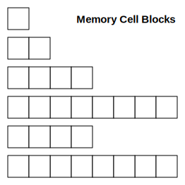
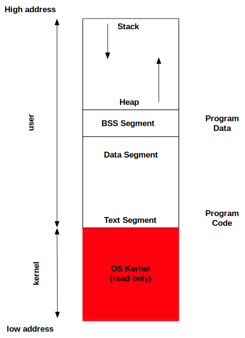
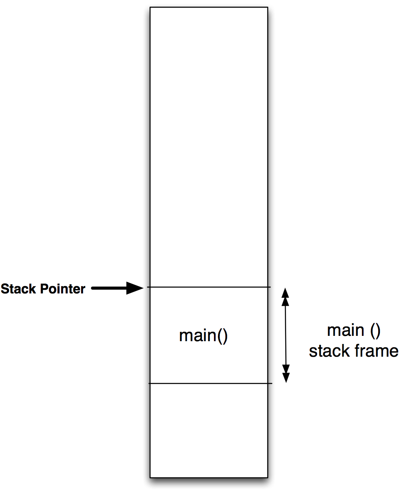
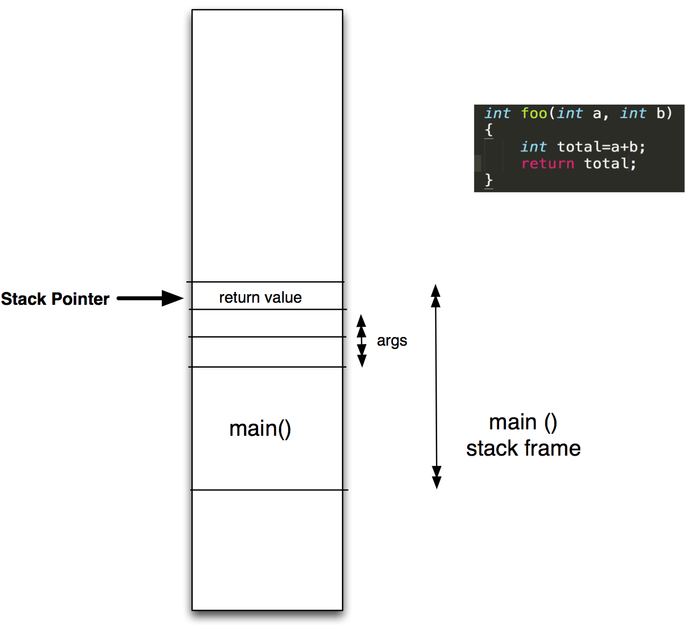
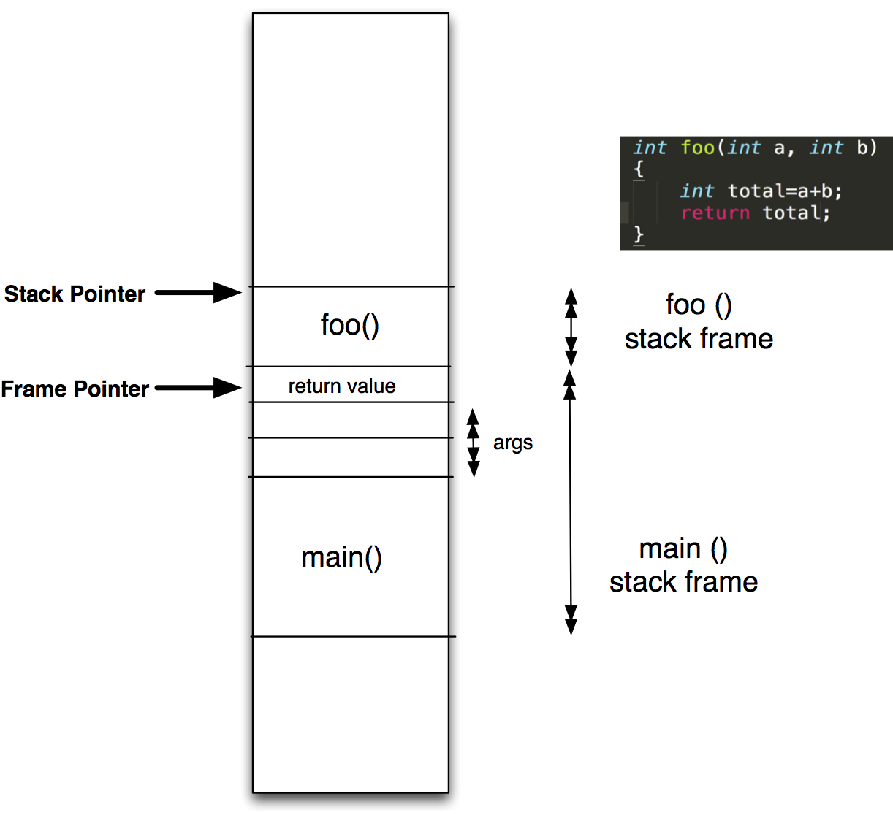
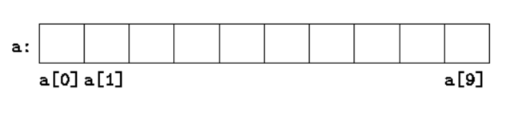
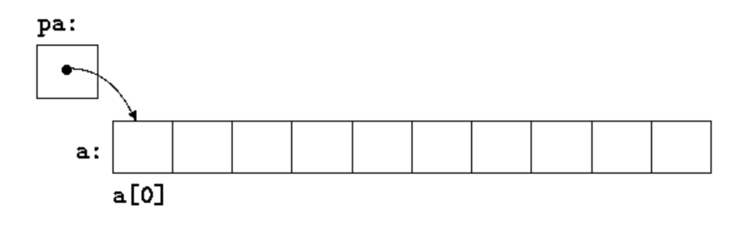

# Memory and Pointers
Jon Macey

jmacey@bournemouth.ac.uk

---

## Lets think about memory
- We can think of memory as a series of empty slots
- Each cell in the slot will hold 1 Byte
- To identify which cell something is in we need an identifier. 
- This is called a memory address
- This is allocated by the OS when we communicate with it that we need a memory slot

--

# Remember this?
- sizeof( data type)

```
sizeof(char)= 1 
sizeof(short int)= 2 
sizeof(int)= 4 
sizeof(long int)= 8 
unsigned versions
sizeof(unsigned char)= 1 
sizeof(unsigned short int)= 2 
sizeof(unsigned int)= 4 
sizeof(unsigned long int)= 8 
```

- this tells us how many 1 byte memory cells each data type uses

--

```
#include <stdio.h>
#include <stdlib.h>

int main()
{
	printf("sizeof(char)=%ld\n",sizeof(char));
	printf("sizeof(short int)=%ld\n",sizeof(short int));
	printf("sizeof(int)=%ld\n",sizeof(int));
	printf("sizeof(long int)=%ld\n",sizeof(long int));
	printf("sizeof(float)=%ld\n",sizeof(float));
	printf("sizeof(double)=%ld\n",sizeof(double));
	printf("sizeof(void*)=%ld\n",sizeof(void*));

	return EXIT_SUCCESS;
}
```
<div>
<div id="mySlideLeft">
<pre><code>
sizeof(char)=1
sizeof(short int)=2
sizeof(int)=4
sizeof(long int)=8
sizeof(float)=4
sizeof(double)=8
sizeof(void *)=8

</code></pre>
</div>
<div id="mySlideRight">

</div>
</div>

--

# & the address operator
- Sometimes know as a reference operator will give us the memory address of the cell containing the value
- we can usually use & to print it out.

<div>
<div id="mySlideLeft">
<pre><code>
#include <stdio.h>
#include <stdlib.h>

int main()
{
 	double d=1.0;
 	float f=1.0;
	int i=0;
 	char c='c';
 	printf("i address is %p \n",&i);
	printf("c address is %p \n",&c);
	printf("d address is %p \n",&d);
	printf("f address is %p \n",&f);

	return EXIT_SUCCESS;
}
</pre></code>
</div>
	<div id="mySlideRight">
		<pre><code>
address of i is 0x7fff52ebc72c
address of c is d
address of c is 0x7fff52ebc72b
address of d is 0x7fff52ebc720
address of f is 0x7fff52ebc71c
		</code></pre>
	</div>
</div>

---

# Storage Areas
- When a program is executed three storage areas are created called segments.
- Text / Code Segment :- used for the machine code / program instructions including functions.
- Data Segment (Data + Block Started Symbol + Heap)
- The Stack Segment :-  used for all variables / function variables executed in main

--



--

# [Text / Code segment](https://en.wikipedia.org/wiki/Code_segment)
- This is where the machine code generated by the compiler lives
- It  is a fixed size (size of our program) and generally read only
- Usually if an attempt is made to modify data in this segment the program will core dump
- It is possible to make this “position independent” for use in shared libraries / DLL’s

--

# [Data Segment BSS](https://en.wikipedia.org/wiki/Data_segment)
- Block Started by Symbol
- This is where global (declared outside main) data that is not assigned a value is stored
- Also any data prefixed with static and not assigned a default value
- By default this is assigned zero unless given a default value

--

# Data Segment
- Any data that either global or static but has a pre-defined value is allocated in the data segment

<div class="stretch">
<iframe src="https://gcc.godbolt.org/#compilers:!((compiler:g6,options:'-std%3Dc%2B%2B11',sourcez:MQSwdgxgNgrgJgUwAQB4QHsDOAXATggQwFsA%2BAKFElkVQhzihACNyzxskBzKdJgqAIwBeAQG42YDt178ATOJwFsICEgBmPJUgAKASSEBmAHQCALALXiJHIgXAAKAJRkA3mQCQi5avZIQQgAZxJCRPbCUVP0kkAA9gpDIQsLgALhSIdBhsFBRpPkEcgHIAHTBC%2BOS0jKycvLki0vLE0PoqzOyUPQayitb09pyQbqakvuqOmOH4sgBfIAA)),filterAsm:(colouriseAsm:!t,labels:!t),version:3" style="border:0px #FFFFFF solid;" name="code" scrolling="yes" frameborder="1" marginheight="0px" marginwidth="0px" height="100%" width="100%"></iframe>
</div>

--

#[stack](https://en.wikipedia.org/wiki/Stack-based_memory_allocation)
- The stack is where local variables are allocated (automatic variables)
- This is denoted by the { for scope
- The data is popped or pushed into the stack following the Last In First Out(LIFO) rule
- The stack is also used to hold information about functions such as return values and parameters passed (more later)
- We have little control over the stack

--

# [stack frames](https://en.wikipedia.org/wiki/Call_stack)
- When a program calls a function, the function and it’s arguments / return point are placed on a stack 
- The function being called may also need local variables to be created on the stack so it will store the initial stack pointer as a “frame pointer”

--




--



--



--


# [functionstack.cpp](https://github.com/NCCA/ASELectureCode/blob/master/Lecture3/functionstack.cpp)

```
#include <iostream>
#include <cstdlib>
#include <execinfo.h>
#include <cxxabi.h>
#include <unistd.h>

void foo();
void bar(int);
void trace();

int main()
{
	trace();
	foo();
}

void bar(int a)
{	
	std::cout<<"in bar trace()\n";

	trace();
}


void foo()
{
	std::cout<<"in foo trace()\n";
	trace();
	bar(10);
}

void trace()
{
	void* callstack[128];
	int frames = backtrace(callstack, 128);
	char** strs = backtrace_symbols(callstack, frames);
	for (int i = 0; i < frames; ++i) 
	{
	   std::cout<<strs[i]<<'\n';
	}
	free(strs);
}

```


--

# [functionstack.cpp](https://github.com/NCCA/ASELectureCode/blob/master/Lecture3/functionstack.cpp)


```
0   a.out                               0x00000001067d722a _Z5tracev + 42
1   a.out                               0x00000001067d71e9 main + 9
2   libdyld.dylib                       0x00007fff9c1b4255 start + 1
3   ???                                 0x0000000000000001 0x0 + 1
in foo trace()
0   a.out                               0x00000001067d722a _Z5tracev + 42
1   a.out                               0x00000001067d7304 _Z3foov + 36
2   a.out                               0x00000001067d71ee main + 14
3   libdyld.dylib                       0x00007fff9c1b4255 start + 1
4   ???                                 0x0000000000000001 0x0 + 1
in bar trace()
0   a.out                               0x00000001067d722a _Z5tracev + 42
1   a.out                               0x00000001067d734a _Z3bari + 42
2   a.out                               0x00000001067d730e _Z3foov + 46
3   a.out                               0x00000001067d71ee main + 14
4   libdyld.dylib                       0x00007fff9c1b4255 start + 1
5   ???                                 0x0000000000000001 0x0 + 1
```

--

#recursion
- A recursive function is a function that can call itself
- Typical examples are things like calculating factorials or traversing tree like structures
- It is possible to get a stack overflow using these types of functions

--


```

#include <iostream>
#include <cstdlib>
#include <execinfo.h>
#include <cxxabi.h>
#include <unistd.h>
void trace()
{
// void *array[10];
//   size_t size;

//   // get void*'s for all entries on the stack
//   size = backtrace(array, 10);

//   // print out all the frames to stderr
//   backtrace_symbols_fd(array, size, STDERR_FILENO);
void* callstack[128];
int i, frames = backtrace(callstack, 128);
char** strs = backtrace_symbols(callstack, frames);
for (i = 0; i < frames; ++i) 
{
   printf("%s\n", strs[i]);
}
free(strs);

}

int fact( int n ) 
{
	trace();
	if ( n == 0 )
		return 1 ;
	else
		return fact( n - 1 ) * n ;
}

int main()
{
	fact(-1);
}
```

--

#Output


```
116 a.out                               0x0000000105370ef8 _Z4facti + 56
117 a.out                               0x0000000105370ef8 _Z4facti + 56
118 a.out                               0x0000000105370ef8 _Z4facti + 56
119 a.out                               0x0000000105370ef8 _Z4facti + 56
120 a.out                               0x0000000105370ef8 _Z4facti + 56
121 a.out                               0x0000000105370ef8 _Z4facti + 56
122 a.out                               0x0000000105370ef8 _Z4facti + 56
123 a.out                               0x0000000105370ef8 _Z4facti + 56
124 a.out                               0x0000000105370ef8 _Z4facti + 56
125 a.out                               0x0000000105370ef8 _Z4facti + 56
126 a.out                               0x0000000105370ef8 _Z4facti + 56
127 a.out                               0x0000000105370ef8 _Z4facti + 56
Segmentation fault: 11
```

--

# [heap](https://en.wikipedia.org/wiki/Memory_management#DYNAMIC)
- The heap is used for the programmer to define dynamic memory
- Data on the heap is anonymous (i.e. not linked to a variable) and the only way we can access it is via a memory address
- The programmer will then have to manage this data and is one of the most important parts of programming in a “non managed” language such as C/C++
- to manage this we use an abstraction called a pointer

---

# [What is a pointer](https://en.wikipedia.org/wiki/Pointer_(computer_programming)?

- It's a variable just like any other variable
- The pointer variable is defined by the asterisk * being placed before the variable name.
```
int *data;
```
- What did that just say ?
- Well the variable data is a pointer of type int.

--

# But why use Pointers?

- C and C++ allow the programmer to point into a program and at memory
- Pointers point to a memory address where a declared variable lives
- This allows us to create and manipulate dynamic data structures which can grow or shrink depending upon the program need.
- It also lets us allocate memory dynamically within a program.

--

# Pointers and Arrays

> In C, there is a strong relationship between pointers and arrays, strong enough that pointers and arrays should be discussed simultaneously.  
Any operation that can be achieved by array subscripting can also be done with pointers. 
The pointer version will in general be faster but, at least to the uninitiated, somewhat harder to understand.” 

- [The C Programming Language K&R](https://en.wikipedia.org/wiki/The_C_Programming_Language)

--

# Pointers and Arrays

``` 
int a[10];
```


--

# Pointers and Arrays

```
int *pa;
pa=&a[0];
```

- The assignment sets pa to point to element zero of a; that is, pa contains the address of a[0]. 


--

# Pointers and Arrays

- In declarations, ```[ ]``` means ‘‘array of’’ and ```∗``` means ‘‘pointer to.’’ 
- The assignment
```c++
x=*pa;
```
- will copy the contents of a[0] into x.

--

# Pointers and Arrays
- If pa points to a particular element of an array, then by definition pa+1 points to the next element, pa+i points i elements after pa, and pa-i points i elements before. 
- Thus, if pa points to ```a[0]```,  ```*(pa+i)``` refers to the contents of ```a[1]```, ```pa+i``` is the address of ```a[i]```, and ```*(pa+i)``` is the contents of ```a[i]```. 


--

# Pointers and Arrays

- a reference to a[i] can also be written as *(a+i). 
- In evaluating a[i], C converts it to *(a+i) immediately; the two forms are equivalent. 
- Applying the operator & to both parts of this equivalence, it follows that &a[i] and a+i are also identical: a+i is the address of the i-th element beyond a. 

--

# Variable Arithmetic
- Arithmetic on normal variables changes the value contained in the variable
- This is shown in the following table

| variable initializer | operation | result |
|--------------------|---------|------|
|```int i=0;```	|```i++;```	|```i=1```|
|```int i=5;```	|```i+=5;```	|```i=10```|
|```int i=10;```|	```i--;```	|```i=9```|
|```int i=10;```|	```i-=5;```	|```i=5```|

--

# [Pointer Arithmetic](https://github.com/NCCA/ASELectureCode/blob/master/Lecture3/ptrToArray.cpp)
- Arithmetic with pointers take the same form as with other variables as shown

```
#include <stdio.h>
#include <stdlib.h>

int main()
{

	int intArray[5]={32,65,1,399,9324};

	int *ptrToArray;
  int *end;

	// as we are using an array we could use
	// ptrToArray=intArray; however the following is
	// more clear when getting the first element
	ptrToArray=&intArray[0];
  end=&intArray[5];
	// i for loop
	//for (int i=0; i<5; i++)
	while(ptrToArray !=end)
  {
		//printf("intArray value = %c \n",*ptrToArray);
	  //printf("ptrToArray address= %p \n",ptrToArray);
		printf("%d %p\n",*ptrToArray,ptrToArray);
		// increment the pointer to next cell
		ptrToArray++;
	}

	return EXIT_SUCCESS;

}
```

--

#Output

```
value 32 address 0x7fff5495c240
value 65 address 0x7fff5495c244
value 1 address 0x7fff5495c248
value 399 address 0x7fff5495c24c
value 9324 address 0x7fff5495c250
```

- note the values increment by sizeof(int) and as stored in an array are contiguous

--

# is that all for pointers?

- no we are going to do lots more (including allocating memory)
- first we need to learn a few more things
- we will also look at C++ smart pointers


---

# [Dynamic memory Allocation](https://en.wikipedia.org/wiki/C_dynamic_memory_allocation)
- When we dynamically allocate memory in a C program we allocate to the heap.
- This means that the data will be persistent throughout the program lifetime.
- This means we have to manage this memory ourselves.
- As the OS allocates the memory for us it is possible that we can run out of memory  

--

# [mem2.c](https://github.com/NCCA/ASELectureCode/blob/master/Lecture3/mem2.c)

```
#include <stdio.h>
#include <stdlib.h>

int main()
{
	char *mem;
	mem=malloc(1844634744071325);
	free(mem);
	return EXIT_SUCCESS;
}
```

```
a.out(59967,0x7fffa4ea93c0) malloc: *** mach_vm_map(size=1844634744074240) failed (error code=3)
*** error: can't allocate region
*** set a breakpoint in malloc_error_break to debug
```

--

# [malloc](http://en.cppreference.com/w/cpp/memory/c/malloc)
- To allocate memory in C we use malloc (we can also use it in C++)
```
#include <stdlib.h> 
void * malloc(size_t size);
```
- This allocates size bytes of memory. 
- If the allocation succeeds, a pointer to the block of memory is returned.
- malloc returns a void pointer (void *), which indicates that it is a pointer to a region of unknown data type.
- NULL is returned if memory can’t be allocated

--

#[free](http://www.cplusplus.com/reference/cstdlib/free/)

- The memory created by malloc is persistent so needs to be cleared once finished with.
- This is done with the free function as follows

```
#include <stdlib.h> 
void free(void *ptr);

```
- The pointer must be passed to free only once; unless malloc has been re-called on the same pointer.

--

# [doublefree.c](https://github.com/NCCA/ASELectureCode/blob/master/Lecture3/doublefree.c)

```
#include <stdio.h>
#include <stdlib.h>

int main()
{
	char *mem;
	printf("%p\n",mem);
	mem=malloc(10);
	printf("%p\n",mem);
	// free mem
	free(mem);
	printf("%p\n",mem);
	// double free error
	free(mem);
	printf("%p\n",mem);
	return EXIT_SUCCESS;
}
```

```
a.out(39525) malloc: *** error for object 0x104a00840: pointer being freed was not allocated
*** set a breakpoint in malloc_error_break to debug
Abort trap: 6
```

--

# malloc / free
- The implementation of malloc is not guaranteed to initialise the memory to a set value 
- This can lead to security flaws where we can re-allocate memory and see previous values.
- In the case of the gcc implementation it seems that the values are set to a zero
- memory is always allocated contiguously so it can be accessed in the same way as an array as shown in the following example.

--

# [malloc2.c](https://github.com/NCCA/ASELectureCode/blob/master/Lecture3/malloc2.c)

```
#include <stdio.h>
#include <stdlib.h>


int main()
{
	float *mem;
	mem=(float*)malloc(20*sizeof(float));
	for (int i=0; i<20; ++i)
	{
		printf("%.1f \n",mem[i]);
	}
	printf("\n");
	// free up the memory
	free(mem);
	return EXIT_SUCCESS;
}

```

--


# [calloc](http://www.cplusplus.com/reference/cstdlib/calloc/)

- malloc does not initialise the memory (gcc however does seem to do so)
- The calloc function however is designed to both allocate memory and set it to zero.

```
#include <stdlib.h>
void *calloc(size_t count, size_t size);
```

- It allocates count bytes with size data type size

```
float *f =  calloc(20,sizeof(float));
```

--

# [realloc](http://en.cppreference.com/w/c/memory/realloc)

- The realloc function allows us to resize already allocated memory.
- We can shrink or grow this memory space

```
#include <stdlib.h>
void *realloc( void *ptr, size_t new_size );
```

- If realloc is unable to resize the memory region in-place, it allocates new storage then copies the required data. 
- The old pointer is then freed
- If realloc fails it returns a NULL but the original memory is unaffected

--

# [realloc.c](https://github.com/NCCA/ASELectureCode/blob/master/Lecture3/realloc.c)

```
#include <stdio.h>
#include <stdlib.h>

int main()
{
	int index=0;
	// allocate some memory
	char *alphabet = calloc(26,sizeof(char));
	char *more=calloc(26,sizeof(float));
	printf("\nalphabet %p \n",alphabet);
	printf("\nmore %p \n",more);

	for( char c='a'; c<='z'; ++c)
	{
		alphabet[index++]=c;
	}

	for(int i=0; i<26; ++i)
	{
		printf("%c ",alphabet[i]);
	}
	printf("\nrealloc %p \n",alphabet);
	alphabet=realloc(alphabet,26*2);
	printf("\nrealloc %p \n",alphabet);

	for( char c='A'; c<='Z'; ++c)
	{
		alphabet[index++]=c;
	}

	for(int i=0; i<26*2; ++i)
	{
		printf("%c ",alphabet[i]);
	}
	printf("\n");
  free(alphabet);
	return EXIT_SUCCESS;
}

```

--

# [memset](http://en.cppreference.com/w/c/string/byte/memset)

``` 
#include <string.h>
void *memset( void *dest, int ch, size_t count );
```

- The memset function set writes len bytes of value c (converted to an unsigned char) to string b
- It performs a byte to byte copy

--

#[memcpy](http://en.cppreference.com/w/c/string/byte/memcpy)

``` 
#include <string.h>
void* memcpy( void *dest, const void *src, size_t count );
```

- The memcpy function copies len bytes from memory area src to memory area dst.  
- If src and dst over-lap, behaviour is undefined. 

---


#References
- Hanly. J. R Koffman E. B. 1999, Problem Solving & Program Design in C, 3rd Edition, Addison Wesley, International Ed
- Sebesta R. W. 2002, Concepts of Programming Languages, 5th edition, Addison Wesley, International Ed
- http://www.tenouk.com/ModuleZ.html
- http://www.akkadia.org/drepper/cpumemory.pdf


