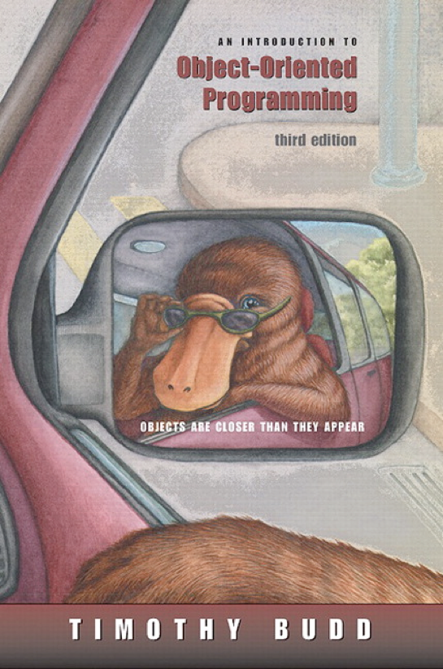
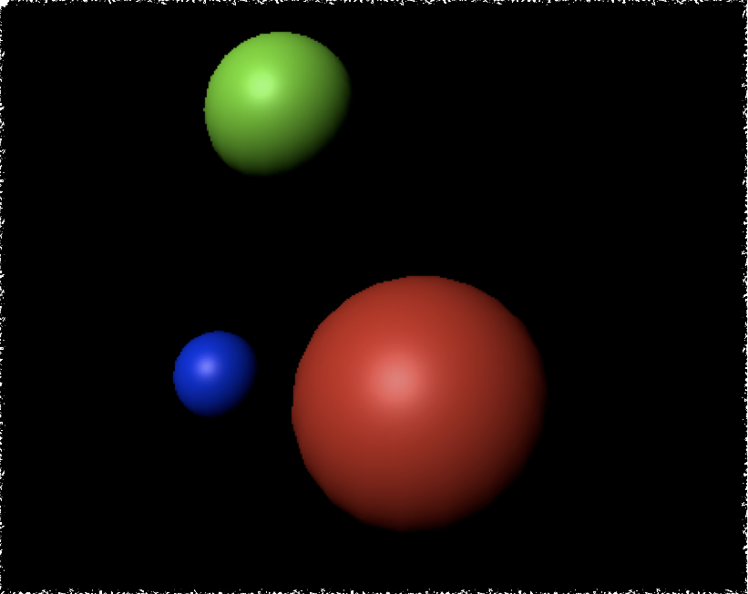
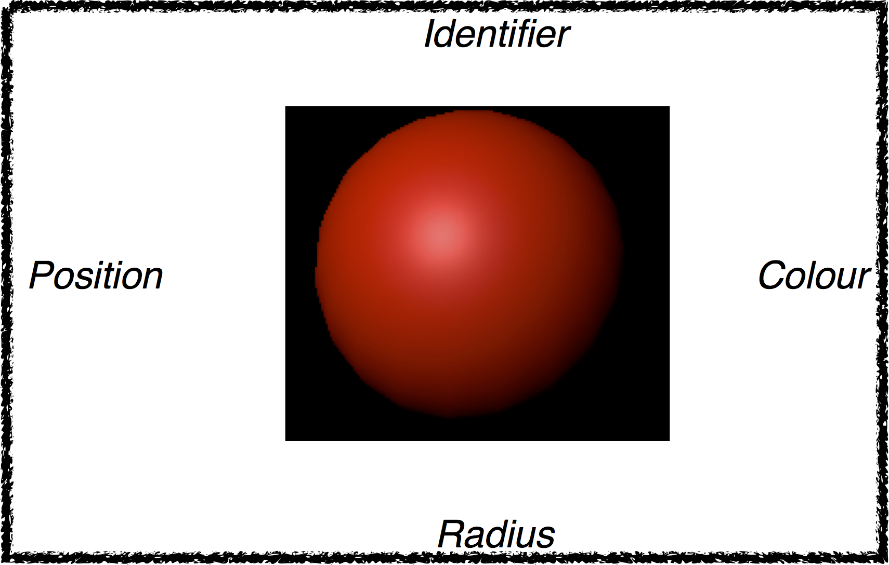
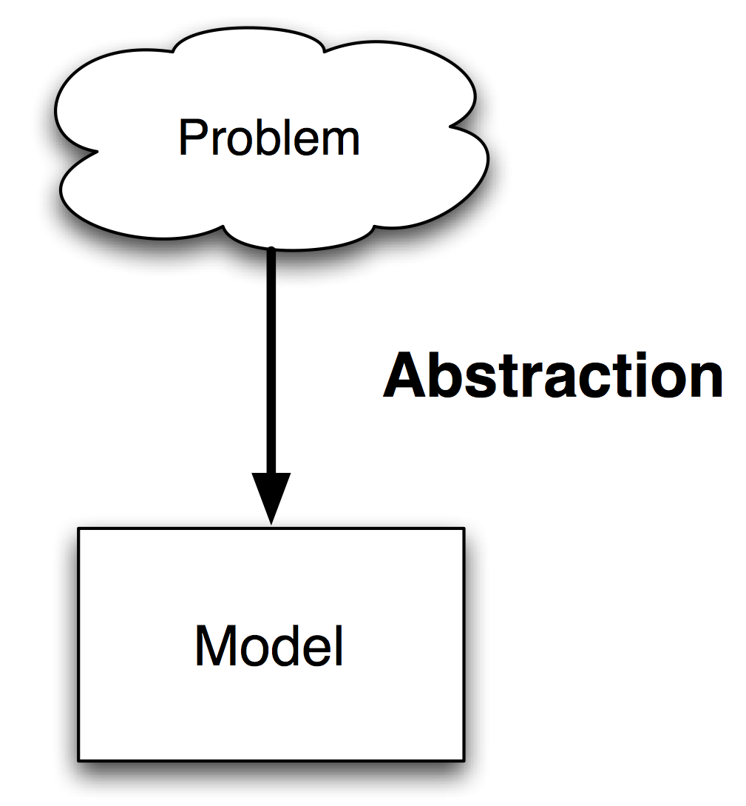

# Introduction To Object Orientation
Jon Macey

jmacey@bournemouth.ac.uk

---

## Theory Book

- Most of the initial theory for this unit will come from this book.
- Worth reading the first 3 chapters but not buying as it is only used for the first few weeks

--

## Learning C++
- There are many resources for learning C++ and most of these will be linked in the notes however the following are recomended
	- [Programming -- Principles and Practice Using C++](http://www.stroustrup.com/programming.html)
	- [The Definitive C++ Book Guide and List](http://stackoverflow.com/questions/388242/the-definitive-c-book-guide-and-list)
	- [C++ Core Guidelines](http://isocpp.github.io/CppCoreGuidelines/CppCoreGuidelines)

---

## Language and Thought


 <blockquote><small>
 <p>“Human beings do not live in the objective world alone, nor alone in the world of social activity as ordinarily understood, but are very much at the mercy of the  particular language which has become the medium of expression for their society. </p>
 <p>It is quite an illusion to imagine that one adjusts to reality essentially without the use of language and that language is merely an incidental means of solving specific problems of communication or reflection. </p>
 <p>The fact of the matter is that the “real world” is to a large extent unconsciously built up on the language habits of the group..... We see and hear and otherwise experience very largely as we do because of the language habits of our community predispose certain choices of interpretation”. </p>

</small></blockquote>

--

##Language and Thought
- The previous quote highlights how the language we speak directly influences the way in which we view the world.
- This analogy can also be applied to artificial languages such as computer programming languages
- “Making effective use of Object Oriented principles requires one to view the world in a new way. But simply using an OO Language (such as C++ C# or Java) doesn’t by itself, force one to become an OO programmer” (Budd 2002)
- Typically a programmer will think in the language most comfortable to them, it may not be the best suited to the problem.

--

## Church’s Conjecture


<blockquote cite="https://en.wikipedia.org/wiki/Church%E2%80%93Turing_thesis">
 <P> <B>Church’s Conjecture</B> : "Any computation for which there is an effective procedure can be realised by a Turing machine".</P>
<p>
  <cite><a href="https://en.wikipedia.org/wiki/Church%E2%80%93Turing_thesis">Church–Turing thesis</a></cite>
</p>
</blockquote>


- Accepting this conjecture means that any language in which it is possible to simulate a Turing machine is sufficiently powerful to perform any realisable algorithm.
- So do we really need Object Oriented languages as Procedural and Imperative languages should be able to build a turing machine

--

## What has OO done for us?
- Object Oriented techniques do not really provide any new computational power that permit problems to be solved that cannot , *in theory*, be solved by other means.
- OO techniques do make it easier and more natural to address problems in a fashion that tends to favour the management of large software problems.

--

## Procedural Programming
- In procedural programming we use
	- data structures to store information
	- function (passing in the structures) to process the information
- This can lead to complex / large function prototypes passing in and out large amounts of data.

--

## Object Oriented Programming
- In OO Programming we tend to combine both the data and the functions that act on them into a single unit.
- We then place an “interface” to this data know as methods which are allowed to act upon the data in a prescribed way.
- The traditional model of OO is to model “real world” objects, however as we shall discuss this is not really the case.

--

## [Inherently Harful?](http://harmful.cat-v.org/software/OO_programming/) 

<div class="stretch">
<iframe src="http://harmful.cat-v.org/software/OO_programming/" style="border:0px #FFFFFF solid;" name="code" scrolling="yes" frameborder="1" marginheight="0px" marginwidth="0px" height="100%" width="100%"></iframe>
</div>

--

## Agents and Communities
- The common "model" of teaching OO is :-
	- An Object Oriented program is structured as a community of interacting agents called objects.
	- Each object has a role to play.
	- Each object provides a service or performs an action that is used by other members of the community

--

## Patterns
- As we will see when building and designing these communities patterns will appear.
- These “design patterns” can be seen as “a general reusable solution to a commonly occurring problem”
- In OO design patterns typically show relationships and interactions between classes or objects, without specifying the final application classes or objects that are involved.

---

## Messages and Methods
- Actions are initiated in OO programming by the transmission of a message to an agent (an object) responsible for the action.
- The message encodes the request for an action and is accompanied by any additional information (arguments) needed to carry out that request.
- The receiver is the object to whom the message is sent
- If the receiver accepts the message, it also accepts the responsibility to carry out the indicated action.
- In response to a message, the receiver will perform some method to satisfy the request

--

## Messages vs Procedure calls

```
#include <iostream>
#include <cstdlib>
/// @brief function to square a value 
/// @brief [in] _a the value to square 
/// @returns _a*_a the square
int sqr(int _a )
{
  return _a*_a; 
}

int main() 
{
  int value=10;
  std::cout<<value<<" squared = "<<sqr(value)<<'\n';
  return EXIT_SUCCESS; 
}
```

--

## Messages vs Procedure calls

<div class="stretch">
<iframe src="proc.html" style="border:0px #FFFFFF solid;" name="code" scrolling="yes" frameborder="1" marginheight="0px" marginwidth="0px" height="100%" width="100%"></iframe>
</div>

--

## Advantages
- Now we have a class we can have many instances of the same same class (each know as an object)

```
#include "IntValue.h"

int main()
{
  IntValue a(10); 
  IntValue b(22); 
  IntValue c(33); 
  IntValue d(112); 
  IntValue e(34923); 
  a.square();
  a.print();
}
```

--

# Responsibilities
- In message passing there is a designated receiver. 
- This may not be known until runtime (know as runtime polymorphism)
- This is a form of late binding, this happens at runtime and not compile time like a procedural program.

> Ask not what you can do to your data structures.
Ask what your data structures can do for you. 

[Budd (2002)](http://web.engr.oregonstate.edu/~budd/Books/oopintro3e/info/ReadMe.html)

---

## Object Oriented Concepts [(Kay 1993)](http://gagne.homedns.org/~tgagne/contrib/EarlyHistoryST.html)
- Everything is an Object.
- Computation is performed by objects communicating with each other (via messaging)
- Each Object has it’s own Memory 
- Every object is an instance of a class.
- The class is a repository for behaviour associated with an object.
- Classes are organised into a singly rooted tree structure called the inheritance hierarchy. 

--

## Object Oriented Design
- You may have noticed that so far there has been very little code (don’t worry we’ll have loads soon!)
- OO is a new way of thinking about programming and we need to try and separate the Syntax from the Design. 
- Good OO Design should be realisable in any language that supports classes

> The most important aspect of OOP is the creation of a universe of largely autonomous interacting agents.

[Budd (2002)](http://web.engr.oregonstate.edu/~budd/Books/oopintro3e/info/ReadMe.html)

--

## Data Representation
- Most programming tasks are the representation and manipulation of data
- When programming for graphics we need to think in terms of the representation of data (usually numbers)
- The visualisation of this data is usually very easy.
- However storing and manipulation this data is not.
- Usually we will create data structures (or classes) to hold the data and apply algorithms to this data to change it
- Finally we visualise it (draw to the screen)

--

## Structures
- Often programs manipulate objects which have several different parts. In C we can create variables called structures 
- This allows us to store records of data regarding a particular subject 
- Each part may be of a different type
- Each record may have several components/attributes

--

## Exercise Pt 1

- Consider the image above
- How can we describe the individual Spheres?
- And come up with a generic description of a sphere?

--

## Exercise Pt 2


---

## Abstraction
- In philosophical terminology abstraction is the thought process wherein ideas are distanced from objects.
- Abstraction uses a strategy of simplification of detail, wherein formerly concrete details are left ambiguous, vague, or undefined; thus speaking of things in the abstract demands that the listener - have an intuitive or common experience with the speaker, if the speaker expects to be understood 
- For example, many different things have the property of redness: lots of things are red (Parsons 2000)

--

## Deductive Abstraction (ZETTL 2008) 


> In the deductive approach to abstraction  we move from photographic realism to  the essential qualities of the event

--

## Inductive Abstraction (Zettl 2008)


>In the inductive approach to abstraction  we study the formal elements of a painting, or of television or film, and arrange these elements to express the essential qualities  of an event. In this case, we combine lines, circles, and area to build up (inductively) the essence of a cityscape

--

## So which approach do we use?
- It depends upon the situation
- Our experience in design and programming
- Factors about the system we are designing
- Factors about development environment.

---

## Handling problems

- Designing Software for real life problems (or CGI in our case)
- However real life problems are “nebulous”
- So we must separate the “necessary” from the “unnecessary”
- This is know as “abstraction”
- The result of which will produce an Abstract data type (ADT)

--

## Exercise Pt 2.

- Consider the Sphere
  - Position
  - Colour
  - Identifier
  - Radius

---

## Classes
- The structure data type can be used in both C and C++
- However all elements of a structure are visible to any part of the program
- In C++ we store the data and the operation that can be performed on that data together in the same entity.
- This entity is know as a class

--

## The Anatomy of a class

- A Class has two parts 
  - A private (hidden) part
  - and a public interface 
- The public part defines the behaviour of the object (methods)
- The private part contains the data
- It is normal practice to put attributes in the private part of the class where they can only be accessed by methods

--

## Special Class Methods
- Methods are functions which operate upon the data in the class
- There are two special methods which allow us to create and destroy any data in the object
  - Constructor (used to set the default attribute values of the object)
  - Destructor (used to clear any memory allocated in the constructor)

--

## Class Access Scope
- Classes allow different levels of access to various elements of the class
- Unlike structure where every element is visible.
- There are 3 areas of access
  - public : visible to all
  - private : hidden and only accessible to the class itself
  - protected : only visible to descendants of the main class (used in Inheritance we shall see this later in the year)

---

## References
- Budd, T 2002 “An introduction to Object Oriented programming” 3rd Edition.  Addison Wesley
- Qt Course Material Nokia 2010
- Kay A. “The early history of SmallTalk” The 2nd ACM SIGPLAN history of programming languages. p69-75 March 1993.
- Zettl. H,  “Sight Sound Motion Applied Media Aesthetics” 5th Ed. Wadsworth publishing Co 2008.
- Parsons, David. “Object Oriented Programming with C++” Thomson Learning; 2nd edition (8 Nov 2000)
- Knuth D.E.  “The art of computer programming (vol II)” (Series in Computer Science & Information Processing)
