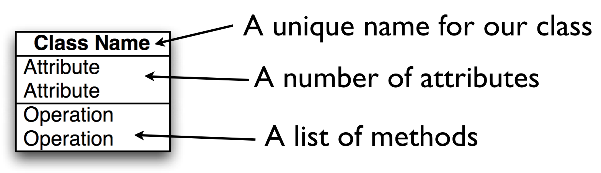
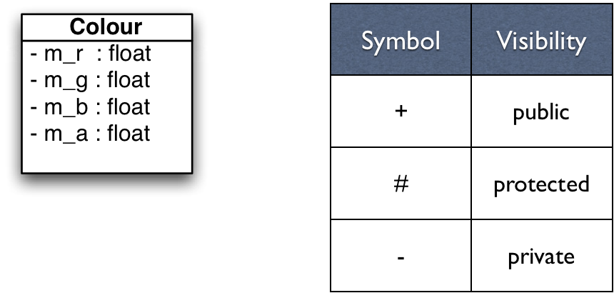
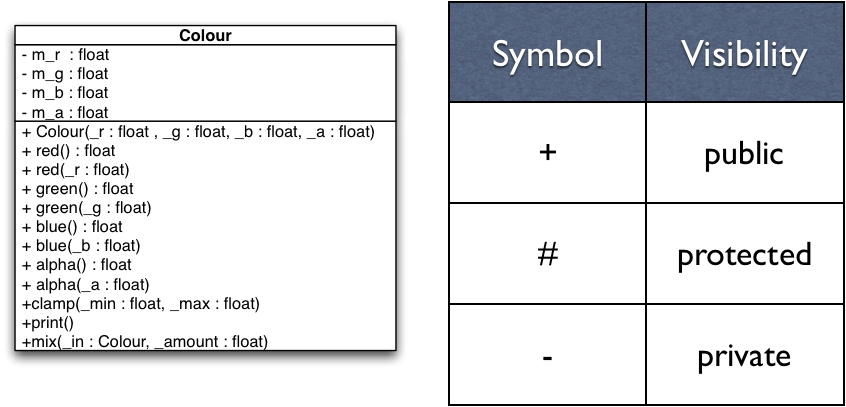

# Classes in C++
Jon Macey

jmacey@bournemouth.ac.uk

---


## Classes
- The structure data type can be used in both C and C++
- It is usually used to store only data, [however can also contain functions](https://github.com/NCCA/ASELectureCode/blob/master/Lecture2/struct3.cpp).
- In C++ we store the data and the operation that can be performed on that data together in the same entity.
- This entity is know as a class

--

## The Anatomy of a class
- A Class has two parts
	- a private (hidden) part
	- a public interface 
- The public part defines the behaviour of the object (methods)
- The private part contains the data (attributes)
- It is normal practice to put attributes in the private part of the class where they can only be accessed by methods

--

## Special Class Methods
- Methods are functions which operate upon the data in the class
- There are two special methods which allow us to create and destroy any data in the object
  - Constructor (used to set the default attribute values of the object)
  - Destructor (used to clear any memory allocated in the constructor)

--

## Class Access Scope
- Classes allow different levels of access to various elements of the class
- Unlike structure where every element is visible.
- There are 3 areas of access
  - public : visible to all
  - private : hidden and only accessible to the class itself
  - protected : only visible to descendants of the main class (used in Inheritance we shall see this later in the year)


---

# Class Diagrams

<div class="stretch">
<iframe src="/jmacey/DesignPatterns/lecture1/Inheritance1.html" style="border:0px #FFFFFF solid;" name="code" scrolling="yes" frameborder="1" marginheight="0px" marginwidth="0px" height="100%" width="100%"></iframe>
</div>

--

#Associations
- Represents the relation from one class to another
- Most association will be 
  - Has
  - Owns
  - Uses
- In C++ it often translates to a member
- Try to be more explicit
  - Renders to
  - Reflects
  - Supports

--

# Associations
- The numbers
  - How many X can Y have
  - How many Y can X have
- Syntax
  - 0..1 May have ONE, or NONE
  - 0..* May have SEVERAL, including NONE
  - 1 Has ONE and only ONE
  - 1..* Has at least ONE, but can have SEVERAL

--


# Composition

<div class="stretch" >
<iframe src="/jmacey/DesignPatterns/lecture1/composition.html" style="border:0px #FFFFFF solid;" name="code" scrolling="yes" frameborder="1" marginheight="0px" marginwidth="0px" height="100%" width="100%"></iframe>
</div>

- Use a filled diamond it always gives a multiplicity of 1 or 0..1
- This implies ownership and when the car is destroyed so is the Engine

--

# Aggregation

<div class="stretch" >
<iframe src="/jmacey/DesignPatterns/lecture1/aggregation.html" style="border:0px #FFFFFF solid;" name="code" scrolling="yes" frameborder="1" marginheight="0px" marginwidth="0px" height="100%" width="100%"></iframe>
</div>

- Aggregation differs from composition as it doesn’t necessarily imply ownership.
- This is usually implemented by containing a reference to another object where the lifetime is determined elsewhere
- This implies a pointer (or smart pointer) of some kind

--

# Generalisation
- In C++ this translates to inheritance
- Sometimes we have classes so general they can’t be created (Abstract classes)
- The hierarchy goes from Generalisation to specialisation
- Use a lot in things like Qt [QOBJECT](http://doc.qt.io/qt-5/qobject.html)


---

## methods
- Methods are functions which operate upon the data in the class
- There are two special methods which allow us to create and destroy any data in the object
	- Constructor (used to set the default attribute values of the object)
 	- Destructor (used to clear any memory allocated in the constructor)

--

## Class Access Scope
- Classes allow different levels of access to various elements of the class
- Unlike structure where every element is visible.
- There are 3 areas of access
	- public : visible to all
	- private : hidden and only accessible to the class itself
	- protected : only visible to descendants of the main class (used in Inheritance we shall see this later in the lecture series)

--

## mutable vs immutable
- A mutable object is one where the data may be modified after creation.
- An immutable object once created may not be modified
- We can further add to this distinction by mixing elements of both in a class
- Methods may also be tagged to say if they modify the internal state of the class or not. 
- This is a form of C++ etiquette know as “[const correctness](https://isocpp.org/wiki/faq/const-correctness)” whilst not mandated by the language it should be considered as part of the design of our classes and methods.
- Adding const correctness at a later date is usually very painful 

---

## Unified Modelling Language (UML) 

- Unified Modelling Language (UML) is a standardised general-purpose modelling language
- UML has a number of graphical element which allows us to describe various components of a software system in a standardised way
- We shall use the UML notation for class diagram when designing our classes as well as other elements from the UML 2.x standard

--

# UML Classes



--

## Specifying Attributes
- attributes are specified in the following way
- ```[visibility] name : [data type] ```
- data type is any class type or built in data type



--

## Specifying Methods
- Methods are defined as follows
- ```[visibility] Name( [param] ) : [return type]```
- ```param := [name] : [data type]```
- can have param,param ... 


--

## Accessors and Mutators
- In the previous example we had the methods below
- These methods are know as 
	- Accessors (or get methods) the one returning the value
	- Mutators (or set methods ) which is used to set the class attribute value
- You will notice the get method has a const at the end of the definition as it doesn’t mutate the class

```
float red() const {return m_r;}
void  red(float _r){m_r=_r;}
```

--

## Accessors [(Priess 1998)](http://www.brpreiss.com/books/opus5/html/book.html)
- An accessor is a method that accesses (returns) an attribute of an object but doesn’t modify the object
- In the simplest case, an accessor just returns the value of one of the attributes. 
- In general, an accessor performs some computation using the attributes as long as that computation does not modify any of the attributes.

--

## Mutators [(Priess 1998)](http://www.brpreiss.com/books/opus5/html/book.html)
- A mutator is a method that can modify an object. 
- In the simplest case, a mutator just assigns a new value to one of the attributes. 
- In general, a mutator performs some computation and modifies any number of attributes.

---

## Classes	
- It is standard practice to split the class into two separate files.
- A .h (.H) Header file is used to define the class and prototype the methods and data for this class.
- A .cpp (.C) file is used to contain the actual class code and algorithmic elements.
- To link these two elements together we need to tell the compiler which class the methods in the .cpp file belong to.

--

## C++ Scope Resolution Operator [::](https://msdn.microsoft.com/en-us/library/b451xz31.aspx)
- The :: (scope resolution) operator is used to qualify hidden names so that you can still use them. 
- This is how C++ allows us to have different classes with the same member function names (polymorphism)
- We use the :: to imply membership to a particular class and differentiate the different methods / class relationships


--

## [C++ class syntax](http://en.cppreference.com/w/cpp/language/class)

```
#ifndef COLOUR_H_
#define COLOUR_H_
#include <string>
class Colour
{
	public :

		/// \brief constructor passing in r g b components
		/// @param[in]  _r red component
		/// @param[in]  _g green component
		/// @param[in]  _b blue component
		/// @param[in]  _a the alpha component

    inline Colour(  const float _r=0.0, const float _g=0.0, const float _b=0.0, const float _a=1.0  ) :
                     m_r(_r),
                     m_g(_g),
                     m_b(_b),
                     m_a(_a){;}
		/// accesors
		/// @brief get the red component
		/// @returns the red component
		inline float red() const {return m_r;}
		/// @brief get the green component
		/// @returns the green component
		inline float green() const {return m_g;}
		/// @brief get the blue component
		/// @returns the blue component
		inline float blue() const {return m_b;}
		/// @brief get the alpha component
		/// @returns the alpha component
		inline float alpha() const {return m_a;}


		/// mutators
		/// @brief set the red component
		/// @param[in] the red component
		inline void red(	float _r	 ){m_r=_r;}

		/// @brief set the green component
		/// @param[in] the green component
		inline void green( float _g ){m_g=_g;}

		/// @brief set the blue component
		/// @param[i] the blue component
		inline void blue(float _b) {m_b=_b;}

		/// @brief get the alpha component
		/// @param[in] the alpha component
		inline void alpha(float _a ){m_a=_a;}

    /// @brief method to clamp the colour values
    /// between a min and max range
    /// @param [in] _min the minimum intensity value to clamp to
    /// @param [in] _max the max intensisty value to clamp to
    void clamp(float _min,	float _max	);
    /// @brief mix the current colour with the colour passed in
    /// by _in ammount
    /// @param[in] _in the colour to mix
    /// @param[in] _amount the amount to mix this value ranges from 0
    /// don't mix to 1 full _in
    void mix(const Colour &_in,float _amount);
    /// @brief print out the contents of the colour class
    void print() const;

    /// @brief destructor
    ~Colour();
    inline void setName(std::string _n){ m_name=_n; }
    inline std::string getName() const { return m_name;}


		private :
			/// @brief the red colour component
      float m_r;
			/// @brief the green colour component
      float m_g;
			/// @brief the blue colour component
      float m_b;
			/// @brief the alpha colour component
      float m_a;
      /// @brief the name of the class
      std::string m_name;


};

#endif
```

--


## [C++ class syntax](http://en.cppreference.com/w/cpp/language/class)
- we use the ``` class ``` keyword to define a class
- ``` class [name] { }; ```
- ``` { }; ``` scope defines members of the class
	- ``` public : ``` defines publicly visible area
	- ``` private : ```  defines hidden area
- classes are usually defined in a .h file

--

## [inline methods](http://en.cppreference.com/w/cpp/language/inline)
- In the previous example the inline pre-fix is used to tell the compiler that the Colour constructor methods are part of the header file
- This is actually pertinent to older compilers however modern compilers will tend to do their own thing.
- Usually we only use this when we want to define the code in the header. 
- This may also be a factor when defining templates.

--

## [inline methods](http://en.cppreference.com/w/cpp/language/inline)
- Let the compiler do the work ([it can optimise better than us](https://msdn.microsoft.com/en-gb/magazine/dn904673.aspx))
- At -O2 optimisation level the inlining is done when the compiler thinks it is worth doing (a heuristic is used) and if it will not increase the size of the code. 
- At -O3 it is done whenever the compiler thinks it is worth doing, regardless of whether it will increase the size of the code. 
- Additionally, at all levels of optimisation (enabled optimisation that is), static functions that are called only once are inlined.

---

## Constructors (ctor)
- When an object is created there are certain processes which must take place
- Instantiation always involves the allocation of memory for the objects state data.
- The methods do not require and memory as these are consistent for all objects of the class and are handled in the class itself.
- The special method which allocates the memory for an object is know as the 'constructor'
	- There are three basic types of constructor
	- The default constructor
	- User defined Constructor
	- The Copy Constructor

--

## [The default constructor](http://en.cppreference.com/w/cpp/language/default_constructor)
- The default constructor takes no parameters and has no return type
- It performs no processing on the object data just memory allocation
- It will always be called by the compiler if no user defined constructor is provided
- The default constructor is not referred to by the programmer in the class definition

--

## [User Defined Constructors](https://msdn.microsoft.com/en-GB/library/s16xw1a8.aspx)
- These constructors may be used to pass parameter values to the object
- These may be used to set default object values
- It is possible to have more than one constructor in a class passing different parameters
- This is known as “overloading” and gives more flexibility to the way the object can be instantiated

--

## default constructors

```
Colour(  const float _r=0.0, const float _g=0.0, const float _b=0.0, const float _a=1.0  ) :
                     m_r(_r),
                     m_g(_g),
                     m_b(_b),
                     m_a(_a){;}
```

- set each of the attributes to a default value by calling  it’s own ctor
-  yes float has a constructor as do all C++ data types 

```
int a=int(2);
float b=float(4.5f);
```

--

## [C++ 11 in class initialisation](http://en.cppreference.com/w/cpp/language/initializer_list)
- C++ 11 allows you to set attribure values directly in the class
- this is not widely used yet but has many advantages

```
private :
	float m_r=0.0f;
	float m_g=0.0f;
	float m_b=0.0f;
	float m_a=1.0f;
	std::string m_name;

```

--

## [C++ 11 in class initialisation](http://en.cppreference.com/w/cpp/language/initializer_list)
- This saves a bit of typing, but the real benefits come in classes with multiple constructors. Often, all constructors use a common initializer for a member:
- for full explaination see [stroustrup](http://www.stroustrup.com/C++11FAQ.html) section :- In-class member initializers
- [C++ core guidelines has much more depth](http://isocpp.github.io/CppCoreGuidelines/CppCoreGuidelines#S-ctor) 

--

## [copy ctor](http://en.cppreference.com/w/cpp/language/copy_constructor)
- The copy constructor creates a new class as a copy of an existing class
- As the classes are of the same type they both know about each others internal state (private attributes)
- To stop mutation of the class being copied we must make it read only
- To do this we use the const prefix on the ctor parameter being passed in.

--

## [copy ctor](http://en.cppreference.com/w/cpp/language/copy_constructor)

```
Colour(const Colour &_c) : 
							m_r(_c.m_r),
							m_g(_c.m_g),
							m_b(_c.m_b),
							m_a(_c.m_a){}
```
- use const to make the class passed in read only
- use . to access the class attributes
- ```m_r(_c.m_r)``` is basically saying set the current class member ```m_r``` to the value of the parameter passed in ```_c.m_r```

---

## [The Orthodox Canonical class form ( rule of 3)](http://en.cppreference.com/w/cpp/language/rule_of_three)
- As a general rule (and rules are made to be broken) all classes should define four important functions
	- A default constructor :- This is used internally to initialise objects and data members when no other value is avaliable
	- A copy constructor :- This is used , among other places, in the implementation of call-by-value parameters
	- An assignment operator. This is used to assign one value to another.
	- A destructor. This is invoked when an object is deleted. (more of this soon)

--

## Rule of 5 
- C++ 11 gives some new methods of object creation an ownership and gives us a new rule
	- destructor
	- copy constructor
	- move constructor
	- copy assignment operator
	-move assignment operator
- More in a later lecture.

--

## [Vec3 Class example](https://ideone.com/QczvCF)

<div class="stretch">
<iframe src="https://ideone.com/QczvCF"  frameborder=0 width=100% height=586 marginheight=0 marginwidth=0 scrolling=yes  ></iframe>
</div>

--


# References
- Budd, T 2002 “An introduction to Object Oriented programming” 3rd Edition.  Addison Wesley
- Parsons, David. “Object Oriented Programming with C++” Thomson Learning; 2nd edition 8 Nov 2000
- Priess B. “Data Structures and Algorithms with Object-Oriented Design Patterns in C++”  Wiley 1998
- Eckel B.  “Thinking in C++, 2nd ed. Volume 1”  Prentice Hall 2000

--

# Further Reading
- http://en.wikipedia.org/wiki/Mutable_object
- http://www.parashift.com/c++-faq-lite/const-correctness.html
- http://en.wikipedia.org/wiki/Unified_Modeling_Language
- http://en.wikipedia.org/wiki/Class_diagram
- http://www.ibm.com/developerworks/rational/library/content/RationalEdge/sep04/bell/
- http://www.parashift.com/c++-faq-lite/inline-functions.html


