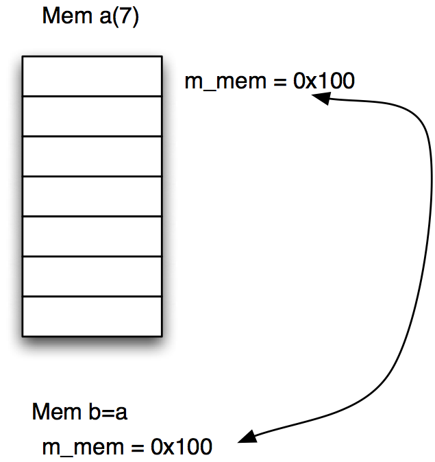

# Object Lifetimes
Jon Macey

jmacey@bournemouth.ac.uk

---


# [L-Values and R-Values](https://goo.gl/sWQRJd)
- Every C++ expression is either an lvalue or an rvalue. 
- An lvalue refers to an object that persists beyond a single expression. You can think of an lvalue as an object that has a name. 
- All variables, including const variables, are lvalues. 
- An rvalue is a temporary value that does not persist beyond the expression that uses it. 
- To better understand the difference between lvalues and rvalues, consider the following example:

--

# [L-Values and R-Values](https://goo.gl/sWQRJd)

```
#include <iostream>
#include <cstdlib>

int main()
{
	int x=3+4;
	std::cout << x << '\n';
	return EXIT_SUCCESS;
}
```

- In this example x is an l-values as it persists beyond the definition
- 3+4 is an r-value as it evaluates temporarily before being assigned to the l-value x

--

# [L-Values and R-Values](https://msdn.microsoft.com/en-gb/library/f90831hc.aspx)

```
int main()
{
   int i, j, *p;

   // Correct usage: the variable i is an lvalue.
   i = 7;

   // Incorrect usage: The left operand must be an lvalue (C2106).
   7 = i; // C2106
   j * 4 = 7; // C2106

   // Correct usage: the dereferenced pointer is an lvalue.
   *p = i; 

   const int ci = 7;
   // Incorrect usage: the variable is a non-modifiable lvalue (C3892).
   ci = 9; // C3892

   // Correct usage: the conditional operator returns an lvalue.
   ((i < 3) ? i : j) = 7;
}
```
```
lvalues2.cpp:11:4: error: expression is not assignable
 7 = i; // C2106
 ~ ^
lvalues2.cpp:12:8: error: expression is not assignable
 j * 4 = 7; // C2106
 ~~~~~ ^
lvalues2.cpp:19:5: error: read-only variable is not assignable
 ci = 9; // C3892
 ~~ ^
```

--

# [References are Aliases not Pointers](http://www.haroldserrano.com/blog/c-tip-16-references-are-aliases-not-pointers)
- A reference is another name for an existing object.
	- They are not pointers!
	- There are no null references all references require initialisation

```
ref1.cpp:8:7: error: declaration of reference variable 'x' requires an initializer
        int &x;
             ^
1 error generated.
```

--

#& and C++

- In C++ the ```&``` is an explicit reference
- This means that the object passed using the & prefix is effectively a pointer but we are not using the * prefix as used in C
- In C++ ```*_a``` indicates that the value is a pointer and we may modify it in a function
- In C++ ```&_a``` is a reference (means we don’t copy the value) but still behaves like a pointer
- const ```&_a``` means that it is a constant reference to a value. This means it is copied like a pointer but is read only.

--

# [swap.c](https://github.com/NCCA/ASELectureCode/blob/master/Lecture3/swap.c)

```
#include <stdio.h>
#include <stdlib.h>


void swap(int *a, int *b)
{
	int tmp=*b;
	*b=*a;
	*a=tmp;
}

int main()
{
	int a=10;
	int b=20;
	printf("%d %d \n",a,b);
	swap(&a,&b);
	printf("%d %d \n",a,b);
}
```

--

## [swap.cpp](https://github.com/NCCA/ASELectureCode/blob/master/Lecture3/swap.c)

```
#include <iostream>
#include <cstdlib>

void swap(int &a, int &b)
{
	int tmp=b;
	b=a;
	a=tmp;
}

int main()
{
	int a=10;
	int b=20;
	std::cout<<a<<' '<<b<<'\n';
	swap(a,b);
	std::cout<<a<<' '<<b<<'\n';
	return EXIT_SUCCESS;
}

```

--

# [References are Aliases not Pointers](http://www.haroldserrano.com/blog/c-tip-16-references-are-aliases-not-pointers)


- A reference is an alias for an object that already exists prior to the initialisation of the reference
- Once a reference is initialised to refer to a particular object, it cannot later be made to refer to a different object;
- a reference is bound to the initialiser.

---

# [Dynamic memory Allocation](https://en.wikipedia.org/wiki/C_dynamic_memory_allocation)
- When we dynamically allocate memory in a C program we allocate to the heap.
- This means that the data will be persistent throughout the program lifetime.
- This means we have to manage this memory ourselves.
- As the OS allocates the memory for us it is possible that we can run out of memory  

--

# C++ memory allocation
- so far we have looked at the C library memory allocation functions.
- there are also version in the C std library in C++

```
#include <cstdlib>
std::malloc()
std::free()
```

- we will also sometimes use malloc and free even in C++ (for example [overloading new](https://www.informit.com/guides/content.aspx?g=cplusplus&seqNum=40))

--

# new / delete 
```
int *data = new int [100];
```
- new is used to allocate new objects in C++, in this case we are constructing an array of int[] objects
- Once this has been done we can access the data as we would a normal array using the [] index operator
- All the normal rules of arrays apply
- Once we have finished with the memory allocated to the pointer we need remove it
- To do this we use the delete [] operation
- if we do not do this it could cause problems as we will see later

--

# [new.cpp](https://github.com/NCCA/ASELectureCode/blob/master/Lecture3/new.cpp)

```
#include <iostream>
#include <cstdlib>

int main()
{
	std::cout<<"enter size of the array\n";
	int size;
	std::cin>>size;

	int *mem= new int[size];
	for(int i=0; i<size; ++i)
		mem[i]=i;

	for(int i=0; i<size; ++i)
		std::cout<<mem[i]<<"\n";

	delete [] mem;

}
```

- note the explicit call to delete here 

---

# pointers and C++ 11

- One of the biggest problems in programming is managing the lifetime of objects.
- Automatic objects are easy because they are destroyed when they go out of scope.
- However it is not always possible to use automatic variables and we need to use pointers.
- One common error when using pointers is forgetting to deallocate them (i.e. call free or delete)

--

# smart pointers (C++ 11)

- C++ 11 introduced an number of smart pointers to help manage the lifetime of raw pointers.
- These should be preferred to using raw pointers.
- [#include &lt;memory&gt; ](http://en.cppreference.com/w/cpp/header/memory)
	- [std::unique_ptr&lt;T&gt; ](http://en.cppreference.com/w/cpp/memory/unique_ptr)
	- [std::shared_ptr&lt;T&gt; ](http://en.cppreference.com/w/cpp/memory/shared_ptr)
- are the most common useage patterns

--

# [RAII](https://en.wikipedia.org/wiki/Resource_Acquisition_Is_Initialization)

- smart pointers are a form of “resource acquisition is initialisation”
- In C++  the only code that can be guaranteed to be executed after an exception is thrown are the dtors of objects residing on the stack.
- Resources are acquired during initialisation as there is no chance of them being used before they are available
- They are released during the destruction of the object

--

# [smartArray.cpp](https://github.com/NCCA/ASELectureCode/blob/master/Lecture3/smartArray.cpp)

```
#include <iostream>
#include <memory>
#include <cstdlib>
#include <algorithm>
#include <numeric>

int main()
{
  constexpr size_t size=10;

  std::unique_ptr<int  []> data ( new int [size]);
  std::iota(&data[0],&data[size],0);
  for(int i=0; i<size; ++i)
    std::cout<<data[i]<<'\n';
  return EXIT_SUCCESS;
}
```

--

# [make_unique c++ 14](http://en.cppreference.com/w/cpp/memory/unique_ptr/make_unique)

```
#include <iostream>
#include <memory>
#include <cstdlib>
#include <algorithm>
#include <numeric>

// on mac use clang++ -std=c++14  -stdlib=libc++ makeUnique.cpp
int main()
{
  constexpr size_t size=10;

  std::unique_ptr<int  []> data = std::make_unique<int[]>(size);
  std::iota(&data[0],&data[size],0);
  for(int i=0; i<size; ++i)
    std::cout<<data[i]<<'\n';
  return EXIT_SUCCESS;
}
```

--

## But what does that have to do with classes?
- We are going to re-visit the colour class from the other week and use this to demonstrate the lifetimes of an object
- We will also see how we can pass messages to the objects and query values from within the object.

--

# self study

- [gotw-89 smart pointers](https://herbsutter.com/2013/05/29/gotw-89-solution-smart-pointers/)
- [new write new and delete again](http://scrupulousabstractions.tumblr.com/post/37576903218/cpp11style-no-new-delete)
 
<iframe width="560" height="315" src="https://www.youtube.com/embed/xnqTKD8uD64" frameborder="0" allowfullscreen></iframe>

---

## Colour Class


--

## [accessors (get Methods)](http://stackoverflow.com/questions/3647438/conventions-for-accessor-methods-getters-and-setters-in-c)
- in our colour class these are the accessors 
```
float red() const {return m_r;}
float green() const {return m_g;}
float blue() const {return m_b;}
float alpha() const {return m_a;}
```
- what is wrong with this re the coding standard?
- what is wrong with this re speed and usage of the class?

--

# mutators (set Methods)
```
void red( float _r ){m_r=_r;}
void green( float _g ){m_g=_g;}
void blue(float _b) {m_b=_b;}
void alpha(float _a ){m_a=_a;}
```
- the mutators modify the class and hence can’t be const

--

## print method
```
// in .h 
void print() const;
// in .cpp
void Colour::print() const
{
	std::cout<<"["<<m_r<<","<<m_g<<" "<<m_b<<" "<<m_a<<"]\n";
}
```
- :: is know as the scope resolution operator
- it is used to link members of the class together
- in this case Colour::print() says that this method print belongs to the class Colour

--

# clamp
- Again the :: Scope resolution operator is used to say that the method clamp belongs to the class Colour
```
// in .h
void clamp(float _min,	float _max	);
// in .cpp
void Colour::clamp(float _min,	float _max)
{
	m_r<_min ? m_r = _min : m_r;
	m_r>_max ? m_r = _max : m_r;

	m_g<_min ? m_g = _min : m_g;
	m_g>_max ? m_g = _max : m_g;

	m_b<_min ? m_b = _min : m_b;
	m_b>_max ? m_b = _max : m_b;

	m_a<_min ? m_a = _min : m_a;
	m_a>_max ? m_a = _max : m_a;
}
```
- note C++ 17 now has a std::clamp

--

## ?: what?
- The ?: construct is called an “arithmetic if”  or a “conditional expression” (Stroustrup 2009)
- It works by doing a test (bool expression) ? [true] : [false]
- This saves us writing long expressions or functions
- For example 
```
(a>=b) ? a:b;
int max(int _a, int _b)
{
	int m;
	if (a>=b)
		m=a; 
	else
		m=b; 
	return m;
}
```

--

## Linear Interpolation
- We can use linear interpolation to blend between two values using a real scalar value which ranges from 0.0 - 1.0
- The basic formula given two values a and b and the real scalar t we get 
$$ p=a+(b-a)\times t $$

--

## mix
- This function is doing basic linear interpolation of each of the colour components (leaving the alpha as the original)

```
void Colour::mix(const Colour &_in,float _amount)
{
  assert(_amount >=0 && _amount <=1);
	m_r=m_r+(_in.m_r-m_r)*_amount;
	m_g=m_g+(_in.m_g-m_g)*_amount;
	m_b=m_b+(_in.m_b-m_b)*_amount;

}
```

--

## [assert](http://en.cppreference.com/w/cpp/error/assert)
- The assert function is a C++ macro which test the statement and if it evaluates to false will abort the program
- The assert macro is used for developing programs and testing for programmers
- We can disable it by defining the NDEBUG flag as part of our compile options (more of this in the lab session)
- Add DEFINES+= NDEBUG to the Qt Project

```
white.Mix(red,2.2);
Assertion failed: (_amount >=0 && _amount <=1), function Mix, file src/Colour.cpp, line 30.
```

--

# Using the Class	

-  No we have defined the class we can use it to create different objects for us to use.
- Each of the objects must have some way of being referred to to we can differentiate it from the others
- The simplest way of doing this is by using a simple name as show in the next example

--

```
#include <iostream>
#include <cstdlib>

#include "Colour.h"

int main()
{

Colour red(1.0,0.0,0.0);
red.setName("red");
Colour green(0.0f,1.0,0.0f);
green.setName("green");

for(int i=0; i<10; ++i)
{
  Colour white(1.0f,1.0f,1.0f);
  Colour e(1,2,2,2);
  e.setName("e");
  e.print();
  white.setName("white");
  white.print();
}
red.print();


green.print();
red.mix(green,0.5);
red.print();
red.blue(1.0);
red.clamp(0.6,0.8);
red.print();
}
```

--

# Objects

- Each of these Colour Objects are completely different instances of the class Colour
- Each one has it’s own name and it’s own memory space
- They are however each identical in the respect that they contain the same attributes (i.e. m_r etc) and each have the same methods which may be invoked.
- Each one of these objects has it’s own lifetime which is constrained within the { } of the main program
- These are called automatic objects (created on the stack)

--

# [The destructor](http://en.cppreference.com/w/cpp/language/destructor)
- The destructor is called when an object is destroyed
- The responsibility of the destructor is to cleanup after the object and de-allocate any memory that the object has created
- In this case the object doesn’t create any memory so the following example is illustrative rather than functional
- As a general rule is you allocate anything dynamically in the class you need a dtor. 
- Even better use a smart pointer!

--

# Automatic Objects
```
#include <iostream>
#include <cstdlib>
#include "Colour.h"
int main()
{
Colour red(1.0f,0.0f,0.0f);
{
  Colour green(0.0f,1.0f,0.0f);
  green.Print();
  {
     Colour white(1.0f,1.0f,1.0f);
     white.Print();
  }
 red.Print();
}
}
```
- In this case the automatic objects will fall out of scope when they meet the end brace where they are defined

--

## Automatic Objects

- This will then automatically call the destructor (dtor)
 - In this case green is first  
 - followed by white
 - finally red
```
[0,1 0 1]
[1,1 1 1]
dtor called 
[1,0 0 1]
dtor called 
dtor called 
```

--

## Dynamic Objects
- In a lot of cases dynamic objects will be fine, however we may need to dynamically create our objects and control their lifetimes within the program
- To do this we need to have a way to create and destroy our objects on the fly and re-allocate them at will
- This involves the use of pointers as show in the next example

--

## Dynamic Objects

```
#include <iostream>
#include <cstdlib>

#include "Colour.h"

int main()
{

Colour *current;
current = new Colour(1,0,0);
current->setName("red");
current->print();

delete current;


current = new Colour(1,1,1);
current->setName("white");
current->print();

delete current;

}

```

---

## Why use a destructor?
- In the previous example the dtor just printed out that it had been called
- The following example will show the real reason for the dtor
- The class allocates a block of dynamic memory when it is created
- When it is destroyed we need to free this memory so the destructor does this
- We also implement a “deep copy” constructor

--

# Mem.h

```
#ifndef MEM_H_
#define MEM_H_

/// @brief a class to allocate dynamic integers
/// demonstrates the use of the destructor
class Mem
{
	public :
		/// @brief ctor passing in the size of the memory
    /// @param[in] _size the size of the array to alloc
    Mem(int _size );
    /// @brief copy ctor explicitly copies the data
		/// @param [in] _m the Mem object to copy
		Mem( const Mem &_m );
    /// @brief dtor will deallocate m_mem if allocated
		~Mem();
    /// @param method to print out the memory
    void print();
    /// @param method to set the data value in the array
    /// @param[in] _offset the index into the memory array
    /// this is validated with an assert
    /// @param[in] _value the value to set m_mem[_offset] too
    void set(int _offset,int _value);

  private :
    /// @brief a pointer to the memory
    int *m_mem;
    /// @brief the size of the memory array
    int m_size;
};

#endif
```

--

## Mem.cpp

```
#include "Mem.h"
#include <iostream>
#include <cassert>

Mem::Mem( int _size )
{
  std::cout<<"ctor called\n";
  // allocate a new block of memory
  m_mem = new int[_size];
  // retain the size of the allocated block
  m_size=_size;
}

Mem::Mem( const Mem &_m  )
{
  std::cout<<"Copy ctor Called\n";
  m_size=_m.m_size;
  // allocate new memory
  m_mem = new int[m_size];
  // now copy the data from the original
  // using a loop here but could use memcpy or std::copy is using an stl container
  for(int i=0; i<m_size; ++i)
  {
    m_mem[i]=_m.m_mem[i];
  }
//  m_size=_m.m_size;
//  m_mem=_m.m_mem;
}

Mem::~Mem()
{
  std::cout<<"dtor called\n";
  if(m_mem !=0)
  {
    delete [] m_mem;
  }
}


void Mem::print()
{
  for(int i=0; i<m_size; ++i)
  {
    std::cout<<m_mem[i]<<std::endl;
  }
}
void Mem::set( int _offset,  int _value )
{
  assert(_offset<m_size);
  m_mem[_offset]=_value;
}

```

--


## Shallow Copy
- In a shallow copy we just copy the memory address of the first class to that of the second class
- This means that the second class shares the data with the first
- If the first is destroyed then this memory is no longer valid
- In most cases this is not desirable

--


## Shallow Copy


--

## Deep Copy
- With a deep copy the object allocates the same amount of space for the memory
- Then each element is copied from the original to the new one

--

## Deep Copy


---

# References
- Budd, T 2002 “An introduction to Object Oriented programming” 3rd Edition.  Addison Wesley
- Parsons, David. “Object Oriented Programming with C++” Thomson Learning; 2nd edition 8 Nov 2000
- Priess B. “Data Structures and Algorithms with Object-Oriented Design Patterns in C++”  Wiley 1998
- Eckel B.  “Thinking in C++, 2nd ed. Volume 1”  Prentice Hall 2000

--

# Further Reading
- http://en.wikipedia.org/wiki/Mutable_object
- http://www.parashift.com/c++-faq-lite/const-correctness.html
- http://en.wikipedia.org/wiki/Unified_Modeling_Language
- http://en.wikipedia.org/wiki/Class_diagram
- http://www.ibm.com/developerworks/rational/library/content/RationalEdge/sep04/bell/
- http://www.parashift.com/c++-faq-lite/inline-functions.html


