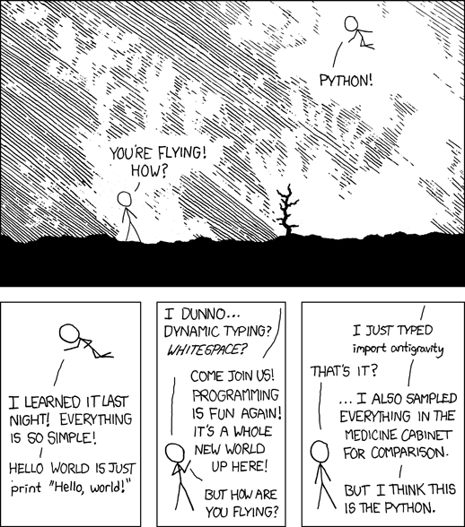
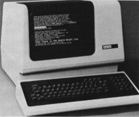
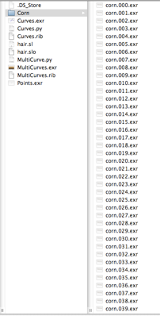
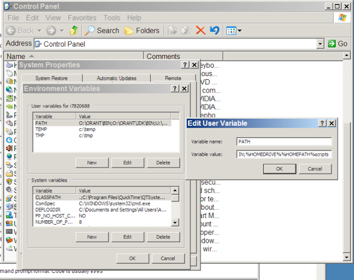
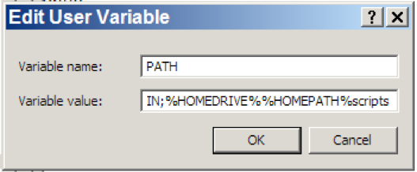
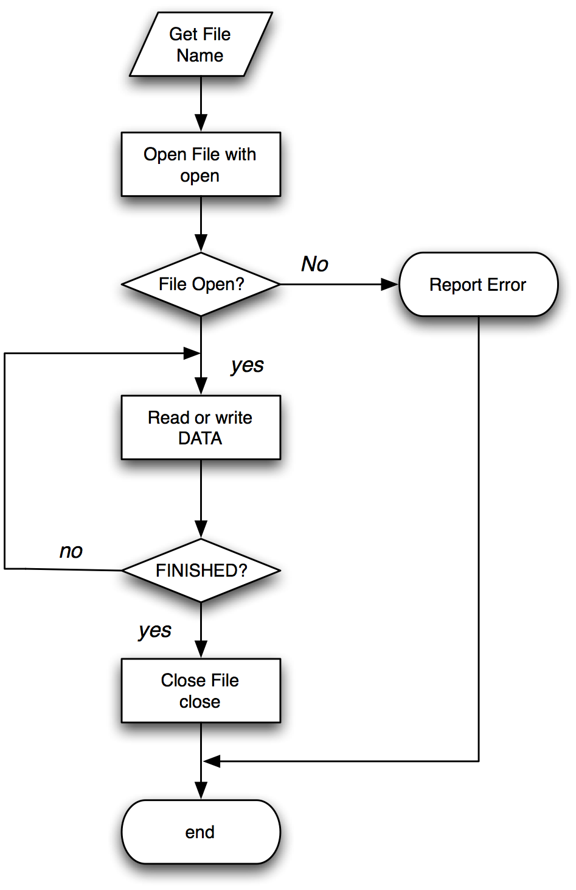

# Introduction to Python

<p/>Jon Macey <br/>

<p/>jmacey@bournemouth.ac.uk

---

## Python
  - python is a very flexible programming language, it can be used in a number of different ways.
  - Most of our animation packages allow for embedded python scripting
  - We can also write complex programs which run stand alone, and if written correctly can run on all operating systems


---


##Hello World

<div class="stretch">
<iframe src="helloWorldPy.html" style="border:0px #FFFFFF solid;" name="code" scrolling="yes" frameborder="1" marginheight="0px" marginwidth="0px" height="100%" width="100%"></iframe>
</div>

--

##import this

<div class="stretch">
<iframe src="importThis.html" style="border:0px #FFFFFF solid;" name="code" scrolling="yes" frameborder="1" marginheight="0px" marginwidth="0px" height="100%" width="100%"></iframe>
</div>

--

## import antigravity


- [python easter eggs](http://digitizor.com/easter-eggs-in-python/)

---

## Lecture Series Outline

- Some basic python commands and techniques
- Interaction with the operating system
- Reading and Writing data to files
- Object Orientation in Python
- Some basic python for the major animation packages 

--

## Getting started
- At it’s simplest level python can be used as a simple command interpreter
- We type python into the console and we get a prompt which lets us enter commands
- If nothing else we can use this as a basic calculator
- It is also useful for trying simple bits of code which we wish to put into a larger system


--

## Keywords

- The following identifiers are keywords in python and must not be used as identifiers
``` python
and       del       from      not       while
as        elif      global    or        with
assert    else      if        pass      yield
break     except    import    print
class     exec      in        raise
continue  finally   is        return
def       for       lambda    try
```

--

## Data Types

- Python is a dynamically typed language, this means that variable values are checked at run-time (sometimes known as “lazy binding”). 
- All variables in Python hold references to objects, and these references are passed to functions by value.
- Python has 5 standard data types
  - numbers, string, list, tuple, dictionary

--

## Numbers

- Python supports four different numerical types:
  - int (signed integers)
  - long (long integers [can also be represented in octal and hexadecimal])
  - float (floating point real values)
  - complex (complex numbers)


--


  ## [numbers](https://github.com/NCCA/DemoPythonCode/blob/master/Basic/numbers.py)

<div class="stretch">
<iframe src="numbers.html" style="border:0px #FFFFFF solid;" name="code" scrolling="yes" frameborder="1" marginheight="0px" marginwidth="0px" height="100%" width="100%"></iframe>
</div>

--

## Strings
 - Python strings are immutable
 - Python allows for either pairs of single or double quotes
 - Subsets of strings can be taken using the slice operator ( [ ] and [ : ] ) with indexes starting at 0 in the beginning of the string and working their way from -1 at the end
 - The plus ( + ) sign is the string concatenation operator, and the asterisk ( * ) is the repetition operator.

--

## [Strings](https://github.com/NCCA/DemoPythonCode/blob/master/Basic/strings.py) 

 <div class="stretch">
<iframe src="strings.html" style="border:0px #FFFFFF solid;" name="code" scrolling="yes" frameborder="1" marginheight="0px" marginwidth="0px" height="100%" width="100%"></iframe>
</div>

--

## Lists

  - A list is the most common of the Python data containers / types. 
  - It can hold mixed data, include lists of lists
  - A list is contained within the [] brackets and is analogous to C arrays
  - Like a string data is accessed using the slice operator ( [ ] and [ : ] ) with indexes starting at 0 in the beginning of the list and working their way to end-1.
  - The + operator concatenates and the * duplicates

--

## [Lists](https://github.com/NCCA/DemoPythonCode/blob/master/Basic/list.py)

<div class="stretch">
<iframe src="lists.html" style="border:0px #FFFFFF solid;" name="code" scrolling="yes" frameborder="1" marginheight="0px" marginwidth="0px" height="100%" width="100%"></iframe>
</div>

--

## Tuples
- A tuple can be thought of as a read only list.
- it uses parenthesis to contain the list data

--

## [Tuples](https://github.com/NCCA/DemoPythonCode/blob/master/Basic/tuple.py)
<div class="stretch">
<iframe src="tuple.html" style="border:0px #FFFFFF solid;" name="code" scrolling="yes" frameborder="1" marginheight="0px" marginwidth="0px" height="100%" width="100%"></iframe>
</div>

--

## [Slice Operators](https://github.com/NCCA/DemoPythonCode/blob/master/Basic/slice.py)
<div class="stretch">
<iframe src="slice.html" style="border:0px #FFFFFF solid;" name="code" scrolling="yes" frameborder="1" marginheight="0px" marginwidth="0px" height="100%" width="100%"></iframe>
</div>

--

## Python Dictionaries

- Python dictionaries are a powerful key / value data structure which allows the storing of different data types in the same data set
- It is similar to an associative array or hash map in other programming languages
- Many Python API’s use dictionaries to store values and variable length function parameters

--

## [Python Dictionaries](https://github.com/NCCA/DemoPythonCode/blob/master/Basic/dictionary.py)
<div class="stretch">
<iframe src="dictionary.html" style="border:0px #FFFFFF solid;" name="code" scrolling="yes" frameborder="1" marginheight="0px" marginwidth="0px" height="100%" width="100%"></iframe>
</div>

--

## Type Conversion
- Python allows type conversion via a number of functions, the most common are

| Function                | Description                                                          |
|-------------------------|----------------------------------------------------------------------|
| ```int(x ,base)```      | Converts x to an integer. base specifies the base if x is a string   |
| ```long(x,base)```      | Converts x to an long int. base specifies the base if x is a string. |
| ```float(x)```          | Converts x to an float.                                              |
| ```complex(real,img)``` | Generate a complex number                                            |
| ```str(x)```            | Converts x to a string representation                                |

--

## [Type Conversion](https://github.com/NCCA/DemoPythonCode/blob/master/Basic/convert.py)

<div class="stretch">
<iframe src="convert.html" style="border:0px #FFFFFF solid;" name="code" scrolling="yes" frameborder="1" marginheight="0px" marginwidth="0px" height="100%" width="100%"></iframe>
</div>

--

## Python Membership Operators
- There are two membership operators in python “in” and “not in”
- These can be used to test for membership in lists, tuples and strings

--

## [Membership](https://github.com/NCCA/DemoPythonCode/blob/master/Basic/membership.py)

<div class="stretch">
<iframe src="membership.html" style="border:0px #FFFFFF solid;" name="code" scrolling="yes" frameborder="1" marginheight="0px" marginwidth="0px" height="100%" width="100%"></iframe>
</div>

---

## Programming Constructs

- Most programming tasks can be split into a combination of the following elements
  - Sequences
  - Selection
  - Iteration
- Whenever I learn a new language I see how these are represented syntactically as this makes learning the language easier.

--

## Sequences
- As the name suggest a sequence is a fixed set of instructions 
- They are always carried out in the same order
- With the use of functions we can bundle other sequences together to make programs easier to read / maintain
- The following example shows this in action

--

## [Sequences](https://github.com/NCCA/DemoPythonCode/blob/master/Basic/sequence.py)

<div class="stretch">
<iframe src="sequence.html" style="border:0px #FFFFFF solid;" name="code" scrolling="yes" frameborder="1" marginheight="0px" marginwidth="0px" height="100%" width="100%"></iframe>
</div>

--

## [Sequences](https://github.com/NCCA/DemoPythonCode/blob/master/Basic/sequence2.py)

<div class="stretch">
<iframe src="sequence2.html" style="border:0px #FFFFFF solid;" name="code" scrolling="yes" frameborder="1" marginheight="0px" marginwidth="0px" height="100%" width="100%"></iframe>
</div>

--

## Python functions
- In python functions are actually values, this means we can pass functions around like variables
- Python functions also allow for multiple return types (unlike C/C++) this means there is no pass by value / reference type constructs
- Functions are declared using the def keyword and uses the : to indicate the body of the function which must be indented

--

## [function demo 1](https://github.com/NCCA/DemoPythonCode/blob/master/Basic/func1.py)
<div class="stretch">
<iframe src="function1.html" style="border:0px #FFFFFF solid;" name="code" scrolling="yes" frameborder="1" marginheight="0px" marginwidth="0px" height="100%" width="100%"></iframe>
</div>

--

## [function demo 2](https://github.com/NCCA/DemoPythonCode/blob/master/Basic/func2.py)
<div class="stretch">
<iframe src="function2.html" style="border:0px #FFFFFF solid;" name="code" scrolling="yes" frameborder="1" marginheight="0px" marginwidth="0px" height="100%" width="100%"></iframe>
</div>

--

## Selection
- selections allow us to make choices
- most programming languages have at least the if else construct
- some languages have more
- The result of an if operation is a boolean (true / false) value and code is executed or not depending upon these value
- In python we use the following constructs

--

## [Selection](https://github.com/NCCA/DemoPythonCode/blob/master/Basic/selection.py)
<div class="stretch">
<iframe src="selection.html" style="border:0px #FFFFFF solid;" name="code" scrolling="yes" frameborder="1" marginheight="0px" marginwidth="0px" height="100%" width="100%"></iframe>
</div>

--

## Python Comparison Operators
<small>given ```a=10 b=20```</small>

| <small>Operators    </small>              | <small>Description               </small>                                                                 | <small>Example  </small>          |
|----------------------------|--------------------------------------------------------------------------------------------|--------------------|
| <small>```==```    </small>                | <small>equality operator returns true if values are the same </small>                                     | <small>(a==b) is not true  </small>|
| <small>```!=```  </small>                  | <small>not equal operator             </small>                                                            | <small>(a!=b) is true   </small>   |
| <small>```<>``` (now obsolescent)  </small>| <small>Checks if the value of two operands are equal or not   </small>                                    | <small>(a<>b) is true   </small>   |
| <small>```>```    </small>                 | <small>Checks if the value of left operand is greater than the value of right operand  </small>           |  <small>(a>b) is not true  </small> |
| <small>```<```    </small>                 |  <small>Checks if the value of left operand is less than the value of right operand   </small>              |  <small>(a>b) is true     </small>  |
| <small>```>=```    </small>                |  <small>Checks if the value of left operand is greater than or equal to the value of right operand  </small>| <small> (a>=b) is not true </small> |
| <small>```<=```    </small>                |  <small>Checks if the value of left operand is less than or equal to the value of right operand   </small>  | <small> (a<=) is true   </small>    |

--

## Python Logical Operators

<small>given ```a=10 b=20```</small>

| <small>Operators    </small>              | <small>Description               </small>                                                                 | <small>Example  </small>          |
|----------------------------|--------------------------------------------------------------------------------------------|--------------------|
| <small>```and```    </small>                | <small>Logical and </small>                                     | <small>a and b is true  </small>|
| <small>```or```  </small>                  | <small>Logical or             </small>                                                            | <small>a or b is true   </small>   |
| <small>```not``` (now obsolescent)  </small>| <small>Logical not   </small>                                    | <small>not (a and b) is false  </small>   |

--

## Selection

- selections can be embedded to create quite complex hierarchies of “questions”
- This can sometimes make reading code and maintenance hard especially with the python white space rules as code quite quickly becomes complex to read
- We usually prefer to put complex sequences in functions to make the code easier to read / maintain

--

## iteration

- iteration is the ability to repeat sections of code 
- python has two main looping constructs 
  - for each
 - while
- for-each loops operate on ranges of data 
- while loops repeat while a condition is met

--

## [iteration](https://github.com/NCCA/DemoPythonCode/blob/master/Basic/iteration1.py)
<div class="stretch">
<iframe src="iteration1.html" style="border:0px #FFFFFF solid;" name="code" scrolling="yes" frameborder="1" marginheight="0px" marginwidth="0px" height="100%" width="100%"></iframe>
</div>

--

## [iteration](https://github.com/NCCA/DemoPythonCode/blob/master/Basic/iteration.py)
<div class="stretch">
<iframe src="iteration2.html" style="border:0px #FFFFFF solid;" name="code" scrolling="yes" frameborder="1" marginheight="0px" marginwidth="0px" height="100%" width="100%"></iframe>
</div>

--

## Recursion
- Recursion occurs when a thing is defined in terms of itself or of its type
- in programming this usually done by defining a function and call the same function within itself
- obviously we will need some way of escaping this else it will go on forever
- We use this quite a lot in graphics to traverse hierarchies.  

--


## [Recursion](https://github.com/NCCA/DemoPythonCode/blob/master/Basic/recursion.py)
<div class="stretch">
<iframe src="recursion.html" style="border:0px #FFFFFF solid;" name="code" scrolling="yes" frameborder="1" marginheight="0px" marginwidth="0px" height="100%" width="100%"></iframe>
</div>

--

## looping for x and y

- This example shows how we can loop from -10 in the x and y in increments of 0.5
- In C / C++ we would use a for loop
```c++
for(float y=-10.0f; y<10.0f; ++y)
{
    for(float x=-10.0f; x<10.0f; ++x)
    {
      std::cout<<x<<' '<<y<<'\n';
    }
}
```

--

## [looping for x and y](https://github.com/NCCA/DemoPythonCode/blob/master/Basic/floatLoop.py)

<div class="stretch">
<iframe src="floatLoop.html" style="border:0px #FFFFFF solid;" name="code" scrolling="yes" frameborder="1" marginheight="0px" marginwidth="0px" height="100%" width="100%"></iframe>
</div>

--

## [A 'pythonic' loop](https://github.com/NCCA/DemoPythonCode/blob/master/Basic/Loop2.py)

<div class="stretch">
<iframe src="altloop.html" style="border:0px #FFFFFF solid;" name="code" scrolling="yes" frameborder="1" marginheight="0px" marginwidth="0px" height="100%" width="100%"></iframe>
</div>

---

## Built In Functions
<div class="stretch">
<iframe src="https://docs.python.org/2/library/functions.html" style="border:0px #FFFFFF solid;" name="code" scrolling="yes" frameborder="1" marginheight="0px" marginwidth="0px" height="100%" width="100%"></iframe>
</div>

--

## [enumerate](https://github.com/NCCA/DemoPythonCode/blob/master/Basic/enumerate.py)

<div class="stretch">
<iframe src="enumerate.html" style="border:0px #FFFFFF solid;" name="code" scrolling="yes" frameborder="1" marginheight="0px" marginwidth="0px" height="100%" width="100%"></iframe>
</div>

--

## set / frozenset

- A set object is an unordered collection of immutable values. 
- Common uses include membership testing, removing duplicates from a sequence, and computing mathematical operations such as intersection, union, difference, and symmetric difference. 
- sets may be added to, frozen sets may not, however both types may be compared against each other

--

## [set / frozenset](https://github.com/NCCA/DemoPythonCode/blob/master/Basic/set.py)
<div class="stretch">
<small>this doesn't work fully on this system best to run in the shell</small>
<iframe src="set.html" style="border:0px #FFFFFF solid;" name="code" scrolling="yes" frameborder="1" marginheight="0px" marginwidth="0px" height="100%" width="100%"></iframe>
</div>

--

## [lambda](https://github.com/NCCA/DemoPythonCode/blob/master/Basic/lambda.py)
<div class="stretch">

<iframe src="lambda.html" style="border:0px #FFFFFF solid;" name="code" scrolling="yes" frameborder="1" marginheight="0px" marginwidth="0px" height="100%" width="100%"></iframe>
</div>

---

## Programming
- There are many more constructs and techniques we need to apply to create complex programs
- but for now the basic techniques illustrated will be used in most of our code
- For the rest of the lecture we are going to look at how we can execute our own scripts within the different Operating systems we use

--

## A trip back in time

- Early electronic computing (pre 80’s) didn’t have the GUIs we have today.
- This meant that all interactions with the computer were done with typing into a terminal.
- Most modern operating systems still have the option to do this
- In some cases this method is quicker than using the GUI (but does require some additional knowledge)

--

## Example

<div id="mySlideLeft" widht=60%>

</div>    
<div id="mySlideRight" width=80%><small>
  <p data-markdown> - If we wish to rename every file in the tree opposite in a GUI we would have to click on every file and type the new name </p>
  <p data-markdown> - Some Operating Systems allow the automation of GUI tasks but this is still time consuming. </p>
  <p data-markdown> - The answer in most cases is to use another GUI program or to write a script </p>
  <p data-markdown> - Most scripting languages let us access the underlying os commands to do this </p>
</small>
</div>

--

## The Shell
- In windows we can access the command prompt (shell) by typing cmd in the start menu
- In linux we can open a shell by clicking on the shell icon (but if you a real linux user there will be one open all the time!)
- We can then start typing commands, however windows and Unix have different commands for the same action

--

## Shell Commands

| <small/>Command's Purpose                                         | <small/>MS-DOS      | <small/>Linux       | <small/>Basic Linux Example                  |
|-----------------------------------------------------------|-------------|-------------|--------------------------------------|
|<small/> Copies files                                              |<small/> copy        |<small/> cp          |<small/> cp thisfile.txt /home/thisdirectory  |
|<small/> Moves files                                               |<small/> move        |<small/> mv          |<small/> mv thisfile.txt /home/thisdirectory  |
|<small/> List files                                                |<small/> dir         |<small/> ls          |<small/> ls                                   |
|<small/> Clears screen                                             |<small/> cls         |<small/> cls         |<small/> clear                                |
|<small/> Deletes files                                             |<small/> del         |<small/> rm          |<small/> rm thisFile.txt                      |
|<small/> Finds a string of text in a file                          |<small/> find        |<small/> grep        |<small/> grep ImageName *.txt                 |
|<small/> Creates a directory                                       |<small/> mkdir       |<small/> mkdir       |<small/> mkdir images                         |

--

## Shell Commands

| <small/>Command's Purpose                                         | <small/>MS-DOS      | <small/>Linux       | <small/>Basic Linux Example                  |
|-----------------------------------------------------------|-------------|-------------|--------------------------------------|
|<small/> View a file (in shell)                                    |<small/> more        |<small/> less        |<small/> more text.txt (can use less as well) |
|<small/> Renames a file                                            |<small/> ren         |<small/> mv          |<small/> mv this.txt that.txt                 |
|<small/> Displays your location in the file system                 |<small/> chdir       |<small/> pwd         |<small/> pwd                                  |
|<small/> Changes directories with a specified path (absolute path) |<small/> cd pathname |<small/> cd pathname |<small/> cd /directory/directory              |
|<small/> Changes directories with a relative path                  |<small/> cd ..       |<small/> cd ..       |<small/> cd ../images/                        |


--

## Environment Variables
- When we open a shell we are placed in our home directory 
- This place is stored in an Environment variable called
  - $HOME on unix and mac
  - %HOMEPATH% on windows

```bash
echo $HOME
echo %HOMEPATH%

/Users/jmacey
\Users\jmacey
```

--

## Environment Variables
- Environment variables are global system variables available to all processes (i.e. programs)
- Most operating systems have a number of default values set which programs can query to set the way things operate.
- Users can also se their own environment variables to customise how things work.
- It is not uncommon for software packages to install their own environment variables when the program is installed.

--

## Environment Variables
- The PATH environment variable allows us to set a directory where the OS will look for scripts and programs
- We can add a local directory to our system which contains user scripts which can be executed by the user
- The configuration is different for both Windows and Unix

--

## Unix Environment variables

- The default shell used in the linux studios is the bash shell (Bourne again Shell)
- To set environment variable in this shell we use a file called .bashrc which is hidden in the home directory
- if you type gedit ~/.bashrc you can access it 

```bash
export PATH=$PATH:$HOME/scripts
```
- if you re-open the shell this will be made permanent
- Now any program placed in this directory may be found and executed

--

## Windows Environment Variables

- Setting environment variables in windows is different from Unix as we have to use the GUI
- In our studios we can access them from the control panel and students have admin rights to do so
- The following panels show the way to do this

--

## Windows Environment Variables

<div id="mySlideLeft"   >

</div>    
<div id="mySlideRight">
  <p data-markdown> - Select the system variable called Path </p>
  <p data-markdown> - Click on the edit button and the following dialog will be displayed </p>
</div>


--

## Windows Environment Variables


- At the end of the Variable value line add the following

``` bash
;%HOMEDRIVE%%HOMEPATH%scripts
```

- The ; is a separator for the different values

--

## The scripts directory

- Now we have told the system to look in the scripts directory for any scripts to run we need to create this directory
- To do this in the console we do the following where the mkdir command makes a directory

```bash
// Windows
cd %HOMEPATH%
mkdir scripts

// linux
cd
mkdir scripts
```

--

## testing

```python
#!/usr/bin/python

print 'this is working'
```

- Type the above in an editor (or your choice) and save it in the scripts directory as hello.py
- In unix issue the following command in the same directory

```bash
chmod 777 hello.py
```

- now from any directory you should be able to type hello.py to run the script 

--

## [os.environment](https://github.com/NCCA/DemoPythonCode/blob/master/Basic/env.py)

- These need to be run on a machine and not online 

``` python
#!/usr/bin/python
import os

for env in os.environ :
	print "Variable = %s \nValue = %s"%(env, os.environ.get(env))
```

``` python
#!/usr/bin/python
import os

if ( os.environ.get("PROJECTDIR") == "/tmp") :
	print "project ok"
else :
	print "project not ok"
```

--


## The main function

- The main function is a special function for most programming languages 
- It is the first function to be executed and is the entry point for most programs
- The main function is usually passed a set of global system variables called arguments
- These are available through the life of the program and are a good way of passing values to a program

--


## Python main


``` python
#!/usr/bin/python
import sys

def foo(argv=None):
	print "in foo function"
	print "my name is ",__name__


if __name__ == "__main__":
    sys.exit(foo())

```

```python
#!/usr/bin/python
import sys
import foo

def main(argv=None):
	print "in main function"
	print __name__
	foo.foo()


if __name__ == "__main__":
    sys.exit(main())
```

--

## Command Line arguments

- When a program is executed form the command line the whole line typed is passed to the program using the variable argv
- argv is a text string array split based on white space
- The following program show how we can print these values out

--


## [arguments](https://github.com/NCCA/DemoPythonCode/blob/master/Basic/arg.py)

``` python
#!/usr/bin/python
import sys

def main(argv=None):
	if argv is None:
		argv = sys.argv
	for args in argv :
		print args


if __name__ == "__main__":
    sys.exit(main())

```

``` bash
./arg.py hello this is a command line -f -a 1 2 3
hello 
this 
is 
a 
command 
line 
-f 
-a 
1 
2 
3

```

--

## getopt
- The getopt function is used to process a list of arguments in the form 
- -l or -vfx will be split into -v -f -x
- -f [optional argument]
- --help (know as a long option)
- The programmer passes a list of these options and the getopt function will split them (any additional command line values will be ignored)


--

## [getopt](https://github.com/NCCA/DemoPythonCode/blob/master/Basic/getopts.py)

```python

#!/usr/bin/python


import  getopt, sys

def usage() :
	print "to use the program pass -l for long mode"
	print "-f [name] for file mode"

class Usage(Exception):
    def __init__(self, msg):
        self.msg = msg
        print "Unknown Option\n\n"
        usage()

def main(argv=None):
	if argv is None:
		argv = sys.argv
	# process the command line options
	try:
		try:
			opts, args = getopt.getopt(argv[1:], "hlf:s", ["help","long","file=","short"])
		except getopt.error, msg:
			raise Usage(msg)
    	except Usage, err:
			print >>sys.stderr, err.msg
			print >>sys.stderr, "for help use --help"
			return 2

	for opt, arg in opts:
		if opt in ("-l", "--long"):
			print "long mode"
		elif opt in ("-h","--help") :
			usage()
			return
		elif opt in ("-f","--file") :
			print "File Mode name passed ",arg
		elif opt in ("-s","--short") :
			print "short"
	print "Now in Main Program"

if __name__ == "__main__":
    sys.exit(main())
```

--

## The [argparse](https://docs.python.org/2.7/library/argparse.html) module

- The argparse module makes it easy to write user friendly command-line interfaces. 
- The program defines what arguments it requires, and argparse will figure out how to parse those out of sys.argv. 
- The argparse module also automatically generates help and usage messages and issues errors when users give the program invalid arguments.

--

## [ArgParse.py](https://github.com/NCCA/DemoPythonCode/blob/master/Basic/ArgParse.py)

```
#!/usr/bin/python

import sys
import argparse
import inspect

def main(shadingrate=10,pixelvar=0.1,
         fov=48.0,width=1024,height=720,
         integrator='PxrPathTracer',integratorParams={}
        ) :
	args, _, _, _ = inspect.getargvalues(inspect.currentframe()) 
	for arg in args: 
		print arg , locals()[arg]


if __name__ == '__main__':
	parser=argparse.ArgumentParser()
	parser = argparse.ArgumentParser(description='Modify render parameters')

	parser.add_argument('--shadingrate', '-s', nargs='?', 
											const=10.0, default=10.0, type=float,
											help='modify the shading rate default to 10')

	parser.add_argument('--pixelvar', '-p' ,nargs='?', 
											const=0.1, default=0.1,type=float,
											help='modify the pixel variance default  0.1')
	parser.add_argument('--fov', '-f' ,nargs='?', 
											const=48.0, default=48.0,type=float,
											help='projection fov default 48.0')
	parser.add_argument('--width' , '-wd' ,nargs='?', 
											const=1024, default=1024,type=int,
											help='width of image default 1024')
	parser.add_argument('--height', '-ht' ,nargs='?', 
											const=720, default=720,type=int,
											help='height of image default 720')

	parser.add_argument('--rib', '-r' , action='count',help='render to rib not framebuffer')
	parser.add_argument('--default', '-d' , action='count',help='use PxrDefault')
	parser.add_argument('--vcm', '-v' , action='count',help='use PxrVCM')
	parser.add_argument('--direct', '-t' , action='count',help='use PxrDirect')
	parser.add_argument('--wire', '-w' , action='count',help='use PxrVisualizer with wireframe shaded')
	parser.add_argument('--normals', '-n' , action='count',help='use PxrVisualizer with wireframe and Normals')
	parser.add_argument('--st', '-u' , action='count',help='use PxrVisualizer with wireframe and ST')

	args = parser.parse_args()
	if args.rib :
		filename = 'rgb.rib' 
	else :
		filename='__render'

	integratorParams={}
	integrator='PxrPathTracer'
	if args.default :
		integrator='PxrDefault'
	if args.vcm :
		integrator='PxrVCM'
	if args.direct :
		integrator='PxrDirectLighting'
	if args.wire :
		integrator='PxrVisualizer'
		integratorParams={'int wireframe' : [1], 'string style' : ['shaded']}
	if args.normals :
		integrator='PxrVisualizer'
		integratorParams={'int wireframe' : [1], 'string style' : ['normals']}
	if args.st :
		integrator='PxrVisualizer'
		integratorParams={'int wireframe' : [1], 'string style' : ['st']}


	main(args.shadingrate,args.pixelvar,args.fov,args.width,args.height,integrator,integratorParams)
```

--

## The string data type
- Python has a built in string data type which allows us to manipulate text
- Python has the ability to handle both ASCII and Unicode string. 
- For all the examples we are going to work with we will be using only ASCII strings
- The following example shows some basic string manipulation

--

## [demo](https://github.com/NCCA/DemoPythonCode/blob/master/Basic/String1.py)

<div class="stretch">

<iframe src="exr.html" style="border:0px #FFFFFF solid;" name="code" scrolling="yes" frameborder="1" marginheight="0px" marginwidth="0px" height="100%" width="100%"></iframe>
</div>

--

## Format Specifiers
- In the previous example we used the % format specifier to add to a text string the numeric value for the length.
- This is similar to the C syntax for printing values.
- The table on the next page shows the available specifiers 

--

## Format Specifiers

|<small/>Format String	|<small/>Meaning	                                | <small/>Data Type       |
|---------------|-----------------------------------------|-----------------|
|<small/> ```%d``` 	          | <small/>Integer Decimal	                        | <small/>int             |
| <small/>```%o```            | <small/>Octal Decimal	                          | <small/>int             |
|<small/> ```%x```	          | <small/>Hexadecimal 	                          | <small/>int             |
|<small/> ```%f	```           | <small/>Floating Point (Decimal Notation)	      | <small/>float           |
| <small/>```%e``` 	          | <small/>Floating Point (1.E notation)	          | <small/>float           |
| <small/>```%c```            | <small/>First Character or argument is printed	| <small/>char            |
|<small/> ```%s```	          | <small/>Argument is taken to be a string	      | <small/>string          |
|<small/> ```%r```	          | <small/>convert argument to python object	      | <small/>any python type |

--

## [format](https://github.com/NCCA/DemoPythonCode/blob/master/Basic/FormatString.py)

<div class="stretch">
<iframe src="format.html" style="border:0px #FFFFFF solid;" name="code" scrolling="yes" frameborder="1" marginheight="0px" marginwidth="0px" height="100%" width="100%"></iframe>
</div>

--

## Accessing the Filesystem
- The python [os module](https://docs.python.org/2/library/os.html#module-os) contains a number of functions which allow us to access the file system
- This module allows us to create files and directories
- Change directories
- List the contents of a directory
- and much more 

--

## [Accessing the filesystem](https://github.com/NCCA/DemoPythonCode/blob/master/Basic/OS.py)

```python
#!/usr/bin/python

import os
# get our current directory
CWD = os.getcwd()
print CWD
# make a directory
os.mkdir("TestDir")
# change to the new directory
os.chdir("TestDir")
NewDir = os.getcwd()
print NewDir
print os.listdir(CWD)
# change back to CWD 
os.chdir(CWD)
# remove the dir we made
os.rmdir("TestDir")
print os.listdir(CWD)
```

--

## Listing Files in a directory

- The os.listdir() function will return a list of all the files in the current directory
- If we need to identify only a certain type of file we need search the string for the type we are looking for
- The following example identifies only exr files based on the .exr extension

--

## [os.listdir()](https://github.com/NCCA/DemoPythonCode/blob/master/Basic/ListEXR.py)

```python
#!/usr/bin/python

import os

Files=os.listdir(".")

for file in Files :
	if file.endswith(".exr") :
		print file
```

--

## [Rename.py](https://github.com/NCCA/DemoPythonCode/blob/master/Basic/Rename.py)
- The following script uses the previous examples to search for files in the current directory beginning with “name”
- It will then rename the files with the name passed in with the 2nd argument

--

## [Rename.py](https://github.com/NCCA/DemoPythonCode/blob/master/Basic/Rename.py)

```python
#!/usr/bin/python

import os
import shutil
import sys

def Usage() :
	print "Rename OldName NewName"

def main(argv=None):
# check to see if we have enough arguments
	if len(sys.argv) !=3 :
		Usage()
	else :
		# get the old and new file names
		OldName=sys.argv[1]
		NewName=sys.argv[2]
		# get the files in the current directory
		Files=os.listdir(".")
		# for each file
		for file in Files :
			# see if it starts with the old name
			if file.startswith(OldName) :
				# make a copy of the old file name
				oldfile=file;
				# now we break down the string so we can
				# build the new file name
				file=file.split(".")
				file[0]=NewName
				file="%s.%s.%s" %(file[0],file[1],file[2])
				# finally we rename the file (using move)
				shutil.move(oldfile,file)


if __name__ == "__main__":
    sys.exit(main())
```

--

## [shutil](https://docs.python.org/2/library/shutil.html#module-shutil)
- The shutil module offers a number of high-level operations on files and collections of files.
- As different operating systems use different commands this is a good way of doing operating system independent operations
- This allows us to write scripts which will work on all operating systems

--

##  A More Advanced example

- The following example allows us to reformat files structured like Name.xxx.ext
- It has the option to resize the padding .xxx. values to any user specified length (default 4)
- To filter file names so only certain files are converted
- To rename the file as part of the conversion

--

## [repad.py](https://github.com/NCCA/DemoPythonCode/blob/master/Basic/repad.py)

```python
#!/usr/bin/python
from os import *
from os.path import *
import shutil

import os, commands, getopt, sys

def usage() :
	print "**************************************************************************"
	print "repad.py re-number file sequences"
	print "Version 1.0 by jmacey@bmth.ac.uk"
	print "**************************************************************************"
	print "At present it only works for files of the format Name.###.ext\n"
	print "The script will process all files it finds in the current directory "
	print "If only certain files are to be processed use the -f Filter Option"
	print "\nOptions :\n"
	print "-p --pad set the pad level e.g. -p 9 will give the output Example.000000001.tiff"
	print "-f --filter [\"filter\"] only process files containing the text \"filter\""
	print "-r --rename [\"new name\"] rename the file as well\n"
	print "\nThis works on the whole file name so for example :\n"
	print "repad.py -p 5 -f tiff would search for all tiff files"
	print "repad.py -p 6 -f AOPass would search for files containing the text AOPass\""
	print "\n-h --help print this help\n"

class Usage(Exception):
    def __init__(self, msg):
        self.msg = msg
        print "Unknown Option"
        usage()

def main(argv=None):
	if argv is None:
		argv = sys.argv
	# process the command line options
	try:
		try:
			opts, args = getopt.getopt(argv[1:], "hp:f:r:", ["help","pad=","filter=","rename="])
		except getopt.error, msg:
			raise Usage(msg)
    	except Usage, err:
			print >>sys.stderr, err.msg
			print >>sys.stderr, "for help use --help"
			return 2
	# default file pad is 4 i.e. .0001.
	PAD=4
	# by default try and process all files in the directory
	FILTER=False
	# by default dont rename the file as well
	RENAME=False
	RenameString=[]
	# the string to contain the filter text
	FiltString=[]
	for opt, arg in opts:
		# set the padding value converting from the command line string to an int
		if opt in ("-p", "--pad"):
			PAD=int(arg)
		elif opt in ("-h","--help") :
			usage()
			return
		# find the filter string
		elif opt in ("-f","--filter") :
			FILTER=True
			FiltString=arg
		elif opt in ("-r","--rename") :
			RENAME=True
			RenameString=arg


	# ok this is cool (try doing it in C++) we create a string containing our format specifier
	# i.e. %09d (using PAD as the variable to specify the numeric value)
	# this is then used later to pass the value we want for the number of the file
	# this works as Python evaluates as it goes (interprets) the string, also note to use a % in the
	# string we need to use %% (a la C)

	str="%%0%dd" %(PAD)
	# get all the files in the current directory
	FileNames=listdir(".")
	# now loop through all the files
	ConvCount=0
	for Files in FileNames :
		# split the file name into sections
		name=Files.split(".")
		# if filter option has been set see if it is in the string
		if(FILTER== True) :
			if(Files.rfind(FiltString) == -1) :
				continue

		# if we have 3 elements to the filename (not the best check as it could be wrong)
		if len(name) ==3 :
			if(RENAME == True) :
				name[0]=RenameString
			#build the new file name with the padding
			outputname=name[0]+"."+str %(int(name[1]))+"."+name[2]
			# this should be portable over different os's but it basically calls the move / mv command
			# to copy the file to the new name
			shutil.move(Files,outputname)
			ConvCount+=1
	print "Files Converted ",ConvCount


if __name__ == "__main__":
    sys.exit(main())


```

---

## Files
- One of the simplest way of communicating between different packages and different programs is by the use of text files.
- Reading and writing files in python is very simple and allows us to very quickly output elements from one software package to another in an easily readable hence debuggable way.

--

## Files



--

## Stream I/O

- When a file is opened a file descriptor is returned and this file descriptor is used for each subsequent I/O operation, when any operation is carried out on the file descriptor its is known as a stream.
- When a stream is opened the stream object created is used for all subsequent file operations not the file name.

--

## [The open function](https://docs.python.org/2/library/functions.html#open)

```python
# open a file for reading
FILE=open('test.txt','r')

# open a file for writing
FILE=open('text.txt',''w')
```
- The open function takes two parameters
  - The fist is a String for the name of the file to open
  - The 2nd  is the open mode 'r' for reading from a file 'w' for writing to a file

--

## The close method

``` python
FILE.close()
```

- Once a file has been finished with it must be closed.
- This is especially important if we are writing to a file as the OS may be storing these values in memory.
- The close function actually forces the OS to flush the file to disk and closes thing properly

--

## [Example](https://github.com/NCCA/DemoPythonCode/blob/master/Basic/ReadFile.py)

```python
#!/usr/bin/python

import os
import sys

def Usage() :
	print "ReadFile [filename]"

def main(argv=None):
# check to see if we have enough arguments
	if len(sys.argv) !=2 :
		Usage()
	else :
		# get the old and new file names
		FileName=sys.argv[1]
		if (os.path.exists(FileName)) :
			FILE=open(FileName,"r")
			lines=FILE.readlines()
			# now we have read the data close the file
			FILE.close()
			LineNum=0
			for line in lines :
				print "%04d %s" %(LineNum,line),
				LineNum+=1

if __name__ == "__main__":
    sys.exit(main())
```

--

## [write file](https://github.com/NCCA/DemoPythonCode/blob/master/Basic/WriteData.py)
```python
#!/usr/bin/python

import os
import shutil
import sys
# import the uniform function from random
from random import uniform

def Usage() :
	print "WriteData [filename] Number"

def main(argv=None):
# check to see if we have enough arguments
	if len(sys.argv) !=3 :
		Usage()
	else :
		# get the file name to write to
		FileName=sys.argv[1]
		# convert the 2nd argument to an int
		Num=int(sys.argv[2])
		# try to open the file
		try :
			FILE=open(FileName,"w")
		# if this fails catch the error and exit
		except IOError :
			print "Error opening file",FileName
			return
		# loop and create some ranom values to write to the file
		for i in range(0,Num) :
			FILE.write("Point %f %f %f\n" %(uniform(-10,10),uniform(-10,10),uniform(-10,10)) )
		# finally close the file
		FILE.close()
if __name__ == "__main__":
    sys.exit(main())
```

--

## output

```
Point -8.079503 -5.887453 0.477799
Point -8.509921 -1.826855 6.271168
Point 5.899356 9.357611 6.468166
Point 8.883614 -7.286649 -7.365122
Point -6.063683 -4.825969 -3.024902
Point -0.119126 5.620598 5.814827
Point 8.060026 2.640244 -4.197079
Point 8.952118 1.571210 8.069305
Point -9.708913 5.454307 2.763587
Point -2.809199 -5.292178 3.994426
Point 2.788986 4.434073 8.763425
```

--

## Reading the data
- The following example reads the data from the previous program and prints it out.
- As the data is stored on a per line basis we can read it in one hit and then process it

--


## [ReadData](https://github.com/NCCA/DemoPythonCode/blob/master/Basic/ReadData.py)

```python
#!/usr/bin/python

import os
import shutil
import sys
# import the uniform function from random
from random import uniform

def Usage() :
	print "ReadData [filename] "

def main(argv=None):
# check to see if we have enough arguments
	if len(sys.argv) !=2 :
		Usage()
	else :
		# get the file name to write to
		FileName=sys.argv[1]
		# try to open the file
		try :
			FILE=open(FileName,"r")
		# if this fails catch the error and exit
		except IOError :
			print "Error opening file",FileName
			return
		# loop and create some ranom values to write to the file
		Lines=FILE.readlines()
		FILE.close()
		for line in Lines :
			# lets see if the line is a point
			if line.startswith("Point") :
				# now split it and convert it to a numberic value
				line=line.split()
				try :
					x=float(line[1])
					y=float(line[2])
					z=float(line[3])
					print "%f %f %f" %(x,y,z)
				except ValueError :
					print line
if __name__ == "__main__":
    sys.exit(main())
```

---

## Introduction to Object Orientation

- In procedural programming we use
	- data structures to store information
	- function (passing in the structures) to process the information
- This can lead to complex / large function prototypes passing in and out large amounts of data.

--

## Object Oriented Programming
- In OO Programming we tend to combine both the data and the functions that act on them into a single unit.
- We then place an “interface” to this data know as methods which are allowed to act upon the data in a prescribed way.
- The traditional model of OO is to model “real world” objects, however as we shall discuss this is not really the case.

--

### [Object Oriented Programming is Inherently Harmful](http://harmful.cat-v.org/software/OO_programming/)

- “Object-oriented programming is an exceptionally bad idea which could only have originated in California.” – Edsger Dijkstra
- “object-oriented design is the roman numerals of computing.” – Rob Pike
- “The phrase "object-oriented” means a lot of things. Half are obvious, and the other half are mistakes.“ – Paul Graham

--

### [Object Oriented Programming is Inherently Harmful](http://harmful.cat-v.org/software/OO_programming/)

- “Implementation inheritance causes the same intertwining and brittleness that have been observed when goto statements are overused. As a result, OO systems often suffer from complexity and lack of reuse.” – John Ousterhout Scripting, IEEE Computer, March 1998
- “90% of the shit that is popular right now wants to rub its object-oriented nutsack all over my code” – kfx
- “Sometimes, the elegant implementation is just a function. Not a method. Not a class. Not a framework. Just a function.” – John Carmack

--

### [Object Oriented Programming is Inherently Harmful](http://harmful.cat-v.org/software/OO_programming/)


- “The problem with object-oriented languages is they’ve got all this implicit environment that they carry around with them. You wanted a banana but what you got was a gorilla holding the banana and the entire jungle.” – Joe Armstrong
- “I used to be enamored of object-oriented programming. I’m now finding myself leaning toward believing that it is a plot designed to destroy joy.” – Eric Allman

--

### [Object Oriented Programming is Inherently Harmful](http://harmful.cat-v.org/software/OO_programming/)


- OO is the “structured programming” snake oil of the 90' Useful at times, but hardly the “end all” programing paradigm some like to make out of it.
- And, at least in it’s most popular forms, it’s can be extremely harmful and dramatically increase complexity.
- Inheritance is more trouble than it’s worth. Under the doubtful disguise of the holy “code reuse” an insane amount of gratuitous complexity is added to our environment, which makes necessary industrial quantities of syntactical sugar to make the ensuing mess minimally manageable.

--

## Agents and Communities

- An Object Oriented program is structured as a community of interacting agents called objects.
- Each object has a role to play.
- Each object provides a service or performs an action that is used by other members of the community


--

## Patterns

- As we will see when building and designing these communities patterns will appear.
- These “design patterns” can be seen as “a general reusable solution to a commonly occurring problem”
- In OO design patterns typically show relationships and interactions between classes or objects, without specifying the final application classes or objects that are involved.

--

## Messages and Methods

- Actions are initiated in OO programming by the transmission of a message to an agent (an object) responsible for the action.
- The message encodes the request for an action and is accompanied by any additional information (arguments) needed to carry out that request.
- The receiver is the object to whom the message is sent
- If the receiver accepts the message, it also accepts the responsibility to carry out the indicated action.
- In response to a message, the receiver will perform some method to satisfy the request

--

## Object Oriented Concepts (Kay 1993)

1. Everything is an Object.
2. Computation is performed by objects communicating with each other (via messaging)
3. Each Object has it’s own Memory 
4. Every object is an instance of a class.
5. The class is a repository for behaviour associated with an object.
6. Classes are organised into a singly rooted tree structure called the inheritance hierarchy. 

---

## Abstraction 

- In philosophical terminology abstraction is the thought process wherein ideas are distanced from objects.
- Abstraction uses a strategy of simplification of detail, wherein formerly concrete details are left ambiguous, vague, or undefined; thus speaking of things in the abstract demands that the listener have an intuitive or common experience with the speaker, if the speaker expects to be understood 
- "For example, many different things have the property of redness: lots of things are red".


--

## Deductive Abstraction (ZETTL 2008) 
- In the deductive approach to abstraction we move from photographic realism to  the essential qualities of the event


--

## Deductive Abstraction (ZETTL 2008) 
- In the deductive approach to abstraction we move from photographic realism to  the essential qualities of the event


--

## Deductive Abstraction (ZETTL 2008) 
- In the deductive approach to abstraction we move from photographic realism to  the essential qualities of the event


--

## Deductive Abstraction (ZETTL 2008) 
- In the deductive approach to abstraction we move from photographic realism to  the essential qualities of the event


--

## Inductive Abstraction (Zettl 2008)

- In the inductive approach to abstraction we study the formal elements of the subject, and arrange these elements to express the essential qualities  of an event. In this case, we combine lines, circles, and area to build up (inductively) the essence of a cityscape


--

## Inductive Abstraction (Zettl 2008)

- In the inductive approach to abstraction we study the formal elements of the subject, and arrange these elements to express the essential qualities  of an event. In this case, we combine lines, circles, and area to build up (inductively) the essence of a cityscape


--

## Inductive Abstraction (Zettl 2008)

- In the inductive approach to abstraction we study the formal elements of the subject, and arrange these elements to express the essential qualities  of an event. In this case, we combine lines, circles, and area to build up (inductively) the essence of a cityscape


--

## Inductive Abstraction (Zettl 2008)

- In the inductive approach to abstraction we study the formal elements of the subject, and arrange these elements to express the essential qualities  of an event. In this case, we combine lines, circles, and area to build up (inductively) the essence of a cityscape


-- 

## So which approach do we use?
- It depends upon the situation
- Our experience in design and programming
- Factors about the system we are designing
- Factors about development environment.

---

## Object Orientation

- Python is fully object−oriented and supports class inheritance
- Defining a class in Python is simple  as with functions, there is no separate interface definition (as used in languages like c++)
- A Python class starts with the reserved word class, followed by the class name. 
- Technically, that's all that's required, since a class doesn't need to inherit from any other class.

--

## Python Classes

- Typically a Python class is a self contained .py module with all the code for that module contained within it.
- The class may also have special methods to initialise the data and setup any basic functions

```
class ClassName :
  <statement 1>
  .
  .
  .
  <statement N>
```

--

## [A Colour Class](https://github.com/NCCA/DemoPythonCode/blob/master/Classes/Colour.py)

```python
#!/usr/bin/python

class Colour :
	' a very simple colour container'
	def __init__(self,r=0.0,g=0.0,b=0.0,a=1.0) :
		'constructor to set default values'
		self.r=r
		self.g=g
		self.b=b
		self.a=a
		
	def debugprint(self) :
		' method to print out the colour data for debug'
		print '[%f,%f,%f,%f]' %(self.r,self.g,self.b,self.a)


	def mix(self,colour,t) :
		'''method to mix current colour with another by t
		will catch the attribute error and pass back black if
		wrong values are passed
		'''
		c=Colour()
		try :
			c.r=self.r+(colour.r-self.r)*t
			c.g=self.g+(colour.g-self.g)*t
			c.b=self.b+(colour.b-self.b)*t
			c.a=self.a+(colour.a-self.a)*t
		except AttributeError, e:
			pass

		return c
```

--

## [Colour Test](https://github.com/NCCA/DemoPythonCode/blob/master/Classes/ColourTest.py)
```python
#!/usr/bin/python

from Colour import *


red=Colour()
red.r=1.0
red.debugprint()
```

```bash
./ColourTest.py
[1.000000,0.000000,0.000000,1.000000]
```

--

## ```__init__```

- Is the python class initialiser, at it’s simplest level it can be thought of as a constructor but it isn’t!
- The instantiation operation (“calling” a class object) creates an empty object. 
- The ```__init__``` method allows use to set an initial state
- The actual process is the python constructor is ```__new__```
- Python uses automatic two-phase initialisation 
  - ```__new__``` returns a valid but (usually) unpopulated object, 
  - which then has ```__init__``` called on it automatically.

--

  ## methods

- The class methods are defined within the same indentation scope of the rest of the class
- There is no function overloading in Python, meaning that you can't have multiple functions with the same name but different arguments
- The last method defined with a name will be used


--


## self

- There are no shorthands in Python for referencing the object’s members from its methods the method function is declared with an explicit first argument representing the object, which is provided implicitly by the call.
- By convention the first argument of a method is called self. 
- The name self has absolutely no special meaning to Python. 
- Note, however, that by not following the convention your code may be less readable to other Python programmers, and it is also conceivable that a class browser program might be written that relies upon such a convention.

--

## encapsulation

- In python there is no private or protected encapsulation
- We can access all class attributes using the . operator
- We can also declare instance variables where ever we like in the methods (for example ```self.foo=10 ``` in a method will be available once that method has been called)
- By convention it would be best to declare all instance variables (attributes) in the  ```__init__``` method

--

## Making attributes private
- Whilst python doesn’t support private encapsulation we can fake it using name mangling
- If we declare the ```class``` attributes using ```__``` they will be mangled and hidden from the outside of the class
- This is shown in the following example

--

## [Colour Private](https://github.com/NCCA/DemoPythonCode/blob/master/Classes/ColourPrivate.py)

```python
#!/usr/bin/python

class ColourPrivate :
	' a very simple colour container'
	def __init__(self,r=0.0,g=0.0,b=0.0,a=1.0) :
		'constructor to set default values'
		self.__r=r
		self.__g=g
		self.__b=b
		self.__a=a

	def debugprint(self) :
		' method to print out the colour data for debug'
		print '[%f,%f,%f,%f]' %(self.__r,self.__g,self.__b,self.__a)

	def setR(self,r) :
		self.__r=r
	def getR(self) :
		return self.__r

	def setG(self,g) :
		self.__g=g
	def getG(self) :
		return self.__g

	def setB(self,b) :
		self.__b=b
	def getB(self) :
		return self.__b

	def setA(self,a) :
		self.__a=a
	def getA(self) :
		return self.__a

	def mix(self,colour,t) :
		'''method to mix current colour with another by t
		will catch the attribute error and pass back black if
		wrong values are passed
		'''
		c=Colour()
		try :
			c.__r=self.__r+(colour.__r-self.__r)*t
			c.__g=self.__g+(colour.__g-self.__g)*t
			c.__b=self.__b+(colour.__b-self.__b)*t
			c.__a=self.__a+(colour.__a-self.__a)*t
		except AttributeError, e:
			pass

		return c
```

--

## [Private Test](https://github.com/NCCA/DemoPythonCode/blob/master/Classes/ColourPTest.py)

```python
#!/usr/bin/python

from ColourPrivate import *


red=ColourPrivate()
red.__r=1.0
print red.getR()
red.debugprint()
red.setR(1.0)
print red.getR()
```

```bash
./ColourPTest.py
0.0
[0.000000,0.000000,0.000000,1.000000]
1.0
```

--

## [Attribute Access](https://github.com/NCCA/DemoPythonCode/blob/master/Classes/Attrib.py)

```python
#!/usr/bin/python

class Attr :

	def __init__(self,x=1.0,y=1.0) :
		self.x=x
		self.y=y

	def __str__(self) :
		''' this method will return our data when doing something like print v '''
		return "[%r,%r]" %(self.x,self.y)

	def __getattr__(self,name) :
		print "the attrib %r doesn't exist" %(name)
		

	def __setattr__(self,name,value) :
		print "trying to set attribute %r=%r" %(name,value)
		self.__dict__[name] = value

	def __delattr__(self,name) :
		print "trying to delete %r " %(name)


a=Attr(1,1)
print a
print a.w
a.w=99
print a.w

del a.w
```

```bash
trying to set attribute 'x'=1
trying to set attribute 'y'=1
[1,1]
the attrib 'w' doesn't exist
None
trying to set attribute 'w'=99
99
trying to delete 'w'
```

--

## ```__del__```
- ```__del__``` is analogous to the destructor
- It defines behaviour for when an object is garbage collected
- As there is no explicit delete in python it is not always called
- Be careful, however, as there is no guarantee that ```__del__``` will be executed if the object is still alive when the interpreter exits
- ```__del__``` can't serve as a replacement for good coding practice

--

## [del test](https://github.com/NCCA/DemoPythonCode/blob/master/Classes/Del.py)

```python
#!/usr/bin/python

class DelTest :
	def __init__(self) :
		'constructor to set default values'
		print "init"

	def __del__(self) :
		print "deleted"

```

```bash
python
>>> from del import *
>>> d=DelTest()
init
>>> d=1
deleted
>>>
```

--

## [vec3 class](https://github.com/NCCA/DemoPythonCode/blob/master/Classes/Vec3.py)
- The following examples are going to use the following Vec3 class definition

```python
class Vec3 :
	''' a simple Vec3 class for basic 3D calculations etc'''
	def __init__(self,x=0.0,y=0.0,z=0.0) :
		self.x=x
		self.y=y
		self.z=z


	def __str__(self) :
		''' this method will return our data when doing something like print v '''
		return "[%f,%f,%f]" %(self.x,self.y,self.z)

	def __eq__(self,rhs) :
		''' equality test'''
		return self.x == rhs.x and self.y == rhs.y and self.z == rhs.z

	def __ne__(self,rhs) :
		''' not equal test'''
		return self.x != rhs.x or self.y != rhs.y or self.z != rhs.z


	def __add__(self,rhs) :
		''' overloaded + operator for Vec3 = V1+V2'''
		r=Vec3()
		r.x=self.x+rhs.x
		r.y=self.y+rhs.y
		r.z=self.z+rhs.z
		return r

	def __sub__(self,rhs) :
		''' overloaded - operator for Vec3 = V1-V2'''
		r=Vec3()
		r.x=self.x-rhs.x
		r.y=self.y-rhs.y
		r.z=self.z-rhs.z
		return r

	def __mul__(self,rhs) :
		''' overloaded * scalar operator for Vec3 = V1*S'''
		r=Vec3()
		r.x=self.x*rhs
		r.y=self.y*rhs
		r.z=self.z*rhs
		return r

	def __rmul__(self,lhs) :
		''' overloaded * scalar operator for Vec3 = V1*S'''
		r=Vec3()
		r.x=self.x*lhs
		r.y=self.y*lhs
		r.z=self.z*lhs
		return r

	def __iadd__(self,rhs) :
		''' overloaded +- operator for V1+=V2'''
		self.x+=rhs.x
		self.y+=rhs.y
		self.z+=rhs.z
		return self

	def __imul__(self,rhs) :
		''' overloaded *= scalar operator for V1*=2'''
		self.x*=rhs
		self.y*=rhs
		self.z*=rhs
		return self
```

--

## Comparison Operators

- ```__cmp__(self,other)``` is the default comparison operator
- It actually implements behavior for all of the comparison operators (<, ==, !=, etc.)
- It is however best to define your own operators using the individual operator overloads as shown in the next code segment

--

## Comparison Operators

```python
# equality operator ==
__eq__(self,rhs) 
# inequality operator !=
__ne__(self,rhs) 
# less than operator <
__lt__(self,rhs) 
# greater than operator >=
__gt__(self,rhs) 
# less or equal than operator <=
__le__(self,rhs) 
# greater than or equal operator >=
__ge__(self,rhs)

```

--

## ```__str__```
- is used with the built in print function, we can just format the string to do what we want.
- There is also a ```__repr__``` method  used to print a human readable presentation of an object.

--

## Numeric Operators

- The numeric operators are fairly easy, python supports the following operators which take a right hand side argument.

```python
__add__(self, other)
__sub__(self, other)
__mul__(self, other) 
__floordiv__(self, other) 
__div__(self, other) 
__truediv__(self, other) # python 3
__mod__(self, other) 
__divmod__(self, other)
__pow__  # the ** operator
__lshift__(self, other) #<< 
__rshift__(self, other) #>> 
__and__(self, other) # bitwise & 
__or__(self, other) # bitwise | 
__xor__(self, other) # ˆ operator
```

--

## Reflected Operators

- In the previous examples the operators would work like this ```Vec3 * 2``` to make operators that work the other way round we use reflected operators
- In most cases, the result of a reflected operation is the same as its normal equivalent, so you may just end up defining ```__radd__``` as calling ```__add__``` and so on. 

--

## Reflected Operators

```python
__radd__(self, other)
__rsub__(self, other)
__rmul__(self, other) 
__rfloordiv__(self, other) 
__rdiv__(self, other) 
__rtruediv__(self, other) # python 3 
__rmod__(self, other) 
__rdivmod__(self, other)
__rpow__ # the ** operator 
__rlshift__(self, other) #<< 
__rrshift__(self, other) #>> 
__rand__(self, other) # bitwise & 
__ror__(self, other) # bitwise | 
__rxor__(self, other) # ˆ operator

```

--

## Augmented Assignment
- These are the += style operators
```python
__iadd__(self, other)
__isub__(self, other)
__imul__(self, other) 
__ifloordiv__(self, other) 
__idiv__(self, other) 
__itruediv__(self, other) # python 3 
__imod__(self, other) 
__idivmod__(self, other)
__ipow__ # the ** operator 
__ilshift__(self, other) #<< 
__irshift__(self, other) #>> 
__iand__(self, other) # bitwise & 
__ior__(self, other) # bitwise | 
__ixor__(self, other) # ˆ operator
```

--

## Class Representation
- There are quite a few other special class methods that can be used if required

```python
__unicode__(self)
__format__(self, formatstr)
__hash__(self)
__nonzero__(self)
__dir__(self)
__sizeof__(self)
```

--

## Custom Containers

- There are a number of special class methods that allow the defining of our own containers in python
- The first thing we need to decide is if we need a mutable or immutable container.
- For an immutable container we only need to define methods for the len() and access operators []
- For mutable we need to be able to set and delete items in the container.
- Finally we can create iterators if we wish as well.

--

## Custom Containers

```python
__len__(self)
__getitem__(self, key)
__setitem__(self, key, value)
__delitem__(self, key)
__iter__(self)
__reversed__(self)
__contains__(self, item)
__contains__ (self,item)
__missing__(self, key)
```

--

## [Example](https://github.com/NCCA/DemoPythonCode/blob/master/Classes/MyContainer.py)

```python
class MyContainer :
	''' a very simple container class '''
	def __init__(self,data=None) :
		if data is None :
			self.data=[]
		else :
			self.data=data

	def __str__(self) :
		''' method to print out the container contents'''
		return ','.join(map(str, self.data))

	def __len__(self) :
		''' return the length of the data'''
		return len(self.data)

	def __getitem__(self,index) :
		''' access an item in the container a=c[n]'''
		return self.data[index]

	def __setitem__(self,index,value) :
		''' set an item in the container c[n]=v'''
		self.data[index]=value

	def __delitem__(self,index) :
		''' remove an item at n del c[1]'''
		del self.data[index]

	def __iter__(self):
		''' return an iterator to the data item'''
		return iter(self.data)

	def __reversed__(self):
		''' return the reversed version of the data for the reversed function'''
		return MyContainer(reversed(self.data))

	def append(self,value) :
		''' our own append method to add to the data'''
		self.data.append(value)
  ```

--


  ## [Test](https://github.com/NCCA/DemoPythonCode/blob/master/Classes/ContainerTest.py)
  
  ```python

  #!/usr/bin/python

from MyContainer import *

c=MyContainer([1,2,3,4,5,"string","c"])
print c
print "length of c is ",len(c)
c[2]="new value"
print "c[2] is ",c[2]
del c[2]
print "deleted item 2 ",c
print "using the iterator"
for i in c :
	print i

print "using reverse iterator"
for i in reversed(c) :
	print i

c.append(999)
print c
```

--

## output

```bash
1,2,3,4,5,string,c lengthofcis 7
c[2] is new value
deleted item 2 1,2,4,5,string,c using the iterator
1
2
4
5
string
c
using reverse iterator
c
string
5
4
2
1
1,2,4,5,string,c,999                                               
```

--

## Composition and Aggregation

- To build more complex classes we can use composition, we just need to import the correct module


--

## [Colour.py](https://github.com/NCCA/DemoPythonCode/blob/master/Classes/Aggregation/Colour.py)

```python
class Colour:
	# ctor to assign values
	def __init__(self, r=0, g=0, b=0,a=1):
		self.r=float(r)
		self.g=float(g)
		self.b=float(b)
		self.a=float(a)

	# debug print function to print vector values
	def __str__(self):
		return '[%f,%f,%f,%f]' %(self.r,self.g,self.b,self.a)
```

--


## [Point3.py](https://github.com/NCCA/DemoPythonCode/blob/master/Classes/Aggregation/Point3.py)

```python
class Point3:
	# ctor to assign values
	def __init__(self, x=0.0, y=0.0, z=0.0):
		self.x=float(x)
		self.y=float(y)
		self.z=float(z)
	# debug print function to print vector values
	def __str__(self):
		return  '[%f,%f,%d]' %(self.x,self.y,self.z)
```

--

## [Sphere.py](https://github.com/NCCA/DemoPythonCode/blob/master/Classes/Aggregation/Sphere.py)

```python
from Point3 import Point3
from Colour import Colour


class Sphere:
	# ctor to assign values
	def __init__(self, pos=Point3(), colour=Colour(), radius=1,name=""):
		self.pos=pos
		self.colour=colour
		self.radius=radius
		self.name=name

	def Print(self):
		print "Sphere %s" %(self.name)
		print "Radius %d" %(self.radius)
		print "Colour",
		print self.colour
		print "Position ",
		print self.pos

```

--

## [Test](https://github.com/NCCA/DemoPythonCode/blob/master/Classes/Aggregation/SphereTest.py)

```python
#!/usr/bin/python

from Sphere import Point3,Colour,Sphere


#Pos, colour, radius,name
s1=Sphere(Point3(3,0,0),Colour(1,0,0,1),2,"Sphere1")
s1.Print()

p1=Point3(3,4,5)
c1=Colour(1,1,1,1)
s2=Sphere(p1,c1,12,"New")
s2.Print()


s3=Sphere(Point3(3,0,2),Colour(1,0,1,1),2,"Sphere2")
s3.Print()
```

```bash
./SphereTest.py
Sphere Sphere1
Radius 2
Colour [1.000000,0.000000,0.000000,1.000000]
Position  [3.000000,0.000000,0]
Sphere New
Radius 12
Colour [1.000000,1.000000,1.000000,1.000000]
Position  [3.000000,4.000000,5]
Sphere Sphere2
Radius 2
Colour [1.000000,0.000000,1.000000,1.000000]
Position  [3.000000,0.000000,2]
```

--

## Inheritance

- in python inheritance is generated by passing in the parent class(es) to the child class
- This will allow all the base class functions to be accessed or override them if defined in the child
- The first example shows a basic inheritance

--

## [example](https://github.com/NCCA/DemoPythonCode/blob/master/Classes/Inheritance/BasicInheritance.py)
<div class="stretch">
<iframe src="inherit.html" style="border:0px #FFFFFF solid;" name="code" scrolling="yes" frameborder="1" marginheight="0px" marginwidth="0px" height="100%" width="100%"></iframe>
</div>

--

## [over ride](https://github.com/NCCA/DemoPythonCode/blob/master/Classes/Inheritance/OverrideInheritance.py)
<div class="stretch">
<iframe src="inherit2.html" style="border:0px #FFFFFF solid;" name="code" scrolling="yes" frameborder="1" marginheight="0px" marginwidth="0px" height="100%" width="100%"></iframe>
</div>

--

## [over ride constructor](https://github.com/NCCA/DemoPythonCode/blob/master/Classes/Inheritance/InheritCtor.py)
<div class="stretch">
<iframe src="inherit3.html" style="border:0px #FFFFFF solid;" name="code" scrolling="yes" frameborder="1" marginheight="0px" marginwidth="0px" height="100%" width="100%"></iframe>
</div>

---

## References

- [http://vt100.net/docs/tp83/chapter5.html](http://vt100.net/docs/tp83/chapter5.html)
- [http://www.artima.com/weblogs/viewpost.jsp?thread=4829](http://www.artima.com/weblogs/viewpost.jsp?thread=4829)
- [http://www.tutorialspoint.com/python/python_variable_types.htm](http://www.tutorialspoint.com/python/python_variable_types.htm)


--

## References

- [http://en.wikipedia.org/wiki/Environment_variable](http://en.wikipedia.org/wiki/Environment_variable)
- [http://en.wikipedia.org/wiki/Main_function_(programming)](http://en.wikipedia.org/wiki/Main_function_(programming))
- [http://docs.python.org/library/shutil.html](http://docs.python.org/library/shutil.html)
- [http://www.devshed.com/c/a/Python/String-Manipulation/](http://www.devshed.com/c/a/Python/String-Manipulation/)
- [http://docs.python.org/library/string.html](http://docs.python.org/library/string.html)
- [http://www.rafekettler.com/magicmethods.html](http://www.rafekettler.com/magicmethods.html)

